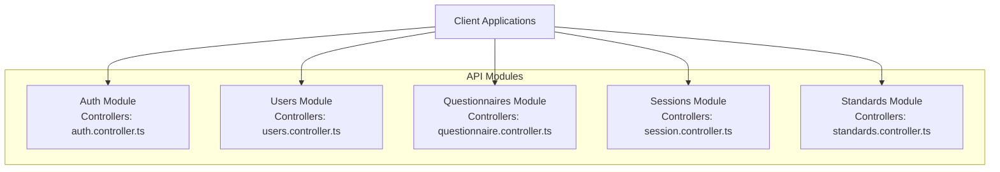
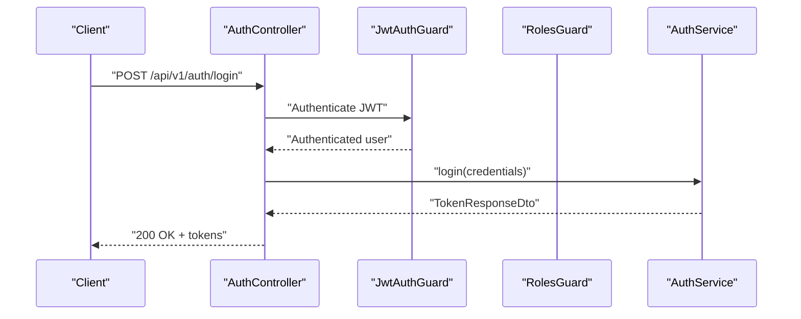
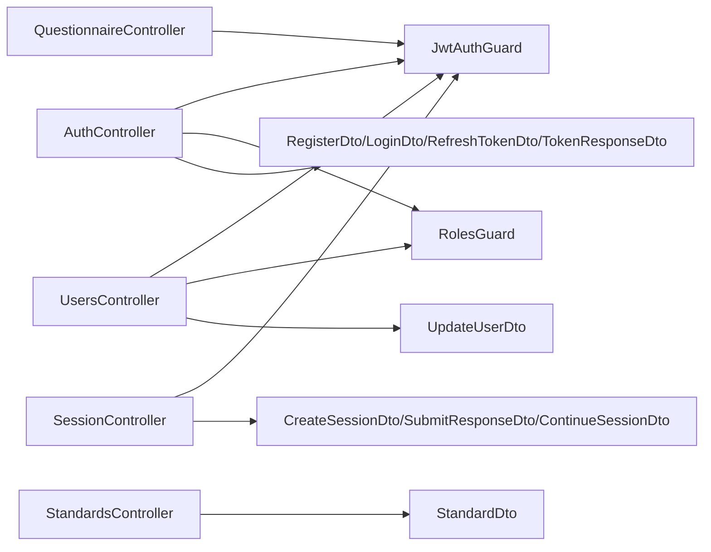
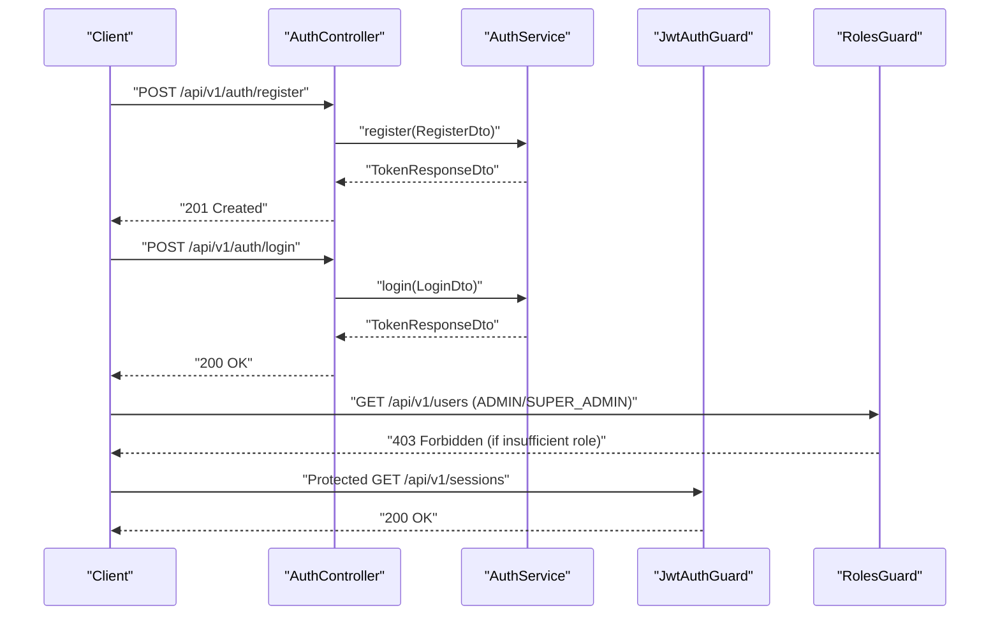

# API Reference

<cite>
**Referenced Files in This Document**
- [auth.controller.ts](file://apps/api/src/modules/auth/auth.controller.ts)
- [register.dto.ts](file://apps/api/src/modules/auth/dto/register.dto.ts)
- [login.dto.ts](file://apps/api/src/modules/auth/dto/login.dto.ts)
- [refresh-token.dto.ts](file://apps/api/src/modules/auth/dto/refresh-token.dto.ts)
- [token.dto.ts](file://apps/api/src/modules/auth/dto/token.dto.ts)
- [jwt-auth.guard.ts](file://apps/api/src/modules/auth/guards/jwt-auth.guard.ts)
- [roles.guard.ts](file://apps/api/src/modules/auth/guards/roles.guard.ts)
- [roles.decorator.ts](file://apps/api/src/modules/auth/decorators/roles.decorator.ts)
- [user.decorator.ts](file://apps/api/src/modules/auth/decorators/user.decorator.ts)
- [public.decorator.ts](file://apps/api/src/modules/auth/decorators/public.decorator.ts)
- [users.controller.ts](file://apps/api/src/modules/users/users.controller.ts)
- [update-user.dto.ts](file://apps/api/src/modules/users/dto/update-user.dto.ts)
- [questionnaire.controller.ts](file://apps/api/src/modules/questionnaire/questionnaire.controller.ts)
- [session.controller.ts](file://apps/api/src/modules/session/session.controller.ts)
- [create-session.dto.ts](file://apps/api/src/modules/session/dto/create-session.dto.ts)
- [submit-response.dto.ts](file://apps/api/src/modules/session/dto/submit-response.dto.ts)
- [continue-session.dto.ts](file://apps/api/src/modules/session/dto/continue-session.dto.ts)
- [standards.controller.ts](file://apps/api/src/modules/standards/standards.controller.ts)
- [standard.dto.ts](file://apps/api/src/modules/standards/dto/standard.dto.ts)
</cite>

## Update Summary
**Changes Made**
- Updated authentication endpoints documentation with comprehensive request/response schemas
- Enhanced session management API documentation with detailed adaptive logic controls
- Expanded standards endpoints coverage with document generation capabilities
- Added comprehensive validation rules and error response documentation
- Updated security considerations and JWT token usage patterns
- Improved client implementation guidelines and common usage patterns

## Table of Contents
1. [Introduction](#introduction)
2. [Project Structure](#project-structure)
3. [Core Components](#core-components)
4. [Architecture Overview](#architecture-overview)
5. [Detailed Component Analysis](#detailed-component-analysis)
6. [Dependency Analysis](#dependency-analysis)
7. [Performance Considerations](#performance-considerations)
8. [Troubleshooting Guide](#troubleshooting-guide)
9. [Conclusion](#conclusion)
10. [Appendices](#appendices)

## Introduction
This document provides comprehensive API documentation for the Quiz-to-build system REST endpoints. It covers authentication, user management, questionnaires, sessions, and standards. For each endpoint, you will find HTTP methods, URL patterns, request/response schemas, authentication requirements, error responses, validation rules, and practical usage guidance. JWT-based authentication and role-based access control are central to the system's security model.

## Project Structure
The API is organized into NestJS modules, each exposing a set of related endpoints:
- Authentication module: registration, login, token refresh, logout, and profile retrieval
- Users module: self-service profile management and administrative listing
- Questionnaires module: discovery and retrieval of available questionnaires
- Sessions module: lifecycle management of quiz sessions, including continuation, response submission, and completion
- Standards module: public access to engineering standards and derived document sections

**Diagram sources**
- [auth.controller.ts](file://apps/api/src/modules/auth/auth.controller.ts#L23-L74)
- [users.controller.ts](file://apps/api/src/modules/users/users.controller.ts#L23-L78)
- [questionnaire.controller.ts](file://apps/api/src/modules/questionnaire/questionnaire.controller.ts#L18-L56)
- [session.controller.ts](file://apps/api/src/modules/session/session.controller.ts#L29-L153)
- [standards.controller.ts](file://apps/api/src/modules/standards/standards.controller.ts#L12-L87)

**Section sources**
- [auth.controller.ts](file://apps/api/src/modules/auth/auth.controller.ts#L23-L74)
- [users.controller.ts](file://apps/api/src/modules/users/users.controller.ts#L23-L78)
- [questionnaire.controller.ts](file://apps/api/src/modules/questionnaire/questionnaire.controller.ts#L18-L56)
- [session.controller.ts](file://apps/api/src/modules/session/session.controller.ts#L29-L153)
- [standards.controller.ts](file://apps/api/src/modules/standards/standards.controller.ts#L12-L87)

## Core Components
- Authentication and Authorization
  - JWT guard enforces bearer token authentication and handles token expiration and invalid token errors.
  - Roles guard restricts endpoints to specific user roles.
  - Decorators enable per-endpoint role requirements and public access bypass.
- Request Validation
  - DTOs define strict validation rules using class-validator and Swagger metadata.
- Response Formatting
  - Controllers return typed DTOs for consistent JSON schemas.

Key implementation references:
- JWT guard and exceptions: [jwt-auth.guard.ts](file://apps/api/src/modules/auth/guards/jwt-auth.guard.ts#L12-L36)
- Roles guard and enforcement: [roles.guard.ts](file://apps/api/src/modules/auth/guards/roles.guard.ts#L11-L36)
- Role decorator: [roles.decorator.ts](file://apps/api/src/modules/auth/decorators/roles.decorator.ts#L4-L6)
- Current user decorator: [user.decorator.ts](file://apps/api/src/modules/auth/decorators/user.decorator.ts#L4-L14)
- Public route decorator: [public.decorator.ts](file://apps/api/src/modules/auth/decorators/public.decorator.ts#L3-L4)

**Section sources**
- [jwt-auth.guard.ts](file://apps/api/src/modules/auth/guards/jwt-auth.guard.ts#L12-L36)
- [roles.guard.ts](file://apps/api/src/modules/auth/guards/roles.guard.ts#L11-L36)
- [roles.decorator.ts](file://apps/api/src/modules/auth/decorators/roles.decorator.ts#L4-L6)
- [user.decorator.ts](file://apps/api/src/modules/auth/decorators/user.decorator.ts#L4-L14)
- [public.decorator.ts](file://apps/api/src/modules/auth/decorators/public.decorator.ts#L3-L4)

## Architecture Overview
The API follows a layered architecture:
- Controllers expose endpoints and orchestrate service calls
- Guards enforce authentication and authorization policies
- Services encapsulate business logic
- DTOs validate and document request/response schemas

**Diagram sources**
- [auth.controller.ts](file://apps/api/src/modules/auth/auth.controller.ts#L35-L44)
- [jwt-auth.guard.ts](file://apps/api/src/modules/auth/guards/jwt-auth.guard.ts#L12-L36)
- [token.dto.ts](file://apps/api/src/modules/auth/dto/token.dto.ts#L18-L33)

**Section sources**
- [auth.controller.ts](file://apps/api/src/modules/auth/auth.controller.ts#L35-L44)
- [jwt-auth.guard.ts](file://apps/api/src/modules/auth/guards/jwt-auth.guard.ts#L12-L36)
- [token.dto.ts](file://apps/api/src/modules/auth/dto/token.dto.ts#L18-L33)

## Detailed Component Analysis

### Authentication Endpoints
All authentication endpoints are under /api/v1/auth.

- POST /api/v1/auth/register
  - Purpose: Register a new user account
  - Authentication: Not required
  - Request body: RegisterDto
    - email: string, required, must be a valid email
    - password: string, required, min length 8, max 100, must contain lowercase, uppercase, and digit
    - name: string, required, min length 2, max 100
  - Responses:
    - 201 Created: TokenResponseDto
    - 409 Conflict: Duplicate email
  - Example request:
    - POST /api/v1/auth/register
    - Body: see [register.dto.ts](file://apps/api/src/modules/auth/dto/register.dto.ts#L4-L23)
  - Example response:
    - 201 Created: see [token.dto.ts](file://apps/api/src/modules/auth/dto/token.dto.ts#L18-L33)

- POST /api/v1/auth/login
  - Purpose: Authenticate and receive access/refresh tokens
  - Authentication: Not required
  - Request body: LoginDto
    - email: string, required, must be a valid email
    - password: string, required, min length 1
    - ip: string, auto-populated by controller, not from request body
  - Responses:
    - 200 OK: TokenResponseDto
    - 401 Unauthorized: Invalid credentials
  - Security note: Endpoint is rate-limited (short window throttle configured)
  - Example request:
    - POST /api/v1/auth/login
    - Body: see [login.dto.ts](file://apps/api/src/modules/auth/dto/login.dto.ts#L4-L12)

- POST /api/v1/auth/refresh
  - Purpose: Refresh access token using a valid refresh token
  - Authentication: Not required
  - Request body: RefreshTokenDto
    - refreshToken: string, required, non-empty
  - Responses:
    - 200 OK: RefreshResponseDto
    - 401 Unauthorized: Invalid or expired refresh token
  - Example request:
    - POST /api/v1/auth/refresh
    - Body: see [refresh-token.dto.ts](file://apps/api/src/modules/auth/dto/refresh-token.dto.ts#L4-L8)

- POST /api/v1/auth/logout
  - Purpose: Logout and invalidate refresh token
  - Authentication: Not required
  - Request body: RefreshTokenDto
    - refreshToken: string, required, non-empty
  - Responses:
    - 200 OK: { message: string }
    - 401 Unauthorized: Invalid or expired refresh token
  - Example request:
    - POST /api/v1/auth/logout
    - Body: see [refresh-token.dto.ts](file://apps/api/src/modules/auth/dto/refresh-token.dto.ts#L4-L8)

- GET /api/v1/auth/me
  - Purpose: Retrieve current authenticated user profile
  - Authentication: Required (JWT)
  - Responses:
    - 200 OK: AuthenticatedUser
    - 401 Unauthorized: Missing/invalid/expired token
  - Example response:
    - 200 OK: AuthenticatedUser shape enforced by guards and services

Security and validation highlights:
- JWT guard handles token parsing, expiration, and invalid token scenarios
- Roles guard supports role-based restrictions on other endpoints
- DTOs enforce strong validation rules

**Section sources**
- [auth.controller.ts](file://apps/api/src/modules/auth/auth.controller.ts#L27-L72)
- [register.dto.ts](file://apps/api/src/modules/auth/dto/register.dto.ts#L4-L23)
- [login.dto.ts](file://apps/api/src/modules/auth/dto/login.dto.ts#L4-L12)
- [refresh-token.dto.ts](file://apps/api/src/modules/auth/dto/refresh-token.dto.ts#L4-L8)
- [token.dto.ts](file://apps/api/src/modules/auth/dto/token.dto.ts#L18-L41)
- [jwt-auth.guard.ts](file://apps/api/src/modules/auth/guards/jwt-auth.guard.ts#L12-L36)
- [roles.guard.ts](file://apps/api/src/modules/auth/guards/roles.guard.ts#L11-L36)

### User Management Endpoints
Endpoints are under /api/v1/users and require JWT authentication.

- GET /api/v1/users/me
  - Purpose: Retrieve current user profile
  - Authentication: Required (JWT)
  - Responses:
    - 200 OK: UserProfile (from UsersService)
    - 401 Unauthorized: Missing/invalid/expired token

- PUT /api/v1/users/me
  - Purpose: Update current user profile
  - Authentication: Required (JWT)
  - Request body: UpdateUserDto
    - name?: string, max length 100
    - phone?: string, max length 20
    - timezone?: string, max length 50
    - preferences?: object with nested structure for notifications and theme
  - Responses:
    - 200 OK: UserProfile
  - Example request:
    - PUT /api/v1/users/me
    - Body: see [update-user.dto.ts](file://apps/api/src/modules/users/dto/update-user.dto.ts#L4-L35)

- GET /api/v1/users
  - Purpose: List all users (administrative)
  - Authentication: Required (JWT)
  - Authorization: ADMIN or SUPER_ADMIN
  - Query parameters:
    - role?: enum UserRole (optional)
    - pagination via shared PaginationDto (page, limit)
  - Responses:
    - 200 OK: { items: UserProfile[], pagination: { page, limit, total, totalPages } }
    - 401 Unauthorized: Missing/invalid/expired token
    - 403 Forbidden: Insufficient role

- GET /api/v1/users/:id
  - Purpose: Get user by ID (administrative)
  - Authentication: Required (JWT)
  - Authorization: ADMIN or SUPER_ADMIN
  - Path parameters:
    - id: UUID
  - Responses:
    - 200 OK: UserProfile
    - 404 Not Found: User not found
    - 401 Unauthorized: Missing/invalid/expired token
    - 403 Forbidden: Insufficient role

Validation and roles:
- Roles enforced via Roles decorator and RolesGuard
- UUID parsing via ParseUUIDPipe

**Section sources**
- [users.controller.ts](file://apps/api/src/modules/users/users.controller.ts#L29-L77)
- [update-user.dto.ts](file://apps/api/src/modules/users/dto/update-user.dto.ts#L4-L35)
- [roles.guard.ts](file://apps/api/src/modules/auth/guards/roles.guard.ts#L11-L36)
- [roles.decorator.ts](file://apps/api/src/modules/auth/decorators/roles.decorator.ts#L4-L6)

### Questionnaire Endpoints
Endpoints are under /api/v1/questionnaires and require JWT authentication.

- GET /api/v1/questionnaires
  - Purpose: List available questionnaires
  - Authentication: Required (JWT)
  - Query parameters:
    - industry?: string (optional)
    - pagination via shared PaginationDto (page, limit)
  - Responses:
    - 200 OK: { items: QuestionnaireListItem[], pagination: { page, limit, totalItems, totalPages } }

- GET /api/v1/questionnaires/:id
  - Purpose: Get questionnaire details (sections and questions)
  - Authentication: Required (JWT)
  - Path parameters:
    - id: UUID
  - Responses:
    - 200 OK: QuestionnaireDetail
    - 404 Not Found: Questionnaire not found

Validation:
- UUID parsing via ParseUUIDPipe

**Section sources**
- [questionnaire.controller.ts](file://apps/api/src/modules/questionnaire/questionnaire.controller.ts#L25-L54)

### Session Endpoints
Endpoints are under /api/v1/sessions and require JWT authentication.

- POST /api/v1/sessions
  - Purpose: Start a new questionnaire session
  - Authentication: Required (JWT)
  - Request body: CreateSessionDto
    - questionnaireId: UUID, required
    - industry?: string, optional, max length 100
  - Responses:
    - 201 Created: SessionResponse
  - Example request:
    - POST /api/v1/sessions
    - Body: see [create-session.dto.ts](file://apps/api/src/modules/session/dto/create-session.dto.ts#L4-L14)

- GET /api/v1/sessions
  - Purpose: List current user's sessions
  - Authentication: Required (JWT)
  - Query parameters:
    - status?: enum SessionStatus (optional)
    - pagination via shared PaginationDto (page, limit)
  - Responses:
    - 200 OK: { items: SessionResponse[], pagination: { page, limit, totalItems, totalPages } }

- GET /api/v1/sessions/:id
  - Purpose: Get session details
  - Authentication: Required (JWT)
  - Path parameters:
    - id: UUID
  - Responses:
    - 200 OK: SessionResponse
    - 404 Not Found: Session not found

- GET /api/v1/sessions/:id/continue
  - Purpose: Continue a session; returns next question(s) and progress
  - Authentication: Required (JWT)
  - Path parameters:
    - id: UUID
  - Query parameters:
    - questionCount?: number, default 1, min 1, max 5
  - Responses:
    - 200 OK: ContinueSessionResponse
    - 404 Not Found: Session not found
    - 403 Forbidden: Access denied to this session

- GET /api/v1/sessions/:id/questions/next
  - Purpose: Get next question(s) based on adaptive logic
  - Authentication: Required (JWT)
  - Path parameters:
    - id: UUID
  - Query parameters:
    - count?: number, default 1, min 1, max 5
  - Responses:
    - 200 OK: NextQuestionResponse

- POST /api/v1/sessions/:id/responses
  - Purpose: Submit a response to a question
  - Authentication: Required (JWT)
  - Path parameters:
    - id: UUID
  - Request body: SubmitResponseDto
    - questionId: UUID, required
    - value: any (structure depends on question type), required
    - timeSpentSeconds?: integer >= 0 (optional)
  - Responses:
    - 201 Created: SubmitResponseResult
  - Example request:
    - POST /api/v1/sessions/:id/responses
    - Body: see [submit-response.dto.ts](file://apps/api/src/modules/session/dto/submit-response.dto.ts#L4-L21)

- PUT /api/v1/sessions/:id/responses/:questionId
  - Purpose: Update a previously submitted response
  - Authentication: Required (JWT)
  - Path parameters:
    - id: UUID
    - questionId: UUID
  - Request body: SubmitResponseDto without questionId
    - value: any (structure depends on question type), required
    - timeSpentSeconds?: integer >= 0 (optional)
  - Responses:
    - 200 OK: SubmitResponseResult

- POST /api/v1/sessions/:id/complete
  - Purpose: Mark a session as complete
  - Authentication: Required (JWT)
  - Path parameters:
    - id: UUID
  - Responses:
    - 200 OK: SessionResponse

Validation and limits:
- questionCount/count constrained to 1–5 in controller logic
- UUID parsing via ParseUUIDPipe

**Section sources**
- [session.controller.ts](file://apps/api/src/modules/session/session.controller.ts#L36-L151)
- [create-session.dto.ts](file://apps/api/src/modules/session/dto/create-session.dto.ts#L4-L14)
- [submit-response.dto.ts](file://apps/api/src/modules/session/dto/submit-response.dto.ts#L4-L21)
- [continue-session.dto.ts](file://apps/api/src/modules/session/dto/continue-session.dto.ts#L5-L12)

### Standards Endpoints
Endpoints are under /api/v1/standards and are publicly accessible.

- GET /api/v1/standards
  - Purpose: Get all engineering standards
  - Authentication: Not required
  - Responses:
    - 200 OK: StandardResponseDto[]

- GET /api/v1/standards/:category
  - Purpose: Get standard by category
  - Authentication: Not required
  - Path parameters:
    - category: enum StandardCategory
  - Responses:
    - 200 OK: StandardWithMappingsDto
    - 404 Not Found: Standard category not found

- GET /api/v1/standards/document/:documentTypeId
  - Purpose: Get standards mapped to a document type
  - Authentication: Not required
  - Path parameters:
    - documentTypeId: string (ID or slug)
  - Responses:
    - 200 OK: StandardResponseDto[]
    - 404 Not Found: Document type not found

- GET /api/v1/standards/document/:documentTypeId/section
  - Purpose: Generate a Markdown section for a document based on standards
  - Authentication: Not required
  - Path parameters:
    - documentTypeId: string (ID or slug)
  - Responses:
    - 200 OK: StandardsSectionResponseDto
    - 404 Not Found: Document type not found

Schema highlights:
- StandardResponseDto includes category, title, description, principles, version, isActive
- StandardWithMappingsDto extends StandardResponseDto with documentTypes mapping
- StandardsSectionResponseDto includes generated markdown and included standards metadata

**Section sources**
- [standards.controller.ts](file://apps/api/src/modules/standards/standards.controller.ts#L17-L85)
- [standard.dto.ts](file://apps/api/src/modules/standards/dto/standard.dto.ts#L5-L79)

## Dependency Analysis
The following diagram shows key runtime dependencies among controllers, guards, and DTOs:

**Diagram sources**
- [auth.controller.ts](file://apps/api/src/modules/auth/auth.controller.ts#L23-L74)
- [jwt-auth.guard.ts](file://apps/api/src/modules/auth/guards/jwt-auth.guard.ts#L1-L38)
- [roles.guard.ts](file://apps/api/src/modules/auth/guards/roles.guard.ts#L1-L39)
- [users.controller.ts](file://apps/api/src/modules/users/users.controller.ts#L23-L78)
- [questionnaire.controller.ts](file://apps/api/src/modules/questionnaire/questionnaire.controller.ts#L18-L56)
- [session.controller.ts](file://apps/api/src/modules/session/session.controller.ts#L29-L153)
- [standards.controller.ts](file://apps/api/src/modules/standards/standards.controller.ts#L12-L87)
- [register.dto.ts](file://apps/api/src/modules/auth/dto/register.dto.ts#L1-L24)
- [login.dto.ts](file://apps/api/src/modules/auth/dto/login.dto.ts#L1-L17)
- [refresh-token.dto.ts](file://apps/api/src/modules/auth/dto/refresh-token.dto.ts#L1-L10)
- [token.dto.ts](file://apps/api/src/modules/auth/dto/token.dto.ts#L1-L42)
- [update-user.dto.ts](file://apps/api/src/modules/users/dto/update-user.dto.ts#L1-L36)
- [create-session.dto.ts](file://apps/api/src/modules/session/dto/create-session.dto.ts#L1-L15)
- [submit-response.dto.ts](file://apps/api/src/modules/session/dto/submit-response.dto.ts#L1-L22)
- [continue-session.dto.ts](file://apps/api/src/modules/session/dto/continue-session.dto.ts#L1-L14)
- [standard.dto.ts](file://apps/api/src/modules/standards/dto/standard.dto.ts#L1-L80)

**Section sources**
- [auth.controller.ts](file://apps/api/src/modules/auth/auth.controller.ts#L23-L74)
- [users.controller.ts](file://apps/api/src/modules/users/users.controller.ts#L23-L78)
- [questionnaire.controller.ts](file://apps/api/src/modules/questionnaire/questionnaire.controller.ts#L18-L56)
- [session.controller.ts](file://apps/api/src/modules/session/session.controller.ts#L29-L153)
- [standards.controller.ts](file://apps/api/src/modules/standards/standards.controller.ts#L12-L87)

## Performance Considerations
- Rate limiting: Login endpoint is throttled to prevent brute force attempts.
- Pagination: Shared PaginationDto is used across list endpoints to control payload sizes.
- Adaptive logic: Session continuation and next-question retrieval accept a count parameter constrained to 1–5 to balance responsiveness and load.
- Token lifetime: Access tokens include an expiresIn field; clients should refresh proactively to avoid interruptions.

## Troubleshooting Guide
Common issues and resolutions:
- 401 Unauthorized
  - Cause: Missing, expired, or invalid JWT
  - Resolution: Re-authenticate using POST /api/v1/auth/login; if refresh token is still valid, use POST /api/v1/auth/refresh
  - References: [jwt-auth.guard.ts](file://apps/api/src/modules/auth/guards/jwt-auth.guard.ts#L25-L36)

- 403 Forbidden
  - Cause: Insufficient roles for administrative endpoints
  - Resolution: Ensure user has ADMIN or SUPER_ADMIN role
  - References: [roles.guard.ts](file://apps/api/src/modules/auth/guards/roles.guard.ts#L28-L34), [roles.decorator.ts](file://apps/api/src/modules/auth/decorators/roles.decorator.ts#L4-L6)

- 404 Not Found
  - Causes: Non-existent resource (user, questionnaire, session, standard category, document type)
  - Resolution: Verify IDs and categories; ensure correct endpoint path
  - References: [users.controller.ts](file://apps/api/src/modules/users/users.controller.ts#L73-L76), [questionnaire.controller.ts](file://apps/api/src/modules/questionnaire/questionnaire.controller.ts#L51-L54), [session.controller.ts](file://apps/api/src/modules/session/session.controller.ts#L73-L78), [standards.controller.ts](file://apps/api/src/modules/standards/standards.controller.ts#L42-L46, file://apps/api/src/modules/standards/standards.controller.ts#L61-L65, file://apps/api/src/modules/standards/standards.controller.ts#L80-L84)

- Validation errors
  - Causes: Missing fields, invalid formats, or constraint violations
  - Resolution: Align request bodies with DTO schemas and validation rules
  - References: [register.dto.ts](file://apps/api/src/modules/auth/dto/register.dto.ts#L4-L23), [login.dto.ts](file://apps/api/src/modules/auth/dto/login.dto.ts#L4-L12), [refresh-token.dto.ts](file://apps/api/src/modules/auth/dto/refresh-token.dto.ts#L4-L8), [update-user.dto.ts](file://apps/api/src/modules/users/dto/update-user.dto.ts#L4-L35), [create-session.dto.ts](file://apps/api/src/modules/session/dto/create-session.dto.ts#L4-L14), [submit-response.dto.ts](file://apps/api/src/modules/session/dto/submit-response.dto.ts#L4-L21), [continue-session.dto.ts](file://apps/api/src/modules/session/dto/continue-session.dto.ts#L5-L12), [standard.dto.ts](file://apps/api/src/modules/standards/dto/standard.dto.ts#L5-L79)

**Section sources**
- [jwt-auth.guard.ts](file://apps/api/src/modules/auth/guards/jwt-auth.guard.ts#L25-L36)
- [roles.guard.ts](file://apps/api/src/modules/auth/guards/roles.guard.ts#L28-L34)
- [roles.decorator.ts](file://apps/api/src/modules/auth/decorators/roles.decorator.ts#L4-L6)
- [users.controller.ts](file://apps/api/src/modules/users/users.controller.ts#L73-L76)
- [questionnaire.controller.ts](file://apps/api/src/modules/questionnaire/questionnaire.controller.ts#L51-L54)
- [session.controller.ts](file://apps/api/src/modules/session/session.controller.ts#L73-L78)
- [standards.controller.ts](file://apps/api/src/modules/standards/standards.controller.ts#L42-L46)
- [register.dto.ts](file://apps/api/src/modules/auth/dto/register.dto.ts#L4-L23)
- [login.dto.ts](file://apps/api/src/modules/auth/dto/login.dto.ts#L4-L12)
- [refresh-token.dto.ts](file://apps/api/src/modules/auth/dto/refresh-token.dto.ts#L4-L8)
- [update-user.dto.ts](file://apps/api/src/modules/users/dto/update-user.dto.ts#L4-L35)
- [create-session.dto.ts](file://apps/api/src/modules/session/dto/create-session.dto.ts#L4-L14)
- [submit-response.dto.ts](file://apps/api/src/modules/session/dto/submit-response.dto.ts#L4-L21)
- [continue-session.dto.ts](file://apps/api/src/modules/session/dto/continue-session.dto.ts#L5-L12)
- [standard.dto.ts](file://apps/api/src/modules/standards/dto/standard.dto.ts#L5-L79)

## Conclusion
This API provides a secure, validated, and well-documented interface for managing users, questionnaires, sessions, and standards. JWT-based authentication and role-based access control protect sensitive operations, while DTOs and pagination ensure predictable performance and usability. Clients should follow the documented schemas, handle token lifecycle carefully, and leverage the provided endpoints to implement robust quiz experiences.

## Appendices

### Authentication and Authorization Flow

**Diagram sources**
- [auth.controller.ts](file://apps/api/src/modules/auth/auth.controller.ts#L27-L72)
- [jwt-auth.guard.ts](file://apps/api/src/modules/auth/guards/jwt-auth.guard.ts#L12-L36)
- [roles.guard.ts](file://apps/api/src/modules/auth/guards/roles.guard.ts#L11-L36)
- [users.controller.ts](file://apps/api/src/modules/users/users.controller.ts#L46-L76)

### Request/Response Schemas Overview
- TokenResponseDto
  - Fields: accessToken, refreshToken, expiresIn, tokenType, user
  - Reference: [token.dto.ts](file://apps/api/src/modules/auth/dto/token.dto.ts#L18-L33)
- RefreshResponseDto
  - Fields: accessToken, expiresIn
  - Reference: [token.dto.ts](file://apps/api/src/modules/auth/dto/token.dto.ts#L35-L41)
- UserProfile (returned by user endpoints)
  - Derived from service implementation; includes user identity and attributes
  - Reference: [users.controller.ts](file://apps/api/src/modules/users/users.controller.ts#L32-L33)
- QuestionnaireListItem and QuestionnaireDetail
  - Returned by questionnaire endpoints
  - Reference: [questionnaire.controller.ts](file://apps/api/src/modules/questionnaire/questionnaire.controller.ts#L29-L54)
- SessionResponse, ContinueSessionResponse, NextQuestionResponse, SubmitResponseResult
  - Returned by session endpoints
  - Reference: [session.controller.ts](file://apps/api/src/modules/session/session.controller.ts#L36-L151)
- StandardResponseDto, StandardWithMappingsDto, StandardsSectionResponseDto
  - Returned by standards endpoints
  - Reference: [standards.controller.ts](file://apps/api/src/modules/standards/standards.controller.ts#L17-L85), [standard.dto.ts](file://apps/api/src/modules/standards/dto/standard.dto.ts#L5-L79)

**Section sources**
- [token.dto.ts](file://apps/api/src/modules/auth/dto/token.dto.ts#L18-L41)
- [users.controller.ts](file://apps/api/src/modules/users/users.controller.ts#L32-L33)
- [questionnaire.controller.ts](file://apps/api/src/modules/questionnaire/questionnaire.controller.ts#L29-L54)
- [session.controller.ts](file://apps/api/src/modules/session/session.controller.ts#L36-L151)
- [standards.controller.ts](file://apps/api/src/modules/standards/standards.controller.ts#L17-L85)
- [standard.dto.ts](file://apps/api/src/modules/standards/dto/standard.dto.ts#L5-L79)