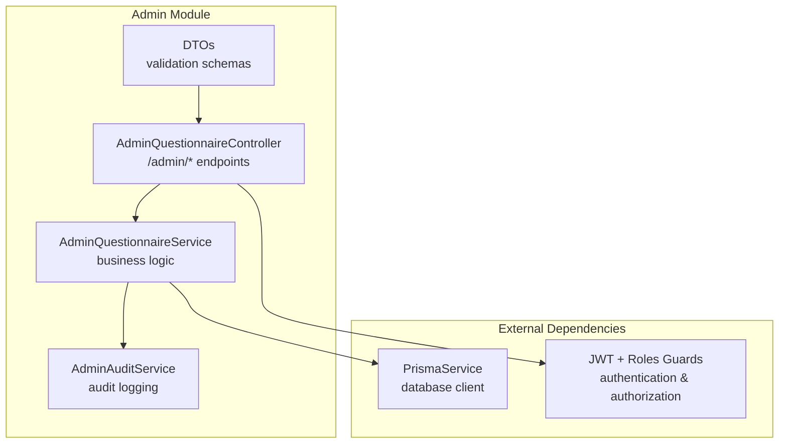
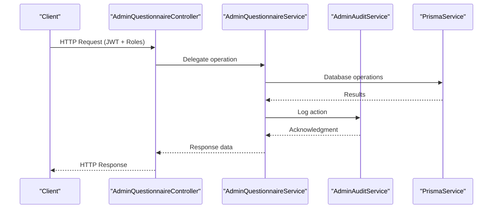
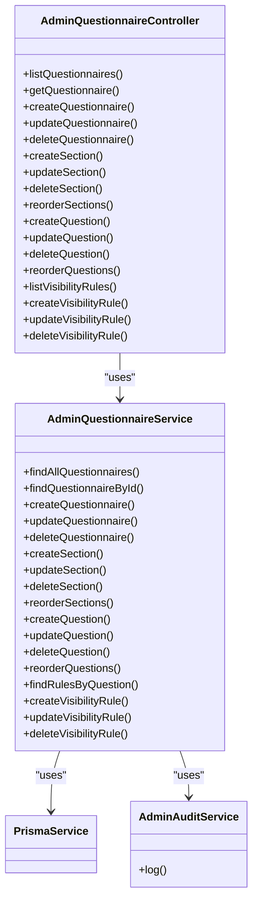

# Admin Endpoints

<cite>
**Referenced Files in This Document**
- [admin.module.ts](file://apps/api/src/modules/admin/admin.module.ts)
- [admin-questionnaire.controller.ts](file://apps/api/src/modules/admin/controllers/admin-questionnaire.controller.ts)
- [admin-questionnaire.service.ts](file://apps/api/src/modules/admin/services/admin-questionnaire.service.ts)
- [admin-audit.service.ts](file://apps/api/src/modules/admin/services/admin-audit.service.ts)
- [create-questionnaire.dto.ts](file://apps/api/src/modules/admin/dto/create-questionnaire.dto.ts)
- [update-questionnaire.dto.ts](file://apps/api/src/modules/admin/dto/update-questionnaire.dto.ts)
- [create-section.dto.ts](file://apps/api/src/modules/admin/dto/create-section.dto.ts)
- [update-section.dto.ts](file://apps/api/src/modules/admin/dto/update-section.dto.ts)
- [reorder-sections.dto.ts](file://apps/api/src/modules/admin/dto/reorder-sections.dto.ts)
- [create-question.dto.ts](file://apps/api/src/modules/admin/dto/create-question.dto.ts)
- [update-question.dto.ts](file://apps/api/src/modules/admin/dto/update-question.dto.ts)
- [reorder-questions.dto.ts](file://apps/api/src/modules/admin/dto/reorder-questions.dto.ts)
- [create-visibility-rule.dto.ts](file://apps/api/src/modules/admin/dto/create-visibility-rule.dto.ts)
- [update-visibility-rule.dto.ts](file://apps/api/src/modules/admin/dto/update-visibility-rule.dto.ts)
- [index.ts](file://apps/api/src/modules/admin/dto/index.ts)
</cite>

## Table of Contents
1. [Introduction](#introduction)
2. [Project Structure](#project-structure)
3. [Core Components](#core-components)
4. [Architecture Overview](#architecture-overview)
5. [Detailed Component Analysis](#detailed-component-analysis)
6. [Dependency Analysis](#dependency-analysis)
7. [Performance Considerations](#performance-considerations)
8. [Troubleshooting Guide](#troubleshooting-guide)
9. [Conclusion](#conclusion)

## Introduction
This document provides comprehensive documentation for the Admin Endpoints that power the Quiz application's administrative capabilities. These endpoints enable administrators and super administrators to manage questionnaires, sections, questions, and visibility rules with robust validation, role-based access control, and audit logging. The admin module follows a layered architecture with dedicated controllers, services, DTOs, and audit logging to ensure maintainability, scalability, and compliance.

## Project Structure
The admin module is organized into distinct layers:
- Controllers: Expose HTTP endpoints under the `/admin` base path
- Services: Implement business logic and interact with the database via Prisma
- DTOs: Define request/response schemas with validation rules
- Audit Service: Logs administrative actions for compliance and traceability

**Diagram sources**
- [admin-questionnaire.controller.ts](file://apps/api/src/modules/admin/controllers/admin-questionnaire.controller.ts#L44-L284)
- [admin-questionnaire.service.ts](file://apps/api/src/modules/admin/services/admin-questionnaire.service.ts#L45-L607)
- [admin-audit.service.ts](file://apps/api/src/modules/admin/services/admin-audit.service.ts#L15-L48)
- [admin.module.ts](file://apps/api/src/modules/admin/admin.module.ts#L7-L13)

**Section sources**
- [admin.module.ts](file://apps/api/src/modules/admin/admin.module.ts#L1-L14)
- [admin-questionnaire.controller.ts](file://apps/api/src/modules/admin/controllers/admin-questionnaire.controller.ts#L1-L284)
- [admin-questionnaire.service.ts](file://apps/api/src/modules/admin/services/admin-questionnaire.service.ts#L1-L607)
- [admin-audit.service.ts](file://apps/api/src/modules/admin/services/admin-audit.service.ts#L1-L48)

## Core Components
- AdminQuestionnaireController: Exposes all admin endpoints with Swagger metadata, role-based guards, and request validation
- AdminQuestionnaireService: Implements CRUD operations for questionnaires, sections, questions, and visibility rules with transaction support and audit logging
- AdminAuditService: Captures administrative actions with contextual information (IP address, user agent, request ID)
- DTOs: Strongly typed request/response schemas validated by class-validator and documented via Swagger

Key responsibilities:
- Role enforcement: ADMIN and SUPER_ADMIN roles with elevated privileges for deletion operations
- Validation: Comprehensive DTO validation ensuring data integrity
- Transactions: Batch reordering operations wrapped in database transactions
- Audit trail: All modifications logged with before/after snapshots

**Section sources**
- [admin-questionnaire.controller.ts](file://apps/api/src/modules/admin/controllers/admin-questionnaire.controller.ts#L44-L284)
- [admin-questionnaire.service.ts](file://apps/api/src/modules/admin/services/admin-questionnaire.service.ts#L45-L607)
- [admin-audit.service.ts](file://apps/api/src/modules/admin/services/admin-audit.service.ts#L15-L48)

## Architecture Overview
The admin endpoints follow a clean architecture pattern with clear separation of concerns:
- Controllers handle HTTP concerns (routing, guards, Swagger)
- Services encapsulate business logic and coordinate with external systems
- DTOs define contracts and validation rules
- Audit service provides cross-cutting concern for compliance

**Diagram sources**
- [admin-questionnaire.controller.ts](file://apps/api/src/modules/admin/controllers/admin-questionnaire.controller.ts#L44-L284)
- [admin-questionnaire.service.ts](file://apps/api/src/modules/admin/services/admin-questionnaire.service.ts#L45-L607)
- [admin-audit.service.ts](file://apps/api/src/modules/admin/services/admin-audit.service.ts#L15-L48)

## Detailed Component Analysis

### AdminQuestionnaireController
The controller exposes a comprehensive set of endpoints grouped by resource type:
- Questionnaire endpoints: List, retrieve, create, update, soft-delete
- Section endpoints: CRUD operations and batch reordering
- Question endpoints: CRUD operations and batch reordering
- Visibility rule endpoints: CRUD operations for dynamic question display logic

Security model:
- JWT authentication enforced via JwtAuthGuard
- Role-based authorization via RolesGuard
- SUPER_ADMIN privileges for destructive operations (deletion)
- ADMIN privileges for read/write operations

Response patterns:
- Paginated responses for listing endpoints
- Detailed nested structures for hierarchical resources
- Consistent error handling with appropriate HTTP status codes

**Section sources**
- [admin-questionnaire.controller.ts](file://apps/api/src/modules/admin/controllers/admin-questionnaire.controller.ts#L44-L284)

### AdminQuestionnaireService
Core business logic implementation:
- Database operations via PrismaService with proper error handling
- Transactional batch updates for reordering operations
- Auto-incremented order indices for new sections and questions
- Soft deletion strategy for questionnaires (set isActive=false)
- Comprehensive validation and business rule enforcement

Data structures:
- QuestionnaireWithDetails: Includes sections, questions, and counts
- PaginatedResult: Standardized pagination response format
- Audit log parameters: Structured logging with contextual metadata

**Section sources**
- [admin-questionnaire.service.ts](file://apps/api/src/modules/admin/services/admin-questionnaire.service.ts#L45-L607)

### AdminAuditService
Audit logging implementation:
- Captures user actions with timestamps and resource identifiers
- Stores contextual information (IP, user agent, request ID)
- Handles serialization of change objects for audit trail
- Robust error handling to prevent audit failures from blocking operations

Logging scope:
- All CRUD operations on questionnaires, sections, questions, and visibility rules
- Reordering operations with before/after snapshots
- Soft deletions with pre-deletion state

**Section sources**
- [admin-audit.service.ts](file://apps/api/src/modules/admin/services/admin-audit.service.ts#L15-L48)

### DTO Layer
Strongly typed request/response validation:
- Create/Update DTOs for each resource type
- Nested DTOs for complex structures (e.g., QuestionOptionDto)
- Validation decorators for data integrity
- Swagger documentation generation

Validation coverage:
- String length limits and required fields
- Numeric constraints (min values, enums)
- UUID validation for identifiers
- Array validation with nested item requirements

**Section sources**
- [create-questionnaire.dto.ts](file://apps/api/src/modules/admin/dto/create-questionnaire.dto.ts#L12-L45)
- [update-questionnaire.dto.ts](file://apps/api/src/modules/admin/dto/update-questionnaire.dto.ts#L6-L12)
- [create-section.dto.ts](file://apps/api/src/modules/admin/dto/create-section.dto.ts#L11-L45)
- [update-section.dto.ts](file://apps/api/src/modules/admin/dto/update-section.dto.ts#L4-L5)
- [reorder-sections.dto.ts](file://apps/api/src/modules/admin/dto/reorder-sections.dto.ts#L16-L23)
- [create-question.dto.ts](file://apps/api/src/modules/admin/dto/create-question.dto.ts#L30-L100)
- [update-question.dto.ts](file://apps/api/src/modules/admin/dto/update-question.dto.ts#L4-L5)
- [reorder-questions.dto.ts](file://apps/api/src/modules/admin/dto/reorder-questions.dto.ts#L16-L23)
- [create-visibility-rule.dto.ts](file://apps/api/src/modules/admin/dto/create-visibility-rule.dto.ts#L14-L50)
- [update-visibility-rule.dto.ts](file://apps/api/src/modules/admin/dto/update-visibility-rule.dto.ts#L4-L5)
- [index.ts](file://apps/api/src/modules/admin/dto/index.ts#L1-L18)

## Dependency Analysis
The admin module exhibits clean dependency relationships:
- Controller depends on Service for business logic
- Service depends on PrismaService for database operations
- Service depends on AdminAuditService for compliance logging
- DTOs are consumed by controllers and services
- No circular dependencies detected

**Diagram sources**
- [admin-questionnaire.controller.ts](file://apps/api/src/modules/admin/controllers/admin-questionnaire.controller.ts#L44-L284)
- [admin-questionnaire.service.ts](file://apps/api/src/modules/admin/services/admin-questionnaire.service.ts#L45-L607)
- [admin-audit.service.ts](file://apps/api/src/modules/admin/services/admin-audit.service.ts#L15-L48)

**Section sources**
- [admin.module.ts](file://apps/api/src/modules/admin/admin.module.ts#L7-L13)
- [admin-questionnaire.controller.ts](file://apps/api/src/modules/admin/controllers/admin-questionnaire.controller.ts#L44-L284)
- [admin-questionnaire.service.ts](file://apps/api/src/modules/admin/services/admin-questionnaire.service.ts#L45-L607)

## Performance Considerations
- Pagination: Listing endpoints support pagination to prevent large result sets
- Lazy loading: Complex nested structures are loaded on-demand
- Batch operations: Reordering uses database transactions for atomicity
- Index usage: Proper indexing recommended for frequently queried fields
- Caching: Consider implementing caching for static configuration data
- Connection pooling: Leverage Prisma's connection pooling for concurrent requests

## Troubleshooting Guide
Common issues and resolutions:
- Authentication failures: Verify JWT token validity and role assignment
- Authorization errors: Ensure user has required ADMIN or SUPER_ADMIN role
- Validation errors: Review DTO constraints and payload structure
- Not found errors: Confirm resource IDs exist and are properly formatted
- Business rule violations: Address dependencies (e.g., sections with questions, questions with responses)
- Audit logging failures: Check database connectivity and audit table schema

Diagnostic steps:
1. Enable detailed logging for audit service
2. Verify database connectivity and Prisma configuration
3. Test individual endpoints with minimal payloads
4. Check role assignments in user records
5. Validate DTO schemas against request payloads

**Section sources**
- [admin-questionnaire.service.ts](file://apps/api/src/modules/admin/services/admin-questionnaire.service.ts#L98-L100)
- [admin-questionnaire.service.ts](file://apps/api/src/modules/admin/services/admin-questionnaire.service.ts#L288-L292)
- [admin-questionnaire.service.ts](file://apps/api/src/modules/admin/services/admin-questionnaire.service.ts#L448-L452)

## Conclusion
The Admin Endpoints provide a robust, secure, and auditable foundation for managing quiz content. The implementation demonstrates strong architectural principles with clear separation of concerns, comprehensive validation, and detailed audit trails. The modular design supports future enhancements while maintaining backward compatibility and operational reliability.