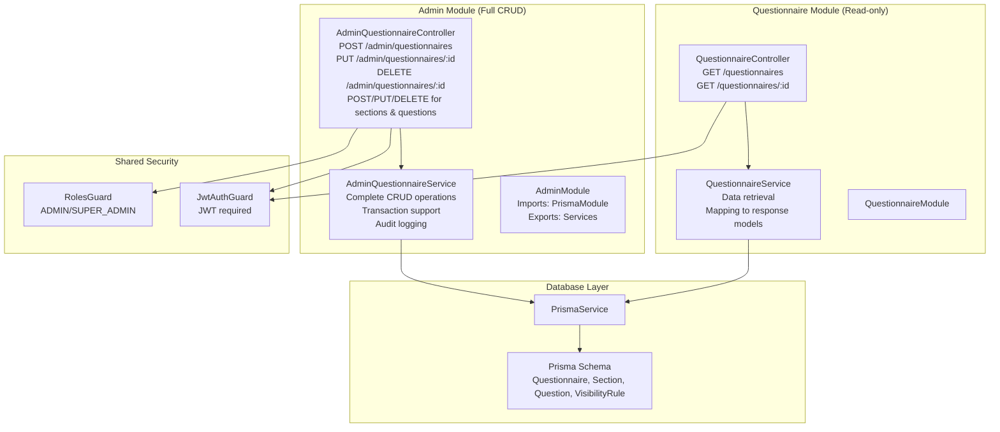
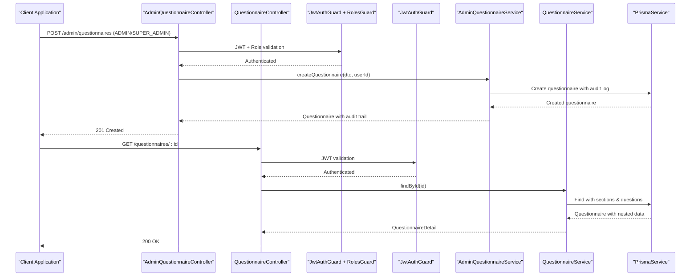
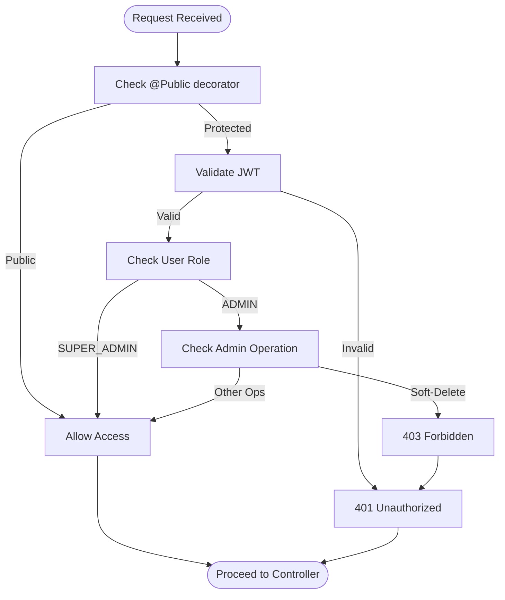
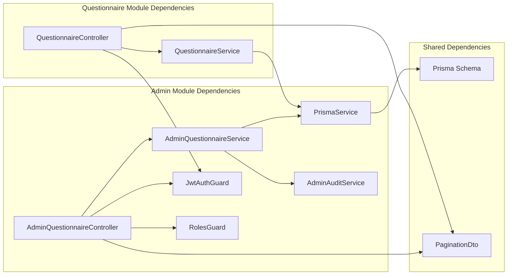

# Questionnaire Endpoints

<cite>
**Referenced Files in This Document**
- [admin-questionnaire.controller.ts](file://apps/api/src/modules/admin/controllers/admin-questionnaire.controller.ts)
- [admin-questionnaire.service.ts](file://apps/api/src/modules/admin/services/admin-questionnaire.service.ts)
- [admin.module.ts](file://apps/api/src/modules/admin/admin.module.ts)
- [create-questionnaire.dto.ts](file://apps/api/src/modules/admin/dto/create-questionnaire.dto.ts)
- [update-questionnaire.dto.ts](file://apps/api/src/modules/admin/dto/update-questionnaire.dto.ts)
- [create-section.dto.ts](file://apps/api/src/modules/admin/dto/create-section.dto.ts)
- [create-question.dto.ts](file://apps/api/src/modules/admin/dto/create-question.dto.ts)
- [reorder-questions.dto.ts](file://apps/api/src/modules/admin/dto/reorder-questions.dto.ts)
- [questionnaire.controller.ts](file://apps/api/src/modules/questionnaire/questionnaire.controller.ts)
- [questionnaire.service.ts](file://apps/api/src/modules/questionnaire/questionnaire.service.ts)
- [questionnaire.module.ts](file://apps/api/src/modules/questionnaire/questionnaire.module.ts)
- [pagination.dto.ts](file://libs/shared/src/dto/pagination.dto.ts)
- [jwt-auth.guard.ts](file://apps/api/src/modules/auth/guards/jwt-auth.guard.ts)
- [roles.guard.ts](file://apps/api/src/modules/auth/guards/roles.guard.ts)
- [auth.controller.ts](file://apps/api/src/modules/auth/auth.controller.ts)
- [schema.prisma](file://prisma/schema.prisma)
- [questionnaire.service.spec.ts](file://apps/api/src/modules/questionnaire/questionnaire.service.spec.ts)
</cite>

## Update Summary
**Changes Made**
- Added comprehensive CRUD endpoints for questionnaire management via AdminModule
- Updated authentication and authorization requirements with role-based access control
- Expanded endpoint coverage to include create, update, delete operations
- Added detailed request/response schemas for all CRUD operations
- Enhanced error handling documentation with specific HTTP status codes
- Updated architectural overview to reflect dual-module approach (AdminModule + QuestionnaireModule)

## Table of Contents
1. [Introduction](#introduction)
2. [Project Structure](#project-structure)
3. [Core Components](#core-components)
4. [Architecture Overview](#architecture-overview)
5. [Detailed Component Analysis](#detailed-component-analysis)
6. [Authentication and Authorization](#authentication-and-authorization)
7. [Request/Response Schemas](#requestresponse-schemas)
8. [Examples](#examples)
9. [Dependency Analysis](#dependency-analysis)
10. [Performance Considerations](#performance-considerations)
11. [Troubleshooting Guide](#troubleshooting-guide)
12. [Conclusion](#conclusion)

## Introduction
This document provides comprehensive API documentation for questionnaire management endpoints across two distinct modules: the existing read-only QuestionnaireModule and the newly added AdminModule. The AdminModule provides comprehensive CRUD capabilities for questionnaire management, while the QuestionnaireModule maintains read-only endpoints for client-facing operations. The documentation covers:

- **AdminModule Endpoints**: Full CRUD operations for questionnaires, sections, questions, and visibility rules
- **QuestionnaireModule Endpoints**: Read-only operations for client applications
- **Authentication**: JWT required for all endpoints
- **Authorization**: Role-based access control (ADMIN, SUPER_ADMIN)
- **Request/Response Schemas**: Complete validation rules and data structures
- **Error Handling**: Comprehensive error responses and HTTP status codes
- **Examples**: Practical usage scenarios with complex nested structures

**Updated** The AdminModule now provides comprehensive CRUD endpoints for questionnaire management, complementing existing read-only endpoints with full administrative capabilities.

## Project Structure
The questionnaire management system is now implemented across two specialized modules with clear separation of concerns:



**Diagram sources**
- [admin-questionnaire.controller.ts](file://apps/api/src/modules/admin/controllers/admin-questionnaire.controller.ts#L44-L284)
- [admin-questionnaire.service.ts](file://apps/api/src/modules/admin/services/admin-questionnaire.service.ts#L45-L607)
- [admin.module.ts](file://apps/api/src/modules/admin/admin.module.ts#L7-L13)
- [questionnaire.controller.ts](file://apps/api/src/modules/questionnaire/questionnaire.controller.ts#L18-L56)
- [questionnaire.service.ts](file://apps/api/src/modules/questionnaire/questionnaire.service.ts#L63-L253)
- [jwt-auth.guard.ts](file://apps/api/src/modules/auth/guards/jwt-auth.guard.ts#L6-L37)
- [roles.guard.ts](file://apps/api/src/modules/auth/guards/roles.guard.ts#L1-L100)
- [schema.prisma](file://prisma/schema.prisma#L173-L247)

**Section sources**
- [admin-questionnaire.controller.ts](file://apps/api/src/modules/admin/controllers/admin-questionnaire.controller.ts#L1-L284)
- [admin-questionnaire.service.ts](file://apps/api/src/modules/admin/services/admin-questionnaire.service.ts#L1-L607)
- [admin.module.ts](file://apps/api/src/modules/admin/admin.module.ts#L1-L14)
- [questionnaire.controller.ts](file://apps/api/src/modules/questionnaire/questionnaire.controller.ts#L1-L56)
- [questionnaire.service.ts](file://apps/api/src/modules/questionnaire/questionnaire.service.ts#L1-L253)
- [questionnaire.module.ts](file://apps/api/src/modules/questionnaire/questionnaire.module.ts#L1-L11)

## Core Components
The system now consists of two complementary modules:

### AdminModule Components
- **AdminQuestionnaireController**: Full CRUD operations with role-based authorization
- **AdminQuestionnaireService**: Complete business logic with transaction support and audit logging
- **DTO Validation**: Comprehensive request validation for all operations

### QuestionnaireModule Components  
- **QuestionnaireController**: Read-only endpoints for client applications
- **QuestionnaireService**: Data retrieval and response mapping
- **Pagination**: Standardized pagination with filtering capabilities

**Updated** The AdminModule provides comprehensive CRUD capabilities while the QuestionnaireModule maintains read-only operations for client consumption.

**Section sources**
- [admin-questionnaire.controller.ts](file://apps/api/src/modules/admin/controllers/admin-questionnaire.controller.ts#L44-L284)
- [admin-questionnaire.service.ts](file://apps/api/src/modules/admin/services/admin-questionnaire.service.ts#L45-L607)
- [questionnaire.controller.ts](file://apps/api/src/modules/questionnaire/questionnaire.controller.ts#L18-L56)
- [questionnaire.service.ts](file://apps/api/src/modules/questionnaire/questionnaire.service.ts#L63-L253)

## Architecture Overview
The dual-module architecture provides clear separation between administrative operations and client-facing read operations:



**Diagram sources**
- [admin-questionnaire.controller.ts](file://apps/api/src/modules/admin/controllers/admin-questionnaire.controller.ts#L79-L88)
- [questionnaire.controller.ts](file://apps/api/src/modules/questionnaire/questionnaire.controller.ts#L48-L54)
- [admin-questionnaire.service.ts](file://apps/api/src/modules/admin/services/admin-questionnaire.service.ts#L105-L130)
- [questionnaire.service.ts](file://apps/api/src/modules/questionnaire/questionnaire.service.ts#L100-L123)
- [jwt-auth.guard.ts](file://apps/api/src/modules/auth/guards/jwt-auth.guard.ts#L12-L36)
- [roles.guard.ts](file://apps/api/src/modules/auth/guards/roles.guard.ts#L1-L100)

## Detailed Component Analysis

### AdminModule Endpoints

#### Questionnaire Management Endpoints

##### GET /admin/questionnaires
Purpose: List all questionnaires with pagination and administrative details.

- Authentication: Required (JWT)
- Authorization: ADMIN, SUPER_ADMIN
- Query Parameters:
  - page: integer, default 1, minimum 1
  - limit: integer, default 20, minimum 1, maximum 100
- Response: Paginated list with administrative metadata
  - items: array of questionnaire list items with counts
  - pagination: page, limit, totalItems, totalPages

##### GET /admin/questionnaires/:id
Purpose: Retrieve complete questionnaire with all administrative details.

- Authentication: Required (JWT)
- Authorization: ADMIN, SUPER_ADMIN
- Path Parameter:
  - id: string (UUID)
- Response: Complete questionnaire with sections, questions, and counts

##### POST /admin/questionnaires
Purpose: Create new questionnaire with full administrative control.

- Authentication: Required (JWT)
- Authorization: ADMIN, SUPER_ADMIN
- Request Body: CreateQuestionnaireDto
- Response: Created questionnaire with audit trail

##### PUT /admin/questionnaires/:id
Purpose: Update questionnaire metadata and properties.

- Authentication: Required (JWT)
- Authorization: ADMIN, SUPER_ADMIN
- Path Parameter:
  - id: string (UUID)
- Request Body: UpdateQuestionnaireDto
- Response: Updated questionnaire with audit trail

##### DELETE /admin/questionnaires/:id
Purpose: Soft-delete questionnaire (set inactive).

- Authentication: Required (JWT)
- Authorization: SUPER_ADMIN only
- Path Parameter:
  - id: string (UUID)
- Response: Success message

**Section sources**
- [admin-questionnaire.controller.ts](file://apps/api/src/modules/admin/controllers/admin-questionnaire.controller.ts#L53-L114)
- [admin-questionnaire.service.ts](file://apps/api/src/modules/admin/services/admin-questionnaire.service.ts#L55-L192)

#### Section Management Endpoints

##### POST /admin/questionnaires/:questionnaireId/sections
Purpose: Add section to existing questionnaire.

- Authentication: Required (JWT)
- Authorization: ADMIN, SUPER_ADMIN
- Path Parameters:
  - questionnaireId: string (UUID)
- Request Body: CreateSectionDto
- Response: Created section with auto-calculated order index

##### PATCH /admin/sections/:id
Purpose: Update section properties.

- Authentication: Required (JWT)
- Authorization: ADMIN, SUPER_ADMIN
- Path Parameter:
  - id: string (UUID)
- Request Body: UpdateSectionDto
- Response: Updated section

##### DELETE /admin/sections/:id
Purpose: Delete section (SUPER_ADMIN only).

- Authentication: Required (JWT)
- Authorization: SUPER_ADMIN only
- Path Parameter:
  - id: string (UUID)
- Response: Success message
- Error: 400 if section contains questions

##### PATCH /admin/questionnaires/:questionnaireId/sections/reorder
Purpose: Reorder sections within questionnaire.

- Authentication: Required (JWT)
- Authorization: ADMIN, SUPER_ADMIN
- Path Parameters:
  - questionnaireId: string (UUID)
- Request Body: ReorderSectionsDto
- Response: Updated sections with new order indices

**Section sources**
- [admin-questionnaire.controller.ts](file://apps/api/src/modules/admin/controllers/admin-questionnaire.controller.ts#L120-L171)
- [admin-questionnaire.service.ts](file://apps/api/src/modules/admin/services/admin-questionnaire.service.ts#L198-L338)

#### Question Management Endpoints

##### POST /admin/sections/:sectionId/questions
Purpose: Add question to existing section.

- Authentication: Required (JWT)
- Authorization: ADMIN, SUPER_ADMIN
- Path Parameters:
  - sectionId: string (UUID)
- Request Body: CreateQuestionDto
- Response: Created question with auto-calculated order index

##### PATCH /admin/questions/:id
Purpose: Update question properties.

- Authentication: Required (JWT)
- Authorization: ADMIN, SUPER_ADMIN
- Path Parameter:
  - id: string (UUID)
- Request Body: UpdateQuestionDto
- Response: Updated question

##### DELETE /admin/questions/:id
Purpose: Delete question (SUPER_ADMIN only).

- Authentication: Required (JWT)
- Authorization: SUPER_ADMIN only
- Path Parameter:
  - id: string (UUID)
- Response: Success message
- Error: 400 if question has responses

##### PATCH /admin/sections/:sectionId/questions/reorder
Purpose: Reorder questions within section.

- Authentication: Required (JWT)
- Authorization: ADMIN, SUPER_ADMIN
- Path Parameters:
  - sectionId: string (UUID)
- Request Body: ReorderQuestionsDto
- Response: Updated questions with new order indices

**Section sources**
- [admin-questionnaire.controller.ts](file://apps/api/src/modules/admin/controllers/admin-questionnaire.controller.ts#L177-L228)
- [admin-questionnaire.service.ts](file://apps/api/src/modules/admin/services/admin-questionnaire.service.ts#L344-L496)

#### Visibility Rule Management Endpoints

##### GET /admin/questions/:questionId/rules
Purpose: List visibility rules for question.

- Authentication: Required (JWT)
- Authorization: ADMIN, SUPER_ADMIN
- Path Parameter:
  - questionId: string (UUID)
- Response: Array of visibility rules ordered by priority

##### POST /admin/questions/:questionId/rules
Purpose: Add visibility rule to question.

- Authentication: Required (JWT)
- Authorization: ADMIN, SUPER_ADMIN
- Path Parameters:
  - questionId: string (UUID)
- Request Body: CreateVisibilityRuleDto
- Response: Created visibility rule

##### PATCH /admin/rules/:id
Purpose: Update visibility rule.

- Authentication: Required (JWT)
- Authorization: ADMIN, SUPER_ADMIN
- Path Parameter:
  - id: string (UUID)
- Request Body: UpdateVisibilityRuleDto
- Response: Updated visibility rule

##### DELETE /admin/rules/:id
Purpose: Delete visibility rule.

- Authentication: Required (JWT)
- Authorization: ADMIN, SUPER_ADMIN
- Path Parameter:
  - id: string (UUID)
- Response: Success message

**Section sources**
- [admin-questionnaire.controller.ts](file://apps/api/src/modules/admin/controllers/admin-questionnaire.controller.ts#L234-L282)
- [admin-questionnaire.service.ts](file://apps/api/src/modules/admin/services/admin-questionnaire.service.ts#L502-L605)

### QuestionnaireModule Endpoints

#### GET /questionnaires
Purpose: List all available questionnaires with pagination and optional industry filtering.

- Authentication: Required (JWT)
- Query Parameters:
  - page: integer, default 1, minimum 1
  - limit: integer, default 20, minimum 1, maximum 100
  - industry: string (optional)
- Response: Paginated list of questionnaire summaries
  - items: array of questionnaire list items
  - pagination: page, limit, totalItems, totalPages

#### GET /questionnaires/:id
Purpose: Retrieve a specific questionnaire with all sections and questions.

- Authentication: Required (JWT)
- Path Parameter:
  - id: string (UUID)
- Response: Complete questionnaire detail with nested sections and questions

**Section sources**
- [questionnaire.controller.ts](file://apps/api/src/modules/questionnaire/questionnaire.controller.ts#L25-L54)
- [questionnaire.service.ts](file://apps/api/src/modules/questionnaire/questionnaire.service.ts#L67-L123)

## Authentication and Authorization

### Authentication Requirements
- **JWT Required**: All endpoints require valid JWT token in Authorization header
- **Token Format**: Bearer token scheme
- **Token Validation**: Automatic validation via JwtAuthGuard

### Authorization Rules
The system implements role-based access control with different permission levels:

#### Role Hierarchy
- **ADMIN**: Full access to CRUD operations except soft-deletion
- **SUPER_ADMIN**: Full access including soft-deletion operations

#### Endpoint-Level Authorization
- **Questionnaire CRUD**: ADMIN, SUPER_ADMIN
- **Section CRUD**: ADMIN, SUPER_ADMIN  
- **Question CRUD**: ADMIN, SUPER_ADMIN
- **Visibility Rules CRUD**: ADMIN, SUPER_ADMIN
- **Soft-Deletion**: SUPER_ADMIN only



**Diagram sources**
- [admin-questionnaire.controller.ts](file://apps/api/src/modules/admin/controllers/admin-questionnaire.controller.ts#L54-L104)
- [jwt-auth.guard.ts](file://apps/api/src/modules/auth/guards/jwt-auth.guard.ts#L12-L36)
- [roles.guard.ts](file://apps/api/src/modules/auth/guards/roles.guard.ts#L1-L100)

**Section sources**
- [admin-questionnaire.controller.ts](file://apps/api/src/modules/admin/controllers/admin-questionnaire.controller.ts#L42-L44)
- [jwt-auth.guard.ts](file://apps/api/src/modules/auth/guards/jwt-auth.guard.ts#L1-L38)
- [roles.guard.ts](file://apps/api/src/modules/auth/guards/roles.guard.ts#L1-L100)

## Request/Response Schemas

### AdminModule Request Schemas

#### CreateQuestionnaireDto
```typescript
{
  name: string,                    // Max 200 chars, required
  description?: string,            // Max 200 chars, optional
  industry?: string,               // Max 100 chars, optional
  isDefault?: boolean,             // Default: false, optional
  estimatedTime?: number,          // Min 1 minute, optional
  metadata?: Record<string, unknown> // Additional data, optional
}
```

#### UpdateQuestionnaireDto
```typescript
{
  name?: string,                   // Max 200 chars, optional
  description?: string,            // Max 200 chars, optional  
  industry?: string,               // Max 100 chars, optional
  isDefault?: boolean,             // Optional
  isActive?: boolean,              // Optional (ADMIN only)
  estimatedTime?: number,          // Min 1 minute, optional
  metadata?: Record<string, unknown> // Optional
}
```

#### CreateSectionDto
```typescript
{
  name: string,                    // Max 200 chars, required
  description?: string,            // Max 200 chars, optional
  icon?: string,                   // Max 50 chars, optional
  estimatedTime?: number,          // Min 1 minute, optional
  orderIndex?: number,             // Min 0, auto-calculated if not provided
  metadata?: Record<string, unknown> // Optional
}
```

#### CreateQuestionDto
```typescript
{
  text: string,                    // Max 1000 chars, required
  type: QuestionType,              // Required enum
  helpText?: string,               // Optional
  explanation?: string,            // Optional
  placeholder?: string,            // Optional
  isRequired?: boolean,            // Default: false, optional
  options?: QuestionOptionDto[],   // For choice-based questions
  validationRules?: Record<string, unknown>, // Optional
  defaultValue?: unknown,          // Optional
  suggestedAnswer?: unknown,       // Optional
  industryTags?: string[],         // Optional
  documentMappings?: Record<string, unknown>, // Optional
  orderIndex?: number,             // Min 0, optional
  metadata?: Record<string, unknown> // Optional
}
```

#### ReorderQuestionsDto
```typescript
{
  items: ReorderItem[]: [
    {
      id: string,                  // UUID
      orderIndex: number           // Min 0
    }
  ]
}
```

### AdminModule Response Schemas

#### QuestionnaireWithDetails
```typescript
{
  id: string,
  name: string,
  description?: string,
  industry?: string,
  version: number,
  estimatedTime?: number,
  isDefault: boolean,
  isActive: boolean,
  sections: SectionWithQuestions[],
  _count: { sessions: number }
}
```

#### SectionWithQuestions
```typescript
{
  id: string,
  name: string,
  description?: string,
  orderIndex: number,
  questions: QuestionWithRules[],
  _count: { questions: number }
}
```

#### QuestionWithRules
```typescript
{
  id: string,
  text: string,
  type: QuestionType,
  isRequired: boolean,
  visibilityRules: VisibilityRule[]
}
```

### QuestionnaireModule Response Schemas

#### QuestionnaireListItem
```typescript
{
  id: string,
  name: string,
  description?: string,
  industry?: string,
  version: number,
  estimatedTime?: number,
  totalQuestions: number,
  sections: [
    {
      id: string,
      name: string,
      questionCount: number
    }
  ],
  createdAt: Date
}
```

#### QuestionnaireDetail
```typescript
{
  id: string,
  name: string,
  description?: string,
  industry?: string,
  version: number,
  estimatedTime?: number,
  sections: SectionResponse[]
}
```

#### SectionResponse
```typescript
{
  id: string,
  name: string,
  description?: string,
  order: number,
  icon?: string,
  estimatedTime?: number,
  questionCount: number,
  questions?: QuestionResponse[]
}
```

#### QuestionResponse
```typescript
{
  id: string,
  text: string,
  type: QuestionType,
  required: boolean,
  helpText?: string,
  explanation?: string,
  placeholder?: string,
  options?: QuestionOption[],
  validation?: Record<string, unknown>
}
```

**Section sources**
- [create-questionnaire.dto.ts](file://apps/api/src/modules/admin/dto/create-questionnaire.dto.ts#L12-L44)
- [update-questionnaire.dto.ts](file://apps/api/src/modules/admin/dto/update-questionnaire.dto.ts#L6-L11)
- [create-section.dto.ts](file://apps/api/src/modules/admin/dto/create-section.dto.ts#L11-L44)
- [create-question.dto.ts](file://apps/api/src/modules/admin/dto/create-question.dto.ts#L30-L99)
- [reorder-questions.dto.ts](file://apps/api/src/modules/admin/dto/reorder-questions.dto.ts#L16-L22)
- [questionnaire.service.ts](file://apps/api/src/modules/questionnaire/questionnaire.service.ts#L37-L61)

## Examples

### AdminModule Examples

#### Example: Creating a Complex Questionnaire
```http
POST /admin/questionnaires HTTP/1.1
Authorization: Bearer <JWT_TOKEN>
Content-Type: application/json

{
  "name": "Business Plan Questionnaire",
  "description": "Comprehensive questionnaire for business planning",
  "industry": "technology",
  "isDefault": true,
  "estimatedTime": 45,
  "metadata": {
    "category": "business",
    "version": "1.0"
  }
}
```

#### Example: Adding Sections with Questions
```http
POST /admin/questionnaires/:questionnaireId/sections HTTP/1.1
Authorization: Bearer <JWT_TOKEN>
Content-Type: application/json

{
  "name": "Business Foundation",
  "description": "Core business information and goals",
  "icon": "briefcase",
  "estimatedTime": 10,
  "metadata": {
    "color": "blue"
  }
}
```

#### Example: Creating Choice-Based Questions
```http
POST /admin/sections/:sectionId/questions HTTP/1.1
Authorization: Bearer <JWT_TOKEN>
Content-Type: application/json

{
  "text": "What is your business type?",
  "type": "MULTIPLE_CHOICE",
  "isRequired": true,
  "options": [
    {
      "value": "startup",
      "label": "Startup",
      "description": "New business venture"
    },
    {
      "value": "established",
      "label": "Established Business",
      "description": "Mature business"
    }
  ],
  "validationRules": {
    "minSelections": 1,
    "maxSelections": 2
  }
}
```

#### Example: Bulk Reordering Operations
```http
PATCH /admin/sections/:sectionId/questions/reorder HTTP/1.1
Authorization: Bearer <JWT_TOKEN>
Content-Type: application/json

{
  "items": [
    {
      "id": "123e4567-e89b-12d3-a456-426614174000",
      "orderIndex": 0
    },
    {
      "id": "8f456789-a012-b345-c678-567890123456",
      "orderIndex": 1
    }
  ]
}
```

### QuestionnaireModule Examples

#### Example: Listing Questionnaires with Filtering
```http
GET /questionnaires?page=1&limit=20&industry=healthcare HTTP/1.1
Authorization: Bearer <JWT_TOKEN>
```

#### Example: Retrieving Questionnaire with Nested Data
```http
GET /questionnaires/:id HTTP/1.1
Authorization: Bearer <JWT_TOKEN>
```

**Section sources**
- [admin-questionnaire.controller.ts](file://apps/api/src/modules/admin/controllers/admin-questionnaire.controller.ts#L79-L114)
- [admin-questionnaire.controller.ts](file://apps/api/src/modules/admin/controllers/admin-questionnaire.controller.ts#L120-L171)
- [admin-questionnaire.controller.ts](file://apps/api/src/modules/admin/controllers/admin-questionnaire.controller.ts#L177-L228)
- [questionnaire.controller.ts](file://apps/api/src/modules/questionnaire/questionnaire.controller.ts#L25-L54)

## Dependency Analysis
The dual-module architecture introduces clear dependency relationships:



**Diagram sources**
- [admin-questionnaire.controller.ts](file://apps/api/src/modules/admin/controllers/admin-questionnaire.controller.ts#L1-L284)
- [admin-questionnaire.service.ts](file://apps/api/src/modules/admin/services/admin-questionnaire.service.ts#L1-L607)
- [questionnaire.controller.ts](file://apps/api/src/modules/questionnaire/questionnaire.controller.ts#L1-L56)
- [questionnaire.service.ts](file://apps/api/src/modules/questionnaire/questionnaire.service.ts#L1-L253)
- [admin.module.ts](file://apps/api/src/modules/admin/admin.module.ts#L1-L14)

**Section sources**
- [admin-questionnaire.controller.ts](file://apps/api/src/modules/admin/controllers/admin-questionnaire.controller.ts#L1-L284)
- [admin-questionnaire.service.ts](file://apps/api/src/modules/admin/services/admin-questionnaire.service.ts#L1-L607)
- [questionnaire.controller.ts](file://apps/api/src/modules/questionnaire/questionnaire.controller.ts#L1-L56)
- [questionnaire.service.ts](file://apps/api/src/modules/questionnaire/questionnaire.service.ts#L1-L253)
- [admin.module.ts](file://apps/api/src/modules/admin/admin.module.ts#L1-L14)

## Performance Considerations
- **Pagination**: Use page and limit parameters for all list operations
- **Batch Operations**: Use bulk reorder endpoints for efficient ordering changes
- **Transaction Support**: Admin operations use transactions for data consistency
- **Audit Logging**: Audit trail operations add overhead but ensure compliance
- **Nested Queries**: Admin endpoints include extensive nesting for administrative purposes
- **Caching**: Consider caching frequently accessed questionnaires in QuestionnaireModule

## Troubleshooting Guide

### Common Authentication Issues
- **401 Unauthorized**: Invalid or expired JWT token
- **403 Forbidden**: Insufficient permissions for operation
- **404 Not Found**: Resource not found or inactive

### Common Business Logic Errors
- **400 Bad Request**: Validation errors in request data
- **400 Bad Request**: Cannot delete section with questions
- **400 Bad Request**: Cannot delete question with responses

### Common Data Integrity Issues
- **404 Not Found**: Questionnaire/Section/Question not found
- **400 Bad Request**: Invalid UUID format
- **400 Bad Request**: Out of range values (negative order indices)

**Section sources**
- [admin-questionnaire.service.ts](file://apps/api/src/modules/admin/services/admin-questionnaire.service.ts#L288-L292)
- [admin-questionnaire.service.ts](file://apps/api/src/modules/admin/services/admin-questionnaire.service.ts#L448-L452)
- [jwt-auth.guard.ts](file://apps/api/src/modules/auth/guards/jwt-auth.guard.ts#L25-L36)

## Conclusion
The questionnaire management system now provides comprehensive CRUD capabilities through the AdminModule while maintaining read-only operations in the QuestionnaireModule. The dual-module architecture ensures clear separation of concerns, with administrative operations having full control over questionnaire lifecycle management and client applications receiving optimized read-only data structures. The implementation includes robust authentication and authorization, comprehensive validation, and detailed audit trails for compliance requirements. This architecture supports both administrative workflows and client consumption patterns effectively.