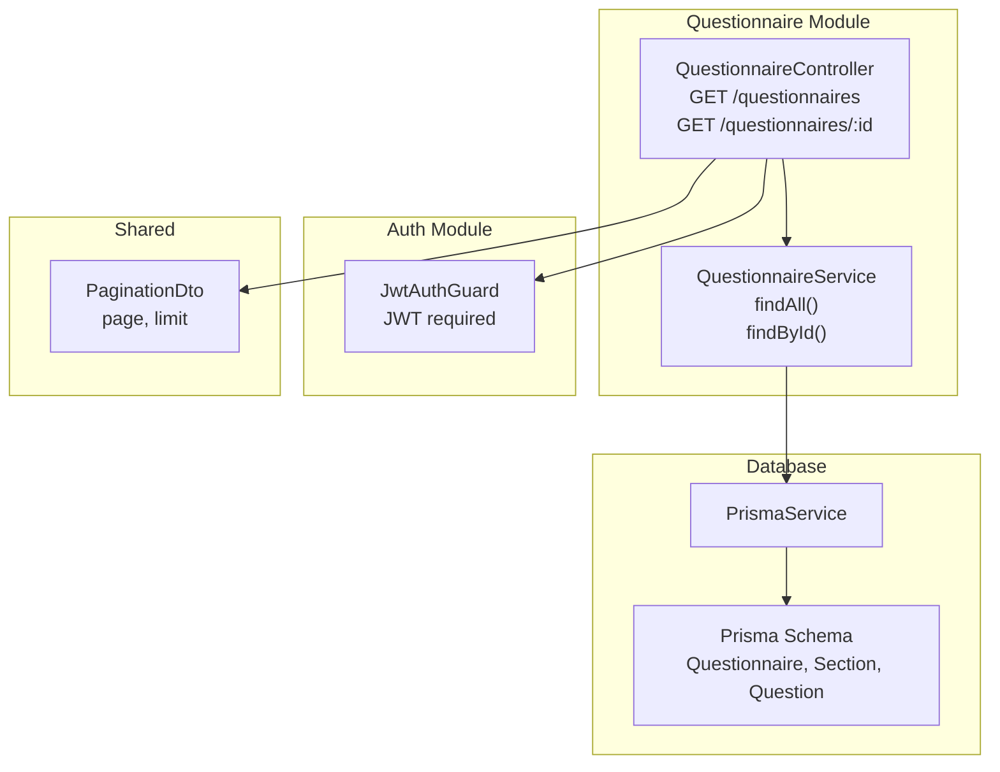
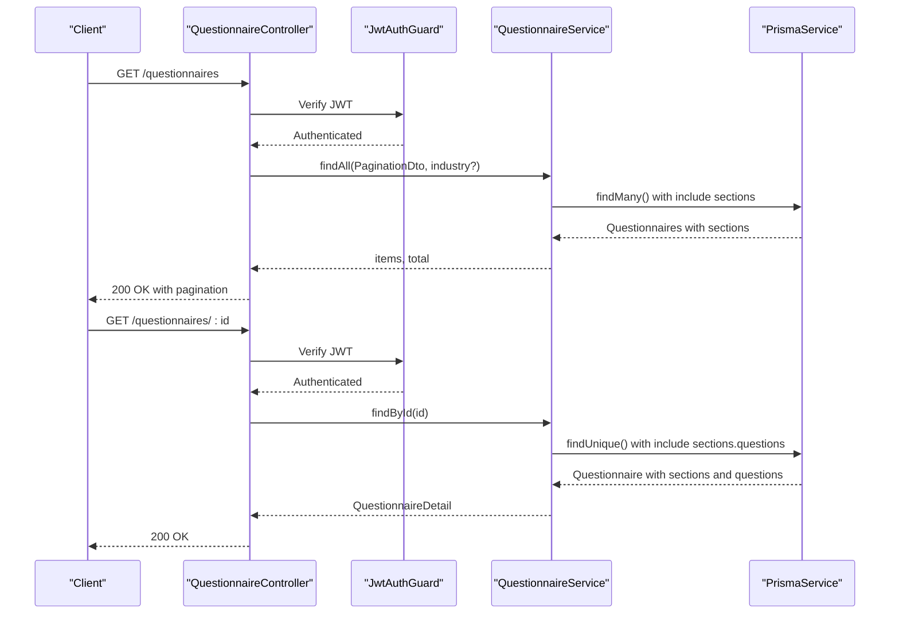
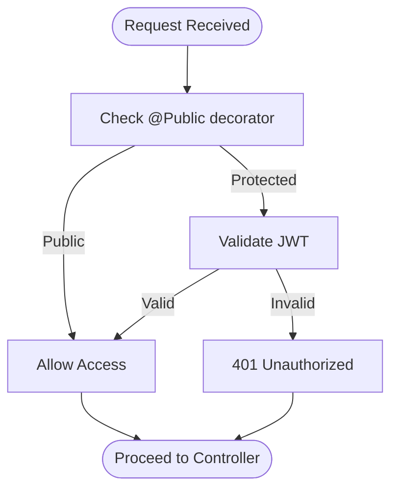
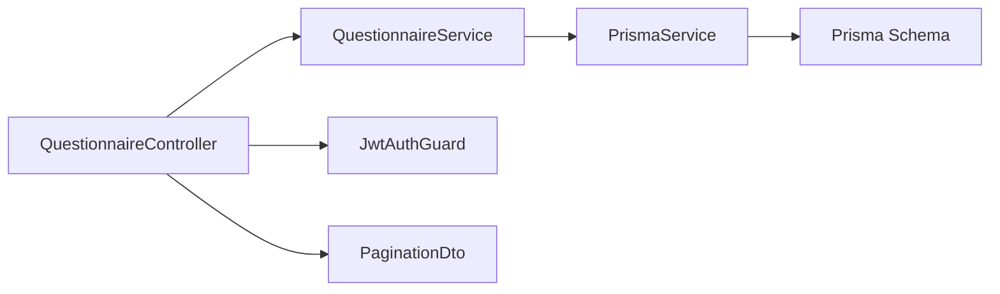

# Questionnaire Endpoints

<cite>
**Referenced Files in This Document**
- [questionnaire.controller.ts](file://apps/api/src/modules/questionnaire/questionnaire.controller.ts)
- [questionnaire.service.ts](file://apps/api/src/modules/questionnaire/questionnaire.service.ts)
- [questionnaire.module.ts](file://apps/api/src/modules/questionnaire/questionnaire.module.ts)
- [pagination.dto.ts](file://libs/shared/src/dto/pagination.dto.ts)
- [jwt-auth.guard.ts](file://apps/api/src/modules/auth/guards/jwt-auth.guard.ts)
- [auth.controller.ts](file://apps/api/src/modules/auth/auth.controller.ts)
- [schema.prisma](file://prisma/schema.prisma)
- [questionnaire.service.spec.ts](file://apps/api/src/modules/questionnaire/questionnaire.service.spec.ts)
</cite>

## Table of Contents
1. [Introduction](#introduction)
2. [Project Structure](#project-structure)
3. [Core Components](#core-components)
4. [Architecture Overview](#architecture-overview)
5. [Detailed Component Analysis](#detailed-component-analysis)
6. [Dependency Analysis](#dependency-analysis)
7. [Performance Considerations](#performance-considerations)
8. [Troubleshooting Guide](#troubleshooting-guide)
9. [Conclusion](#conclusion)

## Introduction
This document provides comprehensive API documentation for questionnaire management endpoints. It covers the available endpoints, request/response schemas, authentication requirements, authorization rules, error handling, and practical examples for creating complex nested questionnaires. The focus is on:
- Listing questionnaires with filtering and sorting
- Creating new questionnaires
- Updating existing questionnaires
- Deleting questionnaires
- Retrieving a specific questionnaire with sections and questions

Note: The current implementation exposes endpoints for listing and retrieving questionnaires but does not include dedicated endpoints for creating, updating, or deleting questionnaires. This document therefore emphasizes the available endpoints while noting the absence of create/update/delete operations.

## Project Structure
The questionnaire feature is implemented as a NestJS module with a controller and service. Authentication is enforced via a JWT guard applied globally to the questionnaire controller. Pagination is standardized through a shared DTO.

**Diagram sources**
- [questionnaire.controller.ts](file://apps/api/src/modules/questionnaire/questionnaire.controller.ts#L18-L55)
- [questionnaire.service.ts](file://apps/api/src/modules/questionnaire/questionnaire.service.ts#L63-L252)
- [pagination.dto.ts](file://libs/shared/src/dto/pagination.dto.ts#L5-L24)
- [jwt-auth.guard.ts](file://apps/api/src/modules/auth/guards/jwt-auth.guard.ts#L6-L37)
- [schema.prisma](file://prisma/schema.prisma#L173-L247)

**Section sources**
- [questionnaire.controller.ts](file://apps/api/src/modules/questionnaire/questionnaire.controller.ts#L1-L56)
- [questionnaire.service.ts](file://apps/api/src/modules/questionnaire/questionnaire.service.ts#L1-L253)
- [questionnaire.module.ts](file://apps/api/src/modules/questionnaire/questionnaire.module.ts#L1-L11)
- [pagination.dto.ts](file://libs/shared/src/dto/pagination.dto.ts#L1-L25)
- [jwt-auth.guard.ts](file://apps/api/src/modules/auth/guards/jwt-auth.guard.ts#L1-L38)
- [schema.prisma](file://prisma/schema.prisma#L173-L247)

## Core Components
- QuestionnaireController: Exposes GET endpoints for listing and retrieving questionnaires. Applies JWT authentication and bearer token authorization.
- QuestionnaireService: Implements data retrieval logic, mapping raw database records to structured response models.
- PaginationDto: Provides standardized pagination parameters (page, limit) with validation.
- JwtAuthGuard: Enforces JWT authentication and handles token expiration and invalid token scenarios.

Key capabilities:
- List questionnaires with pagination and optional industry filtering
- Retrieve a specific questionnaire with nested sections and questions
- Map database entities to clean response models with computed totals

**Section sources**
- [questionnaire.controller.ts](file://apps/api/src/modules/questionnaire/questionnaire.controller.ts#L18-L55)
- [questionnaire.service.ts](file://apps/api/src/modules/questionnaire/questionnaire.service.ts#L63-L252)
- [pagination.dto.ts](file://libs/shared/src/dto/pagination.dto.ts#L5-L24)
- [jwt-auth.guard.ts](file://apps/api/src/modules/auth/guards/jwt-auth.guard.ts#L6-L37)

## Architecture Overview
The questionnaire endpoints follow a layered architecture:
- Controller validates and orchestrates requests
- Service performs data queries and transformations
- Prisma handles database operations
- Shared DTOs standardize pagination
- JWT guard enforces authentication

**Diagram sources**
- [questionnaire.controller.ts](file://apps/api/src/modules/questionnaire/questionnaire.controller.ts#L25-L54)
- [questionnaire.service.ts](file://apps/api/src/modules/questionnaire/questionnaire.service.ts#L67-L123)
- [jwt-auth.guard.ts](file://apps/api/src/modules/auth/guards/jwt-auth.guard.ts#L12-L36)
- [schema.prisma](file://prisma/schema.prisma#L173-L247)

## Detailed Component Analysis

### Endpoint: GET /questionnaires
Purpose: List all available questionnaires with pagination and optional industry filtering.

- Authentication: Required (JWT)
- Authorization: Not explicitly enforced at controller level beyond JWT
- Query Parameters:
  - page: integer, default 1, minimum 1
  - limit: integer, default 20, minimum 1, maximum 100
  - industry: string (optional)
- Response: Paginated list of questionnaire summaries
  - items: array of questionnaire list items
  - pagination: page, limit, totalItems, totalPages

Response model: QuestionnaireListItem
- id: string (UUID)
- name: string
- description: string (optional)
- industry: string (optional)
- version: number
- estimatedTime: number (optional)
- totalQuestions: number
- sections: array of { id, name, questionCount }
- createdAt: date-time

Notes:
- Results are sorted by creation date descending
- Only active questionnaires are returned
- Industry filter is supported when provided

**Section sources**
- [questionnaire.controller.ts](file://apps/api/src/modules/questionnaire/questionnaire.controller.ts#L25-L46)
- [questionnaire.service.ts](file://apps/api/src/modules/questionnaire/questionnaire.service.ts#L67-L98)
- [pagination.dto.ts](file://libs/shared/src/dto/pagination.dto.ts#L5-L24)
- [schema.prisma](file://prisma/schema.prisma#L173-L195)

### Endpoint: GET /questionnaires/:id
Purpose: Retrieve a specific questionnaire with all sections and questions.

- Authentication: Required (JWT)
- Path Parameter:
  - id: string (UUID)
- Response: Complete questionnaire detail
  - id: string (UUID)
  - name: string
  - description: string (optional)
  - industry: string (optional)
  - version: number
  - estimatedTime: number (optional)
  - sections: array of SectionResponse

SectionResponse:
- id: string (UUID)
- name: string
- description: string (optional)
- order: number
- icon: string (optional)
- estimatedTime: number (optional)
- questionCount: number
- questions: array of QuestionResponse

QuestionResponse:
- id: string (UUID)
- text: string
- type: QuestionType (TEXT, TEXTAREA, NUMBER, EMAIL, URL, DATE, SINGLE_CHOICE, MULTIPLE_CHOICE, SCALE, FILE_UPLOAD, MATRIX)
- required: boolean
- helpText: string (optional)
- explanation: string (optional)
- placeholder: string (optional)
- options: array of QuestionOption (optional)
- validation: object (optional)

QuestionOption:
- id: string (UUID)
- label: string
- description: string (optional)
- icon: string (optional)
- value: string | number | boolean (optional)

Error Responses:
- 404 Not Found: When the questionnaire does not exist or is inactive

**Section sources**
- [questionnaire.controller.ts](file://apps/api/src/modules/questionnaire/questionnaire.controller.ts#L48-L54)
- [questionnaire.service.ts](file://apps/api/src/modules/questionnaire/questionnaire.service.ts#L100-L123)
- [questionnaire.service.ts](file://apps/api/src/modules/questionnaire/questionnaire.service.ts#L53-L61)
- [questionnaire.service.ts](file://apps/api/src/modules/questionnaire/questionnaire.service.ts#L26-L35)
- [questionnaire.service.ts](file://apps/api/src/modules/questionnaire/questionnaire.service.ts#L14-L24)
- [questionnaire.service.ts](file://apps/api/src/modules/questionnaire/questionnaire.service.ts#L6-L12)
- [schema.prisma](file://prisma/schema.prisma#L24-L36)
- [schema.prisma](file://prisma/schema.prisma#L218-L247)

### Authentication and Authorization
- Authentication: JWT required for all questionnaire endpoints
- Authorization: No explicit role-based authorization is enforced in the questionnaire controller; JWT verification is sufficient
- Token Handling: The JWT guard manages token validation, expiration, and error responses

Authorization flow:

**Diagram sources**
- [jwt-auth.guard.ts](file://apps/api/src/modules/auth/guards/jwt-auth.guard.ts#L12-L36)
- [questionnaire.controller.ts](file://apps/api/src/modules/questionnaire/questionnaire.controller.ts#L20-L21)

**Section sources**
- [jwt-auth.guard.ts](file://apps/api/src/modules/auth/guards/jwt-auth.guard.ts#L1-L38)
- [questionnaire.controller.ts](file://apps/api/src/modules/questionnaire/questionnaire.controller.ts#L18-L21)

### Request/Response Schemas

#### GET /questionnaires
- Query Parameters:
  - page: integer (default 1)
  - limit: integer (default 20, max 100)
  - industry: string (optional)
- Response:
  - items: QuestionnaireListItem[]
  - pagination: { page, limit, totalItems, totalPages }

#### GET /questionnaires/:id
- Path Parameters:
  - id: string (UUID)
- Response:
  - QuestionnaireDetail (see above)

#### Error Responses
- 401 Unauthorized: Invalid or missing JWT token
- 404 Not Found: Questionnaire not found or inactive

**Section sources**
- [questionnaire.controller.ts](file://apps/api/src/modules/questionnaire/questionnaire.controller.ts#L25-L54)
- [questionnaire.service.ts](file://apps/api/src/modules/questionnaire/questionnaire.service.ts#L100-L123)
- [jwt-auth.guard.ts](file://apps/api/src/modules/auth/guards/jwt-auth.guard.ts#L25-L36)

### Examples

#### Example: Listing Questionnaires with Filtering
- Request: GET /questionnaires?page=1&limit=20&industry=healthcare
- Response: 200 OK with items and pagination metadata

#### Example: Retrieving a Specific Questionnaire
- Request: GET /questionnaires/:id
- Response: 200 OK with QuestionnaireDetail containing nested sections and questions

#### Example: Nested Structure Details
- QuestionnaireDetail includes:
  - sections: array of SectionResponse
  - Each SectionResponse includes:
    - questions: array of QuestionResponse
    - Each QuestionResponse includes:
      - options: array of QuestionOption (for choice-type questions)
      - validation: arbitrary JSON object (for validation rules)

Note: The current implementation does not expose endpoints for creating, updating, or deleting questionnaires. Any modifications to questionnaires would require extending the controller and service accordingly.

**Section sources**
- [questionnaire.controller.ts](file://apps/api/src/modules/questionnaire/questionnaire.controller.ts#L25-L54)
- [questionnaire.service.ts](file://apps/api/src/modules/questionnaire/questionnaire.service.ts#L53-L61)
- [questionnaire.service.ts](file://apps/api/src/modules/questionnaire/questionnaire.service.ts#L26-L35)
- [questionnaire.service.ts](file://apps/api/src/modules/questionnaire/questionnaire.service.ts#L14-L24)
- [questionnaire.service.spec.ts](file://apps/api/src/modules/questionnaire/questionnaire.service.spec.ts#L102-L202)

## Dependency Analysis
The questionnaire module depends on:
- Shared PaginationDto for standardized pagination
- PrismaService for database operations
- JwtAuthGuard for authentication enforcement

**Diagram sources**
- [questionnaire.controller.ts](file://apps/api/src/modules/questionnaire/questionnaire.controller.ts#L1-L56)
- [questionnaire.service.ts](file://apps/api/src/modules/questionnaire/questionnaire.service.ts#L1-L253)
- [pagination.dto.ts](file://libs/shared/src/dto/pagination.dto.ts#L1-L25)
- [jwt-auth.guard.ts](file://apps/api/src/modules/auth/guards/jwt-auth.guard.ts#L1-L38)
- [schema.prisma](file://prisma/schema.prisma#L173-L247)

**Section sources**
- [questionnaire.controller.ts](file://apps/api/src/modules/questionnaire/questionnaire.controller.ts#L1-L56)
- [questionnaire.service.ts](file://apps/api/src/modules/questionnaire/questionnaire.service.ts#L1-L253)
- [questionnaire.module.ts](file://apps/api/src/modules/questionnaire/questionnaire.module.ts#L1-L11)

## Performance Considerations
- Pagination: Use page and limit parameters to avoid large result sets
- Filtering: Apply industry filter when appropriate to reduce dataset size
- Nested Queries: Retrieving a single questionnaire includes sections and questions; consider caching frequently accessed questionnaires
- Validation: Keep validation rules minimal to reduce payload sizes

## Troubleshooting Guide
Common issues and resolutions:
- 401 Unauthorized: Ensure a valid JWT is included in the Authorization header
- 404 Not Found: Verify the questionnaire ID exists and is active
- 400 Bad Request: Validate query parameters (page, limit) against the PaginationDto constraints

**Section sources**
- [jwt-auth.guard.ts](file://apps/api/src/modules/auth/guards/jwt-auth.guard.ts#L25-L36)
- [questionnaire.controller.ts](file://apps/api/src/modules/questionnaire/questionnaire.controller.ts#L50-L51)
- [pagination.dto.ts](file://libs/shared/src/dto/pagination.dto.ts#L13-L19)

## Conclusion
The questionnaire module currently supports listing and retrieving questionnaires with robust pagination, filtering, and nested data structures. Authentication is enforced via JWT, and the response models clearly represent questionnaires, sections, and questions along with their associated metadata. To meet the full scope of the documentation objective, create, update, and delete endpoints should be added to the controller and service, following the established patterns for authentication, validation, and response modeling.