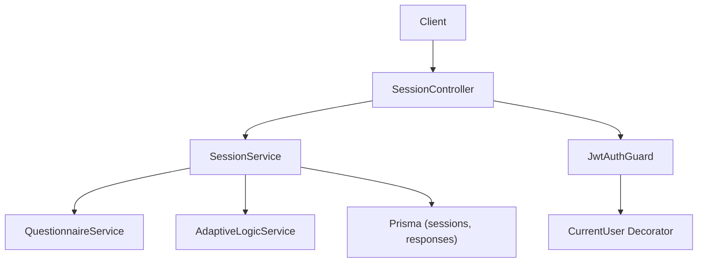
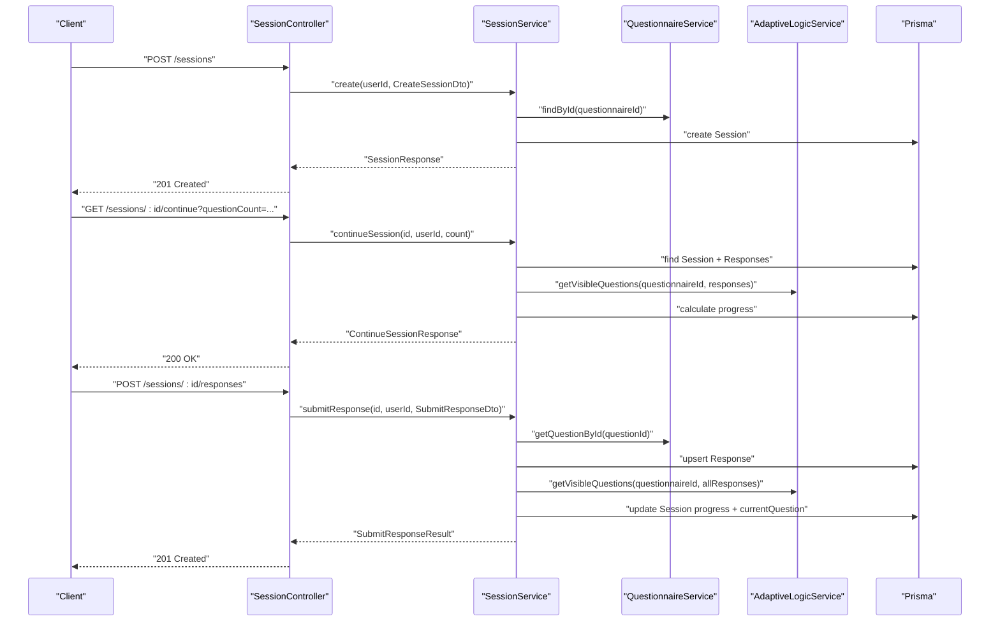
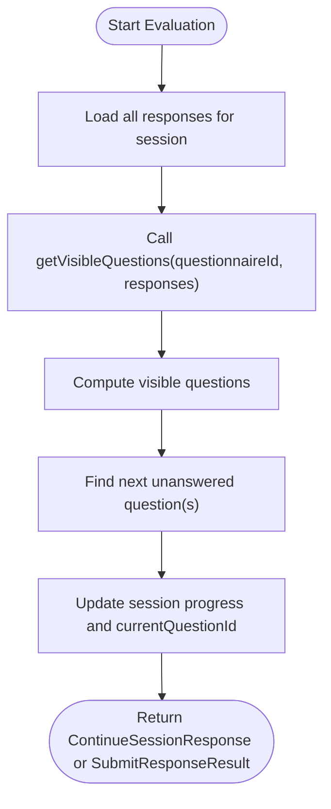
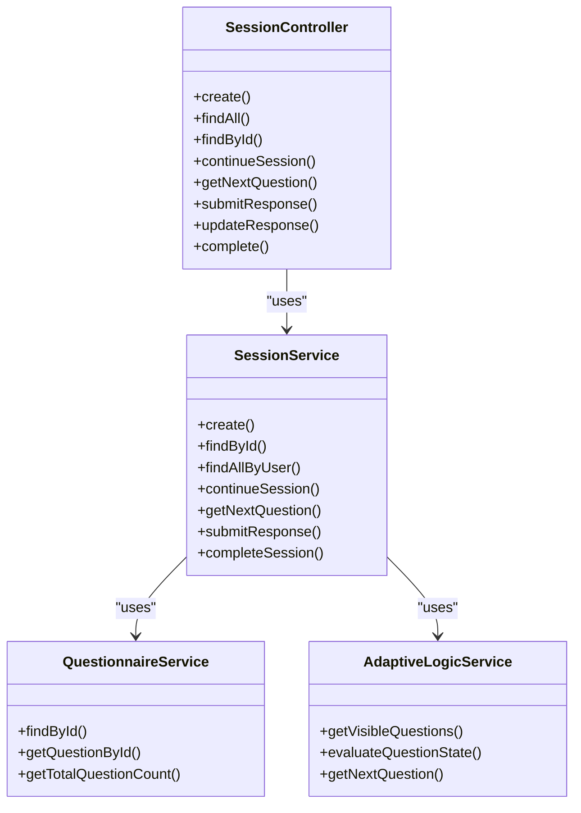

# Session Endpoints

<cite>
**Referenced Files in This Document**
- [session.controller.ts](file://apps/api/src/modules/session/session.controller.ts)
- [session.service.ts](file://apps/api/src/modules/session/session.service.ts)
- [create-session.dto.ts](file://apps/api/src/modules/session/dto/create-session.dto.ts)
- [continue-session.dto.ts](file://apps/api/src/modules/session/dto/continue-session.dto.ts)
- [submit-response.dto.ts](file://apps/api/src/modules/session/dto/submit-response.dto.ts)
- [jwt-auth.guard.ts](file://apps/api/src/modules/auth/guards/jwt-auth.guard.ts)
- [user.decorator.ts](file://apps/api/src/modules/auth/decorators/user.decorator.ts)
- [adaptive-logic.service.ts](file://apps/api/src/modules/adaptive-logic/adaptive-logic.service.ts)
- [questionnaire.service.ts](file://apps/api/src/modules/questionnaire/questionnaire.service.ts)
- [schema.prisma](file://prisma/schema.prisma)
- [http-exception.filter.ts](file://apps/api/src/common/filters/http-exception.filter.ts)
</cite>

## Table of Contents
1. [Introduction](#introduction)
2. [Project Structure](#project-structure)
3. [Core Components](#core-components)
4. [Architecture Overview](#architecture-overview)
5. [Detailed Component Analysis](#detailed-component-analysis)
6. [Dependency Analysis](#dependency-analysis)
7. [Performance Considerations](#performance-considerations)
8. [Troubleshooting Guide](#troubleshooting-guide)
9. [Conclusion](#conclusion)
10. [Appendices](#appendices)

## Introduction
This document provides comprehensive API documentation for session management endpoints. It covers:
- POST /api/v1/sessions (start a new questionnaire session with adaptive logic initialization)
- GET /api/v1/sessions/:id/continue (resume existing session and compute next questions)
- POST /api/v1/sessions/:id/responses (submit response and evaluate adaptive logic)
- GET /api/v1/sessions/:id (get session details)

It specifies request/response schemas, authentication requirements (JWT required), error handling, session lifecycle management, adaptive logic evaluation flow, progress tracking, and state persistence. Examples of complete session workflows are included.

## Project Structure
The session endpoints are implemented under the session module with supporting DTOs, services, and integration with adaptive logic and questionnaire services. Authentication is enforced via a JWT guard.

**Diagram sources**
- [session.controller.ts](file://apps/api/src/modules/session/session.controller.ts#L30-L34)
- [session.service.ts](file://apps/api/src/modules/session/session.service.ts#L88-L94)
- [questionnaire.service.ts](file://apps/api/src/modules/questionnaire/questionnaire.service.ts#L64-L65)
- [adaptive-logic.service.ts](file://apps/api/src/modules/adaptive-logic/adaptive-logic.service.ts#L19-L26)
- [schema.prisma](file://prisma/schema.prisma#L269-L300)
- [jwt-auth.guard.ts](file://apps/api/src/modules/auth/guards/jwt-auth.guard.ts#L7-L23)
- [user.decorator.ts](file://apps/api/src/modules/auth/decorators/user.decorator.ts#L4-L15)

**Section sources**
- [session.controller.ts](file://apps/api/src/modules/session/session.controller.ts#L1-L153)
- [session.service.ts](file://apps/api/src/modules/session/session.service.ts#L1-L684)

## Core Components
- SessionController: Exposes endpoints for session creation, continuation, response submission, and retrieval.
- SessionService: Orchestrates session lifecycle, progress calculation, adaptive logic evaluation, and persistence.
- DTOs: Strongly typed request bodies for create, continue, and submit operations.
- Guards and Decorators: Enforce JWT authentication and inject the current user into request handlers.
- AdaptiveLogicService and QuestionnaireService: Provide visibility computation and question metadata.
- Prisma models: Persist sessions, responses, and related relations.

**Section sources**
- [session.controller.ts](file://apps/api/src/modules/session/session.controller.ts#L30-L34)
- [session.service.ts](file://apps/api/src/modules/session/session.service.ts#L88-L94)
- [create-session.dto.ts](file://apps/api/src/modules/session/dto/create-session.dto.ts#L4-L14)
- [continue-session.dto.ts](file://apps/api/src/modules/session/dto/continue-session.dto.ts#L5-L13)
- [submit-response.dto.ts](file://apps/api/src/modules/session/dto/submit-response.dto.ts#L4-L21)
- [jwt-auth.guard.ts](file://apps/api/src/modules/auth/guards/jwt-auth.guard.ts#L7-L37)
- [user.decorator.ts](file://apps/api/src/modules/auth/decorators/user.decorator.ts#L4-L15)
- [adaptive-logic.service.ts](file://apps/api/src/modules/adaptive-logic/adaptive-logic.service.ts#L19-L26)
- [questionnaire.service.ts](file://apps/api/src/modules/questionnaire/questionnaire.service.ts#L64-L65)
- [schema.prisma](file://prisma/schema.prisma#L269-L300)

## Architecture Overview
The session endpoints follow a layered architecture:
- Controllers handle HTTP requests and responses, apply guards, and delegate to services.
- Services encapsulate business logic, including adaptive logic evaluation and progress tracking.
- Data access is performed via Prisma models for sessions and responses.
- Adaptive logic is computed by evaluating visibility rules against current responses.

**Diagram sources**
- [session.controller.ts](file://apps/api/src/modules/session/session.controller.ts#L36-L129)
- [session.service.ts](file://apps/api/src/modules/session/session.service.ts#L96-L359)
- [questionnaire.service.ts](file://apps/api/src/modules/questionnaire/questionnaire.service.ts#L100-L162)
- [adaptive-logic.service.ts](file://apps/api/src/modules/adaptive-logic/adaptive-logic.service.ts#L31-L66)
- [schema.prisma](file://prisma/schema.prisma#L269-L322)

## Detailed Component Analysis

### Authentication and Authorization
- All session endpoints are protected by JWT authentication.
- The JwtAuthGuard enforces authentication and handles token expiration and invalid token scenarios.
- The CurrentUser decorator extracts the authenticated user from the request and passes it to controller methods.

Key behaviors:
- Public routes bypass JWT guard; session endpoints require a valid JWT.
- On invalid/expired tokens or missing credentials, appropriate unauthorized exceptions are thrown.

**Section sources**
- [session.controller.ts](file://apps/api/src/modules/session/session.controller.ts#L31-L32)
- [jwt-auth.guard.ts](file://apps/api/src/modules/auth/guards/jwt-auth.guard.ts#L7-L37)
- [user.decorator.ts](file://apps/api/src/modules/auth/decorators/user.decorator.ts#L4-L15)

### POST /api/v1/sessions (Start New Session)
Purpose:
- Initialize a new questionnaire session with adaptive logic state.

Request
- Path: /api/v1/sessions
- Method: POST
- Headers: Authorization: Bearer <JWT>
- Body: CreateSessionDto

CreateSessionDto
- questionnaireId: string (UUID)
- industry: string (optional, up to 100 chars)

Response
- Status: 201 Created
- Body: SessionResponse

SessionResponse
- id: string (UUID)
- questionnaireId: string (UUID)
- userId: string (UUID)
- status: enum (IN_PROGRESS, COMPLETED, ABANDONED, EXPIRED)
- industry: string (optional)
- progress: ProgressInfo
- currentSection: { id: string, name: string } (optional)
- createdAt: Date
- lastActivityAt: Date

Behavior
- Validates questionnaire existence and counts total questions.
- Creates session with initial progress (0%), sets current section and question from the first section.
- Initializes adaptiveState with empty arrays/history.
- Returns mapped SessionResponse.

**Section sources**
- [session.controller.ts](file://apps/api/src/modules/session/session.controller.ts#L36-L44)
- [session.service.ts](file://apps/api/src/modules/session/session.service.ts#L96-L136)
- [create-session.dto.ts](file://apps/api/src/modules/session/dto/create-session.dto.ts#L4-L14)
- [schema.prisma](file://prisma/schema.prisma#L269-L300)

### GET /api/v1/sessions/:id (Get Session Details)
Purpose:
- Retrieve session details for the authenticated user.

Request
- Path: /api/v1/sessions/:id
- Method: GET
- Headers: Authorization: Bearer <JWT>
- Path params: id (UUID)

Response
- Status: 200 OK
- Body: SessionResponse

Behavior
- Validates session existence and ownership.
- Computes total questions from the questionnaire.
- Returns mapped SessionResponse.

Errors
- 404 Not Found if session does not exist.
- 403 Forbidden if user does not own the session.

**Section sources**
- [session.controller.ts](file://apps/api/src/modules/session/session.controller.ts#L70-L79)
- [session.service.ts](file://apps/api/src/modules/session/session.service.ts#L138-L160)

### GET /api/v1/sessions/:id/continue (Resume Session and Compute Next Questions)
Purpose:
- Resume an existing session, apply adaptive logic, and return next questions plus progress.

Request
- Path: /api/v1/sessions/:id/continue
- Method: GET
- Headers: Authorization: Bearer <JWT>
- Path params: id (UUID)
- Query: questionCount (optional, integer, min 1, max 5, default 1)

Response
- Status: 200 OK
- Body: ContinueSessionResponse

ContinueSessionResponse
- session: SessionResponse
- nextQuestions: QuestionResponse[]
- currentSection: {
  id: string
  name: string
  description: string (optional)
  progress: number
  questionsInSection: number
  answeredInSection: number
}
- overallProgress: ProgressInfo
- adaptiveState: {
  visibleQuestionCount: number
  skippedQuestionCount: number
  appliedRules: string[]
}
- isComplete: boolean
- canComplete: boolean

Behavior
- Validates session ownership and existence.
- Loads all responses and builds a response map.
- Evaluates visible questions via adaptive logic.
- Calculates progress and section progress.
- Determines if session can be completed (no required unanswered questions).
- Updates lastActivityAt for non-completed sessions.

Errors
- 404 Not Found if session does not exist.
- 403 Forbidden if user does not own the session.

**Section sources**
- [session.controller.ts](file://apps/api/src/modules/session/session.controller.ts#L81-L105)
- [session.service.ts](file://apps/api/src/modules/session/session.service.ts#L388-L546)
- [continue-session.dto.ts](file://apps/api/src/modules/session/dto/continue-session.dto.ts#L5-L13)
- [adaptive-logic.service.ts](file://apps/api/src/modules/adaptive-logic/adaptive-logic.service.ts#L31-L66)

### POST /api/v1/sessions/:id/responses (Submit Response and Evaluate Adaptive Logic)
Purpose:
- Submit a response to a question, validate it, persist it, and compute next steps.

Request
- Path: /api/v1/sessions/:id/responses
- Method: POST
- Headers: Authorization: Bearer <JWT>
- Path params: id (UUID)
- Body: SubmitResponseDto

SubmitResponseDto
- questionId: string (UUID)
- value: unknown (structure depends on question type)
- timeSpentSeconds: number (optional, min 0)

Response
- Status: 201 Created
- Body: SubmitResponseResult

SubmitResponseResult
- responseId: string (UUID)
- questionId: string (UUID)
- value: unknown
- validationResult: {
  isValid: boolean
  errors: string[] (optional)
}
- adaptiveChanges: {
  questionsAdded: string[]
  questionsRemoved: string[]
  newEstimatedTotal: number
} (optional)
- progress: ProgressInfo
- createdAt: Date

Behavior
- Validates session ownership and ensures session is not completed.
- Validates question existence.
- Validates response value against question validation rules.
- Upserts response with validation outcome and optional timing.
- Recomputes visible questions and determines next question.
- Updates session progress and current question/section.
- Returns response metadata and progress.

Errors
- 404 Not Found if session or question does not exist.
- 400 Bad Request if session is already completed.
- 403 Forbidden if user does not own the session.

**Section sources**
- [session.controller.ts](file://apps/api/src/modules/session/session.controller.ts#L120-L129)
- [session.service.ts](file://apps/api/src/modules/session/session.service.ts#L270-L359)
- [submit-response.dto.ts](file://apps/api/src/modules/session/dto/submit-response.dto.ts#L4-L21)
- [questionnaire.service.ts](file://apps/api/src/modules/questionnaire/questionnaire.service.ts#L150-L162)
- [adaptive-logic.service.ts](file://apps/api/src/modules/adaptive-logic/adaptive-logic.service.ts#L31-L66)

### Adaptive Logic Evaluation Flow
The adaptive engine evaluates visibility rules to determine which questions are visible and whether they are required or disabled. It also computes next questions and calculates adaptive changes.

**Diagram sources**
- [session.service.ts](file://apps/api/src/modules/session/session.service.ts#L427-L470)
- [session.service.ts](file://apps/api/src/modules/session/session.service.ts#L327-L332)
- [adaptive-logic.service.ts](file://apps/api/src/modules/adaptive-logic/adaptive-logic.service.ts#L31-L66)

**Section sources**
- [session.service.ts](file://apps/api/src/modules/session/session.service.ts#L225-L241)
- [session.service.ts](file://apps/api/src/modules/session/session.service.ts#L321-L332)
- [adaptive-logic.service.ts](file://apps/api/src/modules/adaptive-logic/adaptive-logic.service.ts#L31-L66)

### Progress Tracking and State Persistence
ProgressInfo
- percentage: number
- answeredQuestions: number
- totalQuestions: number
- estimatedTimeRemaining: number (optional)

Session persistence
- Sessions are stored with progress as JSON, adaptiveState as JSON, timestamps, and foreign keys to user and questionnaire.
- Responses are stored per session-question with validation outcomes and timing.

**Section sources**
- [session.service.ts](file://apps/api/src/modules/session/session.service.ts#L17-L22)
- [session.service.ts](file://apps/api/src/modules/session/session.service.ts#L567-L590)
- [schema.prisma](file://prisma/schema.prisma#L269-L300)
- [schema.prisma](file://prisma/schema.prisma#L302-L322)

### Complete Session Workflow Example
End-to-end flow from start to completion:
1. Start session
   - POST /api/v1/sessions with CreateSessionDto
   - Receive SessionResponse with initial progress
2. Iterate questions
   - GET /api/v1/sessions/:id/continue?questionCount=1
   - Receive ContinueSessionResponse with nextQuestions
   - POST /api/v1/sessions/:id/responses with SubmitResponseDto
   - Receive SubmitResponseResult with updated progress
3. Complete session
   - PUT /api/v1/sessions/:id/complete
   - Receive SessionResponse with status COMPLETED

Notes:
- Adaptive logic may hide/show questions and adjust required flags based on prior responses.
- Progress updates reflect the current set of visible questions.

**Section sources**
- [session.controller.ts](file://apps/api/src/modules/session/session.controller.ts#L36-L44)
- [session.controller.ts](file://apps/api/src/modules/session/session.controller.ts#L81-L105)
- [session.controller.ts](file://apps/api/src/modules/session/session.controller.ts#L120-L129)
- [session.controller.ts](file://apps/api/src/modules/session/session.controller.ts#L143-L151)
- [session.service.ts](file://apps/api/src/modules/session/session.service.ts#L388-L546)
- [session.service.ts](file://apps/api/src/modules/session/session.service.ts#L270-L359)
- [session.service.ts](file://apps/api/src/modules/session/session.service.ts#L361-L386)

## Dependency Analysis

**Diagram sources**
- [session.controller.ts](file://apps/api/src/modules/session/session.controller.ts#L30-L34)
- [session.service.ts](file://apps/api/src/modules/session/session.service.ts#L88-L94)
- [questionnaire.service.ts](file://apps/api/src/modules/questionnaire/questionnaire.service.ts#L64-L65)
- [adaptive-logic.service.ts](file://apps/api/src/modules/adaptive-logic/adaptive-logic.service.ts#L19-L26)

**Section sources**
- [session.controller.ts](file://apps/api/src/modules/session/session.controller.ts#L30-L34)
- [session.service.ts](file://apps/api/src/modules/session/session.service.ts#L88-L94)

## Performance Considerations
- Response upserts use unique constraints to minimize write conflicts.
- Queries for responses are batched and mapped to reduce loops.
- Visibility computations rely on ordered traversal of visible questions; keep question counts reasonable.
- Consider indexing and pagination for large datasets.

## Troubleshooting Guide
Common errors and resolutions:
- 401 Unauthorized
  - Cause: Missing or invalid JWT.
  - Resolution: Obtain a valid access token via authentication endpoints.
- 403 Forbidden
  - Cause: Attempting to access another user’s session.
  - Resolution: Ensure the session belongs to the authenticated user.
- 404 Not Found
  - Cause: Session or question not found.
  - Resolution: Verify IDs and that resources still exist.
- 400 Bad Request
  - Cause: Submitting response to a completed session or invalid operation.
  - Resolution: Check session status before submitting responses.

Error response format:
- Fields: success=false, error.code, error.message, error.details, error.requestId, error.timestamp

**Section sources**
- [http-exception.filter.ts](file://apps/api/src/common/filters/http-exception.filter.ts#L11-L20)
- [http-exception.filter.ts](file://apps/api/src/common/filters/http-exception.filter.ts#L36-L82)
- [session.service.ts](file://apps/api/src/modules/session/session.service.ts#L277-L279)
- [session.service.ts](file://apps/api/src/modules/session/session.service.ts#L408-L410)
- [session.service.ts](file://apps/api/src/modules/session/session.service.ts#L548-L565)

## Conclusion
The session endpoints provide a robust foundation for interactive, adaptive questionnaire experiences. They enforce JWT-based authentication, maintain accurate progress and adaptive state, and integrate tightly with the adaptive logic engine. Following the documented schemas and flows ensures predictable behavior across client integrations.

## Appendices

### Request/Response Schemas Summary

CreateSessionDto
- questionnaireId: string (UUID)
- industry: string (optional)

ContinueSessionDto
- questionCount: number (optional, default 1, range 1–5)

SubmitResponseDto
- questionId: string (UUID)
- value: unknown
- timeSpentSeconds: number (optional)

SessionResponse
- id, questionnaireId, userId, status, industry, progress, currentSection, createdAt, lastActivityAt

ContinueSessionResponse
- session, nextQuestions, currentSection, overallProgress, adaptiveState, isComplete, canComplete

SubmitResponseResult
- responseId, questionId, value, validationResult, adaptiveChanges, progress, createdAt

ProgressInfo
- percentage, answeredQuestions, totalQuestions, estimatedTimeRemaining (optional)

**Section sources**
- [create-session.dto.ts](file://apps/api/src/modules/session/dto/create-session.dto.ts#L4-L14)
- [continue-session.dto.ts](file://apps/api/src/modules/session/dto/continue-session.dto.ts#L5-L13)
- [submit-response.dto.ts](file://apps/api/src/modules/session/dto/submit-response.dto.ts#L4-L21)
- [session.service.ts](file://apps/api/src/modules/session/session.service.ts#L24-L85)
- [session.service.ts](file://apps/api/src/modules/session/session.service.ts#L17-L22)