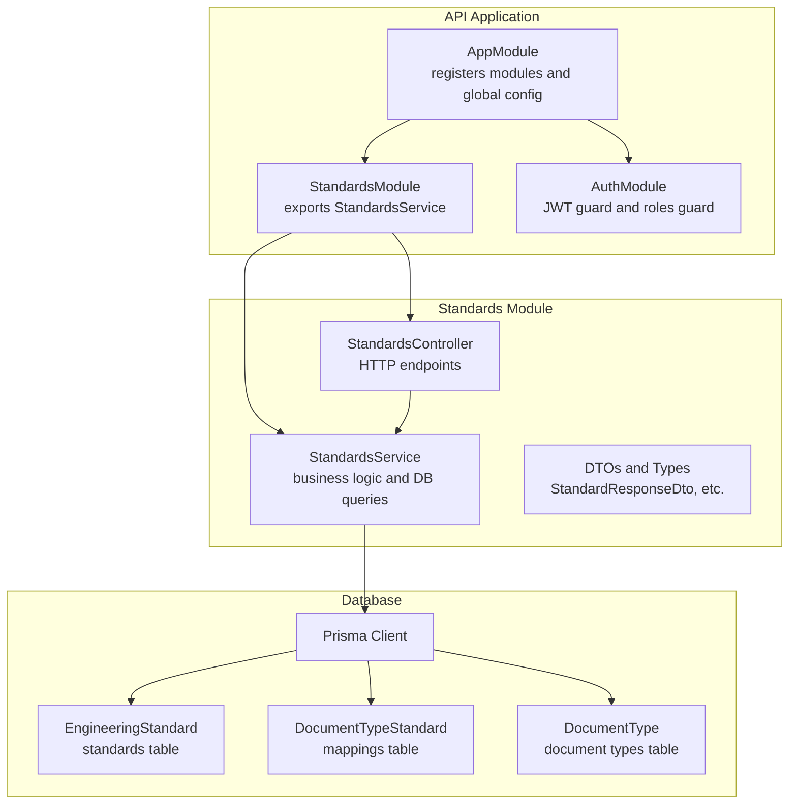
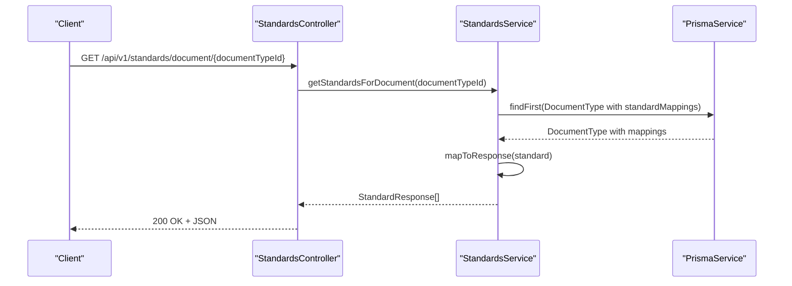
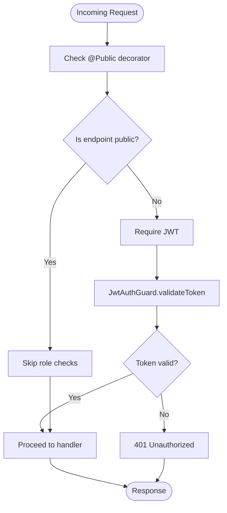
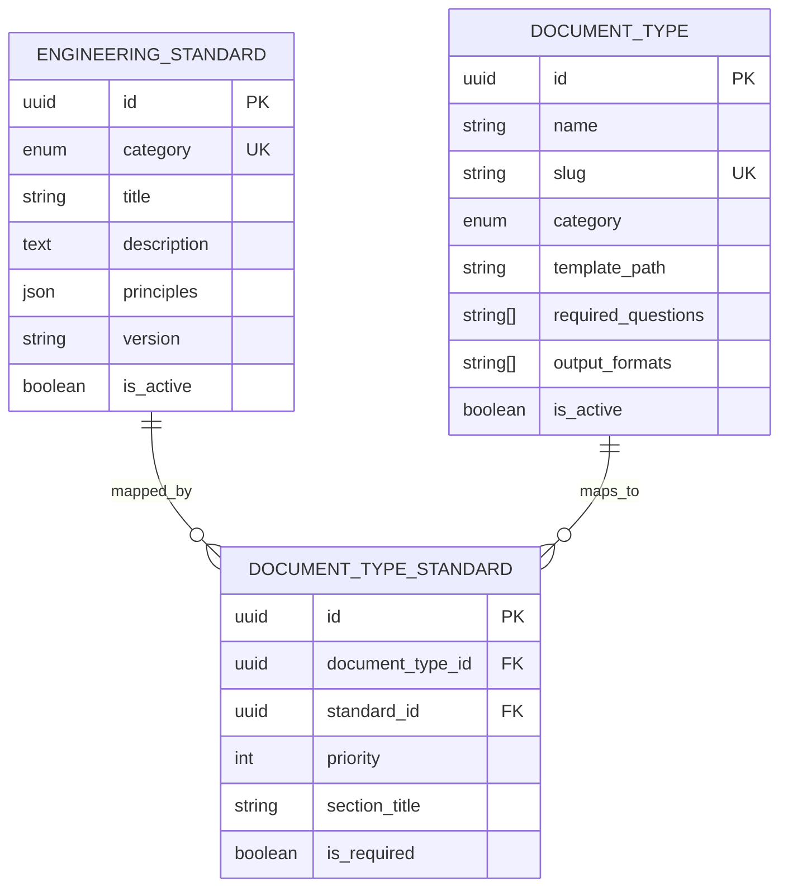
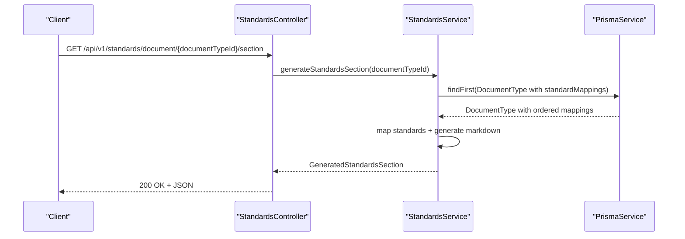
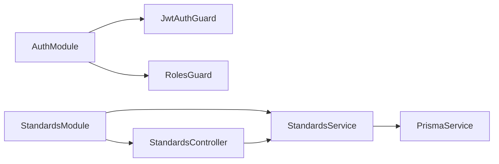

# Standards Endpoints

<cite>
**Referenced Files in This Document**
- [standards.controller.ts](file://apps/api/src/modules/standards/standards.controller.ts)
- [standards.service.ts](file://apps/api/src/modules/standards/standards.service.ts)
- [standard.dto.ts](file://apps/api/src/modules/standards/dto/standard.dto.ts)
- [standard.types.ts](file://apps/api/src/modules/standards/types/standard.types.ts)
- [standards.module.ts](file://apps/api/src/modules/standards/standards.module.ts)
- [jwt-auth.guard.ts](file://apps/api/src/modules/auth/guards/jwt-auth.guard.ts)
- [roles.guard.ts](file://apps/api/src/modules/auth/guards/roles.guard.ts)
- [roles.decorator.ts](file://apps/api/src/modules/auth/decorators/roles.decorator.ts)
- [user.decorator.ts](file://apps/api/src/modules/auth/decorators/user.decorator.ts)
- [auth.controller.ts](file://apps/api/src/modules/auth/auth.controller.ts)
- [schema.prisma](file://prisma/schema.prisma)
- [standards.seed.ts](file://prisma/seeds/standards.seed.ts)
- [main.ts](file://apps/api/src/main.ts)
- [app.module.ts](file://apps/api/src/app.module.ts)
</cite>

## Table of Contents
1. [Introduction](#introduction)
2. [Project Structure](#project-structure)
3. [Core Components](#core-components)
4. [Architecture Overview](#architecture-overview)
5. [Detailed Component Analysis](#detailed-component-analysis)
6. [Dependency Analysis](#dependency-analysis)
7. [Performance Considerations](#performance-considerations)
8. [Troubleshooting Guide](#troubleshooting-guide)
9. [Conclusion](#conclusion)

## Introduction
This document provides comprehensive API documentation for the engineering standards management endpoints. It covers the available endpoints, request/response schemas, authentication and authorization requirements, standards categorization, compliance mapping to document types, and integration with document generation. The focus is on:
- Listing standards with optional category filtering
- Retrieving standards with associated document type mappings
- Generating standards sections for specific document types
- Understanding the data models and relationships

## Project Structure
The standards feature is implemented as a dedicated module within the API application. The module includes a controller, service, DTOs, and type definitions. The module is registered in the main application module and integrates with the database via Prisma.

**Diagram sources**
- [app.module.ts](file://apps/api/src/app.module.ts#L16-L66)
- [standards.module.ts](file://apps/api/src/modules/standards/standards.module.ts#L6-L12)
- [standards.controller.ts](file://apps/api/src/modules/standards/standards.controller.ts#L12-L15)
- [standards.service.ts](file://apps/api/src/modules/standards/standards.service.ts#L12-L14)
- [schema.prisma](file://prisma/schema.prisma#L412-L446)

**Section sources**
- [standards.module.ts](file://apps/api/src/modules/standards/standards.module.ts#L1-L13)
- [app.module.ts](file://apps/api/src/app.module.ts#L1-L67)

## Core Components
- StandardsController: Exposes HTTP endpoints for retrieving standards and generating standards sections for documents.
- StandardsService: Implements business logic, performs database queries via Prisma, and generates Markdown sections.
- DTOs and Types: Define request/response schemas for standards, categories, and document mappings.

Key capabilities:
- List all active standards
- Retrieve a standard by category with document type mappings
- Retrieve standards mapped to a specific document type (by ID or slug)
- Generate a Markdown section summarizing standards for a document type

**Section sources**
- [standards.controller.ts](file://apps/api/src/modules/standards/standards.controller.ts#L17-L85)
- [standards.service.ts](file://apps/api/src/modules/standards/standards.service.ts#L16-L151)
- [standard.dto.ts](file://apps/api/src/modules/standards/dto/standard.dto.ts#L5-L79)
- [standard.types.ts](file://apps/api/src/modules/standards/types/standard.types.ts#L3-L49)

## Architecture Overview
The standards endpoints follow a layered architecture:
- Controller handles HTTP requests and delegates to the service.
- Service encapsulates data retrieval and transformation, including compliance mapping and Markdown generation.
- Database models define the relationships between standards, document types, and mappings.

**Diagram sources**
- [standards.controller.ts](file://apps/api/src/modules/standards/standards.controller.ts#L49-L66)
- [standards.service.ts](file://apps/api/src/modules/standards/standards.service.ts#L72-L103)

## Detailed Component Analysis

### Authentication and Authorization
- Authentication: JWT is required for protected routes. The application uses a JWT guard that validates tokens and rejects expired or invalid tokens.
- Authorization: The standards endpoints are decorated as public, meaning they do not require specific roles. Admin-only operations are not present in the standards endpoints shown here.

**Diagram sources**
- [jwt-auth.guard.ts](file://apps/api/src/modules/auth/guards/jwt-auth.guard.ts#L12-L36)
- [standards.controller.ts](file://apps/api/src/modules/standards/standards.controller.ts#L18-L19)

**Section sources**
- [jwt-auth.guard.ts](file://apps/api/src/modules/auth/guards/jwt-auth.guard.ts#L1-L38)
- [roles.guard.ts](file://apps/api/src/modules/auth/guards/roles.guard.ts#L1-L39)
- [roles.decorator.ts](file://apps/api/src/modules/auth/decorators/roles.decorator.ts#L1-L7)
- [user.decorator.ts](file://apps/api/src/modules/auth/decorators/user.decorator.ts#L1-L16)
- [auth.controller.ts](file://apps/api/src/modules/auth/auth.controller.ts#L64-L72)
- [standards.controller.ts](file://apps/api/src/modules/standards/standards.controller.ts#L10-L19)

### Standards Endpoints

#### GET /api/v1/standards
- Description: Returns a list of all active engineering standards, ordered by category.
- Authentication: Not required (public endpoint).
- Response: Array of StandardResponseDto.

Response schema (StandardResponseDto):
- id: string
- category: enum (MODERN_ARCHITECTURE, AI_ASSISTED_DEV, CODING_STANDARDS, TESTING_QA, SECURITY_DEVSECOPS, WORKFLOW_OPS, DOCS_KNOWLEDGE)
- title: string
- description: string
- principles: array of objects with title, description, optional examples
- version: string
- isActive: boolean

**Section sources**
- [standards.controller.ts](file://apps/api/src/modules/standards/standards.controller.ts#L17-L27)
- [standards.service.ts](file://apps/api/src/modules/standards/standards.service.ts#L16-L23)
- [standard.dto.ts](file://apps/api/src/modules/standards/dto/standard.dto.ts#L5-L30)

#### GET /api/v1/standards/:category
- Description: Retrieves a single standard by category, including document type mappings.
- Path parameters:
  - category: enum (StandardCategory)
- Authentication: Not required (public endpoint).
- Response: StandardWithMappingsDto.

Response schema (StandardWithMappingsDto):
- All fields from StandardResponseDto
- documentTypes: array of DocumentTypeMappingDto
  - id: string
  - name: string
  - slug: string
  - sectionTitle?: string
  - priority: number

**Section sources**
- [standards.controller.ts](file://apps/api/src/modules/standards/standards.controller.ts#L29-L47)
- [standards.service.ts](file://apps/api/src/modules/standards/standards.service.ts#L37-L70)
- [standard.dto.ts](file://apps/api/src/modules/standards/dto/standard.dto.ts#L76-L79)

#### GET /api/v1/standards/document/:documentTypeId
- Description: Returns all standards mapped to a specific document type, identified by ID or slug.
- Path parameters:
  - documentTypeId: string (ID or slug)
- Authentication: Not required (public endpoint).
- Response: Array of StandardResponseDto.

Behavior:
- Finds document type by ID or slug.
- Returns standards in priority order defined by the mapping.

**Section sources**
- [standards.controller.ts](file://apps/api/src/modules/standards/standards.controller.ts#L49-L66)
- [standards.service.ts](file://apps/api/src/modules/standards/standards.service.ts#L72-L103)

#### GET /api/v1/standards/document/:documentTypeId/section
- Description: Generates a Markdown section summarizing the standards applied to a document type.
- Path parameters:
  - documentTypeId: string (ID or slug)
- Authentication: Not required (public endpoint).
- Response: StandardsSectionResponseDto.

Response schema (StandardsSectionResponseDto):
- markdown: string (generated Markdown content)
- standards: array of objects with category, title, and principles

Generation logic:
- Uses the mapping priority to order standards.
- If no mappings exist, returns empty markdown and empty standards array.
- Uses predefined category titles when sectionTitle is not set.

**Section sources**
- [standards.controller.ts](file://apps/api/src/modules/standards/standards.controller.ts#L68-L85)
- [standards.service.ts](file://apps/api/src/modules/standards/standards.service.ts#L105-L151)
- [standard.dto.ts](file://apps/api/src/modules/standards/dto/standard.dto.ts#L44-L57)
- [standard.types.ts](file://apps/api/src/modules/standards/types/standard.types.ts#L42-L49)

### Data Models and Relationships

**Diagram sources**
- [schema.prisma](file://prisma/schema.prisma#L412-L446)

### Standards Categories and Titles
The system defines seven standard categories. A mapping provides human-friendly titles used in generated content.

Categories:
- MODERN_ARCHITECTURE
- AI_ASSISTED_DEV
- CODING_STANDARDS
- TESTING_QA
- SECURITY_DEVSECOPS
- WORKFLOW_OPS
- DOCS_KNOWLEDGE

Category titles mapping:
- MODERN_ARCHITECTURE → "Modern Architecture & Design"
- AI_ASSISTED_DEV → "AI-Assisted Development"
- CODING_STANDARDS → "Coding Standards & Principles"
- TESTING_QA → "Testing & Quality Assurance"
- SECURITY_DEVSECOPS → "Security (DevSecOps)"
- WORKFLOW_OPS → "Workflow & Operations"
- DOCS_KNOWLEDGE → "Documentation & Knowledge"

**Section sources**
- [schema.prisma](file://prisma/schema.prisma#L68-L76)
- [standard.types.ts](file://apps/api/src/modules/standards/types/standard.types.ts#L51-L59)
- [standards.seed.ts](file://prisma/seeds/standards.seed.ts#L274-L349)

### Compliance Mapping and Document Generation
- Compliance mapping: Document types are linked to standards via DocumentTypeStandard with priority and optional custom section titles.
- Document generation: The service aggregates standards for a document type, orders them by priority, and generates Markdown content summarizing principles.

**Diagram sources**
- [standards.controller.ts](file://apps/api/src/modules/standards/standards.controller.ts#L68-L85)
- [standards.service.ts](file://apps/api/src/modules/standards/standards.service.ts#L105-L151)

**Section sources**
- [standards.service.ts](file://apps/api/src/modules/standards/standards.service.ts#L105-L151)
- [standards.seed.ts](file://prisma/seeds/standards.seed.ts#L210-L272)

## Dependency Analysis
- StandardsController depends on StandardsService for business logic.
- StandardsService depends on PrismaService for database operations.
- The module is imported by AppModule, which also registers global configuration, guards, and interceptors.

**Diagram sources**
- [app.module.ts](file://apps/api/src/app.module.ts#L16-L66)
- [standards.module.ts](file://apps/api/src/modules/standards/standards.module.ts#L6-L12)
- [standards.controller.ts](file://apps/api/src/modules/standards/standards.controller.ts#L12-L15)
- [standards.service.ts](file://apps/api/src/modules/standards/standards.service.ts#L12-L14)

**Section sources**
- [standards.module.ts](file://apps/api/src/modules/standards/standards.module.ts#L1-L13)
- [app.module.ts](file://apps/api/src/app.module.ts#L1-L67)

## Performance Considerations
- Database queries are optimized with appropriate includes and ordering:
  - findAll: filters by isActive and orders by category.
  - findWithMappings: includes documentMappings and orders by priority.
  - getStandardsForDocument: finds by ID or slug and includes ordered mappings.
- Consider caching frequently accessed standards or generated Markdown for high-traffic scenarios.
- Pagination is not implemented for standard listings; for large datasets, consider adding pagination DTOs and cursor-based pagination.

## Troubleshooting Guide
Common issues and resolutions:
- 404 Not Found: Returned when a category does not exist or a document type is not found by ID/slug. Verify the category or documentTypeId parameter.
- 401 Unauthorized: Occurs when JWT guard rejects invalid or expired tokens. Ensure the Authorization header contains a valid JWT.
- Empty section generation: When a document type has no standard mappings, the section generator returns empty markdown and an empty standards array.

Operational notes:
- Global prefix: The API uses a configurable prefix (default "api/v1").
- Swagger: Available in non-production environments for interactive documentation.

**Section sources**
- [standards.service.ts](file://apps/api/src/modules/standards/standards.service.ts#L30-L32)
- [standards.service.ts](file://apps/api/src/modules/standards/standards.service.ts#L96-L98)
- [jwt-auth.guard.ts](file://apps/api/src/modules/auth/guards/jwt-auth.guard.ts#L25-L36)
- [main.ts](file://apps/api/src/main.ts#L31-L31)

## Conclusion
The standards management endpoints provide a robust foundation for retrieving engineering standards, understanding compliance mappings, and generating standardized documentation sections. The design leverages clear DTOs, strong typing via enums, and explicit database relationships. While the current endpoints are public, the underlying architecture supports future enhancements such as role-based restrictions and administrative operations.