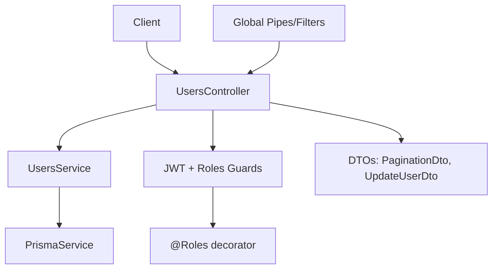
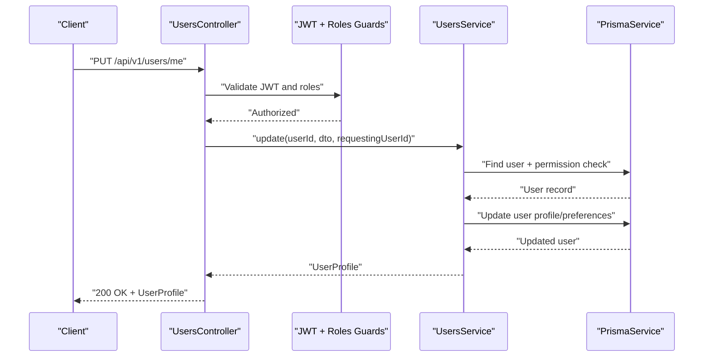
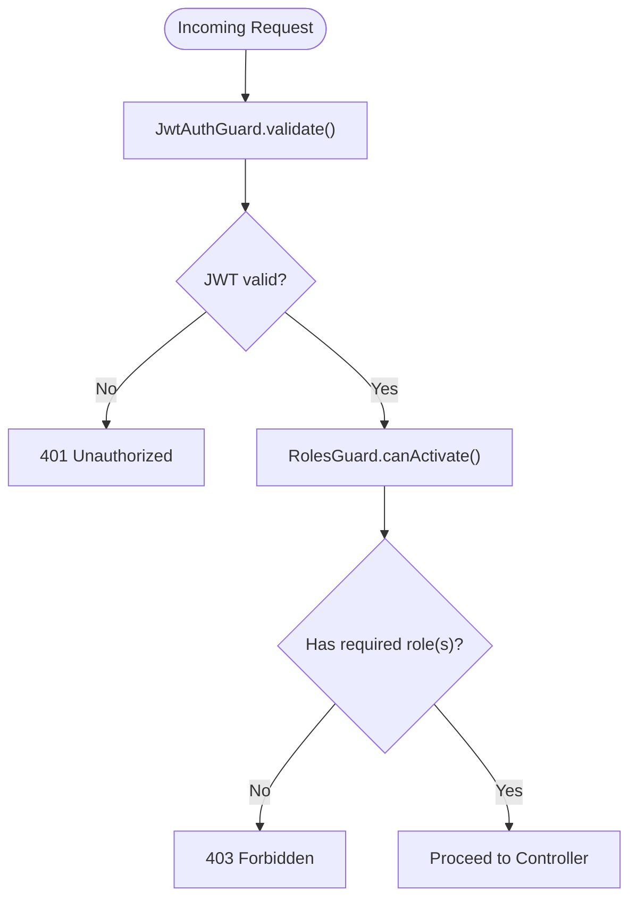
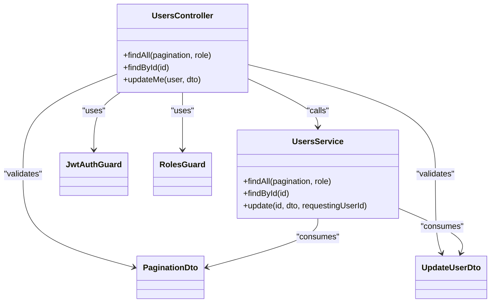

# User Management Endpoints

<cite>
**Referenced Files in This Document**
- [users.controller.ts](file://apps/api/src/modules/users/users.controller.ts)
- [users.service.ts](file://apps/api/src/modules/users/users.service.ts)
- [update-user.dto.ts](file://apps/api/src/modules/users/dto/update-user.dto.ts)
- [pagination.dto.ts](file://libs/shared/src/dto/pagination.dto.ts)
- [jwt-auth.guard.ts](file://apps/api/src/modules/auth/guards/jwt-auth.guard.ts)
- [roles.guard.ts](file://apps/api/src/modules/auth/guards/roles.guard.ts)
- [roles.decorator.ts](file://apps/api/src/modules/auth/decorators/roles.decorator.ts)
- [user.decorator.ts](file://apps/api/src/modules/auth/decorators/user.decorator.ts)
- [http-exception.filter.ts](file://apps/api/src/common/filters/http-exception.filter.ts)
- [main.ts](file://apps/api/src/main.ts)
</cite>

## Table of Contents
1. [Introduction](#introduction)
2. [Project Structure](#project-structure)
3. [Core Components](#core-components)
4. [Architecture Overview](#architecture-overview)
5. [Detailed Component Analysis](#detailed-component-analysis)
6. [Dependency Analysis](#dependency-analysis)
7. [Performance Considerations](#performance-considerations)
8. [Troubleshooting Guide](#troubleshooting-guide)
9. [Conclusion](#conclusion)

## Introduction
This document provides comprehensive API documentation for user management endpoints. It covers:
- GET /api/v1/users (list users with pagination and filtering)
- PUT /api/v1/users/me (update current user profile)
- GET /api/v1/users/:id (get specific user by ID)

It specifies request/response schemas, authentication and authorization requirements, error responses, and practical examples.

## Project Structure
The user management functionality is implemented within the NestJS application under the users module. Key components:
- Controller: exposes HTTP endpoints and applies guards and decorators
- Service: encapsulates business logic, data mapping, and persistence
- DTOs: define request schemas and validation rules
- Guards and Decorators: enforce JWT authentication and role-based authorization
- Global Filters: standardize error responses

**Diagram sources**
- [users.controller.ts](file://apps/api/src/modules/users/users.controller.ts#L22-L78)
- [users.service.ts](file://apps/api/src/modules/users/users.service.ts#L37-L200)
- [pagination.dto.ts](file://libs/shared/src/dto/pagination.dto.ts#L5-L25)
- [update-user.dto.ts](file://apps/api/src/modules/users/dto/update-user.dto.ts#L4-L36)
- [jwt-auth.guard.ts](file://apps/api/src/modules/auth/guards/jwt-auth.guard.ts#L6-L38)
- [roles.guard.ts](file://apps/api/src/modules/auth/guards/roles.guard.ts#L7-L39)
- [roles.decorator.ts](file://apps/api/src/modules/auth/decorators/roles.decorator.ts#L4-L7)

**Section sources**
- [users.controller.ts](file://apps/api/src/modules/users/users.controller.ts#L22-L78)
- [users.service.ts](file://apps/api/src/modules/users/users.service.ts#L37-L200)
- [pagination.dto.ts](file://libs/shared/src/dto/pagination.dto.ts#L5-L25)
- [update-user.dto.ts](file://apps/api/src/modules/users/dto/update-user.dto.ts#L4-L36)
- [jwt-auth.guard.ts](file://apps/api/src/modules/auth/guards/jwt-auth.guard.ts#L6-L38)
- [roles.guard.ts](file://apps/api/src/modules/auth/guards/roles.guard.ts#L7-L39)
- [roles.decorator.ts](file://apps/api/src/modules/auth/decorators/roles.decorator.ts#L4-L7)
- [main.ts](file://apps/api/src/main.ts#L34-L49)

## Core Components
- UsersController: Defines endpoints, applies guards, and delegates to service
- UsersService: Implements CRUD-like operations, permission checks, and data mapping
- UpdateUserDto: Schema for user profile updates
- PaginationDto: Shared pagination parameters

Key responsibilities:
- Authentication: JWT required for all user endpoints
- Authorization: 
  - GET /users and GET /users/:id require ADMIN or SUPER_ADMIN roles
  - PUT /users/me allows self-service updates
- Error handling: Standardized via global exception filter

**Section sources**
- [users.controller.ts](file://apps/api/src/modules/users/users.controller.ts#L26-L78)
- [users.service.ts](file://apps/api/src/modules/users/users.service.ts#L75-L127)
- [update-user.dto.ts](file://apps/api/src/modules/users/dto/update-user.dto.ts#L4-L36)
- [pagination.dto.ts](file://libs/shared/src/dto/pagination.dto.ts#L5-L25)

## Architecture Overview
The user management endpoints follow a layered architecture:
- HTTP Layer: Controllers expose routes
- Application Layer: Guards and decorators enforce auth/authorization
- Domain Layer: Service performs business logic and data mapping
- Persistence Layer: Prisma client handles database operations

**Diagram sources**
- [users.controller.ts](file://apps/api/src/modules/users/users.controller.ts#L36-L44)
- [users.service.ts](file://apps/api/src/modules/users/users.service.ts#L75-L127)
- [jwt-auth.guard.ts](file://apps/api/src/modules/auth/guards/jwt-auth.guard.ts#L12-L36)
- [roles.guard.ts](file://apps/api/src/modules/auth/guards/roles.guard.ts#L11-L37)

## Detailed Component Analysis

### Endpoint: GET /api/v1/users
- Purpose: List all users with pagination and optional role filtering
- Authentication: JWT required
- Authorization: ADMIN or SUPER_ADMIN
- Path: GET /api/v1/users
- Query parameters:
  - Pagination: page, limit (validated via PaginationDto)
  - Filter: role (enum from UserRole)
- Response: Paginated list of users with metadata

Request schema
- Query parameters:
  - page: integer, minimum 1, default 1
  - limit: integer, minimum 1, maximum 100, default 20
  - role: enum UserRole (ADMIN, SUPER_ADMIN, CLIENT, DEVELOPER)

Response schema
- items: array of UserProfile
- pagination: { page, limit, total, totalPages }

UserProfile structure
- id: string
- email: string
- role: UserRole
- profile: { name?, phone?, timezone?, language?, avatarUrl? }
- preferences: { notifications?: { email: boolean, push: boolean }, theme? }
- organization: { id, name }?
- statistics: { completedSessions, documentsGenerated, lastActiveAt }
- createdAt: Date

Common operations
- List all users: GET /api/v1/users?page=1&limit=20
- Filter by role: GET /api/v1/users?role=ADMIN&page=1&limit=20

**Section sources**
- [users.controller.ts](file://apps/api/src/modules/users/users.controller.ts#L46-L66)
- [users.service.ts](file://apps/api/src/modules/users/users.service.ts#L129-L164)
- [pagination.dto.ts](file://libs/shared/src/dto/pagination.dto.ts#L5-L25)

### Endpoint: PUT /api/v1/users/me
- Purpose: Update current user's profile (self-service)
- Authentication: JWT required
- Authorization: Any authenticated user can update their own profile
- Path: PUT /api/v1/users/me
- Request body: UpdateUserDto
- Response: Updated UserProfile

UpdateUserDto schema
- name: string, max length 100 (optional)
- phone: string, max length 20 (optional)
- timezone: string, max length 50 (optional)
- preferences: object with:
  - notifications: { email: boolean, push: boolean } (optional)
  - theme: string (optional)

Permission rules
- Users can only update their own profile
- Admin/SuperAdmin can update others (handled by service logic)

Common operations
- Update name and timezone: PUT /api/v1/users/me with name and timezone
- Update preferences: PUT /api/v1/users/me with preferences object

**Section sources**
- [users.controller.ts](file://apps/api/src/modules/users/users.controller.ts#L36-L44)
- [users.service.ts](file://apps/api/src/modules/users/users.service.ts#L75-L127)
- [update-user.dto.ts](file://apps/api/src/modules/users/dto/update-user.dto.ts#L4-L36)

### Endpoint: GET /api/v1/users/:id
- Purpose: Retrieve a specific user by ID
- Authentication: JWT required
- Authorization: ADMIN or SUPER_ADMIN
- Path: GET /api/v1/users/:id
- Path parameter: id (UUID)
- Response: UserProfile

Common operations
- Get user by ID: GET /api/v1/users/<valid-uuid>

Error handling
- 404 Not Found: User does not exist or is soft-deleted

**Section sources**
- [users.controller.ts](file://apps/api/src/modules/users/users.controller.ts#L68-L76)
- [users.service.ts](file://apps/api/src/modules/users/users.service.ts#L41-L73)

### Authentication and Authorization
- JWT requirement: All user endpoints require a valid Bearer token
- Role-based access:
  - Admin-only endpoints: GET /users, GET /users/:id
  - Self-service endpoint: PUT /users/me
- Guards and decorators:
  - JwtAuthGuard validates token and extracts user
  - RolesGuard enforces required roles per endpoint
  - @Roles decorator defines allowed roles
  - @CurrentUser decorator injects the authenticated user

**Diagram sources**
- [jwt-auth.guard.ts](file://apps/api/src/modules/auth/guards/jwt-auth.guard.ts#L12-L36)
- [roles.guard.ts](file://apps/api/src/modules/auth/guards/roles.guard.ts#L11-L37)
- [roles.decorator.ts](file://apps/api/src/modules/auth/decorators/roles.decorator.ts#L4-L7)
- [user.decorator.ts](file://apps/api/src/modules/auth/decorators/user.decorator.ts#L4-L16)

**Section sources**
- [jwt-auth.guard.ts](file://apps/api/src/modules/auth/guards/jwt-auth.guard.ts#L6-L38)
- [roles.guard.ts](file://apps/api/src/modules/auth/guards/roles.guard.ts#L7-L39)
- [roles.decorator.ts](file://apps/api/src/modules/auth/decorators/roles.decorator.ts#L4-L7)
- [user.decorator.ts](file://apps/api/src/modules/auth/decorators/user.decorator.ts#L4-L16)

### Error Responses
Standardized error response format:
- success: false
- error: { code, message, details?, requestId?, timestamp }
- Status codes:
  - 401: UNAUTHORIZED (invalid/expired token)
  - 403: FORBIDDEN (missing/insufficient roles)
  - 404: NOT_FOUND (user not found)
  - 422: UNPROCESSABLE_ENTITY (validation errors)
  - 500: INTERNAL_ERROR (unexpected server errors)

Example error payload
- { success: false, error: { code: "UNAUTHORIZED", message: "Authentication required", timestamp: "...", requestId: "<trace-id>" } }

**Section sources**
- [http-exception.filter.ts](file://apps/api/src/common/filters/http-exception.filter.ts#L26-L101)

## Dependency Analysis
- Controller depends on:
  - UsersService for business logic
  - Guards and decorators for auth/authorization
  - DTOs for validation
- Service depends on:
  - PrismaService for database operations
  - UpdateUserDto and PaginationDto for input validation
- Guards depend on:
  - AuthenticatedUser extracted from JWT
  - Roles metadata set by @Roles decorator

**Diagram sources**
- [users.controller.ts](file://apps/api/src/modules/users/users.controller.ts#L26-L78)
- [users.service.ts](file://apps/api/src/modules/users/users.service.ts#L37-L200)
- [pagination.dto.ts](file://libs/shared/src/dto/pagination.dto.ts#L5-L25)
- [update-user.dto.ts](file://apps/api/src/modules/users/dto/update-user.dto.ts#L4-L36)
- [jwt-auth.guard.ts](file://apps/api/src/modules/auth/guards/jwt-auth.guard.ts#L6-L38)
- [roles.guard.ts](file://apps/api/src/modules/auth/guards/roles.guard.ts#L7-L39)

**Section sources**
- [users.controller.ts](file://apps/api/src/modules/users/users.controller.ts#L26-L78)
- [users.service.ts](file://apps/api/src/modules/users/users.service.ts#L37-L200)

## Performance Considerations
- Pagination limits: Default limit is 20, maximum is 100 per PaginationDto
- Efficient queries: Service uses skip/take for pagination and counts total records
- Lazy loading: Includes related data selectively (organization, session counts)
- Validation overhead: Global ValidationPipe transforms and validates inputs

## Troubleshooting Guide
Common issues and resolutions
- 401 Unauthorized:
  - Cause: Missing or invalid Bearer token
  - Resolution: Obtain a valid access token via authentication endpoints
- 403 Forbidden:
  - Cause: Insufficient roles for admin-only endpoints
  - Resolution: Use an ADMIN or SUPER_ADMIN account
- 404 Not Found:
  - Cause: User does not exist or soft-deleted
  - Resolution: Verify the user ID and ensure the user is active
- 422 Unprocessable Entity:
  - Cause: Validation errors in request body
  - Resolution: Check field lengths and types against DTO constraints

**Section sources**
- [http-exception.filter.ts](file://apps/api/src/common/filters/http-exception.filter.ts#L36-L101)
- [users.service.ts](file://apps/api/src/modules/users/users.service.ts#L58-L88)

## Conclusion
The user management endpoints provide secure, role-aware operations for listing, retrieving, and updating user profiles. They enforce JWT authentication and role-based authorization, offer standardized pagination and filtering, and return consistent error responses. Following the documented schemas and authorization rules ensures reliable integration.