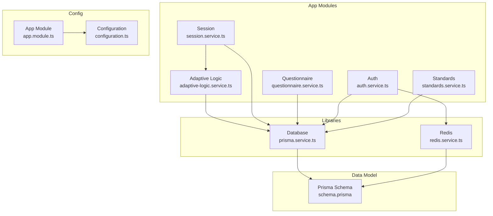
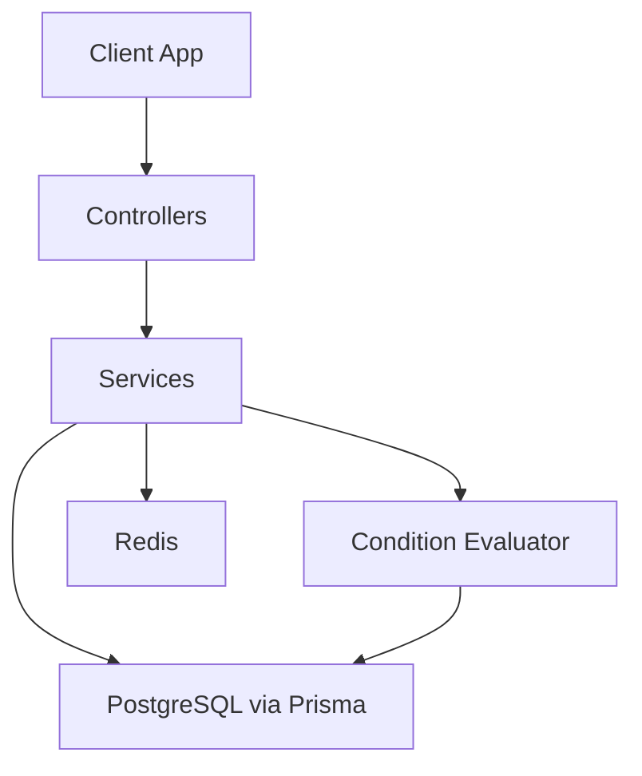
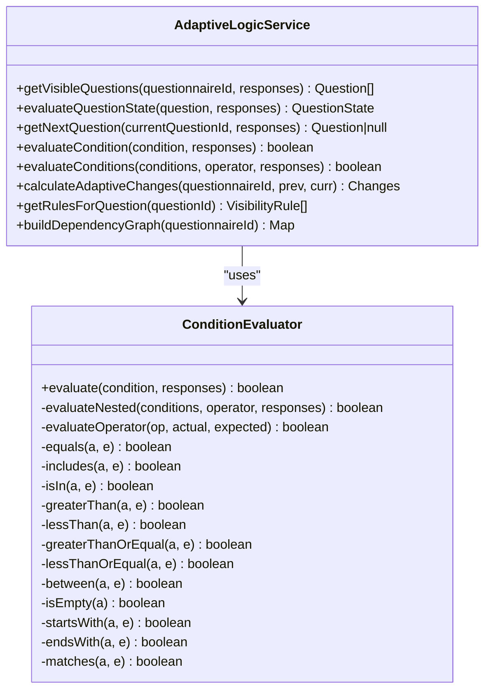
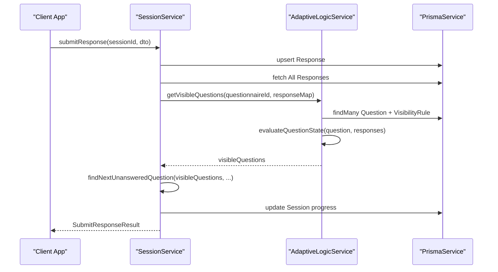
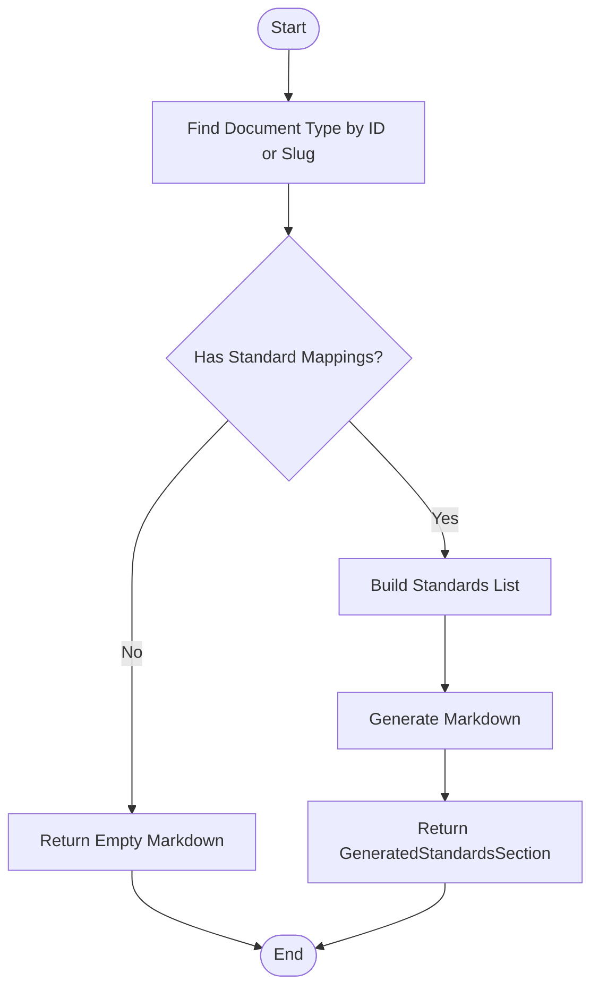
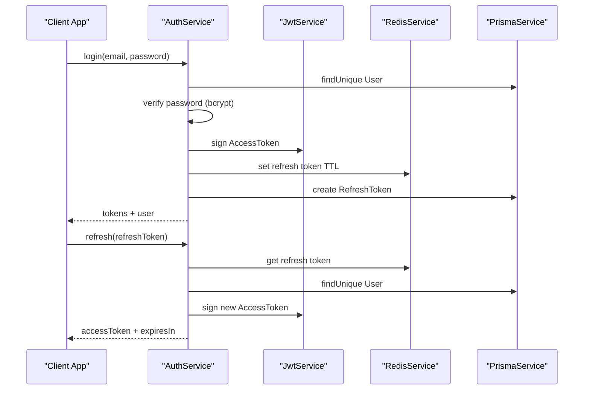
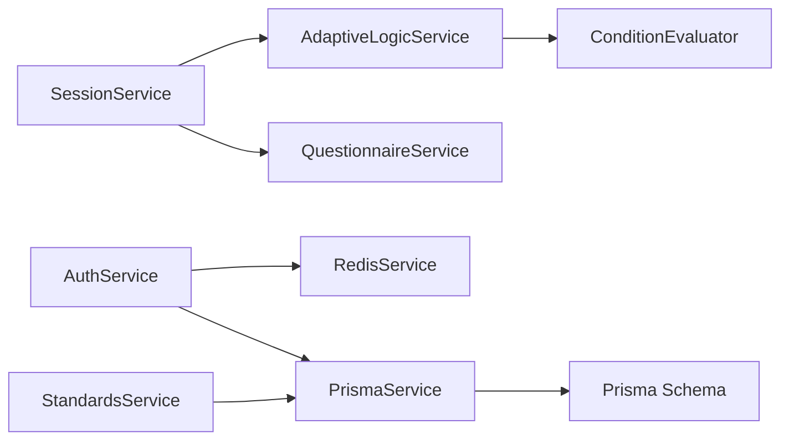

# Advanced Topics

<cite>
**Referenced Files in This Document**
- [adaptive-logic.service.ts](file://apps/api/src/modules/adaptive-logic/adaptive-logic.service.ts)
- [condition.evaluator.ts](file://apps/api/src/modules/adaptive-logic/evaluators/condition.evaluator.ts)
- [rule.types.ts](file://apps/api/src/modules/adaptive-logic/types/rule.types.ts)
- [session.service.ts](file://apps/api/src/modules/session/session.service.ts)
- [questionnaire.service.ts](file://apps/api/src/modules/questionnaire/questionnaire.service.ts)
- [schema.prisma](file://prisma/schema.prisma)
- [prisma.service.ts](file://libs/database/src/prisma.service.ts)
- [redis.service.ts](file://libs/redis/src/redis.service.ts)
- [configuration.ts](file://apps/api/src/config/configuration.ts)
- [app.module.ts](file://apps/api/src/app.module.ts)
- [auth.service.ts](file://apps/api/src/modules/auth/auth.service.ts)
- [jwt-auth.guard.ts](file://apps/api/src/modules/auth/guards/jwt-auth.guard.ts)
- [jwt.strategy.ts](file://apps/api/src/modules/auth/strategies/jwt.strategy.ts)
- [standards.service.ts](file://apps/api/src/modules/standards/standards.service.ts)
- [08-information-security-policy.md](file://docs/cto/08-information-security-policy.md)
- [10-data-protection-privacy-policy.md](file://docs/cto/10-data-protection-privacy-policy.md)
</cite>

## Table of Contents
1. [Introduction](#introduction)
2. [Project Structure](#project-structure)
3. [Core Components](#core-components)
4. [Architecture Overview](#architecture-overview)
5. [Detailed Component Analysis](#detailed-component-analysis)
6. [Dependency Analysis](#dependency-analysis)
7. [Performance Considerations](#performance-considerations)
8. [Security Best Practices](#security-best-practices)
9. [Advanced Integration Patterns](#advanced-integration-patterns)
10. [System Customization and Plugin Development](#system-customization-and-plugin-development)
11. [Advanced Configuration Options](#advanced-configuration-options)
12. [Troubleshooting Guide](#troubleshooting-guide)
13. [Conclusion](#conclusion)

## Introduction
This document provides advanced topics for the Quiz-to-build system, focusing on extending adaptive logic with custom rule development, expanding question types with custom validation and rendering, optimizing performance for large-scale deployments, securing sensitive data, integrating with external systems, and customizing the platform for production-grade environments.

## Project Structure
The system is organized as a NestJS monorepo with modular feature domains:
- Adaptive logic engine for dynamic visibility and branching
- Questionnaire and session orchestration
- Standards and compliance mapping
- Authentication and authorization
- Database and Redis integration
- Configuration and deployment modules

**Diagram sources**
- [adaptive-logic.service.ts](file://apps/api/src/modules/adaptive-logic/adaptive-logic.service.ts#L1-L307)
- [session.service.ts](file://apps/api/src/modules/session/session.service.ts#L1-L684)
- [questionnaire.service.ts](file://apps/api/src/modules/questionnaire/questionnaire.service.ts#L1-L253)
- [auth.service.ts](file://apps/api/src/modules/auth/auth.service.ts#L1-L278)
- [standards.service.ts](file://apps/api/src/modules/standards/standards.service.ts#L1-L197)
- [prisma.service.ts](file://libs/database/src/prisma.service.ts#L1-L62)
- [redis.service.ts](file://libs/redis/src/redis.service.ts#L1-L96)
- [configuration.ts](file://apps/api/src/config/configuration.ts#L1-L49)
- [app.module.ts](file://apps/api/src/app.module.ts#L1-L67)
- [schema.prisma](file://prisma/schema.prisma#L1-L447)

**Section sources**
- [app.module.ts](file://apps/api/src/app.module.ts#L1-L67)
- [configuration.ts](file://apps/api/src/config/configuration.ts#L1-L49)
- [schema.prisma](file://prisma/schema.prisma#L1-L447)

## Core Components
- Adaptive Logic Engine: Evaluates visibility rules, supports nested conditions, logical operators, and priority-based actions.
- Session Orchestration: Manages questionnaire sessions, progress tracking, and adaptive state transitions.
- Questionnaire Service: Provides questionnaire and question metadata, including options and validation rules.
- Authentication and Authorization: JWT-based authentication with refresh token storage in Redis and database audit.
- Standards and Compliance: Maps engineering standards to document types and generates compliance sections.
- Database and Redis: Prisma ORM with PostgreSQL and Redis caching/locking.

**Section sources**
- [adaptive-logic.service.ts](file://apps/api/src/modules/adaptive-logic/adaptive-logic.service.ts#L1-L307)
- [session.service.ts](file://apps/api/src/modules/session/session.service.ts#L1-L684)
- [questionnaire.service.ts](file://apps/api/src/modules/questionnaire/questionnaire.service.ts#L1-L253)
- [auth.service.ts](file://apps/api/src/modules/auth/auth.service.ts#L1-L278)
- [standards.service.ts](file://apps/api/src/modules/standards/standards.service.ts#L1-L197)
- [prisma.service.ts](file://libs/database/src/prisma.service.ts#L1-L62)
- [redis.service.ts](file://libs/redis/src/redis.service.ts#L1-L96)

## Architecture Overview
The system follows a layered architecture with clear separation of concerns:
- Presentation and orchestration in controllers/services
- Domain logic encapsulated in feature modules
- Persistence via Prisma ORM
- Caching and session tokens via Redis
- Security via JWT and RBAC

**Diagram sources**
- [session.service.ts](file://apps/api/src/modules/session/session.service.ts#L1-L684)
- [adaptive-logic.service.ts](file://apps/api/src/modules/adaptive-logic/adaptive-logic.service.ts#L1-L307)
- [condition.evaluator.ts](file://apps/api/src/modules/adaptive-logic/evaluators/condition.evaluator.ts#L1-L402)
- [prisma.service.ts](file://libs/database/src/prisma.service.ts#L1-L62)
- [redis.service.ts](file://libs/redis/src/redis.service.ts#L1-L96)

## Detailed Component Analysis

### Adaptive Logic Engine
The adaptive logic engine evaluates visibility rules and determines the next question in a session. It supports:
- Nested conditions with logical operators
- Priority-based rule application
- Dependency graph construction for rule relationships
- Efficient visibility calculation and change detection

**Diagram sources**
- [adaptive-logic.service.ts](file://apps/api/src/modules/adaptive-logic/adaptive-logic.service.ts#L1-L307)
- [condition.evaluator.ts](file://apps/api/src/modules/adaptive-logic/evaluators/condition.evaluator.ts#L1-L402)

**Section sources**
- [adaptive-logic.service.ts](file://apps/api/src/modules/adaptive-logic/adaptive-logic.service.ts#L28-L307)
- [condition.evaluator.ts](file://apps/api/src/modules/adaptive-logic/evaluators/condition.evaluator.ts#L9-L402)
- [rule.types.ts](file://apps/api/src/modules/adaptive-logic/types/rule.types.ts#L1-L120)

### Session Orchestration
The session module manages user sessions, progress tracking, and adaptive state transitions. It integrates with the adaptive logic engine to compute visible questions and next steps.

**Diagram sources**
- [session.service.ts](file://apps/api/src/modules/session/session.service.ts#L270-L359)
- [adaptive-logic.service.ts](file://apps/api/src/modules/adaptive-logic/adaptive-logic.service.ts#L31-L195)
- [prisma.service.ts](file://libs/database/src/prisma.service.ts#L1-L62)

**Section sources**
- [session.service.ts](file://apps/api/src/modules/session/session.service.ts#L270-L359)
- [adaptive-logic.service.ts](file://apps/api/src/modules/adaptive-logic/adaptive-logic.service.ts#L31-L195)

### Standards and Compliance
The standards service maps engineering standards to document types and generates compliance sections for reports.

**Diagram sources**
- [standards.service.ts](file://apps/api/src/modules/standards/standards.service.ts#L105-L151)

**Section sources**
- [standards.service.ts](file://apps/api/src/modules/standards/standards.service.ts#L105-L151)

### Authentication and Authorization
Authentication uses JWT with refresh tokens stored in Redis for scalability and auditability. The guard enforces protected routes and handles token expiration.

**Diagram sources**
- [auth.service.ts](file://apps/api/src/modules/auth/auth.service.ts#L85-L158)
- [redis.service.ts](file://libs/redis/src/redis.service.ts#L40-L54)
- [prisma.service.ts](file://libs/database/src/prisma.service.ts#L1-L62)

**Section sources**
- [auth.service.ts](file://apps/api/src/modules/auth/auth.service.ts#L85-L158)
- [jwt-auth.guard.ts](file://apps/api/src/modules/auth/guards/jwt-auth.guard.ts#L1-L38)
- [jwt.strategy.ts](file://apps/api/src/modules/auth/strategies/jwt.strategy.ts#L1-L30)

## Dependency Analysis
The system exhibits low coupling between modules, with clear interfaces:
- Services depend on PrismaService for persistence
- AdaptiveLogicService depends on ConditionEvaluator for evaluation
- SessionService orchestrates AdaptiveLogicService and QuestionnaireService
- Auth service coordinates JWT, Redis, and database refresh tokens

**Diagram sources**
- [session.service.ts](file://apps/api/src/modules/session/session.service.ts#L1-L684)
- [adaptive-logic.service.ts](file://apps/api/src/modules/adaptive-logic/adaptive-logic.service.ts#L1-L307)
- [condition.evaluator.ts](file://apps/api/src/modules/adaptive-logic/evaluators/condition.evaluator.ts#L1-L402)
- [questionnaire.service.ts](file://apps/api/src/modules/questionnaire/questionnaire.service.ts#L1-L253)
- [auth.service.ts](file://apps/api/src/modules/auth/auth.service.ts#L1-L278)
- [standards.service.ts](file://apps/api/src/modules/standards/standards.service.ts#L1-L197)
- [prisma.service.ts](file://libs/database/src/prisma.service.ts#L1-L62)
- [redis.service.ts](file://libs/redis/src/redis.service.ts#L1-L96)
- [schema.prisma](file://prisma/schema.prisma#L1-L447)

**Section sources**
- [session.service.ts](file://apps/api/src/modules/session/session.service.ts#L1-L684)
- [adaptive-logic.service.ts](file://apps/api/src/modules/adaptive-logic/adaptive-logic.service.ts#L1-L307)
- [auth.service.ts](file://apps/api/src/modules/auth/auth.service.ts#L1-L278)

## Performance Considerations
- Caching Strategies
  - Use Redis for session tokens, rate limiting keys, and frequently accessed metadata.
  - Cache computed visibility sets keyed by questionnaireId and response fingerprints to avoid repeated evaluations.
  - Cache document templates and standards mappings to reduce database load during report generation.

- Database Optimization
  - Indexes on frequently queried fields: user_id, questionnaire_id, status, created_at, and composite indexes for session progress.
  - Batch operations for bulk response upserts and pagination for large lists.
  - Connection pooling and query logging for slow query detection.

- Session Management Scaling
  - Stateless JWT access tokens with short TTLs; long-lived refresh tokens stored in Redis with TTL.
  - Horizontal scaling via container orchestration; ensure Redis clustering for high availability.

- Adaptive Logic Efficiency
  - Precompute dependency graphs for rules to minimize repeated scans.
  - Memoize evaluation results for identical conditions across sessions.

[No sources needed since this section provides general guidance]

## Security Best Practices
- Authentication and Authorization
  - Enforce RBAC with role-based access to questionnaire and document resources.
  - Use MFA for privileged roles; enforce password policies and lockout thresholds.
  - Rotate JWT secrets regularly and invalidate refresh tokens on logout.

- Data Protection
  - Encrypt at rest and in transit; apply encryption to sensitive fields.
  - Minimize logging of sensitive data; sanitize logs and audit trails.
  - Implement data retention and deletion policies aligned with privacy regulations.

- Network and Application Security
  - Apply defense-in-depth: WAF, firewall rules, and runtime protection.
  - Conduct regular SAST/DAST scans and penetration testing.
  - Monitor for anomalous access patterns and enforce rate limiting.

**Section sources**
- [08-information-security-policy.md](file://docs/cto/08-information-security-policy.md#L1-L427)
- [10-data-protection-privacy-policy.md](file://docs/cto/10-data-protection-privacy-policy.md#L1-L349)
- [auth.service.ts](file://apps/api/src/modules/auth/auth.service.ts#L1-L278)
- [jwt-auth.guard.ts](file://apps/api/src/modules/auth/guards/jwt-auth.guard.ts#L1-L38)

## Advanced Integration Patterns
- External Systems
  - Use Redis pub/sub for real-time notifications and event-driven updates.
  - Integrate with document generation services by storing generation metadata and status in the Document model.
  - Connect compliance reporting tools by mapping standards to document types and generating markdown sections.

- Compliance Reporting
  - Leverage StandardsService to fetch applicable standards for a document type and render compliance sections.
  - Store generation metadata and review status for auditability.

- Extensibility
  - Extend the QuestionType enum and QuestionnaireService mapping to support new question types.
  - Add custom validation rules in QuestionnaireService and SessionService response validation.

**Section sources**
- [standards.service.ts](file://apps/api/src/modules/standards/standards.service.ts#L105-L151)
- [schema.prisma](file://prisma/schema.prisma#L24-L36)
- [questionnaire.service.ts](file://apps/api/src/modules/questionnaire/questionnaire.service.ts#L236-L251)

## System Customization and Plugin Development
- Custom Rule Development
  - Extend ConditionOperator in rule.types.ts and add new operator handlers in ConditionEvaluator.
  - Define new VisibilityAction semantics in AdaptiveLogicService and update evaluation logic.
  - Use priority and isActive flags to manage rule lifecycles and precedence.

- Question Type Extensions
  - Add new QuestionType variants in the Prisma schema and map them in QuestionnaireService.
  - Implement custom validation logic in SessionService.validateResponse for new types.
  - Render custom UI components by passing type-specific options and validation rules to clients.

- Plugin Hooks
  - Introduce pluggable evaluators for specialized operators while keeping backward compatibility.
  - Use configuration flags to enable/disable experimental features.

**Section sources**
- [rule.types.ts](file://apps/api/src/modules/adaptive-logic/types/rule.types.ts#L1-L120)
- [condition.evaluator.ts](file://apps/api/src/modules/adaptive-logic/evaluators/condition.evaluator.ts#L44-L109)
- [adaptive-logic.service.ts](file://apps/api/src/modules/adaptive-logic/adaptive-logic.service.ts#L104-L153)
- [schema.prisma](file://prisma/schema.prisma#L24-L36)
- [questionnaire.service.ts](file://apps/api/src/modules/questionnaire/questionnaire.service.ts#L236-L251)
- [session.service.ts](file://apps/api/src/modules/session/session.service.ts#L622-L659)

## Advanced Configuration Options
- Environment Variables
  - Database URL, Redis host/port/password, JWT secrets and expiry, bcrypt cost, throttling limits, CORS origins, and logging levels.

- Production Tuning
  - Adjust Prisma client logging and slow query thresholds.
  - Configure Redis retry strategy and connection pooling.
  - Tune NestJS throttler profiles for burst and sustained traffic.

- Security Hardening
  - Enforce HTTPS and secure cookie flags.
  - Restrict CORS origins and configure CSRF protections at the gateway.

**Section sources**
- [configuration.ts](file://apps/api/src/config/configuration.ts#L1-L49)
- [prisma.service.ts](file://libs/database/src/prisma.service.ts#L8-L34)
- [redis.service.ts](file://libs/redis/src/redis.service.ts#L10-L28)
- [app.module.ts](file://apps/api/src/app.module.ts#L26-L42)

## Troubleshooting Guide
- Slow Queries
  - Enable slow query logging in PrismaService for development; monitor durations and optimize indexes.

- Authentication Issues
  - Verify JWT secret configuration and token expiry; check Redis connectivity for refresh tokens.

- Adaptive Logic Errors
  - Validate rule conditions and operators; ensure response shapes match expected structures.

- Session Progress Mismatches
  - Recalculate progress using total visible questions and response counts; confirm evaluation order and priorities.

**Section sources**
- [prisma.service.ts](file://libs/database/src/prisma.service.ts#L25-L33)
- [auth.service.ts](file://apps/api/src/modules/auth/auth.service.ts#L128-L158)
- [adaptive-logic.service.ts](file://apps/api/src/modules/adaptive-logic/adaptive-logic.service.ts#L88-L153)
- [session.service.ts](file://apps/api/src/modules/session/session.service.ts#L609-L620)

## Conclusion
The Quiz-to-build system provides a robust foundation for adaptive, scalable, and secure questionnaire experiences. By extending adaptive logic, adding custom question types, implementing caching and database optimizations, enforcing strong security practices, and integrating with external systems, organizations can tailor the platform to complex enterprise needs while maintaining high performance and compliance.