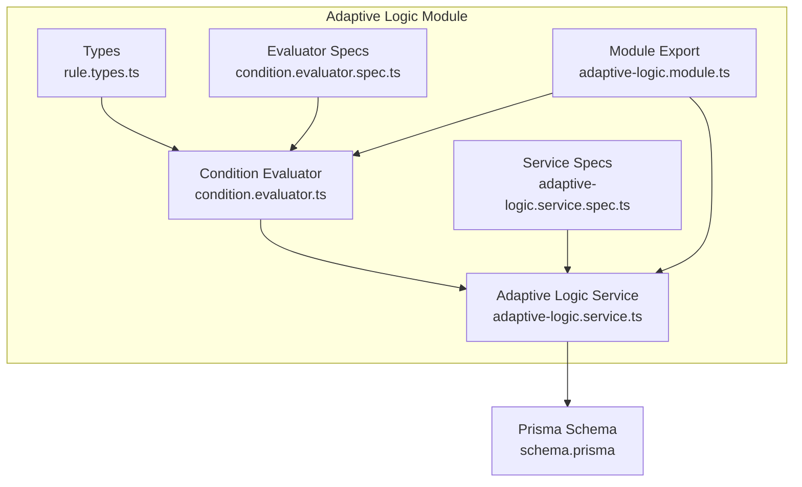
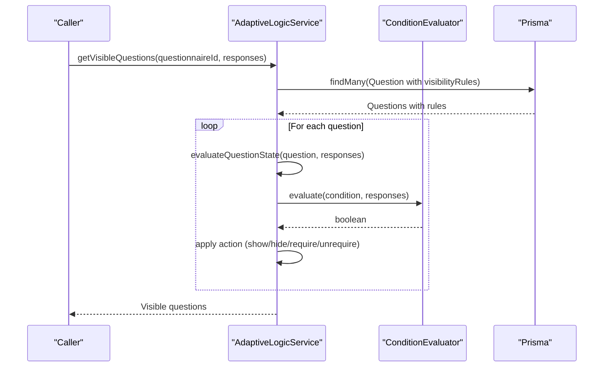
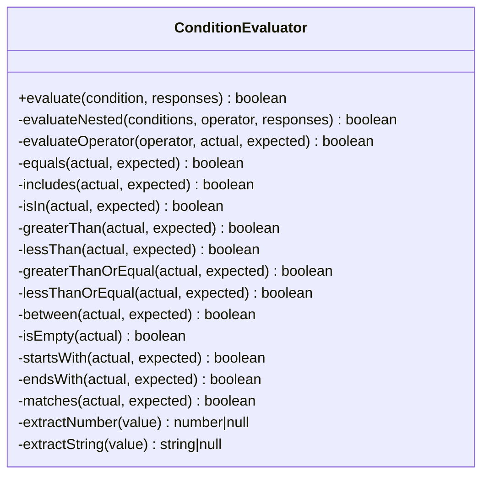
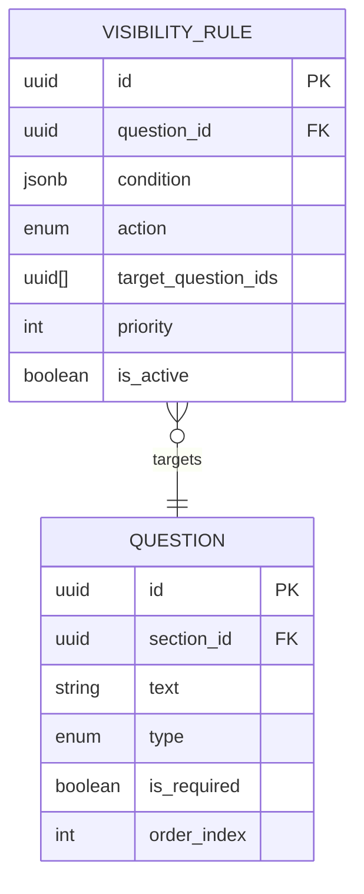
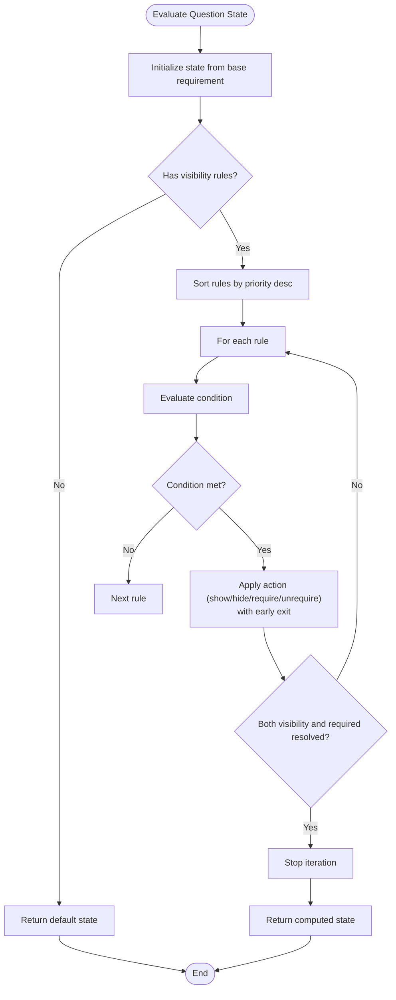
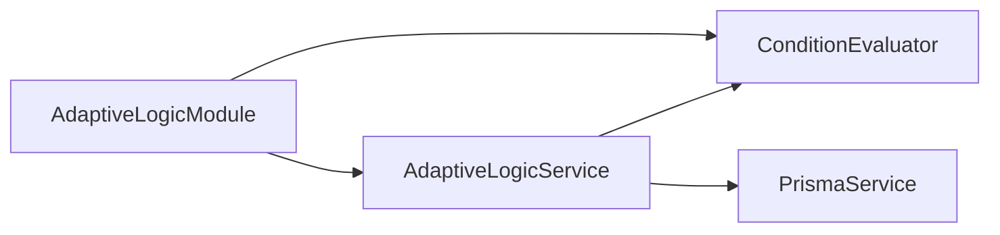

# Custom Rule Development

<cite>
**Referenced Files in This Document**
- [rule.types.ts](file://apps/api/src/modules/adaptive-logic/types/rule.types.ts)
- [condition.evaluator.ts](file://apps/api/src/modules/adaptive-logic/evaluators/condition.evaluator.ts)
- [condition.evaluator.spec.ts](file://apps/api/src/modules/adaptive-logic/evaluators/condition.evaluator.spec.ts)
- [adaptive-logic.service.ts](file://apps/api/src/modules/adaptive-logic/adaptive-logic.service.ts)
- [adaptive-logic.service.spec.ts](file://apps/api/src/modules/adaptive-logic/adaptive-logic.service.spec.ts)
- [adaptive-logic.module.ts](file://apps/api/src/modules/adaptive-logic/adaptive-logic.module.ts)
- [schema.prisma](file://prisma/schema.prisma)
- [adaptive-logic.md](file://docs/questionnaire/adaptive-logic.md)
</cite>

## Table of Contents
1. [Introduction](#introduction)
2. [Project Structure](#project-structure)
3. [Core Components](#core-components)
4. [Architecture Overview](#architecture-overview)
5. [Detailed Component Analysis](#detailed-component-analysis)
6. [Dependency Analysis](#dependency-analysis)
7. [Performance Considerations](#performance-considerations)
8. [Troubleshooting Guide](#troubleshooting-guide)
9. [Conclusion](#conclusion)
10. [Appendices](#appendices)

## Introduction
This document explains how to extend the adaptive logic engine with custom rule types and operators. It covers:
- Extending condition operators beyond the built-in set (e.g., date_range, regex_match, custom_function)
- Implementing custom evaluation strategies
- Extending the rule configuration schema to support branching rules, dependency rules, and validation rules
- Practical examples of complex business logic
- Registration, testing, and integration with the existing execution pipeline
- Performance considerations and best practices

## Project Structure
The adaptive logic engine resides under the adaptive-logic module and consists of:
- Types defining rule and condition schemas
- A condition evaluator that evaluates conditions
- A service orchestrating rule evaluation and question state computation
- Tests validating behavior and edge cases

**Diagram sources**
- [rule.types.ts](file://apps/api/src/modules/adaptive-logic/types/rule.types.ts#L1-L120)
- [condition.evaluator.ts](file://apps/api/src/modules/adaptive-logic/evaluators/condition.evaluator.ts#L1-L402)
- [adaptive-logic.service.ts](file://apps/api/src/modules/adaptive-logic/adaptive-logic.service.ts#L1-L307)
- [adaptive-logic.module.ts](file://apps/api/src/modules/adaptive-logic/adaptive-logic.module.ts#L1-L12)
- [schema.prisma](file://prisma/schema.prisma#L249-L264)

**Section sources**
- [rule.types.ts](file://apps/api/src/modules/adaptive-logic/types/rule.types.ts#L1-L120)
- [condition.evaluator.ts](file://apps/api/src/modules/adaptive-logic/evaluators/condition.evaluator.ts#L1-L402)
- [adaptive-logic.service.ts](file://apps/api/src/modules/adaptive-logic/adaptive-logic.service.ts#L1-L307)
- [adaptive-logic.module.ts](file://apps/api/src/modules/adaptive-logic/adaptive-logic.module.ts#L1-L12)
- [schema.prisma](file://prisma/schema.prisma#L249-L264)

## Core Components
- ConditionOperator and Condition define the evaluation surface for conditions.
- ConditionEvaluator encapsulates operator evaluation logic and handles nested conditions.
- AdaptiveLogicService orchestrates rule loading, evaluation, and question state computation, delegating condition evaluation to ConditionEvaluator.

Key responsibilities:
- ConditionEvaluator: operator dispatch, extraction helpers, nested evaluation
- AdaptiveLogicService: rule ordering/priority, action application, dependency graph building, visibility and requirement evaluation

**Section sources**
- [rule.types.ts](file://apps/api/src/modules/adaptive-logic/types/rule.types.ts#L4-L53)
- [condition.evaluator.ts](file://apps/api/src/modules/adaptive-logic/evaluators/condition.evaluator.ts#L9-L109)
- [adaptive-logic.service.ts](file://apps/api/src/modules/adaptive-logic/adaptive-logic.service.ts#L71-L153)

## Architecture Overview
The engine evaluates conditions against a Map of responses keyed by question IDs. Rules are persisted as JSONB and include a condition tree, operator, and target question IDs. The service applies rules in priority order and computes visibility and requirement states.

**Diagram sources**
- [adaptive-logic.service.ts](file://apps/api/src/modules/adaptive-logic/adaptive-logic.service.ts#L31-L66)
- [adaptive-logic.service.ts](file://apps/api/src/modules/adaptive-logic/adaptive-logic.service.ts#L71-L153)
- [condition.evaluator.ts](file://apps/api/src/modules/adaptive-logic/evaluators/condition.evaluator.ts#L9-L22)
- [schema.prisma](file://prisma/schema.prisma#L249-L264)

## Detailed Component Analysis

### Condition Evaluator
The evaluator is a single-purpose class that:
- Evaluates a single condition or a nested tree with logical operators
- Dispatches to operator-specific handlers
- Provides extraction helpers for numbers and strings from diverse response shapes

Implementation highlights:
- Single entry point for evaluation delegates to nested evaluation when present
- Centralized operator switch with dedicated methods for each operator
- Extraction helpers for robust numeric and string handling

**Diagram sources**
- [condition.evaluator.ts](file://apps/api/src/modules/adaptive-logic/evaluators/condition.evaluator.ts#L5-L401)

**Section sources**
- [condition.evaluator.ts](file://apps/api/src/modules/adaptive-logic/evaluators/condition.evaluator.ts#L9-L109)
- [condition.evaluator.spec.ts](file://apps/api/src/modules/adaptive-logic/evaluators/condition.evaluator.spec.ts#L11-L358)

### Rule Types and Configuration Schema
The current schema supports:
- Visibility rules with actions: show, hide, require, unrequire
- Conditions with nested logical grouping
- Branching rules with priority-based branches and default paths
- Additional metrics and question state modeling

Extensibility points:
- Add new ConditionOperator values and corresponding handlers
- Extend rule types (e.g., dependency rules, validation rules) by adding new interfaces and integrating them into the service
- Persist new rule types in the database schema

**Diagram sources**
- [schema.prisma](file://prisma/schema.prisma#L249-L264)

**Section sources**
- [rule.types.ts](file://apps/api/src/modules/adaptive-logic/types/rule.types.ts#L58-L82)
- [rule.types.ts](file://apps/api/src/modules/adaptive-logic/types/rule.types.ts#L86-L100)
- [schema.prisma](file://prisma/schema.prisma#L249-L264)

### Adaptive Logic Service
Responsibilities:
- Load questions and their associated visibility rules
- Evaluate question states considering rule priority and action semantics
- Provide helpers for condition evaluation, dependency graph construction, and visibility changes

Behavioral guarantees:
- Rules are sorted by priority descending
- Actions are applied with early exit when visibility or requirement are resolved
- Condition evaluation supports AND/OR across multiple conditions

**Diagram sources**
- [adaptive-logic.service.ts](file://apps/api/src/modules/adaptive-logic/adaptive-logic.service.ts#L71-L153)

**Section sources**
- [adaptive-logic.service.ts](file://apps/api/src/modules/adaptive-logic/adaptive-logic.service.ts#L31-L66)
- [adaptive-logic.service.ts](file://apps/api/src/modules/adaptive-logic/adaptive-logic.service.ts#L71-L153)
- [adaptive-logic.service.spec.ts](file://apps/api/src/modules/adaptive-logic/adaptive-logic.service.spec.ts#L51-L169)

## Dependency Analysis
- Module wiring exposes AdaptiveLogicService and ConditionEvaluator
- Service depends on Prisma for persistence and ConditionEvaluator for evaluation
- Tests validate both services and evaluator behavior

**Diagram sources**
- [adaptive-logic.module.ts](file://apps/api/src/modules/adaptive-logic/adaptive-logic.module.ts#L6-L11)
- [adaptive-logic.service.ts](file://apps/api/src/modules/adaptive-logic/adaptive-logic.service.ts#L23-L26)

**Section sources**
- [adaptive-logic.module.ts](file://apps/api/src/modules/adaptive-logic/adaptive-logic.module.ts#L1-L12)
- [adaptive-logic.service.ts](file://apps/api/src/modules/adaptive-logic/adaptive-logic.service.ts#L1-L307)

## Performance Considerations
- Caching: The evaluation cache pattern described in the documentation can be adapted to cache evaluated states keyed by question ID and response hash to avoid recomputation.
- Dependency graph: Building a dependency graph enables targeted cache invalidation when upstream responses change.
- Complexity: Each condition evaluation is linear in the number of nested conditions. For deep nesting, consider limiting depth or pre-processing conditions.

[No sources needed since this section provides general guidance]

## Troubleshooting Guide
Common issues and resolutions:
- Unknown operator: The evaluator returns false for unknown operators. Ensure the operator is included in the ConditionOperator union and a handler exists.
- Missing field: Conditions without a field evaluate to false; ensure responses include the expected keys.
- Empty condition: An empty condition evaluates to true; design conditions with explicit intent.
- Regex errors: Invalid regex patterns cause matches to return false; validate patterns before persisting.

**Section sources**
- [condition.evaluator.ts](file://apps/api/src/modules/adaptive-logic/evaluators/condition.evaluator.ts#L106-L108)
- [condition.evaluator.spec.ts](file://apps/api/src/modules/adaptive-logic/evaluators/condition.evaluator.spec.ts#L335-L356)

## Conclusion
The adaptive logic engine is designed for extensibility. New operators are added by extending the operator union and implementing a handler in the evaluator. New rule types can be introduced by extending the types and integrating them into the service. Persistence is handled via JSONB conditions, enabling flexible rule definitions. Comprehensive tests validate behavior and edge cases, and the service’s design supports efficient evaluation and dependency-aware updates.

[No sources needed since this section summarizes without analyzing specific files]

## Appendices

### A. Extending Condition Operators
Steps to add a new operator:
1. Add the operator to the ConditionOperator union in the types file.
2. Implement a new handler in the evaluator with a descriptive method name.
3. Add a case in the operator switch to route to the new handler.
4. Write tests covering positive/negative cases and edge conditions.
5. Integrate with the service by invoking the evaluator from the service where needed.

Examples of operators to implement:
- date_range: Compare dates against a range
- regex_match: Match a regex pattern against a string
- custom_function: Delegate evaluation to a pluggable function resolver

Guidelines:
- Keep handlers pure and deterministic
- Use extraction helpers for robust value parsing
- Return false for unsupported types or invalid inputs
- Add tests for null/undefined/empty values

**Section sources**
- [rule.types.ts](file://apps/api/src/modules/adaptive-logic/types/rule.types.ts#L4-L28)
- [condition.evaluator.ts](file://apps/api/src/modules/adaptive-logic/evaluators/condition.evaluator.ts#L44-L109)
- [condition.evaluator.spec.ts](file://apps/api/src/modules/adaptive-logic/evaluators/condition.evaluator.spec.ts#L1-L358)

### B. Implementing Custom Evaluation Strategies
To implement custom evaluation strategies:
- Define a strategy interface and concrete implementations for different evaluation modes (e.g., strict vs lenient).
- Inject the strategy into the evaluator or service depending on context.
- Use configuration flags to select strategies per rule or globally.

Benefits:
- Enables A/B testing of evaluation approaches
- Supports gradual migration of evaluation logic

**Section sources**
- [condition.evaluator.ts](file://apps/api/src/modules/adaptive-logic/evaluators/condition.evaluator.ts#L1-L402)
- [adaptive-logic.service.ts](file://apps/api/src/modules/adaptive-logic/adaptive-logic.service.ts#L1-L307)

### C. Extending the Rule Configuration Schema
To add new rule types:
1. Define new interfaces in the types file (e.g., DependencyRule, ValidationRule).
2. Extend the persistence schema to support new rule types (e.g., separate tables or JSONB fields).
3. Update the service to load and evaluate new rule types alongside visibility rules.
4. Add tests verifying new rule behavior and priority handling.

Examples:
- BranchingRule: Multiple branches with priorities and default paths
- DependencyRule: Explicit dependencies between questions
- ValidationRule: Cross-question validations with custom validators

**Section sources**
- [rule.types.ts](file://apps/api/src/modules/adaptive-logic/types/rule.types.ts#L86-L100)
- [schema.prisma](file://prisma/schema.prisma#L249-L264)
- [adaptive-logic.service.ts](file://apps/api/src/modules/adaptive-logic/adaptive-logic.service.ts#L248-L295)

### D. Practical Examples of Complex Business Logic
Examples from the documentation and tests illustrate:
- Multi-path branching based on product type and market segment
- Conditional requirement of questions based on selections
- Regex-based validation for structured inputs
- Cross-question validation enforcing business ratios

These examples demonstrate how to compose conditions, use nested logic, and integrate with branching and validation rules.

**Section sources**
- [adaptive-logic.md](file://docs/questionnaire/adaptive-logic.md#L174-L327)
- [condition.evaluator.spec.ts](file://apps/api/src/modules/adaptive-logic/evaluators/condition.evaluator.spec.ts#L216-L244)
- [adaptive-logic.service.spec.ts](file://apps/api/src/modules/adaptive-logic/adaptive-logic.service.spec.ts#L51-L169)

### E. Rule Registration, Testing, and Integration
Registration:
- Module exports AdaptiveLogicService for consumption by other modules
- ConditionEvaluator is provided by the module and injected into the service

Testing:
- Evaluator tests cover all operators and edge cases
- Service tests validate state computation, priority handling, and dependency graph building

Integration:
- Service integrates with Prisma for rule persistence and question retrieval
- Execution pipeline: load rules -> evaluate conditions -> apply actions -> compute visibility/requirements

**Section sources**
- [adaptive-logic.module.ts](file://apps/api/src/modules/adaptive-logic/adaptive-logic.module.ts#L6-L11)
- [condition.evaluator.spec.ts](file://apps/api/src/modules/adaptive-logic/evaluators/condition.evaluator.spec.ts#L1-L358)
- [adaptive-logic.service.spec.ts](file://apps/api/src/modules/adaptive-logic/adaptive-logic.service.spec.ts#L1-L306)
- [adaptive-logic.service.ts](file://apps/api/src/modules/adaptive-logic/adaptive-logic.service.ts#L1-L307)

### F. Best Practices for Maintaining Extensibility
- Keep operator handlers small and focused
- Use extraction helpers to normalize diverse response shapes
- Prefer explicit configuration over implicit behavior
- Maintain backward compatibility when evolving operators
- Document new operators and rule types with examples
- Use tests to capture expected behavior and prevent regressions

[No sources needed since this section provides general guidance]