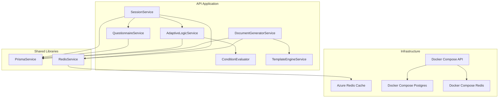
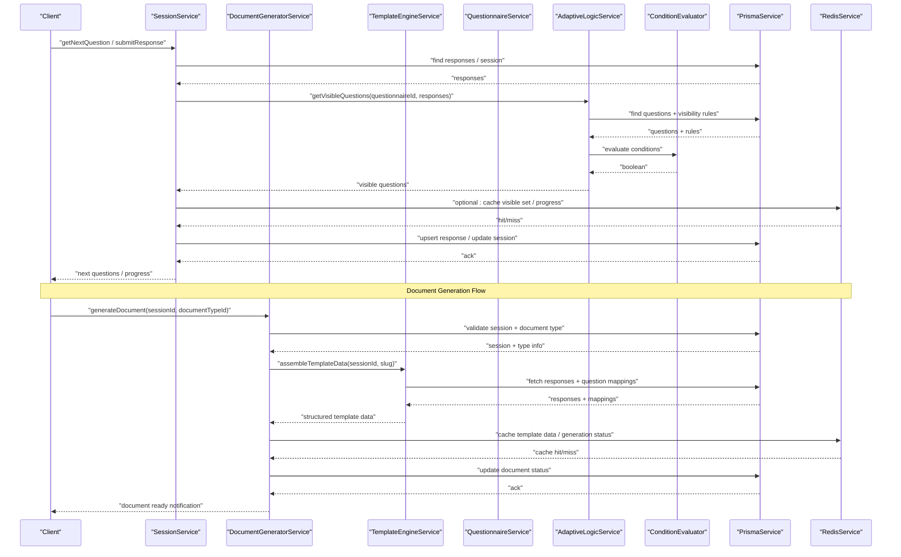
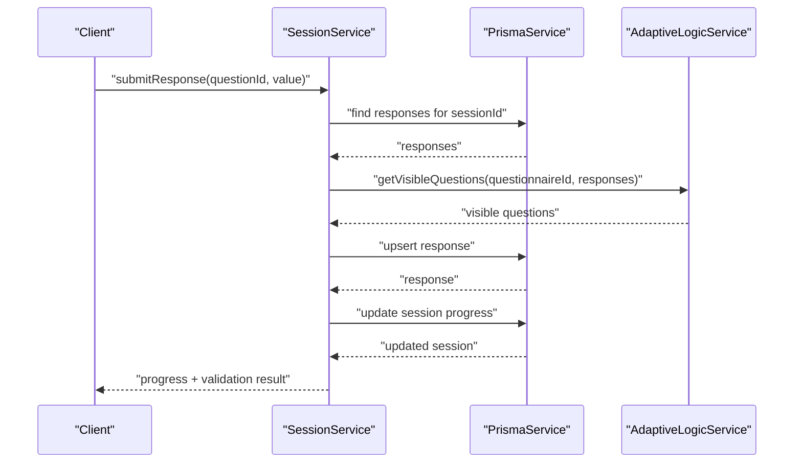
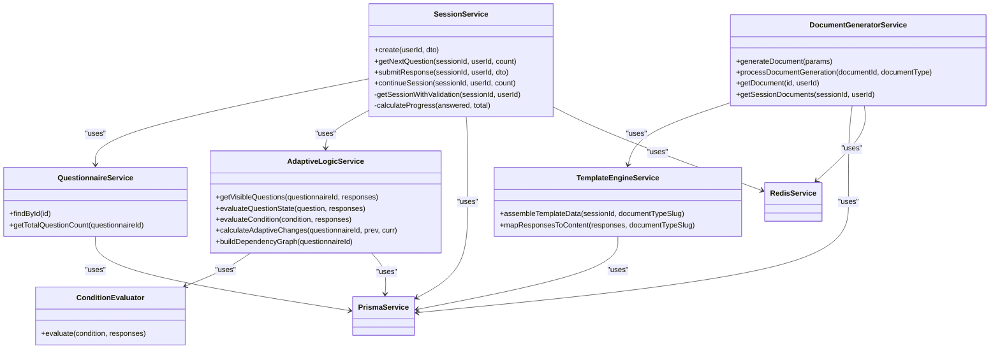

# Performance Optimization

<cite>
**Referenced Files in This Document**
- [session.service.ts](file://apps/api/src/modules/session/session.service.ts)
- [adaptive-logic.service.ts](file://apps/api/src/modules/adaptive-logic/adaptive-logic.service.ts)
- [condition.evaluator.ts](file://apps/api/src/modules/adaptive-logic/evaluators/condition.evaluator.ts)
- [questionnaire.service.ts](file://apps/api/src/modules/questionnaire/questionnaire.service.ts)
- [document-generator.service.ts](file://apps/api/src/modules/document-generator/services/document-generator.service.ts)
- [template-engine.service.ts](file://apps/api/src/modules/document-generator/services/template-engine.service.ts)
- [redis.service.ts](file://libs/redis/src/redis.service.ts)
- [redis.module.ts](file://libs/redis/src/redis.module.ts)
- [prisma.service.ts](file://libs/database/src/prisma.service.ts)
- [prisma.module.ts](file://libs/database/src/prisma.module.ts)
- [configuration.ts](file://apps/api/src/config/configuration.ts)
- [docker-compose.yml](file://docker-compose.yml)
- [main.tf](file://infrastructure/terraform/modules/cache/main.tf)
- [03-product-architecture.md](file://docs/cto/03-product-architecture.md)
- [adaptive-logic.md](file://docs/questionnaire/adaptive-logic.md)
- [rule.types.ts](file://apps/api/src/modules/adaptive-logic/types/rule.types.ts)
</cite>

## Update Summary
**Changes Made**
- Added comprehensive document generation system performance optimization section
- Enhanced adaptive logic evaluation engine with dependency graph and caching strategies
- Expanded Redis caching recommendations for document generation workflows
- Updated session management scaling considerations for document generation workloads
- Added performance monitoring guidelines for document generation pipeline

## Table of Contents
1. [Introduction](#introduction)
2. [Project Structure](#project-structure)
3. [Core Components](#core-components)
4. [Architecture Overview](#architecture-overview)
5. [Detailed Component Analysis](#detailed-component-analysis)
6. [Dependency Analysis](#dependency-analysis)
7. [Performance Considerations](#performance-considerations)
8. [Troubleshooting Guide](#troubleshooting-guide)
9. [Conclusion](#conclusion)
10. [Appendices](#appendices)

## Introduction
This document provides a comprehensive performance optimization guide for a large-scale questionnaire system. It focuses on caching strategies using Redis, database optimization via Prisma, session management scaling, monitoring and profiling, memory optimization, and benchmarking/validation methodologies. The system now includes advanced document generation capabilities alongside core adaptive logic evaluation, questionnaire rendering, and response processing. The goal is to improve throughput, reduce latency, and maintain responsiveness under high load while preserving correctness of adaptive logic evaluation, questionnaire rendering, response processing, and document generation workflows.

## Project Structure
The system is organized as a NestJS monorepo with modularized concerns:
- API application with modules for session, questionnaire, adaptive logic, auth, standards, users, and document generation
- Shared libraries for database (Prisma) and Redis
- Infrastructure-as-Code for cloud deployment (Terraform)
- Documentation for architecture and adaptive logic optimization



**Diagram sources**
- [session.service.ts](file://apps/api/src/modules/session/session.service.ts#L88-L94)
- [adaptive-logic.service.ts](file://apps/api/src/modules/adaptive-logic/adaptive-logic.service.ts#L23-L26)
- [condition.evaluator.ts](file://apps/api/src/modules/adaptive-logic/evaluators/condition.evaluator.ts#L9-L22)
- [questionnaire.service.ts](file://apps/api/src/modules/questionnaire/questionnaire.service.ts#L64-L65)
- [document-generator.service.ts](file://apps/api/src/modules/document-generator/services/document-generator.service.ts#L28-L37)
- [template-engine.service.ts](file://apps/api/src/modules/document-generator/services/template-engine.service.ts#L26-L30)
- [prisma.service.ts](file://libs/database/src/prisma.service.ts#L5-L18)
- [redis.service.ts](file://libs/redis/src/redis.service.ts#L6-L38)
- [docker-compose.yml](file://docker-compose.yml#L42-L68)
- [main.tf](file://infrastructure/terraform/modules/cache/main.tf#L3-L20)

**Section sources**
- [session.service.ts](file://apps/api/src/modules/session/session.service.ts#L88-L94)
- [adaptive-logic.service.ts](file://apps/api/src/modules/adaptive-logic/adaptive-logic.service.ts#L23-L26)
- [questionnaire.service.ts](file://apps/api/src/modules/questionnaire/questionnaire.service.ts#L64-L65)
- [document-generator.service.ts](file://apps/api/src/modules/document-generator/services/document-generator.service.ts#L28-L37)
- [template-engine.service.ts](file://apps/api/src/modules/document-generator/services/template-engine.service.ts#L26-L30)
- [prisma.service.ts](file://libs/database/src/prisma.service.ts#L5-L18)
- [redis.service.ts](file://libs/redis/src/redis.service.ts#L6-L38)
- [docker-compose.yml](file://docker-compose.yml#L42-L68)
- [main.tf](file://infrastructure/terraform/modules/cache/main.tf#L3-L20)

## Core Components
- SessionService orchestrates session lifecycle, response submission, progress calculation, and adaptive logic integration. It performs frequent database reads/writes and interacts with Redis for caching.
- AdaptiveLogicService evaluates visibility rules and determines visible questions per session. It is central to adaptive logic performance and now includes dependency graph building for optimized invalidation.
- ConditionEvaluator executes rule conditions against response maps, handling nested conditions and diverse operators with enhanced response object support.
- QuestionnaireService loads questionnaire metadata and counts for progress calculations.
- DocumentGeneratorService manages the complete document generation pipeline from session completion to final document delivery.
- TemplateEngineService processes session responses into structured template data with support for complex document mappings.
- PrismaService provides database connectivity and slow-query logging in development.
- RedisService exposes Redis client operations for caching across all system components.

Key performance hotspots:
- Adaptive rule evaluation loops over all questions and rules per request
- Response upserts and visibility recalculations
- Database round trips for questionnaire metadata and responses
- Document generation pipeline with template assembly and file processing
- Template data extraction and nested value mapping operations

**Section sources**
- [session.service.ts](file://apps/api/src/modules/session/session.service.ts#L198-L268)
- [session.service.ts](file://apps/api/src/modules/session/session.service.ts#L270-L359)
- [adaptive-logic.service.ts](file://apps/api/src/modules/adaptive-logic/adaptive-logic.service.ts#L31-L66)
- [condition.evaluator.ts](file://apps/api/src/modules/adaptive-logic/evaluators/condition.evaluator.ts#L9-L22)
- [questionnaire.service.ts](file://apps/api/src/modules/questionnaire/questionnaire.service.ts#L174-L182)
- [document-generator.service.ts](file://apps/api/src/modules/document-generator/services/document-generator.service.ts#L141-L175)
- [template-engine.service.ts](file://apps/api/src/modules/document-generator/services/template-engine.service.ts#L35-L99)
- [prisma.service.ts](file://libs/database/src/prisma.service.ts#L20-L33)
- [redis.service.ts](file://libs/redis/src/redis.service.ts#L40-L50)

## Architecture Overview
High-level runtime flow for questionnaire rendering, response processing, and document generation:



**Diagram sources**
- [session.service.ts](file://apps/api/src/modules/session/session.service.ts#L198-L268)
- [session.service.ts](file://apps/api/src/modules/session/session.service.ts#L270-L359)
- [adaptive-logic.service.ts](file://apps/api/src/modules/adaptive-logic/adaptive-logic.service.ts#L31-L66)
- [condition.evaluator.ts](file://apps/api/src/modules/adaptive-logic/evaluators/condition.evaluator.ts#L9-L22)
- [document-generator.service.ts](file://apps/api/src/modules/document-generator/services/document-generator.service.ts#L141-L175)
- [template-engine.service.ts](file://apps/api/src/modules/document-generator/services/template-engine.service.ts#L35-L99)
- [prisma.service.ts](file://libs/database/src/prisma.service.ts#L20-L33)
- [redis.service.ts](file://libs/redis/src/redis.service.ts#L40-L50)

## Detailed Component Analysis

### Adaptive Logic Evaluation Engine
- Evaluates visibility rules per question, applying actions (show/hide/require/unrequire) with priority ordering.
- Supports nested conditions with AND/OR operators and complex response object handling.
- Uses a Map-based responses lookup for O(1) access during evaluation.
- Now includes dependency graph building for optimized cache invalidation.

Optimization opportunities:
- Cache evaluation results keyed by questionnaireId and a hash of the responses map to avoid recomputation.
- Precompute dependency graph to invalidate only affected cached entries on response changes.
- Limit rule evaluation to changed dependencies when possible.
- Implement incremental cache updates for partial response changes.

```mermaid
flowchart TD
Start(["Evaluate Question State"]) --> Init["Initialize default state"]
Init --> HasRules{"Has visibility rules?"}
HasRules --> |No| ReturnDefault["Return default state"]
HasRules --> |Yes| Sort["Sort rules by priority desc"]
Sort --> Loop["For each rule (highest first)"]
Loop --> Eval["Evaluate condition against responses"]
Eval --> Met{"Condition met?"}
Met --> |Yes| Apply["Apply action (SHOW/HIDE/REQUIRE/UNREQUIRE)<br/>Mark resolution flag"]
Apply --> CheckDone{"Both visibility and required resolved?"}
CheckDone --> |Yes| Done["Stop further rules"]
CheckDone --> |No| Next["Next rule"]
Met --> |No| Next
Next --> Loop
Done --> ReturnState["Return computed state"]
ReturnDefault --> End(["End"])
ReturnState --> End
flowchart TD
DepGraph["Build Dependency Graph"] --> ScanRules["Scan all visibility rules"]
ScanRules --> ExtractDeps["Extract source-target dependencies"]
ExtractDeps --> BuildMap["Build dependency adjacency map"]
BuildMap --> CacheInvalidation["Enable targeted cache invalidation"]
```

**Diagram sources**
- [adaptive-logic.service.ts](file://apps/api/src/modules/adaptive-logic/adaptive-logic.service.ts#L71-L153)
- [condition.evaluator.ts](file://apps/api/src/modules/adaptive-logic/evaluators/condition.evaluator.ts#L9-L22)
- [adaptive-logic.service.ts](file://apps/api/src/modules/adaptive-logic/adaptive-logic.service.ts#L221-L252)

**Section sources**
- [adaptive-logic.service.ts](file://apps/api/src/modules/adaptive-logic/adaptive-logic.service.ts#L71-L153)
- [condition.evaluator.ts](file://apps/api/src/modules/adaptive-logic/evaluators/condition.evaluator.ts#L9-L22)
- [rule.types.ts](file://apps/api/src/modules/adaptive-logic/types/rule.types.ts#L3-L28)
- [adaptive-logic.service.ts](file://apps/api/src/modules/adaptive-logic/adaptive-logic.service.ts#L221-L252)

### Session Management and Response Processing
- Retrieves session, validates access, builds response map, and computes progress.
- Submits responses with validation, updates session state, and determines next question.
- Calculates progress using answered count vs. visible question count.
- Integrates with adaptive logic for real-time visibility updates.

Bottlenecks:
- Re-fetching all responses per operation
- Recomputing visibility on each request
- Updating session progress and timestamps
- Complex response validation logic



**Diagram sources**
- [session.service.ts](file://apps/api/src/modules/session/session.service.ts#L270-L359)
- [adaptive-logic.service.ts](file://apps/api/src/modules/adaptive-logic/adaptive-logic.service.ts#L31-L66)
- [prisma.service.ts](file://libs/database/src/prisma.service.ts#L20-L33)

**Section sources**
- [session.service.ts](file://apps/api/src/modules/session/session.service.ts#L270-L359)

### Document Generation System
- Manages complete document lifecycle from session completion to final delivery.
- Processes template assembly, document building, and storage management.
- Handles validation of required questions and document type availability.
- Implements asynchronous generation with status tracking and error handling.

Performance considerations:
- Template data assembly requires multiple database queries for responses and mappings.
- Document building involves complex nested value extraction and transformation.
- File upload operations can be I/O intensive and should be optimized.
- Status tracking and metadata management add overhead but ensure reliability.

```mermaid
flowchart TD
GenStart["Generate Document"] --> ValidateSession["Validate Session + Document Type"]
ValidateSession --> CheckRequired["Check Required Questions"]
CheckRequired --> CreateDoc["Create Document Record"]
CreateDoc --> AssembleTemplate["Assemble Template Data"]
AssembleTemplate --> BuildDocument["Build Document"]
BuildDocument --> UploadFile["Upload to Storage"]
UploadFile --> UpdateStatus["Update Document Status"]
UpdateStatus --> GenComplete["Generation Complete"]
flowchart TD
TemplateAssembly["Template Assembly"] --> FetchResponses["Fetch Valid Responses"]
FetchResponses --> MapResponses["Map to Content Structure"]
MapResponses --> BuildStandards["Build Standards Sections"]
BuildStandards --> ReturnTemplate["Return Template Data"]
```

**Diagram sources**
- [document-generator.service.ts](file://apps/api/src/modules/document-generator/services/document-generator.service.ts#L42-L139)
- [template-engine.service.ts](file://apps/api/src/modules/document-generator/services/template-engine.service.ts#L35-L99)

**Section sources**
- [document-generator.service.ts](file://apps/api/src/modules/document-generator/services/document-generator.service.ts#L42-L139)
- [template-engine.service.ts](file://apps/api/src/modules/document-generator/services/template-engine.service.ts#L35-L99)

### Caching Strategy Using Redis
- RedisService exposes get/set/del/exists/incr/expiry/hash operations with a configurable retry strategy.
- Recommended caches:
  - Session state cache: key pattern "session:{sessionId}:state" with TTL aligned to session timeout
  - Rule evaluation cache: key pattern "eval:{questionnaireId}:{hash(responses)}" with short TTL or invalidated on response changes
  - Frequently accessed questionnaire data: key pattern "q:{questionnaireId}:meta" with TTL
  - Response map cache: key pattern "session:{sessionId}:responses" for fast visibility recomputation
  - Document template cache: key pattern "doc:template:{documentTypeId}:{sessionId}" with TTL for generated content
  - Document generation status: key pattern "doc:status:{documentId}" for tracking generation progress

Implementation guidance:
- Serialize responses map deterministically and compute a stable hash for cache keys
- Use optimistic concurrency: read-through cache with lazy invalidation on write
- Prefer atomic operations for counters and hashes
- Implement cache warming for frequently accessed document templates
- Use Redis pipelines for batch operations during cache updates

**Section sources**
- [redis.service.ts](file://libs/redis/src/redis.service.ts#L40-L87)
- [redis.module.ts](file://libs/redis/src/redis.module.ts#L1-L10)
- [configuration.ts](file://apps/api/src/config/configuration.ts#L12-L17)
- [adaptive-logic.md](file://docs/questionnaire/adaptive-logic.md#L514-L549)
- [document-generator.service.ts](file://apps/api/src/modules/document-generator/services/document-generator.service.ts#L141-L175)

### Database Optimization with Prisma
- PrismaService logs slow queries in development and manages lifecycle hooks.
- Current code performs multiple database calls per request (responses, session, questions, document types).
- Optimization techniques:
  - Batch queries using Promise.all where safe
  - Add indexes on frequently filtered columns (e.g., responses by sessionId, questions by sectionId, documentType by slug)
  - Use selective includes to minimize payload size
  - Enable connection pooling at the application level and tune pool size based on CPU cores and DB capacity
  - Implement query optimization for document generation with proper joins and filtering

**Section sources**
- [prisma.service.ts](file://libs/database/src/prisma.service.ts#L20-L33)
- [session.service.ts](file://apps/api/src/modules/session/session.service.ts#L172-L193)
- [questionnaire.service.ts](file://apps/api/src/modules/questionnaire/questionnaire.service.ts#L76-L97)
- [document-generator.service.ts](file://apps/api/src/modules/document-generator/services/document-generator.service.ts#L82-L103)

### Session Management Scaling
- Distributed session storage:
  - Store session metadata in Redis with TTL and use database only for immutable historical data
  - Use sticky sessions or external stateless auth (JWT) combined with Redis-backed session reads
- Load balancing:
  - Stateless API pods behind a load balancer; ensure Redis is highly available (e.g., Azure Cache for Redis)
  - Use health checks and circuit breakers to protect downstream services
- State synchronization:
  - Use Redis pub/sub to broadcast cache invalidation events across instances
  - Implement idempotent writes for responses to tolerate retries
  - Scale document generation workers independently for background processing

**Section sources**
- [docker-compose.yml](file://docker-compose.yml#L42-L68)
- [main.tf](file://infrastructure/terraform/modules/cache/main.tf#L3-L20)
- [configuration.ts](file://apps/api/src/config/configuration.ts#L12-L17)

### Monitoring and Profiling
- Observability stack:
  - Metrics (Prometheus), logs (Fluent Bit), traces (OpenTelemetry/Jaeger)
  - Grafana dashboards for latency, throughput, error rates, and cache hit ratios
- Profiling targets:
  - Adaptive logic evaluation duration per session
  - Database query latency and count per request
  - Response processing time (validation + persistence)
  - Cache hit rate and eviction metrics
  - Document generation pipeline performance (template assembly, building, upload)
  - Template engine processing time and memory usage

**Section sources**
- [03-product-architecture.md](file://docs/cto/03-product-architecture.md#L468-L500)

## Dependency Analysis


**Diagram sources**
- [session.service.ts](file://apps/api/src/modules/session/session.service.ts#L88-L94)
- [questionnaire.service.ts](file://apps/api/src/modules/questionnaire/questionnaire.service.ts#L64-L65)
- [adaptive-logic.service.ts](file://apps/api/src/modules/adaptive-logic/adaptive-logic.service.ts#L23-L26)
- [condition.evaluator.ts](file://apps/api/src/modules/adaptive-logic/evaluators/condition.evaluator.ts#L5-L6)
- [document-generator.service.ts](file://apps/api/src/modules/document-generator/services/document-generator.service.ts#L28-L37)
- [template-engine.service.ts](file://apps/api/src/modules/document-generator/services/template-engine.service.ts#L26-L30)
- [prisma.service.ts](file://libs/database/src/prisma.service.ts#L5-L18)
- [redis.service.ts](file://libs/redis/src/redis.service.ts#L6-L38)

**Section sources**
- [session.service.ts](file://apps/api/src/modules/session/session.service.ts#L88-L94)
- [adaptive-logic.service.ts](file://apps/api/src/modules/adaptive-logic/adaptive-logic.service.ts#L23-L26)
- [questionnaire.service.ts](file://apps/api/src/modules/questionnaire/questionnaire.service.ts#L64-L65)
- [document-generator.service.ts](file://apps/api/src/modules/document-generator/services/document-generator.service.ts#L28-L37)
- [template-engine.service.ts](file://apps/api/src/modules/document-generator/services/template-engine.service.ts#L26-L30)
- [prisma.service.ts](file://libs/database/src/prisma.service.ts#L5-L18)
- [redis.service.ts](file://libs/redis/src/redis.service.ts#L6-L38)

## Performance Considerations
- Adaptive logic evaluation
  - Cache visible question sets keyed by questionnaireId and a deterministic hash of responses
  - Invalidate only affected entries when a response changes using dependency graphs
  - Prebuild dependency graph to accelerate invalidation and enable targeted cache updates
  - Implement incremental evaluation for partial response changes
- Database throughput
  - Use batched queries for session listings, metadata retrieval, and document assembly
  - Add targeted indexes on foreign keys, frequently filtered fields, and composite indexes for document queries
  - Use selective includes to minimize payload size and reduce memory allocation
  - Tune Prisma client pool size and connection timeouts based on workload patterns
- Redis caching
  - Use short TTLs for dynamic content; rely on explicit invalidation for correctness
  - Store serialized response maps, visible question lists, and template data compactly
  - Implement cache warming strategies for frequently accessed document templates
  - Use Redis pipelines for batch operations during cache updates
- Document generation optimization
  - Cache template assembly results with appropriate TTL based on document type update frequency
  - Implement background processing for heavy document generation tasks
  - Optimize template data extraction with streaming and chunked processing
  - Use connection pooling for storage operations during file uploads
- Memory and GC
  - Minimize object churn by reusing maps, arrays, and template data structures where safe
  - Avoid deep cloning of large structures; prefer immutable views and lazy evaluation
  - Implement memory pools for document building operations
- Latency reduction
  - Short-circuit rule evaluation when both visibility and requirement are resolved
  - Streamline response validation to avoid redundant checks
  - Implement request batching for multiple concurrent operations
  - Use connection multiplexing to reduce TCP overhead

## Troubleshooting Guide
- Slow query detection
  - Development slow query logging is enabled in PrismaService; review warnings for long-running queries
  - Monitor document generation query patterns and optimize template assembly queries
- Redis connectivity
  - RedisService logs connect/error events; verify host/port/password configuration and network reachability
  - Monitor cache hit ratios and implement cache warming strategies
- Session access issues
  - SessionService throws NotFound/Forbidden exceptions when session ownership mismatches or session not found
- Document generation failures
  - DocumentGeneratorService handles validation errors and marks documents as failed with metadata
  - Monitor generation status and implement retry mechanisms for transient failures
- Validation failures
  - Response validation errors are captured and returned with submission results
  - Template validation ensures required fields are present before document generation

**Section sources**
- [prisma.service.ts](file://libs/database/src/prisma.service.ts#L25-L33)
- [redis.service.ts](file://libs/redis/src/redis.service.ts#L21-L27)
- [session.service.ts](file://apps/api/src/modules/session/session.service.ts#L147-L153)
- [session.service.ts](file://apps/api/src/modules/session/session.service.ts#L622-L659)
- [document-generator.service.ts](file://apps/api/src/modules/document-generator/services/document-generator.service.ts#L117-L132)

## Conclusion
By implementing targeted Redis caching for session state, rule evaluation, and document generation workflows, optimizing database queries with batching and indexes, and adopting comprehensive observability practices, the system can achieve significant performance gains. The addition of document generation capabilities requires extended caching strategies and background processing to maintain responsiveness. Focus on incremental improvements: cache warm-up, dependency-aware invalidation, connection pooling, and background document processing, validated through comprehensive benchmarking and monitoring across all system components.

## Appendices

### Benchmarking Methodologies
- Load tests simulating concurrent users answering questionnaires and generating documents
- Metrics: p50/p95/p99 latency, throughput, cache hit ratio, DB query time, Redis latency, document generation time
- Baseline vs. post-optimization comparisons across adaptive logic-heavy, simple questionnaires, and document generation workloads
- Stress testing for concurrent document generation scenarios

### Validation Approaches
- Unit tests for condition operators, rule evaluation logic, and document template processing
- Integration tests covering session lifecycle, adaptive changes, and complete document generation pipeline
- End-to-end tests verifying progress computation, next-question selection, and document delivery
- Performance regression testing for adaptive logic evaluation and document generation workflows

**Section sources**
- [adaptive-logic.service.spec.ts](file://apps/api/src/modules/adaptive-logic/adaptive-logic.service.spec.ts#L1-L306)
- [condition.evaluator.spec.ts](file://apps/api/src/modules/adaptive-logic/evaluators/condition.evaluator.spec.ts#L1-L358)
- [document-generator.service.ts](file://apps/api/src/modules/document-generator/services/document-generator.service.ts#L1-L200)
- [template-engine.service.ts](file://apps/api/src/modules/document-generator/services/template-engine.service.ts#L1-L200)