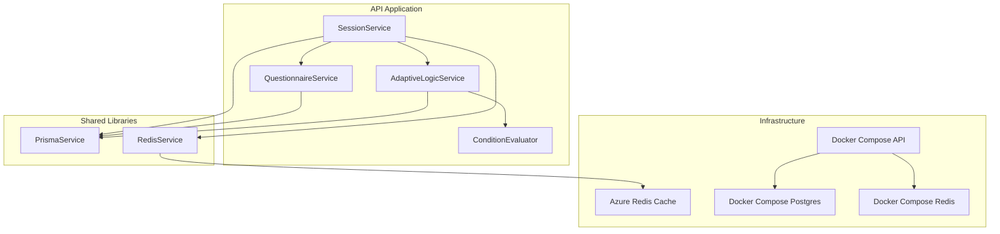
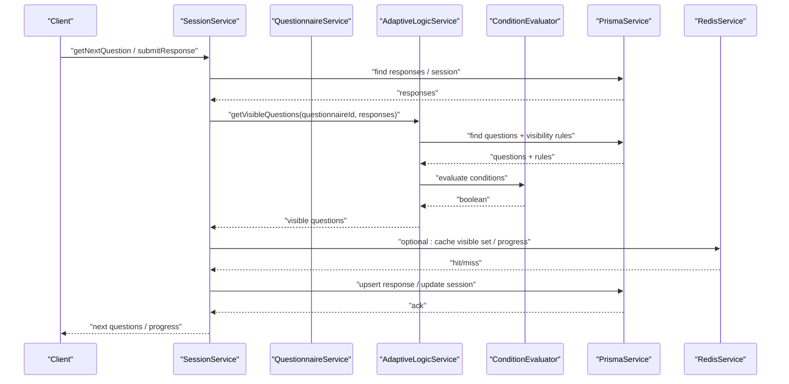
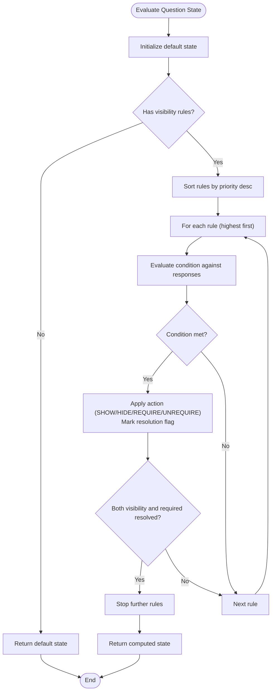
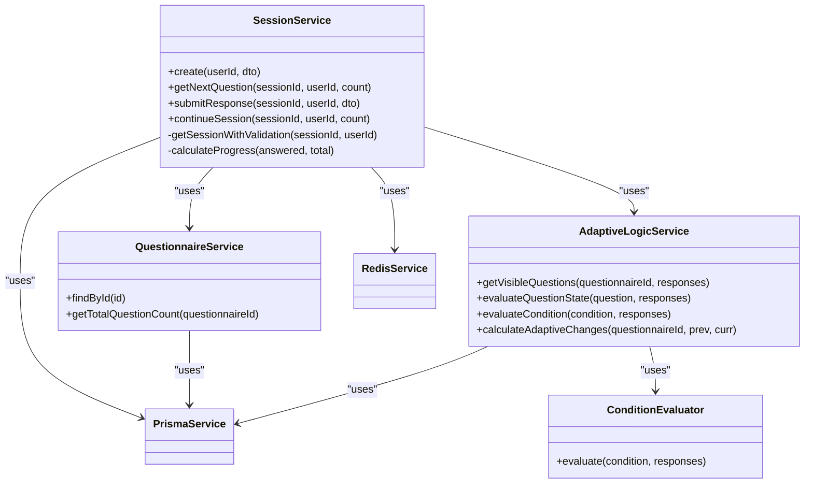

# Performance Optimization

<cite>
**Referenced Files in This Document**
- [session.service.ts](file://apps/api/src/modules/session/session.service.ts)
- [adaptive-logic.service.ts](file://apps/api/src/modules/adaptive-logic/adaptive-logic.service.ts)
- [condition.evaluator.ts](file://apps/api/src/modules/adaptive-logic/evaluators/condition.evaluator.ts)
- [questionnaire.service.ts](file://apps/api/src/modules/questionnaire/questionnaire.service.ts)
- [redis.service.ts](file://libs/redis/src/redis.service.ts)
- [redis.module.ts](file://libs/redis/src/redis.module.ts)
- [prisma.service.ts](file://libs/database/src/prisma.service.ts)
- [prisma.module.ts](file://libs/database/src/prisma.module.ts)
- [configuration.ts](file://apps/api/src/config/configuration.ts)
- [docker-compose.yml](file://docker-compose.yml)
- [main.tf](file://infrastructure/terraform/modules/cache/main.tf)
- [03-product-architecture.md](file://docs/cto/03-product-architecture.md)
- [adaptive-logic.md](file://docs/questionnaire/adaptive-logic.md)
- [rule.types.ts](file://apps/api/src/modules/adaptive-logic/types/rule.types.ts)
</cite>

## Table of Contents
1. [Introduction](#introduction)
2. [Project Structure](#project-structure)
3. [Core Components](#core-components)
4. [Architecture Overview](#architecture-overview)
5. [Detailed Component Analysis](#detailed-component-analysis)
6. [Dependency Analysis](#dependency-analysis)
7. [Performance Considerations](#performance-considerations)
8. [Troubleshooting Guide](#troubleshooting-guide)
9. [Conclusion](#conclusion)
10. [Appendices](#appendices)

## Introduction
This document provides a comprehensive performance optimization guide for a large-scale questionnaire system. It focuses on caching strategies using Redis, database optimization via Prisma, session management scaling, monitoring and profiling, memory optimization, and benchmarking/validation methodologies. The goal is to improve throughput, reduce latency, and maintain responsiveness under high load while preserving correctness of adaptive logic evaluation, questionnaire rendering, and response processing.

## Project Structure
The system is organized as a NestJS monorepo with modularized concerns:
- API application with modules for session, questionnaire, adaptive logic, auth, standards, and users
- Shared libraries for database (Prisma) and Redis
- Infrastructure-as-Code for cloud deployment (Terraform)
- Documentation for architecture and adaptive logic optimization

**Diagram sources**
- [session.service.ts](file://apps/api/src/modules/session/session.service.ts#L88-L94)
- [adaptive-logic.service.ts](file://apps/api/src/modules/adaptive-logic/adaptive-logic.service.ts#L23-L26)
- [condition.evaluator.ts](file://apps/api/src/modules/adaptive-logic/evaluators/condition.evaluator.ts#L9-L22)
- [questionnaire.service.ts](file://apps/api/src/modules/questionnaire/questionnaire.service.ts#L64-L65)
- [prisma.service.ts](file://libs/database/src/prisma.service.ts#L5-L18)
- [redis.service.ts](file://libs/redis/src/redis.service.ts#L6-L38)
- [docker-compose.yml](file://docker-compose.yml#L42-L68)
- [main.tf](file://infrastructure/terraform/modules/cache/main.tf#L3-L20)

**Section sources**
- [session.service.ts](file://apps/api/src/modules/session/session.service.ts#L88-L94)
- [adaptive-logic.service.ts](file://apps/api/src/modules/adaptive-logic/adaptive-logic.service.ts#L23-L26)
- [questionnaire.service.ts](file://apps/api/src/modules/questionnaire/questionnaire.service.ts#L64-L65)
- [prisma.service.ts](file://libs/database/src/prisma.service.ts#L5-L18)
- [redis.service.ts](file://libs/redis/src/redis.service.ts#L6-L38)
- [docker-compose.yml](file://docker-compose.yml#L42-L68)
- [main.tf](file://infrastructure/terraform/modules/cache/main.tf#L3-L20)

## Core Components
- SessionService orchestrates session lifecycle, response submission, progress calculation, and adaptive logic integration. It performs frequent database reads/writes and interacts with Redis for caching.
- AdaptiveLogicService evaluates visibility rules and determines visible questions per session. It is central to adaptive logic performance.
- ConditionEvaluator executes rule conditions against response maps, handling nested conditions and diverse operators.
- QuestionnaireService loads questionnaire metadata and counts for progress calculations.
- PrismaService provides database connectivity and slow-query logging in development.
- RedisService exposes Redis client operations for caching.

Key performance hotspots:
- Adaptive rule evaluation loops over all questions and rules per request
- Response upserts and visibility recalculations
- Database round trips for questionnaire metadata and responses

**Section sources**
- [session.service.ts](file://apps/api/src/modules/session/session.service.ts#L198-L268)
- [session.service.ts](file://apps/api/src/modules/session/session.service.ts#L270-L359)
- [adaptive-logic.service.ts](file://apps/api/src/modules/adaptive-logic/adaptive-logic.service.ts#L31-L66)
- [condition.evaluator.ts](file://apps/api/src/modules/adaptive-logic/evaluators/condition.evaluator.ts#L9-L22)
- [questionnaire.service.ts](file://apps/api/src/modules/questionnaire/questionnaire.service.ts#L174-L182)
- [prisma.service.ts](file://libs/database/src/prisma.service.ts#L20-L33)
- [redis.service.ts](file://libs/redis/src/redis.service.ts#L40-L50)

## Architecture Overview
High-level runtime flow for questionnaire rendering and response processing:

**Diagram sources**
- [session.service.ts](file://apps/api/src/modules/session/session.service.ts#L198-L268)
- [session.service.ts](file://apps/api/src/modules/session/session.service.ts#L270-L359)
- [adaptive-logic.service.ts](file://apps/api/src/modules/adaptive-logic/adaptive-logic.service.ts#L31-L66)
- [condition.evaluator.ts](file://apps/api/src/modules/adaptive-logic/evaluators/condition.evaluator.ts#L9-L22)
- [prisma.service.ts](file://libs/database/src/prisma.service.ts#L20-L33)
- [redis.service.ts](file://libs/redis/src/redis.service.ts#L40-L50)

## Detailed Component Analysis

### Adaptive Logic Evaluation Engine
- Evaluates visibility rules per question, applying actions (show/hide/require/unrequire) with priority ordering.
- Supports nested conditions with AND/OR operators.
- Uses a Map-based responses lookup for O(1) access during evaluation.

Optimization opportunities:
- Cache evaluation results keyed by questionnaireId and a hash of the responses map to avoid recomputation.
- Precompute dependency graph to invalidate only affected cached entries on response changes.
- Limit rule evaluation to changed dependencies when possible.

**Diagram sources**
- [adaptive-logic.service.ts](file://apps/api/src/modules/adaptive-logic/adaptive-logic.service.ts#L71-L153)
- [condition.evaluator.ts](file://apps/api/src/modules/adaptive-logic/evaluators/condition.evaluator.ts#L9-L22)

**Section sources**
- [adaptive-logic.service.ts](file://apps/api/src/modules/adaptive-logic/adaptive-logic.service.ts#L71-L153)
- [condition.evaluator.ts](file://apps/api/src/modules/adaptive-logic/evaluators/condition.evaluator.ts#L9-L22)
- [rule.types.ts](file://apps/api/src/modules/adaptive-logic/types/rule.types.ts#L3-L28)

### Session Management and Response Processing
- Retrieves session, validates access, builds response map, and computes progress.
- Submits responses with validation, updates session state, and determines next question.
- Calculates progress using answered count vs. visible question count.

Bottlenecks:
- Re-fetching all responses per operation
- Recomputing visibility on each request
- Updating session progress and timestamps

**Diagram sources**
- [session.service.ts](file://apps/api/src/modules/session/session.service.ts#L270-L359)
- [adaptive-logic.service.ts](file://apps/api/src/modules/adaptive-logic/adaptive-logic.service.ts#L31-L66)
- [prisma.service.ts](file://libs/database/src/prisma.service.ts#L20-L33)

**Section sources**
- [session.service.ts](file://apps/api/src/modules/session/session.service.ts#L270-L359)

### Caching Strategy Using Redis
- RedisService exposes get/set/del/exists/incr/expiry/hash operations with a configurable retry strategy.
- Recommended caches:
  - Session state cache: key pattern “session:{sessionId}:state” with TTL aligned to session timeout
  - Rule evaluation cache: key pattern “eval:{questionnaireId}:{hash(responses)}” with short TTL or invalidated on response changes
  - Frequently accessed questionnaire data: key pattern “q:{questionnaireId}:meta” with TTL
  - Response map cache: key pattern “session:{sessionId}:responses” for fast visibility recomputation

Implementation guidance:
- Serialize responses map deterministically and compute a stable hash for cache keys
- Use optimistic concurrency: read-through cache with lazy invalidation on write
- Prefer atomic operations for counters and hashes

**Section sources**
- [redis.service.ts](file://libs/redis/src/redis.service.ts#L40-L87)
- [redis.module.ts](file://libs/redis/src/redis.module.ts#L1-L10)
- [configuration.ts](file://apps/api/src/config/configuration.ts#L12-L17)
- [adaptive-logic.md](file://docs/questionnaire/adaptive-logic.md#L514-L549)

### Database Optimization with Prisma
- PrismaService logs slow queries in development and manages lifecycle hooks.
- Current code performs multiple database calls per request (responses, session, questions).
- Optimization techniques:
  - Batch queries using Promise.all where safe
  - Add indexes on frequently filtered columns (e.g., responses by sessionId, questions by sectionId)
  - Use selective includes to minimize payload size
  - Enable connection pooling at the application level and tune pool size based on CPU cores and DB capacity

**Section sources**
- [prisma.service.ts](file://libs/database/src/prisma.service.ts#L20-L33)
- [session.service.ts](file://apps/api/src/modules/session/session.service.ts#L172-L193)
- [questionnaire.service.ts](file://apps/api/src/modules/questionnaire/questionnaire.service.ts#L76-L97)

### Session Management Scaling
- Distributed session storage:
  - Store session metadata in Redis with TTL and use database only for immutable historical data
  - Use sticky sessions or external stateless auth (JWT) combined with Redis-backed session reads
- Load balancing:
  - Stateless API pods behind a load balancer; ensure Redis is highly available (e.g., Azure Cache for Redis)
  - Use health checks and circuit breakers to protect downstream services
- State synchronization:
  - Use Redis pub/sub to broadcast cache invalidation events across instances
  - Implement idempotent writes for responses to tolerate retries

**Section sources**
- [docker-compose.yml](file://docker-compose.yml#L42-L68)
- [main.tf](file://infrastructure/terraform/modules/cache/main.tf#L3-L20)
- [configuration.ts](file://apps/api/src/config/configuration.ts#L12-L17)

### Monitoring and Profiling
- Observability stack:
  - Metrics (Prometheus), logs (Fluent Bit), traces (OpenTelemetry/Jaeger)
  - Grafana dashboards for latency, throughput, error rates, and cache hit ratios
- Profiling targets:
  - Adaptive logic evaluation duration per session
  - Database query latency and count per request
  - Response processing time (validation + persistence)
  - Cache hit rate and eviction metrics

**Section sources**
- [03-product-architecture.md](file://docs/cto/03-product-architecture.md#L468-L500)

## Dependency Analysis

**Diagram sources**
- [session.service.ts](file://apps/api/src/modules/session/session.service.ts#L88-L94)
- [questionnaire.service.ts](file://apps/api/src/modules/questionnaire/questionnaire.service.ts#L64-L65)
- [adaptive-logic.service.ts](file://apps/api/src/modules/adaptive-logic/adaptive-logic.service.ts#L23-L26)
- [condition.evaluator.ts](file://apps/api/src/modules/adaptive-logic/evaluators/condition.evaluator.ts#L5-L6)
- [prisma.service.ts](file://libs/database/src/prisma.service.ts#L5-L18)
- [redis.service.ts](file://libs/redis/src/redis.service.ts#L6-L38)

**Section sources**
- [session.service.ts](file://apps/api/src/modules/session/session.service.ts#L88-L94)
- [adaptive-logic.service.ts](file://apps/api/src/modules/adaptive-logic/adaptive-logic.service.ts#L23-L26)
- [questionnaire.service.ts](file://apps/api/src/modules/questionnaire/questionnaire.service.ts#L64-L65)
- [prisma.service.ts](file://libs/database/src/prisma.service.ts#L5-L18)
- [redis.service.ts](file://libs/redis/src/redis.service.ts#L6-L38)

## Performance Considerations
- Adaptive logic evaluation
  - Cache visible question sets keyed by questionnaireId and a deterministic hash of responses
  - Invalidate only affected entries when a response changes
  - Prebuild dependency graph to accelerate invalidation
- Database throughput
  - Use batched queries for session listings and metadata retrieval
  - Add targeted indexes on foreign keys and frequently filtered fields
  - Tune Prisma client pool size and connection timeouts
- Redis caching
  - Use short TTLs for dynamic content; rely on explicit invalidation for correctness
  - Store serialized response maps and visible question lists compactly
- Memory and GC
  - Minimize object churn by reusing maps and arrays where safe
  - Avoid deep cloning of large structures; prefer immutable views
- Latency reduction
  - Short-circuit rule evaluation when both visibility and requirement are resolved
  - Streamline response validation to avoid redundant checks

[No sources needed since this section provides general guidance]

## Troubleshooting Guide
- Slow query detection
  - Development slow query logging is enabled in PrismaService; review warnings for long-running queries
- Redis connectivity
  - RedisService logs connect/error events; verify host/port/password configuration and network reachability
- Session access issues
  - SessionService throws NotFound/Forbidden exceptions when session ownership mismatches or session not found
- Validation failures
  - Response validation errors are captured and returned with submission results

**Section sources**
- [prisma.service.ts](file://libs/database/src/prisma.service.ts#L25-L33)
- [redis.service.ts](file://libs/redis/src/redis.service.ts#L21-L27)
- [session.service.ts](file://apps/api/src/modules/session/session.service.ts#L147-L153)
- [session.service.ts](file://apps/api/src/modules/session/session.service.ts#L622-L659)

## Conclusion
By implementing targeted Redis caching for session state and rule evaluation, optimizing database queries with batching and indexes, and adopting observability practices, the system can achieve significant performance gains. Focus on incremental improvements: cache warm-up, dependency-aware invalidation, and connection pooling, validated through benchmarking and monitoring.

[No sources needed since this section summarizes without analyzing specific files]

## Appendices

### Benchmarking Methodologies
- Load tests simulating concurrent users answering questionnaires
- Metrics: p50/p95/p99 latency, throughput, cache hit ratio, DB query time, Redis latency
- Baseline vs. post-optimization comparisons across adaptive logic-heavy and simple questionnaires

[No sources needed since this section provides general guidance]

### Validation Approaches
- Unit tests for condition operators and rule evaluation logic
- Integration tests covering session lifecycle and adaptive changes
- End-to-end tests verifying progress computation and next-question selection

**Section sources**
- [adaptive-logic.service.spec.ts](file://apps/api/src/modules/adaptive-logic/adaptive-logic.service.spec.ts#L1-L306)
- [condition.evaluator.spec.ts](file://apps/api/src/modules/adaptive-logic/evaluators/condition.evaluator.spec.ts#L1-L358)