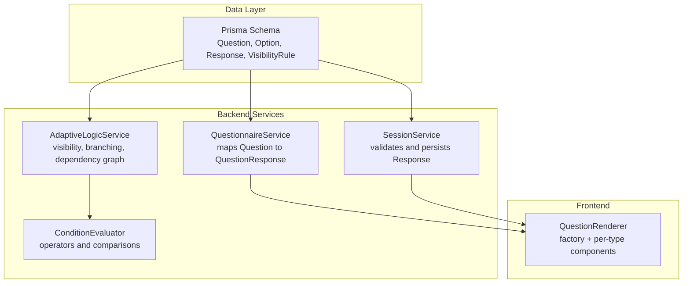
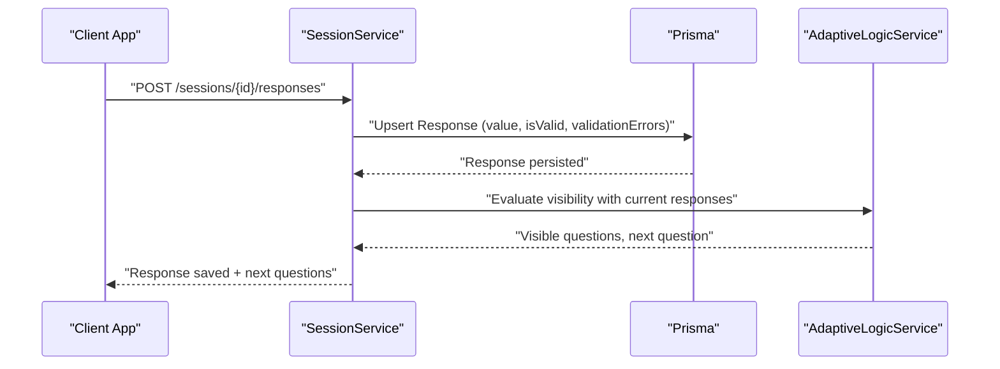
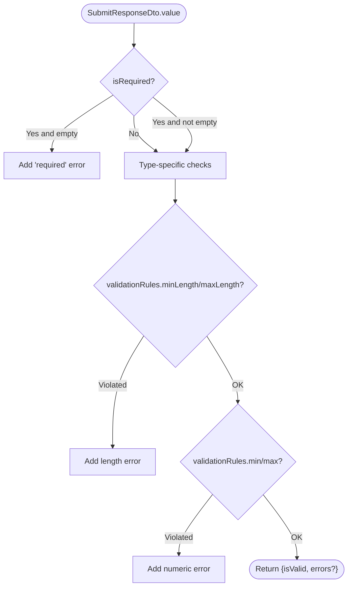
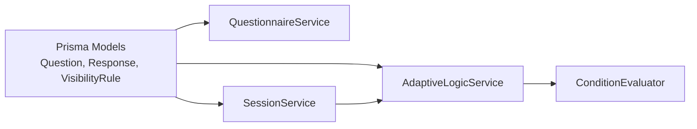

# Question Type Extensions

<cite>
**Referenced Files in This Document**
- [schema.prisma](file://prisma/schema.prisma)
- [questionnaire.service.ts](file://apps/api/src/modules/questionnaire/questionnaire.service.ts)
- [session.service.ts](file://apps/api/src/modules/session/session.service.ts)
- [submit-response.dto.ts](file://apps/api/src/modules/session/dto/submit-response.dto.ts)
- [adaptive-logic.service.ts](file://apps/api/src/modules/adaptive-logic/adaptive-logic.service.ts)
- [rule.types.ts](file://apps/api/src/modules/adaptive-logic/types/rule.types.ts)
- [condition.evaluator.ts](file://apps/api/src/modules/adaptive-logic/evaluators/condition.evaluator.ts)
- [05-data-models-db-architecture.md](file://docs/cto/05-data-models-db-architecture.md)
- [adaptive-logic.md](file://docs/questionnaire/adaptive-logic.md)
- [03-product-architecture.md](file://docs/cto/03-product-architecture.md)
- [quest-prompts.md](file://docs/quest-prompts.md)
</cite>

## Table of Contents
1. [Introduction](#introduction)
2. [Project Structure](#project-structure)
3. [Core Components](#core-components)
4. [Architecture Overview](#architecture-overview)
5. [Detailed Component Analysis](#detailed-component-analysis)
6. [Dependency Analysis](#dependency-analysis)
7. [Performance Considerations](#performance-considerations)
8. [Troubleshooting Guide](#troubleshooting-guide)
9. [Conclusion](#conclusion)
10. [Appendices](#appendices)

## Introduction
This document explains how to extend the questionnaire system with custom question types beyond the built-in set (text, choice, and matrix). It covers the question type architecture, validation framework, rendering integration, and practical guidance for building complex question types such as signature, file upload, rating scale, matrix multiple response, and dynamic choice. It also details metadata schema extensions, storage requirements, and performance optimization techniques for handling large volumes of custom questions.

## Project Structure
The questionnaire domain spans three primary layers:
- Data model and persistence: Prisma schema defines question types, options, validation rules, and response storage.
- Backend services: Questionnaire service fetches and maps questions; Session service validates and persists responses; Adaptive Logic service evaluates visibility and branching.
- Frontend renderer: The web client renders question types via a factory pattern and consistent props interface.

**Diagram sources**
- [schema.prisma](file://prisma/schema.prisma#L218-L247)
- [questionnaire.service.ts](file://apps/api/src/modules/questionnaire/questionnaire.service.ts#L236-L251)
- [session.service.ts](file://apps/api/src/modules/session/session.service.ts#L270-L359)
- [adaptive-logic.service.ts](file://apps/api/src/modules/adaptive-logic/adaptive-logic.service.ts#L31-L153)
- [condition.evaluator.ts](file://apps/api/src/modules/adaptive-logic/evaluators/condition.evaluator.ts#L9-L22)

**Section sources**
- [schema.prisma](file://prisma/schema.prisma#L218-L247)
- [questionnaire.service.ts](file://apps/api/src/modules/questionnaire/questionnaire.service.ts#L236-L251)
- [session.service.ts](file://apps/api/src/modules/session/session.service.ts#L270-L359)
- [adaptive-logic.service.ts](file://apps/api/src/modules/adaptive-logic/adaptive-logic.service.ts#L31-L153)
- [condition.evaluator.ts](file://apps/api/src/modules/adaptive-logic/evaluators/condition.evaluator.ts#L9-L22)
- [03-product-architecture.md](file://docs/cto/03-product-architecture.md#L99-L120)

## Core Components
- Question type enumeration: The Prisma schema defines the canonical set of question types, including built-ins and placeholders for future types.
- Question metadata: Questions store text, type, help/explanation, placeholder, ordering, required flag, options, validation rules, default/suggested answers, industry tags, and arbitrary metadata.
- Responses: Responses are stored as JSON with a value payload and validation outcome. The value shape is determined by the question type.
- Adaptive logic: Visibility rules and branching rules control which questions are shown and in what order, based on prior responses.

Key implementation anchors:
- Question type enum and fields: [schema.prisma](file://prisma/schema.prisma#L24-L36), [schema.prisma](file://prisma/schema.prisma#L218-L247)
- Question mapping to transport model: [questionnaire.service.ts](file://apps/api/src/modules/questionnaire/questionnaire.service.ts#L236-L251)
- Response validation and persistence: [session.service.ts](file://apps/api/src/modules/session/session.service.ts#L622-L659)
- Visibility evaluation and branching: [adaptive-logic.service.ts](file://apps/api/src/modules/adaptive-logic/adaptive-logic.service.ts#L31-L153), [rule.types.ts](file://apps/api/src/modules/adaptive-logic/types/rule.types.ts#L38-L53), [condition.evaluator.ts](file://apps/api/src/modules/adaptive-logic/evaluators/condition.evaluator.ts#L9-L22)

**Section sources**
- [schema.prisma](file://prisma/schema.prisma#L24-L36)
- [schema.prisma](file://prisma/schema.prisma#L218-L247)
- [questionnaire.service.ts](file://apps/api/src/modules/questionnaire/questionnaire.service.ts#L236-L251)
- [session.service.ts](file://apps/api/src/modules/session/session.service.ts#L622-L659)
- [adaptive-logic.service.ts](file://apps/api/src/modules/adaptive-logic/adaptive-logic.service.ts#L31-L153)
- [rule.types.ts](file://apps/api/src/modules/adaptive-logic/types/rule.types.ts#L38-L53)
- [condition.evaluator.ts](file://apps/api/src/modules/adaptive-logic/evaluators/condition.evaluator.ts#L9-L22)

## Architecture Overview
The system separates concerns across data, services, and presentation:
- Data: JSONB fields store options, validation rules, default/suggested answers, and metadata. Responses are stored as JSON with a typed value payload.
- Services: QuestionnaireService exposes question metadata; SessionService validates responses and persists them; AdaptiveLogicService computes visibility and branching.
- Rendering: The frontend consumes QuestionResponse objects and renders appropriate components based on type.

**Diagram sources**
- [session.service.ts](file://apps/api/src/modules/session/session.service.ts#L270-L359)
- [adaptive-logic.service.ts](file://apps/api/src/modules/adaptive-logic/adaptive-logic.service.ts#L31-L153)

## Detailed Component Analysis

### Question Type Architecture
- Enum-driven types: QuestionType is defined in the schema and used to select rendering and validation behavior.
- Metadata-first design: Options, validation rules, default/suggested answers, and metadata are stored as JSONB, enabling flexible extensions without schema migrations.
- Response value modeling: Responses are stored as JSON with a value payload whose shape depends on the question type.

Implementation anchors:
- Question type enum: [schema.prisma](file://prisma/schema.prisma#L24-L36)
- Question fields and JSONB metadata: [schema.prisma](file://prisma/schema.prisma#L218-L247)
- Question mapping to transport model: [questionnaire.service.ts](file://apps/api/src/modules/questionnaire/questionnaire.service.ts#L236-L251)
- Response DTO and value shape: [submit-response.dto.ts](file://apps/api/src/modules/session/dto/submit-response.dto.ts#L13-L14)

**Section sources**
- [schema.prisma](file://prisma/schema.prisma#L24-L36)
- [schema.prisma](file://prisma/schema.prisma#L218-L247)
- [questionnaire.service.ts](file://apps/api/src/modules/questionnaire/questionnaire.service.ts#L236-L251)
- [submit-response.dto.ts](file://apps/api/src/modules/session/dto/submit-response.dto.ts#L13-L14)

### Validation Framework
- Built-in validation: SessionService applies required checks and min/max length/numeric bounds based on validationRules.
- Adaptive validation: The adaptive logic engine supports dynamic and cross-question validations via rule configurations and evaluators.
- Operator coverage: ConditionEvaluator supports equality, inclusion, numeric comparisons, range checks, emptiness, prefix/suffix, and regex matching.

**Diagram sources**
- [session.service.ts](file://apps/api/src/modules/session/session.service.ts#L622-L659)

**Section sources**
- [session.service.ts](file://apps/api/src/modules/session/session.service.ts#L622-L659)
- [condition.evaluator.ts](file://apps/api/src/modules/adaptive-logic/evaluators/condition.evaluator.ts#L9-L22)
- [adaptive-logic.md](file://docs/questionnaire/adaptive-logic.md#L633-L704)

### Rendering Logic and Frontend Integration
- Factory pattern: The frontend renders question types via a factory that selects a component based on QuestionResponse.type.
- Consistent props: Components receive question metadata and callbacks for value changes, navigation, and validation feedback.
- Accessibility: Components are designed to be WCAG 2.1 AA compliant with screen reader support and focus management.

Implementation anchors:
- Renderer component guidance: [quest-prompts.md](file://docs/quest-prompts.md#L156-L197)
- QuestionResponse shape: [questionnaire.service.ts](file://apps/api/src/modules/questionnaire/questionnaire.service.ts#L14-L25)

**Section sources**
- [quest-prompts.md](file://docs/quest-prompts.md#L156-L197)
- [questionnaire.service.ts](file://apps/api/src/modules/questionnaire/questionnaire.service.ts#L14-L25)

### Implementing Custom Question Types

#### Step 1: Extend the Question Type Enum
- Add a new value to the QuestionType enum in the Prisma schema.
- Define the JSONB shapes for options, validation rules, default/suggested answers, and response payloads.

Implementation anchors:
- QuestionType enum: [schema.prisma](file://prisma/schema.prisma#L24-L36)
- JSONB schemas (examples): [05-data-models-db-architecture.md](file://docs/cto/05-data-models-db-architecture.md#L489-L551)

#### Step 2: Define Metadata and Storage Requirements
- Options: Array of option objects with id, label, optional description/icon/value, and ordering.
- Validation rules: JSON with fields like minLength, maxLength, min, max, pattern, and customMessage.
- Default/Suggested answers: Optional JSON with value and reasoning.
- Response payload: JSON with a shape that matches the question type (e.g., file metadata for uploads, row selections for matrix multiple response).

Implementation anchors:
- Options schema: [05-data-models-db-architecture.md](file://docs/cto/05-data-models-db-architecture.md#L489-L508)
- Response value schemas: [05-data-models-db-architecture.md](file://docs/cto/05-data-models-db-architecture.md#L532-L551)
- Question fields: [schema.prisma](file://prisma/schema.prisma#L218-L247)

#### Step 3: Implement Validation
- Built-in validation: Extend SessionService.validateResponse to handle new type-specific constraints.
- Adaptive validation: Add rule-based validators and cross-question validators as needed.

Implementation anchors:
- Built-in validation: [session.service.ts](file://apps/api/src/modules/session/session.service.ts#L622-L659)
- Cross-question validation examples: [adaptive-logic.md](file://docs/questionnaire/adaptive-logic.md#L662-L704)
- Condition operators: [condition.evaluator.ts](file://apps/api/src/modules/adaptive-logic/evaluators/condition.evaluator.ts#L44-L109)

#### Step 4: Render the Question Type
- Create a dedicated component under the QuestionRenderer factory.
- Accept QuestionResponse props and emit value updates conforming to the response payload schema.
- Provide accessibility and responsive behavior.

Implementation anchors:
- Renderer guidance: [quest-prompts.md](file://docs/quest-prompts.md#L156-L197)
- QuestionResponse mapping: [questionnaire.service.ts](file://apps/api/src/modules/questionnaire/questionnaire.service.ts#L236-L251)

#### Example Types and Their Implementation Patterns
- Signature: Store a digital signature image or drawing as a file URL plus metadata. Validate presence if required; optionally enforce MIME/type constraints.
- File Upload: Store fileUrl, fileName, fileSize, mimeType. Enforce size limits and allowed MIME types via validation rules and built-in checks.
- Rating Scale: Store a numeric rating with min/max bounds. Enforce integer ratings and optional labels.
- Matrix Multiple Response: Store rows as a map of rowId to selected optionId. Validate completeness per row if required.
- Dynamic Choice: Compute options server-side based on prior responses; expose options via QuestionResponse.options and apply visibility rules to drive option availability.

Implementation anchors:
- Response value schemas: [05-data-models-db-architecture.md](file://docs/cto/05-data-models-db-architecture.md#L532-L551)
- Visibility rules and branching: [adaptive-logic.service.ts](file://apps/api/src/modules/adaptive-logic/adaptive-logic.service.ts#L31-L153), [rule.types.ts](file://apps/api/src/modules/adaptive-logic/types/rule.types.ts#L38-L53)

**Section sources**
- [schema.prisma](file://prisma/schema.prisma#L24-L36)
- [05-data-models-db-architecture.md](file://docs/cto/05-data-models-db-architecture.md#L489-L551)
- [session.service.ts](file://apps/api/src/modules/session/session.service.ts#L622-L659)
- [adaptive-logic.service.ts](file://apps/api/src/modules/adaptive-logic/adaptive-logic.service.ts#L31-L153)
- [rule.types.ts](file://apps/api/src/modules/adaptive-logic/types/rule.types.ts#L38-L53)
- [condition.evaluator.ts](file://apps/api/src/modules/adaptive-logic/evaluators/condition.evaluator.ts#L44-L109)
- [quest-prompts.md](file://docs/quest-prompts.md#L156-L197)
- [questionnaire.service.ts](file://apps/api/src/modules/questionnaire/questionnaire.service.ts#L236-L251)

### Adaptive Logic and Branching for Custom Types
- Visibility rules: Use conditions on related questions to show/hide custom questions.
- Requirement rules: Mark custom questions required based on contextual responses.
- Branching rules: Direct users to specialized paths depending on custom question answers.

Implementation anchors:
- Evaluation and branching: [adaptive-logic.service.ts](file://apps/api/src/modules/adaptive-logic/adaptive-logic.service.ts#L31-L153)
- Conditions and operators: [condition.evaluator.ts](file://apps/api/src/modules/adaptive-logic/evaluators/condition.evaluator.ts#L9-L22), [rule.types.ts](file://apps/api/src/modules/adaptive-logic/types/rule.types.ts#L38-L53)
- Examples and patterns: [adaptive-logic.md](file://docs/questionnaire/adaptive-logic.md#L1-L800)

**Section sources**
- [adaptive-logic.service.ts](file://apps/api/src/modules/adaptive-logic/adaptive-logic.service.ts#L31-L153)
- [condition.evaluator.ts](file://apps/api/src/modules/adaptive-logic/evaluators/condition.evaluator.ts#L9-L22)
- [rule.types.ts](file://apps/api/src/modules/adaptive-logic/types/rule.types.ts#L38-L53)
- [adaptive-logic.md](file://docs/questionnaire/adaptive-logic.md#L1-L800)

## Dependency Analysis
The backend services depend on the Prisma schema and each other:
- QuestionnaireService depends on Prisma models to map questions to transport models.
- SessionService depends on QuestionnaireService for question metadata and on Prisma for response persistence.
- AdaptiveLogicService depends on Prisma for rules and on ConditionEvaluator for condition evaluation.

**Diagram sources**
- [schema.prisma](file://prisma/schema.prisma#L218-L247)
- [questionnaire.service.ts](file://apps/api/src/modules/questionnaire/questionnaire.service.ts#L236-L251)
- [session.service.ts](file://apps/api/src/modules/session/session.service.ts#L270-L359)
- [adaptive-logic.service.ts](file://apps/api/src/modules/adaptive-logic/adaptive-logic.service.ts#L31-L153)
- [condition.evaluator.ts](file://apps/api/src/modules/adaptive-logic/evaluators/condition.evaluator.ts#L9-L22)

**Section sources**
- [schema.prisma](file://prisma/schema.prisma#L218-L247)
- [questionnaire.service.ts](file://apps/api/src/modules/questionnaire/questionnaire.service.ts#L236-L251)
- [session.service.ts](file://apps/api/src/modules/session/session.service.ts#L270-L359)
- [adaptive-logic.service.ts](file://apps/api/src/modules/adaptive-logic/adaptive-logic.service.ts#L31-L153)
- [condition.evaluator.ts](file://apps/api/src/modules/adaptive-logic/evaluators/condition.evaluator.ts#L9-L22)

## Performance Considerations
- JSONB indexing: Use GIN or scalar indexes on frequently filtered fields (e.g., industry tags) to speed up question retrieval.
- Caching: Cache computed visibility states keyed by response snapshots to avoid repeated evaluations.
- Dependency graphs: Precompute and cache dependency graphs for rules to accelerate visibility recomputation.
- Pagination and batching: Paginate questionnaire retrieval and batch response writes to reduce load.
- Asynchronous processing: Offload heavy validations or file processing to background jobs.

[No sources needed since this section provides general guidance]

## Troubleshooting Guide
Common issues and resolutions:
- Validation errors not appearing: Ensure validationRules are present and correctly shaped; verify SessionService.validateResponse logic for the new type.
- Visibility not updating: Confirm visibility rules are active and ordered correctly; check AdaptiveLogicService evaluation order and caching invalidation.
- Response payload mismatch: Verify the response value conforms to the expected JSON schema for the question type; align frontend component output with backend expectations.

**Section sources**
- [session.service.ts](file://apps/api/src/modules/session/session.service.ts#L622-L659)
- [adaptive-logic.service.ts](file://apps/api/src/modules/adaptive-logic/adaptive-logic.service.ts#L31-L153)
- [05-data-models-db-architecture.md](file://docs/cto/05-data-models-db-architecture.md#L532-L551)

## Conclusion
Extending question types is primarily a metadata and rendering exercise. By adding a new enum value, defining JSONB schemas for options/validation/default/suggested answers and response payloads, implementing type-aware validation, and wiring a frontend component, you can introduce powerful new question types. Adaptive logic and branching enable sophisticated user experiences without code changes. Follow the patterns outlined here to maintain consistency, performance, and accessibility.

## Appendices

### A. Question Metadata Schema Extension Checklist
- Add enum value to QuestionType.
- Define options schema and validation rules schema for the new type.
- Define response payload schema for the new type.
- Implement SessionService.validateResponse for the new type.
- Add frontend component under QuestionRenderer factory.
- Configure visibility/branching rules as needed.

**Section sources**
- [schema.prisma](file://prisma/schema.prisma#L24-L36)
- [05-data-models-db-architecture.md](file://docs/cto/05-data-models-db-architecture.md#L489-L551)
- [session.service.ts](file://apps/api/src/modules/session/session.service.ts#L622-L659)
- [quest-prompts.md](file://docs/quest-prompts.md#L156-L197)