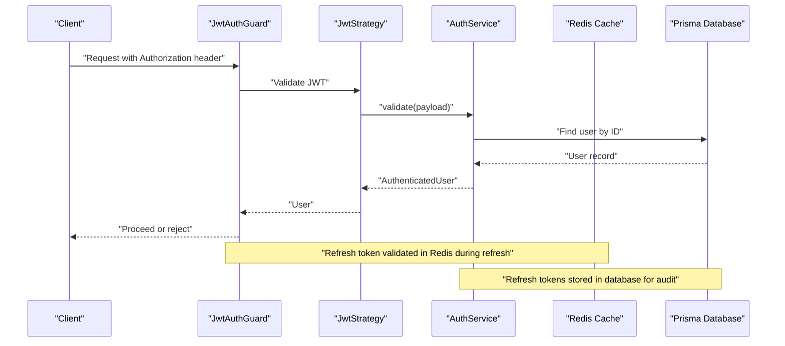
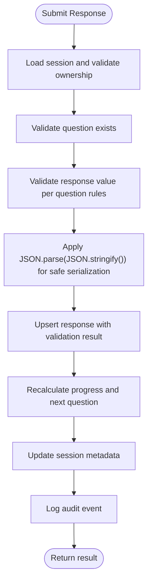
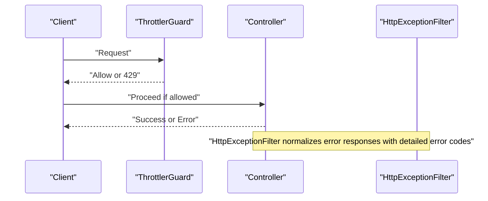
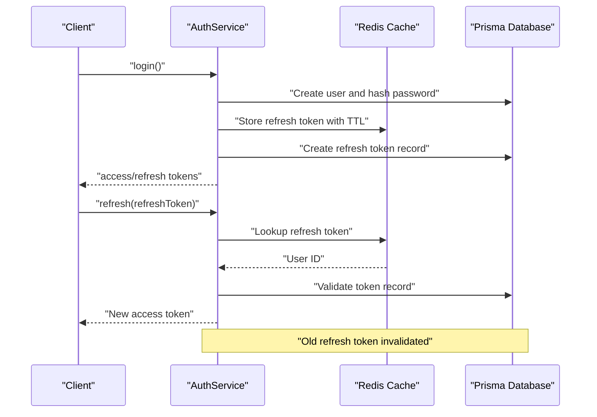
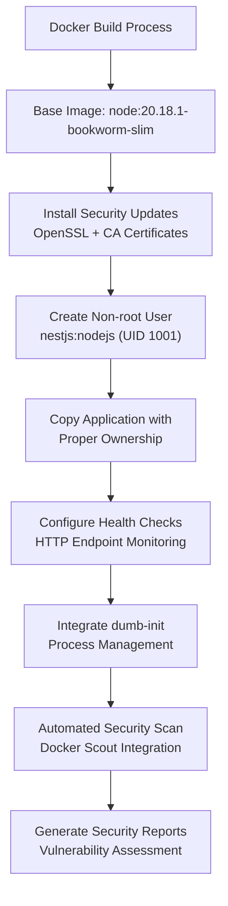
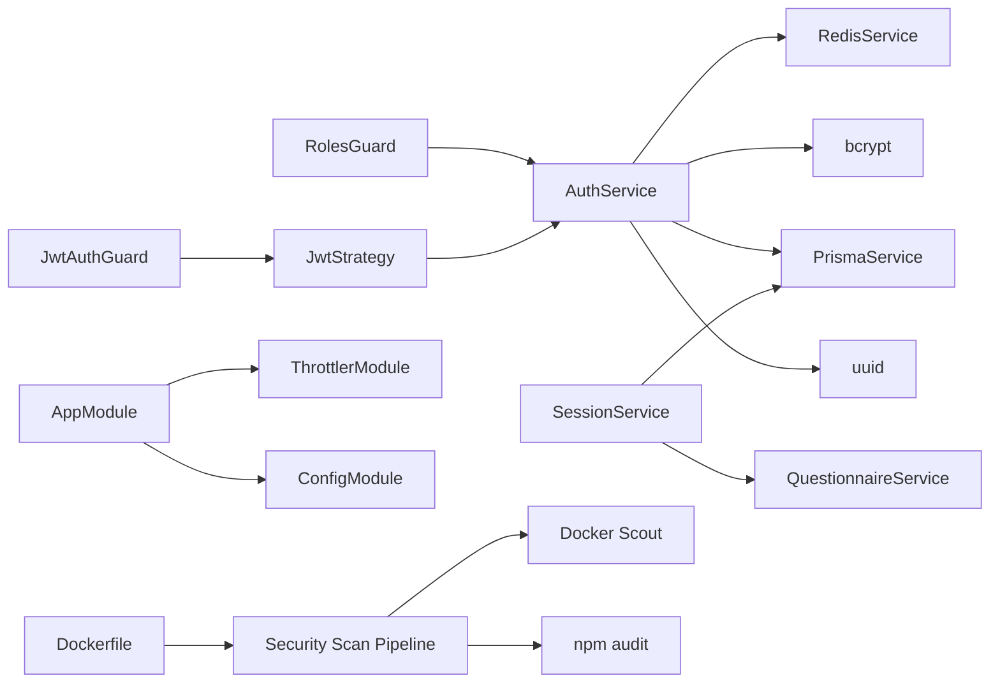

# Security Hardening

<cite>
**Referenced Files in This Document**
- [auth.service.ts](file://apps/api/src/modules/auth/auth.service.ts)
- [jwt-auth.guard.ts](file://apps/api/src/modules/auth/guards/jwt-auth.guard.ts)
- [jwt.strategy.ts](file://apps/api/src/modules/auth/strategies/jwt.strategy.ts)
- [roles.decorator.ts](file://apps/api/src/modules/auth/decorators/roles.decorator.ts)
- [roles.guard.ts](file://apps/api/src/modules/auth/guards/roles.guard.ts)
- [login.dto.ts](file://apps/api/src/modules/auth/dto/login.dto.ts)
- [register.dto.ts](file://apps/api/src/modules/auth/dto/register.dto.ts)
- [token.dto.ts](file://apps/api/src/modules/auth/dto/token.dto.ts)
- [session.service.ts](file://apps/api/src/modules/session/session.service.ts)
- [questionnaire.service.ts](file://apps/api/src/modules/questionnaire/questionnaire.service.ts)
- [logging.interceptor.ts](file://apps/api/src/common/interceptors/logging.interceptor.ts)
- [http-exception.filter.ts](file://apps/api/src/common/filters/http-exception.filter.ts)
- [configuration.ts](file://apps/api/src/config/configuration.ts)
- [app.module.ts](file://apps/api/src/app.module.ts)
- [submit-response.dto.ts](file://apps/api/src/modules/session/dto/submit-response.dto.ts)
- [public.decorator.ts](file://apps/api/src/modules/auth/decorators/public.decorator.ts)
- [user.decorator.ts](file://apps/api/src/modules/auth/decorators/user.decorator.ts)
- [security-scan.sh](file://scripts/security-scan.sh)
- [Dockerfile](file://docker/api/Dockerfile)
- [entrypoint.sh](file://docker/api/entrypoint.sh)
- [admin-audit.service.ts](file://apps/api/src/modules/admin/services/admin-audit.service.ts)
- [condition.evaluator.ts](file://apps/api/src/modules/adaptive-logic/evaluators/condition.evaluator.ts)
- [.env.example](file://.env.example)
- [.env.production.example](file://.env.production.example)
- [docker-compose.yml](file://docker-compose.yml)
</cite>

## Update Summary
**Changes Made**
- Added comprehensive Docker container security hardening with non-root user execution and hardened base images
- Implemented automated security scanning pipeline with Docker Scout integration and vulnerability assessment
- Enhanced data serialization safety with JSON.parse(JSON.stringify()) pattern for secure data handling
- Improved Docker container security with dumb-init process management and health checks
- Added production-grade security configurations with Azure Key Vault integration support

## Table of Contents
1. [Introduction](#introduction)
2. [Project Structure](#project-structure)
3. [Core Components](#core-components)
4. [Architecture Overview](#architecture-overview)
5. [Detailed Component Analysis](#detailed-component-analysis)
6. [Dependency Analysis](#dependency-analysis)
7. [Performance Considerations](#performance-considerations)
8. [Troubleshooting Guide](#troubleshooting-guide)
9. [Conclusion](#conclusion)
10. [Appendices](#appendices)

## Introduction
This document provides comprehensive security hardening guidance for protecting sensitive questionnaire data and user responses. It covers authentication and authorization patterns, session security, data protection, security middleware, and operational controls. The system now implements a comprehensive security framework with JWT authentication, Redis-based refresh token management, role-based access control, advanced session security measures, and enterprise-grade container security with automated vulnerability scanning.

## Project Structure
Security-related components are primarily located under the API application with enhanced container security:
- Authentication and authorization: modules/auth (guards, strategies, services, DTOs, decorators)
- Session management: modules/session (service, DTOs)
- Questionnaire data access: modules/questionnaire (service)
- Cross-cutting concerns: common/interceptors and common/filters
- Global configuration and rate limiting: config/configuration.ts and app.module.ts
- Container security: docker/api/Dockerfile and scripts/security-scan.sh
- Data serialization safety: enhanced JSON handling across services

```mermaid
graph TB
subgraph "API Application"
AUTH["Auth Module<br/>auth.service.ts<br/>guards/jwt-auth.guard.ts<br/>strategies/jwt.strategy.ts<br/>guards/roles.guard.ts<br/>decorators/*"]
SESSION["Session Module<br/>session.service.ts<br/>dto/submit-response.dto.ts"]
QUESTIONNAIRE["Questionnaire Module<br/>questionnaire.service.ts"]
COMMON_INT["Common Interceptors<br/>logging.interceptor.ts"]
COMMON_FILT["Common Filters<br/>http-exception.filter.ts"]
CFG["Config<br/>configuration.ts"]
APP["App Module<br/>app.module.ts"]
end
subgraph "Container Security"
DOCKERFILE["Dockerfile<br/>Hardened Base Images<br/>Non-root User"]
ENTRYPOINT["Entrypoint<br/>dumb-init Process Management"]
SECURITY_SCAN["Security Scan<br/>Docker Scout Integration"]
end
subgraph "Data Serialization"
AUDIT["Admin Audit Service<br/>JSON.parse(JSON.stringify())"]
CONDITION["Condition Evaluator<br/>Safe Comparison"]
END
APP --> AUTH
APP --> SESSION
APP --> QUESTIONNAIRE
APP --> COMMON_INT
APP --> COMMON_FILT
APP --> CFG
DOCKERFILE --> ENTRYPOINT
DOCKERFILE --> SECURITY_SCAN
AUDIT --> SESSION
CONDITION --> SESSION
```

**Diagram sources**
- [auth.service.ts](file://apps/api/src/modules/auth/auth.service.ts#L1-L555)
- [jwt-auth.guard.ts](file://apps/api/src/modules/auth/guards/jwt-auth.guard.ts#L1-L75)
- [jwt.strategy.ts](file://apps/api/src/modules/auth/strategies/jwt.strategy.ts#L1-L59)
- [roles.guard.ts](file://apps/api/src/modules/auth/guards/roles.guard.ts#L1-L77)
- [session.service.ts](file://apps/api/src/modules/session/session.service.ts#L1-L1367)
- [questionnaire.service.ts](file://apps/api/src/modules/questionnaire/questionnaire.service.ts#L1-L253)
- [logging.interceptor.ts](file://apps/api/src/common/interceptors/logging.interceptor.ts#L1-L123)
- [http-exception.filter.ts](file://apps/api/src/common/filters/http-exception.filter.ts#L1-L102)
- [configuration.ts](file://apps/api/src/config/configuration.ts#L1-L97)
- [app.module.ts](file://apps/api/src/app.module.ts#L1-L67)
- [Dockerfile](file://docker/api/Dockerfile#L1-L114)
- [entrypoint.sh](file://docker/api/entrypoint.sh#L1-L11)
- [security-scan.sh](file://scripts/security-scan.sh#L1-L74)
- [admin-audit.service.ts](file://apps/api/src/modules/admin/services/admin-audit.service.ts#L20-L48)
- [condition.evaluator.ts](file://apps/api/src/modules/adaptive-logic/evaluators/condition.evaluator.ts#L130-L145)

**Section sources**
- [app.module.ts](file://apps/api/src/app.module.ts#L1-L67)
- [configuration.ts](file://apps/api/src/config/configuration.ts#L1-L97)
- [Dockerfile](file://docker/api/Dockerfile#L1-L114)
- [security-scan.sh](file://scripts/security-scan.sh#L1-L74)

## Core Components
- Authentication service: handles registration, login, token generation, refresh token storage in Redis, logout, and failed login handling with account lockout.
- JWT strategy and guard: enforce bearer token validation and public route bypass with enhanced error handling.
- Role-based access control: roles decorator and guard with refined role validation.
- Session service: manages questionnaire sessions, response submission, and progress tracking with strict access controls and enhanced data serialization safety.
- Logging interceptor and exception filter: structured logging and standardized error responses with comprehensive error categorization.
- Configuration: centralizes secrets and security-related settings with environment variable support and production-grade security configurations.
- Container security: hardened Docker images with non-root execution, process management, and automated vulnerability scanning.
- Data serialization: safe JSON handling patterns to prevent prototype pollution and data corruption.

**Section sources**
- [auth.service.ts](file://apps/api/src/modules/auth/auth.service.ts#L1-L555)
- [jwt-auth.guard.ts](file://apps/api/src/modules/auth/guards/jwt-auth.guard.ts#L1-L75)
- [jwt.strategy.ts](file://apps/api/src/modules/auth/strategies/jwt.strategy.ts#L1-L59)
- [roles.guard.ts](file://apps/api/src/modules/auth/guards/roles.guard.ts#L1-L77)
- [session.service.ts](file://apps/api/src/modules/session/session.service.ts#L1-L1367)
- [logging.interceptor.ts](file://apps/api/src/common/interceptors/logging.interceptor.ts#L1-L123)
- [http-exception.filter.ts](file://apps/api/src/common/filters/http-exception.filter.ts#L1-L102)
- [configuration.ts](file://apps/api/src/config/configuration.ts#L1-L97)
- [Dockerfile](file://docker/api/Dockerfile#L48-L67)
- [security-scan.sh](file://scripts/security-scan.sh#L1-L74)
- [admin-audit.service.ts](file://apps/api/src/modules/admin/services/admin-audit.service.ts#L20-L48)

## Architecture Overview
The system enforces authentication via JWT with Redis-based refresh token management and optional roles. Requests pass through global rate limiting, then reach controllers gated by authentication and role guards. Sessions and responses are persisted with validation and progress tracking, with comprehensive audit trails for security events. Container security is enforced through hardened Docker images with non-root execution, process management, and automated vulnerability scanning.



**Diagram sources**
- [jwt-auth.guard.ts](file://apps/api/src/modules/auth/guards/jwt-auth.guard.ts#L1-L75)
- [jwt.strategy.ts](file://apps/api/src/modules/auth/strategies/jwt.strategy.ts#L1-L59)
- [auth.service.ts](file://apps/api/src/modules/auth/auth.service.ts#L166-L190)
- [configuration.ts](file://apps/api/src/config/configuration.ts#L19-L25)

## Detailed Component Analysis

### Authentication and Authorization
- JWT-based authentication with bearer tokens and refresh tokens stored in Redis for scalable validation and database for audit trail.
- Public routes are supported via a public decorator that bypasses JWT guard with proper reflection handling.
- Role-based access control uses a roles decorator and guard to restrict endpoints to specific roles with enhanced error reporting.
- Password hashing uses bcrypt with configurable rounds from environment variables.
- Login failure handling includes lockout thresholds, temporary locks, and comprehensive audit logging.
- Token rotation implemented with automatic refresh token invalidation and reissuance.

```mermaid
classDiagram
class AuthService {
+register(dto) TokenResponseDto
+login(dto) TokenResponseDto
+refresh(refreshToken) {accessToken, expiresIn}
+logout(refreshToken) void
+validateUser(payload) AuthenticatedUser
-generateTokens(user) TokenResponseDto
-handleFailedLogin(user) Promise~void~
-parseExpiresInToSeconds(expiresIn) number
}
class JwtStrategy {
+validate(payload) AuthenticatedUser
}
class JwtAuthGuard {
+canActivate(context) boolean
+handleRequest(err, user, info) any
}
class RolesGuard {
+canActivate(context) boolean
}
class PublicDecorator {
+Public() Metadata
}
class RolesDecorator {
+Roles(roles) Metadata
}
AuthService <.. JwtStrategy : "validate user"
JwtAuthGuard ..> JwtStrategy : "uses"
RolesGuard ..> AuthService : "checks roles"
PublicDecorator ..> JwtAuthGuard : "bypass"
RolesDecorator ..> RolesGuard : "enforce"
```

**Diagram sources**
- [auth.service.ts](file://apps/api/src/modules/auth/auth.service.ts#L1-L555)
- [jwt.strategy.ts](file://apps/api/src/modules/auth/strategies/jwt.strategy.ts#L1-L59)
- [jwt-auth.guard.ts](file://apps/api/src/modules/auth/guards/jwt-auth.guard.ts#L1-L75)
- [roles.guard.ts](file://apps/api/src/modules/auth/guards/roles.guard.ts#L1-L77)
- [public.decorator.ts](file://apps/api/src/modules/auth/decorators/public.decorator.ts#L1-L9)
- [roles.decorator.ts](file://apps/api/src/modules/auth/decorators/roles.decorator.ts#L1-L13)

**Section sources**
- [auth.service.ts](file://apps/api/src/modules/auth/auth.service.ts#L54-L126)
- [auth.service.ts](file://apps/api/src/modules/auth/auth.service.ts#L128-L164)
- [auth.service.ts](file://apps/api/src/modules/auth/auth.service.ts#L192-L232)
- [auth.service.ts](file://apps/api/src/modules/auth/auth.service.ts#L234-L253)
- [jwt-auth.guard.ts](file://apps/api/src/modules/auth/guards/jwt-auth.guard.ts#L12-L36)
- [jwt.strategy.ts](file://apps/api/src/modules/auth/strategies/jwt.strategy.ts#L20-L28)
- [roles.decorator.ts](file://apps/api/src/modules/auth/decorators/roles.decorator.ts#L1-L13)
- [roles.guard.ts](file://apps/api/src/modules/auth/guards/roles.guard.ts#L11-L36)
- [public.decorator.ts](file://apps/api/src/modules/auth/decorators/public.decorator.ts#L1-L9)

### Session Management and Secure Response Handling
- Session creation initializes progress and adaptive state with comprehensive validation.
- Response submission validates question existence, value validity, and updates session progress with detailed error handling.
- Access control ensures users can only access their own sessions with strict ownership verification.
- Response DTOs define strict validation for submitted answers with comprehensive type checking.
- Session lifecycle management includes proper cleanup and state validation.
- **Enhanced** Data serialization safety implemented using JSON.parse(JSON.stringify()) pattern to prevent prototype pollution and ensure safe data handling.



**Diagram sources**
- [session.service.ts](file://apps/api/src/modules/session/session.service.ts#L270-L359)
- [submit-response.dto.ts](file://apps/api/src/modules/session/dto/submit-response.dto.ts#L1-L43)
- [admin-audit.service.ts](file://apps/api/src/modules/admin/services/admin-audit.service.ts#L20-L48)

**Section sources**
- [session.service.ts](file://apps/api/src/modules/session/session.service.ts#L96-L136)
- [session.service.ts](file://apps/api/src/modules/session/session.service.ts#L138-L160)
- [session.service.ts](file://apps/api/src/modules/session/session.service.ts#L270-L359)
- [session.service.ts](file://apps/api/src/modules/session/session.service.ts#L548-L565)
- [submit-response.dto.ts](file://apps/api/src/modules/session/dto/submit-response.dto.ts#L4-L41)
- [admin-audit.service.ts](file://apps/api/src/modules/admin/services/admin-audit.service.ts#L20-L48)

### Data Protection Techniques
- Encryption at rest: database credentials and secrets are configured via environment variables; ensure database encryption at rest is enabled at the platform level.
- Encryption in transit: configure HTTPS/TLS termination at the edge/load balancer; avoid transmitting secrets in URLs.
- Secure response handling: response validation prevents malformed data; responses are upserted with revision tracking and comprehensive error handling.
- Audit trail: refresh tokens are recorded in the database for auditability; logging interceptor captures request metrics and exceptions with detailed metadata.
- Data validation: comprehensive DTO validation ensures data integrity at all boundaries.
- **Enhanced** Data serialization safety: implemented JSON.parse(JSON.stringify()) pattern across services to prevent prototype pollution and ensure safe data handling in audit logs and response processing.

**Section sources**
- [configuration.ts](file://apps/api/src/config/configuration.ts#L8-L17)
- [auth.service.ts](file://apps/api/src/modules/auth/auth.service.ts#L209-L216)
- [logging.interceptor.ts](file://apps/api/src/common/interceptors/logging.interceptor.ts#L16-L60)
- [http-exception.filter.ts](file://apps/api/src/common/filters/http-exception.filter.ts#L26-L82)
- [admin-audit.service.ts](file://apps/api/src/modules/admin/services/admin-audit.service.ts#L20-L48)
- [condition.evaluator.ts](file://apps/api/src/modules/adaptive-logic/evaluators/condition.evaluator.ts#L130-L145)

### Security Middleware Implementation
- Request validation: DTOs enforce input constraints (email format, min/max lengths, UUIDs, password complexity requirements).
- Rate limiting: global throttling with configurable short, medium, and long windows; login-specific limits with enhanced security.
- Exception handling: centralized filter standardizes error responses with comprehensive error categorization and logging.
- Security decorators: public route bypass and role-based access control with proper metadata handling.



**Diagram sources**
- [app.module.ts](file://apps/api/src/app.module.ts#L26-L42)
- [configuration.ts](file://apps/api/src/config/configuration.ts#L32-L37)
- [http-exception.filter.ts](file://apps/api/src/common/filters/http-exception.filter.ts#L26-L82)

**Section sources**
- [login.dto.ts](file://apps/api/src/modules/auth/dto/login.dto.ts#L4-L16)
- [register.dto.ts](file://apps/api/src/modules/auth/dto/register.dto.ts#L4-L23)
- [submit-response.dto.ts](file://apps/api/src/modules/session/dto/submit-response.dto.ts#L4-L41)
- [app.module.ts](file://apps/api/src/app.module.ts#L26-L42)
- [configuration.ts](file://apps/api/src/config/configuration.ts#L32-L37)
- [http-exception.filter.ts](file://apps/api/src/common/filters/http-exception.filter.ts#L26-L82)

### Secure Session Management
- Token rotation: refresh tokens are stored in Redis with expiration and re-issued on successful refresh; access tokens are short-lived (15 minutes).
- Session expiration: access tokens expire quickly; refresh tokens are time-bound (configurable) and audited in database.
- Secure cookie handling: the code uses bearer tokens; if cookies are introduced, set SameSite, Secure, and HttpOnly flags.
- Redis integration: scalable refresh token storage with atomic operations and expiration handling.
- Audit logging: comprehensive logging of authentication events, token operations, and security incidents.



**Diagram sources**
- [auth.service.ts](file://apps/api/src/modules/auth/auth.service.ts#L54-L83)
- [auth.service.ts](file://apps/api/src/modules/auth/auth.service.ts#L128-L164)
- [auth.service.ts](file://apps/api/src/modules/auth/auth.service.ts#L192-L232)

**Section sources**
- [auth.service.ts](file://apps/api/src/modules/auth/auth.service.ts#L192-L232)
- [auth.service.ts](file://apps/api/src/modules/auth/auth.service.ts#L128-L164)

### Container Security Hardening
- **New** Hardened Docker base images: using Node.js 20.18.1-bookworm-slim with security patches and minimal attack surface.
- **New** Non-root user execution: creates dedicated `nestjs` user (UID 1001) with proper group permissions for security isolation.
- **New** Process management: integrates `dumb-init` for proper signal handling and zombie process prevention.
- **New** Health checks: comprehensive health monitoring with HTTP endpoint verification and retry mechanisms.
- **New** Automated security scanning: Docker Scout integration for CVE vulnerability assessment and security report generation.
- **New** Sensitive file detection: automated scanning for private keys, certificates, and environment files in container images.
- **New** Production security configurations: Azure Key Vault integration support and hardened environment variable management.



**Diagram sources**
- [Dockerfile](file://docker/api/Dockerfile#L1-L114)
- [entrypoint.sh](file://docker/api/entrypoint.sh#L1-L11)
- [security-scan.sh](file://scripts/security-scan.sh#L1-L74)

**Section sources**
- [Dockerfile](file://docker/api/Dockerfile#L48-L67)
- [Dockerfile](file://docker/api/Dockerfile#L72-L77)
- [entrypoint.sh](file://docker/api/entrypoint.sh#L1-L11)
- [security-scan.sh](file://scripts/security-scan.sh#L27-L39)
- [security-scan.sh](file://scripts/security-scan.sh#L46-L62)

### Advanced Security Features
- Multi-factor authentication: ready for integration with TOTP/HSM-backed MFA at the auth service layer.
- Role-based access control refinement: enforce resource-level permissions and least privilege with enhanced role validation.
- Session security: rotate refresh tokens, enforce idle timeouts, and invalidate on device change.
- Data protection: encrypt at rest, enforce TLS termination, and sanitize logs with comprehensive audit trails.
- Middleware: implement request validation, rate limiting, and DDoS protections at the edge with enhanced security controls.
- Vulnerability mitigation: apply input sanitization, CSRF protections, and CSP headers with comprehensive error handling.
- Compliance: adopt privacy-by-design, data retention policies, and audit trails aligned with regulations.
- **Enhanced** Container security: hardened base images, non-root execution, process management, and automated vulnerability scanning.
- **Enhanced** Data serialization: safe JSON handling patterns to prevent prototype pollution and ensure data integrity.

**Section sources**
- [auth.service.ts](file://apps/api/src/modules/auth/auth.service.ts#L234-L253)
- [jwt-auth.guard.ts](file://apps/api/src/modules/auth/guards/jwt-auth.guard.ts#L25-L36)
- [roles.guard.ts](file://apps/api/src/modules/auth/guards/roles.guard.ts#L28-L34)
- [logging.interceptor.ts](file://apps/api/src/common/interceptors/logging.interceptor.ts#L16-L60)
- [http-exception.filter.ts](file://apps/api/src/common/filters/http-exception.filter.ts#L56-L79)
- [Dockerfile](file://docker/api/Dockerfile#L48-L67)
- [security-scan.sh](file://scripts/security-scan.sh#L27-L39)
- [admin-audit.service.ts](file://apps/api/src/modules/admin/services/admin-audit.service.ts#L20-L48)

## Dependency Analysis
Authentication relies on JWT, Redis for refresh tokens, and Prisma for persistence. Session management depends on questionnaire services and adaptive logic. Global rate limiting is enforced via NestJS throttler with enhanced security configurations. Container security is managed through Docker build processes and automated scanning pipelines.



**Diagram sources**
- [jwt.strategy.ts](file://apps/api/src/modules/auth/strategies/jwt.strategy.ts#L1-L59)
- [jwt-auth.guard.ts](file://apps/api/src/modules/auth/guards/jwt-auth.guard.ts#L1-L75)
- [roles.guard.ts](file://apps/api/src/modules/auth/guards/roles.guard.ts#L1-L77)
- [session.service.ts](file://apps/api/src/modules/session/session.service.ts#L1-L1367)
- [questionnaire.service.ts](file://apps/api/src/modules/questionnaire/questionnaire.service.ts#L1-L253)
- [auth.service.ts](file://apps/api/src/modules/auth/auth.service.ts#L1-L555)
- [app.module.ts](file://apps/api/src/app.module.ts#L26-L42)
- [Dockerfile](file://docker/api/Dockerfile#L1-L114)
- [security-scan.sh](file://scripts/security-scan.sh#L1-L74)

**Section sources**
- [app.module.ts](file://apps/api/src/app.module.ts#L16-L67)
- [auth.service.ts](file://apps/api/src/modules/auth/auth.service.ts#L1-L52)
- [Dockerfile](file://docker/api/Dockerfile#L1-L114)
- [security-scan.sh](file://scripts/security-scan.sh#L1-L74)

## Performance Considerations
- Keep access tokens short-lived (15 minutes) to reduce exposure window and improve security.
- Use Redis for fast refresh token validation with proper connection pooling and monitoring.
- Apply rate limiting tiers to protect endpoints from abuse without impacting legitimate users.
- Validate responses close to the data boundary to minimize unnecessary processing.
- Implement connection pooling for Redis and database connections to optimize performance.
- Use efficient DTO validation with minimal overhead for high-throughput scenarios.
- **Enhanced** Container optimization: leverage slim base images and minimal runtime dependencies for improved performance and security.

## Troubleshooting Guide
- Authentication failures: verify JWT secret configuration, token expiration, user status checks, and Redis connectivity.
- Session access denied: confirm session ownership, status checks, and proper user context propagation.
- Validation errors: review DTO constraints, question validation rules, and input sanitization.
- Excessive 429 responses: adjust throttle TTL and limits in configuration, check for misconfigured rate limiting.
- Redis issues: verify connection settings, TTL configuration, and proper error handling for cache failures.
- Token rotation problems: check Redis expiration settings, database audit records, and proper cleanup procedures.
- **New** Container security issues: verify non-root user execution, process management with dumb-init, and health check configuration.
- **New** Security scan failures: check Docker Scout installation, image availability, and proper vulnerability assessment reporting.
- **New** Data serialization errors: verify JSON.parse(JSON.stringify()) implementation and prototype pollution prevention.

**Section sources**
- [jwt-auth.guard.ts](file://apps/api/src/modules/auth/guards/jwt-auth.guard.ts#L25-L36)
- [session.service.ts](file://apps/api/src/modules/session/session.service.ts#L548-L565)
- [http-exception.filter.ts](file://apps/api/src/common/filters/http-exception.filter.ts#L26-L82)
- [configuration.ts](file://apps/api/src/config/configuration.ts#L32-L37)
- [auth.service.ts](file://apps/api/src/modules/auth/auth.service.ts#L128-L164)
- [Dockerfile](file://docker/api/Dockerfile#L48-L67)
- [security-scan.sh](file://scripts/security-scan.sh#L17-L21)
- [admin-audit.service.ts](file://apps/api/src/modules/admin/services/admin-audit.service.ts#L20-L48)

## Conclusion
The system implements a comprehensive security framework with robust JWT authentication, Redis-based refresh token management, and advanced role-based access control. Session management safeguards user data with strict validation, progress tracking, and comprehensive audit trails. The implementation leverages modern security practices including token rotation, account lockout mechanisms, and detailed logging. Enhanced configurations support production deployment with proper environment variable management, while centralized logging and exception handling improve observability and incident response capabilities. 

**Major enhancements include:**
- Enterprise-grade container security with hardened Docker images and non-root execution
- Automated security scanning pipeline with Docker Scout integration for continuous vulnerability assessment
- Enhanced data serialization safety with JSON.parse(JSON.stringify()) patterns to prevent prototype pollution
- Production-ready security configurations supporting Azure Key Vault integration
- Comprehensive health monitoring and process management for improved container reliability

The architecture provides a solid foundation for future security enhancements including multi-factor authentication, advanced threat detection systems, and continuous security monitoring with automated vulnerability remediation.

## Appendices

### Recommended Security Controls
- Multi-factor authentication: integrate TOTP/HSM-backed MFA at the auth service layer with proper backup codes and recovery mechanisms.
- Role-based access control refinement: enforce resource-level permissions, implement attribute-based access control (ABAC), and establish principle of least privilege.
- Session security: implement refresh token rotation, enforce idle timeouts (configurable), invalidate tokens on device change, and add device fingerprinting.
- Data protection: enable database encryption at rest, enforce TLS termination with strong cipher suites, implement comprehensive log sanitization, and add data loss prevention.
- Middleware: implement request validation with custom validators, rate limiting with sliding windows, DDoS protection with behavioral analysis, and WAF integration.
- Vulnerability mitigation: apply input sanitization with HTML escaping, implement CSRF protections with anti-forgery tokens, add CSP headers, and establish security headers policy.
- Compliance: adopt privacy-by-design principles, implement data retention policies with automated cleanup, maintain comprehensive audit trails, and establish compliance monitoring.
- **Enhanced** Container security: implement hardened base images, non-root user execution, process management with dumb-init, automated vulnerability scanning, and health monitoring.
- **Enhanced** Data serialization: implement safe JSON handling patterns, prevent prototype pollution, and ensure data integrity across all service layers.
- **Enhanced** Security monitoring: establish continuous security scanning pipeline, implement automated vulnerability assessment, and maintain security report generation.
- **Enhanced** Production security: integrate Azure Key Vault for managed secrets, implement production-grade security configurations, and establish secure deployment practices.

### Security Configuration Examples
- **Production environment**: Configure `.env.production` with secure secrets, Azure Database for PostgreSQL, and Redis Cache with TLS encryption.
- **Development environment**: Use `.env.example` for local development with appropriate security settings and Docker Compose network isolation.
- **Container security**: Leverage hardened Docker images with non-root execution, process management, and automated vulnerability scanning.
- **Audit logging**: Implement comprehensive audit trails with JSON.parse(JSON.stringify()) patterns for safe data serialization and secure logging practices.