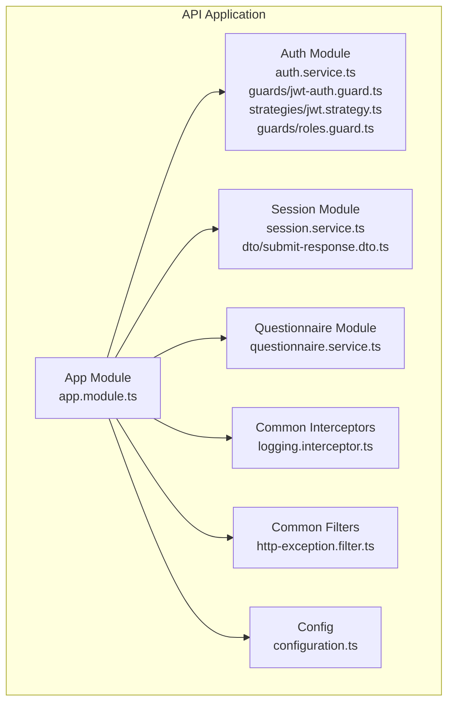
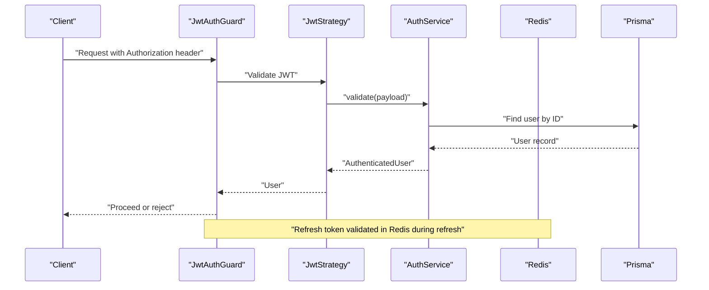
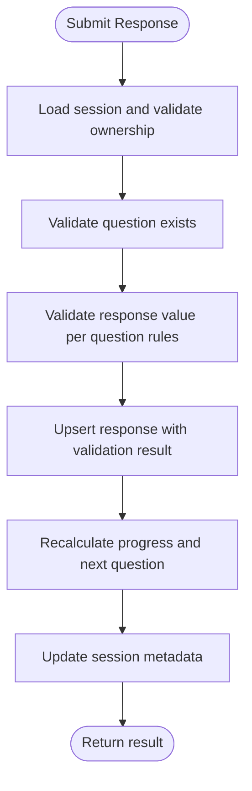
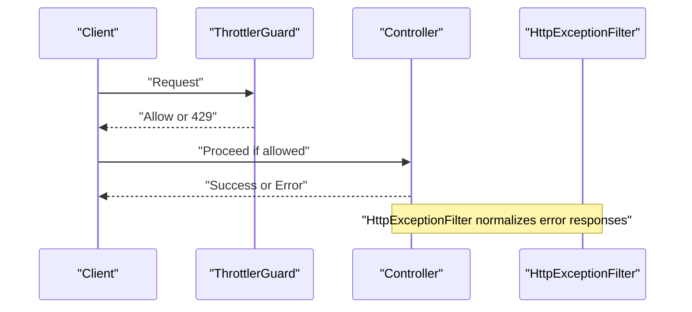
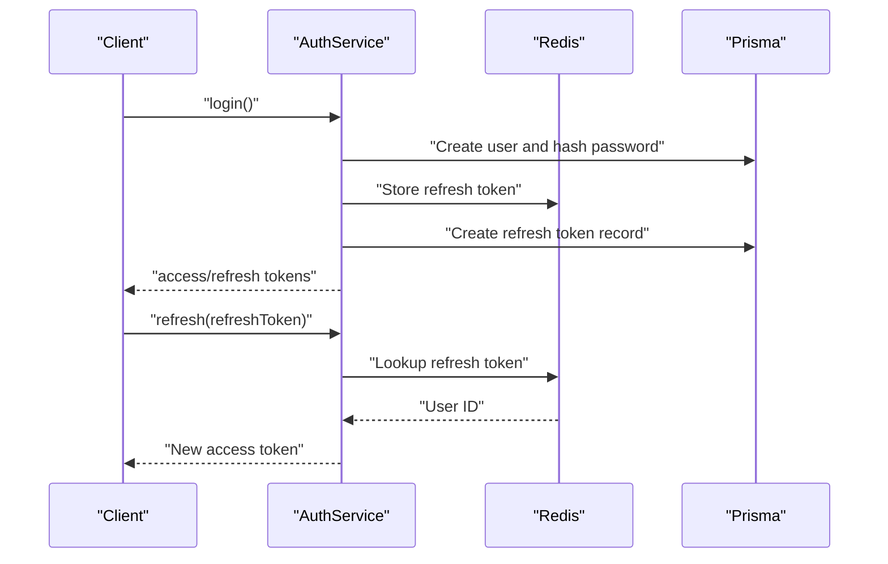
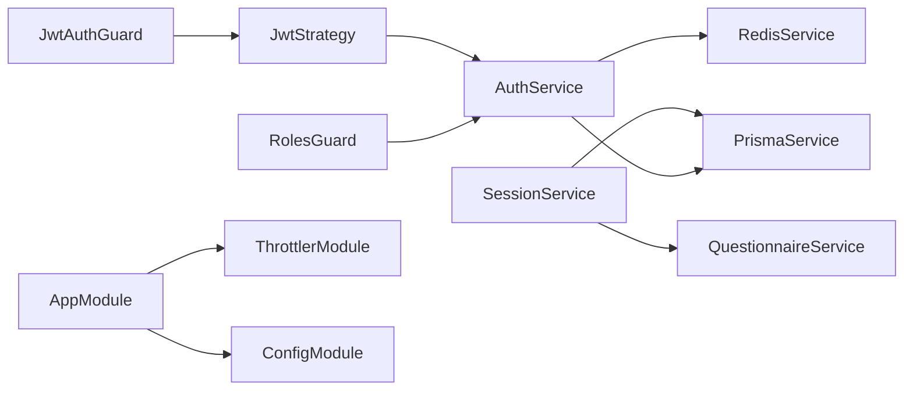

# Security Hardening

<cite>
**Referenced Files in This Document**
- [auth.service.ts](file://apps/api/src/modules/auth/auth.service.ts)
- [jwt-auth.guard.ts](file://apps/api/src/modules/auth/guards/jwt-auth.guard.ts)
- [jwt.strategy.ts](file://apps/api/src/modules/auth/strategies/jwt.strategy.ts)
- [roles.decorator.ts](file://apps/api/src/modules/auth/decorators/roles.decorator.ts)
- [roles.guard.ts](file://apps/api/src/modules/auth/guards/roles.guard.ts)
- [login.dto.ts](file://apps/api/src/modules/auth/dto/login.dto.ts)
- [register.dto.ts](file://apps/api/src/modules/auth/dto/register.dto.ts)
- [token.dto.ts](file://apps/api/src/modules/auth/dto/token.dto.ts)
- [session.service.ts](file://apps/api/src/modules/session/session.service.ts)
- [questionnaire.service.ts](file://apps/api/src/modules/questionnaire/questionnaire.service.ts)
- [logging.interceptor.ts](file://apps/api/src/common/interceptors/logging.interceptor.ts)
- [http-exception.filter.ts](file://apps/api/src/common/filters/http-exception.filter.ts)
- [configuration.ts](file://apps/api/src/config/configuration.ts)
- [app.module.ts](file://apps/api/src/app.module.ts)
- [submit-response.dto.ts](file://apps/api/src/modules/session/dto/submit-response.dto.ts)
</cite>

## Table of Contents
1. [Introduction](#introduction)
2. [Project Structure](#project-structure)
3. [Core Components](#core-components)
4. [Architecture Overview](#architecture-overview)
5. [Detailed Component Analysis](#detailed-component-analysis)
6. [Dependency Analysis](#dependency-analysis)
7. [Performance Considerations](#performance-considerations)
8. [Troubleshooting Guide](#troubleshooting-guide)
9. [Conclusion](#conclusion)
10. [Appendices](#appendices)

## Introduction
This document provides comprehensive security hardening guidance for protecting sensitive questionnaire data and user responses. It covers authentication and authorization patterns, session security, data protection, security middleware, and operational controls. The goal is to strengthen defenses against common threats while maintaining usability and performance.

## Project Structure
Security-related components are primarily located under the API application:
- Authentication and authorization: modules/auth (guards, strategies, services, DTOs)
- Session management: modules/session (service, DTOs)
- Questionnaire data access: modules/questionnaire (service)
- Cross-cutting concerns: common/interceptors and common/filters
- Global configuration and rate limiting: config/configuration.ts and app.module.ts



**Diagram sources**
- [auth.service.ts](file://apps/api/src/modules/auth/auth.service.ts#L1-L278)
- [jwt-auth.guard.ts](file://apps/api/src/modules/auth/guards/jwt-auth.guard.ts#L1-L38)
- [jwt.strategy.ts](file://apps/api/src/modules/auth/strategies/jwt.strategy.ts#L1-L30)
- [roles.guard.ts](file://apps/api/src/modules/auth/guards/roles.guard.ts#L1-L39)
- [session.service.ts](file://apps/api/src/modules/session/session.service.ts#L1-L684)
- [questionnaire.service.ts](file://apps/api/src/modules/questionnaire/questionnaire.service.ts#L1-L253)
- [logging.interceptor.ts](file://apps/api/src/common/interceptors/logging.interceptor.ts#L1-L62)
- [http-exception.filter.ts](file://apps/api/src/common/filters/http-exception.filter.ts#L1-L102)
- [configuration.ts](file://apps/api/src/config/configuration.ts#L1-L49)
- [app.module.ts](file://apps/api/src/app.module.ts#L1-L67)

**Section sources**
- [app.module.ts](file://apps/api/src/app.module.ts#L1-L67)
- [configuration.ts](file://apps/api/src/config/configuration.ts#L1-L49)

## Core Components
- Authentication service: handles registration, login, token generation, refresh token storage, logout, and failed login handling.
- JWT strategy and guard: enforce bearer token validation and public route bypass.
- Role-based access control: roles decorator and roles guard.
- Session service: manages questionnaire sessions, response submission, and progress tracking.
- Logging interceptor and exception filter: structured logging and standardized error responses.
- Configuration: centralizes secrets and security-related settings.

**Section sources**
- [auth.service.ts](file://apps/api/src/modules/auth/auth.service.ts#L1-L278)
- [jwt-auth.guard.ts](file://apps/api/src/modules/auth/guards/jwt-auth.guard.ts#L1-L38)
- [jwt.strategy.ts](file://apps/api/src/modules/auth/strategies/jwt.strategy.ts#L1-L30)
- [roles.guard.ts](file://apps/api/src/modules/auth/guards/roles.guard.ts#L1-L39)
- [session.service.ts](file://apps/api/src/modules/session/session.service.ts#L1-L684)
- [logging.interceptor.ts](file://apps/api/src/common/interceptors/logging.interceptor.ts#L1-L62)
- [http-exception.filter.ts](file://apps/api/src/common/filters/http-exception.filter.ts#L1-L102)
- [configuration.ts](file://apps/api/src/config/configuration.ts#L1-L49)

## Architecture Overview
The system enforces authentication via JWT and optional roles. Requests pass through global rate limiting, then reach controllers gated by authentication and role guards. Sessions and responses are persisted with validation and progress tracking.



**Diagram sources**
- [jwt-auth.guard.ts](file://apps/api/src/modules/auth/guards/jwt-auth.guard.ts#L1-L38)
- [jwt.strategy.ts](file://apps/api/src/modules/auth/strategies/jwt.strategy.ts#L1-L30)
- [auth.service.ts](file://apps/api/src/modules/auth/auth.service.ts#L166-L190)
- [configuration.ts](file://apps/api/src/config/configuration.ts#L19-L25)

## Detailed Component Analysis

### Authentication and Authorization
- JWT-based authentication with bearer tokens and refresh tokens stored in Redis and audited in the database.
- Public routes are supported via a public decorator that bypasses JWT guard.
- Role-based access control uses a roles decorator and guard to restrict endpoints to specific roles.
- Password hashing uses bcrypt with configurable rounds.
- Login failure handling includes lockout thresholds and temporary locks.

```mermaid
classDiagram
class AuthService {
+register(dto) TokenResponseDto
+login(dto) TokenResponseDto
+refresh(refreshToken) {accessToken, expiresIn}
+logout(refreshToken) void
+validateUser(payload) AuthenticatedUser
-generateTokens(user) TokenResponseDto
-handleFailedLogin(user) Promise~void~
-parseExpiresInToSeconds(expiresIn) number
}
class JwtStrategy {
+validate(payload) AuthenticatedUser
}
class JwtAuthGuard {
+canActivate(context) boolean
+handleRequest(err, user, info) any
}
class RolesGuard {
+canActivate(context) boolean
}
AuthService <.. JwtStrategy : "validate user"
JwtAuthGuard ..> JwtStrategy : "uses"
RolesGuard ..> AuthService : "checks roles"
```

**Diagram sources**
- [auth.service.ts](file://apps/api/src/modules/auth/auth.service.ts#L1-L278)
- [jwt.strategy.ts](file://apps/api/src/modules/auth/strategies/jwt.strategy.ts#L1-L30)
- [jwt-auth.guard.ts](file://apps/api/src/modules/auth/guards/jwt-auth.guard.ts#L1-L38)
- [roles.guard.ts](file://apps/api/src/modules/auth/guards/roles.guard.ts#L1-L39)

**Section sources**
- [auth.service.ts](file://apps/api/src/modules/auth/auth.service.ts#L54-L126)
- [auth.service.ts](file://apps/api/src/modules/auth/auth.service.ts#L128-L164)
- [auth.service.ts](file://apps/api/src/modules/auth/auth.service.ts#L192-L232)
- [auth.service.ts](file://apps/api/src/modules/auth/auth.service.ts#L234-L253)
- [jwt-auth.guard.ts](file://apps/api/src/modules/auth/guards/jwt-auth.guard.ts#L12-L36)
- [jwt.strategy.ts](file://apps/api/src/modules/auth/strategies/jwt.strategy.ts#L20-L28)
- [roles.decorator.ts](file://apps/api/src/modules/auth/decorators/roles.decorator.ts#L1-L7)
- [roles.guard.ts](file://apps/api/src/modules/auth/guards/roles.guard.ts#L11-L36)

### Session Management and Secure Response Handling
- Session creation initializes progress and adaptive state.
- Response submission validates question existence, value validity, and updates session progress.
- Access control ensures users can only access their own sessions.
- Response DTOs define strict validation for submitted answers.



**Diagram sources**
- [session.service.ts](file://apps/api/src/modules/session/session.service.ts#L270-L359)
- [submit-response.dto.ts](file://apps/api/src/modules/session/dto/submit-response.dto.ts#L1-L22)

**Section sources**
- [session.service.ts](file://apps/api/src/modules/session/session.service.ts#L96-L136)
- [session.service.ts](file://apps/api/src/modules/session/session.service.ts#L138-L160)
- [session.service.ts](file://apps/api/src/modules/session/session.service.ts#L270-L359)
- [session.service.ts](file://apps/api/src/modules/session/session.service.ts#L548-L565)
- [submit-response.dto.ts](file://apps/api/src/modules/session/dto/submit-response.dto.ts#L4-L21)

### Data Protection Techniques
- Encryption at rest: database credentials and secrets are configured via environment variables; ensure database encryption at rest is enabled at the platform level.
- Encryption in transit: configure HTTPS/TLS termination at the edge/load balancer; avoid transmitting secrets in URLs.
- Secure response handling: response validation prevents malformed data; responses are upserted with revision tracking.
- Audit trail: refresh tokens are recorded in the database for auditability; logging interceptor captures request metrics and exceptions.

**Section sources**
- [configuration.ts](file://apps/api/src/config/configuration.ts#L8-L17)
- [auth.service.ts](file://apps/api/src/modules/auth/auth.service.ts#L209-L216)
- [logging.interceptor.ts](file://apps/api/src/common/interceptors/logging.interceptor.ts#L16-L60)
- [http-exception.filter.ts](file://apps/api/src/common/filters/http-exception.filter.ts#L26-L82)

### Security Middleware Implementation
- Request validation: DTOs enforce input constraints (email format, min/max lengths, UUIDs).
- Rate limiting: global throttling with short, medium, and long windows; login-specific limits are configurable.
- Exception handling: centralized filter standardizes error responses and logs unhandled errors.



**Diagram sources**
- [app.module.ts](file://apps/api/src/app.module.ts#L26-L42)
- [configuration.ts](file://apps/api/src/config/configuration.ts#L32-L37)
- [http-exception.filter.ts](file://apps/api/src/common/filters/http-exception.filter.ts#L26-L82)

**Section sources**
- [login.dto.ts](file://apps/api/src/modules/auth/dto/login.dto.ts#L4-L16)
- [register.dto.ts](file://apps/api/src/modules/auth/dto/register.dto.ts#L4-L23)
- [submit-response.dto.ts](file://apps/api/src/modules/session/dto/submit-response.dto.ts#L4-L21)
- [app.module.ts](file://apps/api/src/app.module.ts#L26-L42)
- [configuration.ts](file://apps/api/src/config/configuration.ts#L32-L37)
- [http-exception.filter.ts](file://apps/api/src/common/filters/http-exception.filter.ts#L26-L82)

### Secure Session Management
- Token rotation: refresh tokens are stored in Redis and re-issued on successful refresh; access tokens are short-lived.
- Session expiration: access tokens expire quickly; refresh tokens are time-bound and audited.
- Secure cookie handling: the code uses bearer tokens; if cookies are introduced, set SameSite, Secure, and HttpOnly flags.



**Diagram sources**
- [auth.service.ts](file://apps/api/src/modules/auth/auth.service.ts#L54-L83)
- [auth.service.ts](file://apps/api/src/modules/auth/auth.service.ts#L128-L164)
- [auth.service.ts](file://apps/api/src/modules/auth/auth.service.ts#L192-L232)

**Section sources**
- [auth.service.ts](file://apps/api/src/modules/auth/auth.service.ts#L192-L232)
- [auth.service.ts](file://apps/api/src/modules/auth/auth.service.ts#L128-L164)

### Compliance and Monitoring
- Data protection: centralize secrets in environment variables; avoid logging sensitive data; sanitize logs.
- Monitoring: logging interceptor emits structured logs; exception filter records stack traces for diagnostics.
- Incident response: standardized error responses aid triage; maintain audit logs for refresh tokens.

**Section sources**
- [logging.interceptor.ts](file://apps/api/src/common/interceptors/logging.interceptor.ts#L16-L60)
- [http-exception.filter.ts](file://apps/api/src/common/filters/http-exception.filter.ts#L56-L79)
- [auth.service.ts](file://apps/api/src/modules/auth/auth.service.ts#L209-L216)

## Dependency Analysis
Authentication relies on JWT, Redis for refresh tokens, and Prisma for persistence. Session management depends on questionnaire services and adaptive logic. Global rate limiting is enforced via NestJS throttler.



**Diagram sources**
- [jwt.strategy.ts](file://apps/api/src/modules/auth/strategies/jwt.strategy.ts#L1-L30)
- [jwt-auth.guard.ts](file://apps/api/src/modules/auth/guards/jwt-auth.guard.ts#L1-L38)
- [roles.guard.ts](file://apps/api/src/modules/auth/guards/roles.guard.ts#L1-L39)
- [session.service.ts](file://apps/api/src/modules/session/session.service.ts#L1-L684)
- [questionnaire.service.ts](file://apps/api/src/modules/questionnaire/questionnaire.service.ts#L1-L253)
- [auth.service.ts](file://apps/api/src/modules/auth/auth.service.ts#L1-L278)
- [app.module.ts](file://apps/api/src/app.module.ts#L26-L42)

**Section sources**
- [app.module.ts](file://apps/api/src/app.module.ts#L16-L67)
- [auth.service.ts](file://apps/api/src/modules/auth/auth.service.ts#L1-L52)

## Performance Considerations
- Keep access tokens short-lived to reduce exposure window.
- Use Redis for fast refresh token validation; ensure low-latency connectivity.
- Apply rate limiting tiers to protect endpoints from abuse without impacting legitimate users.
- Validate responses close to the data boundary to minimize unnecessary processing.

## Troubleshooting Guide
- Authentication failures: verify JWT secret configuration, token expiration, and user status checks.
- Session access denied: confirm session ownership and status checks.
- Validation errors: review DTO constraints and question validation rules.
- Excessive 429 responses: adjust throttle TTL and limits in configuration.

**Section sources**
- [jwt-auth.guard.ts](file://apps/api/src/modules/auth/guards/jwt-auth.guard.ts#L25-L36)
- [session.service.ts](file://apps/api/src/modules/session/session.service.ts#L548-L565)
- [http-exception.filter.ts](file://apps/api/src/common/filters/http-exception.filter.ts#L26-L82)
- [configuration.ts](file://apps/api/src/config/configuration.ts#L32-L37)

## Conclusion
The system implements robust authentication with JWT, refresh tokens, and role-based access control. Session management safeguards user data with strict validation and progress tracking. Centralized configuration supports secure defaults, while logging and exception handling improve observability and incident response. Strengthen further by enabling TLS, setting secure cookie flags if cookies are used, and expanding audit coverage.

## Appendices

### Recommended Security Controls
- Multi-factor authentication: integrate TOTP/HSM-backed MFA at the auth service layer.
- Role-based access control refinement: enforce resource-level permissions and least privilege.
- Session security: rotate refresh tokens, enforce idle timeouts, and invalidate on device change.
- Data protection: encrypt at rest, enforce TLS termination, and sanitize logs.
- Middleware: implement request validation, rate limiting, and DDoS protections at the edge.
- Vulnerability mitigation: apply input sanitization, CSRF protections, and CSP headers.
- Compliance: adopt privacy-by-design, data retention policies, and audit trails aligned with regulations.