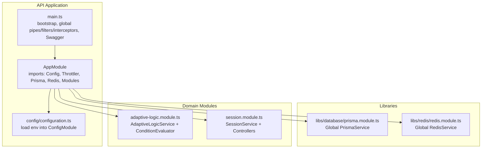
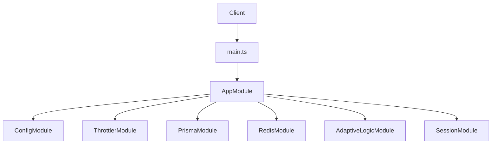
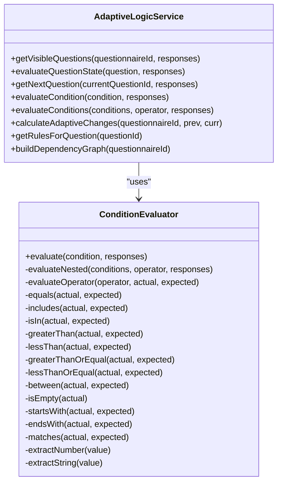
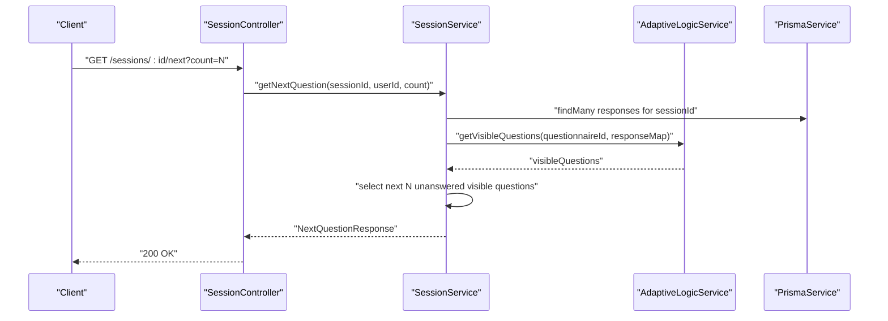
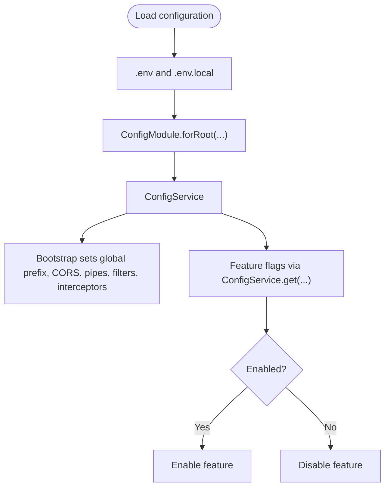
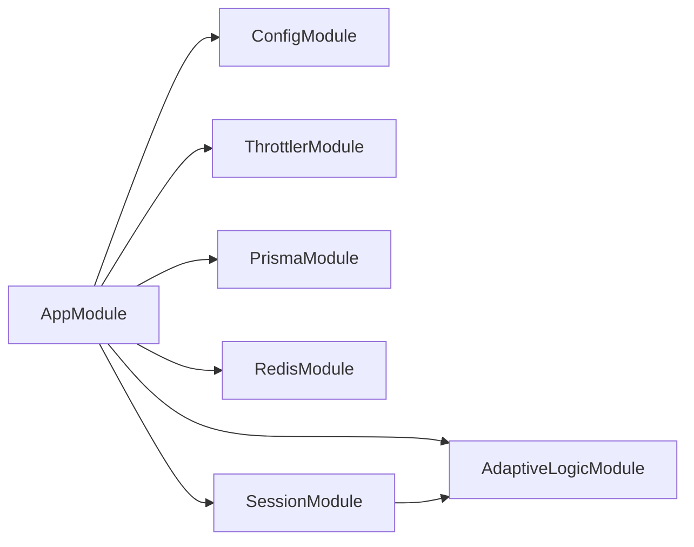

# System Customization

<cite>
**Referenced Files in This Document**
- [apps/api/src/app.module.ts](file://apps/api/src/app.module.ts)
- [apps/api/src/main.ts](file://apps/api/src/main.ts)
- [apps/api/src/config/configuration.ts](file://apps/api/src/config/configuration.ts)
- [libs/database/src/prisma.module.ts](file://libs/database/src/prisma.module.ts)
- [libs/redis/src/redis.module.ts](file://libs/redis/src/redis.module.ts)
- [apps/api/src/modules/adaptive-logic/adaptive-logic.module.ts](file://apps/api/src/modules/adaptive-logic/adaptive-logic.module.ts)
- [apps/api/src/modules/adaptive-logic/adaptive-logic.service.ts](file://apps/api/src/modules/adaptive-logic/adaptive-logic.service.ts)
- [apps/api/src/modules/adaptive-logic/types/rule.types.ts](file://apps/api/src/modules/adaptive-logic/types/rule.types.ts)
- [apps/api/src/modules/adaptive-logic/evaluators/condition.evaluator.ts](file://apps/api/src/modules/adaptive-logic/evaluators/condition.evaluator.ts)
- [apps/api/src/modules/adaptive-logic/evaluators/condition.evaluator.spec.ts](file://apps/api/src/modules/adaptive-logic/evaluators/condition.evaluator.spec.ts)
- [apps/api/src/modules/session/session.module.ts](file://apps/api/src/modules/session/session.module.ts)
- [apps/api/src/modules/session/session.service.ts](file://apps/api/src/modules/session/session.service.ts)
- [apps/api/src/modules/session/dto/create-session.dto.ts](file://apps/api/src/modules/session/dto/create-session.dto.ts)
- [apps/api/src/modules/session/dto/submit-response.dto.ts](file://apps/api/src/modules/session/dto/submit-response.dto.ts)
- [apps/api/src/modules/session/dto/continue-session.dto.ts](file://apps/api/src/modules/session/dto/continue-session.dto.ts)
</cite>

## Table of Contents
1. [Introduction](#introduction)
2. [Project Structure](#project-structure)
3. [Core Components](#core-components)
4. [Architecture Overview](#architecture-overview)
5. [Detailed Component Analysis](#detailed-component-analysis)
6. [Dependency Analysis](#dependency-analysis)
7. [Performance Considerations](#performance-considerations)
8. [Troubleshooting Guide](#troubleshooting-guide)
9. [Conclusion](#conclusion)
10. [Appendices](#appendices)

## Introduction
This document explains how to customize and extend the Adaptive Questionnaire System. It covers:
- Plugin development and modular architecture using the NestJS module system
- Configuration management patterns (environment-specific settings, feature flags, runtime updates)
- Dependency Injection and overriding/extending core services
- Extending the questionnaire engine with custom business rules
- Integrating third-party services
- Adapting the system for different industry contexts
- Build system customization with Turbo and deployment pipeline modifications
- Infrastructure adaptation for cloud environments
- Backward compatibility and migration strategies

## Project Structure
The system is organized as a NestJS monorepo with:
- An API application under apps/api
- Shared libraries under libs (database, redis, shared)
- Domain modules under apps/api/src/modules (adaptive-logic, session, questionnaire, auth, users, standards)
- Configuration and environment files at the repository root

**Diagram sources**
- [apps/api/src/app.module.ts](file://apps/api/src/app.module.ts#L1-L67)
- [apps/api/src/main.ts](file://apps/api/src/main.ts#L1-L93)
- [apps/api/src/config/configuration.ts](file://apps/api/src/config/configuration.ts#L1-L49)
- [libs/database/src/prisma.module.ts](file://libs/database/src/prisma.module.ts#L1-L10)
- [libs/redis/src/redis.module.ts](file://libs/redis/src/redis.module.ts#L1-L10)
- [apps/api/src/modules/adaptive-logic/adaptive-logic.module.ts](file://apps/api/src/modules/adaptive-logic/adaptive-logic.module.ts#L1-L12)
- [apps/api/src/modules/session/session.module.ts](file://apps/api/src/modules/session/session.module.ts#L1-L17)

**Section sources**
- [apps/api/src/app.module.ts](file://apps/api/src/app.module.ts#L1-L67)
- [apps/api/src/main.ts](file://apps/api/src/main.ts#L1-L93)
- [apps/api/src/config/configuration.ts](file://apps/api/src/config/configuration.ts#L1-L49)
- [libs/database/src/prisma.module.ts](file://libs/database/src/prisma.module.ts#L1-L10)
- [libs/redis/src/redis.module.ts](file://libs/redis/src/redis.module.ts#L1-L10)

## Core Components
- AppModule: Central orchestrator wiring ConfigModule, rate limiting, database, cache, and domain modules
- Bootstrap (main.ts): Applies global middleware, pipes, filters, interceptors, and Swagger in development
- Configuration loader: Reads environment variables and exposes them via ConfigService
- Libraries: Global modules exporting PrismaService and RedisService for DI
- Adaptive Logic: Evaluates visibility and branching rules for dynamic questionnaires
- Session: Manages questionnaire sessions, integrates adaptive logic, and validates responses

Key customization hooks:
- Add new modules to AppModule imports
- Extend AdaptiveLogicService or ConditionEvaluator for custom rule evaluation
- Override services via NestJS providers or module overrides
- Introduce new DTOs and controllers for domain extensions

**Section sources**
- [apps/api/src/app.module.ts](file://apps/api/src/app.module.ts#L16-L67)
- [apps/api/src/main.ts](file://apps/api/src/main.ts#L11-L86)
- [apps/api/src/config/configuration.ts](file://apps/api/src/config/configuration.ts#L1-L49)
- [libs/database/src/prisma.module.ts](file://libs/database/src/prisma.module.ts#L1-L10)
- [libs/redis/src/redis.module.ts](file://libs/redis/src/redis.module.ts#L1-L10)

## Architecture Overview
The system follows a layered, modular architecture:
- Entry point initializes NestJS, applies global middleware, and registers domain modules
- Domain modules encapsulate business capabilities (adaptive logic, sessions)
- Libraries provide cross-cutting concerns (persistence, caching)
- Configuration is centralized and environment-aware

**Diagram sources**
- [apps/api/src/main.ts](file://apps/api/src/main.ts#L11-L86)
- [apps/api/src/app.module.ts](file://apps/api/src/app.module.ts#L16-L67)
- [libs/database/src/prisma.module.ts](file://libs/database/src/prisma.module.ts#L1-L10)
- [libs/redis/src/redis.module.ts](file://libs/redis/src/redis.module.ts#L1-L10)
- [apps/api/src/modules/adaptive-logic/adaptive-logic.module.ts](file://apps/api/src/modules/adaptive-logic/adaptive-logic.module.ts#L1-L12)
- [apps/api/src/modules/session/session.module.ts](file://apps/api/src/modules/session/session.module.ts#L1-L17)

## Detailed Component Analysis

### Adaptive Logic Engine
The adaptive engine evaluates visibility and branching rules to dynamically show/hide questions and adjust required fields. It consists of:
- AdaptiveLogicService: Orchestrates rule retrieval, evaluation, and dependency graph building
- ConditionEvaluator: Implements operator-based evaluation supporting nested conditions
- Types: Define rule structures, operators, and evaluation results

**Diagram sources**
- [apps/api/src/modules/adaptive-logic/adaptive-logic.service.ts](file://apps/api/src/modules/adaptive-logic/adaptive-logic.service.ts#L19-L307)
- [apps/api/src/modules/adaptive-logic/evaluators/condition.evaluator.ts](file://apps/api/src/modules/adaptive-logic/evaluators/condition.evaluator.ts#L1-L402)

**Section sources**
- [apps/api/src/modules/adaptive-logic/adaptive-logic.service.ts](file://apps/api/src/modules/adaptive-logic/adaptive-logic.service.ts#L1-L307)
- [apps/api/src/modules/adaptive-logic/evaluators/condition.evaluator.ts](file://apps/api/src/modules/adaptive-logic/evaluators/condition.evaluator.ts#L1-L402)
- [apps/api/src/modules/adaptive-logic/types/rule.types.ts](file://apps/api/src/modules/adaptive-logic/types/rule.types.ts#L1-L120)

### Session Management and Integration with Adaptive Logic
SessionService coordinates questionnaire sessions, integrates adaptive logic for visibility and branching, and validates responses. It:
- Creates sessions and tracks progress
- Retrieves next questions respecting adaptive visibility
- Submits responses, recalculates adaptive changes, and updates progress
- Continues sessions with adaptive-aware question selection

**Diagram sources**
- [apps/api/src/modules/session/session.service.ts](file://apps/api/src/modules/session/session.service.ts#L198-L268)
- [apps/api/src/modules/adaptive-logic/adaptive-logic.service.ts](file://apps/api/src/modules/adaptive-logic/adaptive-logic.service.ts#L31-L66)

**Section sources**
- [apps/api/src/modules/session/session.service.ts](file://apps/api/src/modules/session/session.service.ts#L1-L684)
- [apps/api/src/modules/session/session.module.ts](file://apps/api/src/modules/session/session.module.ts#L1-L17)

### Configuration Management Patterns
Configuration is loaded globally via ConfigModule and exposed through ConfigService:
- Environment-specific settings: DATABASE_URL, REDIS_HOST/PORT/PASSWORD, JWT secrets, CORS origin, logging level
- Feature flags and runtime toggles: Use ConfigService to gate features at startup or runtime
- Runtime configuration updates: For static values loaded at startup, restart the process; for dynamic flags, introduce a dedicated feature flag service backed by cache/database

**Diagram sources**
- [apps/api/src/app.module.ts](file://apps/api/src/app.module.ts#L19-L23)
- [apps/api/src/config/configuration.ts](file://apps/api/src/config/configuration.ts#L1-L49)
- [apps/api/src/main.ts](file://apps/api/src/main.ts#L15-L49)

**Section sources**
- [apps/api/src/app.module.ts](file://apps/api/src/app.module.ts#L19-L23)
- [apps/api/src/config/configuration.ts](file://apps/api/src/config/configuration.ts#L1-L49)
- [apps/api/src/main.ts](file://apps/api/src/main.ts#L15-L49)

### Dependency Injection and Overriding Core Services
NestJS DI enables overriding or extending services:
- Register a provider with the same token to replace a core service
- Use forwardRef for circular dependencies (e.g., SessionService depends on AdaptiveLogicService)
- Export/import services to control availability across modules

Guidelines:
- Prefer composition over inheritance; wrap core services in custom implementations
- Use interfaces or tokens to decouple consumers from implementations
- Keep overrides minimal and well-tested

**Section sources**
- [apps/api/src/modules/session/session.service.ts](file://apps/api/src/modules/session/session.service.ts#L87-L94)
- [apps/api/src/modules/session/session.module.ts](file://apps/api/src/modules/session/session.module.ts#L1-L17)
- [apps/api/src/app.module.ts](file://apps/api/src/app.module.ts#L59-L64)

### Extending the Questionnaire Engine with Custom Business Rules
To add custom business rules:
- Define new operators or actions in rule types and extend ConditionEvaluator
- Add new rule evaluation logic in AdaptiveLogicService
- Wire new evaluation steps while preserving existing behavior
- Ensure backward compatibility by defaulting to existing actions

Validation and testing:
- Leverage existing tests as templates for new operators/actions
- Add unit tests for complex nested conditions and edge cases

**Section sources**
- [apps/api/src/modules/adaptive-logic/types/rule.types.ts](file://apps/api/src/modules/adaptive-logic/types/rule.types.ts#L1-L120)
- [apps/api/src/modules/adaptive-logic/evaluators/condition.evaluator.ts](file://apps/api/src/modules/adaptive-logic/evaluators/condition.evaluator.ts#L1-L402)
- [apps/api/src/modules/adaptive-logic/adaptive-logic.service.ts](file://apps/api/src/modules/adaptive-logic/adaptive-logic.service.ts#L71-L153)
- [apps/api/src/modules/adaptive-logic/evaluators/condition.evaluator.spec.ts](file://apps/api/src/modules/adaptive-logic/evaluators/condition.evaluator.spec.ts#L1-L358)

### Integrating Third-Party Services
Common integrations:
- Authentication: Use AuthModule and guards; integrate external identity providers via strategies
- Caching: Use RedisModule for session state, caching, and rate limiting
- Persistence: Use PrismaModule for database operations
- Monitoring and observability: Add interceptors and metrics around AdaptiveLogicService and SessionService calls

Implementation tips:
- Wrap third-party clients in dedicated services and inject them via modules
- Use ConfigService to configure endpoints, keys, and timeouts
- Apply guards and interceptors to enforce policies and track usage

**Section sources**
- [apps/api/src/app.module.ts](file://apps/api/src/app.module.ts#L7-L12)
- [libs/database/src/prisma.module.ts](file://libs/database/src/prisma.module.ts#L1-L10)
- [libs/redis/src/redis.module.ts](file://libs/redis/src/redis.module.ts#L1-L10)

### Adapting for Different Industry Requirements
Industries can influence adaptive behavior:
- Pass industry context in CreateSessionDto and propagate to adaptive logic
- Introduce industry-specific rule sets or weights
- Customize validation rules per industry

Example:
- Use industry field to filter or weight visibility rules during evaluation

**Section sources**
- [apps/api/src/modules/session/dto/create-session.dto.ts](file://apps/api/src/modules/session/dto/create-session.dto.ts#L1-L15)
- [apps/api/src/modules/adaptive-logic/adaptive-logic.service.ts](file://apps/api/src/modules/adaptive-logic/adaptive-logic.service.ts#L31-L66)

### Build System Customization Using Turbo
Turbo can orchestrate builds, tests, lint, and type-checking across apps and libs. To customize:
- Define tasks in turbo.json for your CI/CD needs
- Add caching strategies for repeated work
- Parallelize tasks across packages

Deployment pipeline modifications:
- Use Azure Pipelines YAML to define stages for build, test, package, and deploy
- Parameterize environment variables per stage
- Integrate Terraform for infrastructure provisioning

Infrastructure adaptation:
- Use Terraform modules for databases, caches, registries, and networking
- Externalize secrets via Key Vault or environment variables
- Scale horizontally using containerized deployments

[No sources needed since this section provides general guidance]

## Dependency Analysis
The system exhibits low coupling and high cohesion:
- AppModule aggregates domain modules and infrastructure
- Libraries export singleton services for DI
- AdaptiveLogicModule depends on SessionModule via forwardRef
- SessionModule depends on QuestionnaireService and AdaptiveLogicService

**Diagram sources**
- [apps/api/src/app.module.ts](file://apps/api/src/app.module.ts#L16-L67)
- [apps/api/src/modules/adaptive-logic/adaptive-logic.module.ts](file://apps/api/src/modules/adaptive-logic/adaptive-logic.module.ts#L1-L12)
- [apps/api/src/modules/session/session.module.ts](file://apps/api/src/modules/session/session.module.ts#L1-L17)

**Section sources**
- [apps/api/src/app.module.ts](file://apps/api/src/app.module.ts#L16-L67)
- [apps/api/src/modules/adaptive-logic/adaptive-logic.module.ts](file://apps/api/src/modules/adaptive-logic/adaptive-logic.module.ts#L1-L12)
- [apps/api/src/modules/session/session.module.ts](file://apps/api/src/modules/session/session.module.ts#L1-L17)

## Performance Considerations
- Adaptive evaluation complexity: Sorting and evaluating rules scales with the number of rules per question; consider indexing and caching frequently accessed rule sets
- Database queries: Batch reads for responses and leverage Prisma’s connection pooling
- Caching: Use RedisModule for session state and computed visibility sets
- Validation: Keep validation logic efficient; avoid heavy computations in hot paths
- Rate limiting: Configure throttler profiles per endpoint category

[No sources needed since this section provides general guidance]

## Troubleshooting Guide
Common issues and resolutions:
- Configuration not loading: Verify env files and ConfigModule.forRoot options
- Circular dependencies: Use forwardRef when injecting services across modules
- Validation failures: Inspect DTOs and validation rules in SessionService
- Adaptive logic anomalies: Review rule priorities and operator combinations; add targeted unit tests

**Section sources**
- [apps/api/src/main.ts](file://apps/api/src/main.ts#L15-L49)
- [apps/api/src/modules/session/session.service.ts](file://apps/api/src/modules/session/session.service.ts#L622-L659)
- [apps/api/src/modules/adaptive-logic/evaluators/condition.evaluator.spec.ts](file://apps/api/src/modules/adaptive-logic/evaluators/condition.evaluator.spec.ts#L1-L358)

## Conclusion
The system’s modular architecture, centralized configuration, and robust DI framework provide a strong foundation for customization. By extending the adaptive logic engine, integrating third-party services, and adapting to industry requirements, teams can tailor the questionnaire experience while maintaining backward compatibility and operational reliability.

[No sources needed since this section summarizes without analyzing specific files]

## Appendices

### A. Creating a Custom Plugin (NestJS Module)
Steps:
- Create a new module under apps/api/src/modules/<your-module>
- Implement a service with Injectable decorator
- Register the module in AppModule imports
- Export the service for consumption by other modules

References:
- [apps/api/src/app.module.ts](file://apps/api/src/app.module.ts#L50-L57)
- [apps/api/src/modules/adaptive-logic/adaptive-logic.module.ts](file://apps/api/src/modules/adaptive-logic/adaptive-logic.module.ts#L1-L12)

### B. Overriding or Extending Core Services
- Provide a replacement service with the same token
- Use forwardRef for circular dependencies
- Keep overrides minimal and test thoroughly

References:
- [apps/api/src/modules/session/session.service.ts](file://apps/api/src/modules/session/session.service.ts#L87-L94)
- [apps/api/src/app.module.ts](file://apps/api/src/app.module.ts#L59-L64)

### C. Configuration Management Checklist
- Define environment variables per environment
- Load via ConfigModule.forRoot with envFilePath
- Access via ConfigService in bootstrap and services
- Use feature flags for gradual rollouts

References:
- [apps/api/src/config/configuration.ts](file://apps/api/src/config/configuration.ts#L1-L49)
- [apps/api/src/main.ts](file://apps/api/src/main.ts#L15-L18)

### D. Runtime Configuration Updates
- Static values: Restart after updating env files
- Dynamic flags: Introduce a dedicated feature flag service backed by Redis/DB

[No sources needed since this section provides general guidance]

### E. Backward Compatibility and Migration Strategies
- Version APIs and keep old endpoints during transition
- Use feature flags to toggle new behavior
- Maintain stable DTOs and error responses
- Provide deprecation notices and migration guides

[No sources needed since this section provides general guidance]