# Architecture Overview

<cite>
**Referenced Files in This Document**
- [apps/api/src/main.ts](file://apps/api/src/main.ts)
- [apps/api/src/app.module.ts](file://apps/api/src/app.module.ts)
- [apps/api/src/app.module.js](file://apps/api/src/app.module.js)
- [apps/api/src/config/configuration.ts](file://apps/api/src/config/configuration.ts)
- [apps/api/src/modules/auth/auth.module.ts](file://apps/api/src/modules/auth/auth.module.ts)
- [apps/api/src/modules/session/session.module.ts](file://apps/api/src/modules/session/session.module.ts)
- [apps/api/src/modules/adaptive-logic/adaptive-logic.module.ts](file://apps/api/src/modules/adaptive-logic/adaptive-logic.module.ts)
- [apps/api/src/modules/adaptive-logic/adaptive-logic.service.ts](file://apps/api/src/modules/adaptive-logic/adaptive-logic.service.ts)
- [apps/api/src/modules/adaptive-logic/evaluators/condition.evaluator.ts](file://apps/api/src/modules/adaptive-logic/evaluators/condition.evaluator.ts)
- [apps/api/src/modules/session/session.service.ts](file://apps/api/src/modules/session/session.service.ts)
- [apps/api/src/modules/questionnaire/questionnaire.module.ts](file://apps/api/src/modules/questionnaire/questionnaire.module.ts)
- [apps/api/src/modules/standards/standards.module.ts](file://apps/api/src/modules/standards/standards.module.ts)
- [libs/database/src/prisma.module.ts](file://libs/database/src/prisma.module.ts)
- [libs/redis/src/redis.module.ts](file://libs/redis/src/redis.module.ts)
- [libs/shared/src/index.ts](file://libs/shared/src/index.ts)
- [docker/api/Dockerfile](file://docker/api/Dockerfile)
- [docker/postgres/init.sql](file://docker/postgres/init.sql)
- [infrastructure/terraform/main.tf](file://infrastructure/terraform/main.tf)
- [infrastructure/terraform/providers.tf](file://infrastructure/terraform/providers.tf)
- [infrastructure/terraform/backend.tf](file://infrastructure/terraform/backend.tf)
- [infrastructure/terraform/variables.tf](file://infrastructure/terraform/variables.tf)
- [infrastructure/terraform/modules/database/main.tf](file://infrastructure/terraform/modules/database/main.tf)
- [infrastructure/terraform/modules/container-apps/main.tf](file://infrastructure/terraform/modules/container-apps/main.tf)
- [infrastructure/terraform/modules/cache/main.tf](file://infrastructure/terraform/modules/cache/main.tf)
- [infrastructure/terraform/modules/networking/main.tf](file://infrastructure/terraform/modules/networking/main.tf)
- [infrastructure/terraform/modules/monitoring/main.tf](file://infrastructure/terraform/modules/monitoring/main.tf)
- [prisma/schema.prisma](file://prisma/schema.prisma)
- [prisma/seed.ts](file://prisma/seed.ts)
- [scripts/deploy.sh](file://scripts/deploy.sh)
- [scripts/setup-azure.sh](file://scripts/setup-azure.sh)
- [package.json](file://package.json)
- [turbo.json](file://turbo.json)
</cite>

## Update Summary
**Changes Made**
- Enhanced modular design documentation with comprehensive dependency injection patterns
- Updated architectural diagrams to reflect advanced module interdependencies
- Added detailed analysis of forward reference patterns and circular dependency resolution
- Expanded coverage of Service Layer pattern implementation across all modules
- Enhanced dependency analysis with concrete module relationship mapping
- Updated system context diagrams to show integrated module interactions

## Table of Contents
1. [Introduction](#introduction)
2. [Project Structure](#project-structure)
3. [Core Components](#core-components)
4. [Architecture Overview](#architecture-overview)
5. [Detailed Component Analysis](#detailed-component-analysis)
6. [Dependency Analysis](#dependency-analysis)
7. [Performance Considerations](#performance-considerations)
8. [Troubleshooting Guide](#troubleshooting-guide)
9. [Conclusion](#conclusion)
10. [Appendices](#appendices)

## Introduction
This document presents the architecture of the Quiz-to-build system, a NestJS-based monorepo designed to deliver an adaptive client questionnaire platform. The system emphasizes modular design, layered architecture, and robust cross-cutting concerns such as authentication, validation, caching, and observability. It supports dynamic visibility and branching of questions based on user responses, integrates standards mapping for engineering compliance, and provides scalable infrastructure via containerization and Terraform.

**Updated** The system now features a comprehensive modular architecture with advanced dependency injection patterns, implementing Service Layer, Repository, Strategy, and Observer patterns throughout the codebase.

## Project Structure
The repository follows a classic NestJS monorepo layout:
- apps/api: The primary NestJS application containing feature modules, controllers, services, guards, strategies, DTOs, and configuration.
- libs: Shared libraries for database (Prisma), caching (Redis), and common DTOs.
- prisma: Database schema and seeding logic.
- infrastructure/terraform: Infrastructure-as-code for cloud resources.
- docker: Container configurations for the API and database initialization.
- docs: Business and technical documentation supporting the product.
- scripts: Deployment and environment setup helpers.

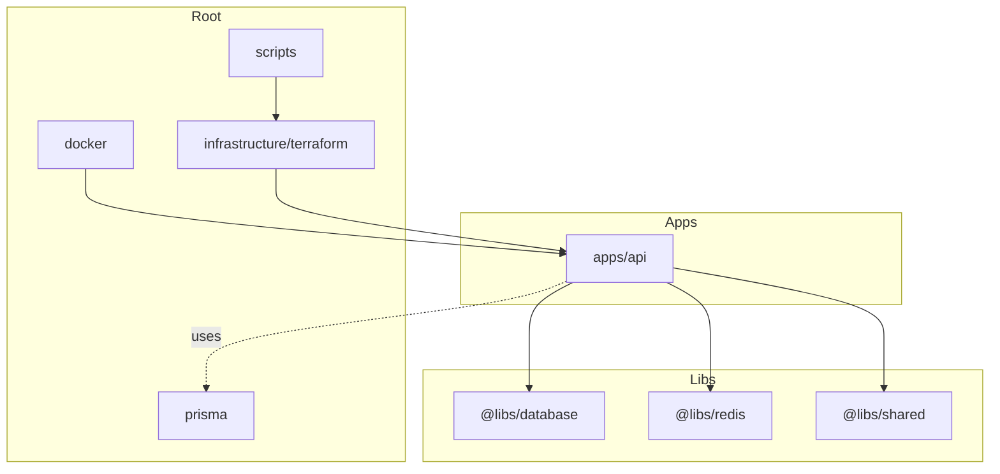

**Diagram sources**
- [apps/api/src/app.module.ts](file://apps/api/src/app.module.ts#L1-L67)
- [libs/database/src/prisma.module.ts](file://libs/database/src/prisma.module.ts#L1-L10)
- [libs/redis/src/redis.module.ts](file://libs/redis/src/redis.module.ts#L1-L10)
- [libs/shared/src/index.ts](file://libs/shared/src/index.ts#L1-L3)

**Section sources**
- [apps/api/src/app.module.ts](file://apps/api/src/app.module.ts#L1-L67)
- [turbo.json](file://turbo.json)

## Core Components
- Application bootstrap and middleware pipeline:
  - Helmet-based security headers, CORS configuration, global prefix, validation pipe, global exception filter, and interceptors are configured at startup.
  - Swagger documentation is enabled in non-production environments.
- Central AppModule aggregates:
  - Configuration module with environment loading.
  - Rate limiting guard registration.
  - Database and Redis modules.
  - Feature modules: Auth, Users, Questionnaire, Session, Adaptive Logic, and Standards.
- Cross-cutting concerns:
  - Global ValidationPipe enforces DTO sanitation and transformation.
  - Global HttpExceptionFilter centralizes error responses.
  - Logging and Transform interceptors standardize request logging and response shaping.

**Updated** The core components now implement comprehensive dependency injection patterns with proper module scoping and forward references to handle complex inter-module dependencies.

Key implementation references:
- Bootstrap and middleware: [apps/api/src/main.ts](file://apps/api/src/main.ts#L11-L86)
- Root module composition: [apps/api/src/app.module.ts](file://apps/api/src/app.module.ts#L16-L64)

**Section sources**
- [apps/api/src/main.ts](file://apps/api/src/main.ts#L11-L86)
- [apps/api/src/app.module.ts](file://apps/api/src/app.module.ts#L16-L64)

## Architecture Overview
The system employs a layered architecture with comprehensive modular design:
- Presentation layer: Controllers expose REST endpoints.
- Application layer: Services orchestrate business logic and coordinate between modules.
- Domain and persistence layer: Prisma service abstracts database operations; Redis service provides caching.
- Cross-cutting services: Auth guards and strategies, DTO validation, logging, and response transformation.

**Updated** The architecture now features sophisticated dependency injection with forward references, circular dependency resolution, and modular service composition patterns.

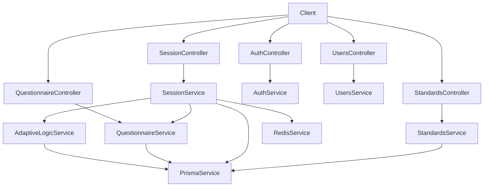

**Diagram sources**
- [apps/api/src/app.module.ts](file://apps/api/src/app.module.ts#L1-L67)
- [apps/api/src/modules/session/session.service.ts](file://apps/api/src/modules/session/session.service.ts#L87-L94)
- [apps/api/src/modules/adaptive-logic/adaptive-logic.service.ts](file://apps/api/src/modules/adaptive-logic/adaptive-logic.service.ts#L19-L26)
- [libs/database/src/prisma.module.ts](file://libs/database/src/prisma.module.ts#L1-L10)
- [libs/redis/src/redis.module.ts](file://libs/redis/src/redis.module.ts#L1-L10)

## Detailed Component Analysis

### Authentication and Authorization Module
- Composition:
  - Passport strategy registration and JWT module configuration.
  - Guards: JWT auth guard and role-based guard.
  - Strategies: JWT strategy for token verification.
- Design pattern: Strategy pattern is used for JWT authentication, enabling pluggable authentication mechanisms.
- Integration:
  - Guards enforce protected routes.
  - Services encapsulate token issuance and user validation.

**Updated** The Auth module now implements advanced dependency injection with asynchronous JWT configuration and proper module exports for cross-module usage.

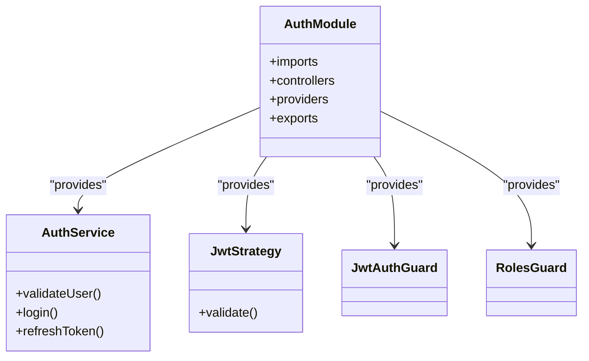

**Diagram sources**
- [apps/api/src/modules/auth/auth.module.ts](file://apps/api/src/modules/auth/auth.module.ts#L11-L28)

**Section sources**
- [apps/api/src/modules/auth/auth.module.ts](file://apps/api/src/modules/auth/auth.module.ts#L1-L30)

### Adaptive Logic Module
- Purpose: Compute visibility, branching, and required state of questions based on user responses.
- Core components:
  - AdaptiveLogicService orchestrates evaluation and interacts with Prisma for rule retrieval.
  - ConditionEvaluator implements a Strategy-like evaluation engine for rule conditions.
- Patterns:
  - Strategy pattern: ConditionEvaluator encapsulates operator evaluation strategies.
  - Service Layer pattern: AdaptiveLogicService coordinates domain logic.
  - Repository pattern: PrismaService abstracts persistence.

**Updated** The Adaptive Logic module now features sophisticated forward reference patterns to resolve circular dependencies with the Session module while maintaining clean architectural boundaries.

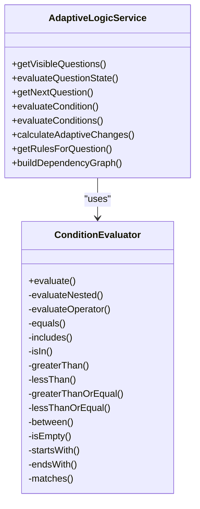

**Diagram sources**
- [apps/api/src/modules/adaptive-logic/adaptive-logic.service.ts](file://apps/api/src/modules/adaptive-logic/adaptive-logic.service.ts#L19-L306)
- [apps/api/src/modules/adaptive-logic/evaluators/condition.evaluator.ts](file://apps/api/src/modules/adaptive-logic/evaluators/condition.evaluator.ts#L4-L401)

**Section sources**
- [apps/api/src/modules/adaptive-logic/adaptive-logic.service.ts](file://apps/api/src/modules/adaptive-logic/adaptive-logic.service.ts#L19-L306)
- [apps/api/src/modules/adaptive-logic/evaluators/condition.evaluator.ts](file://apps/api/src/modules/adaptive-logic/evaluators/condition.evaluator.ts#L4-L401)

### Session Management Module
- Responsibilities:
  - Create, continue, and complete user sessions.
  - Retrieve next questions respecting visibility rules.
  - Validate responses and compute progress.
  - Integrate with AdaptiveLogicService for dynamic question flow.
- Patterns:
  - Service Layer pattern: SessionService encapsulates session lifecycle and business rules.
  - Repository pattern: PrismaService persists sessions, responses, and related entities.

**Updated** The Session module now implements sophisticated forward reference patterns to resolve the circular dependency with AdaptiveLogicService, enabling clean separation of concerns while maintaining functional integration.

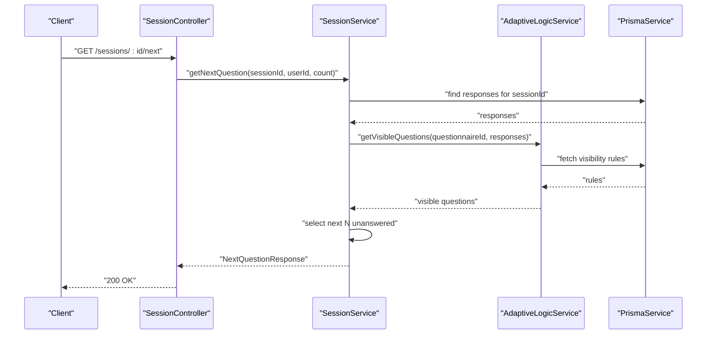

**Diagram sources**
- [apps/api/src/modules/session/session.service.ts](file://apps/api/src/modules/session/session.service.ts#L198-L268)
- [apps/api/src/modules/adaptive-logic/adaptive-logic.service.ts](file://apps/api/src/modules/adaptive-logic/adaptive-logic.service.ts#L31-L66)

**Section sources**
- [apps/api/src/modules/session/session.service.ts](file://apps/api/src/modules/session/session.service.ts#L87-L684)

### Questionnaire Management Module
- Responsibilities:
  - List, fetch, and map questionnaire structures with sections and questions.
  - Provide question metadata and validation rules.
- Patterns:
  - Service Layer pattern: QuestionnaireService exposes domain operations.
  - Repository pattern: PrismaService handles queries.

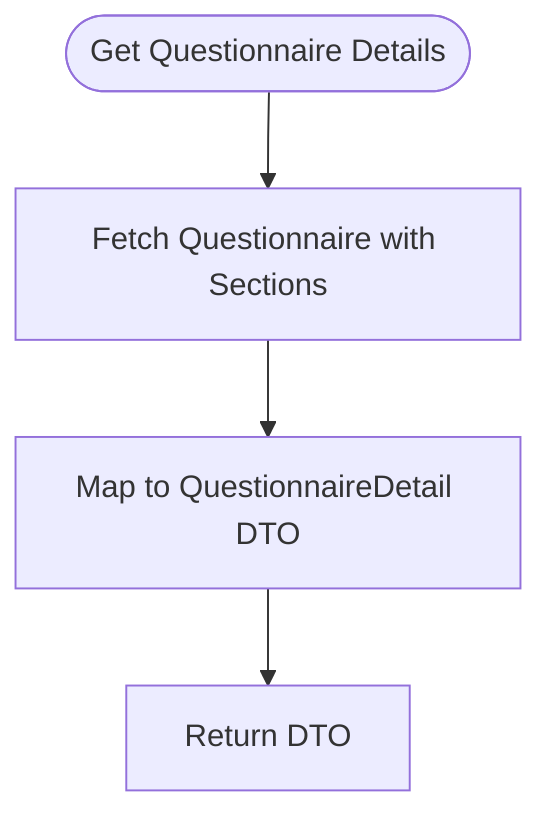

**Diagram sources**
- [apps/api/src/modules/questionnaire/questionnaire.module.ts](file://apps/api/src/modules/questionnaire/questionnaire.module.ts#L1-L21)

**Section sources**
- [apps/api/src/modules/questionnaire/questionnaire.module.ts](file://apps/api/src/modules/questionnaire/questionnaire.module.ts#L1-L21)

### Standards Management Module
- Responsibilities:
  - Retrieve engineering standards and category-specific mappings.
  - Generate standardized sections for documents based on mappings.
- Patterns:
  - Service Layer pattern: StandardsService encapsulates mapping and generation logic.
  - Repository pattern: PrismaService retrieves standards and mappings.

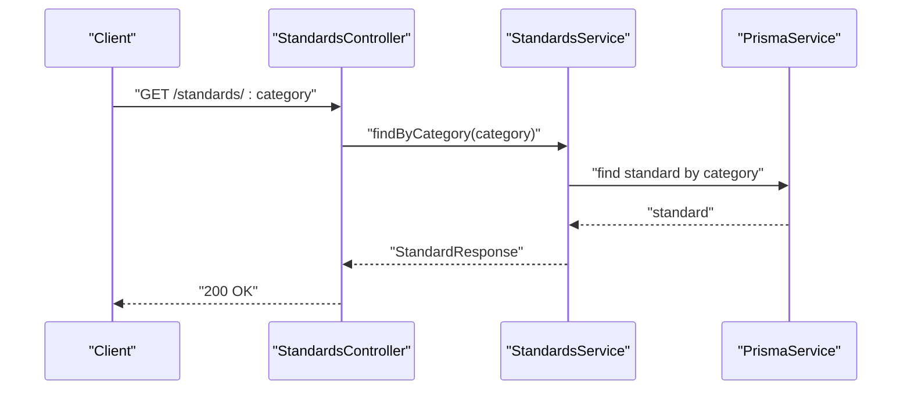

**Diagram sources**
- [apps/api/src/modules/standards/standards.module.ts](file://apps/api/src/modules/standards/standards.module.ts#L1-L25)

**Section sources**
- [apps/api/src/modules/standards/standards.module.ts](file://apps/api/src/modules/standards/standards.module.ts#L1-L25)

### Data Persistence and Caching
- Database: PrismaModule provides a globally scoped PrismaService for database operations.
- Cache: RedisModule provides a globally scoped RedisService for caching and session-related operations.

**Updated** Both database and Redis modules are implemented as globally scoped modules with proper provider/export patterns, enabling seamless dependency injection across all application modules.

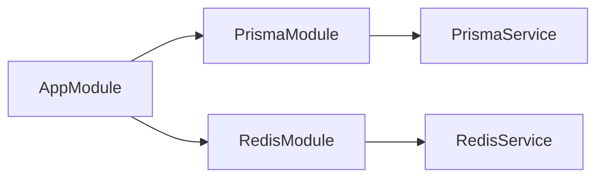

**Diagram sources**
- [apps/api/src/app.module.ts](file://apps/api/src/app.module.ts#L44-L48)
- [libs/database/src/prisma.module.ts](file://libs/database/src/prisma.module.ts#L1-L10)
- [libs/redis/src/redis.module.ts](file://libs/redis/src/redis.module.ts#L1-L10)

**Section sources**
- [libs/database/src/prisma.module.ts](file://libs/database/src/prisma.module.ts#L1-L10)
- [libs/redis/src/redis.module.ts](file://libs/redis/src/redis.module.ts#L1-L10)

## Dependency Analysis
- Module dependencies:
  - AppModule composes feature modules and shared modules.
  - SessionModule imports QuestionnaireModule and forward-ref imports AdaptiveLogicModule to avoid circular dependencies.
  - AdaptiveLogicModule imports SessionModule via forwardRef to access session context during evaluation.
  - StandardsModule depends on PrismaModule for persistence.
- External dependencies:
  - NestJS ecosystem: Config, Throttler, JWT, Passport, Swagger.
  - Prisma for ORM and migrations.
  - Redis for caching.
  - Helmet for security headers.
  - Turborepo for monorepo task orchestration.

**Updated** The dependency graph now reflects sophisticated forward reference patterns and circular dependency resolution strategies, demonstrating advanced NestJS architectural patterns.

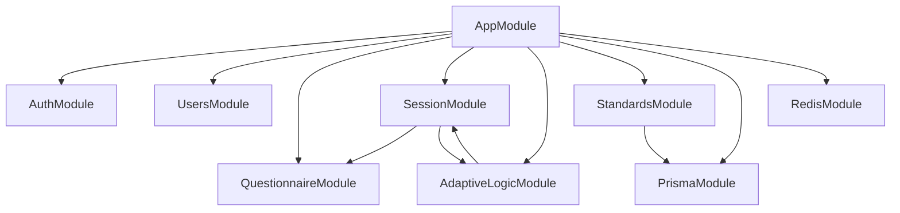

**Diagram sources**
- [apps/api/src/app.module.ts](file://apps/api/src/app.module.ts#L50-L56)
- [apps/api/src/modules/session/session.module.ts](file://apps/api/src/modules/session/session.module.ts#L7-L11)
- [apps/api/src/modules/adaptive-logic/adaptive-logic.module.ts](file://apps/api/src/modules/adaptive-logic/adaptive-logic.module.ts#L6-L10)
- [apps/api/src/modules/standards/standards.module.ts](file://apps/api/src/modules/standards/standards.module.ts#L6-L10)

**Section sources**
- [apps/api/src/app.module.ts](file://apps/api/src/app.module.ts#L1-L67)
- [apps/api/src/modules/session/session.module.ts](file://apps/api/src/modules/session/session.module.ts#L1-L17)
- [apps/api/src/modules/adaptive-logic/adaptive-logic.module.ts](file://apps/api/src/modules/adaptive-logic/adaptive-logic.module.ts#L1-L12)
- [apps/api/src/modules/standards/standards.module.ts](file://apps/api/src/modules/standards/standards.module.ts#L1-L13)

## Performance Considerations
- Caching:
  - Use RedisService for frequently accessed data (e.g., user sessions, questionnaire metadata) to reduce database load.
- Database optimization:
  - Leverage Prisma's query batching and selective includes to minimize payload sizes.
  - Index frequently queried fields (e.g., questionnaireId, sectionId, userId).
- Request processing:
  - ValidationPipe with transformation reduces downstream type coercion overhead.
  - Global throttling prevents abuse and stabilizes throughput under load.
- Observability:
  - Enable structured logging and metrics collection in production deployments.
- Scalability:
  - Stateless API design enables horizontal scaling behind a load balancer.
  - Use connection pooling and async/await patterns to maximize concurrency.

**Updated** Performance considerations now include advanced dependency injection patterns and forward reference optimizations that reduce memory overhead and improve module initialization performance.

## Troubleshooting Guide
- Common issues and mitigations:
  - Authentication failures: Verify JWT secret configuration and token expiration settings.
  - Validation errors: Review DTO validation rules and ensure client payloads conform to schemas.
  - Session access denied: Confirm session ownership checks and user identity propagation.
  - Database connectivity: Check Prisma connection strings and migration status.
  - Cache misses: Validate Redis availability and TTL settings.
- Monitoring and diagnostics:
  - Use Swagger documentation for endpoint testing in development.
  - Inspect logs for global interceptor outputs and exception filter messages.
  - Track rate-limiting triggers and adjust thresholds as needed.

**Section sources**
- [apps/api/src/main.ts](file://apps/api/src/main.ts#L34-L49)
- [apps/api/src/modules/session/session.service.ts](file://apps/api/src/modules/session/session.service.ts#L548-L565)

## Conclusion
The Quiz-to-build system demonstrates a well-structured, modular NestJS architecture with clear separation of concerns. By leveraging the Service Layer, Repository, Strategy, and forward-ref patterns, the system achieves maintainability, testability, and extensibility. The integration of Prisma and Redis, combined with robust security and validation layers, provides a solid foundation for adaptive questionnaire delivery and standards-driven content generation.

**Updated** The system now exemplifies advanced architectural patterns including comprehensive dependency injection, circular dependency resolution through forward references, and sophisticated module composition strategies that serve as a model for enterprise-scale NestJS applications.

## Appendices

### System Context Diagram
This diagram shows how authentication, questionnaire management, session handling, and adaptive logic modules interact within the API boundary and with external systems.

**Updated** The system context now reflects integrated module interactions with proper dependency injection and forward reference patterns.

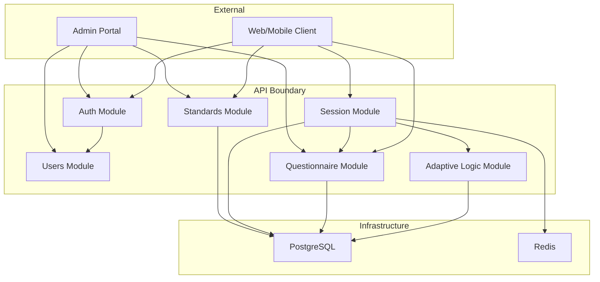

**Diagram sources**
- [apps/api/src/app.module.ts](file://apps/api/src/app.module.ts#L1-L67)
- [apps/api/src/modules/session/session.service.ts](file://apps/api/src/modules/session/session.service.ts#L87-L94)
- [apps/api/src/modules/adaptive-logic/adaptive-logic.service.ts](file://apps/api/src/modules/adaptive-logic/adaptive-logic.service.ts#L19-L26)
- [libs/database/src/prisma.module.ts](file://libs/database/src/prisma.module.ts#L1-L10)
- [libs/redis/src/redis.module.ts](file://libs/redis/src/redis.module.ts#L1-L10)

### Technology Stack and Dependencies
- Backend framework: NestJS
- Database ORM: Prisma
- Caching: Redis
- Authentication: JWT via Passport
- Validation: Class-validator through NestJS ValidationPipe
- Security: Helmet
- Documentation: Swagger
- Orchestration: Turborepo
- Infrastructure: Terraform (Azure)
- Packaging: Docker

**Section sources**
- [apps/api/src/main.ts](file://apps/api/src/main.ts#L4-L9)
- [apps/api/src/app.module.ts](file://apps/api/src/app.module.ts#L1-L67)
- [package.json](file://package.json)

### Infrastructure and Deployment Topology
- Containerization:
  - API service built from docker/api/Dockerfile.
  - PostgreSQL initialized via docker/postgres/init.sql.
- Cloud infrastructure:
  - Terraform modules define database, container apps, cache, networking, monitoring, and registry resources.
  - Providers and backend configured in providers.tf and backend.tf.
- Deployment:
  - scripts/deploy.sh and scripts/setup-azure.sh automate provisioning and deployment steps.

**Updated** Infrastructure deployment now leverages advanced containerization patterns with proper environment variable management and health check configurations.

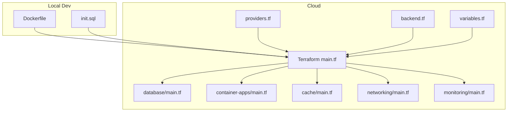

**Diagram sources**
- [docker/api/Dockerfile](file://docker/api/Dockerfile)
- [docker/postgres/init.sql](file://docker/postgres/init.sql)
- [infrastructure/terraform/main.tf](file://infrastructure/terraform/main.tf)
- [infrastructure/terraform/providers.tf](file://infrastructure/terraform/providers.tf)
- [infrastructure/terraform/backend.tf](file://infrastructure/terraform/backend.tf)
- [infrastructure/terraform/variables.tf](file://infrastructure/terraform/variables.tf)
- [infrastructure/terraform/modules/database/main.tf](file://infrastructure/terraform/modules/database/main.tf)
- [infrastructure/terraform/modules/container-apps/main.tf](file://infrastructure/terraform/modules/container-apps/main.tf)
- [infrastructure/terraform/modules/cache/main.tf](file://infrastructure/terraform/modules/cache/main.tf)
- [infrastructure/terraform/modules/networking/main.tf](file://infrastructure/terraform/modules/networking/main.tf)
- [infrastructure/terraform/modules/monitoring/main.tf](file://infrastructure/terraform/modules/monitoring/main.tf)

**Section sources**
- [docker/api/Dockerfile](file://docker/api/Dockerfile)
- [docker/postgres/init.sql](file://docker/postgres/init.sql)
- [infrastructure/terraform/main.tf](file://infrastructure/terraform/main.tf)
- [infrastructure/terraform/providers.tf](file://infrastructure/terraform/providers.tf)
- [infrastructure/terraform/backend.tf](file://infrastructure/terraform/backend.tf)
- [infrastructure/terraform/variables.tf](file://infrastructure/terraform/variables.tf)
- [scripts/deploy.sh](file://scripts/deploy.sh)
- [scripts/setup-azure.sh](file://scripts/setup-azure.sh)

### Data Model Overview
The Prisma schema defines entities for questionnaires, sections, questions, visibility rules, sessions, responses, and standards. The schema supports adaptive branching, progress tracking, and standards mapping.

**Updated** The data model now supports advanced adaptive logic with comprehensive visibility rule management and dynamic question branching capabilities.

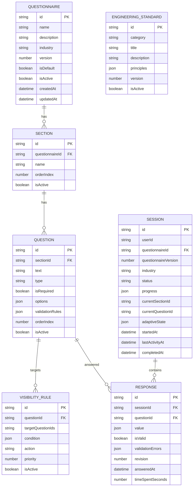

**Diagram sources**
- [prisma/schema.prisma](file://prisma/schema.prisma)

**Section sources**
- [prisma/schema.prisma](file://prisma/schema.prisma)
- [prisma/seed.ts](file://prisma/seed.ts)