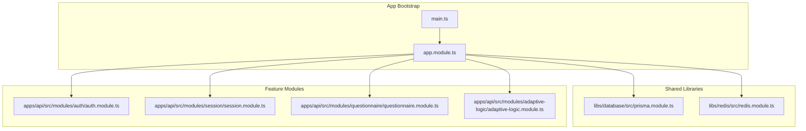
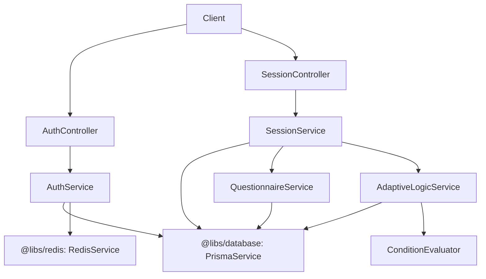
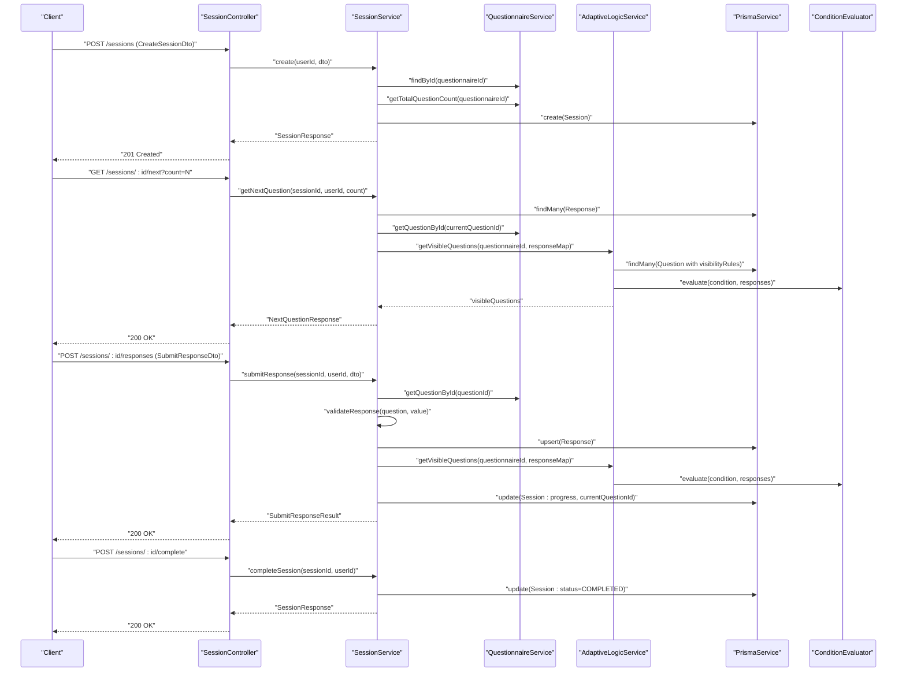
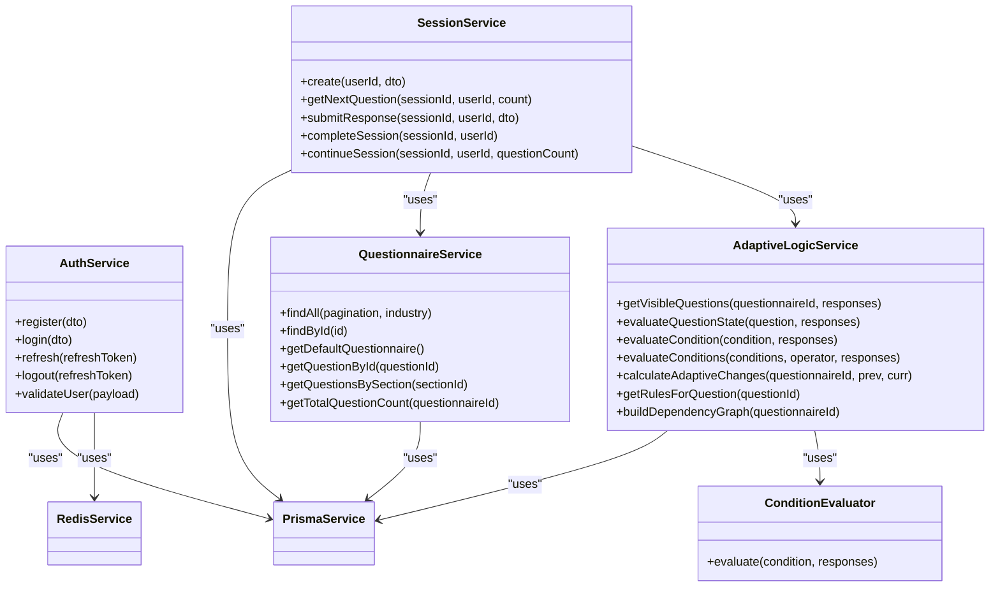
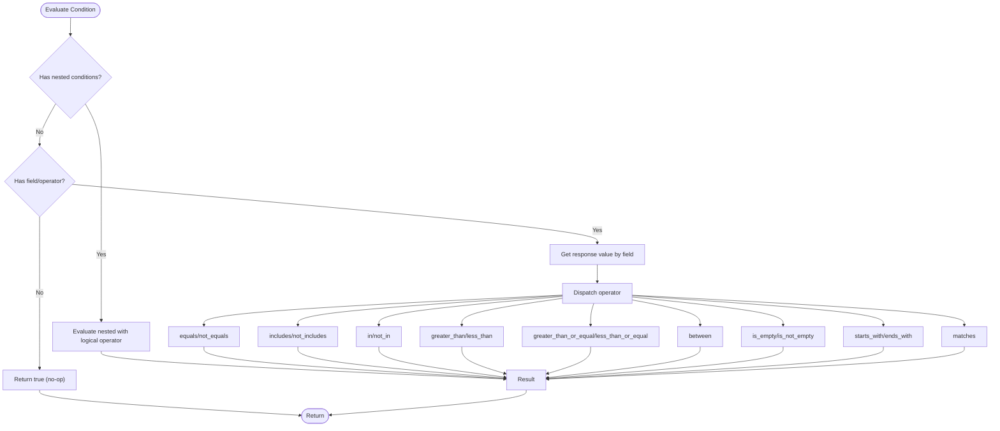
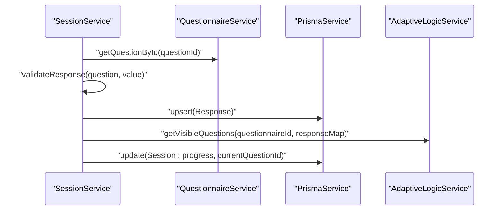
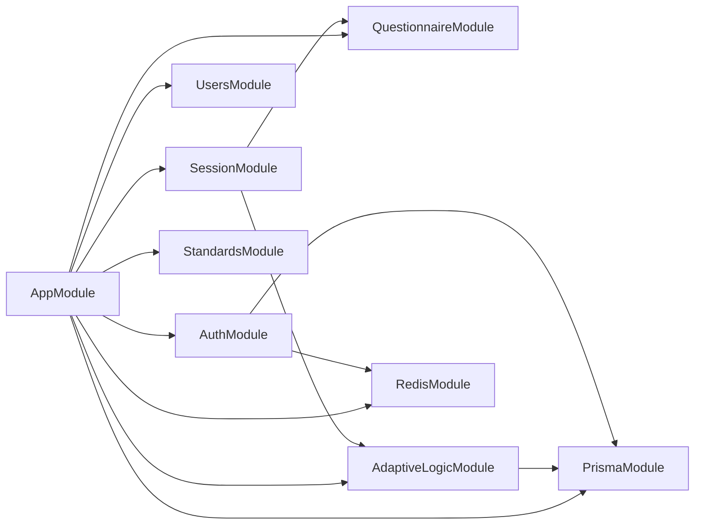

# Component Interactions

<cite>
**Referenced Files in This Document**
- [app.module.ts](file://apps/api/src/app.module.ts)
- [main.ts](file://apps/api/src/main.ts)
- [prisma.module.ts](file://libs/database/src/prisma.module.ts)
- [redis.module.ts](file://libs/redis/src/redis.module.ts)
- [auth.module.ts](file://apps/api/src/modules/auth/auth.module.ts)
- [auth.service.ts](file://apps/api/src/modules/auth/auth.service.ts)
- [auth.controller.ts](file://apps/api/src/modules/auth/auth.controller.ts)
- [jwt-auth.guard.ts](file://apps/api/src/modules/auth/guards/jwt-auth.guard.ts)
- [user.decorator.ts](file://apps/api/src/modules/auth/decorators/user.decorator.ts)
- [jwt.strategy.ts](file://apps/api/src/modules/auth/strategies/jwt.strategy.ts)
- [session.service.ts](file://apps/api/src/modules/session/session.service.ts)
- [questionnaire.service.ts](file://apps/api/src/modules/questionnaire/questionnaire.service.ts)
- [adaptive-logic.service.ts](file://apps/api/src/modules/adaptive-logic/adaptive-logic.service.ts)
- [condition.evaluator.ts](file://apps/api/src/modules/adaptive-logic/evaluators/condition.evaluator.ts)
- [rule.types.ts](file://apps/api/src/modules/adaptive-logic/types/rule.types.ts)
</cite>

## Update Summary
**Changes Made**
- Removed comprehensive JWT authentication sequence diagrams and flow descriptions
- Eliminated detailed registration, login, token issuance, refresh, and logout process documentation
- Maintained focus on core questionnaire management, session handling, and adaptive logic interactions
- Preserved component interaction diagrams for non-authentication flows

## Table of Contents
1. [Introduction](#introduction)
2. [Project Structure](#project-structure)
3. [Core Components](#core-components)
4. [Architecture Overview](#architecture-overview)
5. [Detailed Component Analysis](#detailed-component-analysis)
6. [Dependency Analysis](#dependency-analysis)
7. [Performance Considerations](#performance-considerations)
8. [Troubleshooting Guide](#troubleshooting-guide)
9. [Conclusion](#conclusion)

## Introduction
This document explains how the Quiz-to-build system composes its modules and orchestrates interactions across questionnaire management, session handling, and adaptive logic. It focuses on the core workflows for starting a session, delivering questions based on adaptive logic, validating responses, and completing assessments. The documentation covers integration patterns with shared libraries (database and Redis), the strategy pattern used in condition evaluation, and the modular architecture's benefits for loose coupling and high cohesion.

## Project Structure
The API application is organized as a NestJS monorepo with feature modules and shared libraries:
- Application bootstrap initializes global middleware, guards, interceptors, and Swagger documentation.
- Feature modules include authentication, users, questionnaire, session, adaptive logic, and standards.
- Shared libraries provide database and Redis services via global modules.

**Diagram sources**
- [main.ts](file://apps/api/src/main.ts#L11-L108)
- [app.module.ts](file://apps/api/src/app.module.ts#L16-L66)
- [prisma.module.ts](file://libs/database/src/prisma.module.ts#L1-L19)
- [redis.module.ts](file://libs/redis/src/redis.module.ts#L1-L10)

**Section sources**
- [main.ts](file://apps/api/src/main.ts#L11-L108)
- [app.module.ts](file://apps/api/src/app.module.ts#L16-L66)

## Core Components
- Authentication module: Provides JWT-based authentication infrastructure with guards and strategies. Integrates with database and Redis for persistence and token storage.
- Session module: Manages questionnaire sessions, progress tracking, response submission, and completion. Coordinates with questionnaire and adaptive logic services.
- Questionnaire module: Loads questionnaire metadata, sections, and questions, including visibility rules.
- Adaptive logic module: Evaluates visibility rules and conditions to compute visible questions and derive next steps.
- Shared libraries: Database (Prisma) and Redis modules are globally provided and exported for use across feature modules.

**Section sources**
- [auth.module.ts](file://apps/api/src/modules/auth/auth.module.ts#L11-L28)
- [session.service.ts](file://apps/api/src/modules/session/session.service.ts#L87-L94)
- [questionnaire.service.ts](file://apps/api/src/modules/questionnaire/questionnaire.service.ts#L63-L65)
- [adaptive-logic.service.ts](file://apps/api/src/modules/adaptive-logic/adaptive-logic.service.ts#L19-L26)
- [prisma.module.ts](file://libs/database/src/prisma.module.ts#L1-L19)
- [redis.module.ts](file://libs/redis/src/redis.module.ts#L1-L10)

## Architecture Overview
The system follows a layered, modular architecture:
- Controllers orchestrate requests and delegate to services.
- Services encapsulate domain logic and coordinate with shared libraries.
- Guards and strategies enforce authentication and authorization.
- Inter-module dependencies are explicit and injected via NestJS DI.

**Diagram sources**
- [auth.controller.ts](file://apps/api/src/modules/auth/auth.controller.ts#L24-L73)
- [auth.service.ts](file://apps/api/src/modules/auth/auth.service.ts#L34-L52)
- [session.service.ts](file://apps/api/src/modules/session/session.service.ts#L87-L94)
- [questionnaire.service.ts](file://apps/api/src/modules/questionnaire/questionnaire.service.ts#L63-L65)
- [adaptive-logic.service.ts](file://apps/api/src/modules/adaptive-logic/adaptive-logic.service.ts#L19-L26)
- [condition.evaluator.ts](file://apps/api/src/modules/adaptive-logic/evaluators/condition.evaluator.ts#L4-L22)

## Detailed Component Analysis

### Session Lifecycle: Starting, Answering, Completing
This sequence shows how a user session is created, questions are delivered based on adaptive logic, responses are validated and persisted, and the session is completed.

**Diagram sources**
- [session.service.ts](file://apps/api/src/modules/session/session.service.ts#L96-L386)
- [questionnaire.service.ts](file://apps/api/src/modules/questionnaire/questionnaire.service.ts#L100-L162)
- [adaptive-logic.service.ts](file://apps/api/src/modules/adaptive-logic/adaptive-logic.service.ts#L31-L66)
- [condition.evaluator.ts](file://apps/api/src/modules/adaptive-logic/evaluators/condition.evaluator.ts#L9-L22)

**Section sources**
- [session.service.ts](file://apps/api/src/modules/session/session.service.ts#L96-L386)
- [questionnaire.service.ts](file://apps/api/src/modules/questionnaire/questionnaire.service.ts#L100-L162)
- [adaptive-logic.service.ts](file://apps/api/src/modules/adaptive-logic/adaptive-logic.service.ts#L31-L66)

### Data Model Classes

**Diagram sources**
- [auth.service.ts](file://apps/api/src/modules/auth/auth.service.ts#L34-L52)
- [session.service.ts](file://apps/api/src/modules/session/session.service.ts#L87-L94)
- [questionnaire.service.ts](file://apps/api/src/modules/questionnaire/questionnaire.service.ts#L63-L65)
- [adaptive-logic.service.ts](file://apps/api/src/modules/adaptive-logic/adaptive-logic.service.ts#L19-L26)
- [condition.evaluator.ts](file://apps/api/src/modules/adaptive-logic/evaluators/condition.evaluator.ts#L4-L5)

### Strategy Pattern: Condition Evaluation
The adaptive logic module delegates condition evaluation to a dedicated evaluator, enabling extensibility and testability. The evaluator supports a wide range of operators and handles structured response values.

**Diagram sources**
- [condition.evaluator.ts](file://apps/api/src/modules/adaptive-logic/evaluators/condition.evaluator.ts#L9-L109)
- [rule.types.ts](file://apps/api/src/modules/adaptive-logic/types/rule.types.ts#L4-L28)

**Section sources**
- [condition.evaluator.ts](file://apps/api/src/modules/adaptive-logic/evaluators/condition.evaluator.ts#L9-L109)
- [rule.types.ts](file://apps/api/src/modules/adaptive-logic/types/rule.types.ts#L4-L28)

### Observer Pattern: Response Validation
While not a classical publish-subscribe system, the session service centralizes response validation and updates downstream components:
- Validation occurs before persisting responses.
- After persistence, the session service recomputes visibility and progress, effectively notifying dependent modules (UI, analytics) through the returned DTOs.

**Diagram sources**
- [session.service.ts](file://apps/api/src/modules/session/session.service.ts#L270-L359)
- [questionnaire.service.ts](file://apps/api/src/modules/questionnaire/questionnaire.service.ts#L150-L162)
- [adaptive-logic.service.ts](file://apps/api/src/modules/adaptive-logic/adaptive-logic.service.ts#L31-L66)

**Section sources**
- [session.service.ts](file://apps/api/src/modules/session/session.service.ts#L270-L359)

## Dependency Analysis
- AppModule aggregates all feature modules and shared libraries, ensuring global availability.
- Services depend on shared libraries via constructor injection.
- Cross-module dependencies are explicit: SessionService depends on QuestionnaireService and AdaptiveLogicService; AdaptiveLogicService depends on PrismaService and ConditionEvaluator.

**Diagram sources**
- [app.module.ts](file://apps/api/src/app.module.ts#L16-L66)

**Section sources**
- [app.module.ts](file://apps/api/src/app.module.ts#L16-L66)

## Performance Considerations
- Database queries: Several services perform multiple queries per request. Consider batching and caching frequently accessed metadata (e.g., questionnaire structure) to reduce latency.
- Redis usage: Refresh tokens are stored in Redis with TTL, reducing repeated database writes. Ensure Redis is provisioned appropriately for concurrent sessions.
- Validation overhead: Centralized validation is efficient but can be optimized by precomputing question metadata and minimizing repeated evaluations.
- Pagination: Services support pagination to avoid large payloads and improve responsiveness.

## Troubleshooting Guide
- Authentication failures:
  - Invalid credentials or locked accounts trigger specific exceptions during login. Review failed login attempts and lockout logic.
  - Expired or invalid tokens are handled by guards and strategies, returning appropriate unauthorized responses.
- Session access:
  - Access denied errors occur when a user tries to access another user's session. Ensure proper user context is passed.
  - Completed sessions cannot accept further submissions; verify session status before submitting.
- Adaptive logic:
  - If visibility does not update as expected, confirm rule priorities and condition logic. The evaluator applies the first applicable action per category (visibility, requirement).

**Section sources**
- [auth.service.ts](file://apps/api/src/modules/auth/auth.service.ts#L85-L126)
- [jwt-auth.guard.ts](file://apps/api/src/modules/auth/guards/jwt-auth.guard.ts#L25-L36)
- [session.service.ts](file://apps/api/src/modules/session/session.service.ts#L548-L565)
- [adaptive-logic.service.ts](file://apps/api/src/modules/adaptive-logic/adaptive-logic.service.ts#L87-L153)

## Conclusion
The Quiz-to-build system achieves clean separation of concerns through a modular architecture. Authentication, session management, and adaptive logic are cohesive units with well-defined responsibilities. The strategy pattern in condition evaluation and the centralized validation in session handling exemplify maintainable design. Shared database and Redis modules provide low-level services that remain decoupled from business logic, enabling scalability and resilience.