# Data Flow Architecture

<cite>
**Referenced Files in This Document**
- [main.ts](file://apps/api/src/main.ts)
- [app.module.ts](file://apps/api/src/app.module.ts)
- [logging.interceptor.ts](file://apps/api/src/common/interceptors/logging.interceptor.ts)
- [transform.interceptor.ts](file://apps/api/src/common/interceptors/transform.interceptor.ts)
- [http-exception.filter.ts](file://apps/api/src/common/filters/http-exception.filter.ts)
- [auth.controller.ts](file://apps/api/src/modules/auth/auth.controller.ts)
- [auth.service.ts](file://apps/api/src/modules/auth/auth.service.ts)
- [questionnaire.controller.ts](file://apps/api/src/modules/questionnaire/questionnaire.controller.ts)
- [adaptive-logic.service.ts](file://apps/api/src/modules/adaptive-logic/adaptive-logic.service.ts)
- [condition.evaluator.ts](file://apps/api/src/modules/adaptive-logic/evaluators/condition.evaluator.ts)
- [rule.types.ts](file://apps/api/src/modules/adaptive-logic/types/rule.types.ts)
- [document-generator.module.ts](file://apps/api/src/modules/document-generator/document-generator.module.ts)
- [document-generator.service.ts](file://apps/api/src/modules/document-generator/services/document-generator.service.ts)
- [document-controller.ts](file://apps/api/src/modules/document-generator/controllers/document.controller.ts)
- [document-admin.controller.ts](file://apps/api/src/modules/document-generator/controllers/document-admin.controller.ts)
- [template-engine.service.ts](file://apps/api/src/modules/document-generator/services/template-engine.service.ts)
- [document-builder.service.ts](file://apps/api/src/modules/document-generator/services/document-builder.service.ts)
- [storage.service.ts](file://apps/api/src/modules/document-generator/services/storage.service.ts)
- [prisma.service.ts](file://libs/database/src/prisma.service.ts)
- [prisma.module.ts](file://libs/database/src/prisma.module.ts)
- [redis.service.ts](file://libs/redis/src/redis.service.ts)
- [redis.module.ts](file://libs/redis/src/redis.module.ts)
- [schema.prisma](file://prisma/schema.prisma)
</cite>

## Update Summary
**Changes Made**
- Removed comprehensive session state management documentation and diagrams
- Eliminated detailed adaptive state tracking sections that integrated Session Module with Adaptive Logic Module
- Removed ContinueSessionResponse and SubmitResponseResult interface documentation
- Updated architecture diagrams to reflect session integration removal
- Maintained authentication, adaptive logic, and document generation workflows

## Table of Contents
1. [Introduction](#introduction)
2. [Project Structure](#project-structure)
3. [Core Components](#core-components)
4. [Architecture Overview](#architecture-overview)
5. [Detailed Component Analysis](#detailed-component-analysis)
6. [Adaptive Logic Integration](#adaptive-logic-integration)
7. [Document Generation Workflow](#document-generation-workflow)
8. [Dependency Analysis](#dependency-analysis)
9. [Performance Considerations](#performance-considerations)
10. [Troubleshooting Guide](#troubleshooting-guide)
11. [Conclusion](#conclusion)

## Introduction
This document describes the end-to-end data flow architecture for the Quiz-to-build system, focusing on authentication, adaptive logic integration, and document generation workflows. The system provides intelligent question routing based on user responses and automated document generation from questionnaire data, with comprehensive administrative controls for document types and quality assurance.

## Project Structure
The application is organized as a NestJS monorepo with enhanced modular architecture:
- Core modules for authentication, questionnaires, and standards
- Adaptive logic module for dynamic question routing and visibility rules
- Comprehensive document generation module with template engine and storage integration
- Shared libraries for database (Prisma) and cache (Redis)
- Advanced DTOs and service layers for complex business logic

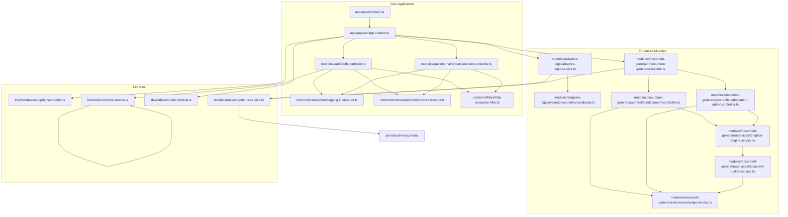

**Diagram sources**
- [main.ts](file://apps/api/src/main.ts#L11-L86)
- [app.module.ts](file://apps/api/src/app.module.ts#L16-L66)
- [adaptive-logic.service.ts](file://apps/api/src/modules/adaptive-logic/adaptive-logic.service.ts#L1-L264)
- [condition.evaluator.ts](file://apps/api/src/modules/adaptive-logic/evaluators/condition.evaluator.ts#L1-L403)
- [document-generator.module.ts](file://apps/api/src/modules/document-generator/document-generator.module.ts#L1-L23)
- [document-controller.ts](file://apps/api/src/modules/document-generator/controllers/document.controller.ts#L1-L163)
- [document-admin.controller.ts](file://apps/api/src/modules/document-generator/controllers/document-admin.controller.ts#L1-L230)
- [template-engine.service.ts](file://apps/api/src/modules/document-generator/services/template-engine.service.ts#L1-L290)
- [document-builder.service.ts](file://apps/api/src/modules/document-generator/services/document-builder.service.ts#L1-L481)
- [storage.service.ts](file://apps/api/src/modules/document-generator/services/storage.service.ts#L1-L160)

**Section sources**
- [main.ts](file://apps/api/src/main.ts#L11-L86)
- [app.module.ts](file://apps/api/src/app.module.ts#L16-L66)

## Core Components
- Bootstrap and global middleware:
  - Helmet security headers, CORS, global prefix, validation pipe, global exception filter, and global interceptors are configured at startup.
- Enhanced interceptors:
  - Logging interceptor captures request metadata and timing; logs both successes and errors.
  - Transform interceptor wraps all successful responses into a standardized envelope with success flag, data, and optional metadata.
- Exception filter:
  - Centralized handler for all exceptions, normalizing error responses with code, message, and requestId.
- Advanced modules and services:
  - Authentication service integrates JWT signing, bcrypt hashing, refresh token storage in Redis, and database persistence.
  - Adaptive logic service evaluates visibility rules, calculates adaptive changes, and manages branching logic.
  - Document generation service handles document creation, template processing, storage, and administrative workflows.
  - Database and Redis modules provide PrismaClient and Redis client instances with lifecycle hooks.

**Section sources**
- [main.ts](file://apps/api/src/main.ts#L20-L49)
- [logging.interceptor.ts](file://apps/api/src/common/interceptors/logging.interceptor.ts#L16-L60)
- [transform.interceptor.ts](file://apps/api/src/common/interceptors/transform.interceptor.ts#L21-L35)
- [http-exception.filter.ts](file://apps/api/src/common/filters/http-exception.filter.ts#L26-L82)
- [auth.service.ts](file://apps/api/src/modules/auth/auth.service.ts#L34-L52)
- [adaptive-logic.service.ts](file://apps/api/src/modules/adaptive-logic/adaptive-logic.service.ts#L19-L264)
- [document-generator.service.ts](file://apps/api/src/modules/document-generator/services/document-generator.service.ts#L28-L360)

## Architecture Overview
The system follows a layered architecture with adaptive intelligence and document automation:
- Transport layer: Express-based NestJS with global middleware and guards
- Presentation layer: Controllers expose endpoints and enforce auth guards
- Domain layer: Services encapsulate business logic, adaptive evaluation, and document generation
- Persistence layer: Prisma ORM for PostgreSQL and Redis for ephemeral state

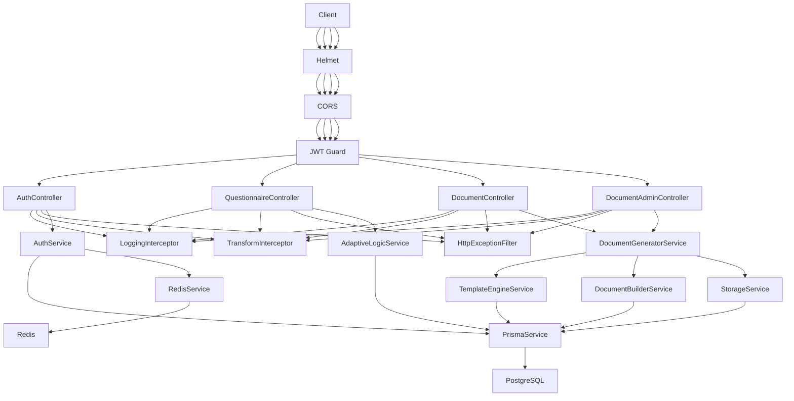

**Diagram sources**
- [main.ts](file://apps/api/src/main.ts#L20-L49)
- [auth.controller.ts](file://apps/api/src/modules/auth/auth.controller.ts#L24-L73)
- [questionnaire.controller.ts](file://apps/api/src/modules/questionnaire/questionnaire.controller.ts#L18-L55)
- [document-controller.ts](file://apps/api/src/modules/document-generator/controllers/document.controller.ts#L30-L163)
- [document-admin.controller.ts](file://apps/api/src/modules/document-generator/controllers/document-admin.controller.ts#L35-L230)
- [logging.interceptor.ts](file://apps/api/src/common/interceptors/logging.interceptor.ts#L16-L60)
- [transform.interceptor.ts](file://apps/api/src/common/interceptors/transform.interceptor.ts#L21-L35)
- [http-exception.filter.ts](file://apps/api/src/common/filters/http-exception.filter.ts#L26-L82)
- [auth.service.ts](file://apps/api/src/modules/auth/auth.service.ts#L42-L52)
- [adaptive-logic.service.ts](file://apps/api/src/modules/adaptive-logic/adaptive-logic.service.ts#L19-L264)
- [document-generator.service.ts](file://apps/api/src/modules/document-generator/services/document-generator.service.ts#L28-L360)
- [prisma.service.ts](file://libs/database/src/prisma.service.ts#L8-L40)
- [redis.service.ts](file://libs/redis/src/redis.service.ts#L10-L38)

## Detailed Component Analysis

### Authentication Data Flow
This flow covers user registration, login, token refresh, logout, and protected profile retrieval.

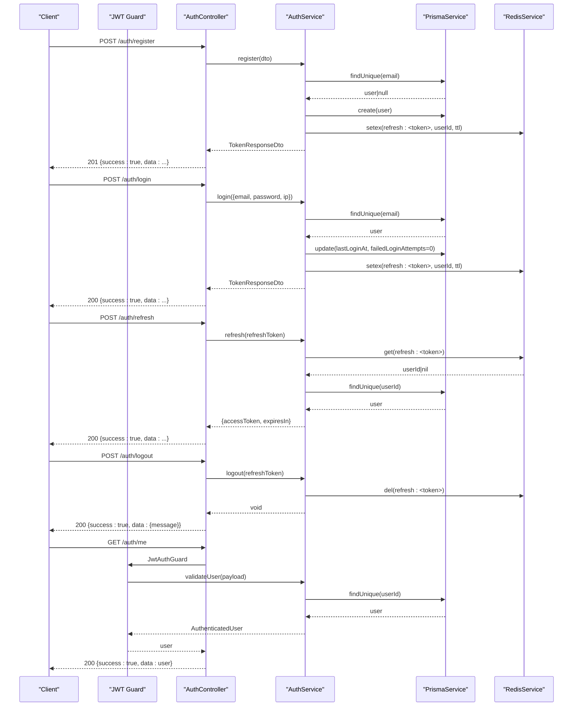

**Diagram sources**
- [auth.controller.ts](file://apps/api/src/modules/auth/auth.controller.ts#L31-L72)
- [auth.service.ts](file://apps/api/src/modules/auth/auth.service.ts#L54-L232)
- [prisma.service.ts](file://libs/database/src/prisma.service.ts#L8-L40)
- [redis.service.ts](file://libs/redis/src/redis.service.ts#L40-L59)

**Section sources**
- [auth.controller.ts](file://apps/api/src/modules/auth/auth.controller.ts#L27-L72)
- [auth.service.ts](file://apps/api/src/modules/auth/auth.service.ts#L54-L232)
- [prisma.service.ts](file://libs/database/src/prisma.service.ts#L20-L40)
- [redis.service.ts](file://libs/redis/src/redis.service.ts#L40-L59)

### Request/Response Transformation Pipeline
The transform interceptor wraps all successful responses into a consistent envelope. The logging interceptor records request metadata and timing. The exception filter ensures all errors are normalized.

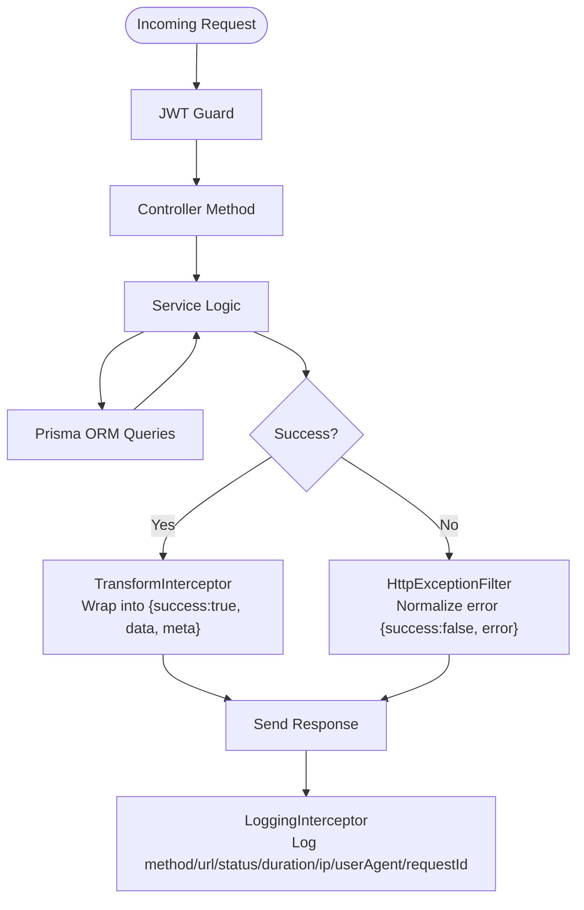

**Diagram sources**
- [transform.interceptor.ts](file://apps/api/src/common/interceptors/transform.interceptor.ts#L21-L35)
- [logging.interceptor.ts](file://apps/api/src/common/interceptors/logging.interceptor.ts#L16-L60)
- [http-exception.filter.ts](file://apps/api/src/common/filters/http-exception.filter.ts#L26-L82)

**Section sources**
- [transform.interceptor.ts](file://apps/api/src/common/interceptors/transform.interceptor.ts#L21-L35)
- [logging.interceptor.ts](file://apps/api/src/common/interceptors/logging.interceptor.ts#L16-L60)
- [http-exception.filter.ts](file://apps/api/src/common/filters/http-exception.filter.ts#L26-L82)

### Database Interaction Patterns Using Prisma ORM
- Initialization and lifecycle:
  - PrismaService extends PrismaClient and connects/disconnects on module init/destroy.
  - In development, slow queries are logged for performance tuning.
- Enhanced query execution:
  - Services call Prisma methods (find, create, upsert, update, count) to manage Users, Questionnaires, Sections, Questions, VisibilityRules, and Documents.
  - Complex queries now include visibility rule evaluation and document type mappings.
- Transactions and connection management:
  - The code does not explicitly use Prisma transactions; most operations are single-entity writes/read. For multi-entity consistency needs, explicit transactions could be introduced.

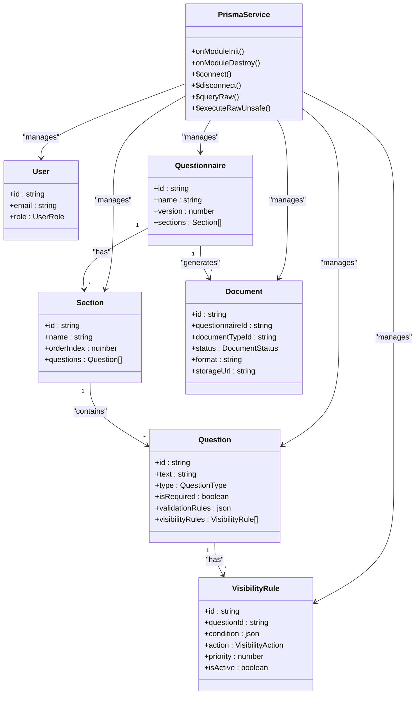

**Diagram sources**
- [prisma.service.ts](file://libs/database/src/prisma.service.ts#L8-L40)
- [schema.prisma](file://prisma/schema.prisma#L99-L147)
- [schema.prisma](file://prisma/schema.prisma#L270-L322)

**Section sources**
- [prisma.service.ts](file://libs/database/src/prisma.service.ts#L20-L40)
- [schema.prisma](file://prisma/schema.prisma#L99-L147)
- [schema.prisma](file://prisma/schema.prisma#L270-L322)

### Caching Strategy Using Redis
- Refresh token storage:
  - On login/register, refresh tokens are stored in Redis with TTL derived from configuration.
  - Token verification during refresh reads the token key; logout deletes the key.
- Redis client:
  - RedisService provides a pooled client with retry strategy, lifecycle hooks, and convenience methods for string/hash operations.

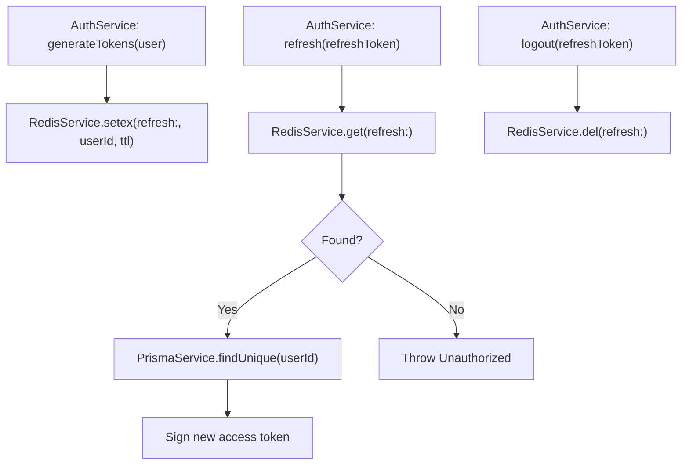

**Diagram sources**
- [auth.service.ts](file://apps/api/src/modules/auth/auth.service.ts#L192-L232)
- [auth.service.ts](file://apps/api/src/modules/auth/auth.service.ts#L128-L164)
- [redis.service.ts](file://libs/redis/src/redis.service.ts#L40-L59)

**Section sources**
- [auth.service.ts](file://apps/api/src/modules/auth/auth.service.ts#L192-L232)
- [auth.service.ts](file://apps/api/src/modules/auth/auth.service.ts#L128-L164)
- [redis.service.ts](file://libs/redis/src/redis.service.ts#L40-L59)

### Error Handling Throughout the Data Flow
- Centralized exception filter:
  - Converts HttpException and unhandled errors into a consistent error envelope with code, message, details, requestId, and timestamp.
  - Logs structured error entries with stack traces for debugging.
- Controller-level guard enforcement:
  - JWT guard protects endpoints; unauthorized access yields normalized 401 responses.
- Validation:
  - Global ValidationPipe enforces DTO constraints and transforms incoming data.

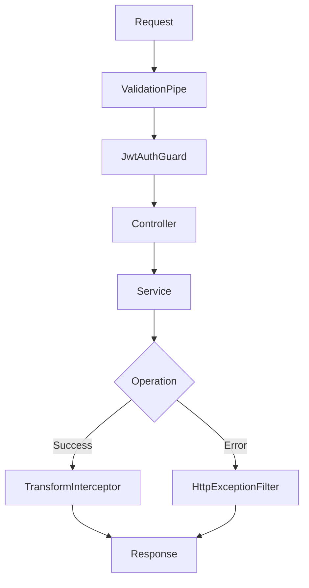

**Diagram sources**
- [main.ts](file://apps/api/src/main.ts#L34-L43)
- [auth.controller.ts](file://apps/api/src/modules/auth/auth.controller.ts#L64-L72)
- [http-exception.filter.ts](file://apps/api/src/common/filters/http-exception.filter.ts#L26-L82)
- [transform.interceptor.ts](file://apps/api/src/common/interceptors/transform.interceptor.ts#L21-L35)

**Section sources**
- [main.ts](file://apps/api/src/main.ts#L34-L43)
- [http-exception.filter.ts](file://apps/api/src/common/filters/http-exception.filter.ts#L26-L82)

### Logging and Monitoring Integration
- Logging interceptor:
  - Captures method, URL, status code, duration, IP, user agent, and request ID; logs both success and error outcomes.
- Prisma query logging:
  - Slow query warnings are emitted in development to aid performance analysis.
- Monitoring:
  - The system logs structured events suitable for ingestion by external monitoring systems (e.g., correlation by requestId).

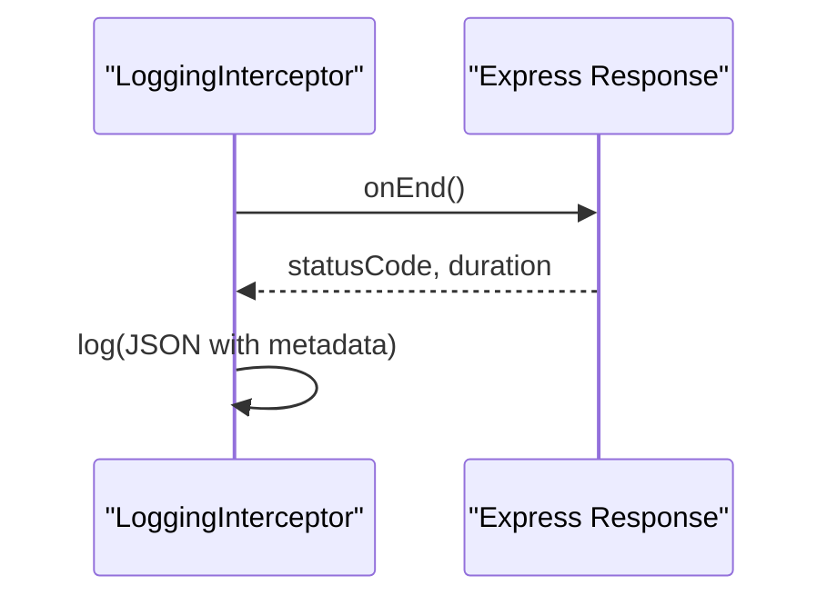

**Diagram sources**
- [logging.interceptor.ts](file://apps/api/src/common/interceptors/logging.interceptor.ts#L25-L59)
- [prisma.service.ts](file://libs/database/src/prisma.service.ts#L25-L33)

**Section sources**
- [logging.interceptor.ts](file://apps/api/src/common/interceptors/logging.interceptor.ts#L16-L60)
- [prisma.service.ts](file://libs/database/src/prisma.service.ts#L25-L33)

## Adaptive Logic Integration

### Adaptive Logic Service Architecture
The adaptive logic system provides intelligent question routing and visibility management based on user responses and predefined rules.

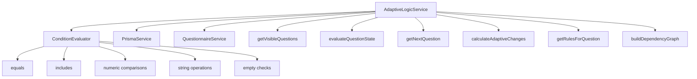

**Diagram sources**
- [adaptive-logic.service.ts](file://apps/api/src/modules/adaptive-logic/adaptive-logic.service.ts#L19-L264)
- [condition.evaluator.ts](file://apps/api/src/modules/adaptive-logic/evaluators/condition.evaluator.ts#L4-L403)
- [rule.types.ts](file://apps/api/src/modules/adaptive-logic/types/rule.types.ts#L3-L239)

### Condition Evaluation Engine
The condition evaluator supports complex logical operations and response value extraction.

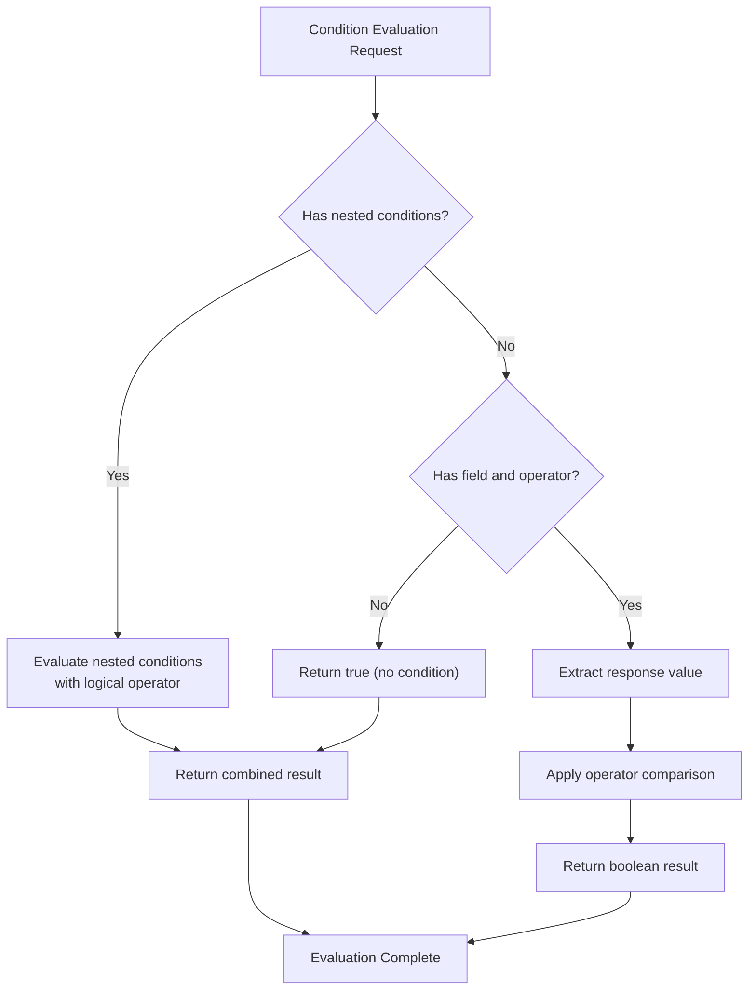

**Diagram sources**
- [condition.evaluator.ts](file://apps/api/src/modules/adaptive-logic/evaluators/condition.evaluator.ts#L9-L403)

### Visibility Rule Processing
The system processes visibility rules to dynamically show/hide questions and adjust required fields.

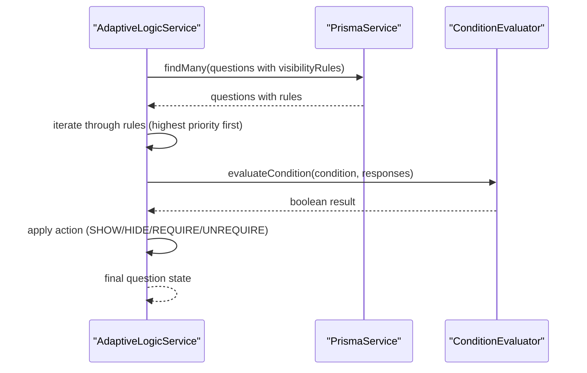

**Diagram sources**
- [adaptive-logic.service.ts](file://apps/api/src/modules/adaptive-logic/adaptive-logic.service.ts#L69-L110)
- [condition.evaluator.ts](file://apps/api/src/modules/adaptive-logic/evaluators/condition.evaluator.ts#L9-L403)

**Section sources**
- [adaptive-logic.service.ts](file://apps/api/src/modules/adaptive-logic/adaptive-logic.service.ts#L19-L264)
- [condition.evaluator.ts](file://apps/api/src/modules/adaptive-logic/evaluators/condition.evaluator.ts#L4-L403)
- [rule.types.ts](file://apps/api/src/modules/adaptive-logic/types/rule.types.ts#L3-L239)

## Document Generation Workflow

### Document Generation Architecture
The document generation system creates professional documents from questionnaire responses using templates and storage services.

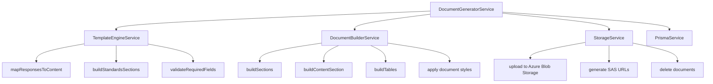

**Diagram sources**
- [document-generator.service.ts](file://apps/api/src/modules/document-generator/services/document-generator.service.ts#L28-L360)
- [template-engine.service.ts](file://apps/api/src/modules/document-generator/services/template-engine.service.ts#L26-L290)
- [document-builder.service.ts](file://apps/api/src/modules/document-generator/services/document-builder.service.ts#L28-L481)
- [storage.service.ts](file://apps/api/src/modules/document-generator/services/storage.service.ts#L18-L160)

### Document Generation Process
The system generates documents through a multi-stage process with validation and storage.

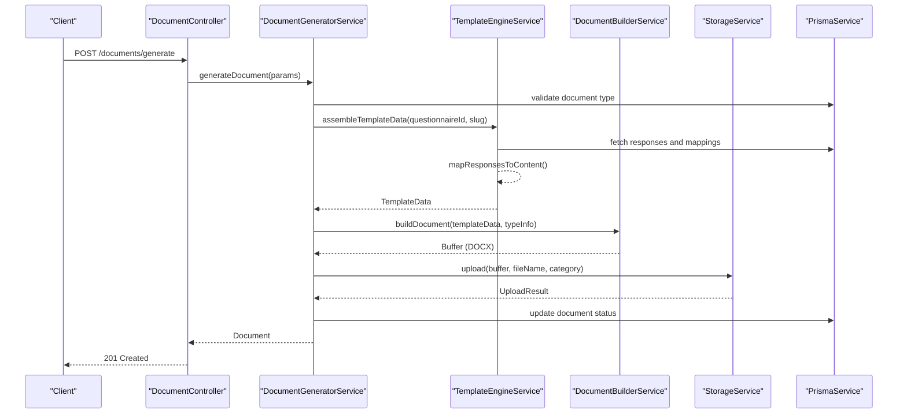

**Diagram sources**
- [document-controller.ts](file://apps/api/src/modules/document-generator/controllers/document.controller.ts#L38-L54)
- [document-generator.service.ts](file://apps/api/src/modules/document-generator/services/document-generator.service.ts#L42-L139)
- [template-engine.service.ts](file://apps/api/src/modules/document-generator/services/template-engine.service.ts#L35-L99)
- [document-builder.service.ts](file://apps/api/src/modules/document-generator/services/document-builder.service.ts#L35-L72)
- [storage.service.ts](file://apps/api/src/modules/document-generator/services/storage.service.ts#L65-L95)

### Template Data Assembly
The template engine processes questionnaire responses into structured content for document generation.

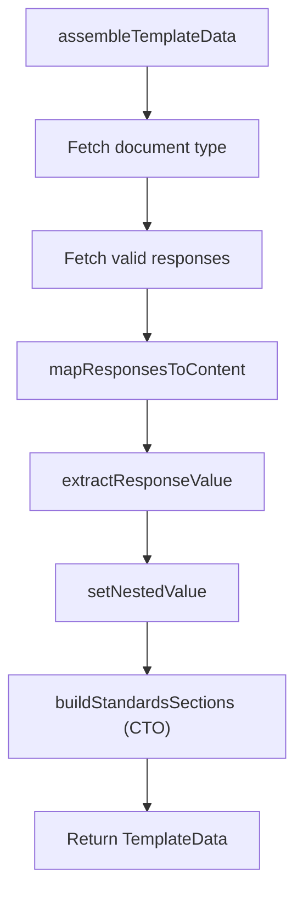

**Diagram sources**
- [template-engine.service.ts](file://apps/api/src/modules/document-generator/services/template-engine.service.ts#L35-L136)

**Section sources**
- [document-generator.service.ts](file://apps/api/src/modules/document-generator/services/document-generator.service.ts#L28-L360)
- [document-controller.ts](file://apps/api/src/modules/document-generator/controllers/document.controller.ts#L30-L163)
- [template-engine.service.ts](file://apps/api/src/modules/document-generator/services/template-engine.service.ts#L26-L290)
- [document-builder.service.ts](file://apps/api/src/modules/document-generator/services/document-builder.service.ts#L28-L481)
- [storage.service.ts](file://apps/api/src/modules/document-generator/services/storage.service.ts#L18-L160)

## Dependency Analysis
- AppModule aggregates:
  - ConfigModule, ThrottlerModule, PrismaModule, RedisModule, and enhanced feature modules.
  - Registers global throttling guard and exposes guards via APP_GUARD.
- Enhanced feature modules depend on shared libraries:
  - Auth and Questionnaire modules inject PrismaService and RedisService.
  - Adaptive Logic module injects PrismaService and ConditionEvaluator.
  - Document Generator module injects PrismaService, TemplateEngineService, DocumentBuilderService, and StorageService.
- Controllers depend on services:
  - AuthController depends on AuthService.
  - QuestionnaireController depends on QuestionnaireService.
  - DocumentController depends on DocumentGeneratorService.
  - DocumentAdminController depends on DocumentGeneratorService and PrismaService.

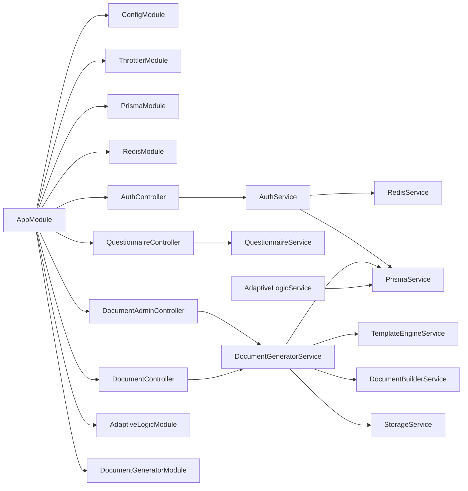

**Diagram sources**
- [app.module.ts](file://apps/api/src/app.module.ts#L16-L66)
- [adaptive-logic.service.ts](file://apps/api/src/modules/adaptive-logic/adaptive-logic.service.ts#L19-L264)
- [document-generator.module.ts](file://apps/api/src/modules/document-generator/document-generator.module.ts#L11-L22)

**Section sources**
- [app.module.ts](file://apps/api/src/app.module.ts#L16-L66)

## Performance Considerations
- Interceptors:
  - Logging adds minimal overhead; ensure requestId propagation for tracing across services.
- Enhanced Prisma operations:
  - Use selective includes and where clauses to avoid N+1 queries; batch operations where possible.
  - Monitor slow queries in development; consider adding indexes for frequent filters.
  - Adaptive logic evaluation uses Map-based lookups for O(1) response access.
- Redis optimizations:
  - Keep TTLs aligned with token lifetimes; monitor key expiration and eviction policies.
  - Consider caching frequently accessed visibility rules and document templates.
- Document generation:
  - Template assembly processes responses in O(n) time; consider caching template data for repeated generations.
  - Storage operations use Azure Blob Storage with efficient upload and SAS URL generation.
- Validation:
  - ValidationPipe transforms inputs; keep DTOs concise to reduce unnecessary conversions.

## Troubleshooting Guide
- Unhandled errors:
  - Inspect the exception filter logs for stack traces and error envelopes.
- Authentication failures:
  - Check Redis refresh token presence and expiry; verify Prisma user existence and lockout fields.
- Document generation issues:
  - Check document type configuration and required question mappings.
  - Verify Azure Blob Storage connectivity and SAS URL generation.
  - Review template data assembly and document building process.
- Database connectivity:
  - Confirm PrismaService lifecycle logs and slow query warnings in development.
- Adaptive logic problems:
  - Validate visibility rule configurations and condition operators.
  - Check response value extraction for different question types.

**Section sources**
- [http-exception.filter.ts](file://apps/api/src/common/filters/http-exception.filter.ts#L56-L82)
- [auth.service.ts](file://apps/api/src/modules/auth/auth.service.ts#L128-L164)
- [adaptive-logic.service.ts](file://apps/api/src/modules/adaptive-logic/adaptive-logic.service.ts#L19-L264)
- [document-generator.service.ts](file://apps/api/src/modules/document-generator/services/document-generator.service.ts#L42-L139)
- [prisma.service.ts](file://libs/database/src/prisma.service.ts#L20-L40)

## Conclusion
The Quiz-to-build system implements a comprehensive, intelligent architecture with adaptive logic integration and automated document generation. The system provides dynamic question routing based on user responses and professional document generation from questionnaire data. The adaptive logic engine evaluates complex visibility rules in real-time, while the document generation workflow transforms structured questionnaire responses into professional documents. The documented flows and diagrams serve as a blueprint for extending functionality, optimizing performance, and maintaining reliability in this enhanced system.