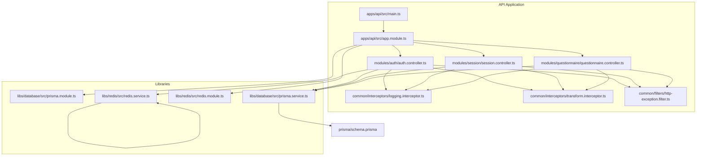
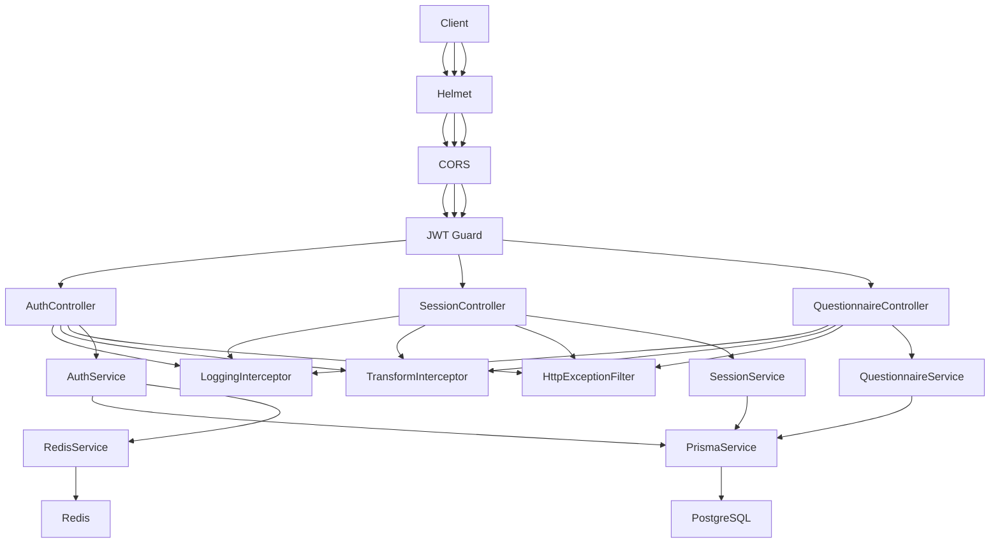
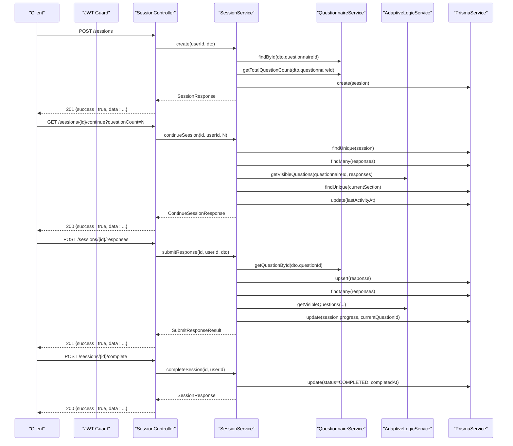
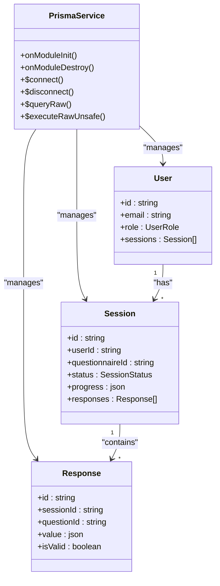
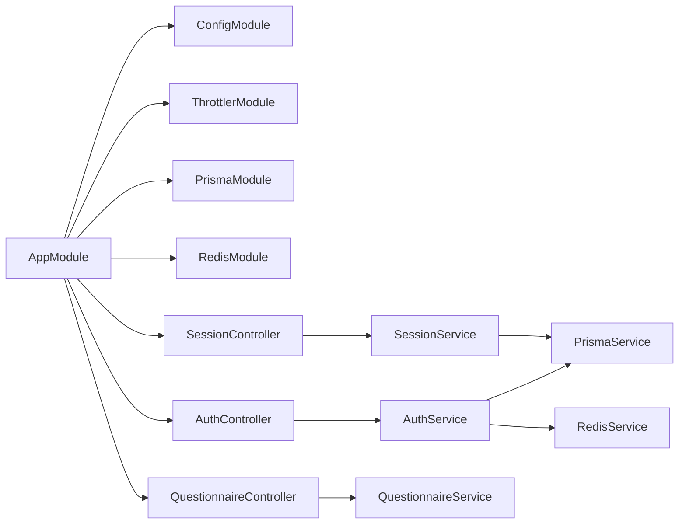

# Data Flow Architecture

<cite>
**Referenced Files in This Document**
- [main.ts](file://apps/api/src/main.ts)
- [app.module.ts](file://apps/api/src/app.module.ts)
- [logging.interceptor.ts](file://apps/api/src/common/interceptors/logging.interceptor.ts)
- [transform.interceptor.ts](file://apps/api/src/common/interceptors/transform.interceptor.ts)
- [http-exception.filter.ts](file://apps/api/src/common/filters/http-exception.filter.ts)
- [auth.controller.ts](file://apps/api/src/modules/auth/auth.controller.ts)
- [auth.service.ts](file://apps/api/src/modules/auth/auth.service.ts)
- [session.controller.ts](file://apps/api/src/modules/session/session.controller.ts)
- [session.service.ts](file://apps/api/src/modules/session/session.service.ts)
- [questionnaire.controller.ts](file://apps/api/src/modules/questionnaire/questionnaire.controller.ts)
- [prisma.service.ts](file://libs/database/src/prisma.service.ts)
- [prisma.module.ts](file://libs/database/src/prisma.module.ts)
- [redis.service.ts](file://libs/redis/src/redis.service.ts)
- [redis.module.ts](file://libs/redis/src/redis.module.ts)
- [schema.prisma](file://prisma/schema.prisma)
</cite>

## Table of Contents
1. [Introduction](#introduction)
2. [Project Structure](#project-structure)
3. [Core Components](#core-components)
4. [Architecture Overview](#architecture-overview)
5. [Detailed Component Analysis](#detailed-component-analysis)
6. [Dependency Analysis](#dependency-analysis)
7. [Performance Considerations](#performance-considerations)
8. [Troubleshooting Guide](#troubleshooting-guide)
9. [Conclusion](#conclusion)

## Introduction
This document describes the end-to-end data flow architecture for the Quiz-to-build system. It covers how HTTP requests traverse the application via global interceptors and guards, how controllers delegate to services, how services interact with the database using Prisma ORM, and how Redis is used for session-related state and refresh tokens. It also explains request/response transformation, error handling via exception filters, and logging/metrics integration through interceptors.

## Project Structure
The application is organized as a NestJS monorepo with:
- An API application module that wires global pipes, filters, and interceptors
- Feature modules for authentication, questionnaires, sessions, and standards
- Shared libraries for database (Prisma) and cache (Redis)
- A Prisma schema defining the domain models and relationships

**Diagram sources**
- [main.ts](file://apps/api/src/main.ts#L11-L86)
- [app.module.ts](file://apps/api/src/app.module.ts#L16-L66)
- [logging.interceptor.ts](file://apps/api/src/common/interceptors/logging.interceptor.ts#L16-L60)
- [transform.interceptor.ts](file://apps/api/src/common/interceptors/transform.interceptor.ts#L21-L35)
- [http-exception.filter.ts](file://apps/api/src/common/filters/http-exception.filter.ts#L26-L82)
- [auth.controller.ts](file://apps/api/src/modules/auth/auth.controller.ts#L24-L73)
- [session.controller.ts](file://apps/api/src/modules/session/session.controller.ts#L30-L152)
- [questionnaire.controller.ts](file://apps/api/src/modules/questionnaire/questionnaire.controller.ts#L18-L55)
- [prisma.module.ts](file://libs/database/src/prisma.module.ts#L4-L9)
- [prisma.service.ts](file://libs/database/src/prisma.service.ts#L8-L40)
- [redis.module.ts](file://libs/redis/src/redis.module.ts#L4-L9)
- [redis.service.ts](file://libs/redis/src/redis.service.ts#L10-L38)
- [schema.prisma](file://prisma/schema.prisma#L1-L12)

**Section sources**
- [main.ts](file://apps/api/src/main.ts#L11-L86)
- [app.module.ts](file://apps/api/src/app.module.ts#L16-L66)

## Core Components
- Bootstrap and global middleware:
  - Helmet security headers, CORS, global prefix, validation pipe, global exception filter, and global interceptors are configured at startup.
- Interceptors:
  - Logging interceptor captures request metadata and timing; logs both successes and errors.
  - Transform interceptor wraps all successful responses into a standardized envelope with success flag, data, and optional metadata.
- Exception filter:
  - Centralized handler for all exceptions, normalizing error responses with code, message, and requestId.
- Modules and services:
  - Authentication service integrates JWT signing, bcrypt hashing, refresh token storage in Redis, and database persistence.
  - Session service orchestrates questionnaire sessions, adaptive logic evaluation, response validation, and progress computation.
  - Database and Redis modules provide PrismaClient and Redis client instances with lifecycle hooks.

**Section sources**
- [main.ts](file://apps/api/src/main.ts#L20-L49)
- [logging.interceptor.ts](file://apps/api/src/common/interceptors/logging.interceptor.ts#L16-L60)
- [transform.interceptor.ts](file://apps/api/src/common/interceptors/transform.interceptor.ts#L21-L35)
- [http-exception.filter.ts](file://apps/api/src/common/filters/http-exception.filter.ts#L26-L82)
- [auth.service.ts](file://apps/api/src/modules/auth/auth.service.ts#L34-L52)
- [session.service.ts](file://apps/api/src/modules/session/session.service.ts#L87-L94)

## Architecture Overview
The system follows a layered architecture:
- Transport layer: Express-based NestJS with global middleware and guards
- Presentation layer: Controllers expose endpoints and enforce auth guards
- Domain layer: Services encapsulate business logic and orchestration
- Persistence layer: Prisma ORM for PostgreSQL and Redis for ephemeral state

**Diagram sources**
- [main.ts](file://apps/api/src/main.ts#L20-L49)
- [auth.controller.ts](file://apps/api/src/modules/auth/auth.controller.ts#L24-L73)
- [session.controller.ts](file://apps/api/src/modules/session/session.controller.ts#L30-L152)
- [questionnaire.controller.ts](file://apps/api/src/modules/questionnaire/questionnaire.controller.ts#L18-L55)
- [logging.interceptor.ts](file://apps/api/src/common/interceptors/logging.interceptor.ts#L16-L60)
- [transform.interceptor.ts](file://apps/api/src/common/interceptors/transform.interceptor.ts#L21-L35)
- [http-exception.filter.ts](file://apps/api/src/common/filters/http-exception.filter.ts#L26-L82)
- [auth.service.ts](file://apps/api/src/modules/auth/auth.service.ts#L42-L52)
- [session.service.ts](file://apps/api/src/modules/session/session.service.ts#L89-L94)
- [prisma.service.ts](file://libs/database/src/prisma.service.ts#L8-L40)
- [redis.service.ts](file://libs/redis/src/redis.service.ts#L10-L38)

## Detailed Component Analysis

### Authentication Data Flow
This flow covers user registration, login, token refresh, logout, and protected profile retrieval.

**Diagram sources**
- [auth.controller.ts](file://apps/api/src/modules/auth/auth.controller.ts#L31-L72)
- [auth.service.ts](file://apps/api/src/modules/auth/auth.service.ts#L54-L232)
- [prisma.service.ts](file://libs/database/src/prisma.service.ts#L8-L40)
- [redis.service.ts](file://libs/redis/src/redis.service.ts#L40-L59)

**Section sources**
- [auth.controller.ts](file://apps/api/src/modules/auth/auth.controller.ts#L27-L72)
- [auth.service.ts](file://apps/api/src/modules/auth/auth.service.ts#L54-L232)
- [prisma.service.ts](file://libs/database/src/prisma.service.ts#L20-L40)
- [redis.service.ts](file://libs/redis/src/redis.service.ts#L40-L59)

### Session Management Data Flow
This flow covers creating sessions, retrieving next questions, submitting responses, continuing sessions, and completing sessions.

**Diagram sources**
- [session.controller.ts](file://apps/api/src/modules/session/session.controller.ts#L39-L151)
- [session.service.ts](file://apps/api/src/modules/session/session.service.ts#L96-L546)
- [prisma.service.ts](file://libs/database/src/prisma.service.ts#L8-L40)

**Section sources**
- [session.controller.ts](file://apps/api/src/modules/session/session.controller.ts#L36-L152)
- [session.service.ts](file://apps/api/src/modules/session/session.service.ts#L96-L546)

### Request/Response Transformation Pipeline
The transform interceptor wraps all successful responses into a consistent envelope. The logging interceptor records request metadata and timing. The exception filter ensures all errors are normalized.

**Diagram sources**
- [transform.interceptor.ts](file://apps/api/src/common/interceptors/transform.interceptor.ts#L21-L35)
- [logging.interceptor.ts](file://apps/api/src/common/interceptors/logging.interceptor.ts#L16-L60)
- [http-exception.filter.ts](file://apps/api/src/common/filters/http-exception.filter.ts#L26-L82)

**Section sources**
- [transform.interceptor.ts](file://apps/api/src/common/interceptors/transform.interceptor.ts#L21-L35)
- [logging.interceptor.ts](file://apps/api/src/common/interceptors/logging.interceptor.ts#L16-L60)
- [http-exception.filter.ts](file://apps/api/src/common/filters/http-exception.filter.ts#L26-L82)

### Database Interaction Patterns Using Prisma ORM
- Initialization and lifecycle:
  - PrismaService extends PrismaClient and connects/disconnects on module init/destroy.
  - In development, slow queries are logged for performance tuning.
- Query execution:
  - Services call Prisma methods (find, create, upsert, update, count) to manage Users, Sessions, Responses, and related entities.
- Transactions and connection management:
  - The code does not explicitly use Prisma transactions; most operations are single-entity writes/read. For multi-entity consistency needs, explicit transactions could be introduced.

**Diagram sources**
- [prisma.service.ts](file://libs/database/src/prisma.service.ts#L8-L40)
- [schema.prisma](file://prisma/schema.prisma#L99-L147)
- [schema.prisma](file://prisma/schema.prisma#L270-L322)

**Section sources**
- [prisma.service.ts](file://libs/database/src/prisma.service.ts#L20-L40)
- [schema.prisma](file://prisma/schema.prisma#L99-L147)
- [schema.prisma](file://prisma/schema.prisma#L270-L322)

### Caching Strategy Using Redis
- Refresh token storage:
  - On login/register, refresh tokens are stored in Redis with TTL derived from configuration.
  - Token verification during refresh reads the token key; logout deletes the key.
- Session state:
  - The session service maintains in-memory maps of responses for adaptive logic evaluation; Redis is not used for runtime session state.
- Redis client:
  - RedisService provides a pooled client with retry strategy, lifecycle hooks, and convenience methods for string/hash operations.

**Diagram sources**
- [auth.service.ts](file://apps/api/src/modules/auth/auth.service.ts#L192-L232)
- [auth.service.ts](file://apps/api/src/modules/auth/auth.service.ts#L128-L164)
- [redis.service.ts](file://libs/redis/src/redis.service.ts#L40-L59)

**Section sources**
- [auth.service.ts](file://apps/api/src/modules/auth/auth.service.ts#L192-L232)
- [auth.service.ts](file://apps/api/src/modules/auth/auth.service.ts#L128-L164)
- [redis.service.ts](file://libs/redis/src/redis.service.ts#L40-L59)

### Error Handling Throughout the Data Flow
- Centralized exception filter:
  - Converts HttpException and unhandled errors into a consistent error envelope with code, message, details, requestId, and timestamp.
  - Logs structured error entries with stack traces for debugging.
- Controller-level guard enforcement:
  - JWT guard protects endpoints; unauthorized access yields normalized 401 responses.
- Validation:
  - Global ValidationPipe enforces DTO constraints and transforms incoming data.

**Diagram sources**
- [main.ts](file://apps/api/src/main.ts#L34-L43)
- [auth.controller.ts](file://apps/api/src/modules/auth/auth.controller.ts#L64-L72)
- [http-exception.filter.ts](file://apps/api/src/common/filters/http-exception.filter.ts#L26-L82)
- [transform.interceptor.ts](file://apps/api/src/common/interceptors/transform.interceptor.ts#L21-L35)

**Section sources**
- [main.ts](file://apps/api/src/main.ts#L34-L43)
- [http-exception.filter.ts](file://apps/api/src/common/filters/http-exception.filter.ts#L26-L82)

### Logging and Monitoring Integration
- Logging interceptor:
  - Captures method, URL, status code, duration, IP, user agent, and request ID; logs both success and error outcomes.
- Prisma query logging:
  - Slow query warnings are emitted in development to aid performance analysis.
- Monitoring:
  - The system logs structured events suitable for ingestion by external monitoring systems (e.g., correlation by requestId).

**Diagram sources**
- [logging.interceptor.ts](file://apps/api/src/common/interceptors/logging.interceptor.ts#L25-L59)
- [prisma.service.ts](file://libs/database/src/prisma.service.ts#L25-L33)

**Section sources**
- [logging.interceptor.ts](file://apps/api/src/common/interceptors/logging.interceptor.ts#L16-L60)
- [prisma.service.ts](file://libs/database/src/prisma.service.ts#L25-L33)

## Dependency Analysis
- AppModule aggregates:
  - ConfigModule, ThrottlerModule, PrismaModule, RedisModule, and feature modules.
  - Registers global throttling guard and exposes guards via APP_GUARD.
- Feature modules depend on shared libraries:
  - Auth and Session modules inject PrismaService and RedisService.
- Controllers depend on services:
  - AuthController depends on AuthService.
  - SessionController depends on SessionService.
  - QuestionnaireController depends on QuestionnaireService.

**Diagram sources**
- [app.module.ts](file://apps/api/src/app.module.ts#L16-L66)
- [auth.controller.ts](file://apps/api/src/modules/auth/auth.controller.ts#L24-L73)
- [session.controller.ts](file://apps/api/src/modules/session/session.controller.ts#L30-L152)
- [questionnaire.controller.ts](file://apps/api/src/modules/questionnaire/questionnaire.controller.ts#L18-L55)
- [prisma.module.ts](file://libs/database/src/prisma.module.ts#L4-L9)
- [redis.module.ts](file://libs/redis/src/redis.module.ts#L4-L9)

**Section sources**
- [app.module.ts](file://apps/api/src/app.module.ts#L16-L66)

## Performance Considerations
- Interceptors:
  - Logging adds minimal overhead; ensure requestId propagation for tracing across services.
- Prisma:
  - Use selective includes and where clauses to avoid N+1 queries; batch operations where possible.
  - Monitor slow queries in development; consider adding indexes for frequent filters.
- Redis:
  - Keep TTLs aligned with token lifetimes; monitor key expiration and eviction policies.
- Validation:
  - ValidationPipe transforms inputs; keep DTOs concise to reduce unnecessary conversions.

## Troubleshooting Guide
- Unhandled errors:
  - Inspect the exception filter logs for stack traces and error envelopes.
- Authentication failures:
  - Check Redis refresh token presence and expiry; verify Prisma user existence and lockout fields.
- Session anomalies:
  - Review Prisma session progress and response upserts; confirm adaptive visibility rules and next-question selection logic.
- Database connectivity:
  - Confirm PrismaService lifecycle logs and slow query warnings in development.

**Section sources**
- [http-exception.filter.ts](file://apps/api/src/common/filters/http-exception.filter.ts#L56-L82)
- [auth.service.ts](file://apps/api/src/modules/auth/auth.service.ts#L128-L164)
- [session.service.ts](file://apps/api/src/modules/session/session.service.ts#L270-L359)
- [prisma.service.ts](file://libs/database/src/prisma.service.ts#L20-L40)

## Conclusion
The Quiz-to-build system implements a robust, layered architecture with clear separation of concerns. Global interceptors and filters ensure consistent request/response handling and error normalization. Prisma ORM provides reliable persistence, while Redis supports secure, time-bound refresh tokens. The session service coordinates adaptive logic and progress tracking, enabling dynamic questionnaire experiences. The documented flows and diagrams serve as a blueprint for extending functionality, optimizing performance, and maintaining reliability.