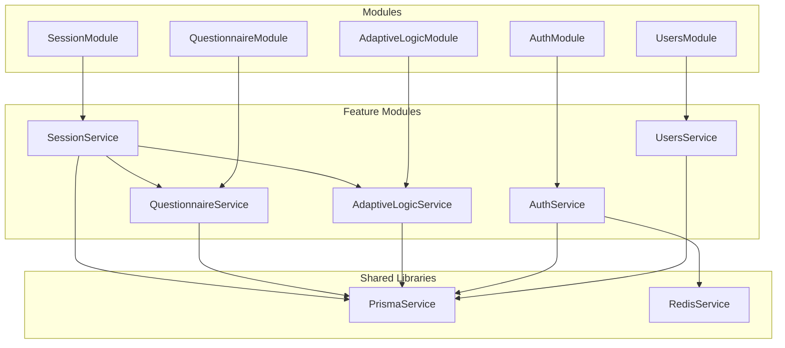
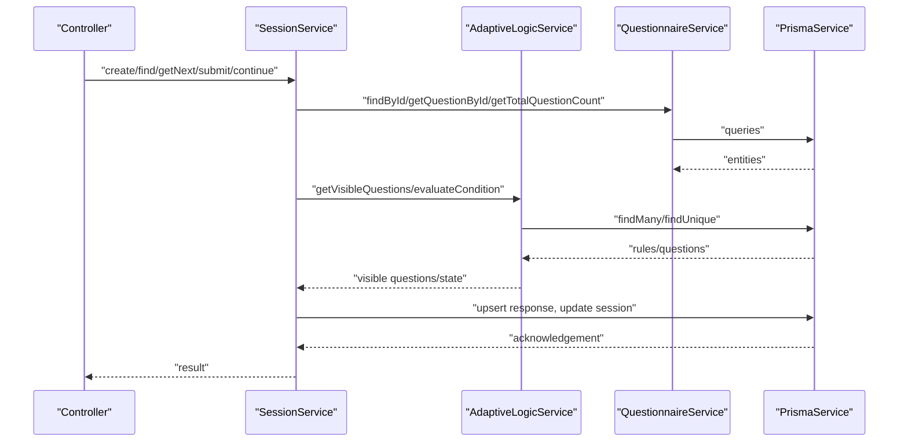
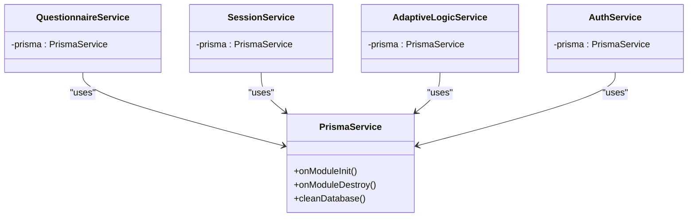
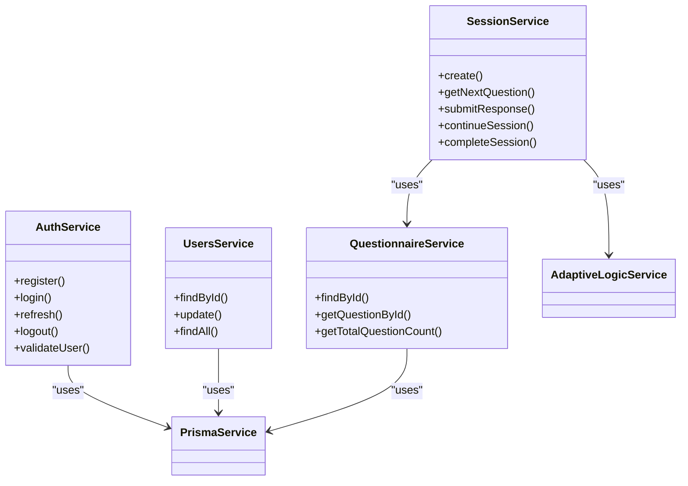
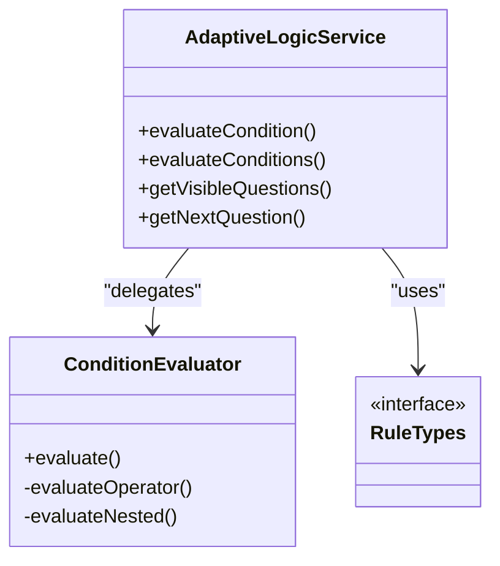
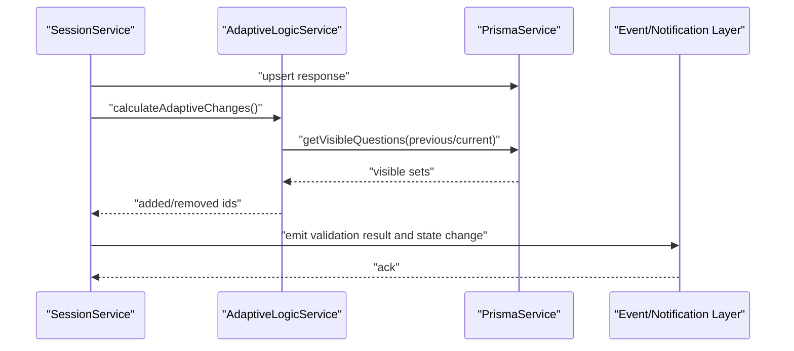
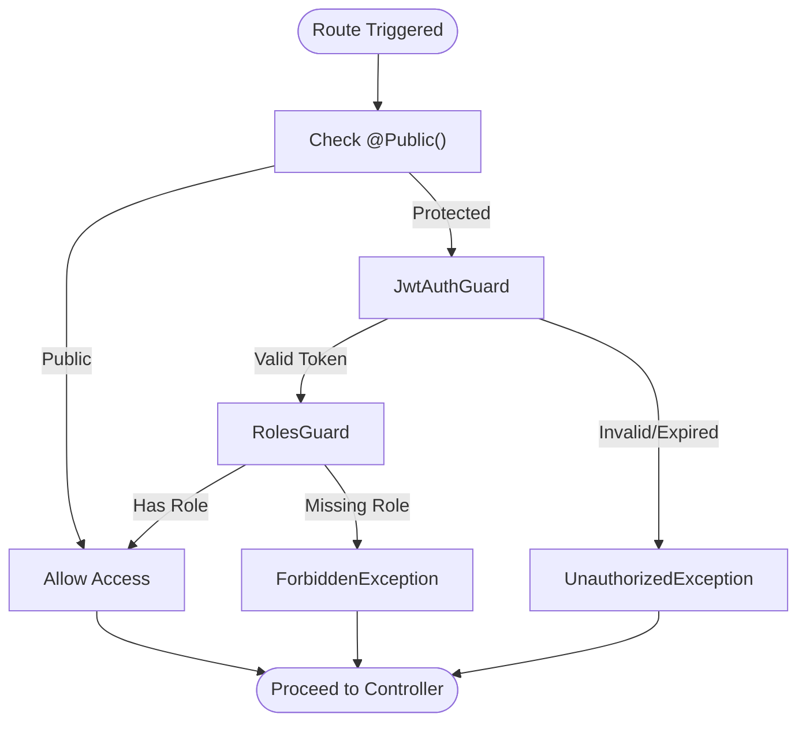
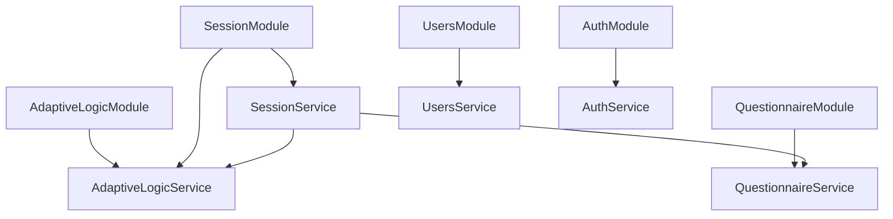
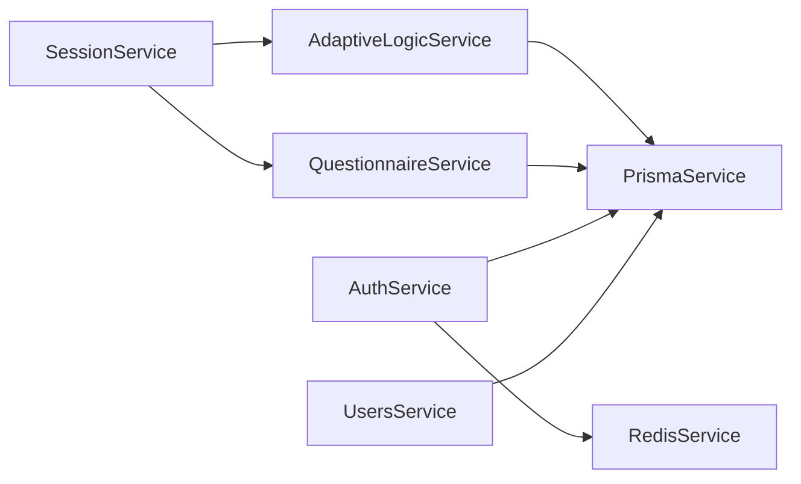

# Design Patterns

<cite>
**Referenced Files in This Document**
- [prisma.service.ts](file://libs/database/src/prisma.service.ts)
- [adaptive-logic.service.ts](file://apps/api/src/modules/adaptive-logic/adaptive-logic.service.ts)
- [condition.evaluator.ts](file://apps/api/src/modules/adaptive-logic/evaluators/condition.evaluator.ts)
- [rule.types.ts](file://apps/api/src/modules/adaptive-logic/types/rule.types.ts)
- [adaptive-logic.module.ts](file://apps/api/src/modules/adaptive-logic/adaptive-logic.module.ts)
- [session.service.ts](file://apps/api/src/modules/session/session.service.ts)
- [session.module.ts](file://apps/api/src/modules/session/session.module.ts)
- [questionnaire.service.ts](file://apps/api/src/modules/questionnaire/questionnaire.service.ts)
- [questionnaire.module.ts](file://apps/api/src/modules/questionnaire/questionnaire.module.ts)
- [users.service.ts](file://apps/api/src/modules/users/users.service.ts)
- [auth.service.ts](file://apps/api/src/modules/auth/auth.service.ts)
- [jwt-auth.guard.ts](file://apps/api/src/modules/auth/guards/jwt-auth.guard.ts)
- [roles.guard.ts](file://apps/api/src/modules/auth/guards/roles.guard.ts)
- [auth.module.ts](file://apps/api/src/modules/auth/auth.module.ts)
</cite>

## Table of Contents
1. [Introduction](#introduction)
2. [Project Structure](#project-structure)
3. [Core Components](#core-components)
4. [Architecture Overview](#architecture-overview)
5. [Detailed Component Analysis](#detailed-component-analysis)
6. [Dependency Analysis](#dependency-analysis)
7. [Performance Considerations](#performance-considerations)
8. [Troubleshooting Guide](#troubleshooting-guide)
9. [Conclusion](#conclusion)

## Introduction
This document explains the design patterns implemented in the Quiz-to-build system. It focuses on:
- Repository pattern via Prisma service for database abstraction
- Service Layer pattern across feature modules
- Strategy pattern in adaptive logic for pluggable condition evaluation
- Observer-like notification patterns for response validation and state changes
- Guard pattern for authentication and authorization using JWT and role-based access control
- Factory pattern in service creation and dependency injection

The goal is to show how these patterns improve maintainability, extensibility, and separation of concerns.

## Project Structure
The system follows NestJS modular architecture with clear separation of concerns:
- Feature modules encapsulate business logic (e.g., session, questionnaire, adaptive logic, auth, users)
- Shared libraries provide cross-cutting services (database, Redis)
- Modules declare providers and exports to enable dependency injection

**Diagram sources**
- [session.module.ts](file://apps/api/src/modules/session/session.module.ts#L1-L17)
- [questionnaire.module.ts](file://apps/api/src/modules/questionnaire/questionnaire.module.ts#L1-L11)
- [adaptive-logic.module.ts](file://apps/api/src/modules/adaptive-logic/adaptive-logic.module.ts#L1-L12)
- [auth.module.ts](file://apps/api/src/modules/auth/auth.module.ts#L1-L30)
- [prisma.service.ts](file://libs/database/src/prisma.service.ts#L1-L62)

**Section sources**
- [session.module.ts](file://apps/api/src/modules/session/session.module.ts#L1-L17)
- [questionnaire.module.ts](file://apps/api/src/modules/questionnaire/questionnaire.module.ts#L1-L11)
- [adaptive-logic.module.ts](file://apps/api/src/modules/adaptive-logic/adaptive-logic.module.ts#L1-L12)
- [auth.module.ts](file://apps/api/src/modules/auth/auth.module.ts#L1-L30)
- [prisma.service.ts](file://libs/database/src/prisma.service.ts#L1-L62)

## Core Components
- PrismaService: Provides database client lifecycle hooks and a clean abstraction for repositories
- AdaptiveLogicService: Orchestrates visibility and branching rules, delegates condition evaluation
- ConditionEvaluator: Pluggable evaluator for rule conditions
- SessionService: Coordinates session lifecycle, integrates with adaptive logic and questionnaire services
- QuestionnaireService: Encapsulates questionnaire and question retrieval logic
- UsersService: Encapsulates user profile and permissions
- AuthService: Handles registration, login, token generation, refresh/logout, and user validation
- Guards: JwtAuthGuard and RolesGuard enforce authentication and authorization

Benefits:
- Clean separation between business logic and data access
- Extensible rule evaluation and pluggable strategies
- Clear authorization boundaries
- Testable services with DI

**Section sources**
- [prisma.service.ts](file://libs/database/src/prisma.service.ts#L1-L62)
- [adaptive-logic.service.ts](file://apps/api/src/modules/adaptive-logic/adaptive-logic.service.ts#L1-L307)
- [condition.evaluator.ts](file://apps/api/src/modules/adaptive-logic/evaluators/condition.evaluator.ts#L1-L402)
- [session.service.ts](file://apps/api/src/modules/session/session.service.ts#L1-L684)
- [questionnaire.service.ts](file://apps/api/src/modules/questionnaire/questionnaire.service.ts#L1-L253)
- [users.service.ts](file://apps/api/src/modules/users/users.service.ts#L1-L200)
- [auth.service.ts](file://apps/api/src/modules/auth/auth.service.ts#L1-L278)
- [jwt-auth.guard.ts](file://apps/api/src/modules/auth/guards/jwt-auth.guard.ts#L1-L38)
- [roles.guard.ts](file://apps/api/src/modules/auth/guards/roles.guard.ts#L1-L39)

## Architecture Overview
The system uses a layered architecture with explicit service boundaries:
- Controllers orchestrate requests and delegate to services
- Services encapsulate business logic and coordinate multiple domain services
- Shared services (Prisma, Redis) provide infrastructure concerns
- Modules define DI containers and export providers

**Diagram sources**
- [session.service.ts](file://apps/api/src/modules/session/session.service.ts#L1-L684)
- [adaptive-logic.service.ts](file://apps/api/src/modules/adaptive-logic/adaptive-logic.service.ts#L1-L307)
- [questionnaire.service.ts](file://apps/api/src/modules/questionnaire/questionnaire.service.ts#L1-L253)
- [prisma.service.ts](file://libs/database/src/prisma.service.ts#L1-L62)

## Detailed Component Analysis

### Repository Pattern with PrismaService
- Purpose: Abstract database operations behind a service interface to keep controllers and business logic agnostic of persistence details.
- Implementation highlights:
  - PrismaService extends PrismaClient and implements lifecycle hooks for connection and logging
  - Services depend on PrismaService rather than raw Prisma client
  - Centralized slow query logging and safe truncation for tests
- Benefits:
  - Single source of truth for DB connectivity and configuration
  - Easier testing and environment-specific behavior
  - Consistent logging and diagnostics

**Diagram sources**
- [prisma.service.ts](file://libs/database/src/prisma.service.ts#L1-L62)
- [questionnaire.service.ts](file://apps/api/src/modules/questionnaire/questionnaire.service.ts#L1-L253)
- [session.service.ts](file://apps/api/src/modules/session/session.service.ts#L1-L684)
- [adaptive-logic.service.ts](file://apps/api/src/modules/adaptive-logic/adaptive-logic.service.ts#L1-L307)
- [auth.service.ts](file://apps/api/src/modules/auth/auth.service.ts#L1-L278)

**Section sources**
- [prisma.service.ts](file://libs/database/src/prisma.service.ts#L1-L62)
- [questionnaire.service.ts](file://apps/api/src/modules/questionnaire/questionnaire.service.ts#L64-L253)
- [session.service.ts](file://apps/api/src/modules/session/session.service.ts#L88-L684)
- [adaptive-logic.service.ts](file://apps/api/src/modules/adaptive-logic/adaptive-logic.service.ts#L20-L307)
- [auth.service.ts](file://apps/api/src/modules/auth/auth.service.ts#L35-L278)

### Service Layer Pattern
- Purpose: Encapsulate business operations in cohesive services per feature, keeping controllers thin.
- Implementation highlights:
  - SessionService orchestrates session lifecycle, integrates adaptive logic and questionnaire services
  - QuestionnaireService handles questionnaire and question retrieval
  - UsersService manages user profiles and permissions
  - AuthService centralizes authentication and token management
- Benefits:
  - Clear separation of concerns
  - Reusable business logic across controllers
  - Easier unit testing and mocking of dependencies

**Diagram sources**
- [session.service.ts](file://apps/api/src/modules/session/session.service.ts#L88-L684)
- [questionnaire.service.ts](file://apps/api/src/modules/questionnaire/questionnaire.service.ts#L64-L253)
- [users.service.ts](file://apps/api/src/modules/users/users.service.ts#L38-L200)
- [auth.service.ts](file://apps/api/src/modules/auth/auth.service.ts#L35-L278)

**Section sources**
- [session.service.ts](file://apps/api/src/modules/session/session.service.ts#L88-L684)
- [questionnaire.service.ts](file://apps/api/src/modules/questionnaire/questionnaire.service.ts#L64-L253)
- [users.service.ts](file://apps/api/src/modules/users/users.service.ts#L38-L200)
- [auth.service.ts](file://apps/api/src/modules/auth/auth.service.ts#L35-L278)

### Strategy Pattern in Adaptive Logic
- Purpose: Enable pluggable condition evaluation for extensible rule processing.
- Implementation highlights:
  - AdaptiveLogicService delegates condition evaluation to ConditionEvaluator
  - Rule types define operators and logical combinations
  - Strategy allows swapping or extending evaluators without changing orchestration
- Benefits:
  - Easy addition of new operators and evaluation modes
  - Separation of rule definition from evaluation logic
  - Testable strategies in isolation

**Diagram sources**
- [adaptive-logic.service.ts](file://apps/api/src/modules/adaptive-logic/adaptive-logic.service.ts#L20-L307)
- [condition.evaluator.ts](file://apps/api/src/modules/adaptive-logic/evaluators/condition.evaluator.ts#L5-L402)
- [rule.types.ts](file://apps/api/src/modules/adaptive-logic/types/rule.types.ts#L1-L120)

**Section sources**
- [adaptive-logic.service.ts](file://apps/api/src/modules/adaptive-logic/adaptive-logic.service.ts#L20-L307)
- [condition.evaluator.ts](file://apps/api/src/modules/adaptive-logic/evaluators/condition.evaluator.ts#L5-L402)
- [rule.types.ts](file://apps/api/src/modules/adaptive-logic/types/rule.types.ts#L1-L120)

### Observer Pattern for Validation and State Notifications
- Purpose: Notify downstream systems or services about validation outcomes and state changes.
- Implementation highlights:
  - SessionService validates responses and updates session state; this can be extended to emit events
  - AdaptiveLogicService calculates changes between previous and current visible questions; these deltas can be emitted as notifications
  - Current implementation uses synchronous updates; event emission can be introduced via NestJS event emitters or message queues
- Benefits:
  - Decouples state change propagation from immediate computation
  - Enables audit trails, analytics, and real-time UI updates
  - Supports eventual consistency and scalability

**Diagram sources**
- [session.service.ts](file://apps/api/src/modules/session/session.service.ts#L270-L359)
- [adaptive-logic.service.ts](file://apps/api/src/modules/adaptive-logic/adaptive-logic.service.ts#L228-L243)
- [prisma.service.ts](file://libs/database/src/prisma.service.ts#L1-L62)

**Section sources**
- [session.service.ts](file://apps/api/src/modules/session/session.service.ts#L270-L359)
- [adaptive-logic.service.ts](file://apps/api/src/modules/adaptive-logic/adaptive-logic.service.ts#L228-L243)

### Guard Pattern for Authentication and Authorization
- Purpose: Enforce authentication and role-based access control at runtime.
- Implementation highlights:
  - JwtAuthGuard integrates with Passport and NestJS Reflector to allow public routes and handle token errors
  - RolesGuard reads required roles from route metadata and checks user roles
  - AuthModule registers JwtModule, strategies, and guards
- Benefits:
  - Centralized auth policy enforcement
  - Composable guards for different endpoints
  - Clear separation between auth and business logic

**Diagram sources**
- [jwt-auth.guard.ts](file://apps/api/src/modules/auth/guards/jwt-auth.guard.ts#L1-L38)
- [roles.guard.ts](file://apps/api/src/modules/auth/guards/roles.guard.ts#L1-L39)
- [auth.module.ts](file://apps/api/src/modules/auth/auth.module.ts#L1-L30)

**Section sources**
- [jwt-auth.guard.ts](file://apps/api/src/modules/auth/guards/jwt-auth.guard.ts#L1-L38)
- [roles.guard.ts](file://apps/api/src/modules/auth/guards/roles.guard.ts#L1-L39)
- [auth.module.ts](file://apps/api/src/modules/auth/auth.module.ts#L1-L30)

### Factory Pattern in Service Creation and Dependency Injection
- Purpose: Provide flexible instantiation and composition of services with controlled lifecycles.
- Implementation highlights:
  - NestJS modules act as factories by declaring providers and exports
  - forwardRef resolves circular dependencies (e.g., SessionModule depends on AdaptiveLogicModule)
  - Services receive dependencies via constructor injection
- Benefits:
  - Controlled instantiation and lifecycle management
  - Testable DI containers
  - Clear dependency graphs and modularity

**Diagram sources**
- [session.module.ts](file://apps/api/src/modules/session/session.module.ts#L1-L17)
- [adaptive-logic.module.ts](file://apps/api/src/modules/adaptive-logic/adaptive-logic.module.ts#L1-L12)
- [questionnaire.module.ts](file://apps/api/src/modules/questionnaire/questionnaire.module.ts#L1-L11)
- [users.module.ts](file://apps/api/src/modules/users/users.module.ts#L1-L11)
- [auth.module.ts](file://apps/api/src/modules/auth/auth.module.ts#L1-L30)

**Section sources**
- [session.module.ts](file://apps/api/src/modules/session/session.module.ts#L1-L17)
- [adaptive-logic.module.ts](file://apps/api/src/modules/adaptive-logic/adaptive-logic.module.ts#L1-L12)
- [questionnaire.module.ts](file://apps/api/src/modules/questionnaire/questionnaire.module.ts#L1-L11)
- [users.module.ts](file://apps/api/src/modules/users/users.module.ts#L1-L11)
- [auth.module.ts](file://apps/api/src/modules/auth/auth.module.ts#L1-L30)

## Dependency Analysis
- Cohesion: Each service has a single responsibility (session orchestration, questionnaire retrieval, adaptive logic, auth, users)
- Coupling: Services depend on abstractions (PrismaService) rather than concrete clients; modules export providers for controlled access
- Circular Dependencies: Resolved via forwardRef in SessionModule and AdaptiveLogicModule
- External Integrations: Redis for refresh tokens; Prisma for persistence; Passport/JWT for auth

**Diagram sources**
- [session.service.ts](file://apps/api/src/modules/session/session.service.ts#L88-L94)
- [adaptive-logic.service.ts](file://apps/api/src/modules/adaptive-logic/adaptive-logic.service.ts#L23-L26)
- [questionnaire.service.ts](file://apps/api/src/modules/questionnaire/questionnaire.service.ts#L65)
- [auth.service.ts](file://apps/api/src/modules/auth/auth.service.ts#L42-L52)
- [prisma.service.ts](file://libs/database/src/prisma.service.ts#L1-L62)

**Section sources**
- [session.service.ts](file://apps/api/src/modules/session/session.service.ts#L88-L94)
- [adaptive-logic.service.ts](file://apps/api/src/modules/adaptive-logic/adaptive-logic.service.ts#L23-L26)
- [questionnaire.service.ts](file://apps/api/src/modules/questionnaire/questionnaire.service.ts#L65)
- [auth.service.ts](file://apps/api/src/modules/auth/auth.service.ts#L42-L52)
- [prisma.service.ts](file://libs/database/src/prisma.service.ts#L1-L62)

## Performance Considerations
- Database queries: Use selective includes and ordering to minimize payload size; batch operations where possible
- Adaptive logic: Cache visible questions per session when feasible; avoid repeated recalculations
- Authentication: Keep JWT payloads minimal; leverage Redis TTLs for refresh tokens
- Logging: Use conditional logging in development to reduce overhead

## Troubleshooting Guide
- Authentication failures:
  - Check token expiration and refresh token storage
  - Validate guard configuration and route metadata
- Authorization failures:
  - Confirm required roles are present and match user roles
- Database connectivity:
  - Review PrismaService logs and slow query warnings
- Session state inconsistencies:
  - Verify response upserts and visibility recalculations

**Section sources**
- [jwt-auth.guard.ts](file://apps/api/src/modules/auth/guards/jwt-auth.guard.ts#L25-L36)
- [roles.guard.ts](file://apps/api/src/modules/auth/guards/roles.guard.ts#L11-L37)
- [prisma.service.ts](file://libs/database/src/prisma.service.ts#L20-L40)
- [session.service.ts](file://apps/api/src/modules/session/session.service.ts#L270-L359)

## Conclusion
The Quiz-to-build system applies well-established design patterns to achieve clean separation of concerns, maintainability, and extensibility:
- Repository pattern with PrismaService abstracts persistence
- Service Layer pattern keeps controllers thin and business logic cohesive
- Strategy pattern in adaptive logic enables extensible rule evaluation
- Guard pattern enforces robust authentication and authorization
- Factory pattern via NestJS modules supports flexible DI and circular dependency resolution

These patterns collectively support scalable growth, clear testing strategies, and consistent developer experience across feature modules.