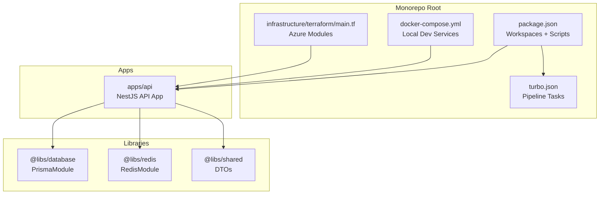
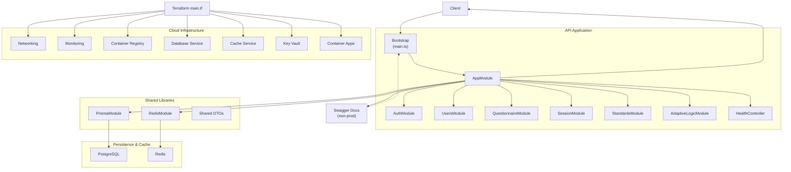
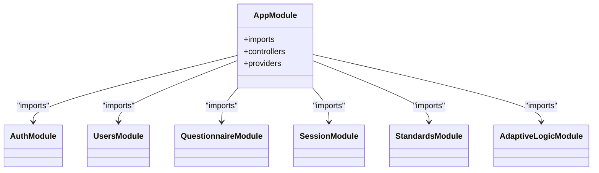
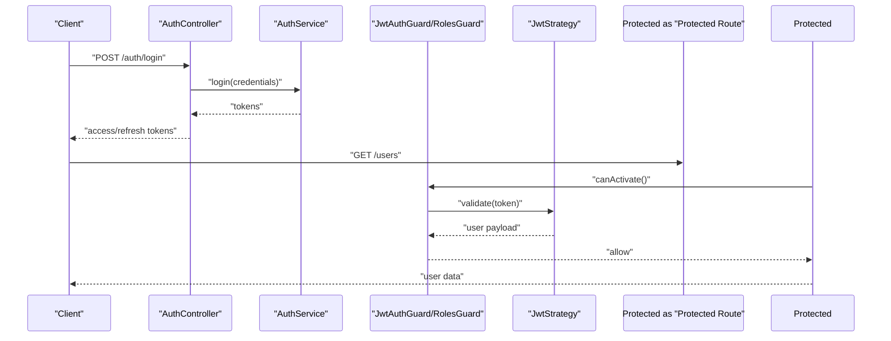
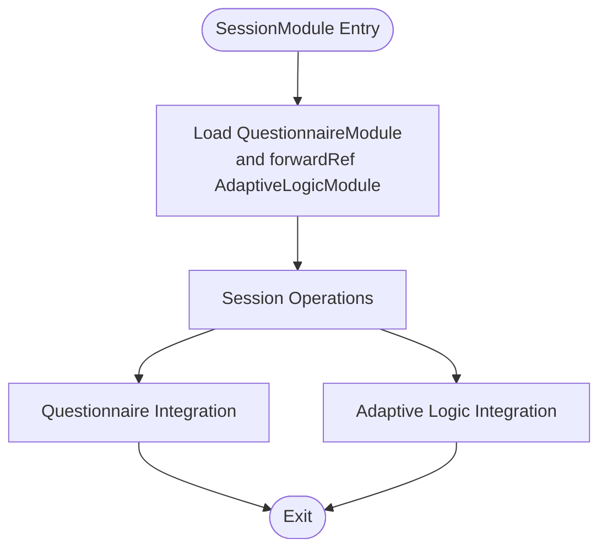
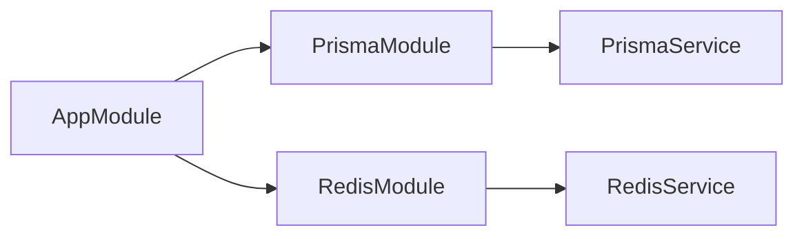
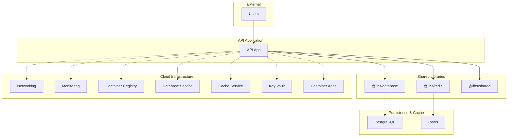
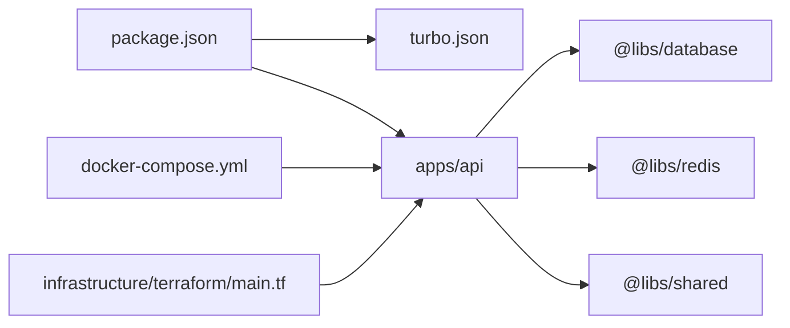

# System Design

<cite>
**Referenced Files in This Document**
- [apps/api/src/main.ts](file://apps/api/src/main.ts)
- [apps/api/src/app.module.ts](file://apps/api/src/app.module.ts)
- [apps/api/src/modules/auth/auth.module.ts](file://apps/api/src/modules/auth/auth.module.ts)
- [apps/api/src/modules/users/users.module.ts](file://apps/api/src/modules/users/users.module.ts)
- [apps/api/src/modules/questionnaire/questionnaire.module.ts](file://apps/api/src/modules/questionnaire/questionnaire.module.ts)
- [apps/api/src/modules/session/session.module.ts](file://apps/api/src/modules/session/session.module.ts)
- [apps/api/src/modules/standards/standards.module.ts](file://apps/api/src/modules/standards/standards.module.ts)
- [libs/database/src/prisma.module.ts](file://libs/database/src/prisma.module.ts)
- [libs/redis/src/redis.module.ts](file://libs/redis/src/redis.module.ts)
- [libs/shared/src/index.ts](file://libs/shared/src/index.ts)
- [package.json](file://package.json)
- [turbo.json](file://turbo.json)
- [docker-compose.yml](file://docker-compose.yml)
- [infrastructure/terraform/main.tf](file://infrastructure/terraform/main.tf)
- [apps/api/nest-cli.json](file://apps/api/nest-cli.json)
</cite>

## Table of Contents
1. [Introduction](#introduction)
2. [Project Structure](#project-structure)
3. [Core Components](#core-components)
4. [Architecture Overview](#architecture-overview)
5. [Detailed Component Analysis](#detailed-component-analysis)
6. [Dependency Analysis](#dependency-analysis)
7. [Performance Considerations](#performance-considerations)
8. [Troubleshooting Guide](#troubleshooting-guide)
9. [Conclusion](#conclusion)
10. [Appendices](#appendices)

## Introduction
This document describes the system design of the Quiz-to-build monorepo. The backend is built on the NestJS framework and orchestrated via a monorepo structure using Turbo for build orchestration. The system separates concerns across applications, libraries, and infrastructure, enabling modularity, scalability, and maintainability. The API application exposes REST endpoints for authentication, user management, standards, questionnaires, sessions, and adaptive logic, while leveraging shared libraries for database and caching, and deploying to cloud infrastructure managed by Terraform.

## Project Structure
The repository follows a classic monorepo layout:
- apps: Application code (currently one API application)
- libs: Shared libraries (database, redis, shared DTOs)
- infrastructure: Cloud infrastructure as code (Terraform)
- docker: Containerization assets for local development
- docs: Business and technical documentation
- Root scripts and configuration for build, linting, testing, and deployment

Key orchestration and configuration files:
- Root package.json defines workspaces and Turbo-driven scripts
- turbo.json configures pipeline tasks and caching
- docker-compose.yml defines local development services (PostgreSQL, Redis, API)
- apps/api/nest-cli.json configures Nest CLI settings for the API app
- infrastructure/terraform/main.tf composes networking, monitoring, registry, database, cache, key vault, and container apps modules

**Diagram sources**
- [package.json](file://package.json#L6-L9)
- [turbo.json](file://turbo.json#L4-L44)
- [docker-compose.yml](file://docker-compose.yml#L42-L68)
- [infrastructure/terraform/main.tf](file://infrastructure/terraform/main.tf#L1-L151)
- [apps/api/nest-cli.json](file://apps/api/nest-cli.json#L1-L11)

**Section sources**
- [package.json](file://package.json#L6-L9)
- [turbo.json](file://turbo.json#L1-L46)
- [docker-compose.yml](file://docker-compose.yml#L1-L77)
- [infrastructure/terraform/main.tf](file://infrastructure/terraform/main.tf#L1-L151)
- [apps/api/nest-cli.json](file://apps/api/nest-cli.json#L1-L11)

## Core Components
- Bootstrap and global configuration
  - The API bootstraps the NestJS application, sets security middleware, CORS, global prefix, validation pipe, global filters, and interceptors. It also conditionally exposes Swagger documentation in non-production environments and registers graceful shutdown hooks.
  - See [apps/api/src/main.ts](file://apps/api/src/main.ts#L11-L86).

- Application module composition
  - AppModule aggregates configuration, rate limiting, database, cache, and feature modules. It also registers a global throttling guard and exposes a health controller.
  - See [apps/api/src/app.module.ts](file://apps/api/src/app.module.ts#L16-L66).

- Shared libraries
  - Database library exports a globally available Prisma service for ORM operations.
  - Redis library exports a globally available Redis service for caching and session-related operations.
  - Shared library re-exports standardized DTOs for API responses and pagination.
  - See [libs/database/src/prisma.module.ts](file://libs/database/src/prisma.module.ts#L1-L10), [libs/redis/src/redis.module.ts](file://libs/redis/src/redis.module.ts#L1-L10), [libs/shared/src/index.ts](file://libs/shared/src/index.ts#L1-L3).

- Build and orchestration
  - Root scripts delegate to Turbo for building, developing, testing, linting, and running the API app.
  - Turbo pipeline defines task dependencies, caching, and outputs for efficient incremental builds.
  - See [package.json](file://package.json#L10-L34), [turbo.json](file://turbo.json#L4-L44).

**Section sources**
- [apps/api/src/main.ts](file://apps/api/src/main.ts#L11-L86)
- [apps/api/src/app.module.ts](file://apps/api/src/app.module.ts#L16-L66)
- [libs/database/src/prisma.module.ts](file://libs/database/src/prisma.module.ts#L1-L10)
- [libs/redis/src/redis.module.ts](file://libs/redis/src/redis.module.ts#L1-L10)
- [libs/shared/src/index.ts](file://libs/shared/src/index.ts#L1-L3)
- [package.json](file://package.json#L10-L34)
- [turbo.json](file://turbo.json#L4-L44)

## Architecture Overview
The system follows a layered, modular architecture:
- Presentation layer: NestJS controllers expose REST endpoints.
- Domain and application services: Feature modules encapsulate business logic.
- Cross-cutting concerns: Guards, interceptors, filters, and pipes handle security, logging, validation, and transformation.
- Persistence: Prisma module integrates with PostgreSQL.
- Caching: Redis module supports caching and session data.
- Infrastructure: Terraform provisions Azure resources for networking, monitoring, registry, database, cache, key vault, and container apps.

**Diagram sources**
- [apps/api/src/main.ts](file://apps/api/src/main.ts#L11-L86)
- [apps/api/src/app.module.ts](file://apps/api/src/app.module.ts#L16-L66)
- [libs/database/src/prisma.module.ts](file://libs/database/src/prisma.module.ts#L1-L10)
- [libs/redis/src/redis.module.ts](file://libs/redis/src/redis.module.ts#L1-L10)
- [infrastructure/terraform/main.tf](file://infrastructure/terraform/main.tf#L1-L151)

## Detailed Component Analysis

### NestJS Modular Architecture and AppModule Orchestration
NestJS modules define bounded contexts. AppModule acts as the root container, importing configuration, rate limiting, database, cache, and feature modules. Feature modules encapsulate domain logic and are imported by AppModule. Some modules depend on others (e.g., SessionModule imports QuestionnaireModule and uses forwardRef for AdaptiveLogicModule), demonstrating controlled coupling.

**Diagram sources**
- [apps/api/src/app.module.ts](file://apps/api/src/app.module.ts#L16-L66)
- [apps/api/src/modules/auth/auth.module.ts](file://apps/api/src/modules/auth/auth.module.ts#L11-L29)
- [apps/api/src/modules/users/users.module.ts](file://apps/api/src/modules/users/users.module.ts#L5-L10)
- [apps/api/src/modules/questionnaire/questionnaire.module.ts](file://apps/api/src/modules/questionnaire/questionnaire.module.ts#L5-L10)
- [apps/api/src/modules/session/session.module.ts](file://apps/api/src/modules/session/session.module.ts#L7-L16)
- [apps/api/src/modules/standards/standards.module.ts](file://apps/api/src/modules/standards/standards.module.ts#L6-L12)

**Section sources**
- [apps/api/src/app.module.ts](file://apps/api/src/app.module.ts#L16-L66)
- [apps/api/src/modules/auth/auth.module.ts](file://apps/api/src/modules/auth/auth.module.ts#L11-L29)
- [apps/api/src/modules/users/users.module.ts](file://apps/api/src/modules/users/users.module.ts#L5-L10)
- [apps/api/src/modules/questionnaire/questionnaire.module.ts](file://apps/api/src/modules/questionnaire/questionnaire.module.ts#L5-L10)
- [apps/api/src/modules/session/session.module.ts](file://apps/api/src/modules/session/session.module.ts#L7-L16)
- [apps/api/src/modules/standards/standards.module.ts](file://apps/api/src/modules/standards/standards.module.ts#L6-L12)

### Authentication Module
The AuthModule configures Passport with JWT, registers guards and strategies, and exposes services for authentication. It relies on ConfigModule to derive secrets and expiration settings.

**Diagram sources**
- [apps/api/src/modules/auth/auth.module.ts](file://apps/api/src/modules/auth/auth.module.ts#L11-L29)

**Section sources**
- [apps/api/src/modules/auth/auth.module.ts](file://apps/api/src/modules/auth/auth.module.ts#L11-L29)

### Session Management and Adaptive Logic
SessionModule orchestrates session lifecycle operations and collaborates with QuestionnaireModule and AdaptiveLogicModule. This demonstrates inter-module dependencies and the use of forwardRef to resolve circular dependencies safely.

**Diagram sources**
- [apps/api/src/modules/session/session.module.ts](file://apps/api/src/modules/session/session.module.ts#L7-L16)

**Section sources**
- [apps/api/src/modules/session/session.module.ts](file://apps/api/src/modules/session/session.module.ts#L7-L16)

### Database and Caching Layers
- Database: PrismaModule provides a globally available service for database operations, integrated via AppModule.
- Cache: RedisModule provides a globally available service for caching and session-related operations.

**Diagram sources**
- [apps/api/src/app.module.ts](file://apps/api/src/app.module.ts#L44-L48)
- [libs/database/src/prisma.module.ts](file://libs/database/src/prisma.module.ts#L1-L10)
- [libs/redis/src/redis.module.ts](file://libs/redis/src/redis.module.ts#L1-L10)

**Section sources**
- [apps/api/src/app.module.ts](file://apps/api/src/app.module.ts#L44-L48)
- [libs/database/src/prisma.module.ts](file://libs/database/src/prisma.module.ts#L1-L10)
- [libs/redis/src/redis.module.ts](file://libs/redis/src/redis.module.ts#L1-L10)

### Shared DTOs
The shared library exports standardized DTOs for API responses and pagination, ensuring consistent serialization across modules.

**Section sources**
- [libs/shared/src/index.ts](file://libs/shared/src/index.ts#L1-L3)

### System Context Diagram
This diagram shows the API application’s boundaries and its interactions with shared libraries, persistence, cache, and cloud infrastructure.

**Diagram sources**
- [apps/api/src/app.module.ts](file://apps/api/src/app.module.ts#L16-L66)
- [libs/database/src/prisma.module.ts](file://libs/database/src/prisma.module.ts#L1-L10)
- [libs/redis/src/redis.module.ts](file://libs/redis/src/redis.module.ts#L1-L10)
- [infrastructure/terraform/main.tf](file://infrastructure/terraform/main.tf#L20-L150)

## Dependency Analysis
- Monorepo workspaces and build orchestration
  - Root package.json declares workspaces for apps and libs and delegates commands to Turbo.
  - Turbo pipeline defines task dependencies (e.g., build depends on upstream build), persistent tasks for dev servers, and cacheable outputs for coverage and dist artifacts.
  - See [package.json](file://package.json#L6-L9), [turbo.json](file://turbo.json#L4-L44).

- Local development stack
  - docker-compose.yml defines services for PostgreSQL, Redis, and the API app, wiring environment variables and health checks.
  - See [docker-compose.yml](file://docker-compose.yml#L4-L77).

- Cloud infrastructure
  - infrastructure/terraform/main.tf composes networking, monitoring, registry, database, cache, key vault, and container apps modules, provisioning Azure resources and connecting them to the API.
  - See [infrastructure/terraform/main.tf](file://infrastructure/terraform/main.tf#L1-L151).

**Diagram sources**
- [package.json](file://package.json#L6-L9)
- [turbo.json](file://turbo.json#L4-L44)
- [docker-compose.yml](file://docker-compose.yml#L42-L68)
- [infrastructure/terraform/main.tf](file://infrastructure/terraform/main.tf#L1-L151)

**Section sources**
- [package.json](file://package.json#L6-L9)
- [turbo.json](file://turbo.json#L4-L44)
- [docker-compose.yml](file://docker-compose.yml#L42-L68)
- [infrastructure/terraform/main.tf](file://infrastructure/terraform/main.tf#L1-L151)

## Performance Considerations
- Build and test performance
  - Turbo caches outputs and runs tasks in parallel across packages, reducing rebuild times and enabling incremental development.
  - See [turbo.json](file://turbo.json#L4-L44).

- Runtime performance
  - Global ValidationPipe enforces input sanitization and transformation.
  - Global Interceptors standardize logging and response transformation.
  - Global Filters centralize exception handling.
  - See [apps/api/src/main.ts](file://apps/api/src/main.ts#L34-L49).

- Scalability
  - Container Apps in Azure allows horizontal scaling with min/max replicas and auto-scaling policies.
  - Redis and PostgreSQL are provisioned as managed services to support higher loads.
  - See [infrastructure/terraform/main.tf](file://infrastructure/terraform/main.tf#L106-L150).

[No sources needed since this section provides general guidance]

## Troubleshooting Guide
- Bootstrapping and startup
  - Bootstrap logs environment and base URL; errors during startup are captured and cause process exit.
  - See [apps/api/src/main.ts](file://apps/api/src/main.ts#L88-L92).

- Global error handling
  - Global HttpExceptionFilter ensures consistent error responses across the API.
  - See [apps/api/src/main.ts](file://apps/api/src/main.ts#L46-L46).

- Validation failures
  - ValidationPipe rejects non-whitelisted fields and transforms inputs; review DTOs and request payloads accordingly.
  - See [apps/api/src/main.ts](file://apps/api/src/main.ts#L34-L43).

- Local development connectivity
  - Verify docker-compose health checks for PostgreSQL and Redis; confirm environment variables for DATABASE_URL and Redis host/port.
  - See [docker-compose.yml](file://docker-compose.yml#L17-L21), [docker-compose.yml](file://docker-compose.yml#L33-L37), [docker-compose.yml](file://docker-compose.yml#L51-L58).

**Section sources**
- [apps/api/src/main.ts](file://apps/api/src/main.ts#L34-L49)
- [apps/api/src/main.ts](file://apps/api/src/main.ts#L88-L92)
- [docker-compose.yml](file://docker-compose.yml#L17-L21)
- [docker-compose.yml](file://docker-compose.yml#L33-L37)
- [docker-compose.yml](file://docker-compose.yml#L51-L58)

## Conclusion
The Quiz-to-build system employs a clean, modular architecture centered on NestJS and Turbo. AppModule orchestrates feature modules while shared libraries encapsulate cross-cutting concerns like persistence and caching. The API is designed for scalability with managed cloud services and supports rapid iteration through monorepo tooling. This structure promotes separation of concerns, maintainability, and operational reliability.

[No sources needed since this section summarizes without analyzing specific files]

## Appendices

### Technology Stack Decisions
- NestJS
  - Provides a structured, modular framework with strong TypeScript support, dependency injection, and built-in features like guards, interceptors, and pipes that align with the system’s cross-cutting concerns.
  - Enables clear separation of concerns and testability across modules.

- Turbo
  - Offers fast, parallelized builds and tests across the monorepo, with intelligent caching and task orchestration.

- Prisma
  - ORM integration with PostgreSQL, supporting schema migrations and type-safe queries.

- Redis
  - Managed caching and session storage for improved performance and scalability.

- Terraform (Azure)
  - Infrastructure provisioning for networking, monitoring, registry, database, cache, key vault, and container apps, enabling repeatable deployments and environment parity.

[No sources needed since this section provides general guidance]