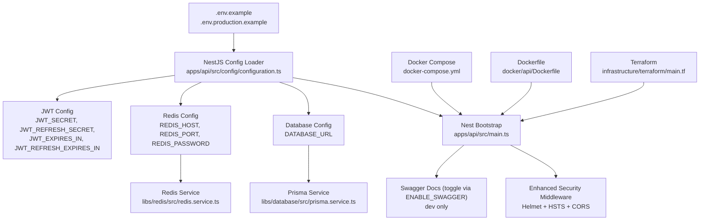
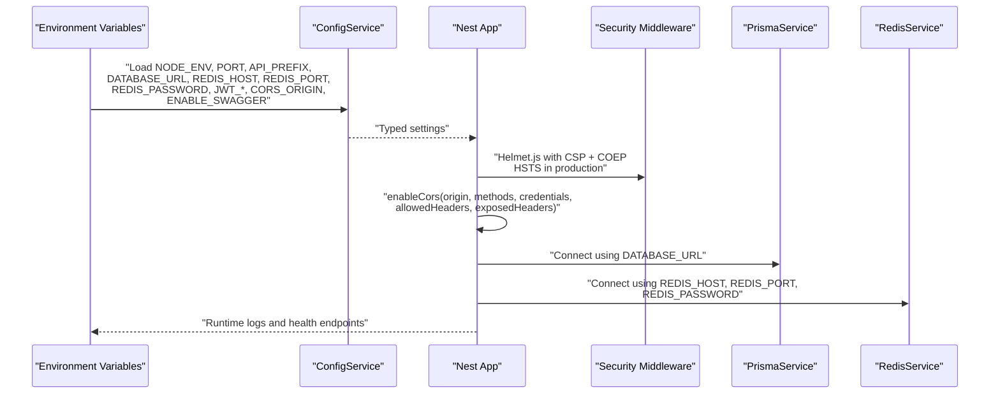
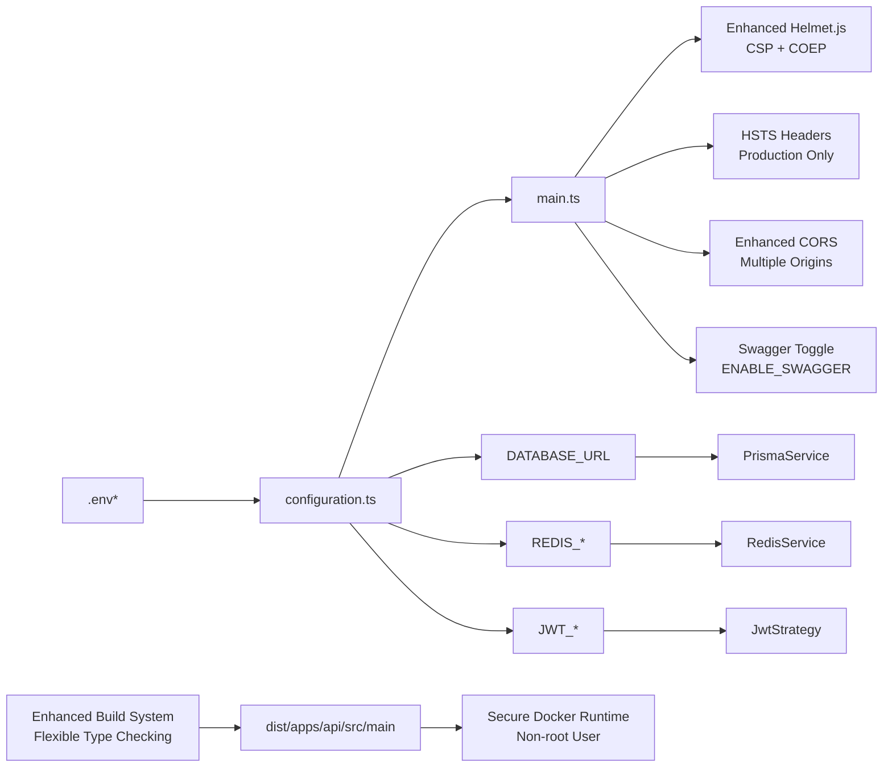

# Configuration and Environment

<cite>
**Referenced Files in This Document**
- [.env.example](file://.env.example)
- [.env.production.example](file://.env.production.example)
- [docker-compose.yml](file://docker-compose.yml)
- [apps/api/src/config/configuration.ts](file://apps/api/src/config/configuration.ts)
- [apps/api/src/main.ts](file://apps/api/src/main.ts)
- [apps/api/src/app.module.ts](file://apps/api/src/app.module.ts)
- [libs/database/src/prisma.service.ts](file://libs/database/src/prisma.service.ts)
- [libs/database/src/prisma.module.ts](file://libs/database/src/prisma.module.ts)
- [libs/redis/src/redis.service.ts](file://libs/redis/src/redis.service.ts)
- [libs/redis/src/redis.module.ts](file://libs/redis/src/redis.module.ts)
- [docker/api/Dockerfile](file://docker/api/Dockerfile)
- [docker/api/entrypoint.sh](file://docker/api/entrypoint.sh)
- [docker/postgres/init.sql](file://docker/postgres/init.sql)
- [infrastructure/terraform/main.tf](file://infrastructure/terraform/main.tf)
- [infrastructure/terraform/modules/container-apps/main.tf](file://infrastructure/terraform/modules/container-apps/main.tf)
- [infrastructure/terraform/modules/container-apps/variables.tf](file://infrastructure/terraform/modules/container-apps/variables.tf)
- [apps/api/src/modules/auth/strategies/jwt.strategy.ts](file://apps/api/src/modules/auth/strategies/jwt.strategy.ts)
- [apps/api/nest-cli.json](file://apps/api/nest-cli.json)
- [apps/api/tsconfig.json](file://apps/api/tsconfig.json)
- [apps/api/tsconfig.build.json](file://apps/api/tsconfig.build.json)
- [tsconfig.json](file://tsconfig.json)
- [libs/shared/tsconfig.json](file://libs/shared/tsconfig.json)
- [apps/api/package.json](file://apps/api/package.json)
- [package.json](file://package.json)
- [turbo.json](file://turbo.json)
</cite>

## Update Summary
**Changes Made**
- Enhanced security configurations with Helmet.js middleware including Content Security Policy and Cross-Origin Embedder Policy
- Added HTTP Strict Transport Security (HSTS) for production environments
- Improved CORS configuration with support for multiple origins and enhanced security headers
- Added Swagger documentation toggle via ENABLE_SWAGGER environment variable
- **Updated**: Simplified NestJS configuration by removing explicit entryFile property, streamlining the build system
- **Updated**: Restructured TypeScript build configuration with centralized path mappings and relaxed strictness settings for improved readability and maintainability
- Consolidated configuration system with streamlined environment variable management
- Updated Docker build process with enhanced security and production readiness

## Table of Contents
1. [Introduction](#introduction)
2. [Project Structure](#project-structure)
3. [Core Components](#core-components)
4. [Architecture Overview](#architecture-overview)
5. [Detailed Component Analysis](#detailed-component-analysis)
6. [Build System Configuration](#build-system-configuration)
7. [Dependency Analysis](#dependency-analysis)
8. [Performance Considerations](#performance-considerations)
9. [Troubleshooting Guide](#troubleshooting-guide)
10. [Conclusion](#conclusion)
11. [Appendices](#appendices)

## Introduction
This document explains how configuration and environment management work in the Quiz-to-build system. It covers environment variables for application settings, database connections, Redis caching, JWT secrets, rate limiting, logging, and CORS. It also documents the configuration hierarchy, enhanced security settings including Helmet.js middleware with Content Security Policy, HTTP Strict Transport Security (HSTS), improved CORS configuration, and Docker environment setup, container networking and volumes, production versus development differences, and best practices for sensitive data management. Finally, it provides examples for local, staging, and production deployments, along with validation, defaults, error handling, and secrets rotation guidelines.

**Updated**: The TypeScript configuration system has been streamlined with centralized path mappings and relaxed strictness settings, improving build consistency and reducing configuration complexity while maintaining the same functionality across the monorepo structure. The NestJS configuration has been simplified by removing the explicit entryFile property, relying on the default TypeScript configuration for entry point resolution.

## Project Structure
The configuration system spans several layers:
- Environment variable templates for local and production use
- NestJS configuration loader that reads environment variables and exposes typed settings
- Services that consume configuration (database via Prisma, Redis via ioredis)
- Docker Compose for local orchestration and Dockerfile for container builds
- Terraform for production provisioning and secret injection

**Diagram sources**
- [.env.example](file://.env.example#L1-L33)
- [.env.production.example](file://.env.production.example#L1-L72)
- [apps/api/src/config/configuration.ts](file://apps/api/src/config/configuration.ts#L1-L49)
- [apps/api/src/main.ts](file://apps/api/src/main.ts#L20-L42)
- [libs/database/src/prisma.service.ts](file://libs/database/src/prisma.service.ts#L1-L62)
- [libs/redis/src/redis.service.ts](file://libs/redis/src/redis.service.ts#L1-L96)
- [docker-compose.yml](file://docker-compose.yml#L1-L81)
- [docker/api/Dockerfile](file://docker/api/Dockerfile#L1-L114)
- [infrastructure/terraform/main.tf](file://infrastructure/terraform/main.tf#L1-L151)

**Section sources**
- [.env.example](file://.env.example#L1-L33)
- [.env.production.example](file://.env.production.example#L1-L72)
- [apps/api/src/config/configuration.ts](file://apps/api/src/config/configuration.ts#L1-L49)
- [apps/api/src/main.ts](file://apps/api/src/main.ts#L20-L42)
- [docker-compose.yml](file://docker-compose.yml#L1-L81)
- [docker/api/Dockerfile](file://docker/api/Dockerfile#L1-L114)
- [infrastructure/terraform/main.tf](file://infrastructure/terraform/main.tf#L1-L151)

## Core Components
- Application settings: environment, port, API prefix
- Database: connection URL
- Redis: host, port, optional password
- JWT: secrets and expiration policies
- Security: bcrypt cost factor, enhanced with Helmet.js and HSTS
- Rate limiting: TTL, limits, login-specific limit
- Logging: log level
- CORS: allowed origin(s) with multiple origin support
- Swagger: toggle via ENABLE_SWAGGER environment variable

Defaults and parsing:
- Numeric values are parsed from environment variables with safe defaults
- CORS origin defaults to allowing all origins, supports comma-separated multiple origins
- JWT secrets have development-friendly defaults for local runs
- Swagger is enabled by default except in production environments

Security highlights:
- Helmet middleware is enabled globally with Content Security Policy and Cross-Origin Embedder Policy
- HSTS headers are automatically added in production environments
- CORS is configured with credentials support, explicit methods, and enhanced security headers
- JWT strategy uses secrets from configuration and is protected by security middleware
- Enhanced security headers include X-Content-Type-Options, X-Frame-Options, and X-XSS-Protection

**Section sources**
- [apps/api/src/config/configuration.ts](file://apps/api/src/config/configuration.ts#L1-L49)
- [apps/api/src/main.ts](file://apps/api/src/main.ts#L20-L42)
- [apps/api/src/modules/auth/strategies/jwt.strategy.ts](file://apps/api/src/modules/auth/strategies/jwt.strategy.ts#L13-L17)

## Architecture Overview
The configuration pipeline with enhanced security:
- Environment variables are defined locally and in production templates
- The NestJS ConfigService loads and parses them into typed settings
- Services (Prisma, Redis) read their configuration from the ConfigService
- The application bootstrapper applies enhanced security middleware, CORS, global prefix, and Swagger (dev only)
- Production environments automatically receive HSTS headers and enhanced security policies

**Diagram sources**
- [apps/api/src/config/configuration.ts](file://apps/api/src/config/configuration.ts#L1-L49)
- [apps/api/src/main.ts](file://apps/api/src/main.ts#L20-L42)
- [libs/database/src/prisma.service.ts](file://libs/database/src/prisma.service.ts#L8-L18)
- [libs/redis/src/redis.service.ts](file://libs/redis/src/redis.service.ts#L10-L28)

## Detailed Component Analysis

### Environment Variables and Templates
- Local template defines development defaults for application, database, Redis, JWT, bcrypt, rate limiting, logging, and CORS.
- Production template defines production-safe defaults and placeholders for secrets and cloud services.
- **Updated**: Added ENABLE_SWAGGER environment variable for controlling Swagger documentation availability.

Key variables:
- Application: NODE_ENV, PORT, API_PREFIX
- Database: DATABASE_URL
- Redis: REDIS_HOST, REDIS_PORT, REDIS_PASSWORD
- JWT: JWT_SECRET, JWT_EXPIRES_IN, JWT_REFRESH_SECRET, JWT_REFRESH_EXPIRES_IN
- Security: BCRYPT_ROUNDS, **enhanced with Helmet.js and HSTS**
- Rate limiting: THROTTLE_TTL, THROTTLE_LIMIT, THROTTLE_LOGIN_LIMIT
- Logging: LOG_LEVEL
- CORS: CORS_ORIGIN (supports comma-separated multiple origins)
- **New**: Swagger control: ENABLE_SWAGGER (default true except in production)

Defaults and examples:
- Defaults are embedded in the configuration loader and templates
- CORS_ORIGIN now supports multiple origins separated by commas
- Production examples show Azure-specific values and require replacing placeholders
- Swagger is automatically disabled in production environments

**Section sources**
- [.env.example](file://.env.example#L1-L33)
- [.env.production.example](file://.env.production.example#L1-L72)
- [apps/api/src/config/configuration.ts](file://apps/api/src/config/configuration.ts#L3-L47)

### Configuration Loader and Hierarchy
The loader centralizes environment parsing and provides defaults. It exposes nested objects for database, redis, jwt, bcrypt, throttle, cors, and logging.

Behavior:
- Numeric values are parsed with base 10
- Strings are taken as-is with fallback defaults
- Redis password is optional and may be omitted
- CORS origin defaults to broad allowance for local development but supports multiple origins
- **Updated**: Enhanced with production-specific security configurations

Integration:
- The loader is consumed by the NestJS application bootstrap
- Services access configuration via the ConfigService
- **Updated**: Streamlined configuration system with consolidated environment variable management and simplified NestJS entry point resolution

**Section sources**
- [apps/api/src/config/configuration.ts](file://apps/api/src/config/configuration.ts#L1-L49)
- [apps/api/src/main.ts](file://apps/api/src/main.ts#L15-L18)

### Enhanced Security Settings
- **Updated**: Helmet middleware is applied globally with enhanced security configurations
- **New**: Content Security Policy (CSP) with production defaults and development disable option
- **New**: Cross-Origin Embedder Policy (COEP) enabled in production for enhanced security
- **New**: HTTP Strict Transport Security (HSTS) headers automatically added in production
- CORS is enabled with credentials support, explicit methods, and enhanced security headers
- JWT strategy uses secrets from configuration for signing and verification
- JWT guard handles token expiration and malformed token errors

Operational notes:
- In production, configure CORS_ORIGIN to match the frontend domain(s)
- Use long, random secrets for JWT and rotate them periodically
- HSTS forces HTTPS connections with 1-year validity period
- CSP prevents XSS attacks and ensures secure content loading
- COEP prevents mixed content and ensures secure cross-origin embedding

**Section sources**
- [apps/api/src/main.ts](file://apps/api/src/main.ts#L20-L42)
- [apps/api/src/modules/auth/strategies/jwt.strategy.ts](file://apps/api/src/modules/auth/strategies/jwt.strategy.ts#L13-L17)
- [apps/api/src/modules/auth/guards/jwt-auth.guard.ts](file://apps/api/src/modules/auth/guards/jwt-auth.guard.ts#L25-L33)

### Database Configuration and Pooling
- Connection URL is read from DATABASE_URL
- Prisma client is initialized with logging and error formatting
- Slow query logging is enabled in development
- No explicit Prisma client pool configuration is present; defaults apply

Operational notes:
- Use a robust database URL in production (e.g., cloud provider with SSL)
- Monitor slow queries during development
- Keep migrations and schema in sync with Prisma
- **Updated**: Enhanced security with production-ready database configurations

**Section sources**
- [apps/api/src/config/configuration.ts](file://apps/api/src/config/configuration.ts#L8-L10)
- [libs/database/src/prisma.service.ts](file://libs/database/src/prisma.service.ts#L8-L18)
- [libs/database/src/prisma.module.ts](file://libs/database/src/prisma.module.ts#L1-L10)

### Redis Configuration and Connection Management
- Host, port, and optional password are read from environment variables
- ioredis client is configured with a simple retry strategy
- Connection events are logged; errors are captured
- Provides helpers for basic operations (get/set/del/exists/incr/expire/hset/hget/hgetall/hdel/keys/flushdb)

Operational notes:
- In production, use TLS-enabled Redis (Azure Redis uses port 6380)
- Ensure password is set appropriately for managed services
- Use TTL-aware operations for cache entries
- **Updated**: Enhanced security with production-ready Redis configurations

**Section sources**
- [apps/api/src/config/configuration.ts](file://apps/api/src/config/configuration.ts#L12-L17)
- [libs/redis/src/redis.service.ts](file://libs/redis/src/redis.service.ts#L10-L28)
- [libs/redis/src/redis.module.ts](file://libs/redis/src/redis.module.ts#L1-L10)

### Enhanced CORS Configuration
- **Updated**: Origin is configurable via environment variable with support for multiple origins
- **New**: Methods are explicitly allowed with comprehensive HTTP method support
- **New**: Credentials are supported with enhanced security
- **New**: Additional headers are configured for comprehensive CORS support

Guidelines:
- Set CORS_ORIGIN to the frontend domain(s) in production (comma-separated)
- Restrict methods and origins in production for least privilege
- **Updated**: Enhanced security headers and comprehensive CORS configuration

**Section sources**
- [apps/api/src/config/configuration.ts](file://apps/api/src/config/configuration.ts#L39-L42)
- [apps/api/src/main.ts](file://apps/api/src/main.ts#L34-L42)

### Docker Environment Setup
Local compose:
- Postgres service with health checks, mounted volumes, and initialization SQL
- Redis service with persistence and health checks
- API service built from Dockerfile, exposing port 3000, injecting environment variables, and mounting source code

Networking:
- All services share a bridge network named for isolation

Volumes:
- Persistent volumes for Postgres and Redis data

Health checks:
- Postgres health check via pg_isready
- Redis health check via redis-cli ping
- API health check via HTTP GET to /health

**Updated**: Enhanced Docker build process with improved security and production readiness:
- Multi-stage Docker build with Debian slim base images for better Prisma compatibility
- OpenSSL installation for Prisma binary compatibility
- Non-root user execution for security best practices
- Health checks with comprehensive monitoring
- Entry point script with database migration support
- **Updated**: Simplified entry point execution using tsconfig-paths/register for improved path resolution

**Section sources**
- [docker-compose.yml](file://docker-compose.yml#L1-L81)
- [docker/api/Dockerfile](file://docker/api/Dockerfile#L1-L114)
- [docker/api/entrypoint.sh](file://docker/api/entrypoint.sh#L1-L11)
- [docker/postgres/init.sql](file://docker/postgres/init.sql#L1-L21)

### Production vs Development Configuration Differences
- Environment: NODE_ENV differs between development and production
- Port and API prefix remain consistent
- Database URL points to cloud provider in production
- Redis host/port/password point to managed cache in production
- JWT secrets are required to be strong and rotated
- Logging level is reduced in production
- CORS_ORIGIN is restricted to trusted domains (supports multiple origins)
- **New**: Swagger is automatically disabled in production environments
- Optional Application Insights connection string and Azure Key Vault URI are provided for observability and secrets management
- **New**: Enhanced security configurations with Helmet.js, HSTS, and CSP

**Section sources**
- [.env.example](file://.env.example#L2-L4)
- [.env.production.example](file://.env.production.example#L7-L9)
- [.env.production.example](file://.env.production.example#L14-L23)
- [.env.production.example](file://.env.production.example#L20-L32)
- [.env.production.example](file://.env.production.example#L49)
- [.env.production.example](file://.env.production.example#L55)
- [.env.production.example](file://.env.production.example#L60)
- [.env.production.example](file://.env.production.example#L65-L66)

### Deployment Examples

#### Local Development
- Use .env.example as a starting point
- Run docker-compose to spin up Postgres, Redis, and the API
- Access the API at http://localhost:3000 with Swagger available in non-production environments
- **Updated**: Enhanced security configurations are automatically applied in development mode

**Section sources**
- [.env.example](file://.env.example#L1-L33)
- [docker-compose.yml](file://docker-compose.yml#L42-L68)

#### Staging
- Mirror production secrets and URLs
- Set CORS_ORIGIN to the staging frontend domain(s)
- Use managed database and cache with TLS
- **Updated**: Enhanced security configurations with production-like settings

**Section sources**
- [.env.production.example](file://.env.production.example#L14-L23)
- [.env.production.example](file://.env.production.example#L55)

#### Production
- Provision infrastructure via Terraform modules
- Inject secrets into Container Apps from Key Vault
- Configure probes and environment variables per module
- **Updated**: Automatic HSTS headers, enhanced security policies, and production-ready configurations

**Section sources**
- [infrastructure/terraform/main.tf](file://infrastructure/terraform/main.tf#L106-L150)
- [infrastructure/terraform/modules/container-apps/main.tf](file://infrastructure/terraform/modules/container-apps/main.tf#L56-L104)

### Configuration Validation, Defaults, and Error Handling
Validation and defaults:
- Numeric values are parsed with safe defaults
- CORS origin defaults to broad allowance for local development but supports multiple origins
- JWT secrets have development defaults; replace in production
- **Updated**: Enhanced validation with production security requirements

Error handling:
- Application startup logs errors and exits on failure
- Redis emits error events for connectivity issues
- Prisma logs slow queries in development
- **Updated**: Enhanced error handling with security middleware integration

Recommendations:
- Validate presence of required secrets before startup
- Add explicit checks for empty or invalid values in CI/CD
- Use environment-specific templates and enforce strict linting
- **Updated**: Implement security validation for production deployments

**Section sources**
- [apps/api/src/config/configuration.ts](file://apps/api/src/config/configuration.ts#L3-L47)
- [apps/api/src/main.ts](file://apps/api/src/main.ts#L88-L92)
- [libs/redis/src/redis.service.ts](file://libs/redis/src/redis.service.ts#L25-L27)
- [libs/database/src/prisma.service.ts](file://libs/database/src/prisma.service.ts#L25-L33)

### Managing Configuration Changes and Secrets Rotation
- Use environment-specific templates (.env.example, .env.production.example)
- For production, inject secrets via platform-managed secrets (e.g., Azure Key Vault) and pass them to containers
- Rotate JWT secrets by updating secrets and redeploying; invalidate sessions as part of the rollout
- Validate configuration in CI before deploying
- **Updated**: Enhanced security configurations require careful validation during changes

**Section sources**
- [.env.production.example](file://.env.production.example#L28-L32)
- [infrastructure/terraform/modules/container-apps/main.tf](file://infrastructure/terraform/modules/container-apps/main.tf#L61-L79)
- [infrastructure/terraform/modules/container-apps/variables.tf](file://infrastructure/terraform/modules/container-apps/variables.tf#L100-L110)

## Build System Configuration

**Updated** The Quiz-to-build system now uses a streamlined TypeScript configuration architecture with centralized path mappings, standardized library import configurations, and enhanced security configurations. This consolidation improves build consistency and reduces configuration complexity while maintaining the same functionality across the monorepo structure.

**Updated**: The TypeScript compiler settings have been modified to provide more flexible type checking while accommodating legacy code patterns and specific architectural requirements. The changes include:

- **Disabled strict property initialization** in the root configuration to allow properties to be initialized later in constructors
- **Excluded unused local variables from strict checking** to accommodate legacy code patterns
- **Excluded unused parameters from strict checking** to maintain flexibility for callback functions and event handlers

These changes are reflected across the entire monorepo in the root configuration and inherited by all library configurations.

### Centralized TypeScript Configuration Architecture

**Updated** The build system employs a hierarchical TypeScript configuration approach with centralized path mappings in the root configuration:

- **Root Configuration** (`tsconfig.json`): Consolidates all shared compiler options and library path mappings for the entire monorepo, with relaxed strictness settings for legacy compatibility
- **Application Configuration** (`apps/api/tsconfig.json`): Extends root configuration with application-specific settings
- **Build Configuration** (`apps/api/tsconfig.build.json`): Extends root configuration with optimized build settings for production, inheriting the relaxed strictness settings

**Centralized Path Mappings**:
- **Library Paths**: All libraries (@libs/database, @libs/redis, @libs/shared) have standardized path mappings in the root configuration
- **Application Paths**: "@app/*" mapping for internal application modules
- **Wildcard Support**: Each library path includes wildcard patterns for deep module imports

**Standardized Library Import Configurations**:
- **Database Library**: "@libs/database" → "libs/database/src"
- **Redis Library**: "@libs/redis" → "libs/redis/src"  
- **Shared Library**: "@libs/shared" → "libs/shared/src"

**Relaxed Type Checking Settings**:
- **Strict Property Initialization**: Disabled to accommodate constructor patterns where properties are initialized later
- **Unused Local Variables**: Excluded from strict checking to support legacy code patterns
- **Unused Parameters**: Excluded from strict checking to maintain flexibility for callbacks and event handlers

### Enhanced Path Resolution and Module Import System

**Updated** The path resolution system now provides consistent module import behavior across development and build environments:

- **Development Configuration** (`apps/api/tsconfig.json`): Includes test files and additional debugging options
- **Build Configuration** (`apps/api/tsconfig.build.json`): Optimized for production with stricter exclusions, inheriting relaxed strictness settings
- **Root Configuration** (`tsconfig.json`): Centralized path mappings for all libraries with flexible type checking

**Path Resolution Features**:
- **Consistent Imports**: "@libs/database" resolves to the same source regardless of import location
- **Deep Module Access**: Wildcard patterns enable importing from subdirectories within libraries
- **Build-Time Resolution**: Path mappings are resolved during compilation, not runtime

### Simplified NestJS Compiler Integration

**Updated** The build system integrates seamlessly with NestJS CLI for optimal compilation with simplified configuration:

- **Entry File Configuration**: No explicit entryFile property required - relies on default TypeScript configuration for entry point resolution
- **Compiler Options**: Uses "tsConfigPath": "tsconfig.build.json" to target build-specific settings
- **Webpack Control**: "webpack": false disables webpack for direct TypeScript compilation
- **Output Directory**: "deleteOutDir": true ensures clean build artifacts

**Updated**: The NestJS configuration has been simplified by removing the explicit entryFile property, allowing the framework to automatically resolve the entry point from the TypeScript configuration. This change reduces configuration complexity while maintaining the same build functionality.

### Multi-Stage Docker Build Process

**Updated** The Docker build process has been enhanced to handle the centralized TypeScript configuration system and enhanced security requirements:

- **Build Stage**: Compiles using `npm run build --workspace=api` with the build-specific TypeScript configuration
- **Production Stage**: Multi-stage build with Debian slim base images for better Prisma compatibility
- **Security Enhancements**: OpenSSL installation for Prisma binary compatibility, non-root user execution
- **Path Resolution Fix**: Creates symbolic directories to resolve library path mappings correctly
- **Migration Integration**: Includes Prisma database migration step in production startup
- **Health Checks**: Comprehensive health monitoring for container readiness
- **Updated**: Simplified entry point execution using tsconfig-paths/register for improved path resolution

**Docker Build Optimizations**:
- **Slim Base Images**: Uses Node.js 20-bookworm-slim images for better Prisma compatibility
- **OpenSSL Installation**: Essential for Prisma binary compatibility
- **Non-Root User**: Security best practices with dedicated user account
- **Health Checks**: Comprehensive health monitoring for container readiness

### Turbo Build Pipeline Integration

**Updated** The build system leverages Turbo for efficient monorepo-wide builds:

- **Pipeline Configuration**: `turbo.json` orchestrates build dependencies across applications and libraries
- **Cache Optimization**: Shared caching across build steps for faster incremental builds
- **Parallel Execution**: Concurrent builds for multiple packages when dependencies allow
- **Output Tracking**: Monitors `dist/**` outputs for proper cache invalidation

**Build Pipeline Features**:
- **Global Dependencies**: Watches `.env` file for environment changes
- **Persistent Dev Mode**: Long-running development processes with caching disabled
- **Production Optimization**: Clean builds with dependency chains for proper ordering

### Enhanced Security in Build System

**Updated** The build system now includes enhanced security configurations:

- **Production Security**: Automatic HSTS headers, CSP, and COEP in production builds
- **Development Security**: Security configurations disabled in development for flexibility
- **Environment-Based Security**: Security features automatically enabled/disabled based on NODE_ENV
- **Container Security**: Non-root user execution and hardened container configurations

**Section sources**
- [tsconfig.json](file://tsconfig.json#L26-L48)
- [apps/api/tsconfig.json](file://apps/api/tsconfig.json#L6-L25)
- [apps/api/tsconfig.build.json](file://apps/api/tsconfig.build.json#L1-L22)
- [apps/api/nest-cli.json](file://apps/api/nest-cli.json#L5-L9)
- [docker/api/Dockerfile](file://docker/api/Dockerfile#L1-L114)
- [turbo.json](file://turbo.json#L1-L46)
- [libs/shared/tsconfig.json](file://libs/shared/tsconfig.json#L20-L20)

## Dependency Analysis
Configuration dependencies across modules with enhanced security:

**Diagram sources**
- [apps/api/src/config/configuration.ts](file://apps/api/src/config/configuration.ts#L1-L49)
- [apps/api/src/main.ts](file://apps/api/src/main.ts#L20-L42)
- [libs/database/src/prisma.service.ts](file://libs/database/src/prisma.service.ts#L8-L18)
- [libs/redis/src/redis.service.ts](file://libs/redis/src/redis.service.ts#L10-L19)
- [apps/api/src/modules/auth/strategies/jwt.strategy.ts](file://apps/api/src/modules/auth/strategies/jwt.strategy.ts#L13-L17)
- [apps/api/tsconfig.build.json](file://apps/api/tsconfig.build.json#L1-L22)
- [docker/api/Dockerfile](file://docker/api/Dockerfile#L41-L60)

**Section sources**
- [apps/api/src/config/configuration.ts](file://apps/api/src/config/configuration.ts#L1-L49)
- [apps/api/src/main.ts](file://apps/api/src/main.ts#L20-L42)
- [libs/database/src/prisma.service.ts](file://libs/database/src/prisma.service.ts#L1-L62)
- [libs/redis/src/redis.service.ts](file://libs/redis/src/redis.service.ts#L1-L96)
- [apps/api/src/modules/auth/strategies/jwt.strategy.ts](file://apps/api/src/modules/auth/strategies/jwt.strategy.ts#L1-L29)
- [apps/api/tsconfig.build.json](file://apps/api/tsconfig.build.json#L1-L22)
- [docker/api/Dockerfile](file://docker/api/Dockerfile#L41-L60)

## Performance Considerations
- Database: ensure DATABASE_URL points to a scalable cloud database; monitor slow queries in development
- Redis: use TLS-enabled endpoints in production; tune retry strategy for transient failures
- Logging: reduce verbosity in production to minimize I/O overhead
- CORS: restrict origins and methods to reduce preflight overhead
- Build System: centralized TypeScript configuration reduces compilation overhead and improves cache hit rates
- TypeScript Configuration: standardized library imports eliminate redundant path resolution overhead
- Path Resolution: centralized path mappings improve module resolution performance across the monorepo
- **New**: Enhanced security configurations add minimal overhead while providing significant security benefits
- **New**: Production security features (HSTS, CSP, COEP) are optimized for performance impact
- **Updated**: Relaxed type checking settings improve compilation performance for legacy code while maintaining type safety
- **Updated**: Simplified NestJS configuration reduces build complexity and improves entry point resolution reliability

## Troubleshooting Guide
Common issues and resolutions:
- Application fails to start: check environment variables and templates; review bootstrap error logs
- Database connection failures: verify DATABASE_URL and network connectivity; confirm schema initialization
- Redis connection failures: verify host, port, and password; ensure TLS settings match provider requirements
- JWT authentication errors: confirm JWT secrets are set and rotated consistently; check token expiration
- CORS blocked requests: ensure CORS_ORIGIN matches the requesting origin; verify multiple origin configuration
- Build failures: verify entry file path consistency between TypeScript configuration and NestJS CLI settings
- Docker deployment issues: ensure nested path structure is preserved during multi-stage build process
- TypeScript configuration conflicts: check that centralized path mappings don't conflict with local overrides
- Path resolution errors: verify library path mappings in the root TypeScript configuration are correct
- Module import failures: ensure "@libs/*" imports resolve to the correct source directories
- **New**: Security configuration issues: verify Helmet.js CSP/COEP settings match environment requirements
- **New**: HSTS configuration problems: ensure proper HTTPS setup before enabling production HSTS
- **New**: Swagger accessibility issues: verify ENABLE_SWAGGER environment variable setting
- **Updated**: Type checking issues: verify that relaxed strictness settings accommodate legacy code patterns without introducing runtime errors
- **Updated**: NestJS entry point resolution: verify that simplified configuration allows automatic entry point detection

**Section sources**
- [apps/api/src/main.ts](file://apps/api/src/main.ts#L88-L92)
- [libs/database/src/prisma.service.ts](file://libs/database/src/prisma.service.ts#L20-L40)
- [libs/redis/src/redis.service.ts](file://libs/redis/src/redis.service.ts#L21-L27)
- [apps/api/src/modules/auth/guards/jwt-auth.guard.ts](file://apps/api/src/modules/auth/guards/jwt-auth.guard.ts#L25-L33)
- [apps/api/nest-cli.json](file://apps/api/nest-cli.json#L5-L9)
- [apps/api/tsconfig.build.json](file://apps/api/tsconfig.build.json#L6-L13)
- [docker/api/Dockerfile](file://docker/api/Dockerfile#L83-L88)

## Conclusion
The Quiz-to-build system uses a clear, layered configuration approach with enhanced security: environment templates define settings, the NestJS ConfigService normalizes them, and services consume them. Security is significantly strengthened with Helmet.js middleware including Content Security Policy and Cross-Origin Embedder Policy, HTTP Strict Transport Security (HSTS) for production, and enhanced CORS configuration with multiple origin support. Docker Compose supports local development with improved security, while Terraform provisions production-grade infrastructure with secret injection and enhanced security features. The recent TypeScript configuration cleanup with centralized path mappings, standardized library imports, consolidated configuration hierarchy, and enhanced security configurations significantly improves build consistency, reduces configuration complexity, and enhances developer experience.

**Updated**: The recent changes to TypeScript compiler settings provide more flexible type checking while maintaining overall type safety, accommodating legacy code patterns and specific architectural requirements. The disabled strict property initialization and excluded unused local variables and parameters from strict checking enable smoother migration of legacy code while preserving the benefits of modern TypeScript features. The centralized approach provides optimal development experience while maintaining production-ready compilation settings and robust security configurations. The simplified NestJS configuration removes unnecessary complexity while maintaining reliable entry point resolution.

Adopt the provided examples and best practices to manage configuration safely and reliably across environments with enhanced security measures.

## Appendices

### Environment Variable Reference
- Application: NODE_ENV, PORT, API_PREFIX
- Database: DATABASE_URL
- Redis: REDIS_HOST, REDIS_PORT, REDIS_PASSWORD
- JWT: JWT_SECRET, JWT_EXPIRES_IN, JWT_REFRESH_SECRET, JWT_REFRESH_EXPIRES_IN
- Security: BCRYPT_ROUNDS, **Helmet.js CSP, COEP, HSTS**
- Rate limiting: THROTTLE_TTL, THROTTLE_LIMIT, THROTTLE_LOGIN_LIMIT
- Logging: LOG_LEVEL
- CORS: CORS_ORIGIN (supports comma-separated multiple origins)
- **New**: Swagger control: ENABLE_SWAGGER (default true except in production)
- Optional (Production): APPLICATIONINSIGHTS_CONNECTION_STRING, AZURE_KEY_VAULT_URI

### Build System Configuration Reference
- **Centralized Path Mappings**: Standardized "@libs/*" imports in root TypeScript configuration
- **Library Import Configurations**: "@libs/database", "@libs/redis", "@libs/shared" mappings
- **Entry File**: Simplified configuration - no explicit entryFile property required
- **Build Configuration**: Dedicated `tsconfig.build.json` with optimized compiler options
- **Development Configuration**: Separate `tsconfig.json` with test file inclusion
- **Root Configuration**: Shared `tsconfig.json` with monorepo-wide path mappings and relaxed strictness settings
- **Compiler Options**: "tsConfigPath": "tsconfig.build.json" for production builds
- **Build Scripts**: Multi-stage Docker builds with enhanced security and production readiness
- **Deployment Path**: Production execution uses "node -r tsconfig-paths/register apps/api/dist/apps/api/src/main.js"
- **Turbo Integration**: Pipeline orchestration with cache optimization
- **Path Resolution**: Library path mappings for seamless module imports
- **Enhanced Security**: Automatic HSTS, CSP, and COEP in production builds
- **Production Security**: Non-root user execution and hardened container configurations
- **Updated**: Relaxed Type Checking**: Disabled strict property initialization and excluded unused locals/parameters from strict checking for legacy compatibility
- **Updated**: Simplified NestJS Configuration**: Removed explicit entryFile property for streamlined build process

**Section sources**
- [.env.example](file://.env.example#L1-L33)
- [.env.production.example](file://.env.production.example#L1-L72)
- [apps/api/src/config/configuration.ts](file://apps/api/src/config/configuration.ts#L3-L47)
- [apps/api/nest-cli.json](file://apps/api/nest-cli.json#L5-L9)
- [apps/api/tsconfig.json](file://apps/api/tsconfig.json#L6-L37)
- [apps/api/tsconfig.build.json](file://apps/api/tsconfig.build.json#L3-L18)
- [tsconfig.json](file://tsconfig.json#L26-L48)
- [libs/shared/tsconfig.json](file://libs/shared/tsconfig.json#L20-L20)
- [docker/api/Dockerfile](file://docker/api/Dockerfile#L1-L114)
- [turbo.json](file://turbo.json#L1-L46)