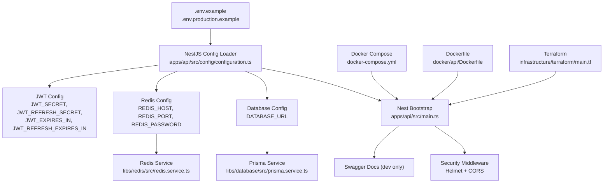
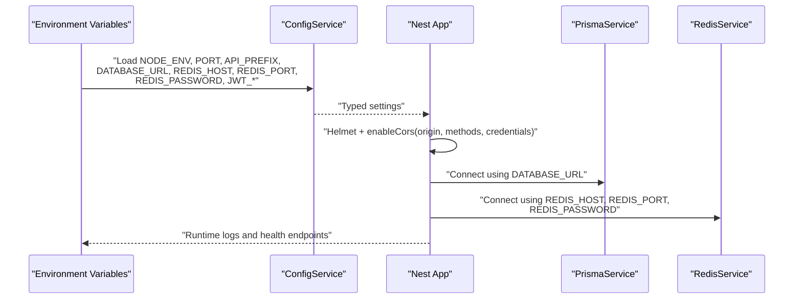
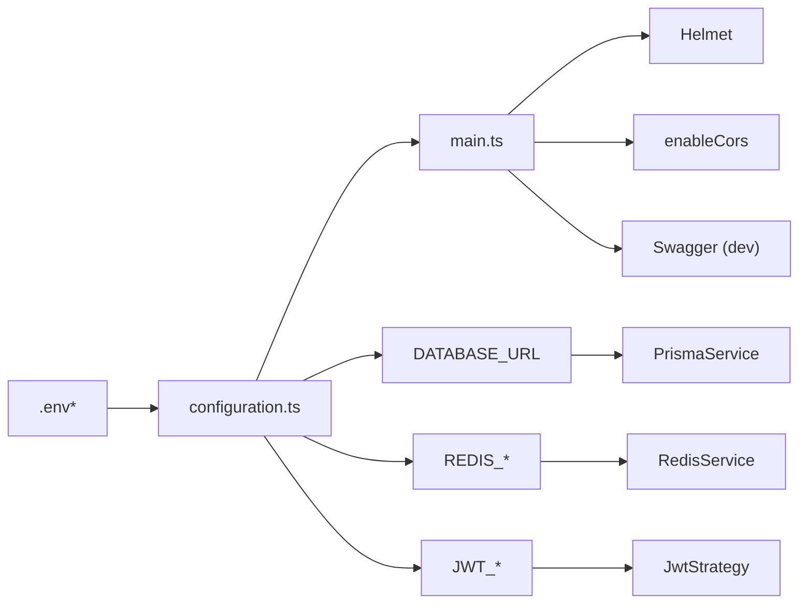

# Configuration and Environment

<cite>
**Referenced Files in This Document**
- [.env.example](file://.env.example)
- [.env.production.example](file://.env.production.example)
- [docker-compose.yml](file://docker-compose.yml)
- [apps/api/src/config/configuration.ts](file://apps/api/src/config/configuration.ts)
- [apps/api/src/main.ts](file://apps/api/src/main.ts)
- [libs/database/src/prisma.service.ts](file://libs/database/src/prisma.service.ts)
- [libs/database/src/prisma.module.ts](file://libs/database/src/prisma.module.ts)
- [libs/redis/src/redis.service.ts](file://libs/redis/src/redis.service.ts)
- [libs/redis/src/redis.module.ts](file://libs/redis/src/redis.module.ts)
- [docker/api/Dockerfile](file://docker/api/Dockerfile)
- [docker/postgres/init.sql](file://docker/postgres/init.sql)
- [infrastructure/terraform/main.tf](file://infrastructure/terraform/main.tf)
- [infrastructure/terraform/modules/container-apps/main.tf](file://infrastructure/terraform/modules/container-apps/main.tf)
- [infrastructure/terraform/modules/container-apps/variables.tf](file://infrastructure/terraform/modules/container-apps/variables.tf)
- [apps/api/src/modules/auth/strategies/jwt.strategy.ts](file://apps/api/src/modules/auth/strategies/jwt.strategy.ts)
</cite>

## Table of Contents
1. [Introduction](#introduction)
2. [Project Structure](#project-structure)
3. [Core Components](#core-components)
4. [Architecture Overview](#architecture-overview)
5. [Detailed Component Analysis](#detailed-component-analysis)
6. [Dependency Analysis](#dependency-analysis)
7. [Performance Considerations](#performance-considerations)
8. [Troubleshooting Guide](#troubleshooting-guide)
9. [Conclusion](#conclusion)
10. [Appendices](#appendices)

## Introduction
This document explains how configuration and environment management work in the Quiz-to-build system. It covers environment variables for application settings, database connections, Redis caching, JWT secrets, rate limiting, logging, and CORS. It also documents the configuration hierarchy, security settings, Docker environment setup, container networking and volumes, production versus development differences, and best practices for sensitive data management. Finally, it provides examples for local, staging, and production deployments, along with validation, defaults, error handling, and secrets rotation guidelines.

## Project Structure
The configuration system spans several layers:
- Environment variable templates for local and production use
- NestJS configuration loader that reads environment variables and exposes typed settings
- Services that consume configuration (database via Prisma, Redis via ioredis)
- Docker Compose for local orchestration and Dockerfile for container builds
- Terraform for production provisioning and secret injection

**Diagram sources**
- [.env.example](file://.env.example#L1-L33)
- [.env.production.example](file://.env.production.example#L1-L66)
- [apps/api/src/config/configuration.ts](file://apps/api/src/config/configuration.ts#L1-L49)
- [apps/api/src/main.ts](file://apps/api/src/main.ts#L11-L86)
- [libs/database/src/prisma.service.ts](file://libs/database/src/prisma.service.ts#L1-L62)
- [libs/redis/src/redis.service.ts](file://libs/redis/src/redis.service.ts#L1-L96)
- [docker-compose.yml](file://docker-compose.yml#L1-L77)
- [docker/api/Dockerfile](file://docker/api/Dockerfile#L1-L72)
- [infrastructure/terraform/main.tf](file://infrastructure/terraform/main.tf#L1-L151)

**Section sources**
- [.env.example](file://.env.example#L1-L33)
- [.env.production.example](file://.env.production.example#L1-L66)
- [apps/api/src/config/configuration.ts](file://apps/api/src/config/configuration.ts#L1-L49)
- [apps/api/src/main.ts](file://apps/api/src/main.ts#L11-L86)
- [docker-compose.yml](file://docker-compose.yml#L1-L77)
- [docker/api/Dockerfile](file://docker/api/Dockerfile#L1-L72)
- [infrastructure/terraform/main.tf](file://infrastructure/terraform/main.tf#L1-L151)

## Core Components
- Application settings: environment, port, API prefix
- Database: connection URL
- Redis: host, port, optional password
- JWT: secrets and expiration policies
- Security: bcrypt cost factor
- Rate limiting: TTL, limits, login-specific limit
- Logging: log level
- CORS: allowed origin(s)

Defaults and parsing:
- Numeric values are parsed from environment variables with safe defaults
- CORS origin defaults to allowing all origins
- JWT secrets have development-friendly defaults for local runs

Security highlights:
- Helmet middleware is enabled globally
- CORS is configured with credentials support and explicit methods
- JWT secrets are loaded from configuration and used by the JWT strategy

**Section sources**
- [apps/api/src/config/configuration.ts](file://apps/api/src/config/configuration.ts#L1-L49)
- [apps/api/src/main.ts](file://apps/api/src/main.ts#L20-L28)
- [apps/api/src/modules/auth/strategies/jwt.strategy.ts](file://apps/api/src/modules/auth/strategies/jwt.strategy.ts#L13-L17)

## Architecture Overview
The configuration pipeline:
- Environment variables are defined locally and in production templates
- The NestJS ConfigService loads and parses them into typed settings
- Services (Prisma, Redis) read their configuration from the ConfigService
- The application bootstrapper applies security, CORS, global prefix, and Swagger (dev only)

**Diagram sources**
- [apps/api/src/config/configuration.ts](file://apps/api/src/config/configuration.ts#L1-L49)
- [apps/api/src/main.ts](file://apps/api/src/main.ts#L15-L49)
- [libs/database/src/prisma.service.ts](file://libs/database/src/prisma.service.ts#L8-L18)
- [libs/redis/src/redis.service.ts](file://libs/redis/src/redis.service.ts#L10-L28)

## Detailed Component Analysis

### Environment Variables and Templates
- Local template defines development defaults for application, database, Redis, JWT, bcrypt, rate limiting, logging, and CORS.
- Production template defines production-safe defaults and placeholders for secrets and cloud services.

Key variables:
- Application: NODE_ENV, PORT, API_PREFIX
- Database: DATABASE_URL
- Redis: REDIS_HOST, REDIS_PORT, REDIS_PASSWORD
- JWT: JWT_SECRET, JWT_EXPIRES_IN, JWT_REFRESH_SECRET, JWT_REFRESH_EXPIRES_IN
- Security: BCRYPT_ROUNDS
- Rate limiting: THROTTLE_TTL, THROTTLE_LIMIT, THROTTLE_LOGIN_LIMIT
- Logging: LOG_LEVEL
- CORS: CORS_ORIGIN

Defaults and examples:
- Defaults are embedded in the configuration loader and templates
- Production examples show Azure-specific values and require replacing placeholders

**Section sources**
- [.env.example](file://.env.example#L1-L33)
- [.env.production.example](file://.env.production.example#L1-L66)
- [apps/api/src/config/configuration.ts](file://apps/api/src/config/configuration.ts#L3-L47)

### Configuration Loader and Hierarchy
The loader centralizes environment parsing and provides defaults. It exposes nested objects for database, redis, jwt, bcrypt, throttle, cors, and logging.

Behavior:
- Numeric values are parsed with base 10
- Strings are taken as-is with fallback defaults
- Redis password is optional and may be omitted
- CORS origin defaults to broad allowance for local development

Integration:
- The loader is consumed by the NestJS application bootstrap
- Services access configuration via the ConfigService

**Section sources**
- [apps/api/src/config/configuration.ts](file://apps/api/src/config/configuration.ts#L1-L49)
- [apps/api/src/main.ts](file://apps/api/src/main.ts#L15-L18)

### Security Settings
- Helmet middleware is applied globally to harden HTTP headers
- CORS is enabled with credentials support and a configurable origin
- JWT strategy uses secrets from configuration for signing and verification
- JWT guard handles token expiration and malformed token errors

Operational notes:
- In production, configure CORS_ORIGIN to match the frontend domain
- Use long, random secrets for JWT and rotate them periodically

**Section sources**
- [apps/api/src/main.ts](file://apps/api/src/main.ts#L20-L28)
- [apps/api/src/modules/auth/strategies/jwt.strategy.ts](file://apps/api/src/modules/auth/strategies/jwt.strategy.ts#L13-L17)
- [apps/api/src/modules/auth/guards/jwt-auth.guard.ts](file://apps/api/src/modules/auth/guards/jwt-auth.guard.ts#L25-L33)

### Database Configuration and Pooling
- Connection URL is read from DATABASE_URL
- Prisma client is initialized with logging and error formatting
- Slow query logging is enabled in development
- No explicit Prisma client pool configuration is present; defaults apply

Operational notes:
- Use a robust database URL in production (e.g., cloud provider with SSL)
- Monitor slow queries during development
- Keep migrations and schema in sync with Prisma

**Section sources**
- [apps/api/src/config/configuration.ts](file://apps/api/src/config/configuration.ts#L8-L10)
- [libs/database/src/prisma.service.ts](file://libs/database/src/prisma.service.ts#L8-L18)
- [libs/database/src/prisma.module.ts](file://libs/database/src/prisma.module.ts#L1-L10)

### Redis Configuration and Connection Management
- Host, port, and optional password are read from environment variables
- ioredis client is configured with a simple retry strategy
- Connection events are logged; errors are captured
- Provides helpers for basic operations (get/set/del/exists/incr/expire/hset/hget/hgetall/hdel/keys/flushdb)

Operational notes:
- In production, use TLS-enabled Redis (Azure Redis uses port 6380)
- Ensure password is set appropriately for managed services
- Use TTL-aware operations for cache entries

**Section sources**
- [apps/api/src/config/configuration.ts](file://apps/api/src/config/configuration.ts#L12-L17)
- [libs/redis/src/redis.service.ts](file://libs/redis/src/redis.service.ts#L10-L28)
- [libs/redis/src/redis.module.ts](file://libs/redis/src/redis.module.ts#L1-L10)

### CORS Configuration
- Origin is configurable via environment variable
- Methods are explicitly allowed
- Credentials are supported

Guidelines:
- Set CORS_ORIGIN to the frontend domain in production
- Restrict methods and origins in production for least privilege

**Section sources**
- [apps/api/src/config/configuration.ts](file://apps/api/src/config/configuration.ts#L39-L42)
- [apps/api/src/main.ts](file://apps/api/src/main.ts#L23-L28)

### Docker Environment Setup
Local compose:
- Postgres service with health checks, mounted volumes, and initialization SQL
- Redis service with persistence and health checks
- API service built from Dockerfile, exposing port 3000, injecting environment variables, and mounting source code

Networking:
- All services share a bridge network named for isolation

Volumes:
- Persistent volumes for Postgres and Redis data

Health checks:
- Postgres health check via pg_isready
- Redis health check via redis-cli ping
- API health check via HTTP GET to /health

**Section sources**
- [docker-compose.yml](file://docker-compose.yml#L1-L77)
- [docker/api/Dockerfile](file://docker/api/Dockerfile#L45-L47)
- [docker/postgres/init.sql](file://docker/postgres/init.sql#L1-L21)

### Production vs Development Configuration Differences
- Environment: NODE_ENV differs between development and production
- Port and API prefix remain consistent
- Database URL points to cloud provider in production
- Redis host/port/password point to managed cache in production
- JWT secrets are required to be strong and rotated
- Logging level is reduced in production
- CORS_ORIGIN is restricted to trusted domains
- Optional Application Insights connection string and Azure Key Vault URI are provided for observability and secrets management

**Section sources**
- [.env.example](file://.env.example#L2-L4)
- [.env.production.example](file://.env.production.example#L7-L9)
- [.env.production.example](file://.env.production.example#L14-L23)
- [.env.production.example](file://.env.production.example#L20-L32)
- [.env.production.example](file://.env.production.example#L49)
- [.env.production.example](file://.env.production.example#L55)
- [.env.production.example](file://.env.production.example#L60)
- [.env.production.example](file://.env.production.example#L65)

### Deployment Examples

#### Local Development
- Use .env.example as a starting point
- Run docker-compose to spin up Postgres, Redis, and the API
- Access the API at http://localhost:3000 with Swagger available in non-production environments

**Section sources**
- [.env.example](file://.env.example#L1-L33)
- [docker-compose.yml](file://docker-compose.yml#L42-L68)

#### Staging
- Mirror production secrets and URLs
- Set CORS_ORIGIN to the staging frontend domain
- Use managed database and cache with TLS

**Section sources**
- [.env.production.example](file://.env.production.example#L14-L23)
- [.env.production.example](file://.env.production.example#L55)

#### Production
- Provision infrastructure via Terraform modules
- Inject secrets into Container Apps from Key Vault
- Configure probes and environment variables per module

**Section sources**
- [infrastructure/terraform/main.tf](file://infrastructure/terraform/main.tf#L106-L150)
- [infrastructure/terraform/modules/container-apps/main.tf](file://infrastructure/terraform/modules/container-apps/main.tf#L56-L104)

### Configuration Validation, Defaults, and Error Handling
Validation and defaults:
- Numeric values are parsed with safe defaults
- CORS origin defaults to broad allowance for local development
- JWT secrets have development defaults; replace in production

Error handling:
- Application startup logs errors and exits on failure
- Redis emits error events for connectivity issues
- Prisma logs slow queries in development

Recommendations:
- Validate presence of required secrets before startup
- Add explicit checks for empty or invalid values in CI/CD
- Use environment-specific templates and enforce strict linting

**Section sources**
- [apps/api/src/config/configuration.ts](file://apps/api/src/config/configuration.ts#L3-L47)
- [apps/api/src/main.ts](file://apps/api/src/main.ts#L88-L92)
- [libs/redis/src/redis.service.ts](file://libs/redis/src/redis.service.ts#L25-L27)
- [libs/database/src/prisma.service.ts](file://libs/database/src/prisma.service.ts#L25-L33)

### Managing Configuration Changes and Secrets Rotation
- Use environment-specific templates (.env.example, .env.production.example)
- For production, inject secrets via platform-managed secrets (e.g., Azure Key Vault) and pass them to containers
- Rotate JWT secrets by updating secrets and redeploying; invalidate sessions as part of the rollout
- Validate configuration in CI before deploying

**Section sources**
- [.env.production.example](file://.env.production.example#L28-L32)
- [infrastructure/terraform/modules/container-apps/main.tf](file://infrastructure/terraform/modules/container-apps/main.tf#L61-L79)
- [infrastructure/terraform/modules/container-apps/variables.tf](file://infrastructure/terraform/modules/container-apps/variables.tf#L100-L110)

## Dependency Analysis
Configuration dependencies across modules:

**Diagram sources**
- [apps/api/src/config/configuration.ts](file://apps/api/src/config/configuration.ts#L1-L49)
- [apps/api/src/main.ts](file://apps/api/src/main.ts#L20-L77)
- [libs/database/src/prisma.service.ts](file://libs/database/src/prisma.service.ts#L8-L18)
- [libs/redis/src/redis.service.ts](file://libs/redis/src/redis.service.ts#L10-L19)
- [apps/api/src/modules/auth/strategies/jwt.strategy.ts](file://apps/api/src/modules/auth/strategies/jwt.strategy.ts#L13-L17)

**Section sources**
- [apps/api/src/config/configuration.ts](file://apps/api/src/config/configuration.ts#L1-L49)
- [apps/api/src/main.ts](file://apps/api/src/main.ts#L15-L49)
- [libs/database/src/prisma.service.ts](file://libs/database/src/prisma.service.ts#L1-L62)
- [libs/redis/src/redis.service.ts](file://libs/redis/src/redis.service.ts#L1-L96)
- [apps/api/src/modules/auth/strategies/jwt.strategy.ts](file://apps/api/src/modules/auth/strategies/jwt.strategy.ts#L1-L29)

## Performance Considerations
- Database: ensure DATABASE_URL points to a scalable cloud database; monitor slow queries in development
- Redis: use TLS-enabled endpoints in production; tune retry strategy for transient failures
- Logging: reduce verbosity in production to minimize I/O overhead
- CORS: restrict origins and methods to reduce preflight overhead

[No sources needed since this section provides general guidance]

## Troubleshooting Guide
Common issues and resolutions:
- Application fails to start: check environment variables and templates; review bootstrap error logs
- Database connection failures: verify DATABASE_URL and network connectivity; confirm schema initialization
- Redis connection failures: verify host, port, and password; ensure TLS settings match provider requirements
- JWT authentication errors: confirm JWT secrets are set and rotated consistently; check token expiration
- CORS blocked requests: ensure CORS_ORIGIN matches the requesting origin

**Section sources**
- [apps/api/src/main.ts](file://apps/api/src/main.ts#L88-L92)
- [libs/database/src/prisma.service.ts](file://libs/database/src/prisma.service.ts#L20-L40)
- [libs/redis/src/redis.service.ts](file://libs/redis/src/redis.service.ts#L21-L27)
- [apps/api/src/modules/auth/guards/jwt-auth.guard.ts](file://apps/api/src/modules/auth/guards/jwt-auth.guard.ts#L25-L33)

## Conclusion
The Quiz-to-build system uses a clear, layered configuration approach: environment templates define settings, the NestJS ConfigService normalizes them, and services consume them. Security is strengthened with Helmet, CORS controls, and JWT. Docker Compose supports local development, while Terraform provisions production-grade infrastructure with secret injection. Adopt the provided examples and best practices to manage configuration safely and reliably across environments.

[No sources needed since this section summarizes without analyzing specific files]

## Appendices

### Environment Variable Reference
- Application: NODE_ENV, PORT, API_PREFIX
- Database: DATABASE_URL
- Redis: REDIS_HOST, REDIS_PORT, REDIS_PASSWORD
- JWT: JWT_SECRET, JWT_EXPIRES_IN, JWT_REFRESH_SECRET, JWT_REFRESH_EXPIRES_IN
- Security: BCRYPT_ROUNDS
- Rate limiting: THROTTLE_TTL, THROTTLE_LIMIT, THROTTLE_LOGIN_LIMIT
- Logging: LOG_LEVEL
- CORS: CORS_ORIGIN
- Optional (Production): APPLICATIONINSIGHTS_CONNECTION_STRING, AZURE_KEY_VAULT_URI

**Section sources**
- [.env.example](file://.env.example#L1-L33)
- [.env.production.example](file://.env.production.example#L1-L66)
- [apps/api/src/config/configuration.ts](file://apps/api/src/config/configuration.ts#L3-L47)