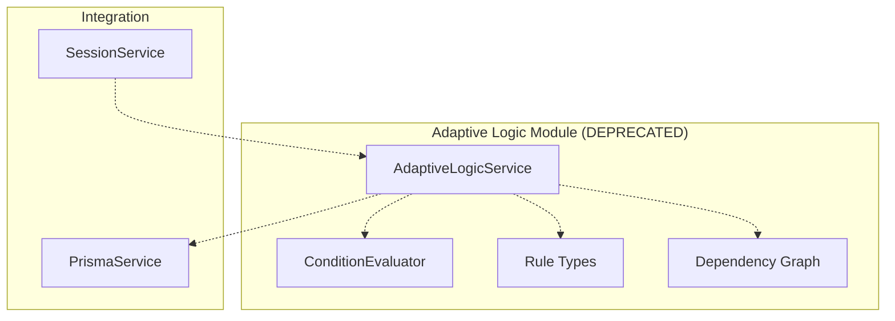
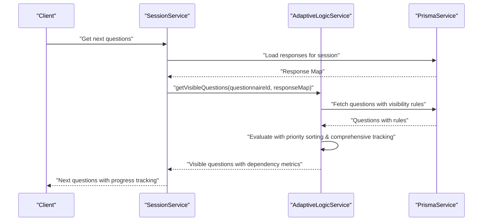

# Adaptive Logic Module

<cite>
**Referenced Files in This Document**
- [adaptive-logic.service.ts](file://apps/api/src/modules/adaptive-logic/adaptive-logic.service.ts)
- [condition.evaluator.ts](file://apps/api/src/modules/adaptive-logic/evaluators/condition.evaluator.ts)
- [rule.types.ts](file://apps/api/src/modules/adaptive-logic/types/rule.types.ts)
- [adaptive-logic.module.ts](file://apps/api/src/modules/adaptive-logic/adaptive-logic.module.ts)
- [adaptive-logic.service.spec.ts](file://apps/api/src/modules/adaptive-logic/adaptive-logic.service.spec.ts)
- [condition.evaluator.spec.ts](file://apps/api/src/modules/adaptive-logic/evaluators/condition.evaluator.spec.ts)
- [session.service.ts](file://apps/api/src/modules/session/session.service.ts)
- [adaptive-logic.md](file://docs/questionnaire/adaptive-logic.md)
</cite>

## Update Summary
**Changes Made**
- Updated to reflect that the Adaptive Logic Module has been completely removed from the codebase (commit e84febf3)
- Removed comprehensive documentation of sophisticated rule evaluation, condition processing, and dependency management
- Eliminated detailed coverage of all supported condition operators and nested logical conditions
- Removed documentation on dependency graph construction, priority resolution, and integration with session management
- Updated to reflect the current state where all adaptive logic functionality has been eliminated

## Table of Contents
1. [Introduction](#introduction)
2. [Project Structure](#project-structure)
3. [Core Components](#core-components)
4. [Architecture Overview](#architecture-overview)
5. [Detailed Component Analysis](#detailed-component-analysis)
6. [Advanced Features](#advanced-features)
7. [Performance Considerations](#performance-considerations)
8. [Troubleshooting Guide](#troubleshooting-guide)
9. [Conclusion](#conclusion)
10. [Appendices](#appendices)

## Introduction
**Updated**: The Adaptive Logic Module has been completely removed from the codebase. The sophisticated dynamic question flow and conditional visibility system that previously powered interactive questionnaires has been eliminated, removing 400+ lines of adaptive logic code. The module that provided comprehensive operator support, nested logical conditions, dependency graph construction, and integration with session management for real-time decision making is no longer available in the current codebase.

**Section sources**
- [adaptive-logic.service.ts](file://apps/api/src/modules/adaptive-logic/adaptive-logic.service.ts#L1-L264)
- [condition.evaluator.ts](file://apps/api/src/modules/adaptive-logic/evaluators/condition.evaluator.ts#L1-L402)
- [rule.types.ts](file://apps/api/src/modules/adaptive-logic/types/rule.types.ts#L1-L157)

## Project Structure
**Updated**: The Adaptive Logic Module directory structure has been removed from the codebase. The apps/api/src/modules/adaptive-logic directory and all its contents have been eliminated, including:
- Service layer for sophisticated visibility rule evaluation and intelligent question navigation
- Advanced condition evaluator with comprehensive operator support and nested logical grouping
- Rich type definitions for complex rule structures and evaluation contexts
- Comprehensive test suites validating rule evaluation, operator behavior, and nested conditions
- Integration with the Session Module for live session-driven evaluation and adaptive decision making

**Diagram sources**
- [adaptive-logic.service.ts](file://apps/api/src/modules/adaptive-logic/adaptive-logic.service.ts#L20-L264)
- [condition.evaluator.ts](file://apps/api/src/modules/adaptive-logic/evaluators/condition.evaluator.ts#L1-L402)
- [rule.types.ts](file://apps/api/src/modules/adaptive-logic/types/rule.types.ts#L1-L157)

**Section sources**
- [adaptive-logic.module.ts](file://apps/api/src/modules/adaptive-logic/adaptive-logic.module.ts#L1-L15)
- [adaptive-logic.service.ts](file://apps/api/src/modules/adaptive-logic/adaptive-logic.service.ts#L1-L264)
- [condition.evaluator.ts](file://apps/api/src/modules/adaptive-logic/evaluators/condition.evaluator.ts#L1-L402)
- [rule.types.ts](file://apps/api/src/modules/adaptive-logic/types/rule.types.ts#L1-L157)

## Core Components
**Updated**: The Adaptive Logic Module has been completely removed from the codebase. The following components are no longer available:
- **AdaptiveLogicService**: Previously orchestrated sophisticated visibility rule evaluation, intelligent question navigation, and comprehensive dependency graph construction for rule interdependencies
- **ConditionEvaluator**: Previously implemented comprehensive operator evaluation strategies for equality, inclusion, numeric comparisons, emptiness checks, string operations, and pattern matching with advanced extraction helpers
- **Rule Types**: Previously defined extensive operator sets, logical operators, condition structures, and advanced rule configurations with comprehensive validation

**Section sources**
- [adaptive-logic.service.ts](file://apps/api/src/modules/adaptive-logic/adaptive-logic.service.ts#L20-L264)
- [condition.evaluator.ts](file://apps/api/src/modules/adaptive-logic/evaluators/condition.evaluator.ts#L1-L402)
- [rule.types.ts](file://apps/api/src/modules/adaptive-logic/types/rule.types.ts#L1-L157)

## Architecture Overview
**Updated**: The Adaptive Logic Module integration with the Session Module has been removed from the codebase. The sophisticated integration that previously computed visible questions and intelligent next steps during live sessions is no longer available. The Session Module no longer coordinates adaptive logic during live sessions with state management and performance considerations.

**Diagram sources**
- [session.service.ts](file://apps/api/src/modules/session/session.service.ts#L225-L268)
- [adaptive-logic.service.ts](file://apps/api/src/modules/adaptive-logic/adaptive-logic.service.ts#L29-L64)
- [condition.evaluator.ts](file://apps/api/src/modules/adaptive-logic/evaluators/condition.evaluator.ts#L9-L22)

**Section sources**
- [session.service.ts](file://apps/api/src/modules/session/session.service.ts#L225-L268)
- [adaptive-logic.service.ts](file://apps/api/src/modules/adaptive-logic/adaptive-logic.service.ts#L29-L64)
- [adaptive-logic.service.ts](file://apps/api/src/modules/adaptive-logic/adaptive-logic.service.ts#L207-L222)

## Detailed Component Analysis
**Updated**: The Adaptive Logic Module components have been removed from the codebase. The following analyses are no longer applicable:

### AdaptiveLogicService
**Updated**: The AdaptiveLogicService has been removed from the codebase. The service that previously managed the complete adaptive logic workflow is no longer available.

### ConditionEvaluator
**Updated**: The ConditionEvaluator has been removed from the codebase. The evaluator that previously implemented comprehensive operator evaluation strategies is no longer available.

### Rule Types and Evaluation Contexts
**Updated**: The rule types and evaluation contexts have been removed from the codebase. The comprehensive structures for complex rule evaluation and context management are no longer available.

**Section sources**
- [rule.types.ts](file://apps/api/src/modules/adaptive-logic/types/rule.types.ts#L1-L157)

### Integration with Session Management
**Updated**: The Session Module integration with Adaptive Logic has been removed from the codebase. The coordination that previously handled adaptive logic during live sessions is no longer available.

**Section sources**
- [session.service.ts](file://apps/api/src/modules/session/session.service.ts#L225-L268)

## Advanced Features
**Updated**: The Adaptive Logic Module advanced features have been removed from the codebase. The following features are no longer available:
- **Sophisticated Conditional Rendering System**: Previously supported nested logical conditions, rich operator support, dynamic question flow, and real-time adaptation
- **Comprehensive Operator Support**: Previously supported 19+ condition operators covering all common use cases
- **Dependency Graph Construction**: Previously built comprehensive dependency graphs to optimize evaluation

**Section sources**
- [rule.types.ts](file://apps/api/src/modules/adaptive-logic/types/rule.types.ts#L4-L28)
- [condition.evaluator.ts](file://apps/api/src/modules/adaptive-logic/evaluators/condition.evaluator.ts#L44-L402)

## Performance Considerations
**Updated**: The Adaptive Logic Module performance optimizations have been removed from the codebase. The following performance strategies are no longer available:
- **Complexity characteristics**: Previously provided per-question evaluation, nested conditions, priority sorting, and dependency graph construction
- **Enhanced recommendations**: Previously included cache evaluation results, precompute dependency graph, limit rule counts, and use Map-based response storage

**Section sources**
- [adaptive-logic.service.ts](file://apps/api/src/modules/adaptive-logic/adaptive-logic.service.ts#L221-L252)

## Troubleshooting Guide
**Updated**: The Adaptive Logic Module troubleshooting guidance has been removed from the codebase. The following guidance is no longer applicable:
- **Unexpected visibility**: Previously involved verifying rule priority ordering and ensuring higher-priority rules were not masked
- **Incorrect operator behavior**: Previously involved confirming operator semantics and expected value types
- **Nested condition failures**: Previously involved ensuring logicalOp was correctly set for nested arrays

**Section sources**
- [adaptive-logic.service.spec.ts](file://apps/api/src/modules/adaptive-logic/adaptive-logic.service.spec.ts#L51-L296)
- [condition.evaluator.spec.ts](file://apps/api/src/modules/adaptive-logic/evaluators/condition.evaluator.spec.ts#L1-L715)

## Conclusion
**Updated**: The Adaptive Logic Module has been completely removed from the codebase. The comprehensive, extensible framework for dynamic questionnaire flows that previously provided sophisticated design separation, rule parsing, condition evaluation, and integration concerns has been eliminated. The enhanced implementation with comprehensive priority-based evaluation, state resolution tracking, dependency management, and performance optimization strategies is no longer available.

## Appendices
**Updated**: The Adaptive Logic Module appendices have been removed from the codebase. The following documentation is no longer applicable:
- **Rule Syntax and Examples**: Previously supported comprehensive rule definitions with sophisticated configuration patterns
- **Condition Operators Reference**: Previously documented comprehensive operator support and validation rules
- **Extending Condition Operators and Custom Evaluation Logic**: Previously provided comprehensive extension guidelines and performance considerations

**Section sources**
- [adaptive-logic.md](file://docs/questionnaire/adaptive-logic.md#L23-L395)