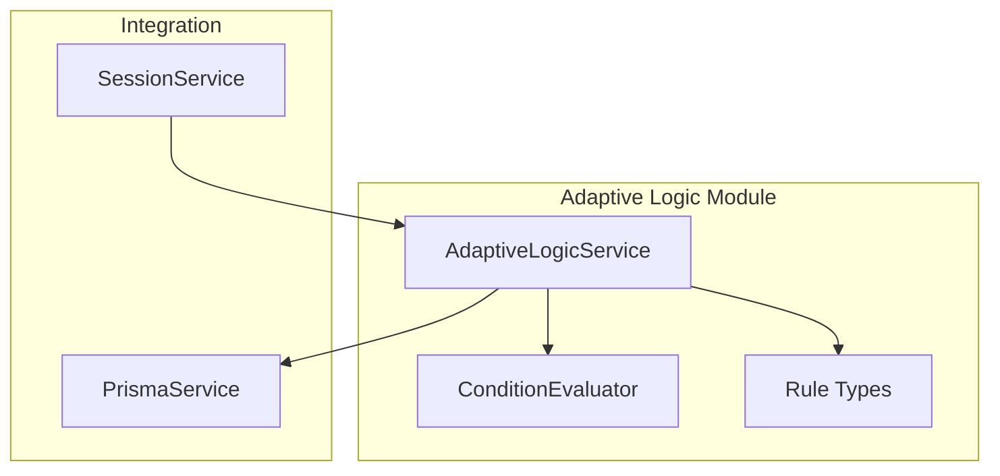
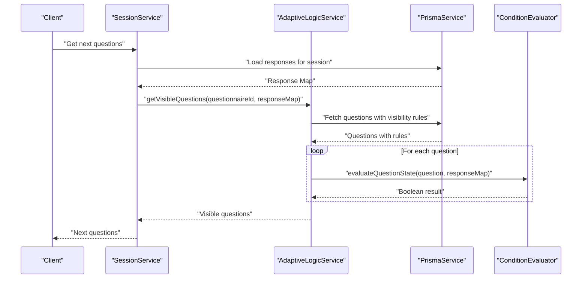
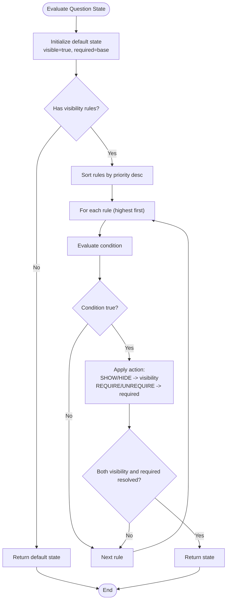
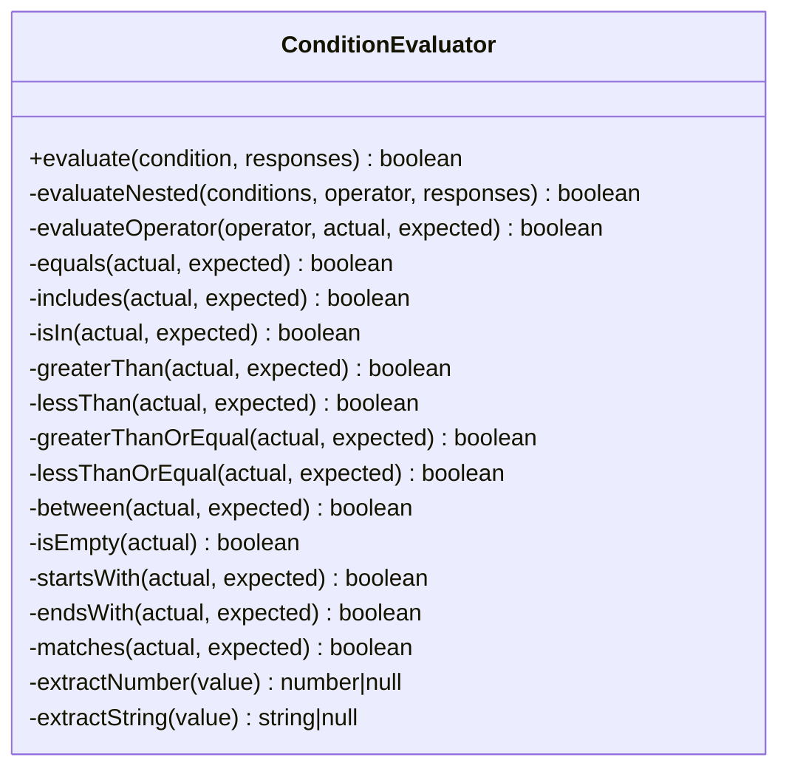
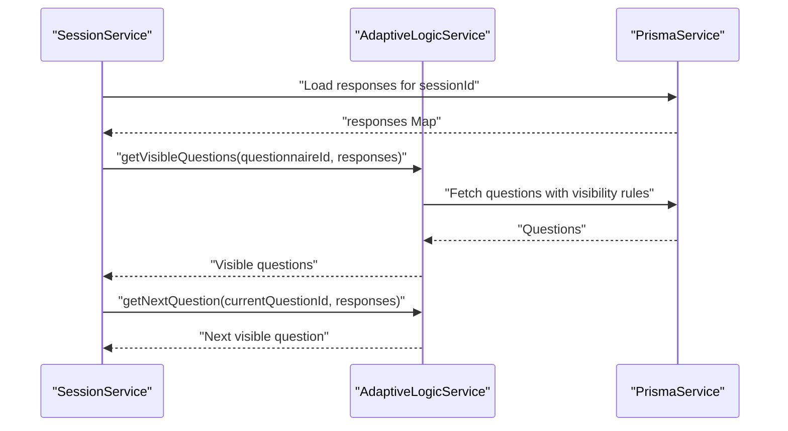
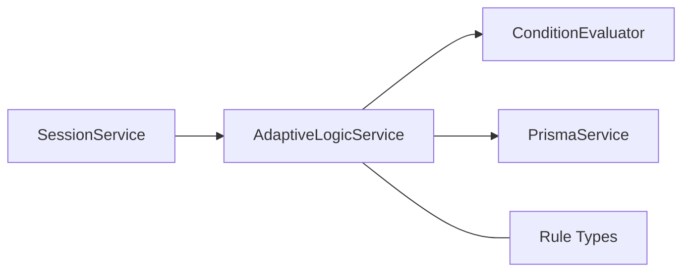

# Adaptive Logic Module

<cite>
**Referenced Files in This Document**
- [adaptive-logic.service.ts](file://apps/api/src/modules/adaptive-logic/adaptive-logic.service.ts)
- [condition.evaluator.ts](file://apps/api/src/modules/adaptive-logic/evaluators/condition.evaluator.ts)
- [rule.types.ts](file://apps/api/src/modules/adaptive-logic/types/rule.types.ts)
- [adaptive-logic.module.ts](file://apps/api/src/modules/adaptive-logic/adaptive-logic.module.ts)
- [adaptive-logic.service.spec.ts](file://apps/api/src/modules/adaptive-logic/adaptive-logic.service.spec.ts)
- [condition.evaluator.spec.ts](file://apps/api/src/modules/adaptive-logic/evaluators/condition.evaluator.spec.ts)
- [session.service.ts](file://apps/api/src/modules/session/session.service.ts)
- [adaptive-logic.md](file://docs/questionnaire/adaptive-logic.md)
</cite>

## Table of Contents
1. [Introduction](#introduction)
2. [Project Structure](#project-structure)
3. [Core Components](#core-components)
4. [Architecture Overview](#architecture-overview)
5. [Detailed Component Analysis](#detailed-component-analysis)
6. [Dependency Analysis](#dependency-analysis)
7. [Performance Considerations](#performance-considerations)
8. [Troubleshooting Guide](#troubleshooting-guide)
9. [Conclusion](#conclusion)
10. [Appendices](#appendices)

## Introduction
The Adaptive Logic Module powers dynamic question flow and conditional visibility logic for interactive questionnaires. It evaluates rules against user responses to determine which questions to show, hide, require, or skip, and to guide navigation through branching paths. The module consists of a rule parsing and evaluation engine, a condition evaluator with a comprehensive set of operators, and integration points with session management for real-time decision making.

## Project Structure
The Adaptive Logic Module resides under apps/api/src/modules/adaptive-logic and includes:
- Service layer for rule evaluation, visibility determination, and dependency graph construction
- Evaluator for condition operators and nested logical combinations
- Type definitions for rules, conditions, and evaluation contexts
- Tests validating rule evaluation and operator behavior
- Integration with the Session Module for live session-driven evaluation

**Diagram sources**
- [adaptive-logic.service.ts](file://apps/api/src/modules/adaptive-logic/adaptive-logic.service.ts#L1-L307)
- [condition.evaluator.ts](file://apps/api/src/modules/adaptive-logic/evaluators/condition.evaluator.ts#L1-L402)
- [rule.types.ts](file://apps/api/src/modules/adaptive-logic/types/rule.types.ts#L1-L120)
- [session.service.ts](file://apps/api/src/modules/session/session.service.ts#L1-L684)

**Section sources**
- [adaptive-logic.module.ts](file://apps/api/src/modules/adaptive-logic/adaptive-logic.module.ts#L1-L12)
- [adaptive-logic.service.ts](file://apps/api/src/modules/adaptive-logic/adaptive-logic.service.ts#L1-L307)
- [condition.evaluator.ts](file://apps/api/src/modules/adaptive-logic/evaluators/condition.evaluator.ts#L1-L402)
- [rule.types.ts](file://apps/api/src/modules/adaptive-logic/types/rule.types.ts#L1-L120)

## Core Components
- AdaptiveLogicService: Orchestrates rule loading, visibility evaluation, next-question selection, adaptive change detection, and dependency graph building.
- ConditionEvaluator: Implements operator evaluation strategies for equality, inclusion, numeric comparisons, emptiness checks, string operations, and regex matching.
- Rule Types: Define supported operators, logical operators, condition structures, rule configurations, branching rules, and evaluation contexts.

Key responsibilities:
- Parse and sort visibility rules by priority
- Evaluate conditions with nested logical grouping
- Compute visibility and requirement states per question
- Detect changes in visible questions upon response updates
- Build dependency graphs for rule interdependencies

**Section sources**
- [adaptive-logic.service.ts](file://apps/api/src/modules/adaptive-logic/adaptive-logic.service.ts#L20-L307)
- [condition.evaluator.ts](file://apps/api/src/modules/adaptive-logic/evaluators/condition.evaluator.ts#L5-L402)
- [rule.types.ts](file://apps/api/src/modules/adaptive-logic/types/rule.types.ts#L1-L120)

## Architecture Overview
The Adaptive Logic Module integrates with the Session Module to compute visible questions and next steps during a live session. Responses are collected from the session and transformed into a Map keyed by question IDs for efficient evaluation.

**Diagram sources**
- [session.service.ts](file://apps/api/src/modules/session/session.service.ts#L198-L268)
- [adaptive-logic.service.ts](file://apps/api/src/modules/adaptive-logic/adaptive-logic.service.ts#L31-L66)
- [condition.evaluator.ts](file://apps/api/src/modules/adaptive-logic/evaluators/condition.evaluator.ts#L9-L22)

## Detailed Component Analysis

### AdaptiveLogicService
Responsibilities:
- Load questions with associated visibility rules and sort by priority
- Evaluate question state considering visibility and requirement actions
- Support branching to the next question based on current position and visibility
- Compare previous and current visible sets to detect added/removed questions
- Build a dependency graph from rule conditions to target question IDs

Evaluation flow:
- Default state is visible and inherits base requirement from question
- Rules are evaluated in descending priority order; first matching action wins for visibility and requirement
- Conditions support nested logical grouping with AND/OR
- Actions include show/hide and require/unrequire

**Diagram sources**
- [adaptive-logic.service.ts](file://apps/api/src/modules/adaptive-logic/adaptive-logic.service.ts#L71-L153)

**Section sources**
- [adaptive-logic.service.ts](file://apps/api/src/modules/adaptive-logic/adaptive-logic.service.ts#L31-L153)
- [adaptive-logic.service.spec.ts](file://apps/api/src/modules/adaptive-logic/adaptive-logic.service.spec.ts#L51-L169)

### ConditionEvaluator
Capabilities:
- Single condition evaluation against a response Map
- Nested condition groups with logical AND/OR
- Comprehensive operator set:
  - Equality: equals, eq, not_equals, ne
  - Inclusion: includes, contains, not_includes, not_contains
  - Membership: in, not_in
  - Numeric comparisons: greater_than, gt, less_than, lt, greater_than_or_equal, gte, less_than_or_equal, lte, between
  - Emptiness: is_empty, is_not_empty
  - String operations: starts_with, ends_with
  - Pattern matching: matches (regex)
- Robust extraction helpers for numbers and strings from diverse response shapes

**Diagram sources**
- [condition.evaluator.ts](file://apps/api/src/modules/adaptive-logic/evaluators/condition.evaluator.ts#L5-L402)

**Section sources**
- [condition.evaluator.ts](file://apps/api/src/modules/adaptive-logic/evaluators/condition.evaluator.ts#L9-L351)
- [condition.evaluator.spec.ts](file://apps/api/src/modules/adaptive-logic/evaluators/condition.evaluator.spec.ts#L11-L357)

### Rule Types and Evaluation Contexts
Supported operators and structures:
- ConditionOperator: A rich set of operators enabling precise rule definition
- LogicalOperator: AND/OR for combining conditions
- Condition: Supports nested arrays for complex logic
- VisibilityRuleConfig: Defines rule identity, source/target, conditions, operator, action, priority, and enablement
- BranchingRule: Routes users to different paths based on conditions and priorities
- QuestionState: Tracks visibility, requirement, and disabled flags

Evaluation contexts:
- Responses are passed as Map<string, unknown> keyed by question IDs
- Nested conditions allow multi-field logic with explicit logical grouping

**Section sources**
- [rule.types.ts](file://apps/api/src/modules/adaptive-logic/types/rule.types.ts#L1-L120)

### Integration with Session Management
The Session Module coordinates adaptive logic during live sessions:
- Builds a response Map from persisted answers
- Requests visible questions from AdaptiveLogicService
- Computes next questions respecting visibility and prior answers
- Tracks adaptive state and progress metrics

**Diagram sources**
- [session.service.ts](file://apps/api/src/modules/session/session.service.ts#L202-L268)
- [adaptive-logic.service.ts](file://apps/api/src/modules/adaptive-logic/adaptive-logic.service.ts#L158-L195)

**Section sources**
- [session.service.ts](file://apps/api/src/modules/session/session.service.ts#L198-L268)
- [adaptive-logic.service.ts](file://apps/api/src/modules/adaptive-logic/adaptive-logic.service.ts#L158-L195)

## Dependency Analysis
- AdaptiveLogicService depends on PrismaService for persistence and ConditionEvaluator for evaluation
- ConditionEvaluator is a pure evaluation utility with no external dependencies
- AdaptiveLogicModule imports SessionModule via forwardRef to avoid circular dependencies
- SessionService depends on AdaptiveLogicService for adaptive decisions

**Diagram sources**
- [adaptive-logic.service.ts](file://apps/api/src/modules/adaptive-logic/adaptive-logic.service.ts#L23-L26)
- [condition.evaluator.ts](file://apps/api/src/modules/adaptive-logic/evaluators/condition.evaluator.ts#L1-L2)
- [adaptive-logic.module.ts](file://apps/api/src/modules/adaptive-logic/adaptive-logic.module.ts#L4-L9)
- [session.service.ts](file://apps/api/src/modules/session/session.service.ts#L13-L14)

**Section sources**
- [adaptive-logic.module.ts](file://apps/api/src/modules/adaptive-logic/adaptive-logic.module.ts#L1-L12)
- [adaptive-logic.service.ts](file://apps/api/src/modules/adaptive-logic/adaptive-logic.service.ts#L23-L26)
- [session.service.ts](file://apps/api/src/modules/session/session.service.ts#L88-L94)

## Performance Considerations
- Complexity characteristics:
  - Per-question evaluation: O(R) where R is the number of rules for that question
  - Nested conditions: O(C) where C is the number of conditions in the group
  - Sorting rules by priority: O(R log R)
- Recommendations:
  - Cache evaluation results keyed by question ID and response hash to avoid recomputation
  - Precompute dependency graph to quickly invalidate cached states when upstream dependencies change
  - Limit rule counts per question and use rule priorities to short-circuit evaluation early
  - Use Map-based response storage for O(1) lookups
  - Batch rule retrieval with ordering and filtering to minimize database overhead

[No sources needed since this section provides general guidance]

## Troubleshooting Guide
Common issues and resolutions:
- Unexpected visibility: Verify rule priority ordering and ensure higher-priority rules are not masked by lower-priority ones
- Incorrect operator behavior: Confirm operator semantics and expected value types (e.g., numeric comparisons require numeric values)
- Nested condition failures: Ensure logicalOp is correctly set for nested arrays and that all referenced question IDs exist in the response Map
- Empty or missing responses: Operators like is_empty and contains handle null/undefined gracefully; confirm response shape matches expectations
- Debugging techniques:
  - Log rule IDs and applied actions during evaluation
  - Add metrics for rule trigger counts and session completion rates
  - Use unit tests to isolate operator-specific logic and edge cases

**Section sources**
- [adaptive-logic.service.spec.ts](file://apps/api/src/modules/adaptive-logic/adaptive-logic.service.spec.ts#L51-L169)
- [condition.evaluator.spec.ts](file://apps/api/src/modules/adaptive-logic/evaluators/condition.evaluator.spec.ts#L11-L357)

## Conclusion
The Adaptive Logic Module provides a robust, extensible framework for dynamic questionnaire flows. Its modular design separates rule parsing, condition evaluation, and integration concerns, enabling flexible rule authoring and real-time decision making. By leveraging operator richness, nested logic, and dependency-aware evaluation, it supports complex adaptive experiences while maintaining performance and debuggability.

[No sources needed since this section summarizes without analyzing specific files]

## Appendices

### Rule Syntax and Examples
- Visibility rules: Show/hide questions based on conditions
- Requirement rules: Make questions required or optional dynamically
- Branching rules: Route users to different paths based on priorities
- Example patterns and YAML-based rule definitions are documented in the adaptive-logic documentation

**Section sources**
- [adaptive-logic.md](file://docs/questionnaire/adaptive-logic.md#L23-L137)

### Condition Operators Reference
- Equality: equals, eq, not_equals, ne
- Inclusion: includes, contains, not_includes, not_contains
- Membership: in, not_in
- Numeric comparisons: greater_than, gt, less_than, lt, greater_than_or_equal, gte, less_than_or_equal, lte, between
- Emptiness: is_empty, is_not_empty
- String operations: starts_with, ends_with
- Pattern matching: matches (regex)

**Section sources**
- [rule.types.ts](file://apps/api/src/modules/adaptive-logic/types/rule.types.ts#L4-L28)
- [condition.evaluator.ts](file://apps/api/src/modules/adaptive-logic/evaluators/condition.evaluator.ts#L49-L109)

### Extending Condition Operators and Custom Evaluation Logic
- Adding a new operator:
  - Extend ConditionOperator union in rule.types.ts
  - Implement a new evaluateOperator branch in ConditionEvaluator
  - Add tests in condition.evaluator.spec.ts
- Developing custom evaluation logic:
  - Introduce new evaluation strategies in ConditionEvaluator
  - Support composite response shapes and extraction helpers
  - Ensure backward compatibility and consistent return semantics

**Section sources**
- [rule.types.ts](file://apps/api/src/modules/adaptive-logic/types/rule.types.ts#L4-L28)
- [condition.evaluator.ts](file://apps/api/src/modules/adaptive-logic/evaluators/condition.evaluator.ts#L44-L109)
- [condition.evaluator.spec.ts](file://apps/api/src/modules/adaptive-logic/evaluators/condition.evaluator.spec.ts#L350-L357)