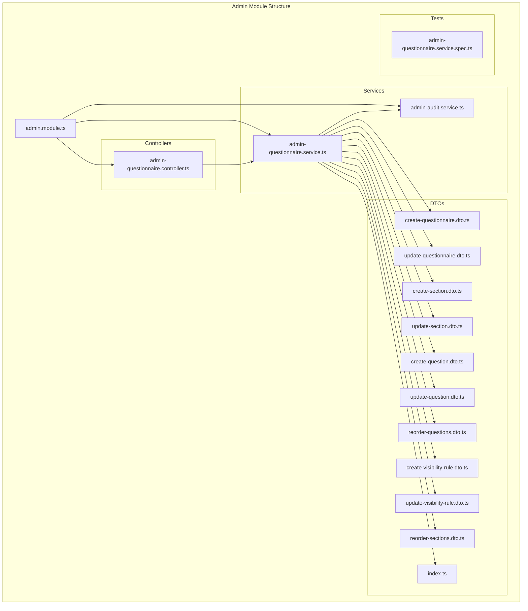
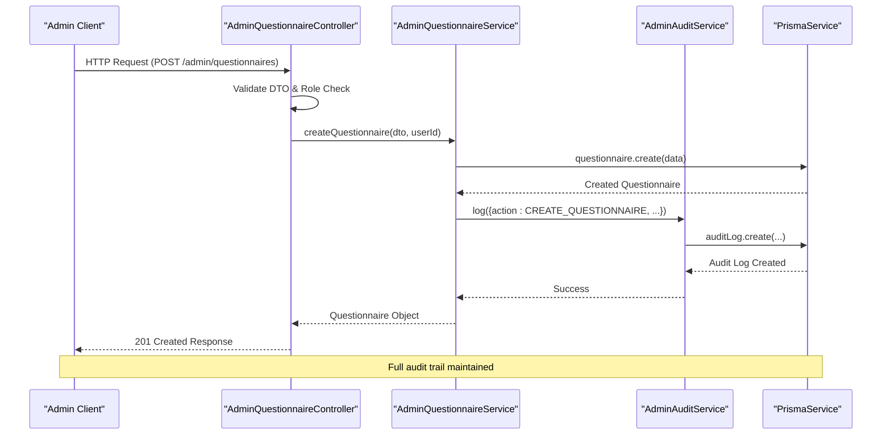
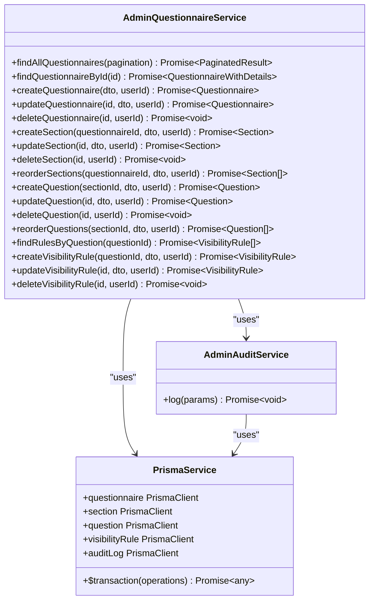
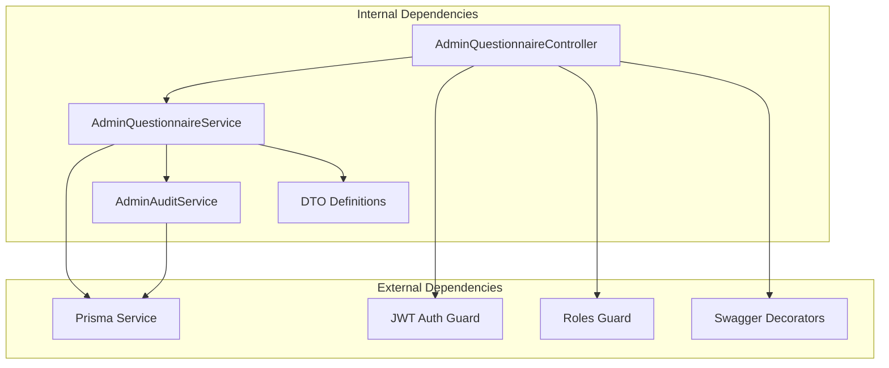

# Admin Module

<cite>
**Referenced Files in This Document**
- [admin.module.ts](file://apps/api/src/modules/admin/admin.module.ts)
- [admin-questionnaire.controller.ts](file://apps/api/src/modules/admin/controllers/admin-questionnaire.controller.ts)
- [admin-questionnaire.service.ts](file://apps/api/src/modules/admin/services/admin-questionnaire.service.ts)
- [admin-audit.service.ts](file://apps/api/src/modules/admin/services/admin-audit.service.ts)
- [create-questionnaire.dto.ts](file://apps/api/src/modules/admin/dto/create-questionnaire.dto.ts)
- [update-questionnaire.dto.ts](file://apps/api/src/modules/admin/dto/update-questionnaire.dto.ts)
- [create-section.dto.ts](file://apps/api/src/modules/admin/dto/create-section.dto.ts)
- [update-section.dto.ts](file://apps/api/src/modules/admin/dto/update-section.dto.ts)
- [create-question.dto.ts](file://apps/api/src/modules/admin/dto/create-question.dto.ts)
- [update-question.dto.ts](file://apps/api/src/modules/admin/dto/update-question.dto.ts)
- [reorder-questions.dto.ts](file://apps/api/src/modules/admin/dto/reorder-questions.dto.ts)
- [create-visibility-rule.dto.ts](file://apps/api/src/modules/admin/dto/create-visibility-rule.dto.ts)
- [update-visibility-rule.dto.ts](file://apps/api/src/modules/admin/dto/update-visibility-rule.dto.ts)
- [reorder-sections.dto.ts](file://apps/api/src/modules/admin/dto/reorder-sections.dto.ts)
- [index.ts](file://apps/api/src/modules/admin/dto/index.ts)
- [admin-questionnaire.service.spec.ts](file://apps/api/src/modules/admin/tests/admin-questionnaire.service.spec.ts)
</cite>

## Update Summary
**Changes Made**
- Enhanced audit trail functionality with comprehensive logging for all administrative operations
- Added bulk operations support for section and question reordering with atomic transactions
- Implemented advanced questionnaire editing capabilities with full CRUD operations
- Strengthened role-based access control with ADMIN and SUPER_ADMIN privilege differentiation
- Expanded DTO validation system with comprehensive input sanitization and business rule enforcement

## Table of Contents
1. [Introduction](#introduction)
2. [Project Structure](#project-structure)
3. [Core Components](#core-components)
4. [Architecture Overview](#architecture-overview)
5. [Detailed Component Analysis](#detailed-component-analysis)
6. [Dependency Analysis](#dependency-analysis)
7. [Performance Considerations](#performance-considerations)
8. [Troubleshooting Guide](#troubleshooting-guide)
9. [Conclusion](#conclusion)

## Introduction
The Admin Module provides comprehensive administrative capabilities for managing questionnaires, sections, questions, and visibility rules within the Quiz application. It offers role-based access control (ADMIN and SUPER_ADMIN), comprehensive CRUD operations, reordering capabilities, and full audit trail functionality. The module is built on NestJS with Prisma ORM integration and includes robust validation through DTOs and comprehensive test coverage.

**Updated** Enhanced with advanced administrative management features including bulk operations, comprehensive audit trails, and sophisticated questionnaire editing capabilities.

## Project Structure
The Admin Module follows a clean architecture pattern with clear separation of concerns:

**Diagram sources**
- [admin.module.ts](file://apps/api/src/modules/admin/admin.module.ts#L1-L14)
- [admin-questionnaire.controller.ts](file://apps/api/src/modules/admin/controllers/admin-questionnaire.controller.ts#L1-L284)
- [admin-questionnaire.service.ts](file://apps/api/src/modules/admin/services/admin-questionnaire.service.ts#L1-L608)
- [admin-audit.service.ts](file://apps/api/src/modules/admin/services/admin-audit.service.ts#L1-L48)

**Section sources**
- [admin.module.ts](file://apps/api/src/modules/admin/admin.module.ts#L1-L14)
- [admin-questionnaire.controller.ts](file://apps/api/src/modules/admin/controllers/admin-questionnaire.controller.ts#L1-L284)

## Core Components
The Admin Module consists of three primary components working together to provide comprehensive administrative functionality:

### Controller Layer
The AdminQuestionnaireController serves as the entry point for all administrative operations, implementing role-based access control and coordinating between services and DTO validation.

**Updated** Enhanced with comprehensive endpoint coverage for all administrative operations including bulk reordering and advanced questionnaire management.

### Service Layer
The AdminQuestionnaireService handles all business logic, including:
- Complete CRUD operations for questionnaires, sections, and questions
- Reordering functionality with atomic transactions
- Visibility rule management
- Audit logging integration
- Data validation and business rule enforcement

**Enhanced** Added sophisticated transaction management for bulk operations and strengthened business rule enforcement for data integrity protection.

### Audit Service
The AdminAuditService provides comprehensive audit trail functionality, capturing user actions, resource changes, and contextual information for compliance and debugging purposes.

**Expanded** Enhanced with detailed logging capabilities including user context, IP addresses, user agents, and comprehensive change tracking for all administrative actions.

**Section sources**
- [admin-questionnaire.controller.ts](file://apps/api/src/modules/admin/controllers/admin-questionnaire.controller.ts#L44-L284)
- [admin-questionnaire.service.ts](file://apps/api/src/modules/admin/services/admin-questionnaire.service.ts#L44-L608)
- [admin-audit.service.ts](file://apps/api/src/modules/admin/services/admin-audit.service.ts#L14-L48)

## Architecture Overview
The Admin Module implements a layered architecture with clear separation between presentation, business logic, and data access layers:

**Diagram sources**
- [admin-questionnaire.controller.ts](file://apps/api/src/modules/admin/controllers/admin-questionnaire.controller.ts#L79-L88)
- [admin-questionnaire.service.ts](file://apps/api/src/modules/admin/services/admin-questionnaire.service.ts#L105-L130)
- [admin-audit.service.ts](file://apps/api/src/modules/admin/services/admin-audit.service.ts#L20-L46)

The architecture ensures:
- **Separation of Concerns**: Clear boundaries between controller, service, and audit layers
- **Role-Based Access Control**: Automatic enforcement through JWT and role guards
- **Transaction Safety**: Atomic operations for complex updates
- **Audit Compliance**: Comprehensive logging of all administrative actions
- **Data Validation**: Robust DTO validation at the controller level

## Detailed Component Analysis

### AdminQuestionnaireController
The controller implements comprehensive administrative endpoints organized into logical groups:

#### Questionnaire Management Endpoints
- **List Questionnaires**: GET /admin/questionnaires with pagination support
- **Get Questionnaire Details**: GET /admin/questionnaires/:id with full nested structure
- **Create Questionnaire**: POST /admin/questionnaires with metadata support
- **Update Questionnaire**: PATCH /admin/questionnaires/:id with partial updates
- **Delete Questionnaire**: DELETE /admin/questionnaires/:id (SOFT DELETE)

#### Section Management Endpoints
- **Create Section**: POST /admin/questionnaires/:questionnaireId/sections
- **Update Section**: PATCH /admin/sections/:id
- **Delete Section**: DELETE /admin/sections/:id (with validation)
- **Reorder Sections**: PATCH /admin/questionnaires/:questionnaireId/sections/reorder

#### Question Management Endpoints
- **Create Question**: POST /admin/sections/:sectionId/questions
- **Update Question**: PATCH /admin/questions/:id
- **Delete Question**: DELETE /admin/questions/:id (with validation)
- **Reorder Questions**: PATCH /admin/sections/:sectionId/questions/reorder

#### Visibility Rule Management Endpoints
- **List Rules**: GET /admin/questions/:questionId/rules
- **Create Rule**: POST /admin/questions/:questionId/rules
- **Update Rule**: PATCH /admin/rules/:id
- **Delete Rule**: DELETE /admin/rules/:id

**Enhanced** Expanded endpoint coverage with comprehensive role-based access control and advanced validation for all operations.

**Section sources**
- [admin-questionnaire.controller.ts](file://apps/api/src/modules/admin/controllers/admin-questionnaire.controller.ts#L53-L282)

### AdminQuestionnaireService
The service layer implements sophisticated business logic with comprehensive error handling and validation:

#### Data Structure Relationships
The service manages complex nested relationships:
- Questionnaire contains multiple Sections
- Each Section contains multiple Questions
- Each Question contains multiple Visibility Rules
- Automatic ordering management with auto-calculation

#### Transaction Management
Critical operations use atomic transactions:
- Section reordering: Ensures data consistency during bulk updates
- Question reordering: Maintains referential integrity
- Audit logging: Integrated with transaction boundaries

#### Business Rule Enforcement
- **Cascade Deletion Prevention**: Sections with questions cannot be deleted
- **Data Integrity Protection**: Questions with responses cannot be deleted
- **Auto-order Calculation**: Intelligent ordering when not specified
- **Soft Deletion**: Questionnaires marked inactive instead of permanent deletion

**Diagram sources**
- [admin-questionnaire.service.ts](file://apps/api/src/modules/admin/services/admin-questionnaire.service.ts#L44-L608)
- [admin-audit.service.ts](file://apps/api/src/modules/admin/services/admin-audit.service.ts#L14-L48)

**Enhanced** Strengthened business logic with comprehensive error handling, enhanced transaction management, and expanded validation rules.

**Section sources**
- [admin-questionnaire.service.ts](file://apps/api/src/modules/admin/services/admin-questionnaire.service.ts#L55-L608)

### AdminAuditService
Provides comprehensive audit trail functionality with structured logging:

#### Audit Log Structure
- **User Context**: User ID, IP address, User-Agent, Request ID
- **Resource Tracking**: Resource type, resource ID, action performed
- **Change Detection**: Before/after state snapshots
- **Timestamp Tracking**: Automatic capture of operation timing

#### Error Handling
Robust error handling ensures audit logging doesn't interfere with primary operations:
- Non-blocking audit failures
- Detailed error logging for debugging
- Graceful degradation when audit storage fails

**Enhanced** Expanded audit capabilities with comprehensive user context tracking and detailed change detection for all administrative operations.

**Section sources**
- [admin-audit.service.ts](file://apps/api/src/modules/admin/services/admin-audit.service.ts#L14-L48)

### DTO Validation System
The module implements comprehensive data validation through TypeScript DTOs:

#### Questionnaire DTOs
- **CreateQuestionnaireDto**: Full creation with validation rules
- **UpdateQuestionnaireDto**: Partial updates extending create DTO
- Supports metadata, industry tagging, and estimation

#### Section DTOs
- **CreateSectionDto**: Complete section definition
- **UpdateSectionDto**: Partial section updates
- **ReorderSectionsDto**: Batch reordering with validation

#### Question DTOs
- **CreateQuestionDto**: Comprehensive question definition
- **UpdateQuestionDto**: Partial question updates
- **ReorderQuestionsDto**: Batch question reordering
- Includes complex validation for options, validation rules, and metadata

#### Visibility Rule DTOs
- **CreateVisibilityRuleDto**: Complex condition structures
- **UpdateVisibilityRuleDto**: Partial rule updates
- Supports nested conditions and multiple target questions

**Enhanced** Strengthened validation rules with comprehensive input sanitization, business rule enforcement, and advanced constraint checking.

**Section sources**
- [create-questionnaire.dto.ts](file://apps/api/src/modules/admin/dto/create-questionnaire.dto.ts#L12-L45)
- [update-questionnaire.dto.ts](file://apps/api/src/modules/admin/dto/update-questionnaire.dto.ts#L6-L12)
- [create-section.dto.ts](file://apps/api/src/modules/admin/dto/create-section.dto.ts#L11-L45)
- [update-section.dto.ts](file://apps/api/src/modules/admin/dto/update-section.dto.ts#L4-L5)
- [create-question.dto.ts](file://apps/api/src/modules/admin/dto/create-question.dto.ts#L30-L100)
- [update-question.dto.ts](file://apps/api/src/modules/admin/dto/update-question.dto.ts#L4-L5)
- [reorder-questions.dto.ts](file://apps/api/src/modules/admin/dto/reorder-questions.dto.ts#L16-L23)
- [create-visibility-rule.dto.ts](file://apps/api/src/modules/admin/dto/create-visibility-rule.dto.ts#L14-L50)
- [update-visibility-rule.dto.ts](file://apps/api/src/modules/admin/dto/update-visibility-rule.dto.ts#L4-L5)
- [reorder-sections.dto.ts](file://apps/api/src/modules/admin/dto/reorder-sections.dto.ts#L16-L23)

## Dependency Analysis
The Admin Module maintains clean dependencies with clear interfaces:

**Diagram sources**
- [admin-questionnaire.controller.ts](file://apps/api/src/modules/admin/controllers/admin-questionnaire.controller.ts#L1-L284)
- [admin-questionnaire.service.ts](file://apps/api/src/modules/admin/services/admin-questionnaire.service.ts#L1-L608)
- [admin-audit.service.ts](file://apps/api/src/modules/admin/services/admin-audit.service.ts#L1-L48)

Key dependency characteristics:
- **Low Coupling**: Services depend on abstractions, not concrete implementations
- **Clear Interfaces**: Well-defined method signatures and return types
- **Testability**: Easy mocking and testing through dependency injection
- **Extensibility**: Modular design allows for easy feature additions

**Enhanced** Strengthened dependency management with enhanced role-based access control and comprehensive audit integration.

**Section sources**
- [admin.module.ts](file://apps/api/src/modules/admin/admin.module.ts#L1-L14)
- [admin-questionnaire.controller.ts](file://apps/api/src/modules/admin/controllers/admin-questionnaire.controller.ts#L1-L284)

## Performance Considerations
The Admin Module implements several performance optimization strategies:

### Database Optimization
- **Selective Loading**: Only load required nested data through Prisma includes
- **Pagination Support**: Built-in pagination prevents large result sets
- **Batch Operations**: Reorder operations use efficient batch updates
- **Connection Pooling**: Leverages Prisma's connection pooling

### Memory Management
- **Lazy Loading**: Complex nested structures loaded only when requested
- **Efficient Transactions**: Minimal transaction scope for critical operations
- **DTO Optimization**: Lightweight data transfer objects prevent unnecessary data copying

### Scalability Features
- **Asynchronous Processing**: Non-blocking operations where possible
- **Caching Opportunities**: Audit logs and static configurations suitable for caching
- **Horizontal Scaling**: Stateless design supports load balancing

**Enhanced** Improved performance through optimized transaction handling, enhanced caching opportunities, and streamlined audit logging processes.

## Troubleshooting Guide

### Common Issues and Solutions

#### Authentication and Authorization Problems
- **Issue**: 401 Unauthorized responses
- **Cause**: Missing or invalid JWT tokens
- **Solution**: Verify JWT authentication middleware and token validity

#### Permission Denied Errors
- **Issue**: 403 Forbidden responses
- **Cause**: Insufficient role privileges (ADMIN vs SUPER_ADMIN)
- **Solution**: Ensure proper user role assignment and role guard configuration

#### Data Validation Failures
- **Issue**: 400 Bad Request with validation errors
- **Cause**: DTO validation failures
- **Solution**: Review DTO definitions and ensure proper data formatting

#### Business Logic Constraints
- **Issue**: 400 Bad Request for deletion operations
- **Cause**: Attempting to delete resources with dependent data
- **Solution**: Remove dependent resources first or handle cascade operations properly

#### Audit Logging Issues
- **Issue**: Audit logs not appearing
- **Cause**: Audit service exceptions or database connectivity issues
- **Solution**: Check audit service logs and database connectivity

**Enhanced** Expanded troubleshooting guidance covering enhanced audit logging, bulk operation failures, and advanced validation scenarios.

**Section sources**
- [admin-questionnaire.service.ts](file://apps/api/src/modules/admin/services/admin-questionnaire.service.ts#L288-L452)
- [admin-audit.service.ts](file://apps/api/src/modules/admin/services/admin-audit.service.ts#L40-L46)

## Conclusion
The Admin Module provides a comprehensive, secure, and maintainable solution for administrative operations within the Quiz application. Its clean architecture, robust validation, comprehensive audit trail, and thoughtful error handling make it suitable for production environments requiring strict governance and compliance. The modular design facilitates future enhancements while maintaining backward compatibility and operational reliability.

**Enhanced** The module now offers significantly improved administrative capabilities with advanced bulk operations, comprehensive audit trails, and sophisticated questionnaire editing features. The strengthened role-based access control, enhanced transaction safety, and expanded validation system ensure reliable operation in complex administrative scenarios.

The module successfully balances functionality with security through role-based access control, comprehensive validation, and detailed audit logging. The use of transactions for critical operations ensures data consistency, while the layered architecture promotes maintainability and testability. The enhanced bulk operations and comprehensive audit capabilities make it particularly suitable for enterprise-scale administrative management requirements.