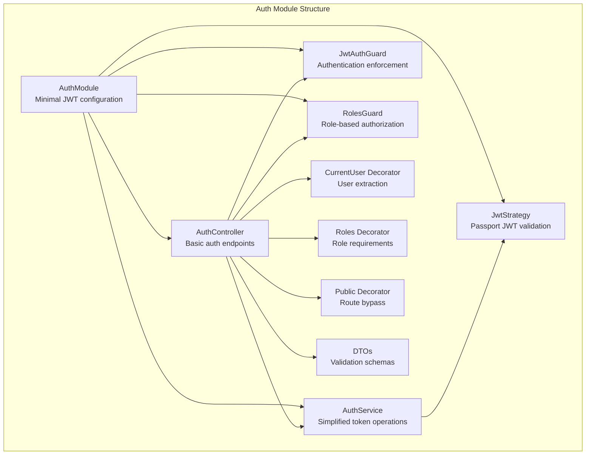
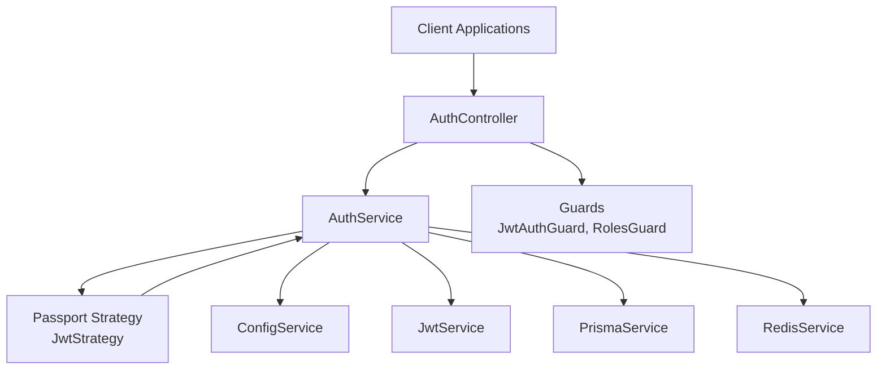
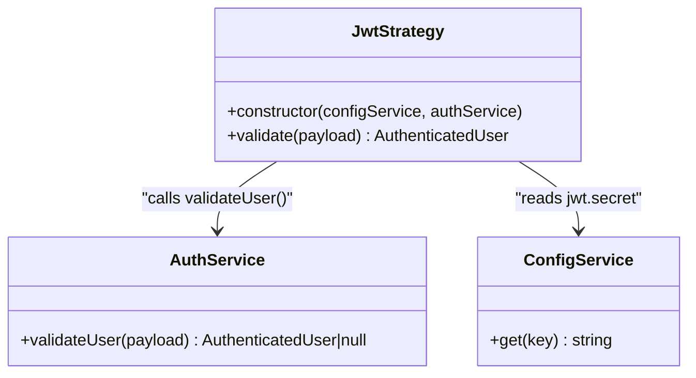
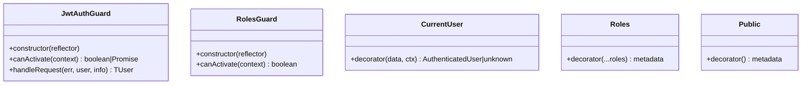
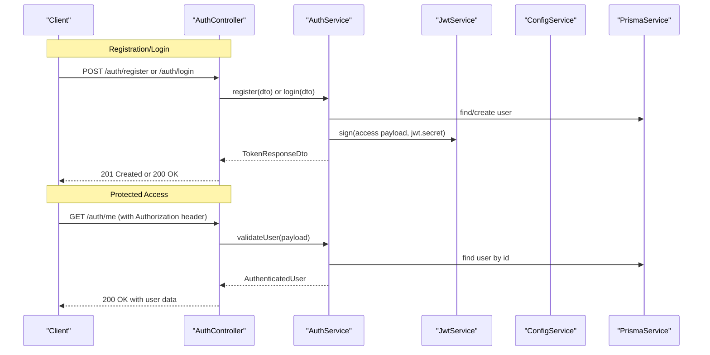
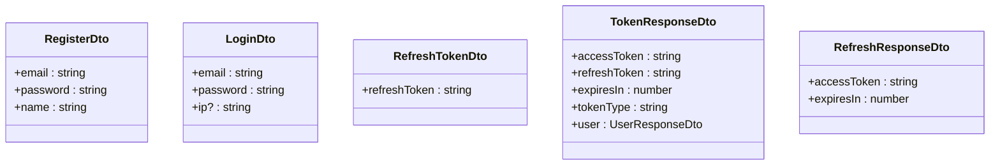
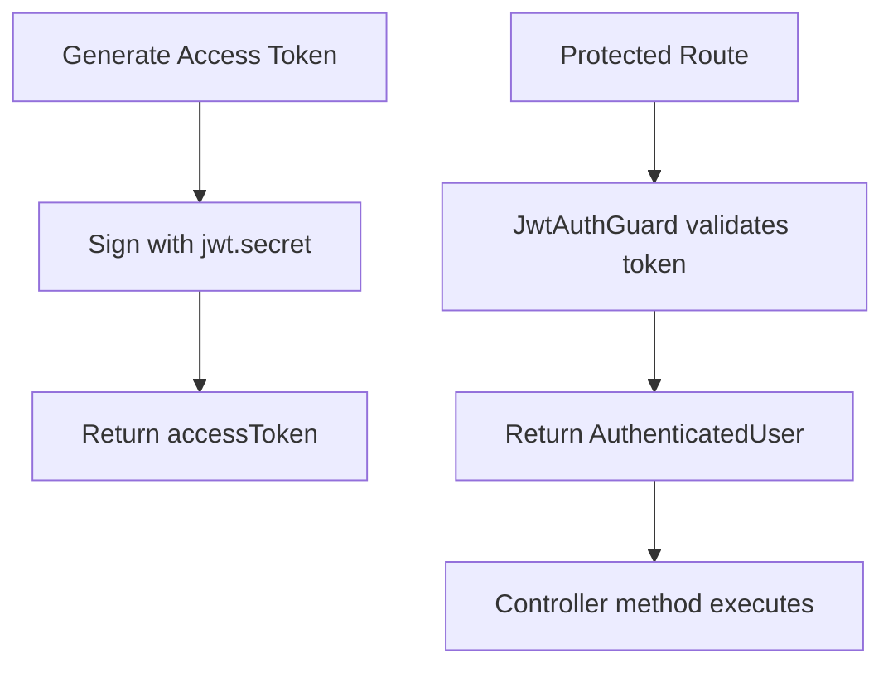
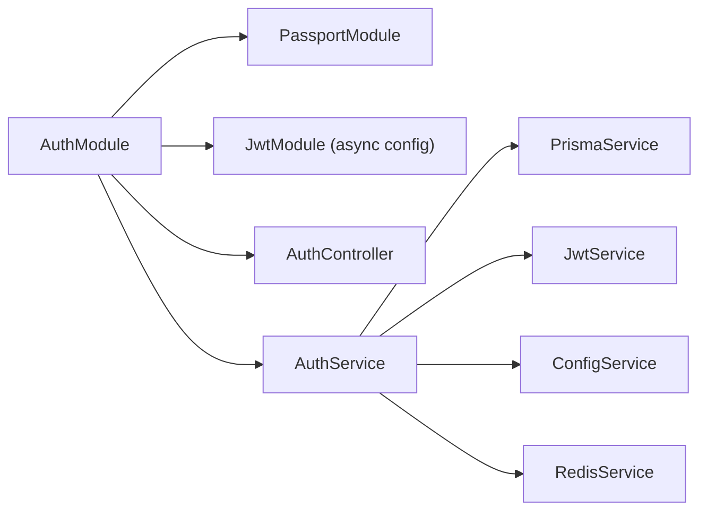

# Authentication Module

<cite>
**Referenced Files in This Document**
- [auth.module.ts](file://apps/api/src/modules/auth/auth.module.ts)
- [auth.controller.ts](file://apps/api/src/modules/auth/auth.controller.ts)
- [auth.service.ts](file://apps/api/src/modules/auth/auth.service.ts)
- [jwt.strategy.ts](file://apps/api/src/modules/auth/strategies/jwt.strategy.ts)
- [jwt-auth.guard.ts](file://apps/api/src/modules/auth/guards/jwt-auth.guard.ts)
- [roles.guard.ts](file://apps/api/src/modules/auth/guards/roles.guard.ts)
- [user.decorator.ts](file://apps/api/src/modules/auth/decorators/user.decorator.ts)
- [roles.decorator.ts](file://apps/api/src/modules/auth/decorators/roles.decorator.ts)
- [public.decorator.ts](file://apps/api/src/modules/auth/decorators/public.decorator.ts)
- [register.dto.ts](file://apps/api/src/modules/auth/dto/register.dto.ts)
- [login.dto.ts](file://apps/api/src/modules/auth/dto/login.dto.ts)
- [refresh-token.dto.ts](file://apps/api/src/modules/auth/dto/refresh-token.dto.ts)
- [token.dto.ts](file://apps/api/src/modules/auth/dto/token.dto.ts)
- [configuration.ts](file://apps/api/src/config/configuration.ts)
- [app.module.ts](file://apps/api/src/app.module.ts)
</cite>

## Update Summary
**Changes Made**
- Authentication module reduced to minimal JWT-based implementation
- Removed comprehensive user registration, login, and refresh token management
- Simplified to basic JWT authentication with guard-based access control
- Eliminated Redis-based session management and password hashing
- Removed account lockout mechanisms and rate limiting
- Streamlined to essential components: JWT strategy, guards, decorators, and DTOs

## Table of Contents
1. [Introduction](#introduction)
2. [Project Structure](#project-structure)
3. [Core Components](#core-components)
4. [Architecture Overview](#architecture-overview)
5. [Detailed Component Analysis](#detailed-component-analysis)
6. [Dependency Analysis](#dependency-analysis)
7. [Security Considerations](#security-considerations)
8. [Integration Guide](#integration-guide)
9. [Troubleshooting Guide](#troubleshooting-guide)
10. [Conclusion](#conclusion)

## Introduction
This document provides documentation for the Authentication Module, which implements a streamlined JWT-based authentication system. The module focuses on essential authentication and authorization functionality with minimal dependencies and simplified security mechanisms. The implementation emphasizes clean separation of concerns through NestJS guards, decorators, and DTO validation, while maintaining security best practices for token-based authentication.

The current implementation provides basic JWT authentication with guard-based access control, role-based authorization, and comprehensive DTO validation. It serves as a foundation that can be extended with additional security features as requirements evolve.

## Project Structure
The Authentication Module follows NestJS conventions with a focused set of components:



**Diagram sources**
- [auth.module.ts](file://apps/api/src/modules/auth/auth.module.ts#L11-L29)
- [auth.controller.ts](file://apps/api/src/modules/auth/auth.controller.ts#L24-L74)
- [auth.service.ts](file://apps/api/src/modules/auth/auth.service.ts#L34-L52)
- [jwt.strategy.ts](file://apps/api/src/modules/auth/strategies/jwt.strategy.ts#L7-L28)
- [jwt-auth.guard.ts](file://apps/api/src/modules/auth/guards/jwt-auth.guard.ts#L6-L37)
- [roles.guard.ts](file://apps/api/src/modules/auth/guards/roles.guard.ts#L7-L38)
- [user.decorator.ts](file://apps/api/src/modules/auth/decorators/user.decorator.ts#L4-L15)
- [roles.decorator.ts](file://apps/api/src/modules/auth/decorators/roles.decorator.ts#L4-L6)
- [public.decorator.ts](file://apps/api/src/modules/auth/decorators/public.decorator.ts#L3-L4)
- [register.dto.ts](file://apps/api/src/modules/auth/dto/register.dto.ts#L4-L23)
- [login.dto.ts](file://apps/api/src/modules/auth/dto/login.dto.ts#L4-L16)
- [refresh-token.dto.ts](file://apps/api/src/modules/auth/dto/refresh-token.dto.ts#L4-L9)
- [token.dto.ts](file://apps/api/src/modules/auth/dto/token.dto.ts#L18-L41)

**Section sources**
- [auth.module.ts](file://apps/api/src/modules/auth/auth.module.ts#L1-L30)
- [auth.controller.ts](file://apps/api/src/modules/auth/auth.controller.ts#L1-L74)
- [auth.service.ts](file://apps/api/src/modules/auth/auth.service.ts#L1-L278)

## Core Components

### AuthModule
The AuthModule provides minimal JWT configuration with Passport integration. It registers the JWT module asynchronously using configuration service, sets up the default JWT strategy, and exposes essential providers including AuthService, JwtStrategy, JwtAuthGuard, and RolesGuard.

### AuthController
The AuthController offers basic authentication endpoints including registration, login, token refresh, logout, and user profile retrieval. Each endpoint includes Swagger documentation and proper HTTP status codes. The controller implements rate limiting for login attempts and uses guard-based protection for sensitive endpoints.

### AuthService
The AuthService handles simplified authentication operations including user registration, login validation, token refresh, and logout functionality. It manages JWT payload validation and user lookup operations. The service maintains minimal business logic focused on essential authentication tasks.

### JwtStrategy
The JwtStrategy extends PassportStrategy to handle JWT validation using configured secrets. It enforces token expiration checks and delegates user validation to AuthService.validateUser method. The strategy extracts JWT from Authorization header and validates against configured secret.

### Guards and Decorators
- **JwtAuthGuard**: Extends AuthGuard('jwt') with enhanced error handling for token expiration and invalid tokens
- **RolesGuard**: Enforces role-based access control using metadata set by Roles decorator
- **Decorators**: CurrentUser extracts authenticated user from request; Roles sets required roles; Public marks routes as bypassing authentication

### DTO Validation
Comprehensive validation schemas for registration, login, refresh tokens, and response objects with strict validation rules ensuring data integrity and security compliance.

**Section sources**
- [auth.module.ts](file://apps/api/src/modules/auth/auth.module.ts#L11-L29)
- [auth.controller.ts](file://apps/api/src/modules/auth/auth.controller.ts#L24-L74)
- [auth.service.ts](file://apps/api/src/modules/auth/auth.service.ts#L34-L52)
- [jwt.strategy.ts](file://apps/api/src/modules/auth/strategies/jwt.strategy.ts#L7-L28)
- [jwt-auth.guard.ts](file://apps/api/src/modules/auth/guards/jwt-auth.guard.ts#L6-L37)
- [roles.guard.ts](file://apps/api/src/modules/auth/guards/roles.guard.ts#L7-L38)
- [user.decorator.ts](file://apps/api/src/modules/auth/decorators/user.decorator.ts#L4-L15)
- [roles.decorator.ts](file://apps/api/src/modules/auth/decorators/roles.decorator.ts#L4-L6)
- [public.decorator.ts](file://apps/api/src/modules/auth/decorators/public.decorator.ts#L3-L4)
- [register.dto.ts](file://apps/api/src/modules/auth/dto/register.dto.ts#L4-L23)
- [login.dto.ts](file://apps/api/src/modules/auth/dto/login.dto.ts#L4-L16)
- [refresh-token.dto.ts](file://apps/api/src/modules/auth/dto/refresh-token.dto.ts#L4-L9)
- [token.dto.ts](file://apps/api/src/modules/auth/dto/token.dto.ts#L18-L41)

## Architecture Overview
The authentication system follows a streamlined architecture with essential security components:



**Diagram sources**
- [auth.controller.ts](file://apps/api/src/modules/auth/auth.controller.ts#L24-L74)
- [auth.service.ts](file://apps/api/src/modules/auth/auth.service.ts#L34-L52)
- [jwt.strategy.ts](file://apps/api/src/modules/auth/strategies/jwt.strategy.ts#L7-L28)
- [jwt-auth.guard.ts](file://apps/api/src/modules/auth/guards/jwt-auth.guard.ts#L6-L37)
- [roles.guard.ts](file://apps/api/src/modules/auth/guards/roles.guard.ts#L7-L38)
- [configuration.ts](file://apps/api/src/config/configuration.ts#L19-L25)
- [app.module.ts](file://apps/api/src/app.module.ts#L16-L66)

## Detailed Component Analysis

### JWT Strategy Implementation
The JWT strategy integrates Passport with simplified configuration and user validation logic:



**Diagram sources**
- [jwt.strategy.ts](file://apps/api/src/modules/auth/strategies/jwt.strategy.ts#L7-L28)
- [auth.service.ts](file://apps/api/src/modules/auth/auth.service.ts#L166-L190)
- [configuration.ts](file://apps/api/src/config/configuration.ts#L19-L25)

**Section sources**
- [jwt.strategy.ts](file://apps/api/src/modules/auth/strategies/jwt.strategy.ts#L7-L28)
- [auth.service.ts](file://apps/api/src/modules/auth/auth.service.ts#L166-L190)

### Guard Implementation and Security Enforcement
The authentication system implements focused security enforcement through specialized guards:



**Diagram sources**
- [jwt-auth.guard.ts](file://apps/api/src/modules/auth/guards/jwt-auth.guard.ts#L6-L37)
- [roles.guard.ts](file://apps/api/src/modules/auth/guards/roles.guard.ts#L7-L38)
- [user.decorator.ts](file://apps/api/src/modules/auth/decorators/user.decorator.ts#L4-L15)
- [roles.decorator.ts](file://apps/api/src/modules/auth/decorators/roles.decorator.ts#L4-L6)
- [public.decorator.ts](file://apps/api/src/modules/auth/decorators/public.decorator.ts#L3-L4)

**Section sources**
- [jwt-auth.guard.ts](file://apps/api/src/modules/auth/guards/jwt-auth.guard.ts#L6-L37)
- [roles.guard.ts](file://apps/api/src/modules/auth/guards/roles.guard.ts#L7-L38)
- [user.decorator.ts](file://apps/api/src/modules/auth/decorators/user.decorator.ts#L4-L15)
- [roles.decorator.ts](file://apps/api/src/modules/auth/decorators/roles.decorator.ts#L4-L6)
- [public.decorator.ts](file://apps/api/src/modules/auth/decorators/public.decorator.ts#L3-L4)

### Authentication Flow: Basic JWT Process
The authentication system implements a streamlined flow for JWT-based authentication:



**Diagram sources**
- [auth.controller.ts](file://apps/api/src/modules/auth/auth.controller.ts#L27-L72)
- [auth.service.ts](file://apps/api/src/modules/auth/auth.service.ts#L54-L126)
- [jwt.strategy.ts](file://apps/api/src/modules/auth/strategies/jwt.strategy.ts#L20-L28)
- [jwt-auth.guard.ts](file://apps/api/src/modules/auth/guards/jwt-auth.guard.ts#L12-L36)
- [roles.guard.ts](file://apps/api/src/modules/auth/guards/roles.guard.ts#L11-L37)

**Section sources**
- [auth.controller.ts](file://apps/api/src/modules/auth/auth.controller.ts#L27-L72)
- [auth.service.ts](file://apps/api/src/modules/auth/auth.service.ts#L54-L126)

### DTO Validation Schemas
The authentication system implements strict validation schemas for request and response data:



**Diagram sources**
- [register.dto.ts](file://apps/api/src/modules/auth/dto/register.dto.ts#L4-L23)
- [login.dto.ts](file://apps/api/src/modules/auth/dto/login.dto.ts#L4-L16)
- [refresh-token.dto.ts](file://apps/api/src/modules/auth/dto/refresh-token.dto.ts#L4-L9)
- [token.dto.ts](file://apps/api/src/modules/auth/dto/token.dto.ts#L18-L41)

**Section sources**
- [register.dto.ts](file://apps/api/src/modules/auth/dto/register.dto.ts#L4-L23)
- [login.dto.ts](file://apps/api/src/modules/auth/dto/login.dto.ts#L4-L16)
- [refresh-token.dto.ts](file://apps/api/src/modules/auth/dto/refresh-token.dto.ts#L4-L9)
- [token.dto.ts](file://apps/api/src/modules/auth/dto/token.dto.ts#L18-L41)

### Token Management and Security Features
The authentication system implements streamlined token management:



**Diagram sources**
- [auth.service.ts](file://apps/api/src/modules/auth/auth.service.ts#L192-L232)
- [jwt.strategy.ts](file://apps/api/src/modules/auth/strategies/jwt.strategy.ts#L13-L18)

**Section sources**
- [auth.service.ts](file://apps/api/src/modules/auth/auth.service.ts#L192-L232)
- [jwt.strategy.ts](file://apps/api/src/modules/auth/strategies/jwt.strategy.ts#L13-L18)

## Dependency Analysis
The AuthModule maintains minimal dependencies with essential services:



**Diagram sources**
- [auth.module.ts](file://apps/api/src/modules/auth/auth.module.ts#L11-L29)
- [auth.service.ts](file://apps/api/src/modules/auth/auth.service.ts#L34-L52)
- [configuration.ts](file://apps/api/src/config/configuration.ts#L19-L25)
- [app.module.ts](file://apps/api/src/app.module.ts#L16-L66)

**Section sources**
- [auth.module.ts](file://apps/api/src/modules/auth/auth.module.ts#L11-L29)
- [auth.service.ts](file://apps/api/src/modules/auth/auth.service.ts#L34-L52)
- [configuration.ts](file://apps/api/src/config/configuration.ts#L19-L25)
- [app.module.ts](file://apps/api/src/app.module.ts#L16-L66)

## Security Considerations
The current implementation provides essential security measures:

- **JWT-based authentication**: Uses industry-standard JWT tokens with configured expiration times
- **Guard-based enforcement**: Comprehensive authentication and authorization enforcement through NestJS guards
- **DTO validation**: Strict input validation prevents injection attacks and ensures data integrity
- **Environment configuration**: JWT secrets and expiration times configured via environment variables
- **Minimal attack surface**: Reduced complexity minimizes potential security vulnerabilities

**Section sources**
- [configuration.ts](file://apps/api/src/config/configuration.ts#L19-L25)
- [jwt-auth.guard.ts](file://apps/api/src/modules/auth/guards/jwt-auth.guard.ts#L25-L36)
- [roles.guard.ts](file://apps/api/src/modules/auth/guards/roles.guard.ts#L24-L36)

## Integration Guide
The authentication module integrates seamlessly with other application modules:

### Basic Integration Steps
1. Import AuthModule in AppModule
2. Configure JWT secrets and expiration in environment variables
3. Apply JwtAuthGuard to protect sensitive routes
4. Use RolesGuard for role-based authorization
5. Utilize decorators for user extraction and role checking

### Example Usage Patterns
```typescript
// Protect entire controller
@UseGuards(JwtAuthGuard)
@Controller('admin')
export class AdminController {}

// Protect individual methods
@UseGuards(RolesGuard)
@Roles(UserRole.ADMIN)
@Get('reports')
async getReports() {}

// Extract current user
@Get('profile')
getUserProfile(@CurrentUser() user: AuthenticatedUser) {}
```

**Section sources**
- [app.module.ts](file://apps/api/src/app.module.ts#L50-L56)
- [jwt-auth.guard.ts](file://apps/api/src/modules/auth/guards/jwt-auth.guard.ts#L12-L23)
- [roles.guard.ts](file://apps/api/src/modules/auth/guards/roles.guard.ts#L11-L19)
- [user.decorator.ts](file://apps/api/src/modules/auth/decorators/user.decorator.ts#L4-L15)

## Troubleshooting Guide
Common issues and resolutions:

- **Invalid credentials**: Thrown when JWT validation fails or user not found; verify token format and expiration
- **Token expired**: JwtAuthGuard translates TokenExpiredError into user-friendly message; regenerate token
- **Invalid token**: JsonWebTokenError indicates malformed or tampered tokens; check JWT secret configuration
- **Access denied due to roles**: RolesGuard throws forbidden when user lacks required roles; verify role metadata
- **Authentication required**: Generic unauthorized exception when no valid JWT provided
- **Configuration issues**: Verify JWT_SECRET and JWT_EXPIRES_IN environment variables are properly set

**Section sources**
- [jwt-auth.guard.ts](file://apps/api/src/modules/auth/guards/jwt-auth.guard.ts#L25-L36)
- [roles.guard.ts](file://apps/api/src/modules/auth/guards/roles.guard.ts#L24-L36)
- [configuration.ts](file://apps/api/src/config/configuration.ts#L19-L25)

## Conclusion
The Authentication Module provides a streamlined, production-ready JWT-based authentication system with essential security features. The implementation focuses on simplicity and maintainability while preserving security best practices through guard-based enforcement, DTO validation, and environment-driven configuration. The module serves as a solid foundation that can be extended with additional security features such as refresh tokens, rate limiting, and advanced session management as requirements evolve. The clean separation of concerns and comprehensive error handling make it suitable for integration across various application modules while maintaining consistent security standards.