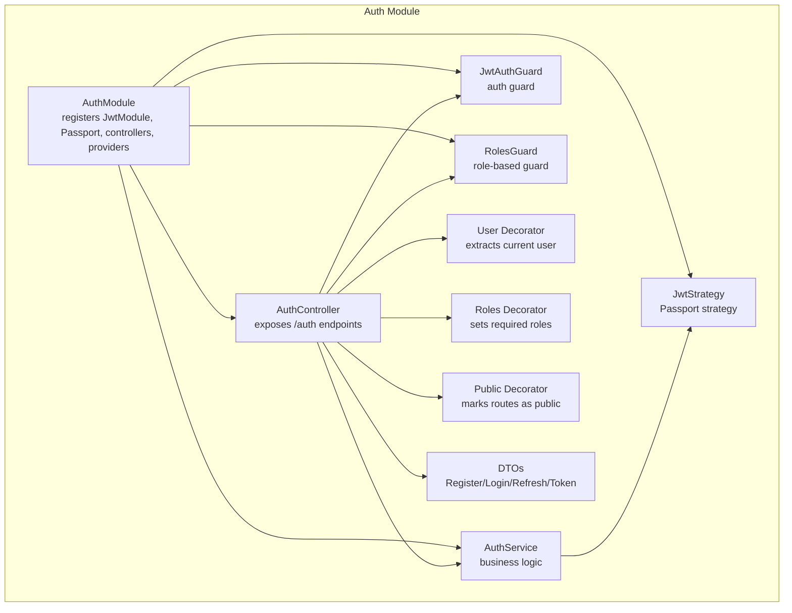
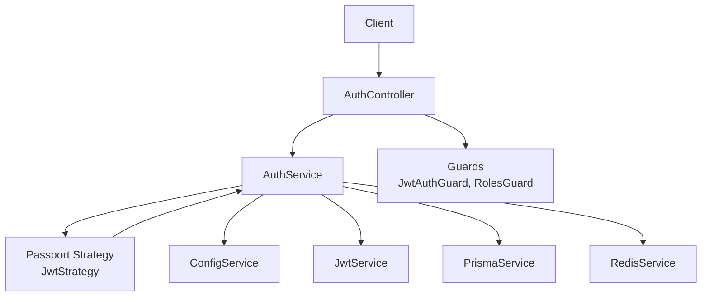
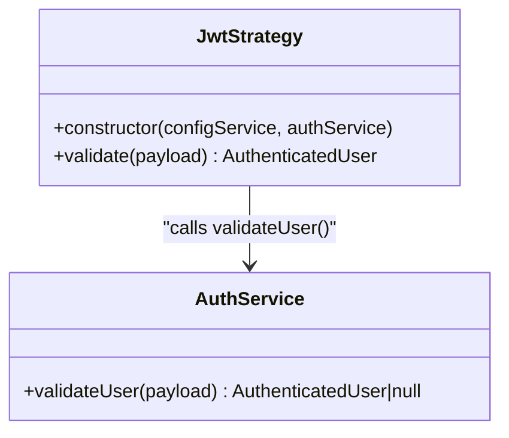
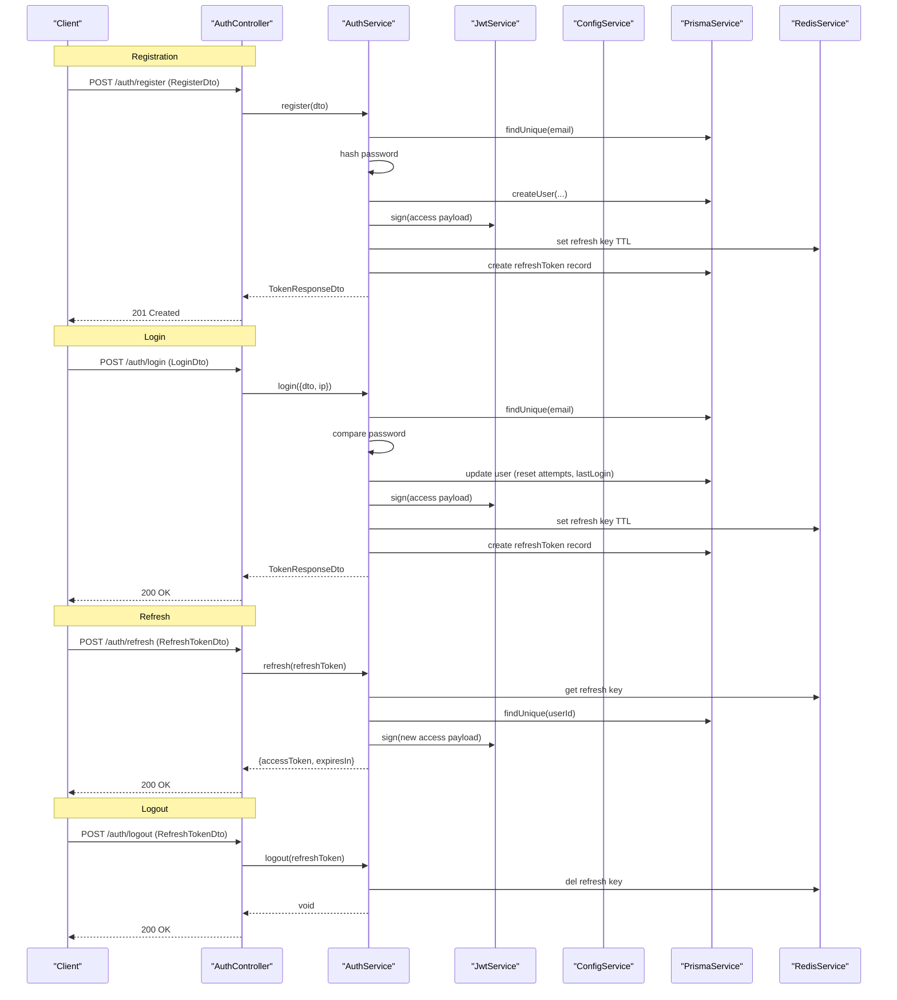
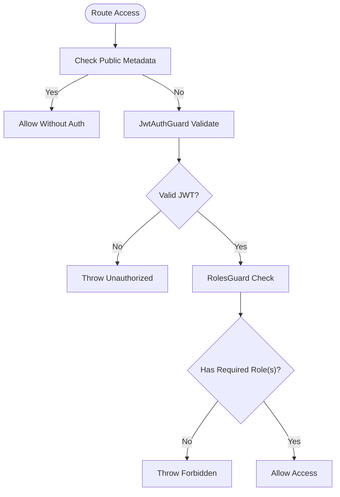
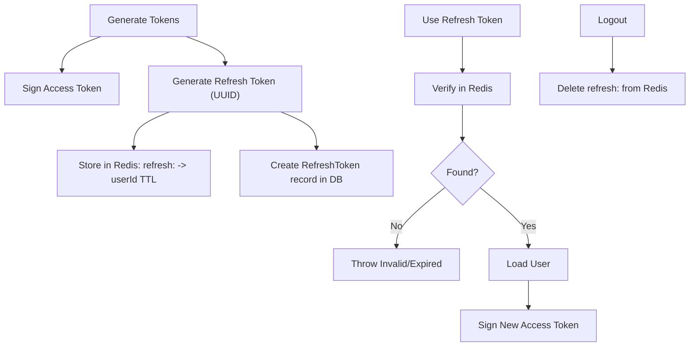
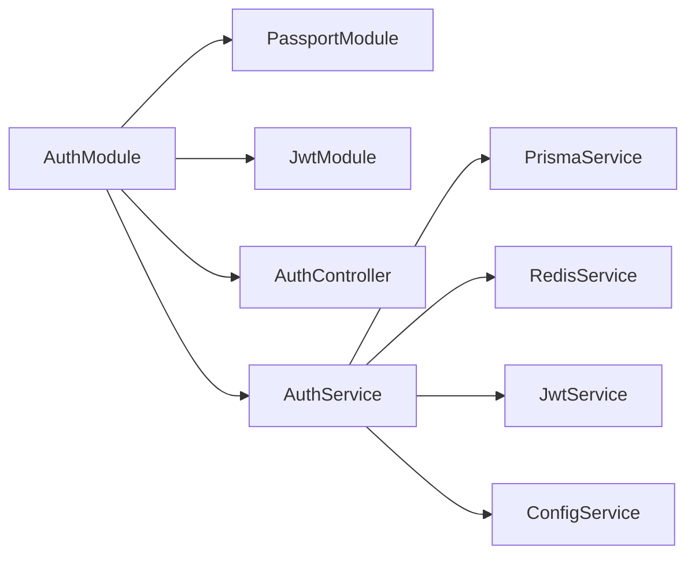

# Authentication Module

<cite>
**Referenced Files in This Document**
- [auth.module.ts](file://apps/api/src/modules/auth/auth.module.ts)
- [auth.controller.ts](file://apps/api/src/modules/auth/auth.controller.ts)
- [auth.service.ts](file://apps/api/src/modules/auth/auth.service.ts)
- [jwt.strategy.ts](file://apps/api/src/modules/auth/strategies/jwt.strategy.ts)
- [jwt-auth.guard.ts](file://apps/api/src/modules/auth/guards/jwt-auth.guard.ts)
- [roles.guard.ts](file://apps/api/src/modules/auth/guards/roles.guard.ts)
- [user.decorator.ts](file://apps/api/src/modules/auth/decorators/user.decorator.ts)
- [roles.decorator.ts](file://apps/api/src/modules/auth/decorators/roles.decorator.ts)
- [public.decorator.ts](file://apps/api/src/modules/auth/decorators/public.decorator.ts)
- [register.dto.ts](file://apps/api/src/modules/auth/dto/register.dto.ts)
- [login.dto.ts](file://apps/api/src/modules/auth/dto/login.dto.ts)
- [refresh-token.dto.ts](file://apps/api/src/modules/auth/dto/refresh-token.dto.ts)
- [token.dto.ts](file://apps/api/src/modules/auth/dto/token.dto.ts)
- [configuration.ts](file://apps/api/src/config/configuration.ts)
- [app.module.ts](file://apps/api/src/app.module.ts)
- [04-api-documentation.md](file://docs/cto/04-api-documentation.md)
</cite>

## Table of Contents
1. [Introduction](#introduction)
2. [Project Structure](#project-structure)
3. [Core Components](#core-components)
4. [Architecture Overview](#architecture-overview)
5. [Detailed Component Analysis](#detailed-component-analysis)
6. [Dependency Analysis](#dependency-analysis)
7. [Performance Considerations](#performance-considerations)
8. [Troubleshooting Guide](#troubleshooting-guide)
9. [Conclusion](#conclusion)
10. [Appendices](#appendices)

## Introduction
This document provides comprehensive documentation for the Authentication Module. It explains the JWT-based authentication system, user registration and login processes, role-based access control (RBAC), and security guard mechanisms. It covers the end-to-end authentication flow from user registration through JWT token issuance, refresh token handling, and protected route access. It also documents the JWT strategy, custom decorators for user extraction and role checking, guard mechanisms for endpoint protection, DTO validation schemas, token management strategies, and production security considerations.

## Project Structure
The Authentication Module is organized around NestJS conventions:
- Module definition registers Passport strategies, JWT module, controllers, services, guards, and decorators.
- Controllers expose endpoints for registration, login, token refresh, logout, and profile retrieval.
- Services encapsulate business logic for user lifecycle, token generation, validation, and refresh token management.
- Strategies and guards integrate with Passport and NestJS guards to enforce authentication and authorization.
- DTOs define validated request/response shapes for registration, login, refresh, and token responses.
- Decorators provide convenient access to current user and role metadata in request handlers.

**Diagram sources**
- [auth.module.ts](file://apps/api/src/modules/auth/auth.module.ts#L11-L29)
- [auth.controller.ts](file://apps/api/src/modules/auth/auth.controller.ts#L24-L74)
- [auth.service.ts](file://apps/api/src/modules/auth/auth.service.ts#L34-L52)
- [jwt.strategy.ts](file://apps/api/src/modules/auth/strategies/jwt.strategy.ts#L7-L28)
- [jwt-auth.guard.ts](file://apps/api/src/modules/auth/guards/jwt-auth.guard.ts#L6-L37)
- [roles.guard.ts](file://apps/api/src/modules/auth/guards/roles.guard.ts#L7-L38)
- [user.decorator.ts](file://apps/api/src/modules/auth/decorators/user.decorator.ts#L4-L15)
- [roles.decorator.ts](file://apps/api/src/modules/auth/decorators/roles.decorator.ts#L4-L6)
- [public.decorator.ts](file://apps/api/src/modules/auth/decorators/public.decorator.ts#L3-L4)
- [register.dto.ts](file://apps/api/src/modules/auth/dto/register.dto.ts#L4-L23)
- [login.dto.ts](file://apps/api/src/modules/auth/dto/login.dto.ts#L4-L16)
- [refresh-token.dto.ts](file://apps/api/src/modules/auth/dto/refresh-token.dto.ts#L4-L9)
- [token.dto.ts](file://apps/api/src/modules/auth/dto/token.dto.ts#L18-L41)

**Section sources**
- [auth.module.ts](file://apps/api/src/modules/auth/auth.module.ts#L1-L30)
- [auth.controller.ts](file://apps/api/src/modules/auth/auth.controller.ts#L1-L74)
- [auth.service.ts](file://apps/api/src/modules/auth/auth.service.ts#L1-L278)

## Core Components
- AuthModule: Registers Passport default strategy as JWT, configures JwtModule asynchronously via ConfigService, and exposes AuthService, guards, and strategies.
- AuthController: Defines endpoints for register, login, refresh, logout, and profile retrieval; applies throttling and guards.
- AuthService: Implements registration, login, token generation, refresh token storage and validation, logout, and user validation for JWT payloads.
- JwtStrategy: Extends PassportStrategy to extract and validate JWTs using configured secrets and expiration settings.
- JwtAuthGuard: Extends AuthGuard('jwt'), integrates with Reflector to support public routes and translate token errors into meaningful exceptions.
- RolesGuard: Enforces role-based access control using metadata set by Roles decorator.
- Decorators: CurrentUser extracts the authenticated user from the request; Roles sets required roles metadata; Public marks routes as bypassing authentication.
- DTOs: Strongly typed validation schemas for registration, login, refresh token, and token responses.

**Section sources**
- [auth.module.ts](file://apps/api/src/modules/auth/auth.module.ts#L11-L29)
- [auth.controller.ts](file://apps/api/src/modules/auth/auth.controller.ts#L24-L74)
- [auth.service.ts](file://apps/api/src/modules/auth/auth.service.ts#L34-L278)
- [jwt.strategy.ts](file://apps/api/src/modules/auth/strategies/jwt.strategy.ts#L7-L29)
- [jwt-auth.guard.ts](file://apps/api/src/modules/auth/guards/jwt-auth.guard.ts#L6-L37)
- [roles.guard.ts](file://apps/api/src/modules/auth/guards/roles.guard.ts#L7-L38)
- [user.decorator.ts](file://apps/api/src/modules/auth/decorators/user.decorator.ts#L4-L15)
- [roles.decorator.ts](file://apps/api/src/modules/auth/decorators/roles.decorator.ts#L4-L6)
- [public.decorator.ts](file://apps/api/src/modules/auth/decorators/public.decorator.ts#L3-L4)
- [register.dto.ts](file://apps/api/src/modules/auth/dto/register.dto.ts#L4-L23)
- [login.dto.ts](file://apps/api/src/modules/auth/dto/login.dto.ts#L4-L16)
- [refresh-token.dto.ts](file://apps/api/src/modules/auth/dto/refresh-token.dto.ts#L4-L9)
- [token.dto.ts](file://apps/api/src/modules/auth/dto/token.dto.ts#L18-L41)

## Architecture Overview
The authentication system follows a layered architecture:
- Presentation Layer: AuthController handles HTTP requests and responses.
- Application Layer: AuthService orchestrates business logic, integrates with external systems (Prisma, Redis, ConfigService, JwtService).
- Security Layer: JwtStrategy validates JWTs; guards enforce authentication and authorization.
- Data Transfer Objects: DTOs validate and shape request/response payloads.

**Diagram sources**
- [auth.controller.ts](file://apps/api/src/modules/auth/auth.controller.ts#L24-L74)
- [auth.service.ts](file://apps/api/src/modules/auth/auth.service.ts#L34-L52)
- [jwt.strategy.ts](file://apps/api/src/modules/auth/strategies/jwt.strategy.ts#L7-L28)
- [jwt-auth.guard.ts](file://apps/api/src/modules/auth/guards/jwt-auth.guard.ts#L6-L37)
- [roles.guard.ts](file://apps/api/src/modules/auth/guards/roles.guard.ts#L7-L38)
- [configuration.ts](file://apps/api/src/config/configuration.ts#L19-L25)
- [app.module.ts](file://apps/api/src/app.module.ts#L16-L66)

## Detailed Component Analysis

### JWT Strategy
The JWT strategy integrates Passport with the application’s JWT configuration and user validation logic:
- Uses ExtractJwt.fromAuthHeaderAsBearerToken to extract tokens from Authorization headers.
- Validates tokens against configured secret and enforces expiration.
- Delegates user lookup and validation to AuthService.validateUser.

**Diagram sources**
- [jwt.strategy.ts](file://apps/api/src/modules/auth/strategies/jwt.strategy.ts#L7-L28)
- [auth.service.ts](file://apps/api/src/modules/auth/auth.service.ts#L166-L190)

**Section sources**
- [jwt.strategy.ts](file://apps/api/src/modules/auth/strategies/jwt.strategy.ts#L7-L29)
- [auth.service.ts](file://apps/api/src/modules/auth/auth.service.ts#L166-L190)

### Guards and Decorators
- JwtAuthGuard: Extends AuthGuard('jwt'). Integrates with Reflector to check for public routes and translates token errors into user-friendly exceptions.
- RolesGuard: Reads required roles from handler/class metadata and compares against the authenticated user’s role.
- CurrentUser decorator: Extracts the authenticated user from the request object, optionally returning a specific property.
- Roles decorator: Sets required roles metadata for a handler or controller.
- Public decorator: Marks a route as public so JwtAuthGuard does not require authentication.

**Diagram sources**
- [jwt-auth.guard.ts](file://apps/api/src/modules/auth/guards/jwt-auth.guard.ts#L6-L37)
- [roles.guard.ts](file://apps/api/src/modules/auth/guards/roles.guard.ts#L7-L38)
- [user.decorator.ts](file://apps/api/src/modules/auth/decorators/user.decorator.ts#L4-L15)
- [roles.decorator.ts](file://apps/api/src/modules/auth/decorators/roles.decorator.ts#L4-L6)
- [public.decorator.ts](file://apps/api/src/modules/auth/decorators/public.decorator.ts#L3-L4)

**Section sources**
- [jwt-auth.guard.ts](file://apps/api/src/modules/auth/guards/jwt-auth.guard.ts#L6-L37)
- [roles.guard.ts](file://apps/api/src/modules/auth/guards/roles.guard.ts#L7-L38)
- [user.decorator.ts](file://apps/api/src/modules/auth/decorators/user.decorator.ts#L4-L15)
- [roles.decorator.ts](file://apps/api/src/modules/auth/decorators/roles.decorator.ts#L4-L6)
- [public.decorator.ts](file://apps/api/src/modules/auth/decorators/public.decorator.ts#L3-L4)

### Authentication Flow: Registration, Login, Token Issuance, Refresh, Logout
The end-to-end flow is as follows:
- Registration: Validates input via RegisterDto, hashes password, creates user, generates access and refresh tokens, stores refresh token in Redis and database, and returns token response.
- Login: Finds user by email, checks account lockout, verifies password, updates login metrics, generates tokens, and returns token response.
- Token Refresh: Verifies refresh token in Redis, loads user, signs a new access token, and returns it with expiration.
- Logout: Deletes refresh token from Redis.

**Diagram sources**
- [auth.controller.ts](file://apps/api/src/modules/auth/auth.controller.ts#L27-L62)
- [auth.service.ts](file://apps/api/src/modules/auth/auth.service.ts#L54-L232)
- [jwt.strategy.ts](file://apps/api/src/modules/auth/strategies/jwt.strategy.ts#L20-L28)
- [jwt-auth.guard.ts](file://apps/api/src/modules/auth/guards/jwt-auth.guard.ts#L12-L36)
- [roles.guard.ts](file://apps/api/src/modules/auth/guards/roles.guard.ts#L11-L37)

**Section sources**
- [auth.controller.ts](file://apps/api/src/modules/auth/auth.controller.ts#L27-L62)
- [auth.service.ts](file://apps/api/src/modules/auth/auth.service.ts#L54-L232)

### DTO Validation Schemas
- RegisterDto: Validates email format, password length and complexity, and name length.
- LoginDto: Validates email and non-empty password; IP is populated server-side.
- RefreshTokenDto: Validates presence of refresh token string.
- TokenResponseDto and RefreshResponseDto: Define response structures for access/refresh tokens and user metadata.

**Diagram sources**
- [register.dto.ts](file://apps/api/src/modules/auth/dto/register.dto.ts#L4-L23)
- [login.dto.ts](file://apps/api/src/modules/auth/dto/login.dto.ts#L4-L16)
- [refresh-token.dto.ts](file://apps/api/src/modules/auth/dto/refresh-token.dto.ts#L4-L9)
- [token.dto.ts](file://apps/api/src/modules/auth/dto/token.dto.ts#L18-L41)

**Section sources**
- [register.dto.ts](file://apps/api/src/modules/auth/dto/register.dto.ts#L4-L23)
- [login.dto.ts](file://apps/api/src/modules/auth/dto/login.dto.ts#L4-L16)
- [refresh-token.dto.ts](file://apps/api/src/modules/auth/dto/refresh-token.dto.ts#L4-L9)
- [token.dto.ts](file://apps/api/src/modules/auth/dto/token.dto.ts#L18-L41)

### Protected Route Access and Role-Based Authorization
- JwtAuthGuard protects routes by validating JWTs and allowing public routes via Public decorator.
- RolesGuard enforces role-based access using Roles decorator metadata.
- CurrentUser decorator simplifies extracting the authenticated user in handlers.

**Diagram sources**
- [jwt-auth.guard.ts](file://apps/api/src/modules/auth/guards/jwt-auth.guard.ts#L12-L36)
- [roles.guard.ts](file://apps/api/src/modules/auth/guards/roles.guard.ts#L11-L37)
- [public.decorator.ts](file://apps/api/src/modules/auth/decorators/public.decorator.ts#L3-L4)
- [roles.decorator.ts](file://apps/api/src/modules/auth/decorators/roles.decorator.ts#L4-L6)
- [user.decorator.ts](file://apps/api/src/modules/auth/decorators/user.decorator.ts#L4-L15)

**Section sources**
- [jwt-auth.guard.ts](file://apps/api/src/modules/auth/guards/jwt-auth.guard.ts#L12-L36)
- [roles.guard.ts](file://apps/api/src/modules/auth/guards/roles.guard.ts#L11-L37)
- [public.decorator.ts](file://apps/api/src/modules/auth/decorators/public.decorator.ts#L3-L4)
- [roles.decorator.ts](file://apps/api/src/modules/auth/decorators/roles.decorator.ts#L4-L6)
- [user.decorator.ts](file://apps/api/src/modules/auth/decorators/user.decorator.ts#L4-L15)

### Token Management Strategies
- Access tokens: Short-lived (configured via jwt.expiresIn), signed with jwt.secret.
- Refresh tokens: UUID-based, stored in Redis with TTL derived from jwt.refreshExpiresIn; also recorded in database for audit.
- Logout invalidates refresh tokens by removing them from Redis.

**Diagram sources**
- [auth.service.ts](file://apps/api/src/modules/auth/auth.service.ts#L192-L232)
- [auth.service.ts](file://apps/api/src/modules/auth/auth.service.ts#L128-L158)
- [auth.service.ts](file://apps/api/src/modules/auth/auth.service.ts#L160-L164)

**Section sources**
- [auth.service.ts](file://apps/api/src/modules/auth/auth.service.ts#L192-L232)
- [auth.service.ts](file://apps/api/src/modules/auth/auth.service.ts#L128-L158)
- [auth.service.ts](file://apps/api/src/modules/auth/auth.service.ts#L160-L164)

### Security Best Practices
- Environment-driven configuration for secrets and expiration.
- Password hashing with configurable cost.
- Account lockout after repeated failed logins.
- Redis-backed refresh tokens with TTL and database audit trail.
- Rate limiting applied globally and per-endpoint.
- Guard-based enforcement of authentication and roles.

**Section sources**
- [configuration.ts](file://apps/api/src/config/configuration.ts#L19-L37)
- [auth.service.ts](file://apps/api/src/modules/auth/auth.service.ts#L234-L253)
- [auth.controller.ts](file://apps/api/src/modules/auth/auth.controller.ts#L37-L43)
- [app.module.ts](file://apps/api/src/app.module.ts#L25-L42)

## Dependency Analysis
The AuthModule composes multiple external and internal dependencies:
- PassportModule: Provides default JWT strategy integration.
- JwtModule: Configured asynchronously via ConfigService with secret and sign options.
- PrismaService: Persists user and refresh token records.
- RedisService: Stores refresh tokens with TTL.
- JwtService: Signs access and refresh tokens.
- ConfigService: Supplies runtime configuration for secrets, expiration, and security parameters.

**Diagram sources**
- [auth.module.ts](file://apps/api/src/modules/auth/auth.module.ts#L11-L29)
- [auth.service.ts](file://apps/api/src/modules/auth/auth.service.ts#L34-L52)
- [configuration.ts](file://apps/api/src/config/configuration.ts#L19-L25)
- [app.module.ts](file://apps/api/src/app.module.ts#L16-L66)

**Section sources**
- [auth.module.ts](file://apps/api/src/modules/auth/auth.module.ts#L11-L29)
- [auth.service.ts](file://apps/api/src/modules/auth/auth.service.ts#L34-L52)
- [configuration.ts](file://apps/api/src/config/configuration.ts#L19-L25)
- [app.module.ts](file://apps/api/src/app.module.ts#L16-L66)

## Performance Considerations
- Use short-lived access tokens (default 15 minutes) to minimize exposure windows.
- Offload refresh token verification to Redis for O(1) lookup and TTL-based eviction.
- Apply rate limiting to reduce brute-force login attempts and protect endpoints.
- Keep bcrypt cost (rounds) balanced to avoid excessive CPU usage while maintaining security.
- Consider token revocation strategies (blacklists or incremental token versioning) for high-risk scenarios.

[No sources needed since this section provides general guidance]

## Troubleshooting Guide
Common issues and resolutions:
- Invalid credentials during login: Thrown when user not found, password mismatch, or account locked; review failed login attempts and lockout logic.
- Invalid or expired refresh token: Occurs when refresh token not found in Redis or user deleted; ensure logout clears Redis and DB entries.
- Token expired or invalid: JwtAuthGuard translates token errors into user-friendly messages.
- Access denied due to roles: RolesGuard throws forbidden when user lacks required roles; verify role metadata set by Roles decorator.

**Section sources**
- [auth.service.ts](file://apps/api/src/modules/auth/auth.service.ts#L85-L126)
- [auth.service.ts](file://apps/api/src/modules/auth/auth.service.ts#L128-L158)
- [jwt-auth.guard.ts](file://apps/api/src/modules/auth/guards/jwt-auth.guard.ts#L25-L36)
- [roles.guard.ts](file://apps/api/src/modules/auth/guards/roles.guard.ts#L24-L34)

## Conclusion
The Authentication Module implements a robust, production-ready JWT-based authentication system with strong validation, secure token management, and role-based access control. It leverages NestJS guards and decorators for clean, maintainable security enforcement, integrates Redis for scalable refresh token handling, and uses environment-driven configuration for flexibility and security. The documented flows, DTOs, and guards provide a solid foundation for extending and securing additional endpoints.

[No sources needed since this section summarizes without analyzing specific files]

## Appendices

### Example Requests and Responses
- Login request and response are documented in the API documentation.
- Authorization header format: Authorization: Bearer <access_token>.

**Section sources**
- [04-api-documentation.md](file://docs/cto/04-api-documentation.md#L55-L132)