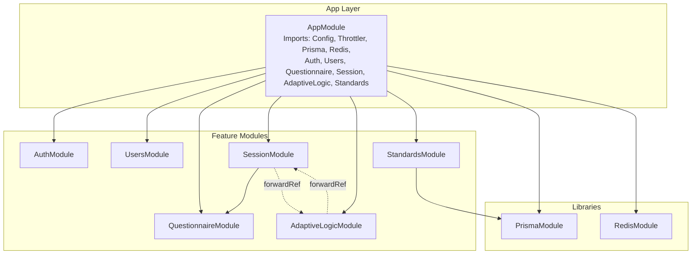
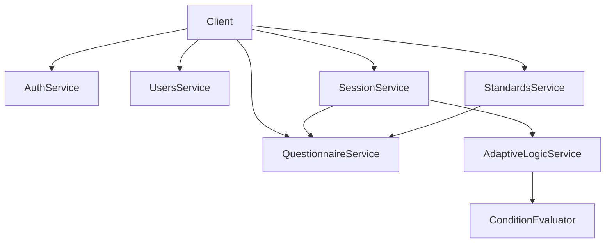
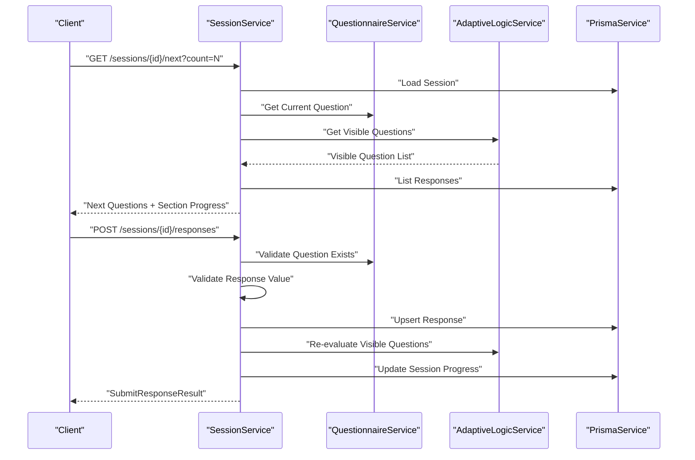
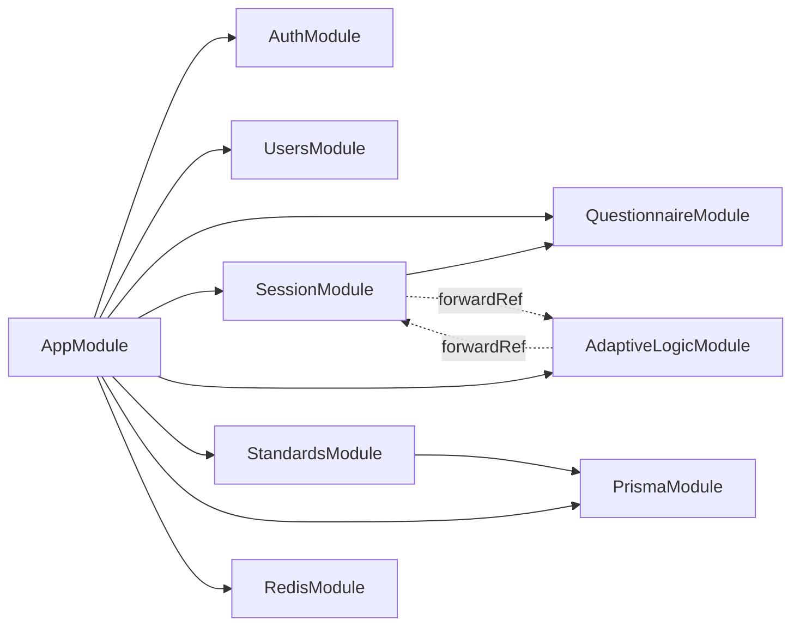

# Core Modules

<cite>
**Referenced Files in This Document**
- [app.module.ts](file://apps/api/src/app.module.ts)
- [auth.module.ts](file://apps/api/src/modules/auth/auth.module.ts)
- [auth.service.ts](file://apps/api/src/modules/auth/auth.service.ts)
- [users.module.ts](file://apps/api/src/modules/users/users.module.ts)
- [users.service.ts](file://apps/api/src/modules/users/users.service.ts)
- [questionnaire.module.ts](file://apps/api/src/modules/questionnaire/questionnaire.module.ts)
- [questionnaire.service.ts](file://apps/api/src/modules/questionnaire/questionnaire.service.ts)
- [session.module.ts](file://apps/api/src/modules/session/session.module.ts)
- [session.service.ts](file://apps/api/src/modules/session/session.service.ts)
- [standards.module.ts](file://apps/api/src/modules/standards/standards.module.ts)
- [standards.service.ts](file://apps/api/src/modules/standards/standards.service.ts)
- [adaptive-logic.module.ts](file://apps/api/src/modules/adaptive-logic/adaptive-logic.module.ts)
- [adaptive-logic.service.ts](file://apps/api/src/modules/adaptive-logic/adaptive-logic.service.ts)
- [condition.evaluator.ts](file://apps/api/src/modules/adaptive-logic/evaluators/condition.evaluator.ts)
- [rule.types.ts](file://apps/api/src/modules/adaptive-logic/types/rule.types.ts)
- [standard.types.ts](file://apps/api/src/modules/standards/types/standard.types.ts)
- [register.dto.ts](file://apps/api/src/modules/auth/dto/register.dto.ts)
- [create-session.dto.ts](file://apps/api/src/modules/session/dto/create-session.dto.ts)
</cite>

## Table of Contents
1. [Introduction](#introduction)
2. [Project Structure](#project-structure)
3. [Core Components](#core-components)
4. [Architecture Overview](#architecture-overview)
5. [Detailed Component Analysis](#detailed-component-analysis)
6. [Dependency Analysis](#dependency-analysis)
7. [Performance Considerations](#performance-considerations)
8. [Troubleshooting Guide](#troubleshooting-guide)
9. [Conclusion](#conclusion)

## Introduction
This document explains the core modules that power the Quiz-to-build questionnaire system. It covers Authentication, User Management, Questionnaire, Session, Standards, and Adaptive Logic. Each module encapsulates distinct business capabilities and integrates through NestJS modules and services. Together, they orchestrate a secure, adaptive, and scalable quiz/survey experience with dynamic question flows, user lifecycle management, and compliance-driven content generation.

## Project Structure
The application is organized as a NestJS monorepo-style setup under apps/api with feature-based modules. The AppModule wires together configuration, rate limiting, database, cache, and all feature modules. Each module exposes a controller and a service, with internal submodules for specialized concerns like adaptive logic evaluation and standards mapping.

**Diagram sources**
- [app.module.ts](file://apps/api/src/app.module.ts#L16-L66)
- [auth.module.ts](file://apps/api/src/modules/auth/auth.module.ts#L11-L28)
- [users.module.ts](file://apps/api/src/modules/users/users.module.ts#L5-L9)
- [questionnaire.module.ts](file://apps/api/src/modules/questionnaire/questionnaire.module.ts#L5-L8)
- [session.module.ts](file://apps/api/src/modules/session/session.module.ts#L7-L14)
- [adaptive-logic.module.ts](file://apps/api/src/modules/adaptive-logic/adaptive-logic.module.ts#L6-L9)
- [standards.module.ts](file://apps/api/src/modules/standards/standards.module.ts#L6-L10)

**Section sources**
- [app.module.ts](file://apps/api/src/app.module.ts#L1-L67)

## Core Components
This section outlines each module’s purpose, scope, and primary responsibilities.

- Authentication (AuthModule/AuthService)
  - Purpose: Secure user registration, login, JWT issuance, refresh token lifecycle, logout, and user validation.
  - Scope: Password hashing, failed login locking, Redis-backed refresh tokens, and guarded routes via JWT and role guards.
  - Key integrations: Prisma for persistence, Redis for refresh token storage, ConfigService for secrets and TTLs.

- User Management (UsersModule/UsersService)
  - Purpose: Retrieve and update user profiles, compute derived statistics, and list users with pagination.
  - Scope: Profile fields, preferences, organization linkage, and completion metrics.
  - Key integrations: Prisma queries and mapped DTOs for consistent responses.

- Questionnaire (QuestionnaireModule/QuestionnaireService)
  - Purpose: Manage questionnaire metadata, sections, and questions; expose lists and details with visibility rules.
  - Scope: Pagination, industry filtering, question option normalization, and validation rule mapping.
  - Key integrations: Prisma for hierarchical data retrieval.

- Session (SessionModule/SessionService)
  - Purpose: Drive interactive quiz sessions, manage progress, enforce validation, and integrate adaptive logic.
  - Scope: Create, continue, submit responses, calculate progress, and determine completion eligibility.
  - Key integrations: QuestionnaireService for question metadata, AdaptiveLogicService for visibility, Prisma for persistence.

- Adaptive Logic (AdaptiveLogicModule/AdaptiveLogicService)
  - Purpose: Evaluate visibility and requirement rules, derive next questions, and compute adaptive changes.
  - Scope: Condition evaluation engine, rule prioritization, dependency graph building, and metrics-friendly APIs.
  - Key integrations: Prisma for rule and question data, ConditionEvaluator for operator logic.

- Standards (StandardsModule/StandardsService)
  - Purpose: Provide engineering standards, map standards to document types, and generate standardized content sections.
  - Scope: Category-based retrieval, mapping resolution, and markdown generation for compliance sections.
  - Key integrations: Prisma for standards and mappings.

**Section sources**
- [auth.module.ts](file://apps/api/src/modules/auth/auth.module.ts#L1-L30)
- [auth.service.ts](file://apps/api/src/modules/auth/auth.service.ts#L34-L278)
- [users.module.ts](file://apps/api/src/modules/users/users.module.ts#L1-L11)
- [users.service.ts](file://apps/api/src/modules/users/users.service.ts#L37-L200)
- [questionnaire.module.ts](file://apps/api/src/modules/questionnaire/questionnaire.module.ts#L1-L11)
- [questionnaire.service.ts](file://apps/api/src/modules/questionnaire/questionnaire.service.ts#L63-L253)
- [session.module.ts](file://apps/api/src/modules/session/session.module.ts#L1-L17)
- [session.service.ts](file://apps/api/src/modules/session/session.service.ts#L87-L684)
- [adaptive-logic.module.ts](file://apps/api/src/modules/adaptive-logic/adaptive-logic.module.ts#L1-L12)
- [adaptive-logic.service.ts](file://apps/api/src/modules/adaptive-logic/adaptive-logic.service.ts#L19-L307)
- [condition.evaluator.ts](file://apps/api/src/modules/adaptive-logic/evaluators/condition.evaluator.ts#L1-L402)
- [standards.module.ts](file://apps/api/src/modules/standards/standards.module.ts#L1-L13)
- [standards.service.ts](file://apps/api/src/modules/standards/standards.service.ts#L12-L197)

## Architecture Overview
The system follows a layered, modular architecture:
- AppModule orchestrates configuration, guards, and feature modules.
- Feature modules are loosely coupled and communicate primarily through services and DTOs.
- Cross-cutting concerns (security, caching, persistence) are provided by libraries (PrismaModule, RedisModule).
- Adaptive Logic is a specialized engine invoked by SessionService to dynamically shape the questionnaire flow.

**Diagram sources**
- [app.module.ts](file://apps/api/src/app.module.ts#L50-L56)
- [auth.service.ts](file://apps/api/src/modules/auth/auth.service.ts#L34-L278)
- [users.service.ts](file://apps/api/src/modules/users/users.service.ts#L37-L200)
- [questionnaire.service.ts](file://apps/api/src/modules/questionnaire/questionnaire.service.ts#L63-L253)
- [session.service.ts](file://apps/api/src/modules/session/session.service.ts#L87-L684)
- [adaptive-logic.service.ts](file://apps/api/src/modules/adaptive-logic/adaptive-logic.service.ts#L19-L307)
- [condition.evaluator.ts](file://apps/api/src/modules/adaptive-logic/evaluators/condition.evaluator.ts#L1-L402)
- [standards.service.ts](file://apps/api/src/modules/standards/standards.service.ts#L12-L197)

## Detailed Component Analysis

### Authentication Module
Purpose:
- Provide secure user onboarding and session management with robust validation and resilience controls.

Key responsibilities:
- Registration with uniqueness checks and hashed passwords.
- Login with credential verification, lockout policy, and audit updates.
- Refresh token issuance and revocation using Redis and database records.
- JWT payload validation and protected route enforcement.

**Diagram sources**
- [auth.service.ts](file://apps/api/src/modules/auth/auth.service.ts#L54-L164)

**Section sources**
- [auth.module.ts](file://apps/api/src/modules/auth/auth.module.ts#L11-L28)
- [auth.service.ts](file://apps/api/src/modules/auth/auth.service.ts#L34-L278)
- [register.dto.ts](file://apps/api/src/modules/auth/dto/register.dto.ts#L1-L24)

### User Management Module
Purpose:
- Centralize user profile operations with strict access control and rich statistics.

Key responsibilities:
- Fetch user by ID with organization and completion counts.
- Update profile fields and preferences with role-aware permissions.
- Paginated listing with optional role filter.

**Diagram sources**
- [users.service.ts](file://apps/api/src/modules/users/users.service.ts#L41-L73)

**Section sources**
- [users.module.ts](file://apps/api/src/modules/users/users.module.ts#L1-L11)
- [users.service.ts](file://apps/api/src/modules/users/users.service.ts#L37-L200)

### Questionnaire Module
Purpose:
- Serve structured questionnaires with sections, questions, and visibility rules.

Key responsibilities:
- List and detail questionnaires with pagination and industry filtering.
- Resolve question metadata and normalize options/validation rules.
- Provide helpers to fetch questions by section and compute totals.

**Diagram sources**
- [questionnaire.service.ts](file://apps/api/src/modules/questionnaire/questionnaire.service.ts#L100-L123)

**Section sources**
- [questionnaire.module.ts](file://apps/api/src/modules/questionnaire/questionnaire.module.ts#L1-L11)
- [questionnaire.service.ts](file://apps/api/src/modules/questionnaire/questionnaire.service.ts#L63-L253)

### Session Module
Purpose:
- Drive interactive quiz sessions with dynamic visibility, validation, and progress tracking.

Key responsibilities:
- Create sessions and initialize adaptive state.
- Provide next questions respecting visibility and prior answers.
- Submit responses, validate inputs, and update progress.
- Continue sessions, compute section-level progress, and assess completion readiness.

**Diagram sources**
- [session.service.ts](file://apps/api/src/modules/session/session.service.ts#L198-L268)
- [session.service.ts](file://apps/api/src/modules/session/session.service.ts#L270-L359)
- [questionnaire.service.ts](file://apps/api/src/modules/questionnaire/questionnaire.service.ts#L150-L162)
- [adaptive-logic.service.ts](file://apps/api/src/modules/adaptive-logic/adaptive-logic.service.ts#L31-L66)

**Section sources**
- [session.module.ts](file://apps/api/src/modules/session/session.module.ts#L1-L17)
- [session.service.ts](file://apps/api/src/modules/session/session.service.ts#L87-L684)

### Adaptive Logic Module
Purpose:
- Evaluate visibility and requirement rules, derive next questions, and quantify adaptive changes.

Key responsibilities:
- Load questions with active visibility rules and evaluate them against current responses.
- Support complex nested conditions with multiple operators and logical combinations.
- Compute differences between previous and current visible sets to inform UI updates.

**Diagram sources**
- [adaptive-logic.service.ts](file://apps/api/src/modules/adaptive-logic/adaptive-logic.service.ts#L71-L153)
- [condition.evaluator.ts](file://apps/api/src/modules/adaptive-logic/evaluators/condition.evaluator.ts#L9-L22)
- [rule.types.ts](file://apps/api/src/modules/adaptive-logic/types/rule.types.ts#L38-L53)

**Section sources**
- [adaptive-logic.module.ts](file://apps/api/src/modules/adaptive-logic/adaptive-logic.module.ts#L1-L12)
- [adaptive-logic.service.ts](file://apps/api/src/modules/adaptive-logic/adaptive-logic.service.ts#L19-L307)
- [condition.evaluator.ts](file://apps/api/src/modules/adaptive-logic/evaluators/condition.evaluator.ts#L1-L402)
- [rule.types.ts](file://apps/api/src/modules/adaptive-logic/types/rule.types.ts#L1-L120)

### Standards Module
Purpose:
- Provide standardized engineering principles and generate compliance sections for documents.

Key responsibilities:
- Retrieve standards by category or list all active standards.
- Map standards to document types and generate markdown sections.
- Expose typed models for consistent API responses.

**Diagram sources**
- [standards.service.ts](file://apps/api/src/modules/standards/standards.service.ts#L105-L151)
- [standard.types.ts](file://apps/api/src/modules/standards/types/standard.types.ts#L42-L49)

**Section sources**
- [standards.module.ts](file://apps/api/src/modules/standards/standards.module.ts#L1-L13)
- [standards.service.ts](file://apps/api/src/modules/standards/standards.service.ts#L12-L197)
- [standard.types.ts](file://apps/api/src/modules/standards/types/standard.types.ts#L1-L60)

## Dependency Analysis
Module-level dependencies and coupling:
- AppModule aggregates all modules and cross-cutting services (PrismaModule, RedisModule).
- SessionModule depends on QuestionnaireModule and imports AdaptiveLogicModule via forwardRef to avoid circular dependencies.
- AdaptiveLogicModule depends on SessionModule via forwardRef to resolve next-question logic and to avoid cycles.
- StandardsModule depends on PrismaModule for data access.
- AuthModule depends on ConfigModule and JwtModule for security configuration.

**Diagram sources**
- [app.module.ts](file://apps/api/src/app.module.ts#L50-L56)
- [session.module.ts](file://apps/api/src/modules/session/session.module.ts#L7-L14)
- [adaptive-logic.module.ts](file://apps/api/src/modules/adaptive-logic/adaptive-logic.module.ts#L6-L9)
- [standards.module.ts](file://apps/api/src/modules/standards/standards.module.ts#L6-L10)

**Section sources**
- [app.module.ts](file://apps/api/src/app.module.ts#L1-L67)
- [session.module.ts](file://apps/api/src/modules/session/session.module.ts#L1-L17)
- [adaptive-logic.module.ts](file://apps/api/src/modules/adaptive-logic/adaptive-logic.module.ts#L1-L12)
- [standards.module.ts](file://apps/api/src/modules/standards/standards.module.ts#L1-L13)

## Performance Considerations
- Database queries leverage include/orderBy/count batching to minimize round trips (e.g., UsersService, QuestionnaireService).
- SessionService computes progress and visibility deterministically; caching strategies can be considered for frequently accessed questionnaires.
- AdaptiveLogicService sorts rules by priority and short-circuits actions to reduce redundant evaluations.
- DTO validation occurs at the boundaries (e.g., RegisterDto, CreateSessionDto) to fail fast and reduce downstream processing overhead.

[No sources needed since this section provides general guidance]

## Troubleshooting Guide
Common issues and resolutions:
- Authentication failures
  - Invalid credentials or locked accounts trigger explicit exceptions; review failed login attempts and lockout thresholds.
  - Refresh token errors indicate missing or expired tokens in Redis or database.

- Access control
  - Session access checks ensure the requesting user owns the session; verify user ID propagation in requests.

- Validation errors
  - Response validation enforces required fields and type-specific constraints; confirm question validation rules align with client payloads.

- Adaptive logic anomalies
  - Rule priority ordering determines final state; verify rule priorities and target question IDs.
  - ConditionEvaluator supports nested conditions and multiple operators; ensure payload shapes match expectations.

**Section sources**
- [auth.service.ts](file://apps/api/src/modules/auth/auth.service.ts#L85-L126)
- [session.service.ts](file://apps/api/src/modules/session/session.service.ts#L548-L565)
- [session.service.ts](file://apps/api/src/modules/session/session.service.ts#L622-L659)
- [adaptive-logic.service.ts](file://apps/api/src/modules/adaptive-logic/adaptive-logic.service.ts#L87-L153)
- [condition.evaluator.ts](file://apps/api/src/modules/adaptive-logic/evaluators/condition.evaluator.ts#L44-L109)

## Conclusion
The Quiz-to-build system is modular, maintainable, and extensible. Each module encapsulates a clear responsibility and interacts through well-defined services and DTOs. AppModule orchestrates the system, while cross-module dependencies are carefully managed with forwardRef to prevent cycles. Extending modules should preserve these boundaries: introduce new services for domain logic, keep controllers thin, and reuse shared DTOs and libraries for consistency.