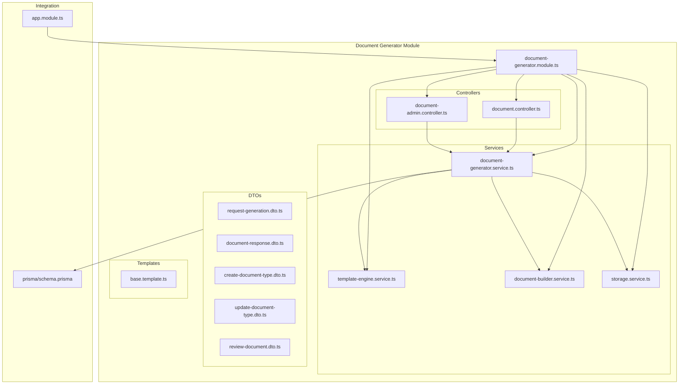
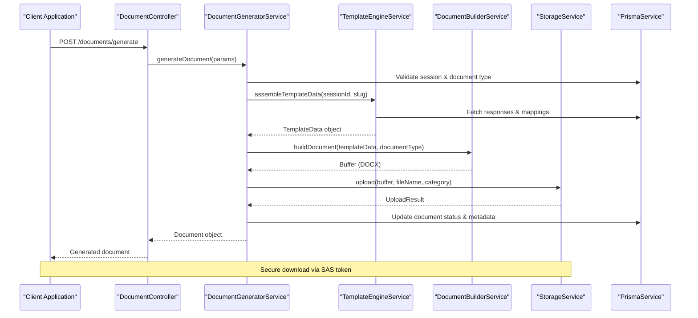
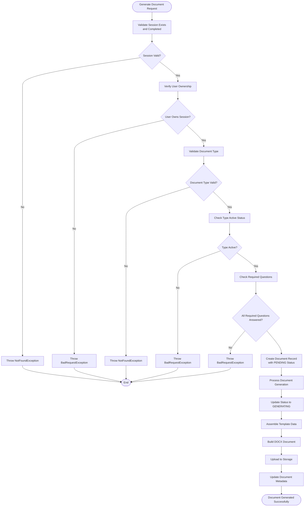
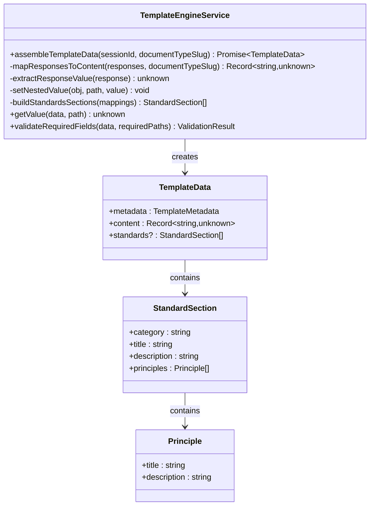
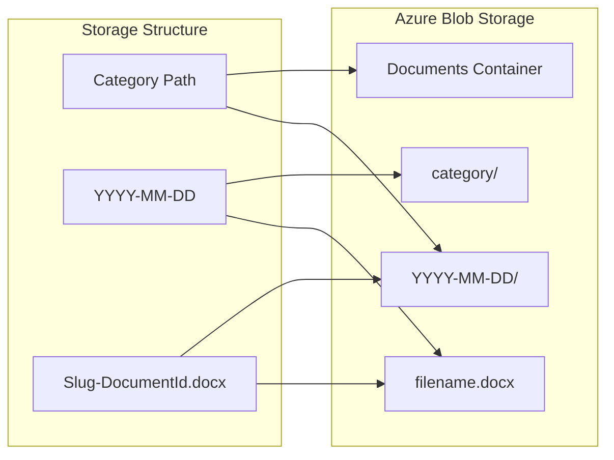
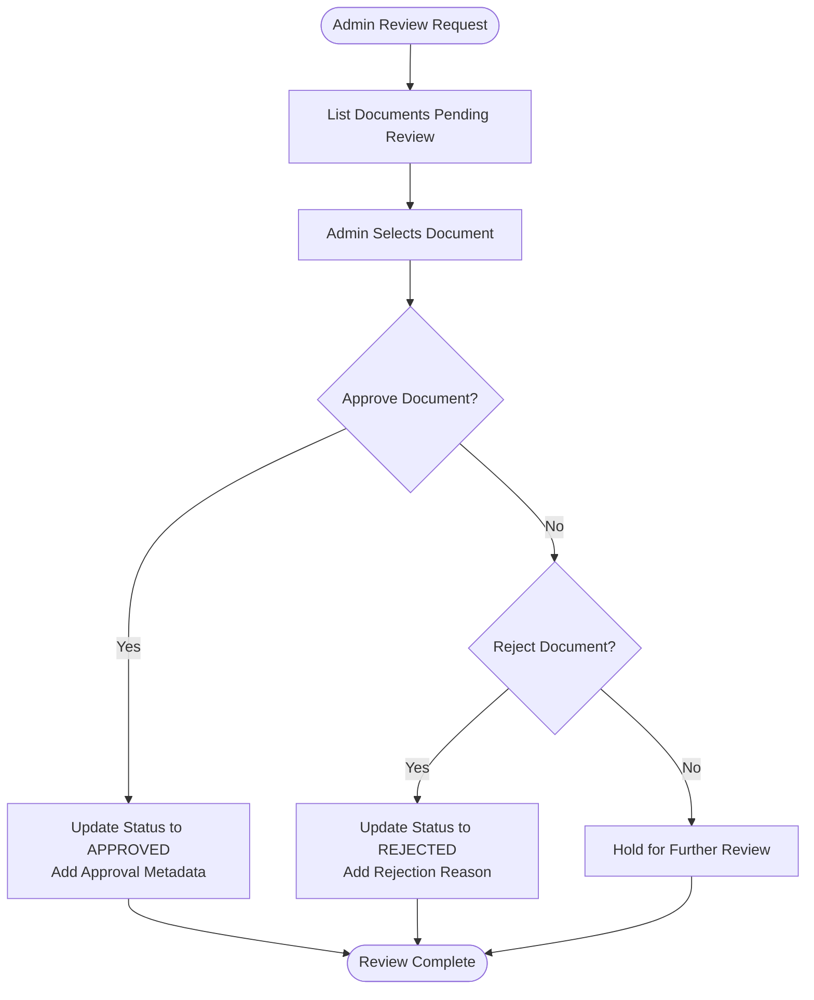
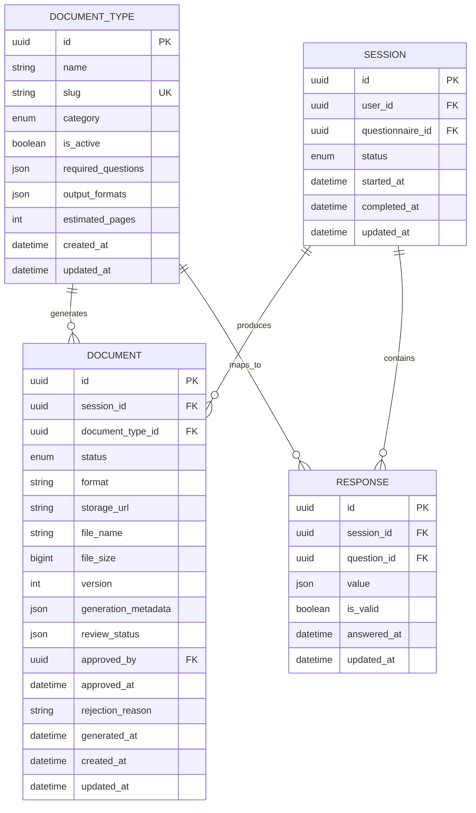
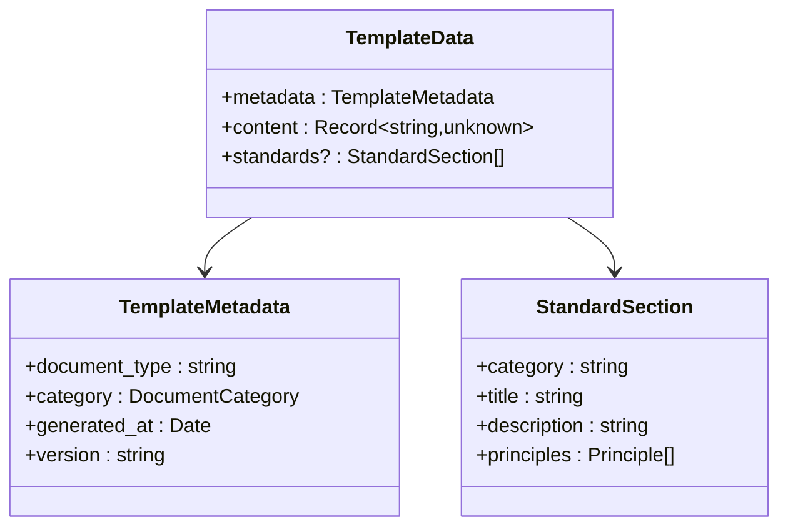

# Document Generator Module

<cite>
**Referenced Files in This Document**
- [document-generator.module.ts](file://apps/api/src/modules/document-generator/document-generator.module.ts)
- [document-generator.service.ts](file://apps/api/src/modules/document-generator/services/document-generator.service.ts)
- [template-engine.service.ts](file://apps/api/src/modules/document-generator/services/template-engine.service.ts)
- [document-builder.service.ts](file://apps/api/src/modules/document-generator/services/document-builder.service.ts)
- [storage.service.ts](file://apps/api/src/modules/document-generator/services/storage.service.ts)
- [document.controller.ts](file://apps/api/src/modules/document-generator/controllers/document.controller.ts)
- [document-admin.controller.ts](file://apps/api/src/modules/document-generator/controllers/document-admin.controller.ts)
- [request-generation.dto.ts](file://apps/api/src/modules/document-generator/dto/request-generation.dto.ts)
- [document-response.dto.ts](file://apps/api/src/modules/document-generator/dto/document-response.dto.ts)
- [create-document-type.dto.ts](file://apps/api/src/modules/document-generator/dto/create-document-type.dto.ts)
- [update-document-type.dto.ts](file://apps/api/src/modules/document-generator/dto/update-document-type.dto.ts)
- [review-document.dto.ts](file://apps/api/src/modules/document-generator/dto/review-document.dto.ts)
- [base.template.ts](file://apps/api/src/modules/document-generator/templates/base.template.ts)
- [schema.prisma](file://prisma/schema.prisma)
- [app.module.ts](file://apps/api/src/app.module.ts)
- [main.ts](file://apps/api/src/main.ts)
- [configuration.ts](file://apps/api/src/config/configuration.ts)
</cite>

## Update Summary
**Changes Made**
- Enhanced template engine with comprehensive question type support and standards mapping
- Expanded document builder with multi-category content generation (CTO, CFO, BA)
- Improved storage service with Azure Blob Storage integration and SAS token generation
- Added administrative document review workflow with approval/rejection capabilities
- Implemented comprehensive DTO validation and response formatting
- Enhanced error handling and validation throughout the document generation pipeline

## Table of Contents
1. [Introduction](#introduction)
2. [Project Structure](#project-structure)
3. [Core Components](#core-components)
4. [Architecture Overview](#architecture-overview)
5. [Detailed Component Analysis](#detailed-component-analysis)
6. [Data Model](#data-model)
7. [API Endpoints](#api-endpoints)
8. [Security and Access Control](#security-and-access-control)
9. [Storage and File Management](#storage-and-file-management)
10. [Template System](#template-system)
11. [Performance Considerations](#performance-considerations)
12. [Troubleshooting Guide](#troubleshooting-guide)
13. [Conclusion](#conclusion)

## Introduction

The Document Generator Module is a comprehensive system designed to automatically generate professional documents from questionnaire responses. Built as part of the Adaptive Questionnaire System, this module transforms structured survey data into formatted Word documents, supporting multiple document categories including Business Analysis (BA), Chief Technology Officer (CTO), and Chief Financial Officer (CFO) documentation types.

The module provides a complete document lifecycle management system, from data collection through document generation, storage, and delivery. It integrates seamlessly with the existing questionnaire system, ensuring that generated documents reflect the most current and validated responses from user sessions.

**Updated** Enhanced with comprehensive template processing, Azure storage integration, and multi-category document support with administrative review workflows.

## Project Structure

The Document Generator Module follows NestJS modular architecture patterns and is organized into several key directories:

**Diagram sources**
- [document-generator.module.ts](file://apps/api/src/modules/document-generator/document-generator.module.ts#L1-L23)
- [document.controller.ts](file://apps/api/src/modules/document-generator/controllers/document.controller.ts#L1-L163)
- [document-admin.controller.ts](file://apps/api/src/modules/document-generator/controllers/document-admin.controller.ts#L1-L230)

**Section sources**
- [document-generator.module.ts](file://apps/api/src/modules/document-generator/document-generator.module.ts#L1-L23)
- [app.module.ts](file://apps/api/src/app.module.ts#L14-L60)

## Core Components

The Document Generator Module consists of four primary service components that work together to provide comprehensive document generation capabilities:

### DocumentGeneratorService
The central orchestrator that manages the entire document generation workflow, handling validation, coordination between services, and database operations.

### TemplateEngineService
Responsible for extracting and transforming questionnaire responses into structured template data, handling different question types and mapping responses to document sections.

### DocumentBuilderService
Converts template data into professionally formatted DOCX documents using the docx library, supporting multiple document categories with specialized layouts.

### StorageService
Manages document storage and retrieval using Azure Blob Storage, providing secure file uploads, downloads via SAS tokens, and proper file organization.

**Updated** Enhanced with comprehensive administrative workflows for document review and approval processes.

**Section sources**
- [document-generator.service.ts](file://apps/api/src/modules/document-generator/services/document-generator.service.ts#L28-L360)
- [template-engine.service.ts](file://apps/api/src/modules/document-generator/services/template-engine.service.ts#L26-L290)
- [document-builder.service.ts](file://apps/api/src/modules/document-generator/services/document-builder.service.ts#L28-L487)
- [storage.service.ts](file://apps/api/src/modules/document-generator/services/storage.service.ts#L18-L160)

## Architecture Overview

The Document Generator Module implements a layered architecture with clear separation of concerns:

**Diagram sources**
- [document.controller.ts](file://apps/api/src/modules/document-generator/controllers/document.controller.ts#L38-L54)
- [document-generator.service.ts](file://apps/api/src/modules/document-generator/services/document-generator.service.ts#L42-L139)
- [template-engine.service.ts](file://apps/api/src/modules/document-generator/services/template-engine.service.ts#L35-L99)
- [document-builder.service.ts](file://apps/api/src/modules/document-generator/services/document-builder.service.ts#L35-L72)
- [storage.service.ts](file://apps/api/src/modules/document-generator/services/storage.service.ts#L65-L95)

The architecture follows these key principles:
- **Separation of Concerns**: Each service has a specific responsibility
- **Dependency Injection**: Services are injected through the NestJS DI container
- **Asynchronous Processing**: Long-running operations are handled asynchronously
- **Error Handling**: Comprehensive error handling with meaningful error messages
- **Security**: JWT authentication and authorization for all endpoints

**Updated** Enhanced with administrative review workflows and comprehensive validation layers.

## Detailed Component Analysis

### Document Generation Workflow

The document generation process follows a structured workflow with multiple validation steps and error handling mechanisms:

**Diagram sources**
- [document-generator.service.ts](file://apps/api/src/modules/document-generator/services/document-generator.service.ts#L42-L194)

**Updated** Enhanced with comprehensive validation and error handling throughout the generation pipeline.

### Template Engine Processing

The TemplateEngineService handles complex data transformation from raw questionnaire responses to structured template data:

**Diagram sources**
- [template-engine.service.ts](file://apps/api/src/modules/document-generator/services/template-engine.service.ts#L26-L290)

**Updated** Enhanced with comprehensive question type support including MATRIX, FILE_UPLOAD, and improved standards mapping for CTO documents.

**Section sources**
- [template-engine.service.ts](file://apps/api/src/modules/document-generator/services/template-engine.service.ts#L35-L288)

### Document Builder Categories

The DocumentBuilderService supports three distinct document categories with specialized layouts:

| Category | Purpose | Key Sections |
|----------|---------|--------------|
| **CTO** | Technical Architecture Documents | Executive Summary, Technical Overview, Infrastructure, Security, Engineering Standards |
| **CFO** | Business Planning Documents | Executive Summary, Company Description, Market Analysis, Financial Projections, Risk Management |
| **BA** | Business Analysis Documents | Introduction, Business Requirements, Functional Requirements, User Stories, Process Flows |

Each category follows a standardized structure while accommodating the specific content requirements of different stakeholders.

**Updated** Enhanced with comprehensive content section building and standards section generation for technical documents.

**Section sources**
- [document-builder.service.ts](file://apps/api/src/modules/document-generator/services/document-builder.service.ts#L77-L277)

### Storage Management

The StorageService provides robust file management capabilities with Azure Blob Storage integration:

**Diagram sources**
- [storage.service.ts](file://apps/api/src/modules/document-generator/services/storage.service.ts#L75-L77)

**Updated** Enhanced with comprehensive Azure Blob Storage integration, SAS token generation, and secure file access controls.

**Section sources**
- [storage.service.ts](file://apps/api/src/modules/document-generator/services/storage.service.ts#L65-L136)

### Administrative Review Workflow

The administrative workflow provides comprehensive document review and approval capabilities:

**Diagram sources**
- [document-admin.controller.ts](file://apps/api/src/modules/document-generator/controllers/document-admin.controller.ts#L150-L228)

**Updated** Added comprehensive administrative document review workflow with approval/rejection capabilities and audit trails.

## Data Model

The Document Generator Module integrates with a comprehensive data model that supports document lifecycle management and relationship tracking:

**Diagram sources**
- [schema.prisma](file://prisma/schema.prisma#L328-L381)

**Updated** Enhanced with comprehensive document status tracking, review metadata, and approval workflows.

**Section sources**
- [schema.prisma](file://prisma/schema.prisma#L328-L381)

## API Endpoints

The Document Generator Module exposes a comprehensive REST API with both user-facing and administrative endpoints:

### User API Endpoints

| Endpoint | Method | Description | Authentication |
|----------|--------|-------------|----------------|
| `/documents/generate` | POST | Request document generation for a session | JWT Required |
| `/documents/types` | GET | List available document types | JWT Required |
| `/documents/session/{sessionId}` | GET | List all documents for a session | JWT Required |
| `/documents/{id}` | GET | Get document details | JWT Required |
| `/documents/{id}/download` | GET | Get secure download URL | JWT Required |

### Administrative API Endpoints

| Endpoint | Method | Description | Authentication |
|----------|--------|-------------|----------------|
| `/admin/document-types` | GET | List all document types | Admin/Super Admin |
| `/admin/document-types/{id}` | GET | Get document type details | Admin/Super Admin |
| `/admin/document-types` | POST | Create document type | Admin/Super Admin |
| `/admin/document-types/{id}` | PATCH | Update document type | Admin/Super Admin |
| `/admin/documents/pending-review` | GET | List documents pending review | Admin/Super Admin |
| `/admin/documents/{id}/approve` | PATCH | Approve a document | Admin/Super Admin |
| `/admin/documents/{id}/reject` | PATCH | Reject a document | Admin/Super Admin |

**Updated** Enhanced with comprehensive administrative endpoints for document type management and review workflows.

**Section sources**
- [document.controller.ts](file://apps/api/src/modules/document-generator/controllers/document.controller.ts#L38-L113)
- [document-admin.controller.ts](file://apps/api/src/modules/document-generator/controllers/document-admin.controller.ts#L49-L228)

## Security and Access Control

The Document Generator Module implements comprehensive security measures:

### Authentication
- **JWT Authentication**: All endpoints require valid JWT tokens
- **Role-Based Access Control**: Administrative endpoints restricted to ADMIN and SUPER_ADMIN roles
- **Session Validation**: Automatic verification that users own the session they're requesting documents for

### Authorization
- **Document Access**: Users can only access documents from their own sessions
- **Admin Privileges**: Special handling for document approval/rejection workflows
- **Input Validation**: Comprehensive DTO validation with class-validator

### Data Protection
- **Secure Downloads**: SAS tokens for temporary file access
- **Audit Logging**: Complete audit trail for document generation activities
- **Error Handling**: Generic error messages to prevent information leakage

**Updated** Enhanced with comprehensive administrative access controls and document review security measures.

**Section sources**
- [document.controller.ts](file://apps/api/src/modules/document-generator/controllers/document.controller.ts#L31-L36)
- [document-admin.controller.ts](file://apps/api/src/modules/document-generator/controllers/document-admin.controller.ts#L36-L43)

## Storage and File Management

The module provides robust file management capabilities through Azure Blob Storage integration:

### Storage Configuration
- **Connection Management**: Automatic connection string parsing with fallback support
- **Container Organization**: Hierarchical folder structure (category/YYYY-MM-DD/)
- **File Naming**: Consistent naming convention using document type slug and document ID

### Security Features
- **SAS Token Generation**: Temporary access tokens with configurable expiration
- **Access Control**: Role-based file access restrictions
- **Cleanup Operations**: Support for file deletion and maintenance

### Performance Considerations
- **Async Operations**: Non-blocking file uploads and downloads
- **Content Type Management**: Proper MIME type handling for DOCX files
- **Error Recovery**: Comprehensive error handling for storage operations

**Updated** Enhanced with comprehensive Azure Blob Storage integration, SAS token generation, and secure file access controls.

**Section sources**
- [storage.service.ts](file://apps/api/src/modules/document-generator/services/storage.service.ts#L26-L160)

## Template System

The template system provides flexible content mapping from questionnaire responses to document structure:

### Template Data Structure
The TemplateEngineService transforms raw responses into structured TemplateData objects:

**Diagram sources**
- [template-engine.service.ts](file://apps/api/src/modules/document-generator/services/template-engine.service.ts#L5-L24)

### Content Mapping
Different question types are mapped to appropriate content structures:

| Question Type | Content Mapping | Example Output |
|---------------|----------------|----------------|
| TEXT/TEXTAREA | String value | "Project description text" |
| NUMBER | Numeric value | 42 |
| DATE | ISO date string | "2024-01-15" |
| SINGLE_CHOICE | Selected option label | "High Priority" |
| MULTIPLE_CHOICE | Array of selected labels | ["Option A", "Option B"] |
| SCALE | Rating value | 5 |
| MATRIX | Object with matrix data | {"question1": "response"} |
| FILE_UPLOAD | File URL | "https://storage.blob.core.windows.net/documents/..." |
| EMAIL/URL | String value | "user@example.com" |

**Updated** Enhanced with comprehensive question type support including MATRIX, FILE_UPLOAD, and improved content mapping logic.

**Section sources**
- [template-engine.service.ts](file://apps/api/src/modules/document-generator/services/template-engine.service.ts#L141-L200)

### Document Type Management

Administrative endpoints provide comprehensive document type management:

| Endpoint | Method | Description |
|----------|--------|-------------|
| `/admin/document-types` | GET | List all document types with pagination |
| `/admin/document-types/{id}` | GET | Get document type details with mappings |
| `/admin/document-types` | POST | Create new document type |
| `/admin/document-types/{id}` | PATCH | Update existing document type |

**Updated** Added comprehensive administrative document type management with validation and mapping support.

**Section sources**
- [document-admin.controller.ts](file://apps/api/src/modules/document-generator/controllers/document-admin.controller.ts#L49-L144)

## Performance Considerations

The Document Generator Module is designed with several performance optimization strategies:

### Asynchronous Processing
- **Non-blocking Operations**: Document generation runs asynchronously to prevent request timeouts
- **Background Processing**: Long-running tasks are handled outside the main request thread
- **Progress Tracking**: Real-time status updates during generation process

### Resource Management
- **Memory Optimization**: Efficient buffer management for document creation
- **Database Connections**: Optimized Prisma queries with selective field loading
- **Storage Efficiency**: Compressed file storage and efficient upload operations

### Scalability Features
- **Horizontal Scaling**: Stateless service design supports multiple instances
- **Load Distribution**: Database and storage operations optimized for concurrent access
- **Caching Strategy**: Redis integration for frequently accessed data

**Updated** Enhanced with comprehensive performance optimizations and scalable architecture patterns.

## Troubleshooting Guide

### Common Issues and Solutions

#### Document Generation Failures
**Symptoms**: Generation requests fail with validation errors
**Causes**: 
- Session not completed
- Missing required questions
- Invalid document type
- User ownership verification failed

**Solutions**:
- Verify session status is COMPLETED
- Check required questions are answered
- Confirm document type is active and valid
- Ensure user owns the session

#### Storage Access Issues
**Symptoms**: Download URLs fail or files not found
**Causes**:
- Azure Storage connection not configured
- Invalid SAS token parameters
- File deletion or corruption

**Solutions**:
- Verify AZURE_STORAGE_CONNECTION_STRING environment variable
- Check SAS token expiration settings
- Validate file exists in storage container

#### Template Processing Errors
**Symptoms**: Template data extraction failures
**Causes**:
- Missing document mappings in questions
- Invalid question types
- Data format inconsistencies

**Solutions**:
- Verify document mappings exist for all questions
- Check question type compatibility
- Validate response data structure

#### Administrative Workflow Issues
**Symptoms**: Document review and approval failures
**Causes**:
- Insufficient admin privileges
- Document not in correct status
- Invalid approval/rejection data

**Solutions**:
- Verify user has ADMIN or SUPER_ADMIN role
- Check document status is PENDING_REVIEW
- Validate rejection reason length and format

**Updated** Enhanced with comprehensive troubleshooting guidance for administrative workflows and document review processes.

**Section sources**
- [document-generator.service.ts](file://apps/api/src/modules/document-generator/services/document-generator.service.ts#L54-L132)
- [storage.service.ts](file://apps/api/src/modules/document-generator/services/storage.service.ts#L104-L136)

## Conclusion

The Document Generator Module represents a sophisticated solution for automated document generation within the Adaptive Questionnaire System. Its modular architecture, comprehensive error handling, and robust security measures make it suitable for production environments requiring reliable document automation.

Key strengths of the implementation include:

- **Comprehensive Integration**: Seamless integration with the existing questionnaire system
- **Flexible Architecture**: Support for multiple document categories with extensible templates
- **Robust Security**: Multi-layered authentication and authorization controls
- **Production Ready**: Azure Blob Storage integration with proper error handling
- **Developer Friendly**: Clear separation of concerns with well-documented APIs
- **Administrative Capabilities**: Complete document review and approval workflows
- **Comprehensive Validation**: Multi-layered input validation and error handling

The module provides a solid foundation for document automation workflows while maintaining flexibility for future enhancements and customizations. Its design supports both current requirements and potential expansion into additional document types and generation scenarios.

**Updated** Enhanced with comprehensive administrative workflows, Azure Blob Storage integration, and multi-category document support, making it a complete solution for enterprise document generation needs.