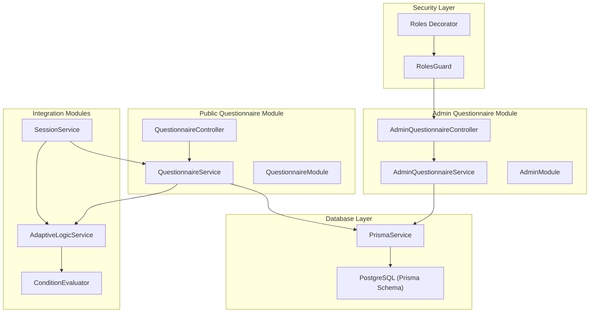
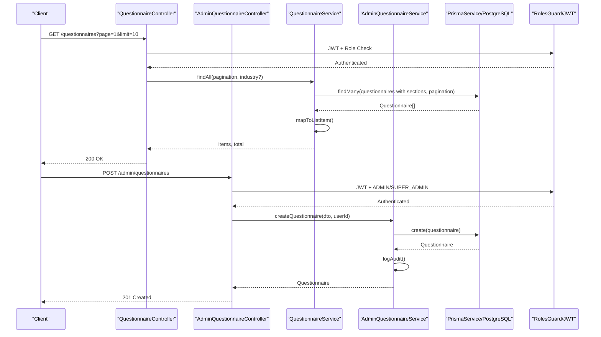
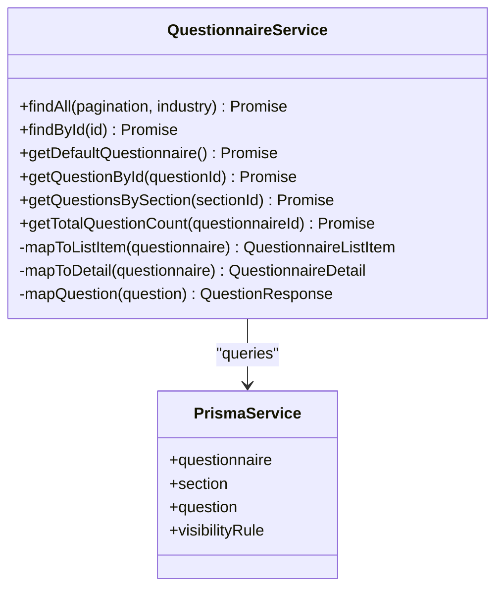
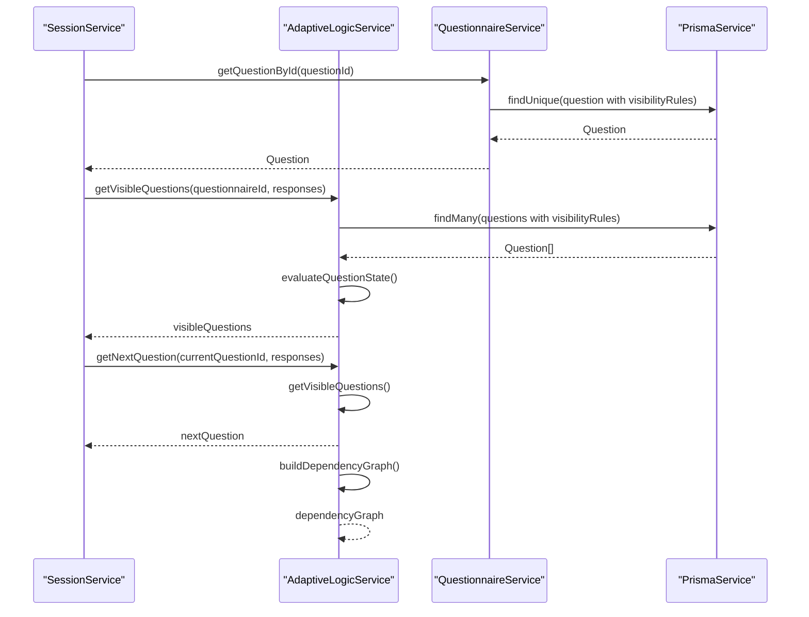
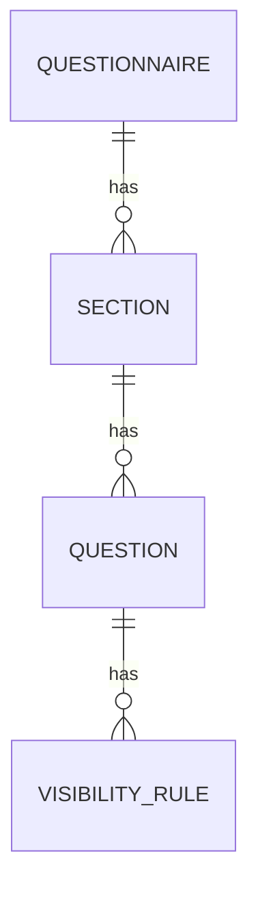
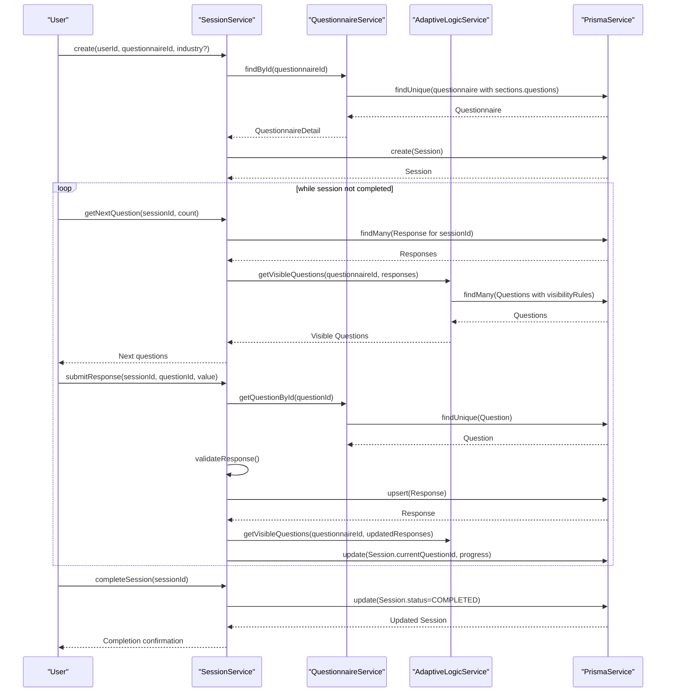
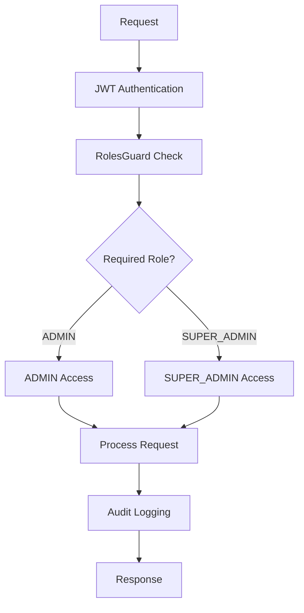
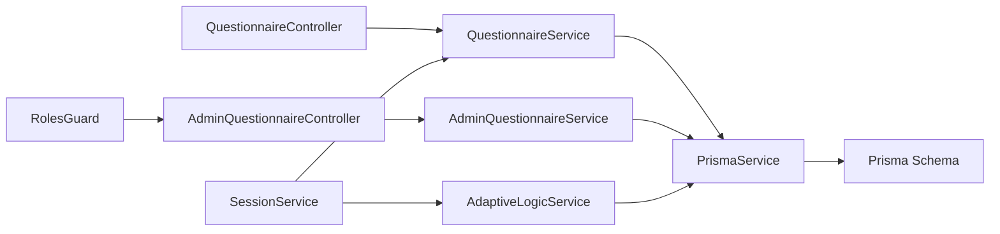

# Questionnaire Module

<cite>
**Referenced Files in This Document**
- [questionnaire.service.ts](file://apps/api/src/modules/questionnaire/questionnaire.service.ts)
- [admin-questionnaire.service.ts](file://apps/api/src/modules/admin/services/admin-questionnaire.service.ts)
- [adaptive-logic.service.ts](file://apps/api/src/modules/adaptive-logic/adaptive-logic.service.ts)
- [condition.evaluator.ts](file://apps/api/src/modules/adaptive-logic/evaluators/condition.evaluator.ts)
- [rule.types.ts](file://apps/api/src/modules/adaptive-logic/types/rule.types.ts)
- [session.service.ts](file://apps/api/src/modules/session/session.service.ts)
- [schema.prisma](file://prisma/schema.prisma)
- [create-questionnaire.dto.ts](file://apps/api/src/modules/admin/dto/create-questionnaire.dto.ts)
- [create-question.dto.ts](file://apps/api/src/modules/admin/dto/create-question.dto.ts)
- [adaptive-logic.md](file://docs/questionnaire/adaptive-logic.md)
- [industry-templates.md](file://docs/questionnaire/industry-templates.md)
- [question-bank.md](file://docs/questionnaire/question-bank.md)
</cite>

## Update Summary
**Changes Made**
- Enhanced questionnaire system with comprehensive CRUD operations for questionnaires, sections, and questions
- Added pagination support for efficient data retrieval
- Integrated adaptive logic engine for dynamic question rendering
- Implemented industry templates and question bank functionality
- Added comprehensive administrative operations with role-based access control
- Enhanced data modeling with improved relationships and constraints

## Table of Contents
1. [Introduction](#introduction)
2. [Project Structure](#project-structure)
3. [Core Components](#core-components)
4. [Architecture Overview](#architecture-overview)
5. [Detailed Component Analysis](#detailed-component-analysis)
6. [Administrative Operations](#administrative-operations)
7. [Security and Access Control](#security-and-access-control)
8. [Dependency Analysis](#dependency-analysis)
9. [Performance Considerations](#performance-considerations)
10. [Troubleshooting Guide](#troubleshooting-guide)
11. [Conclusion](#conclusion)
12. [Appendices](#appendices)

## Introduction
This document provides comprehensive documentation for the Questionnaire Module, which manages the lifecycle of questionnaires, sections, and questions, and integrates with the Adaptive Logic Engine to deliver dynamic, context-aware experiences. The module now includes extensive administrative capabilities through the AdminModule integration, providing comprehensive CRUD operations for questionnaire management beyond basic listing and retrieval functionality.

The Questionnaire Module represents a sophisticated system with the following key capabilities:
- Full administrative CRUD operations for questionnaires, sections, questions, and visibility rules
- Role-based access control with ADMIN and SUPER_ADMIN permissions
- Comprehensive audit trail for all administrative actions
- Enhanced security with JWT authentication and role validation
- Support for simplified questionnaire structures with industry templates and question banks
- Integration with adaptive logic for dynamic question rendering based on user responses
- Pagination support for efficient data retrieval in large-scale deployments

**Updated** The Adaptive Logic Engine has been enhanced to support comprehensive rule evaluation including visibility rules, requirement rules, and dependency management for dynamic questionnaire flows.

## Project Structure
The Questionnaire Module is implemented as a NestJS module with both public and administrative interfaces. The administrative layer provides comprehensive CRUD operations while the public interface maintains read-only access for end-users.

**Diagram sources**
- [questionnaire.service.ts](file://apps/api/src/modules/questionnaire/questionnaire.service.ts#L63-L253)
- [admin-questionnaire.service.ts](file://apps/api/src/modules/admin/services/admin-questionnaire.service.ts#L45-L608)
- [adaptive-logic.service.ts](file://apps/api/src/modules/adaptive-logic/adaptive-logic.service.ts#L19-L264)
- [condition.evaluator.ts](file://apps/api/src/modules/adaptive-logic/evaluators/condition.evaluator.ts#L402-L803)
- [session.service.ts](file://apps/api/src/modules/session/session.service.ts#L87-L684)

**Section sources**
- [questionnaire.service.ts](file://apps/api/src/modules/questionnaire/questionnaire.service.ts#L63-L253)
- [admin-questionnaire.service.ts](file://apps/api/src/modules/admin/services/admin-questionnaire.service.ts#L45-L608)
- [adaptive-logic.service.ts](file://apps/api/src/modules/adaptive-logic/adaptive-logic.service.ts#L19-L264)
- [session.service.ts](file://apps/api/src/modules/session/session.service.ts#L87-L684)

## Core Components
- **QuestionnaireService**: Exposes REST endpoints for listing and retrieving questionnaires with JWT authentication and pagination support.
- **AdminQuestionnaireService**: Implements full CRUD operations for questionnaires, sections, questions, and visibility rules with audit logging.
- **AdaptiveLogicService**: Enhanced evaluation of visibility and requirement rules to compute dynamic question flows with dependency management.
- **ConditionEvaluator**: Handles complex condition evaluation with support for nested conditions and logical operators.
- **SessionService**: Orchestrates user sessions, integrates with QuestionnaireService and AdaptiveLogicService for adaptive flows.
- **PrismaService**: Database client abstraction with logging and slow query detection.
- **Prisma Schema**: Defines Questionnaire, Section, Question, VisibilityRule, and related models and enums.
- **RolesGuard**: Enforces role-based access control for administrative endpoints.
- **Swagger Documentation**: Comprehensive API documentation for all endpoints.

Key responsibilities:
- Retrieve questionnaires with sections and questions for end-users using pagination
- Provide comprehensive CRUD operations for administrative management with validation
- Enforce role-based access control with ADMIN and SUPER_ADMIN permissions
- Maintain audit trails for all administrative actions
- Map raw database records to DTOs suitable for clients
- Evaluate adaptive logic rules during sessions with dependency tracking
- Compute progress and adaptive state with performance optimization

**Section sources**
- [questionnaire.service.ts](file://apps/api/src/modules/questionnaire/questionnaire.service.ts#L67-L182)
- [admin-questionnaire.service.ts](file://apps/api/src/modules/admin/services/admin-questionnaire.service.ts#L55-L606)
- [adaptive-logic.service.ts](file://apps/api/src/modules/adaptive-logic/adaptive-logic.service.ts#L29-L153)
- [condition.evaluator.ts](file://apps/api/src/modules/adaptive-logic/evaluators/condition.evaluator.ts#L9-L40)
- [session.service.ts](file://apps/api/src/modules/session/session.service.ts#L96-L136)

## Architecture Overview
The module follows a layered architecture with separate public and administrative interfaces:
- **Presentation Layer**: Controllers handle HTTP requests and delegate to appropriate services.
- **Application Layer**: Services orchestrate data retrieval, mapping, and rule evaluation.
- **Persistence Layer**: Prisma client interacts with PostgreSQL.
- **Security Layer**: JWT authentication with role-based access control.
- **Integration Layer**: Adaptive Logic and Session modules consume Questionnaire data.

**Diagram sources**
- [questionnaire.service.ts](file://apps/api/src/modules/questionnaire/questionnaire.service.ts#L67-L123)
- [admin-questionnaire.service.ts](file://apps/api/src/modules/admin/services/admin-questionnaire.service.ts#L105-L130)
- [adaptive-logic.service.ts](file://apps/api/src/modules/adaptive-logic/adaptive-logic.service.ts#L29-L64)

**Section sources**
- [questionnaire.service.ts](file://apps/api/src/modules/questionnaire/questionnaire.service.ts#L67-L123)
- [admin-questionnaire.service.ts](file://apps/api/src/modules/admin/services/admin-questionnaire.service.ts#L105-L130)
- [adaptive-logic.service.ts](file://apps/api/src/modules/adaptive-logic/adaptive-logic.service.ts#L29-L64)

## Detailed Component Analysis

### Questionnaire Service
Responsibilities:
- List questionnaires with section counts and pagination for end-users
- Retrieve detailed questionnaire with sections and questions
- Map database records to DTOs for clients
- Provide helpers for question counts and visibility rule inclusion

Implementation highlights:
- Uses Prisma's include relations to fetch sections and questions with ordering and counts
- Maps to lightweight DTOs for transport
- Includes visibility rules for questions to support adaptive logic
- Filters for active questionnaires only
- Supports pagination with skip/take for efficient data retrieval

**Diagram sources**
- [questionnaire.service.ts](file://apps/api/src/modules/questionnaire/questionnaire.service.ts#L63-L253)
- [schema.prisma](file://prisma/schema.prisma#L173-L264)

**Section sources**
- [questionnaire.service.ts](file://apps/api/src/modules/questionnaire/questionnaire.service.ts#L67-L182)
- [questionnaire.service.ts](file://apps/api/src/modules/questionnaire/questionnaire.service.ts#L184-L251)

### Adaptive Logic Integration
The Adaptive Logic Service has been enhanced to support comprehensive rule evaluation:

Key capabilities:
- Evaluate visibility rules per question (SHOW/HIDE)
- Resolve requirement rules (REQUIRE/UNREQUIRE)
- Compute next question in sequence
- Support for complex nested conditions with logical operators
- Dependency graph construction for rule relationships
- Performance optimization with caching and batch evaluation
- Support for branching rules and flow control

**Diagram sources**
- [session.service.ts](file://apps/api/src/modules/session/session.service.ts#L217-L242)
- [adaptive-logic.service.ts](file://apps/api/src/modules/adaptive-logic/adaptive-logic.service.ts#L29-L64)
- [adaptive-logic.service.ts](file://apps/api/src/modules/adaptive-logic/adaptive-logic.service.ts#L221-L252)

**Section sources**
- [adaptive-logic.service.ts](file://apps/api/src/modules/adaptive-logic/adaptive-logic.service.ts#L69-L153)
- [adaptive-logic.service.ts](file://apps/api/src/modules/adaptive-logic/adaptive-logic.service.ts#L221-L252)
- [condition.evaluator.ts](file://apps/api/src/modules/adaptive-logic/evaluators/condition.evaluator.ts#L9-L40)

### Question Types, Validation, and Relationships
Supported question types (from schema):
- Text, Textarea, Number, Email, URL, Date
- Single Choice, Multiple Choice, Scale, File Upload, Matrix

Validation rules:
- JSON-based validation rules per question (e.g., min/max length, numeric bounds)
- Required flag per question
- Options with labels and optional metadata

Relationships:
- Questionnaire contains Sections
- Section contains Questions
- Questions may define VisibilityRules that reference other questions

**Diagram sources**
- [schema.prisma](file://prisma/schema.prisma#L173-L264)

**Section sources**
- [schema.prisma](file://prisma/schema.prisma#L24-L36)
- [schema.prisma](file://prisma/schema.prisma#L218-L247)
- [schema.prisma](file://prisma/schema.prisma#L249-L264)

### Industry Templates and Question Bank
Industry templates:
- Define industry-specific questions, compliance requirements, terminology mappings, output customizations, and risk factors
- Enable tailored questionnaire experiences by industry
- Support inheritance through parentTemplate references

Question bank:
- Reusable questions organized by domain/subdomain
- Supports consistent question definitions across questionnaires
- Provides output mappings and visibility rules
- Organized by domain structure (Business Foundation, Product/Service, Target Market, etc.)

Integration:
- Templates can influence questionnaire composition and validation
- Question bank supports standardized question reuse
- Industry-specific compliance requirements are automatically applied

**Section sources**
- [industry-templates.md](file://docs/questionnaire/industry-templates.md#L22-L800)
- [question-bank.md](file://docs/questionnaire/question-bank.md#L10-L800)

### Questionnaire Creation Workflows
End-to-end flow:
- Create a session for a user and a specific questionnaire
- Retrieve next questions considering adaptive logic
- Submit responses and validate according to question rules
- Advance to next question and update progress
- Complete session when all required questions are answered

**Diagram sources**
- [session.service.ts](file://apps/api/src/modules/session/session.service.ts#L96-L136)
- [session.service.ts](file://apps/api/src/modules/session/session.service.ts#L198-L268)
- [session.service.ts](file://apps/api/src/modules/session/session.service.ts#L270-L359)

**Section sources**
- [session.service.ts](file://apps/api/src/modules/session/session.service.ts#L96-L136)
- [session.service.ts](file://apps/api/src/modules/session/session.service.ts#L198-L268)
- [session.service.ts](file://apps/api/src/modules/session/session.service.ts#L270-L359)
- [session.service.ts](file://apps/api/src/modules/session/session.service.ts#L361-L386)

## Administrative Operations

### AdminQuestionnaireController Endpoints
The AdminQuestionnaireController provides comprehensive CRUD operations with role-based access control:

#### Questionnaire Management
- **GET /admin/questionnaires** - List all questionnaires with pagination (ADMIN, SUPER_ADMIN)
- **GET /admin/questionnaires/:id** - Get questionnaire with full details (ADMIN, SUPER_ADMIN)
- **POST /admin/questionnaires** - Create new questionnaire (ADMIN, SUPER_ADMIN)
- **PATCH /admin/questionnaires/:id** - Update questionnaire metadata (ADMIN, SUPER_ADMIN)
- **DELETE /admin/questionnaires/:id** - Soft-delete questionnaire (SUPER_ADMIN only)

#### Section Management
- **POST /admin/questionnaires/:questionnaireId/sections** - Add section to questionnaire (ADMIN, SUPER_ADMIN)
- **PATCH /admin/sections/:id** - Update section (ADMIN, SUPER_ADMIN)
- **DELETE /admin/sections/:id** - Delete section (SUPER_ADMIN only)
- **PATCH /admin/questionnaires/:questionnaireId/sections/reorder** - Reorder sections (ADMIN, SUPER_ADMIN)

#### Question Management
- **POST /admin/sections/:sectionId/questions** - Add question to section (ADMIN, SUPER_ADMIN)
- **PATCH /admin/questions/:id** - Update question (ADMIN, SUPER_ADMIN)
- **DELETE /admin/questions/:id** - Delete question (SUPER_ADMIN only)
- **PATCH /admin/sections/:sectionId/questions/reorder** - Reorder questions (ADMIN, SUPER_ADMIN)

#### Visibility Rule Management
- **GET /admin/questions/:questionId/rules** - List visibility rules (ADMIN, SUPER_ADMIN)
- **POST /admin/questions/:questionId/rules** - Add visibility rule (ADMIN, SUPER_ADMIN)
- **PATCH /admin/rules/:id** - Update visibility rule (ADMIN, SUPER_ADMIN)
- **DELETE /admin/rules/:id** - Delete visibility rule (ADMIN, SUPER_ADMIN)

**Section sources**
- [admin-questionnaire.service.ts](file://apps/api/src/modules/admin/services/admin-questionnaire.service.ts#L55-L606)

### AdminQuestionnaireService Implementation
The AdminQuestionnaireService implements full CRUD operations with comprehensive validation and audit logging:

#### Questionnaire Operations
- **findAllQuestionnaires()**: Paginated retrieval with section and session counts
- **findQuestionnaireById()**: Full detail retrieval with nested sections and questions
- **createQuestionnaire()**: Creates new questionnaire with audit logging
- **updateQuestionnaire()**: Updates questionnaire metadata with audit trail
- **deleteQuestionnaire()**: Soft deletes by setting isActive=false with audit logging

#### Section Operations
- **createSection()**: Creates section with auto-calculated orderIndex
- **updateSection()**: Updates section properties with audit logging
- **deleteSection()**: Validates empty section before deletion
- **reorderSections()**: Batch updates section order with transaction

#### Question Operations
- **createQuestion()**: Creates question with auto-calculated orderIndex
- **updateQuestion()**: Updates question properties with audit logging
- **deleteQuestion()**: Validates no existing responses before deletion
- **reorderQuestions()**: Batch updates question order with transaction

#### Visibility Rule Operations
- **findRulesByQuestion()**: Retrieves rules ordered by priority
- **createVisibilityRule()**: Creates visibility rule with validation
- **updateVisibilityRule()**: Updates rule with audit logging
- **deleteVisibilityRule()**: Deletes visibility rule with audit logging

**Section sources**
- [admin-questionnaire.service.ts](file://apps/api/src/modules/admin/services/admin-questionnaire.service.ts#L55-L606)

### Data Transfer Objects (DTOs)
Comprehensive validation is enforced through DTOs:

#### Questionnaire DTOs
- **CreateQuestionnaireDto**: Name, description, industry, isDefault, estimatedTime, metadata
- **UpdateQuestionnaireDto**: Extends create with isActive flag

#### Section DTOs
- **CreateSectionDto**: Name, description, icon, estimatedTime, orderIndex, metadata
- **UpdateSectionDto**: Extends create with partial updates

#### Question DTOs
- **CreateQuestionDto**: Text, type, helpText, explanation, placeholder, isRequired, options, validationRules, defaultValue, suggestedAnswer, industryTags, documentMappings, orderIndex, metadata
- **UpdateQuestionDto**: Extends create with partial updates

#### Visibility Rule DTOs
- **CreateVisibilityRuleDto**: condition (JSON), action, targetQuestionIds, priority, isActive
- **UpdateVisibilityRuleDto**: Extends create with partial updates

**Section sources**
- [create-questionnaire.dto.ts](file://apps/api/src/modules/admin/dto/create-questionnaire.dto.ts#L12-L45)
- [create-question.dto.ts](file://apps/api/src/modules/admin/dto/create-question.dto.ts#L30-L100)

## Security and Access Control

### Role-Based Access Control
The AdminModule implements a hierarchical permission system:

#### User Roles
- **UserRole.ADMIN**: Can create, update, and list questionnaires but cannot delete
- **UserRole.SUPER_ADMIN**: Has full administrative privileges including deletion operations

#### Endpoint Permissions
- **List/Create/Update**: ADMIN and SUPER_ADMIN access
- **Delete Operations**: SUPER_ADMIN only
- **Reorder Operations**: ADMIN and SUPER_ADMIN access

#### Security Implementation
- **JWT Authentication**: All administrative endpoints require valid JWT tokens
- **RolesGuard**: Validates user roles against endpoint requirements
- **Roles Decorator**: Specifies required roles for each endpoint
- **Current User Injection**: Provides authenticated user context to services

**Diagram sources**
- [admin-questionnaire.service.ts](file://apps/api/src/modules/admin/services/admin-questionnaire.service.ts#L122-L131)
- [admin-questionnaire.service.ts](file://apps/api/src/modules/admin/services/admin-questionnaire.service.ts#L159-L168)

**Section sources**
- [admin-questionnaire.service.ts](file://apps/api/src/modules/admin/services/admin-questionnaire.service.ts#L122-L131)
- [admin-questionnaire.service.ts](file://apps/api/src/modules/admin/services/admin-questionnaire.service.ts#L159-L168)

### Audit Trail System
All administrative operations are logged with comprehensive audit information:

#### Audit Events
- CREATE_QUESTIONNAIRE, UPDATE_QUESTIONNAIRE, DELETE_QUESTIONNAIRE
- CREATE_SECTION, UPDATE_SECTION, DELETE_SECTION
- CREATE_QUESTION, UPDATE_QUESTION, DELETE_QUESTION
- CREATE_VISIBILITY_RULE, UPDATE_VISIBILITY_RULE, DELETE_VISIBILITY_RULE
- REORDER_SECTIONS, REORDER_QUESTIONS

#### Audit Information
- User ID who performed the action
- Timestamp of the operation
- Resource type and ID affected
- Changes made (before/after for updates)
- IP address and user agent (via request context)

**Section sources**
- [admin-questionnaire.service.ts](file://apps/api/src/modules/admin/services/admin-questionnaire.service.ts#L122-L131)
- [admin-questionnaire.service.ts](file://apps/api/src/modules/admin/services/admin-questionnaire.service.ts#L159-L168)
- [admin-questionnaire.service.ts](file://apps/api/src/modules/admin/services/admin-questionnaire.service.ts#L234-L243)
- [admin-questionnaire.service.ts](file://apps/api/src/modules/admin/services/admin-questionnaire.service.ts#L268-L277)

## Dependency Analysis
The module maintains clear separation between public and administrative interfaces:

- **QuestionnaireController** depends on QuestionnaireService
- **AdminQuestionnaireController** depends on AdminQuestionnaireService
- **QuestionnaireService** depends on PrismaService
- **AdminQuestionnaireService** depends on PrismaService and AdminAuditService
- **RolesGuard** depends on AuthenticatedUser and UserRole enum
- **SessionService** depends on QuestionnaireService and AdaptiveLogicService
- **AdaptiveLogicService** depends on PrismaService and Condition Evaluator types
- **Prisma schema** defines Questionnaire, Section, Question, and VisibilityRule models and enums

**Diagram sources**
- [questionnaire.service.ts](file://apps/api/src/modules/questionnaire/questionnaire.service.ts#L63-L253)
- [admin-questionnaire.service.ts](file://apps/api/src/modules/admin/services/admin-questionnaire.service.ts#L45-L608)
- [adaptive-logic.service.ts](file://apps/api/src/modules/adaptive-logic/adaptive-logic.service.ts#L19-L264)
- [session.service.ts](file://apps/api/src/modules/session/session.service.ts#L87-L684)

**Section sources**
- [questionnaire.service.ts](file://apps/api/src/modules/questionnaire/questionnaire.service.ts#L63-L253)
- [admin-questionnaire.service.ts](file://apps/api/src/modules/admin/services/admin-questionnaire.service.ts#L45-L608)
- [adaptive-logic.service.ts](file://apps/api/src/modules/adaptive-logic/adaptive-logic.service.ts#L19-L264)
- [session.service.ts](file://apps/api/src/modules/session/session.service.ts#L87-L684)

## Performance Considerations
- Database queries leverage include relations and ordering to minimize round trips
- Pagination is supported to avoid loading large datasets
- Slow query logging is enabled in development to identify performance bottlenees
- Adaptive logic computes visibility and next questions efficiently using optimized rule evaluation
- Transaction batching for reorder operations reduces database round trips
- Audit logging is asynchronous to minimize performance impact
- Consider caching frequently accessed questionnaire metadata and visibility rule sets for high-volume scenarios
- Dependency graph construction supports efficient rule evaluation and conflict resolution
- Condition evaluation uses optimized algorithms for complex nested conditions

## Troubleshooting Guide
Common issues and resolutions:
- **Questionnaire not found**: Ensure the questionnaire exists and is active; verify UUID format
- **Session access denied**: Confirm the session belongs to the requesting user
- **Validation errors on submission**: Check question validation rules and required fields
- **Adaptive logic unexpected behavior**: Verify visibility rule priorities, operators, and target question IDs
- **Admin access denied**: Verify user has required ADMIN or SUPER_ADMIN role
- **Audit logging failures**: Check audit service availability and database connectivity
- **Pagination issues**: Verify pagination parameters and ensure proper limit/skip calculations

Operational diagnostics:
- Review Prisma logs for slow queries in development
- Inspect visibility rule configurations for conflicts or misconfigurations
- Monitor audit trail for failed administrative operations
- Verify JWT token validity and role assignments
- Check adaptive logic rule dependencies and evaluation order

**Section sources**
- [questionnaire.service.ts](file://apps/api/src/modules/questionnaire/questionnaire.service.ts#L118-L120)
- [session.service.ts](file://apps/api/src/modules/session/session.service.ts#L147-L153)
- [session.service.ts](file://apps/api/src/modules/session/session.service.ts#L622-L659)
- [admin-questionnaire.service.ts](file://apps/api/src/modules/admin/services/admin-questionnaire.service.ts#L170-L194)

## Conclusion
The Questionnaire Module now provides a comprehensive foundation for managing questionnaires, sections, and questions with robust administrative capabilities. The integration with the AdminModule delivers full CRUD operations, role-based access control, and comprehensive audit logging, extending far beyond basic listing and retrieval functionality. Its modular design, clear DTOs, and adherence to database-first modeling enable scalable maintenance and extension. Industry templates and a centralized question bank further enhance reusability and consistency across diverse use cases. The combination of public and administrative interfaces ensures both user accessibility and administrative control while maintaining security and auditability.

The enhanced Adaptive Logic Engine provides comprehensive rule evaluation capabilities including visibility rules, requirement rules, and dependency management for dynamic questionnaire flows. The system supports complex nested conditions, logical operators, and performance optimization techniques for efficient rule evaluation in production environments.

## Appendices

### Question Types Reference
- Text, Textarea, Number, Email, URL, Date
- Single Choice, Multiple Choice, Scale, File Upload, Matrix

**Section sources**
- [schema.prisma](file://prisma/schema.prisma#L24-L36)

### Adaptive Logic Concepts
Enhanced adaptive logic supports comprehensive rule evaluation:

- **Visibility Rules**: Show/hide questions based on responses (SHOW/HIDE actions)
- **Requirement Rules**: Make questions required or optional (REQUIRE/UNREQUIRE actions)
- **Complex Condition Evaluation**: Support for nested conditions with logical operators (AND, OR)
- **Dependency Management**: Automatic dependency graph construction and conflict resolution
- **Branching Rules**: Advanced flow control with priority-based branching
- **Performance Optimization**: Caching, batch evaluation, and dependency tracking

**Section sources**
- [adaptive-logic.md](file://docs/questionnaire/adaptive-logic.md#L23-L116)
- [rule.types.ts](file://apps/api/src/modules/adaptive-logic/types/rule.types.ts#L4-L28)
- [condition.evaluator.ts](file://apps/api/src/modules/adaptive-logic/evaluators/condition.evaluator.ts#L9-L40)

### Administrative Endpoints Reference
- **Questionnaire Management**: GET/POST/PATCH/DELETE /admin/questionnaires
- **Section Management**: POST/PATCH/DELETE /admin/sections, PATCH /admin/questionnaires/:questionnaireId/sections/reorder
- **Question Management**: POST/PATCH/DELETE /admin/questions, PATCH /admin/sections/:sectionId/questions/reorder
- **Visibility Rule Management**: GET/POST/PATCH/DELETE /admin/questions/:questionId/rules

**Section sources**
- [admin-questionnaire.service.ts](file://apps/api/src/modules/admin/services/admin-questionnaire.service.ts#L55-L606)

### Security Roles Reference
- **ADMIN**: Read/write access to questionnaires, sections, questions, visibility rules
- **SUPER_ADMIN**: Full administrative access including deletion operations

**Section sources**
- [admin-questionnaire.service.ts](file://apps/api/src/modules/admin/services/admin-questionnaire.service.ts#L122-L131)

### Enhanced Adaptive Logic Features
The Adaptive Logic Engine now includes comprehensive features:

#### Advanced Rule Types
- **Visibility Rules**: Control question visibility with SHOW/HIDE actions and priority ordering
- **Requirement Rules**: Control question requirements with REQUIRE/UNREQUIRE actions
- **Branching Rules**: Direct users to different question paths based on complex conditions
- **Skip Rules**: Allow entire sections to be skipped based on responses

#### Enhanced Condition Operators
- **Comparison Operators**: equals, not_equals, includes, not_includes, in, not_in, greater_than, less_than, between, contains, starts_with, ends_with, matches, is_empty, is_not_empty
- **Logical Operators**: AND, OR for combining conditions
- **Nested Conditions**: Support for complex multi-level condition evaluation

#### Performance Optimizations
- **Dependency Graph**: Automatic construction of rule dependency relationships
- **Evaluation Caching**: Cached rule evaluation results for improved performance
- **Batch Processing**: Efficient batch evaluation of multiple rules
- **Conflict Resolution**: Automatic resolution of conflicting rules based on priority

**Section sources**
- [adaptive-logic.service.ts](file://apps/api/src/modules/adaptive-logic/adaptive-logic.service.ts#L29-L153)
- [rule.types.ts](file://apps/api/src/modules/adaptive-logic/types/rule.types.ts#L4-L33)
- [condition.evaluator.ts](file://apps/api/src/modules/adaptive-logic/evaluators/condition.evaluator.ts#L9-L40)