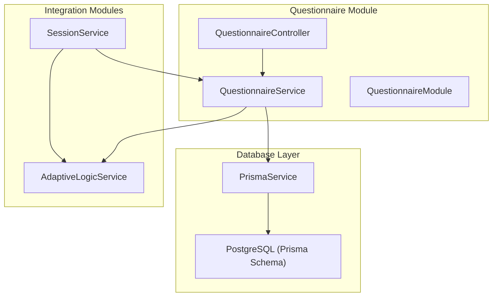
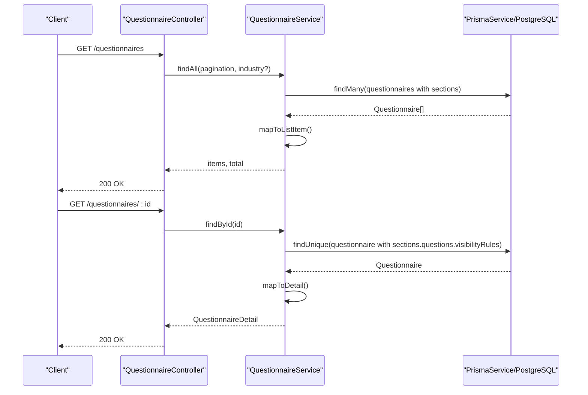
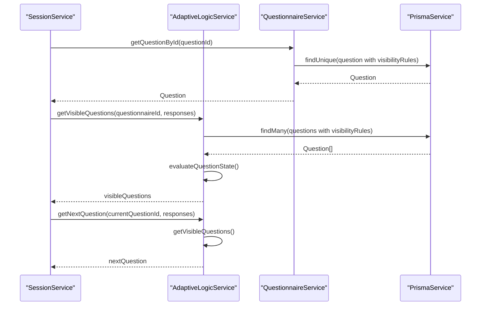
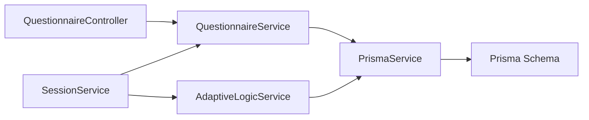

# Questionnaire Module

<cite>
**Referenced Files in This Document**
- [questionnaire.controller.ts](file://apps/api/src/modules/questionnaire/questionnaire.controller.ts)
- [questionnaire.service.ts](file://apps/api/src/modules/questionnaire/questionnaire.service.ts)
- [questionnaire.module.ts](file://apps/api/src/modules/questionnaire/questionnaire.module.ts)
- [prisma.service.ts](file://libs/database/src/prisma.service.ts)
- [schema.prisma](file://prisma/schema.prisma)
- [adaptive-logic.service.ts](file://apps/api/src/modules/adaptive-logic/adaptive-logic.service.ts)
- [rule.types.ts](file://apps/api/src/modules/adaptive-logic/types/rule.types.ts)
- [session.service.ts](file://apps/api/src/modules/session/session.service.ts)
- [adaptive-logic.md](file://docs/questionnaire/adaptive-logic.md)
- [industry-templates.md](file://docs/questionnaire/industry-templates.md)
- [question-bank.md](file://docs/questionnaire/question-bank.md)
</cite>

## Table of Contents
1. [Introduction](#introduction)
2. [Project Structure](#project-structure)
3. [Core Components](#core-components)
4. [Architecture Overview](#architecture-overview)
5. [Detailed Component Analysis](#detailed-component-analysis)
6. [Dependency Analysis](#dependency-analysis)
7. [Performance Considerations](#performance-considerations)
8. [Troubleshooting Guide](#troubleshooting-guide)
9. [Conclusion](#conclusion)
10. [Appendices](#appendices)

## Introduction
This document provides comprehensive documentation for the Questionnaire Module, which manages the lifecycle of questionnaires, sections, and questions, and integrates with the Adaptive Logic Engine to deliver dynamic, context-aware experiences. It covers:
- Questionnaire creation and listing
- Section organization and question definition
- Question types, validation rules, and relationships
- Industry templates and question bank reuse
- Integration with the adaptive logic engine for visibility, requirement, and branching rules
- Examples of questionnaire creation workflows and performance considerations

## Project Structure
The Questionnaire Module is implemented as a NestJS module with a controller, service, and database integration via Prisma. It collaborates with the Adaptive Logic and Session modules to power dynamic question flows and user sessions.

**Diagram sources**
- [questionnaire.controller.ts](file://apps/api/src/modules/questionnaire/questionnaire.controller.ts#L1-L56)
- [questionnaire.service.ts](file://apps/api/src/modules/questionnaire/questionnaire.service.ts#L1-L253)
- [questionnaire.module.ts](file://apps/api/src/modules/questionnaire/questionnaire.module.ts#L1-L11)
- [prisma.service.ts](file://libs/database/src/prisma.service.ts#L1-L62)
- [schema.prisma](file://prisma/schema.prisma#L173-L264)
- [adaptive-logic.service.ts](file://apps/api/src/modules/adaptive-logic/adaptive-logic.service.ts#L1-L307)
- [session.service.ts](file://apps/api/src/modules/session/session.service.ts#L1-L684)

**Section sources**
- [questionnaire.controller.ts](file://apps/api/src/modules/questionnaire/questionnaire.controller.ts#L1-L56)
- [questionnaire.service.ts](file://apps/api/src/modules/questionnaire/questionnaire.service.ts#L1-L253)
- [questionnaire.module.ts](file://apps/api/src/modules/questionnaire/questionnaire.module.ts#L1-L11)
- [prisma.service.ts](file://libs/database/src/prisma.service.ts#L1-L62)
- [schema.prisma](file://prisma/schema.prisma#L173-L264)

## Core Components
- QuestionnaireController: Exposes REST endpoints for listing and retrieving questionnaires.
- QuestionnaireService: Implements data retrieval and mapping for questionnaires, sections, and questions, including visibility rules and counts.
- PrismaService: Database client abstraction with logging and slow query detection.
- Prisma Schema: Defines Questionnaire, Section, Question, VisibilityRule, and related models and enums.
- AdaptiveLogicService: Evaluates visibility, requirement, and branching rules to compute dynamic question flows.
- SessionService: Orchestrates user sessions, integrates with QuestionnaireService and AdaptiveLogicService for adaptive flows.

Key responsibilities:
- Retrieve questionnaires with sections and questions
- Map raw database records to DTOs suitable for clients
- Enforce visibility and requirement rules during sessions
- Compute progress and adaptive state

**Section sources**
- [questionnaire.controller.ts](file://apps/api/src/modules/questionnaire/questionnaire.controller.ts#L25-L54)
- [questionnaire.service.ts](file://apps/api/src/modules/questionnaire/questionnaire.service.ts#L63-L253)
- [prisma.service.ts](file://libs/database/src/prisma.service.ts#L20-L40)
- [schema.prisma](file://prisma/schema.prisma#L173-L264)
- [adaptive-logic.service.ts](file://apps/api/src/modules/adaptive-logic/adaptive-logic.service.ts#L28-L153)
- [session.service.ts](file://apps/api/src/modules/session/session.service.ts#L96-L136)

## Architecture Overview
The module follows a layered architecture:
- Presentation: Controller handles HTTP requests and delegates to the service.
- Application: Service orchestrates data retrieval, mapping, and rule evaluation.
- Persistence: Prisma client interacts with PostgreSQL.
- Integration: Adaptive Logic and Session modules consume Questionnaire data to drive dynamic behavior.

**Diagram sources**
- [questionnaire.controller.ts](file://apps/api/src/modules/questionnaire/questionnaire.controller.ts#L25-L54)
- [questionnaire.service.ts](file://apps/api/src/modules/questionnaire/questionnaire.service.ts#L67-L123)
- [prisma.service.ts](file://libs/database/src/prisma.service.ts#L1-L62)
- [schema.prisma](file://prisma/schema.prisma#L173-L247)

## Detailed Component Analysis

### Questionnaire Service
Responsibilities:
- List questionnaires with section counts and pagination
- Retrieve detailed questionnaire with sections and questions
- Map database records to DTOs for clients
- Provide helpers for question counts and visibility rule inclusion

Implementation highlights:
- Uses Prisma’s include relations to fetch sections and questions with ordering and counts
- Maps to lightweight DTOs for transport
- Includes visibility rules for questions to support adaptive logic

**Diagram sources**
- [questionnaire.service.ts](file://apps/api/src/modules/questionnaire/questionnaire.service.ts#L63-L253)
- [prisma.service.ts](file://libs/database/src/prisma.service.ts#L1-L62)
- [schema.prisma](file://prisma/schema.prisma#L173-L264)

**Section sources**
- [questionnaire.service.ts](file://apps/api/src/modules/questionnaire/questionnaire.service.ts#L67-L182)
- [questionnaire.service.ts](file://apps/api/src/modules/questionnaire/questionnaire.service.ts#L184-L251)

### Adaptive Logic Integration
The Adaptive Logic Service evaluates visibility and requirement rules to dynamically compute which questions are visible and required for a given set of responses.

Key capabilities:
- Evaluate visibility rules per question
- Resolve requirement rules
- Compute next question in sequence
- Detect adaptive changes when responses change
- Build dependency graphs for performance

**Diagram sources**
- [session.service.ts](file://apps/api/src/modules/session/session.service.ts#L217-L242)
- [adaptive-logic.service.ts](file://apps/api/src/modules/adaptive-logic/adaptive-logic.service.ts#L31-L66)
- [adaptive-logic.service.ts](file://apps/api/src/modules/adaptive-logic/adaptive-logic.service.ts#L158-L195)
- [questionnaire.service.ts](file://apps/api/src/modules/questionnaire/questionnaire.service.ts#L150-L162)

**Section sources**
- [adaptive-logic.service.ts](file://apps/api/src/modules/adaptive-logic/adaptive-logic.service.ts#L71-L153)
- [adaptive-logic.service.ts](file://apps/api/src/modules/adaptive-logic/adaptive-logic.service.ts#L228-L243)
- [adaptive-logic.service.ts](file://apps/api/src/modules/adaptive-logic/adaptive-logic.service.ts#L264-L295)
- [session.service.ts](file://apps/api/src/modules/session/session.service.ts#L270-L359)

### Question Types, Validation, and Relationships
Supported question types (from schema):
- Text, Textarea, Number, Email, URL, Date
- Single Choice, Multiple Choice, Scale, File Upload, Matrix

Validation rules:
- JSON-based validation rules per question (e.g., min/max length, numeric bounds)
- Required flag per question
- Options with labels and optional metadata

Relationships:
- Questionnaire contains Sections
- Section contains Questions
- Questions may define VisibilityRules that reference other questions

**Diagram sources**
- [schema.prisma](file://prisma/schema.prisma#L173-L264)

**Section sources**
- [schema.prisma](file://prisma/schema.prisma#L24-L36)
- [schema.prisma](file://prisma/schema.prisma#L218-L247)
- [schema.prisma](file://prisma/schema.prisma#L249-L264)
- [session.service.ts](file://apps/api/src/modules/session/session.service.ts#L622-L659)

### Industry Templates and Question Bank
Industry templates:
- Define industry-specific questions, compliance requirements, terminology mappings, output customizations, and risk factors
- Enable tailored questionnaire experiences by industry

Question bank:
- Reusable questions organized by domain/subdomain
- Supports consistent question definitions across questionnaires
- Provides output mappings and visibility rules

Integration:
- Templates can influence questionnaire composition and validation
- Question bank supports standardized question reuse

**Section sources**
- [industry-templates.md](file://docs/questionnaire/industry-templates.md#L1-L800)
- [question-bank.md](file://docs/questionnaire/question-bank.md#L1-L800)

### Questionnaire Creation Workflows
End-to-end flow:
- Create a session for a user and a specific questionnaire
- Retrieve next questions considering adaptive logic
- Submit responses and validate according to question rules
- Advance to next question and update progress
- Complete session when all required questions are answered

**Diagram sources**
- [session.service.ts](file://apps/api/src/modules/session/session.service.ts#L96-L136)
- [session.service.ts](file://apps/api/src/modules/session/session.service.ts#L198-L268)
- [session.service.ts](file://apps/api/src/modules/session/session.service.ts#L270-L359)
- [session.service.ts](file://apps/api/src/modules/session/session.service.ts#L361-L386)
- [questionnaire.service.ts](file://apps/api/src/modules/questionnaire/questionnaire.service.ts#L100-L123)
- [adaptive-logic.service.ts](file://apps/api/src/modules/adaptive-logic/adaptive-logic.service.ts#L31-L66)

**Section sources**
- [session.service.ts](file://apps/api/src/modules/session/session.service.ts#L96-L136)
- [session.service.ts](file://apps/api/src/modules/session/session.service.ts#L198-L268)
- [session.service.ts](file://apps/api/src/modules/session/session.service.ts#L270-L359)
- [session.service.ts](file://apps/api/src/modules/session/session.service.ts#L361-L386)

## Dependency Analysis
- QuestionnaireController depends on QuestionnaireService
- QuestionnaireService depends on PrismaService
- SessionService depends on QuestionnaireService and AdaptiveLogicService
- AdaptiveLogicService depends on PrismaService and Condition Evaluator types
- Prisma schema defines Questionnaire, Section, Question, and VisibilityRule models and enums

**Diagram sources**
- [questionnaire.controller.ts](file://apps/api/src/modules/questionnaire/questionnaire.controller.ts#L1-L56)
- [questionnaire.service.ts](file://apps/api/src/modules/questionnaire/questionnaire.service.ts#L1-L253)
- [session.service.ts](file://apps/api/src/modules/session/session.service.ts#L1-L684)
- [adaptive-logic.service.ts](file://apps/api/src/modules/adaptive-logic/adaptive-logic.service.ts#L1-L307)
- [prisma.service.ts](file://libs/database/src/prisma.service.ts#L1-L62)
- [schema.prisma](file://prisma/schema.prisma#L173-L264)

**Section sources**
- [questionnaire.controller.ts](file://apps/api/src/modules/questionnaire/questionnaire.controller.ts#L1-L56)
- [questionnaire.service.ts](file://apps/api/src/modules/questionnaire/questionnaire.service.ts#L1-L253)
- [session.service.ts](file://apps/api/src/modules/session/session.service.ts#L1-L684)
- [adaptive-logic.service.ts](file://apps/api/src/modules/adaptive-logic/adaptive-logic.service.ts#L1-L307)
- [prisma.service.ts](file://libs/database/src/prisma.service.ts#L1-L62)
- [schema.prisma](file://prisma/schema.prisma#L173-L264)

## Performance Considerations
- Database queries leverage include relations and ordering to minimize round trips
- Pagination is supported to avoid loading large datasets
- Slow query logging is enabled in development to identify performance bottlenecks
- Adaptive logic computes visibility and next questions efficiently using pre-sorted rules and dependency graphs
- Consider caching frequently accessed questionnaire metadata and visibility rule sets for high-volume scenarios

[No sources needed since this section provides general guidance]

## Troubleshooting Guide
Common issues and resolutions:
- Questionnaire not found: Ensure the questionnaire exists and is active; verify UUID format
- Session access denied: Confirm the session belongs to the requesting user
- Validation errors on submission: Check question validation rules and required fields
- Adaptive logic unexpected behavior: Verify visibility rule priorities, operators, and target question IDs

Operational diagnostics:
- Review Prisma logs for slow queries in development
- Inspect visibility rule configurations for conflicts or misconfigurations

**Section sources**
- [questionnaire.service.ts](file://apps/api/src/modules/questionnaire/questionnaire.service.ts#L118-L120)
- [session.service.ts](file://apps/api/src/modules/session/session.service.ts#L147-L153)
- [session.service.ts](file://apps/api/src/modules/session/session.service.ts#L622-L659)
- [prisma.service.ts](file://libs/database/src/prisma.service.ts#L25-L33)

## Conclusion
The Questionnaire Module provides a robust foundation for managing questionnaires, sections, and questions, with strong integration to the Adaptive Logic Engine for dynamic, personalized user experiences. Its modular design, clear DTOs, and adherence to database-first modeling enable scalable maintenance and extension. Industry templates and a centralized question bank further enhance reusability and consistency across diverse use cases.

[No sources needed since this section summarizes without analyzing specific files]

## Appendices

### Question Types Reference
- Text, Textarea, Number, Email, URL, Date
- Single Choice, Multiple Choice, Scale, File Upload, Matrix

**Section sources**
- [schema.prisma](file://prisma/schema.prisma#L24-L36)

### Adaptive Logic Concepts
- Visibility rules: Show/hide questions based on responses
- Requirement rules: Make questions required or optional
- Branching rules: Route users along different paths
- Condition operators: Equality, inclusion, comparison, and logical combinations

**Section sources**
- [adaptive-logic.md](file://docs/questionnaire/adaptive-logic.md#L23-L116)
- [adaptive-logic.md](file://docs/questionnaire/adaptive-logic.md#L139-L171)
- [rule.types.ts](file://apps/api/src/modules/adaptive-logic/types/rule.types.ts#L4-L28)