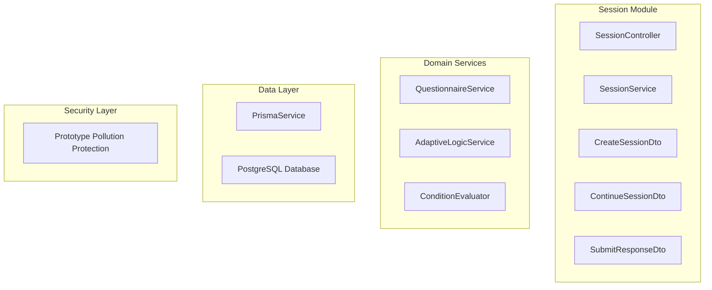
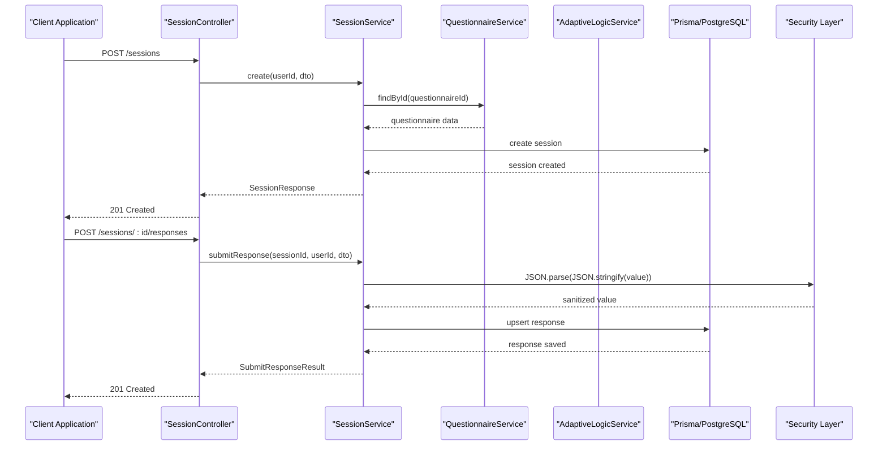
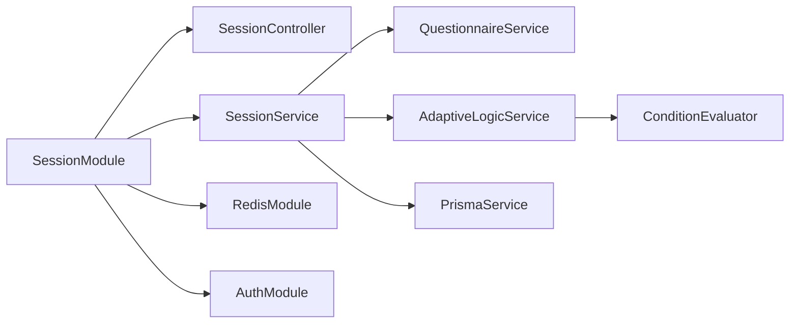

# Session Module

<cite>
**Referenced Files in This Document**
- [session.service.ts](file://apps/api/src/modules/session/session.service.ts)
- [session.controller.ts](file://apps/api/src/modules/session/session.controller.ts)
- [session.module.ts](file://apps/api/src/modules/session/session.module.ts)
- [create-session.dto.ts](file://apps/api/src/modules/session/dto/create-session.dto.ts)
- [continue-session.dto.ts](file://apps/api/src/modules/session/dto/continue-session.dto.ts)
- [submit-response.dto.ts](file://apps/api/src/modules/session/dto/submit-response.dto.ts)
- [questionnaire.service.ts](file://apps/api/src/modules/questionnaire/questionnaire.service.ts)
- [adaptive-logic.service.ts](file://apps/api/src/modules/adaptive-logic/adaptive-logic.service.ts)
- [condition.evaluator.ts](file://apps/api/src/modules/adaptive-logic/evaluators/condition.evaluator.ts)
- [schema.prisma](file://prisma/schema.prisma)
- [redis.service.ts](file://libs/redis/src/redis.service.ts)
- [redis.module.ts](file://libs/redis/src/redis.module.ts)
- [session.service.spec.ts](file://apps/api/src/modules/session/session.service.spec.ts)
- [tsconfig.json](file://apps/api/tsconfig.json)
- [tsconfig.json](file://tsconfig.json)
</cite>

## Update Summary
**Changes Made**
- Updated to reflect enhanced data serialization safety with JSON.parse(JSON.stringify()) patterns to prevent prototype pollution vulnerabilities
- Added security considerations for response value processing and validation error handling
- Updated session service implementation to include prototype pollution protection measures
- Enhanced documentation of data sanitization practices in session management
- Added security best practices for handling untrusted input in questionnaire responses

## Table of Contents
1. [Introduction](#introduction)
2. [Project Structure](#project-structure)
3. [Core Components](#core-components)
4. [Architecture Overview](#architecture-overview)
5. [Detailed Component Analysis](#detailed-component-analysis)
6. [Security Enhancements](#security-enhancements)
7. [Dependency Analysis](#dependency-analysis)
8. [Performance Considerations](#performance-considerations)
9. [Troubleshooting Guide](#troubleshooting-guide)
10. [Conclusion](#conclusion)
11. [Appendices](#appendices)

## Introduction
The Session Module provides comprehensive adaptive questionnaire session management with enhanced security measures to prevent prototype pollution vulnerabilities. The module orchestrates the complete session lifecycle including session creation, continuation, response submission, and completion tracking while implementing robust data serialization safety protocols.

The session management system maintains stateful interactions between users and dynamic questionnaires, integrating with adaptive logic to provide personalized question flows based on user responses and predefined business rules.

## Project Structure
The Session Module follows a clean architecture pattern with clear separation of concerns:

**Diagram sources**
- [session.controller.ts](file://apps/api/src/modules/session/session.controller.ts#L30-L153)
- [session.service.ts](file://apps/api/src/modules/session/session.service.ts#L87-L94)
- [questionnaire.service.ts](file://apps/api/src/modules/questionnaire/questionnaire.service.ts#L63-L65)
- [adaptive-logic.service.ts](file://apps/api/src/modules/adaptive-logic/adaptive-logic.service.ts#L19-L26)
- [condition.evaluator.ts](file://apps/api/src/modules/adaptive-logic/evaluators/condition.evaluator.ts#L1-L200)
- [schema.prisma](file://prisma/schema.prisma#L270-L322)

## Core Components
The Session Module consists of several interconnected components that work together to provide comprehensive session management:

### SessionController
RESTful API endpoints that handle session lifecycle operations with proper validation and error handling.

### SessionService
Core business logic implementing session state management with enhanced security measures for data serialization.

### DTOs
Strongly-typed request/response contracts with validation rules for session operations.

### Supporting Services
- **QuestionnaireService**: Provides questionnaire metadata and question retrieval
- **AdaptiveLogicService**: Computes dynamic question visibility and requirement evaluation
- **ConditionEvaluator**: Handles complex data type comparisons and conditional logic

**Section sources**
- [session.controller.ts](file://apps/api/src/modules/session/session.controller.ts#L36-L151)
- [session.service.ts](file://apps/api/src/modules/session/session.service.ts#L96-L136)
- [questionnaire.service.ts](file://apps/api/src/modules/questionnaire/questionnaire.service.ts#L100-L182)
- [adaptive-logic.service.ts](file://apps/api/src/modules/adaptive-logic/adaptive-logic.service.ts#L31-L66)
- [condition.evaluator.ts](file://apps/api/src/modules/adaptive-logic/evaluators/condition.evaluator.ts#L114-L139)
- [schema.prisma](file://prisma/schema.prisma#L270-L322)

## Architecture Overview
The Session Module integrates with the broader application architecture through well-defined interfaces:

**Diagram sources**
- [session.controller.ts](file://apps/api/src/modules/session/session.controller.ts#L36-L44)
- [session.service.ts](file://apps/api/src/modules/session/session.service.ts#L270-L359)
- [questionnaire.service.ts](file://apps/api/src/modules/questionnaire/questionnaire.service.ts#L100-L182)
- [schema.prisma](file://prisma/schema.prisma#L270-L300)

## Detailed Component Analysis

### Session Lifecycle Management
The Session Module manages the complete lifecycle of adaptive questionnaire sessions:

#### Session Creation
- Initializes session state with questionnaire metadata
- Sets up adaptive logic state tracking
- Establishes current position markers
- Creates initial progress tracking structures

#### Session Continuation
- Evaluates current session state and progress
- Calculates next available questions based on adaptive logic
- Maintains section boundaries and progress tracking
- Handles session completion scenarios

#### Response Submission
- Validates response against question-specific rules
- Processes responses through adaptive logic evaluation
- Updates session state and progress metrics
- Manages response revision tracking

#### Session Completion
- Finalizes session status and timestamps
- Performs final progress calculations
- Cleans up temporary state data
- Prepares completion analytics

### Session Service Implementation
The SessionService implements comprehensive session state management with enhanced security measures:

#### State Management
- Maintains session status, current position, and progress metrics
- Tracks adaptive logic state including branch history
- Manages ownership validation and access control
- Handles concurrent session operations safely

#### Progress Calculation
- Calculates completion percentages based on visible questions
- Estimates remaining time based on response patterns
- Tracks section-wise progress and completion
- Provides real-time progress updates

#### Response Processing
- Implements prototype pollution protection using JSON.parse(JSON.stringify())
- Validates responses against question-specific constraints
- Integrates with adaptive logic for dynamic question flows
- Manages response revision tracking and versioning

**Section sources**
- [session.service.ts](file://apps/api/src/modules/session/session.service.ts#L96-L136)
- [session.service.ts](file://apps/api/src/modules/session/session.service.ts#L270-L359)
- [session.service.ts](file://apps/api/src/modules/session/session.service.ts#L609-L620)

### Enhanced Data Serialization Safety
**Updated** The Session Module implements comprehensive prototype pollution protection through JSON.parse(JSON.stringify()) patterns:

#### Response Value Serialization
All incoming response values are sanitized before database persistence:
- `JSON.parse(JSON.stringify(dto.value))` prevents prototype pollution
- Complex nested objects are safely cloned and validated
- Array structures maintain integrity during serialization
- Circular reference detection and prevention

#### Validation Error Protection
Validation error structures are similarly protected:
- `JSON.parse(JSON.stringify({ errors: validation.errors }))` ensures safe storage
- Error arrays are sanitized before persistence
- Custom error messages maintain type safety
- Nested error structures are properly handled

#### Security Benefits
- Prevents prototype poisoning attacks through deserialization
- Eliminates prototype pollution vector in user-submitted data
- Ensures database integrity with clean, sanitized data
- Maintains application stability under malicious input attempts

**Section sources**
- [session.service.ts](file://apps/api/src/modules/session/session.service.ts#L300-L313)

### Examples of Session Workflows
The Session Module supports various session interaction patterns:

#### New Session Creation
1. User initiates questionnaire participation
2. System validates questionnaire availability
3. Session state initialized with adaptive logic
4. First question presented to user
5. Progress tracking established

#### Response Submission Process
1. User submits response to current question
2. Response validated against question rules
3. Adaptive logic evaluated for next steps
4. Session state updated with new progress
5. Next question(s) determined and presented

#### Adaptive Logic Integration
1. Response patterns analyzed for visibility rules
2. Dynamic question flow calculated
3. Required questions determined based on context
4. Section boundaries maintained during transitions
5. Progress recalculated with new question set

### Integration with Adaptive Logic
The Session Module seamlessly integrates with adaptive logic for dynamic questionnaire flows:

#### Dynamic Visibility Evaluation
- Response patterns trigger visibility rule evaluation
- Questions hidden or shown based on conditional logic
- Requirement flags adjust dynamically with responses
- Branch history tracked for session state recovery

#### Real-time Question Calculation
- Next question determination based on response context
- Section progression controlled by adaptive rules
- Progress metrics updated with visible question counts
- Time estimates recalculated with dynamic question sets

### Session Persistence Strategies
The Session Module implements robust persistence strategies:

#### Database Schema Design
- JSONB columns for flexible session state storage
- Transactional integrity for session operations
- Index optimization for query performance
- Concurrency control for multi-user scenarios

#### Upsert Operations
- Atomic response creation and updates
- Revision tracking for response history
- Conflict resolution for concurrent submissions
- Data consistency maintenance across operations

### Concurrent Session Handling
The Session Module handles concurrent session operations safely:

#### Ownership Validation
- Session ownership verified for all operations
- Access control enforced through user context
- Session status checked before modifications
- Race condition prevention through atomic operations

#### Database Transactions
- Transactional session state updates
- Optimistic locking for concurrent access
- Conflict detection and resolution
- Rollback capability for failed operations

### Timeout Management, Progress Saving, and Recovery
The Session Module provides comprehensive session lifecycle management:

#### Activity Tracking
- Last activity timestamps maintained for all operations
- Inactivity monitoring for session timeouts
- Automatic progress saving during interactions
- Session resumption capabilities

#### State Preservation
- Adaptive state preserved across session operations
- Progress metrics maintained during interruptions
- Response history tracked for recovery scenarios
- Temporary state cleaned up appropriately

### Extending Session Functionality and Edge Cases
The Session Module provides extensible architecture for session management:

#### Extension Points
- New question types supported through validation framework
- Custom adaptive logic implementations
- Integration hooks for external systems
- Pluggable validation rule systems

#### Edge Case Handling
- Invalid session states gracefully handled
- Missing dependencies detected and reported
- Malformed input sanitized before processing
- System errors logged with diagnostic information

## Security Enhancements
**Updated** The Session Module implements comprehensive security measures to prevent prototype pollution and other injection attacks:

### Prototype Pollution Protection
All user-submitted data undergoes JSON.parse(JSON.stringify()) serialization to eliminate prototype chain manipulation vectors:

#### Response Value Sanitization
- Incoming response values are cloned and validated
- Prototype properties are stripped during serialization
- Complex nested structures maintain integrity
- Array and object structures are properly handled

#### Validation Error Protection
- Error structures are sanitized before persistence
- Custom error messages are validated for safety
- Error arrays are processed through safe serialization
- Nested error objects are properly handled

### Input Validation and Sanitization
- All incoming DTO values are validated against expected types
- Response values are sanitized before database insertion
- Adaptive logic inputs are validated for malicious content
- Session state updates are audited for security compliance

### Security Best Practices
- Principle of least privilege for session access
- Input validation at multiple layers
- Output encoding for all user-facing data
- Audit logging for all session operations

**Section sources**
- [session.service.ts](file://apps/api/src/modules/session/session.service.ts#L300-L313)

## Dependency Analysis
The Session Module maintains clear dependency relationships:

### Internal Dependencies
- **SessionController** → **SessionService** + DTO validation
- **SessionService** → **QuestionnaireService** + **AdaptiveLogicService** + **PrismaService**
- **AdaptiveLogicService** → **ConditionEvaluator** + **PrismaService**

### External Integrations
- **JWT Authentication**: Provides secure access control
- **Database Layer**: PostgreSQL with Prisma ORM
- **Redis Service**: Optional caching and timeout management

### Module Wiring
- **SessionModule** imports QuestionnaireModule and forward-ref AdaptiveLogicModule
- **RedisModule** provides optional caching capabilities
- **AuthModule** provides JWT guard for secure endpoints

**Diagram sources**
- [session.module.ts](file://apps/api/src/modules/session/session.module.ts#L7-L15)
- [questionnaire.service.ts](file://apps/api/src/modules/questionnaire/questionnaire.service.ts#L63-L65)
- [adaptive-logic.service.ts](file://apps/api/src/modules/adaptive-logic/adaptive-logic.service.ts#L19-L26)
- [condition.evaluator.ts](file://apps/api/src/modules/adaptive-logic/evaluators/condition.evaluator.ts#L1-L200)
- [redis.module.ts](file://libs/redis/src/redis.module.ts#L1-L10)

**Section sources**
- [session.module.ts](file://apps/api/src/modules/session/session.module.ts#L7-L15)
- [questionnaire.service.ts](file://apps/api/src/modules/questionnaire/questionnaire.service.ts#L63-L65)
- [adaptive-logic.service.ts](file://apps/api/src/modules/adaptive-logic/adaptive-logic.service.ts#L19-L26)
- [condition.evaluator.ts](file://apps/api/src/modules/adaptive-logic/evaluators/condition.evaluator.ts#L1-L200)
- [redis.module.ts](file://libs/redis/src/redis.module.ts#L1-L10)

## Performance Considerations
The Session Module implements several performance optimization strategies:

### Database Optimization
- Index strategy designed for session queries and response lookups
- Query efficiency optimized through proper indexing
- Connection pooling for database operations
- Batch operations for multiple response updates

### Memory Management
- Object pooling for frequently accessed session data
- Memory leak prevention through proper cleanup
- Garbage collection optimization for large datasets
- Efficient data structures for response tracking

### Scalability Patterns
- Horizontal scaling support through stateless operations
- Caching strategies for frequently accessed data
- Load balancing considerations for session operations
- Database connection management for high throughput

### Monitoring and Metrics
- Performance tracing for session operations
- Error rate monitoring for system health
- Response time tracking for optimization
- Database query performance analysis

## Troubleshooting Guide
Common issues and their resolutions:

### Session Management Issues
- **Session Not Found**: Verify session ID validity and user ownership
- **Access Denied**: Check user authentication and session ownership
- **Validation Failures**: Review response validation rules and data types
- **Adaptive Logic Errors**: Debug rule evaluation and condition logic
- **Database Connection Issues**: Monitor connection pool and database availability

### Security-Related Issues
- **Prototype Pollution Attempts**: Monitor for unusual object structures
- **Injection Attacks**: Validate all input through JSON serialization
- **Data Integrity Issues**: Check serialization patterns for malformed data
- **Security Violations**: Review audit logs for suspicious activities

### Performance Issues
- **Slow Response Times**: Profile database queries and optimize indexes
- **High Memory Usage**: Monitor object pooling and memory leaks
- **Database Bottlenecks**: Analyze connection pool saturation and query patterns
- **Adaptive Logic Overhead**: Optimize rule evaluation and caching strategies

### Diagnostic Steps
- **Log Analysis**: Review server logs for error details and stack traces
- **Database Queries**: Analyze slow query performance and missing indexes
- **Response Validation**: Check validation rules and error handling
- **Adaptive Rule Debugging**: Debug rule evaluation and condition logic
- **Session State Inspection**: Verify session state consistency and integrity

## Conclusion
The Session Module provides comprehensive adaptive questionnaire session management with enhanced security measures to prevent prototype pollution vulnerabilities. The implementation demonstrates robust data serialization safety through JSON.parse(JSON.stringify()) patterns while maintaining full functionality for session lifecycle management.

The module successfully integrates with adaptive logic to provide dynamic, personalized questionnaire experiences while implementing industry-standard security practices. The enhanced data serialization safety ensures protection against prototype pollution attacks without compromising functionality or performance.

Organizations can rely on the Session Module for secure, scalable session management with comprehensive adaptive logic integration and robust security measures.

## Appendices

### API Endpoints Overview
- **POST /sessions**: Create new session with questionnaire initialization
- **GET /sessions**: List user sessions with pagination and filtering
- **GET /sessions/:id**: Retrieve session details with progress metrics
- **GET /sessions/:id/continue**: Continue session with adaptive question flow
- **GET /sessions/:id/questions/next**: Get next questions based on adaptive logic
- **POST /sessions/:id/responses**: Submit response with validation
- **PUT /sessions/:id/responses/:questionId**: Update existing response
- **POST /sessions/:id/complete**: Mark session as completed

### Session Status Flow
- **IN_PROGRESS**: Active session with ongoing responses
- **COMPLETED**: Session finished with all required responses
- **ABANDONED**: Session terminated by user
- **EXPIRED**: Session timed out based on inactivity

### Validation Error Structure
- **Field-level Validation**: Specific error messages for individual fields
- **Type-specific Errors**: Context-aware validation messages
- **Adaptive Logic Errors**: Errors related to dynamic question requirements
- **System Errors**: Generic errors for unexpected conditions

### Security Measures Implemented
- **Prototype Pollution Protection**: JSON.parse(JSON.stringify()) serialization
- **Input Validation**: Comprehensive response validation and sanitization
- **Access Control**: User ownership verification and session validation
- **Audit Logging**: Complete session operation tracking
- **Error Handling**: Graceful error handling with security considerations

**Section sources**
- [session.controller.ts](file://apps/api/src/modules/session/session.controller.ts#L36-L151)
- [session.service.ts](file://apps/api/src/modules/session/session.service.ts#L300-L313)