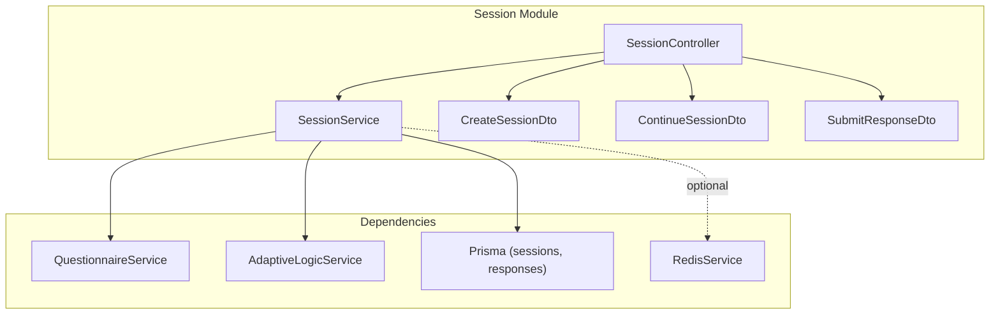
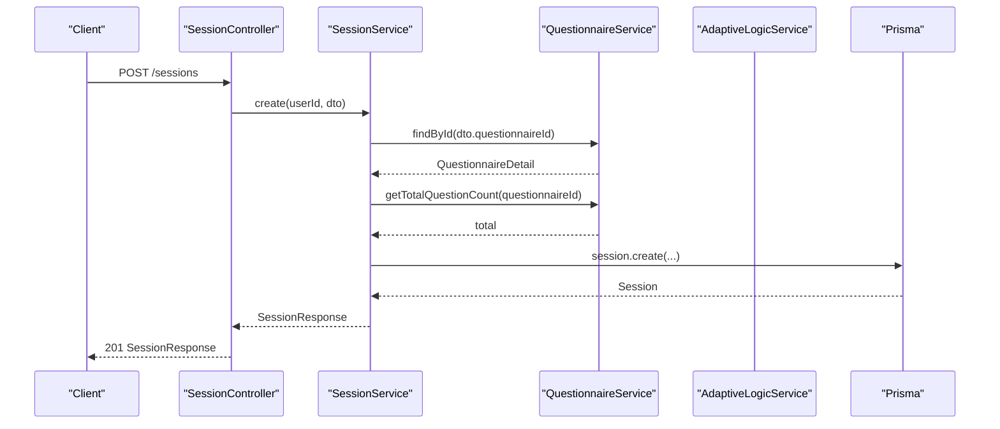
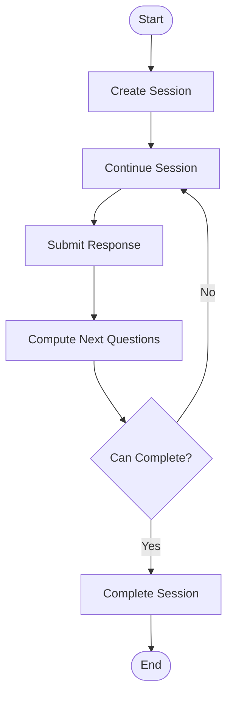
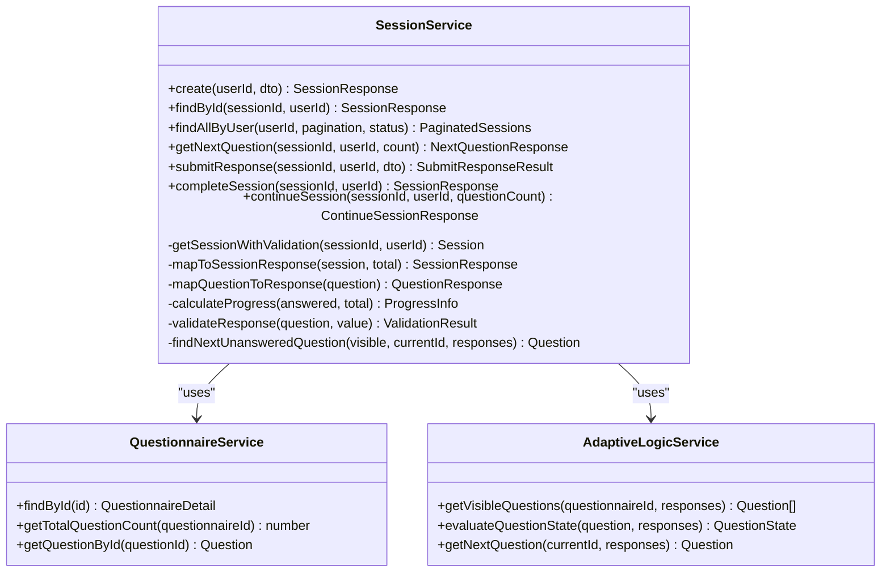
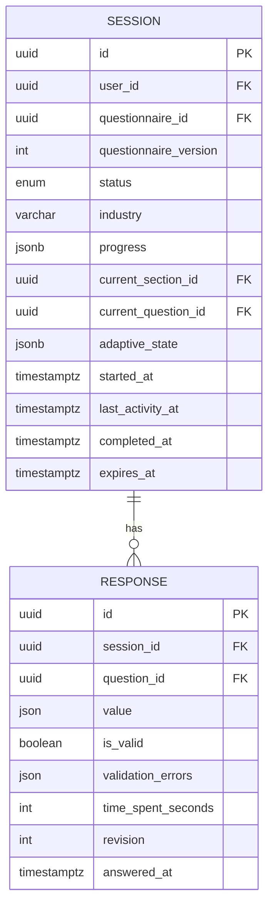
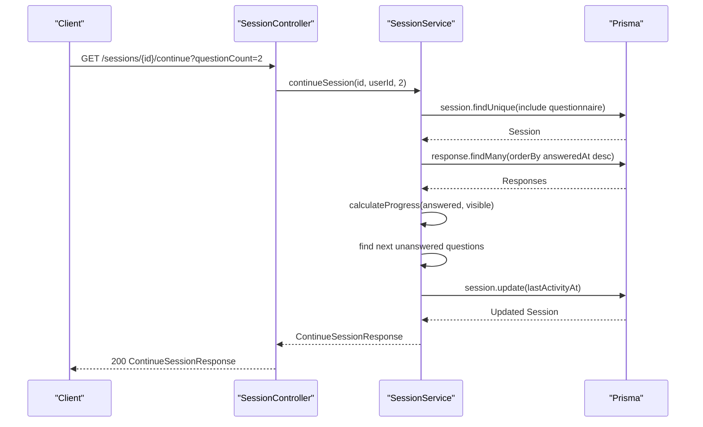
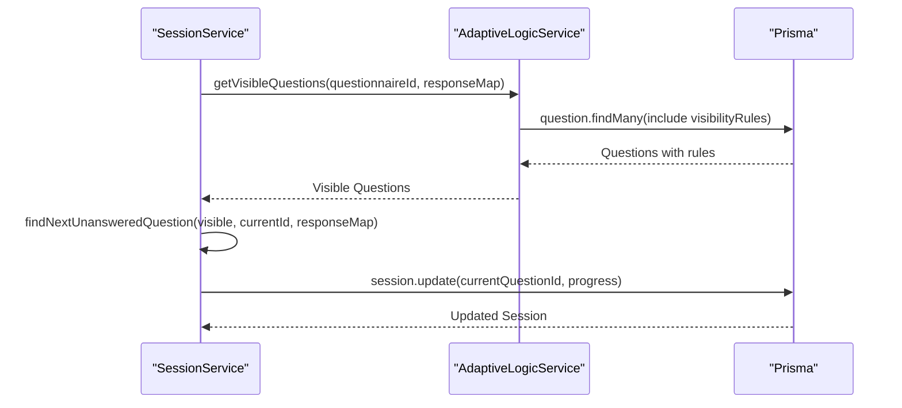
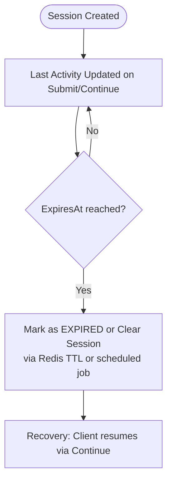
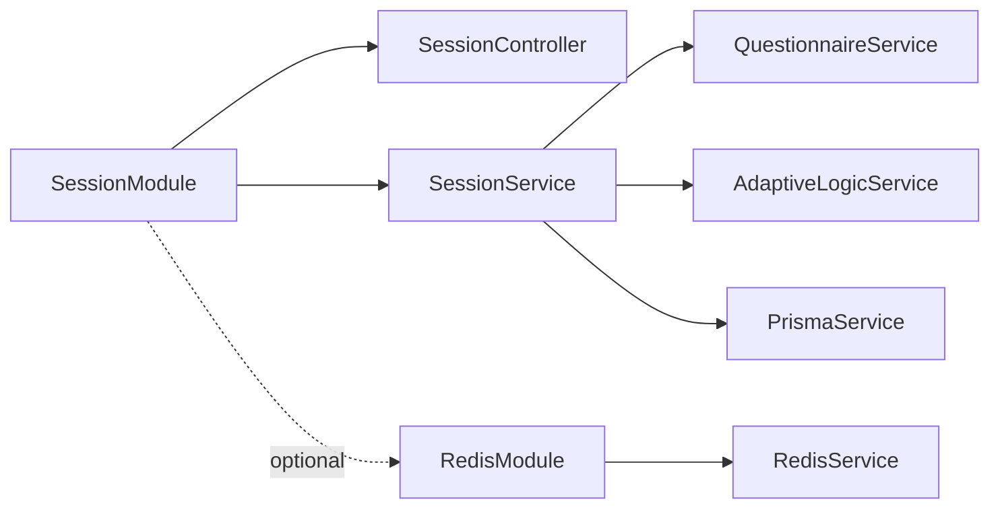

# Session Module

<cite>
**Referenced Files in This Document**
- [session.service.ts](file://apps/api/src/modules/session/session.service.ts)
- [session.controller.ts](file://apps/api/src/modules/session/session.controller.ts)
- [session.module.ts](file://apps/api/src/modules/session/session.module.ts)
- [create-session.dto.ts](file://apps/api/src/modules/session/dto/create-session.dto.ts)
- [continue-session.dto.ts](file://apps/api/src/modules/session/dto/continue-session.dto.ts)
- [submit-response.dto.ts](file://apps/api/src/modules/session/dto/submit-response.dto.ts)
- [questionnaire.service.ts](file://apps/api/src/modules/questionnaire/questionnaire.service.ts)
- [adaptive-logic.service.ts](file://apps/api/src/modules/adaptive-logic/adaptive-logic.service.ts)
- [schema.prisma](file://prisma/schema.prisma)
- [redis.service.ts](file://libs/redis/src/redis.service.ts)
- [redis.module.ts](file://libs/redis/src/redis.module.ts)
- [session.service.spec.ts](file://apps/api/src/modules/session/session.service.spec.ts)
</cite>

## Table of Contents
1. [Introduction](#introduction)
2. [Project Structure](#project-structure)
3. [Core Components](#core-components)
4. [Architecture Overview](#architecture-overview)
5. [Detailed Component Analysis](#detailed-component-analysis)
6. [Dependency Analysis](#dependency-analysis)
7. [Performance Considerations](#performance-considerations)
8. [Troubleshooting Guide](#troubleshooting-guide)
9. [Conclusion](#conclusion)
10. [Appendices](#appendices)

## Introduction
The Session Module manages the lifecycle of a user’s interaction with a Questionnaire. It supports session creation, continuation, response submission, and completion tracking. It integrates with the Questionnaire and Adaptive Logic services to compute dynamic question flows, enforce validation rules, and maintain accurate progress metrics. Sessions persist in the database with structured progress and adaptive state, enabling resumable experiences and robust analytics.

## Project Structure
The Session Module is organized around a controller, a service, and DTOs. It depends on the Questionnaire and Adaptive Logic modules and persists data via Prisma. Optional Redis integration can support caching and timeouts at the application layer.

**Diagram sources**
- [session.controller.ts](file://apps/api/src/modules/session/session.controller.ts#L30-L153)
- [session.service.ts](file://apps/api/src/modules/session/session.service.ts#L87-L94)
- [questionnaire.service.ts](file://apps/api/src/modules/questionnaire/questionnaire.service.ts#L63-L65)
- [adaptive-logic.service.ts](file://apps/api/src/modules/adaptive-logic/adaptive-logic.service.ts#L19-L26)
- [schema.prisma](file://prisma/schema.prisma#L270-L322)
- [redis.service.ts](file://libs/redis/src/redis.service.ts#L1-L96)

**Section sources**
- [session.module.ts](file://apps/api/src/modules/session/session.module.ts#L1-L17)
- [session.controller.ts](file://apps/api/src/modules/session/session.controller.ts#L30-L153)
- [session.service.ts](file://apps/api/src/modules/session/session.service.ts#L87-L94)

## Core Components
- SessionController: Exposes REST endpoints for session lifecycle operations and delegates to SessionService.
- SessionService: Implements session state management, progress calculation, response validation, and integration with adaptive logic.
- DTOs: Strongly typed request/response contracts for create, continue, and submit operations.
- QuestionnaireService: Provides questionnaire metadata, question retrieval, and counts.
- AdaptiveLogicService: Computes visibility and requirement states of questions based on responses and rules.
- Persistence: Sessions and Responses stored in PostgreSQL via Prisma.
- Optional Redis: Provides caching and TTL primitives for advanced session features.

**Section sources**
- [session.controller.ts](file://apps/api/src/modules/session/session.controller.ts#L36-L151)
- [session.service.ts](file://apps/api/src/modules/session/session.service.ts#L96-L136)
- [create-session.dto.ts](file://apps/api/src/modules/session/dto/create-session.dto.ts#L4-L14)
- [continue-session.dto.ts](file://apps/api/src/modules/session/dto/continue-session.dto.ts#L5-L13)
- [submit-response.dto.ts](file://apps/api/src/modules/session/dto/submit-response.dto.ts#L4-L21)
- [questionnaire.service.ts](file://apps/api/src/modules/questionnaire/questionnaire.service.ts#L100-L182)
- [adaptive-logic.service.ts](file://apps/api/src/modules/adaptive-logic/adaptive-logic.service.ts#L31-L66)
- [schema.prisma](file://prisma/schema.prisma#L270-L322)
- [redis.service.ts](file://libs/redis/src/redis.service.ts#L40-L67)

## Architecture Overview
The Session Module orchestrates session operations with clear separation of concerns:
- Controller validates inputs and enforces authentication.
- Service encapsulates business logic, including progress computation and adaptive evaluation.
- Services for Questionnaire and Adaptive Logic provide domain data and dynamic visibility.
- Persistence stores sessions and responses; Redis can augment caching and expiration.

**Diagram sources**
- [session.controller.ts](file://apps/api/src/modules/session/session.controller.ts#L36-L44)
- [session.service.ts](file://apps/api/src/modules/session/session.service.ts#L96-L136)
- [questionnaire.service.ts](file://apps/api/src/modules/questionnaire/questionnaire.service.ts#L100-L182)
- [schema.prisma](file://prisma/schema.prisma#L270-L300)

## Detailed Component Analysis

### Session Lifecycle Management
- Creation: Initializes a new session with status IN_PROGRESS, sets current section/question, and seeds progress and adaptive state.
- Continuation: Resumes a session, computes visible questions, determines next questions, and updates last activity.
- Response Submission: Validates responses against question rules, persists/upserts answers, evaluates adaptive changes, and updates progress.
- Completion: Marks a session as COMPLETED when all required questions are answered.

**Diagram sources**
- [session.service.ts](file://apps/api/src/modules/session/session.service.ts#L96-L136)
- [session.service.ts](file://apps/api/src/modules/session/session.service.ts#L388-L546)
- [session.service.ts](file://apps/api/src/modules/session/session.service.ts#L270-L359)
- [session.service.ts](file://apps/api/src/modules/session/session.service.ts#L361-L386)

**Section sources**
- [session.service.ts](file://apps/api/src/modules/session/session.service.ts#L96-L136)
- [session.service.ts](file://apps/api/src/modules/session/session.service.ts#L388-L546)
- [session.service.ts](file://apps/api/src/modules/session/session.service.ts#L270-L359)
- [session.service.ts](file://apps/api/src/modules/session/session.service.ts#L361-L386)

### Session Service Implementation
Key responsibilities:
- State management: Tracks status, current section/question, progress, and adaptive state.
- Progress calculation: Computes percentage, answered count, total visible, and estimated time remaining.
- Adaptive integration: Uses visibility rules to compute visible questions and required states.
- Validation: Enforces required fields and type-specific constraints (min/max length, min/max numeric).
- Persistence: Creates, reads, updates sessions and responses; maintains revision counters.

**Diagram sources**
- [session.service.ts](file://apps/api/src/modules/session/session.service.ts#L87-L94)
- [questionnaire.service.ts](file://apps/api/src/modules/questionnaire/questionnaire.service.ts#L63-L65)
- [adaptive-logic.service.ts](file://apps/api/src/modules/adaptive-logic/adaptive-logic.service.ts#L19-L26)

**Section sources**
- [session.service.ts](file://apps/api/src/modules/session/session.service.ts#L17-L85)
- [session.service.ts](file://apps/api/src/modules/session/session.service.ts#L567-L620)
- [session.service.ts](file://apps/api/src/modules/session/session.service.ts#L622-L659)
- [session.service.ts](file://apps/api/src/modules/session/session.service.ts#L661-L682)

### Session DTOs and Validation Rules
- CreateSessionDto
  - Fields: questionnaireId (UUID), industry (optional string, max length 100).
  - Purpose: Start a new session with optional industry context for adaptive logic.
- ContinueSessionDto
  - Fields: questionCount (optional number, range 1–5).
  - Purpose: Control how many next questions to return during continuation.
- SubmitResponseDto
  - Fields: questionId (UUID), value (non-empty, type depends on question), timeSpentSeconds (optional integer ≥ 0).
  - Purpose: Submit or update a response to a question.

Validation rules enforced by the service:
- Required fields: empty/null/undefined values trigger a validation error when a question is marked required.
- Text constraints: minimum and maximum length checks based on question validation rules.
- Numeric constraints: minimum and maximum numeric bounds based on question validation rules.

**Diagram sources**
- [schema.prisma](file://prisma/schema.prisma#L270-L322)

**Section sources**
- [create-session.dto.ts](file://apps/api/src/modules/session/dto/create-session.dto.ts#L4-L14)
- [continue-session.dto.ts](file://apps/api/src/modules/session/dto/continue-session.dto.ts#L5-L13)
- [submit-response.dto.ts](file://apps/api/src/modules/session/dto/submit-response.dto.ts#L4-L21)
- [session.service.ts](file://apps/api/src/modules/session/session.service.ts#L622-L659)

### Examples of Session Workflows
- New Session Creation
  - Client calls POST /sessions with CreateSessionDto.
  - Service creates a session with initial progress and adaptive state, sets current section/question, and returns SessionResponse.
- Continue Session
  - Client calls GET /sessions/:id/continue with optional questionCount.
  - Service returns next questions, overall progress, section progress, adaptive state, and completion eligibility.
- Submit Response
  - Client calls POST /sessions/:id/responses with SubmitResponseDto.
  - Service validates the response, persists/upserts it, recomputes progress, and returns SubmitResponseResult.
- Complete Session
  - Client calls POST /sessions/:id/complete.
  - Service marks the session as COMPLETED and returns updated SessionResponse.

**Diagram sources**
- [session.controller.ts](file://apps/api/src/modules/session/session.controller.ts#L81-L105)
- [session.service.ts](file://apps/api/src/modules/session/session.service.ts#L388-L546)

**Section sources**
- [session.controller.ts](file://apps/api/src/modules/session/session.controller.ts#L81-L105)
- [session.service.ts](file://apps/api/src/modules/session/session.service.ts#L388-L546)

### Integration with Adaptive Logic
- Visible questions: The service queries adaptive logic to compute the current visible question set based on existing responses.
- Requirement state: Adaptive rules can mark questions as required or unrequired dynamically.
- Branch history: Adaptive state tracks applied rules and branching decisions for observability.

**Diagram sources**
- [session.service.ts](file://apps/api/src/modules/session/session.service.ts#L225-L241)
- [session.service.ts](file://apps/api/src/modules/session/session.service.ts#L321-L332)
- [adaptive-logic.service.ts](file://apps/api/src/modules/adaptive-logic/adaptive-logic.service.ts#L31-L66)

**Section sources**
- [session.service.ts](file://apps/api/src/modules/session/session.service.ts#L225-L241)
- [session.service.ts](file://apps/api/src/modules/session/session.service.ts#L321-L332)
- [adaptive-logic.service.ts](file://apps/api/src/modules/adaptive-logic/adaptive-logic.service.ts#L71-L153)

### Session Persistence Strategies
- Sessions: Stored with progress and adaptive state as JSONB for flexibility and fast aggregation.
- Responses: Upsert pattern ensures idempotent updates and revision tracking.
- Indexes: Optimized for user-scoped queries, status filtering, and timestamps.

**Section sources**
- [schema.prisma](file://prisma/schema.prisma#L270-L322)

### Concurrent Session Handling
- Access control: Each operation validates ownership and throws forbidden for unauthorized access.
- Concurrency model: The service uses database transactions via Prisma for atomic updates. No explicit distributed locks are present in the codebase.
- Recommendations:
  - Use database-level constraints and transactions for consistency.
  - Consider optimistic locking with revision fields (already present on responses).
  - For high concurrency, add application-level rate limiting and consider Redis for lightweight coordination.

**Section sources**
- [session.service.ts](file://apps/api/src/modules/session/session.service.ts#L548-L565)
- [session.service.ts](file://apps/api/src/modules/session/session.service.ts#L306-L313)

### Timeout Management, Progress Saving, and Recovery
- Timeout management: The database schema defines an expiresAt field on sessions but does not include automatic expiration logic in the service. Redis can be leveraged to manage TTLs and invalidate stale sessions.
- Progress saving: Progress is updated on each response submission and continuation call.
- Recovery: Clients can resume sessions via continuation endpoints; the service returns next questions and progress.

**Diagram sources**
- [schema.prisma](file://prisma/schema.prisma#L285-L285)
- [session.service.ts](file://apps/api/src/modules/session/session.service.ts#L525-L531)
- [redis.service.ts](file://libs/redis/src/redis.service.ts#L44-L67)

**Section sources**
- [schema.prisma](file://prisma/schema.prisma#L285-L285)
- [session.service.ts](file://apps/api/src/modules/session/session.service.ts#L525-L531)
- [redis.service.ts](file://libs/redis/src/redis.service.ts#L44-L67)

### Extending Session Functionality and Edge Cases
- Extensibility:
  - Add new validation rules by extending question validation structures and updating the validator.
  - Introduce new adaptive actions by expanding the adaptive logic evaluator.
  - Integrate Redis for caching frequently accessed sessions or enforcing TTL-based expiration.
- Edge cases handled by tests/specs:
  - Completed session operations rejected.
  - Unauthorized access blocked.
  - Required field validation failures reported.
  - Min/max length and numeric constraints enforced.
  - Section progress computed accurately.
  - canComplete determined by required questions and answered count.

**Section sources**
- [session.service.spec.ts](file://apps/api/src/modules/session/session.service.spec.ts#L121-L162)
- [session.service.spec.ts](file://apps/api/src/modules/session/session.service.spec.ts#L164-L189)
- [session.service.spec.ts](file://apps/api/src/modules/session/session.service.spec.ts#L225-L287)
- [session.service.spec.ts](file://apps/api/src/modules/session/session.service.spec.ts#L289-L373)
- [session.service.spec.ts](file://apps/api/src/modules/session/session.service.spec.ts#L375-L416)
- [session.service.spec.ts](file://apps/api/src/modules/session/session.service.spec.ts#L418-L501)
- [session.service.spec.ts](file://apps/api/src/modules/session/session.service.spec.ts#L578-L715)

## Dependency Analysis
- Internal dependencies:
  - SessionController depends on SessionService and DTOs.
  - SessionService depends on QuestionnaireService, AdaptiveLogicService, and PrismaService.
- External integrations:
  - RedisService provides optional caching and TTL support.
- Module wiring:
  - SessionModule imports QuestionnaireModule and forward-ref AdaptiveLogicModule.

**Diagram sources**
- [session.module.ts](file://apps/api/src/modules/session/session.module.ts#L7-L15)
- [session.controller.ts](file://apps/api/src/modules/session/session.controller.ts#L33-L34)
- [session.service.ts](file://apps/api/src/modules/session/session.service.ts#L89-L94)
- [redis.module.ts](file://libs/redis/src/redis.module.ts#L1-L10)

**Section sources**
- [session.module.ts](file://apps/api/src/modules/session/session.module.ts#L7-L15)
- [session.controller.ts](file://apps/api/src/modules/session/session.controller.ts#L33-L34)
- [session.service.ts](file://apps/api/src/modules/session/session.service.ts#L89-L94)
- [redis.module.ts](file://libs/redis/src/redis.module.ts#L1-L10)

## Performance Considerations
- Database efficiency:
  - Use indexes on user_id, status, and timestamps for fast filtering and sorting.
  - Batch operations: Fetch responses and visible questions in single queries per request.
- Calculation costs:
  - Adaptive visibility evaluation scales with question count; cache visible question lists per session if needed.
  - Progress computation is O(n) per response; keep response counts reasonable.
- Network and latency:
  - Consider Redis caching for hot session data and short-lived TTLs to reduce DB load.

## Troubleshooting Guide
Common issues and resolutions:
- Session not found or access denied:
  - Ensure the session belongs to the authenticated user; otherwise, a forbidden error is thrown.
- Attempting to operate on a completed session:
  - Operations like submitting responses or continuing are rejected for completed sessions.
- Validation errors on response submission:
  - Required fields, min/max length, and numeric bounds are enforced; adjust client-side validation accordingly.
- Unexpected next questions:
  - Verify adaptive rules and that responses are persisted before requesting next questions.

**Section sources**
- [session.service.ts](file://apps/api/src/modules/session/session.service.ts#L548-L565)
- [session.service.ts](file://apps/api/src/modules/session/session.service.ts#L270-L279)
- [session.service.ts](file://apps/api/src/modules/session/session.service.ts#L622-L659)
- [session.service.spec.ts](file://apps/api/src/modules/session/session.service.spec.ts#L248-L257)
- [session.service.spec.ts](file://apps/api/src/modules/session/session.service.spec.ts#L331-L340)

## Conclusion
The Session Module provides a robust, extensible foundation for managing questionnaire sessions with adaptive logic, validation, and progress tracking. Its clean separation of concerns, strong typing via DTOs, and modular design enable safe extension and maintenance. Integrating Redis can enhance scalability and support advanced features like automatic expiration and caching.

## Appendices
- API Endpoints Overview
  - POST /sessions: Create a new session.
  - GET /sessions: List user sessions with pagination and optional status filter.
  - GET /sessions/:id: Retrieve session details.
  - GET /sessions/:id/continue: Resume session and return next questions and progress.
  - GET /sessions/:id/questions/next: Get next visible questions based on adaptive logic.
  - POST /sessions/:id/responses: Submit a response to a question.
  - PUT /sessions/:id/responses/:questionId: Update a response.
  - POST /sessions/:id/complete: Mark session as completed.

**Section sources**
- [session.controller.ts](file://apps/api/src/modules/session/session.controller.ts#L36-L151)