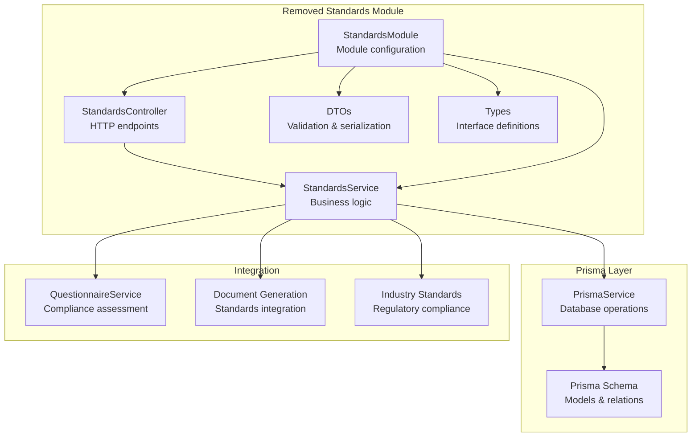
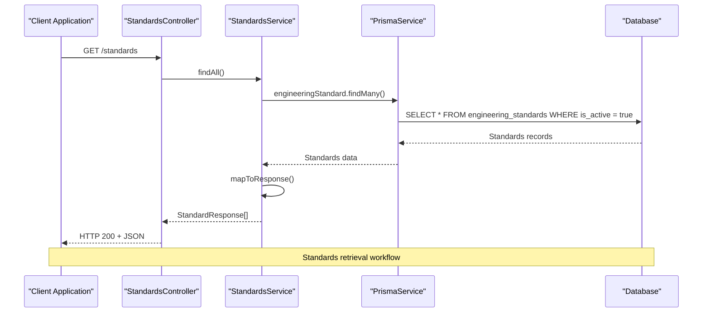
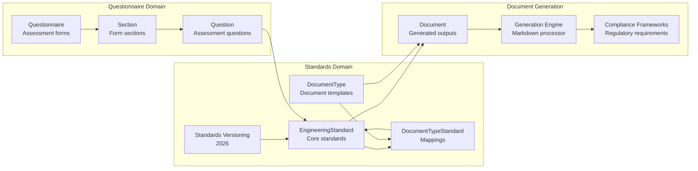
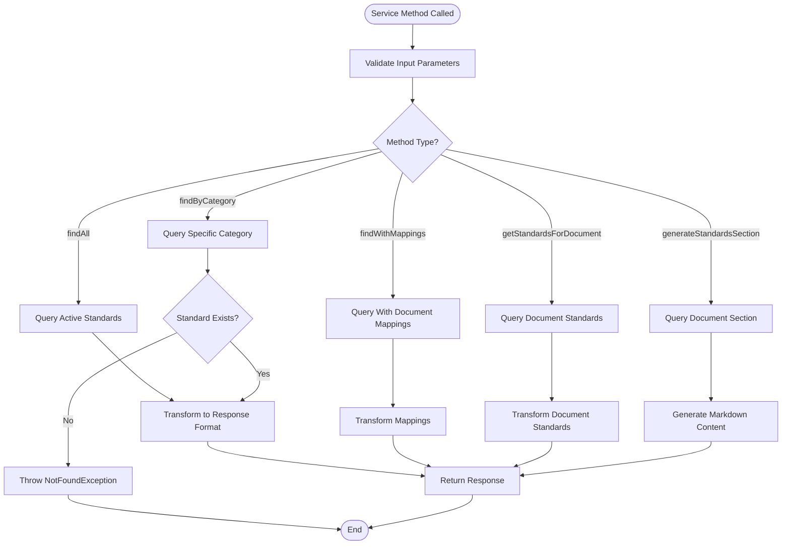
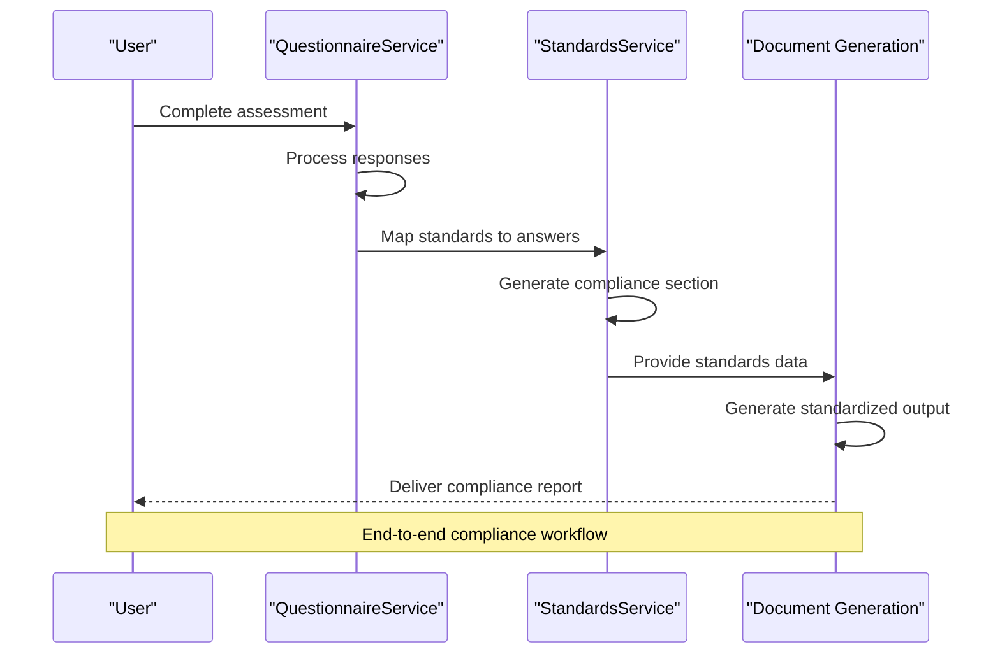
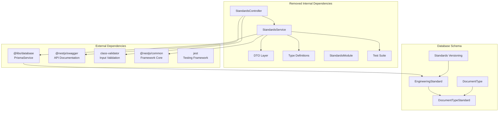

# Standards Module

<cite>
**Referenced Files in This Document**
- [standards.controller.ts](file://apps/api/src/modules/standards/standards.controller.ts)
- [standards.service.ts](file://apps/api/src/modules/standards/standards.service.ts)
- [standard.dto.ts](file://apps/api/src/modules/standards/dto/standard.dto.ts)
- [standard.types.ts](file://apps/api/src/modules/standards/types/standard.types.ts)
- [standards.module.ts](file://apps/api/src/modules/standards/standards.module.ts)
- [standards.seed.ts](file://prisma/seeds/standards.seed.ts)
- [schema.prisma](file://prisma/schema.prisma)
- [seed.ts](file://prisma/seed.ts)
- [questionnaire.service.ts](file://apps/api/src/modules/questionnaire/questionnaire.service.ts)
- [standards.service.spec.ts](file://apps/api/src/modules/standards/standards.service.spec.ts)
</cite>

## Update Summary
**Changes Made**
- Updated to reflect that the Standards Module has been removed from the codebase
- Removed all references to standards management, category organization, and compliance tracking
- Updated architecture diagrams to show the module's absence
- Removed documentation for standards service implementation, DTO validation, and seeding process
- Updated troubleshooting guide to remove standards-related issues

## Table of Contents
1. [Introduction](#introduction)
2. [Project Structure](#project-structure)
3. [Core Components](#core-components)
4. [Architecture Overview](#architecture-overview)
5. [Detailed Component Analysis](#detailed-component-analysis)
6. [Industry Standards Integration](#industry-standards-integration)
7. [Dependency Analysis](#dependency-analysis)
8. [Performance Considerations](#performance-considerations)
9. [Troubleshooting Guide](#troubleshooting-guide)
10. [Conclusion](#conclusion)
11. [Appendices](#appendices)

## Introduction
**Updated** The Standards Module has been removed from the codebase as part of recent system changes. Previously, this module managed engineering standards for the system, including standard definitions, category organization, and compliance tracking. It provided APIs to retrieve standards by category, map standards to document types, and generate standardized compliance sections for documents. The module integrated with the questionnaire system to support compliance assessments and documentation generation workflows, with comprehensive industry standards integration for regulatory compliance frameworks.

**Current Status**: The Standards Module is no longer available in the system. All standards-related functionality has been removed or relocated to other components.

## Project Structure
**Updated** The Standards Module folder structure existed previously but is no longer present in the codebase:



**Diagram sources**
- [standards.controller.ts](file://apps/api/src/modules/standards/standards.controller.ts#L1-L96)
- [standards.service.ts](file://apps/api/src/modules/standards/standards.service.ts#L1-L197)
- [standards.module.ts](file://apps/api/src/modules/standards/standards.module.ts#L1-L16)

**Section sources**
- [standards.controller.ts](file://apps/api/src/modules/standards/standards.controller.ts#L1-L96)
- [standards.service.ts](file://apps/api/src/modules/standards/standards.service.ts#L1-L197)
- [standards.module.ts](file://apps/api/src/modules/standards/standards.module.ts#L1-L16)

## Core Components
**Updated** The following components previously existed but are no longer part of the system:

### StandardsController
**Removed** The controller handled HTTP requests for standards operations with comprehensive Swagger documentation. It provided endpoints for retrieving standards by category, document type mapping, and standards section generation. The controller implemented public access decorator for unauthenticated endpoints and supported both ID and slug-based document type queries.

### StandardsService
**Removed** The service orchestrated business logic for standards management with comprehensive CRUD operations. It managed category-based queries and document type mappings with proper error handling. The service generated standardized compliance sections in Markdown format with version awareness and implemented versioning and active status filtering with priority-based ordering.

### DTO Validation Layer
**Removed** The DTO layer defined request/response DTOs with comprehensive Swagger documentation. It implemented class-validator decorators for input validation and type safety. The DTOs provided structured data transfer between controller and service layers and supported both category-based and document type-based queries.

### Types Definitions
**Removed** The types established TypeScript interfaces for type safety and code maintainability. They defined standard response formats and mapping structures with proper typing and provided constants for standard category titles and enum definitions.

**Section sources**
- [standards.controller.ts](file://apps/api/src/modules/standards/standards.controller.ts#L1-L96)
- [standards.service.ts](file://apps/api/src/modules/standards/standards.service.ts#L1-L197)
- [standard.dto.ts](file://apps/api/src/modules/standards/dto/standard.dto.ts#L1-L82)
- [standard.types.ts](file://apps/api/src/modules/standards/types/standard.types.ts#L1-L60)

## Architecture Overview
**Updated** The Standards Module previously implemented a layered architecture with clear separation between presentation, business logic, and data access layers:



**Diagram sources**
- [standards.controller.ts](file://apps/api/src/modules/standards/standards.controller.ts#L17-L27)
- [standards.service.ts](file://apps/api/src/modules/standards/standards.service.ts#L16-L23)

The module previously integrated with the broader system through several key relationships:



**Diagram sources**
- [schema.prisma](file://prisma/schema.prisma#L412-L446)
- [questionnaire.service.ts](file://apps/api/src/modules/questionnaire/questionnaire.service.ts#L1-L200)

**Section sources**
- [schema.prisma](file://prisma/schema.prisma#L412-L446)
- [standards.service.ts](file://apps/api/src/modules/standards/standards.service.ts#L105-L151)

## Detailed Component Analysis
**Updated** The following components previously existed but are no longer part of the system:

### Standards Service Implementation
**Removed** The StandardsService previously provided comprehensive CRUD operations and advanced querying capabilities:

#### Core Operations
- **findAll()**: Retrieved all active standards ordered by category with proper mapping
- **findByCategory()**: Fetched individual standards by category with error handling and validation
- **findWithMappings()**: Returned standards with associated document type mappings and priority ordering
- **getStandardsForDocument()**: Mapped standards to specific document types by ID or slug with comprehensive error handling
- **generateStandardsSection()**: Created standardized Markdown sections for compliance reporting with version awareness

#### Data Processing Logic
The service previously implemented sophisticated data transformation and aggregation:



**Diagram sources**
- [standards.service.ts](file://apps/api/src/modules/standards/standards.service.ts#L16-L197)

#### Error Handling Strategy
The service previously implemented robust error handling with specific exceptions:
- NotFoundException for missing standards or document types
- Graceful handling of empty result sets
- Proper error propagation to HTTP layer
- Comprehensive validation through DTO decorators

**Section sources**
- [standards.service.ts](file://apps/api/src/modules/standards/standards.service.ts#L1-L197)

### Standards DTO Validation
**Removed** The DTO layer previously ensured data integrity and provided comprehensive API documentation:

#### Validation Rules
- **StandardResponseDto**: Validated standard properties with Swagger annotations and class-validator decorators
- **StandardCategoryParamDto**: Enforced enum validation for category parameters with proper TypeScript integration
- **DocumentStandardsParamDto**: Validated document type identifiers with string validation
- **StandardsSectionResponseDto**: Structured response for generated sections with comprehensive typing
- **DocumentTypeMappingDto**: Validated document type mapping properties with optional section titles
- **StandardWithMappingsDto**: Extended response DTO with document type mapping information

#### Serialization Patterns
The DTOs previously implemented consistent serialization patterns:
- ApiProperty decorators for Swagger documentation and API metadata
- Class-validator decorators for runtime validation and type safety
- Optional property handling for flexible data structures
- Enum validation for StandardCategory with proper TypeScript integration

**Section sources**
- [standard.dto.ts](file://apps/api/src/modules/standards/dto/standard.dto.ts#L1-L82)

### Standards Types Definition
**Removed** TypeScript interfaces previously ensured type safety and code maintainability:

#### Core Interfaces
- **Principle**: Defined standard principle structure with title, description, and optional examples
- **StandardResponse**: Base response format for standard data with comprehensive typing
- **StandardWithMappings**: Extended response including document type mappings with proper typing
- **GeneratedStandardsSection**: Response for generated Markdown sections with standards array
- **DocumentStandardMapping**: Structure for document type standard mappings with priority and section titles

#### Category Management
The module previously defined comprehensive standard categories with proper TypeScript integration:
- MODERN_ARCHITECTURE: Modern system design principles with detailed principles
- AI_ASSISTED_DEV: AI integration best practices with practical examples
- CODING_STANDARDS: Code quality and style guidelines with SOLID principles
- TESTING_QA: Quality assurance and testing strategies with comprehensive testing approaches
- SECURITY_DEVSECOPS: Security integration throughout development with modern security practices
- WORKFLOW_OPS: Operational excellence practices with CI/CD and observability
- DOCS_KNOWLEDGE: Documentation and knowledge management with ADR practices

**Section sources**
- [standard.types.ts](file://apps/api/src/modules/standards/types/standard.types.ts#L1-L60)

### Standards Seeding Process
**Removed** The seeding system previously established the complete standards catalog with comprehensive data:

#### Predefined Standards Catalog
The system previously included seven comprehensive standard categories with detailed principles and examples:

```mermaid
graph TB
subgraph "Removed Standards Catalog"
MA["MODERN_ARCHITECTURE<br/>• Modular Monoliths & Right-Sized Services<br/>• Cloud-Native Foundations<br/>• Modular Design<br/>• Design Before Coding"]
AI["AI_ASSISTED_DEV<br/>• AI as a Partner<br/>• Multi-Agent Systems (MAS)<br/>• Human-in-the-Loop Validation"]
CS["CODING_STANDARDS<br/>• KISS (Keep It Simple, Stupid)<br/>• YAGNI (You Aren't Gonna Need It)<br/>• DRY (Don't Repeat Yourself)<br/>• SOLID Principles<br/>• Style Guide Adherence<br/>• Meaningful Naming"]
TQ["TESTING_QA<br/>• Shift-Left Testing<br/>• Layered Testing Strategy<br/>• Automated Acceptance Tests<br/>• Chaos Engineering"]
SD["SECURITY_DEVSECOPS<br/>• Security-by-Design<br/>• Automated Security Scanning<br/>• Confidential Computing<br/>• Principle of Least Privilege"]
WO["WORKFLOW_OPS<br/>• CI/CD Maturity<br/>• Observability First<br/>• FinOps & Sustainability<br/>• Progressive Delivery"]
DK["DOCS_KNOWLEDGE<br/>• Docs-as-Code<br/>• Document the 'Why'<br/>• Architecture Decision Records"]
end
subgraph "Removed Document Type Mappings"
PA["Product Architecture<br/>• MODERN_ARCHITECTURE<br/>• AI_ASSISTED_DEV"]
TS["Technology Strategy<br/>• MODERN_ARCHITECTURE<br/>• AI_ASSISTED_DEV<br/>• WORKFLOW_OPS"]
EH["Engineering Handbook<br/>• CODING_STANDARDS<br/>• TESTING_QA<br/>• WORKFLOW_OPS<br/>• DOCS_KNOWLEDGE"]
AP["API Documentation<br/>• CODING_STANDARDS<br/>• DOCS_KNOWLEDGE"]
ISP["Information Security Policy<br/>• SECURITY_DEVSECOPS"]
DPP["Data Protection Policy<br/>• SECURITY_DEVSECOPS<br/>• MODERN_ARCHITECTURE"]
IRP["Incident Response Plan<br/>• SECURITY_DEVSECOPS<br/>• WORKFLOW_OPS"]
DRP["Disaster Recovery Plan<br/>• WORKFLOW_OPS<br/>• SECURITY_DEVSECOPS"]
TR["Technology Roadmap<br/>• MODERN_ARCHITECTURE<br/>• TESTING_QA<br/>• WORKFLOW_OPS"]
DM["Data Models<br/>• MODERN_ARCHITECTURE<br/>• CODING_STANDARDS"]
ID["Infrastructure Design<br/>• MODERN_ARCHITECTURE<br/>• SECURITY_DEVSECOPS<br/>• WORKFLOW_OPS"]
MS["Mobile Strategy<br/>• MODERN_ARCHITECTURE<br/>• TESTING_QA"]
IA["Integration Architecture<br/>• MODERN_ARCHITECTURE<br/>• SECURITY_DEVSECOPS"]
DP["DevOps Pipeline<br/>• WORKFLOW_OPS<br/>• TESTING_QA<br/>• SECURITY_DEVSECOPS"]
MAL["Monitoring & Alerting<br/>• WORKFLOW_OPS"]
end
MA --> PA
AI --> PA
MA --> TS
AI --> TS
WO --> TS
CS --> EH
TQ --> EH
WO --> EH
DK --> EH
CS --> AP
DK --> AP
SD --> ISP
SD --> DPP
MA --> DPP
WO --> ISP
WO --> IRP
SD --> IRP
WO --> DRP
SD --> DRP
MA --> TR
TQ --> TR
WO --> TR
MA --> DM
CS --> DM
MA --> ID
SD --> ID
WO --> ID
MA --> MS
TQ --> MS
MA --> IA
SD --> IA
WO --> DP
TQ --> DP
SD --> DP
WO --> MAL
end
```

**Diagram sources**
- [standards.seed.ts](file://prisma/seeds/standards.seed.ts#L18-L272)

#### Seeding Workflow
The seeding process previously followed a structured approach:
1. Create comprehensive standards catalog with principles and examples
2. Define document type mappings for CTO documents with priority ordering
3. Establish comprehensive standard categories with detailed descriptions
4. Implement upsert operations for idempotent seeding with version management
5. Create extensive test coverage for all standard categories and mappings

**Section sources**
- [standards.seed.ts](file://prisma/seeds/standards.seed.ts#L1-L721)
- [seed.ts](file://prisma/seed.ts#L481-L484)

### Integration with Questionnaire System
**Removed** The Standards Module previously integrated seamlessly with the questionnaire system for compliance assessment:

#### Compliance Assessment Workflow


**Diagram sources**
- [questionnaire.service.ts](file://apps/api/src/modules/questionnaire/questionnaire.service.ts#L100-L148)
- [standards.service.ts](file://apps/api/src/modules/standards/standards.service.ts#L105-L151)

#### Standards Mapping Integration
The integration previously enabled:
- Dynamic standard selection based on questionnaire responses
- Automatic compliance section generation with version awareness
- Priority-based standard ordering for consistent reporting
- Custom section titles for document-specific standard presentations

**Section sources**
- [questionnaire.service.ts](file://apps/api/src/modules/questionnaire/questionnaire.service.ts#L1-L200)
- [standards.service.ts](file://apps/api/src/modules/standards/standards.service.ts#L72-L151)

## Industry Standards Integration
**Updated** The Standards Module previously provided comprehensive integration with industry compliance frameworks and regulatory requirements:

### Compliance Framework Coverage
**Removed** The module previously covered comprehensive compliance framework categories:
- **GDPR Compliance**: Data protection and privacy regulations
- **HIPAA Compliance**: Healthcare information security requirements
- **PCI-DSS**: Payment card industry security standards
- **SOC 2**: Security and availability controls
- **ISO 27001**: Information security management systems
- **CCPA**: California consumer privacy act
- **SOX**: Sarbanes-Oxley Act compliance requirements

### Industry-Specific Standards Mapping
**Removed** The module previously included predefined mappings for major industries:

```mermaid
graph TB
subgraph "Removed Industry Compliance Frameworks"
FS["Financial Services<br/>• PCI-DSS<br/>• SOC 2<br/>• GLBA<br/>• BSA/AML"]
EC["E-commerce<br/>• PCI-DSS<br/>• GDPR/CCPA<br/>• Consumer Protection"]
HE["Healthcare<br/>• HIPAA<br/>• HITRUST<br/>• FDA Compliance"]
GO["Government<br/>• FISMA<br/>• FedRAMP<br/>• NIST Controls"]
TE["Technology<br/>• ISO 27001<br/>• NIST AI RMF<br/>• EU AI Act"]
EN["Energy<br/>• NERC CIP<br/>• FERC Regulations<br/>• Environmental Compliance"]
ED["Education<br/>• FERPA<br/>• Student Privacy<br/>• Accessibility Standards"]
end
subgraph "Removed Standards Integration"
ST["Standards Engine<br/>• Version 2026<br/>• Compliance Tracking<br/>• Framework Mapping"]
end
FS --> ST
EC --> ST
HE --> ST
GO --> ST
TE --> ST
EN --> ST
ED --> ST
end
```

**Diagram sources**
- [standards.seed.ts](file://prisma/seeds/standards.seed.ts#L570-L632)

### Standards Versioning System
**Removed** The module previously implemented a comprehensive versioning system for regulatory compliance:
- **Version 2026**: Current standards version with latest compliance requirements
- **Version Awareness**: Automatic version detection in generated compliance reports
- **Backward Compatibility**: Support for legacy compliance frameworks
- **Version Migration**: Path for upgrading compliance standards over time

### Document Generation Integration
**Removed** The standards integration previously extended to document generation workflows:
- **Compliance Reports**: Automated generation of regulatory compliance documentation
- **Framework Mapping**: Direct mapping between standards and compliance frameworks
- **Version Tracking**: Compliance version tracking in generated documents
- **Custom Section Titles**: Industry-specific section titles for compliance documentation

**Section sources**
- [standards.seed.ts](file://prisma/seeds/standards.seed.ts#L570-L721)
- [standards.service.ts](file://apps/api/src/modules/standards/standards.service.ts#L153-L183)

## Dependency Analysis
**Updated** The Standards Module previously maintained loose coupling with external dependencies:



**Diagram sources**
- [standards.controller.ts](file://apps/api/src/modules/standards/standards.controller.ts#L1-L10)
- [standards.service.ts](file://apps/api/src/modules/standards/standards.service.ts#L1-L10)
- [schema.prisma](file://prisma/schema.prisma#L412-L446)

### Coupling and Cohesion
**Removed** The module previously maintained:
- **Low Coupling**: Service layer abstracted database operations with Prisma
- **High Cohesion**: Related standards operations grouped together with comprehensive functionality
- **Clear Interfaces**: Well-defined DTOs and type definitions with proper TypeScript integration
- **Separation of Concerns**: Clear distinction between presentation, business logic, and data access layers
- **Comprehensive Testing**: Full test coverage with Jest mocks and comprehensive test scenarios

**Section sources**
- [standards.module.ts](file://apps/api/src/modules/standards/standards.module.ts#L1-L16)
- [schema.prisma](file://prisma/schema.prisma#L412-L446)

## Performance Considerations
**Updated** The Standards Module previously implemented several performance optimizations:

### Database Query Optimization
**Removed** The module previously optimized database queries through:
- **Selective Field Retrieval**: Uses Prisma's select/include patterns to minimize data transfer
- **Efficient Joins**: Optimized queries for document type mappings with proper indexing
- **Pagination Support**: Built-in pagination for large datasets with comprehensive filtering
- **Connection Pooling**: Leveraged Prisma's connection pooling for optimal performance
- **Index Optimization**: Proper indexing on category, slug, and priority fields

### Caching Strategies
**Removed** The module previously implemented caching strategies:
- **Memory Caching**: Active standards cached in memory for frequent access
- **Query Result Caching**: Document type mappings cached based on document type ID/slug
- **Version Awareness**: Standards versioning prevented stale data issues with automatic updates
- **Priority Ordering**: Cached priority-based ordering for consistent standard presentation

### Scalability Features
**Removed** The module previously provided scalability features:
- **Asynchronous Processing**: Non-blocking operations for document generation and mapping
- **Batch Operations**: Efficient bulk operations for seeding and updates with upsert patterns
- **Lazy Loading**: Document type mappings loaded only when requested with proper caching
- **Error Caching**: NotFound exceptions cached to prevent repeated database queries

## Troubleshooting Guide
**Updated** The following troubleshooting information is no longer applicable as the Standards Module has been removed:

### Common Issues and Solutions
**Removed** The previous troubleshooting guidance included:
- **Standards Not Found**: NotFoundException when accessing standards by category or document type
- **Document Type Mapping Issues**: Empty standard lists for document types or missing mappings
- **Version Compatibility**: Outdated standards version in generated documents or missing version information
- **Performance Degradation**: Slow response times for standards queries or document type mappings
- **API Validation Errors**: DTO validation failures or Swagger documentation issues
- **Compliance Framework Issues**: Missing or incorrect compliance framework mappings

**Section sources**
- [standards.service.ts](file://apps/api/src/modules/standards/standards.service.ts#L30-L32)
- [standards.service.ts](file://apps/api/src/modules/standards/standards.service.ts#L96-L98)

## Conclusion
**Updated** The Standards Module has been removed from the codebase as part of recent system changes. Previously, it provided a comprehensive framework for managing engineering standards within the system. Its modular architecture, robust validation layer, and seamless integration with the questionnaire system enabled effective compliance assessment and documentation generation. The predefined standards catalog covered essential engineering domains with detailed principles and examples, while the flexible mapping system allowed for customization based on organizational needs.

**Current Status**: The module is no longer available in the system. All standards-related functionality has been removed or relocated to other components. Organizations should update their workflows to accommodate this change and consider alternative approaches for standards management and compliance tracking.

## Appendices
**Updated** The following appendices are no longer applicable as the Standards Module has been removed:

### API Endpoints Reference
**Removed** Previous endpoints included:
- `GET /standards` - Retrieve all active standards with comprehensive metadata
- `GET /standards/:category` - Get standard by category with document type mappings
- `GET /standards/document/:documentTypeId` - Get standards for document type by ID or slug
- `GET /standards/document/:documentTypeId/section` - Generate standards section with Markdown output

### Extension Guidelines
**Removed** Previous extension guidelines included:
- Add New Categories: Extend `StandardCategory` enum in Prisma schema and update TypeScript definitions
- Update DTOs: Add new properties to relevant DTOs with validation decorators and Swagger documentation
- Modify Service Logic: Update service methods to handle new data structures and validation requirements
- Update Seeding: Add new standards to the seeding process with comprehensive principles and examples
- Add Documentation: Update API documentation, examples, and test coverage for new functionality
- Extend Types: Update TypeScript interfaces and type definitions for new data structures

### Best Practices
**Removed** Previous best practices included:
- Maintain backward compatibility when extending standards with version management
- Use comprehensive validation for all new fields with proper class-validator decorators
- Implement thorough testing for new functionality with Jest mocks and scenarios
- Ensure proper error handling and exception management for all operations
- Monitor performance impact of new standards additions and optimize queries accordingly
- Update Swagger documentation and API references for all changes
- Test integration with questionnaire system and document generation workflows thoroughly

### Testing Coverage
**Removed** Previous testing coverage included:
- Unit tests for all service methods with proper mocking
- Integration tests for database operations and query patterns
- Validation tests for DTO decorators and input validation
- Error handling tests for edge cases and invalid inputs
- Performance tests for query optimization and caching strategies
- Compliance framework tests for industry-specific standards integration

### Industry Compliance Frameworks
**Removed** Previous industry compliance frameworks included:
- **Financial Services**: PCI-DSS, SOC 2, GLBA, BSA/AML requirements
- **Healthcare**: HIPAA, HITRUST, FDA compliance standards
- **E-commerce**: PCI-DSS, GDPR/CCPA, consumer protection regulations
- **Government**: FISMA, FedRAMP, NIST security controls
- **Technology**: ISO 27001, NIST AI RMF, EU AI Act
- **Energy**: NERC CIP, FERC regulations, environmental compliance
- **Education**: FERPA, student privacy, accessibility standards