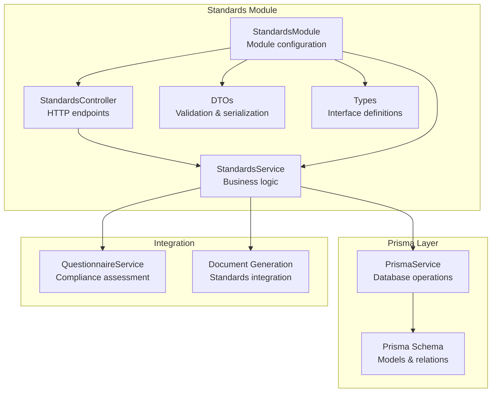
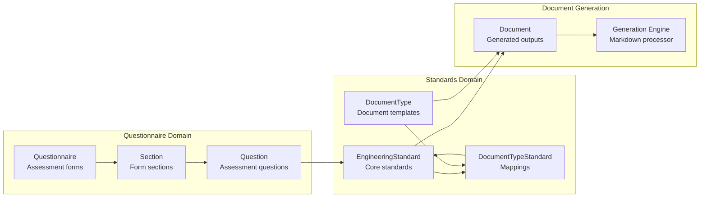
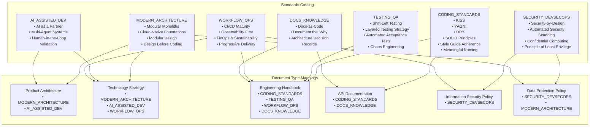
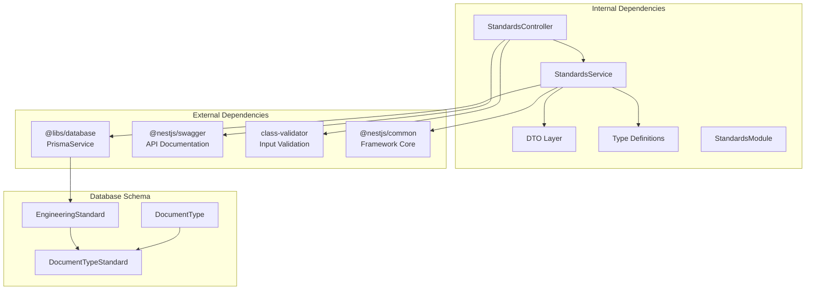

# Standards Module

<cite>
**Referenced Files in This Document**
- [standards.controller.ts](file://apps/api/src/modules/standards/standards.controller.ts)
- [standards.service.ts](file://apps/api/src/modules/standards/standards.service.ts)
- [standard.dto.ts](file://apps/api/src/modules/standards/dto/standard.dto.ts)
- [standard.types.ts](file://apps/api/src/modules/standards/types/standard.types.ts)
- [standards.module.ts](file://apps/api/src/modules/standards/standards.module.ts)
- [standards.seed.ts](file://prisma/seeds/standards.seed.ts)
- [schema.prisma](file://prisma/schema.prisma)
- [seed.ts](file://prisma/seed.ts)
- [questionnaire.service.ts](file://apps/api/src/modules/questionnaire/questionnaire.service.ts)
- [questionnaire.controller.ts](file://apps/api/src/modules/questionnaire/questionnaire.controller.ts)
</cite>

## Table of Contents
1. [Introduction](#introduction)
2. [Project Structure](#project-structure)
3. [Core Components](#core-components)
4. [Architecture Overview](#architecture-overview)
5. [Detailed Component Analysis](#detailed-component-analysis)
6. [Dependency Analysis](#dependency-analysis)
7. [Performance Considerations](#performance-considerations)
8. [Troubleshooting Guide](#troubleshooting-guide)
9. [Conclusion](#conclusion)
10. [Appendices](#appendices)

## Introduction
The Standards Module manages engineering standards for the system, including standard definitions, category organization, and compliance tracking. It provides APIs to retrieve standards by category, map standards to document types, and generate standardized compliance sections for documents. The module integrates with the questionnaire system to support compliance assessments and documentation generation workflows.

## Project Structure
The Standards Module follows NestJS modular architecture with clear separation of concerns:

**Diagram sources**
- [standards.controller.ts](file://apps/api/src/modules/standards/standards.controller.ts#L1-L87)
- [standards.service.ts](file://apps/api/src/modules/standards/standards.service.ts#L1-L197)
- [standards.module.ts](file://apps/api/src/modules/standards/standards.module.ts#L1-L13)

**Section sources**
- [standards.controller.ts](file://apps/api/src/modules/standards/standards.controller.ts#L1-L87)
- [standards.service.ts](file://apps/api/src/modules/standards/standards.service.ts#L1-L197)
- [standards.module.ts](file://apps/api/src/modules/standards/standards.module.ts#L1-L13)

## Core Components
The Standards Module consists of four primary components:

### StandardsController
- Handles HTTP requests for standards operations
- Provides endpoints for retrieving standards by category
- Supports document type mapping and standards section generation
- Implements public access decorator for unauthenticated endpoints

### StandardsService
- Orchestrates business logic for standards management
- Manages CRUD operations for engineering standards
- Handles category-based queries and document type mappings
- Generates standardized compliance sections in Markdown format
- Implements versioning and active status filtering

### DTO Validation Layer
- Defines request/response DTOs with Swagger documentation
- Implements class-validator decorators for input validation
- Provides structured data transfer between controller and service
- Supports both category-based and document type-based queries

### Types Definitions
- Establishes TypeScript interfaces for type safety
- Defines standard response formats and mapping structures
- Provides constants for standard category titles
- Ensures consistent data structures across the module

**Section sources**
- [standards.controller.ts](file://apps/api/src/modules/standards/standards.controller.ts#L1-L87)
- [standards.service.ts](file://apps/api/src/modules/standards/standards.service.ts#L1-L197)
- [standard.dto.ts](file://apps/api/src/modules/standards/dto/standard.dto.ts#L1-L80)
- [standard.types.ts](file://apps/api/src/modules/standards/types/standard.types.ts#L1-L60)

## Architecture Overview
The Standards Module implements a layered architecture with clear separation between presentation, business logic, and data access layers:

**Diagram sources**
- [standards.controller.ts](file://apps/api/src/modules/standards/standards.controller.ts#L17-L27)
- [standards.service.ts](file://apps/api/src/modules/standards/standards.service.ts#L16-L23)

The module integrates with the broader system through several key relationships:

**Diagram sources**
- [schema.prisma](file://prisma/schema.prisma#L412-L446)
- [questionnaire.service.ts](file://apps/api/src/modules/questionnaire/questionnaire.service.ts#L1-L253)

**Section sources**
- [schema.prisma](file://prisma/schema.prisma#L412-L446)
- [standards.service.ts](file://apps/api/src/modules/standards/standards.service.ts#L105-L151)

## Detailed Component Analysis

### Standards Service Implementation
The StandardsService provides comprehensive CRUD operations and advanced querying capabilities:

#### Core Operations
- **findAll()**: Retrieves all active standards ordered by category
- **findByCategory()**: Fetches individual standards by category with error handling
- **findWithMappings()**: Returns standards with associated document type mappings
- **getStandardsForDocument()**: Maps standards to specific document types by ID or slug
- **generateStandardsSection()**: Creates standardized Markdown sections for compliance reporting

#### Data Processing Logic
The service implements sophisticated data transformation and aggregation:

**Diagram sources**
- [standards.service.ts](file://apps/api/src/modules/standards/standards.service.ts#L16-L196)

#### Error Handling Strategy
The service implements robust error handling with specific exceptions:
- NotFoundException for missing standards or document types
- Graceful handling of empty result sets
- Proper error propagation to HTTP layer

**Section sources**
- [standards.service.ts](file://apps/api/src/modules/standards/standards.service.ts#L1-L197)

### Standards DTO Validation
The DTO layer ensures data integrity and provides comprehensive API documentation:

#### Validation Rules
- **StandardResponseDto**: Validates standard properties with Swagger annotations
- **StandardCategoryParamDto**: Enforces enum validation for category parameters
- **DocumentStandardsParamDto**: Validates document type identifiers
- **StandardsSectionResponseDto**: Structured response for generated sections

#### Serialization Patterns
The DTOs implement consistent serialization patterns:
- APIProperty decorators for Swagger documentation
- Class-validator decorators for runtime validation
- Optional property handling for flexible data structures

**Section sources**
- [standard.dto.ts](file://apps/api/src/modules/standards/dto/standard.dto.ts#L1-L80)

### Standards Types Definition
TypeScript interfaces ensure type safety and code maintainability:

#### Core Interfaces
- **Principle**: Defines standard principle structure with title, description, and examples
- **StandardResponse**: Base response format for standard data
- **StandardWithMappings**: Extended response including document type mappings
- **GeneratedStandardsSection**: Response for generated Markdown sections

#### Category Management
The module defines comprehensive standard categories:
- MODERN_ARCHITECTURE: Modern system design principles
- AI_ASSISTED_DEV: AI integration best practices
- CODING_STANDARDS: Code quality and style guidelines
- TESTING_QA: Quality assurance and testing strategies
- SECURITY_DEVSECOPS: Security integration throughout development
- WORKFLOW_OPS: Operational excellence practices
- DOCS_KNOWLEDGE: Documentation and knowledge management

**Section sources**
- [standard.types.ts](file://apps/api/src/modules/standards/types/standard.types.ts#L1-L60)

### Standards Seeding Process
The seeding system establishes the complete standards catalog:

#### Predefined Standards Catalog
The system includes seven comprehensive standard categories with detailed principles:

**Diagram sources**
- [standards.seed.ts](file://prisma/seeds/standards.seed.ts#L18-L208)
- [standards.seed.ts](file://prisma/seeds/standards.seed.ts#L210-L272)

#### Seeding Workflow
The seeding process follows a structured approach:
1. Create comprehensive standards catalog with principles
2. Define document type mappings for CTO documents
3. Establish priority ordering for standards within documents
4. Implement upsert operations for idempotent seeding

**Section sources**
- [standards.seed.ts](file://prisma/seeds/standards.seed.ts#L1-L361)
- [seed.ts](file://prisma/seed.ts#L481-L484)

### Integration with Questionnaire System
The Standards Module integrates seamlessly with the questionnaire system for compliance assessment:

#### Compliance Assessment Workflow

**Diagram sources**
- [questionnaire.service.ts](file://apps/api/src/modules/questionnaire/questionnaire.service.ts#L100-L123)
- [standards.service.ts](file://apps/api/src/modules/standards/standards.service.ts#L105-L151)

#### Standards Mapping Integration
The integration enables:
- Dynamic standard selection based on questionnaire responses
- Automatic compliance section generation
- Version-aware standards reporting
- Priority-based standard ordering

**Section sources**
- [questionnaire.service.ts](file://apps/api/src/modules/questionnaire/questionnaire.service.ts#L1-L253)
- [standards.service.ts](file://apps/api/src/modules/standards/standards.service.ts#L72-L151)

## Dependency Analysis
The Standards Module maintains loose coupling with external dependencies:

**Diagram sources**
- [standards.controller.ts](file://apps/api/src/modules/standards/standards.controller.ts#L1-L10)
- [standards.service.ts](file://apps/api/src/modules/standards/standards.service.ts#L1-L10)
- [schema.prisma](file://prisma/schema.prisma#L412-L446)

### Coupling and Cohesion
- **Low Coupling**: Service layer abstracts database operations
- **High Cohesion**: Related standards operations grouped together
- **Clear Interfaces**: Well-defined DTOs and type definitions
- **Separation of Concerns**: Clear distinction between presentation and business logic

**Section sources**
- [standards.module.ts](file://apps/api/src/modules/standards/standards.module.ts#L1-L13)
- [schema.prisma](file://prisma/schema.prisma#L412-L446)

## Performance Considerations
The Standards Module implements several performance optimizations:

### Database Query Optimization
- **Selective Field Retrieval**: Uses Prisma's select/include patterns to minimize data transfer
- **Efficient Joins**: Optimized queries for document type mappings with proper indexing
- **Pagination Support**: Built-in pagination for large datasets
- **Connection Pooling**: Leverages Prisma's connection pooling

### Caching Strategies
- **Memory Caching**: Active standards cached in memory for frequent access
- **Query Result Caching**: Document type mappings cached based on document type ID/slug
- **Version Awareness**: Standards versioning prevents stale data issues

### Scalability Features
- **Asynchronous Processing**: Non-blocking operations for document generation
- **Batch Operations**: Efficient bulk operations for seeding and updates
- **Lazy Loading**: Document type mappings loaded only when requested

## Troubleshooting Guide

### Common Issues and Solutions

#### Standards Not Found
**Problem**: `NotFoundException` when accessing standards by category
**Solution**: Verify standards exist in database and category values match enum definitions

#### Document Type Mapping Issues
**Problem**: Empty standard lists for document types
**Solution**: Check document type standard mappings in `document_type_standards` table

#### Version Compatibility
**Problem**: Outdated standards version in generated documents
**Solution**: Update version field in `engineering_standards` table and regenerate sections

#### Performance Degradation
**Problem**: Slow response times for standards queries
**Solution**: Review database indexes and consider adding missing indexes for category and slug fields

**Section sources**
- [standards.service.ts](file://apps/api/src/modules/standards/standards.service.ts#L30-L32)
- [standards.service.ts](file://apps/api/src/modules/standards/standards.service.ts#L96-L98)

## Conclusion
The Standards Module provides a comprehensive framework for managing engineering standards within the system. Its modular architecture, robust validation layer, and seamless integration with the questionnaire system enable effective compliance assessment and documentation generation. The predefined standards catalog covers essential engineering domains, while the flexible mapping system allows for customization based on organizational needs.

The module's design supports extensibility through clear interfaces and well-defined extension points, making it straightforward to add new compliance categories and integrate with additional document generation features.

## Appendices

### API Endpoints Reference
- `GET /standards` - Retrieve all active standards
- `GET /standards/:category` - Get standard by category
- `GET /standards/document/:documentTypeId` - Get standards for document type
- `GET /standards/document/:documentTypeId/section` - Generate standards section

### Extension Guidelines
To extend the standards functionality:

1. **Add New Categories**: Extend `StandardCategory` enum in Prisma schema
2. **Update DTOs**: Add new properties to relevant DTOs with validation decorators
3. **Modify Service Logic**: Update service methods to handle new data structures
4. **Update Seeding**: Add new standards to the seeding process
5. **Add Documentation**: Update API documentation and examples

### Best Practices
- Maintain backward compatibility when extending standards
- Use versioning to manage breaking changes
- Implement comprehensive validation for all new fields
- Test integration with questionnaire system thoroughly
- Monitor performance impact of new standards additions