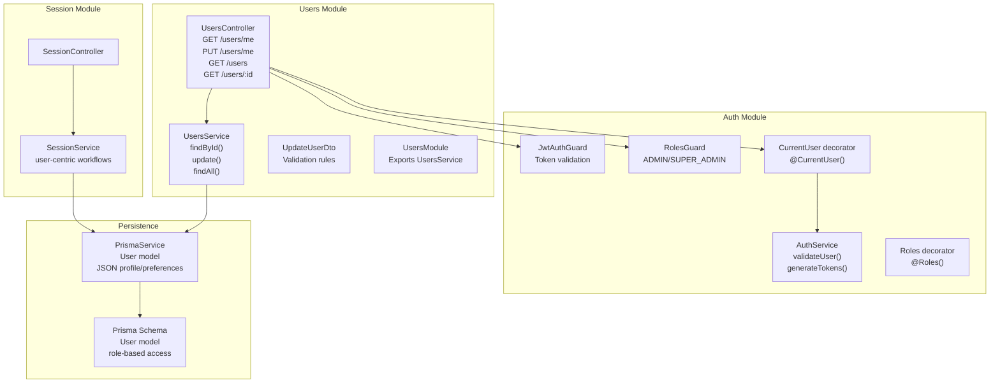
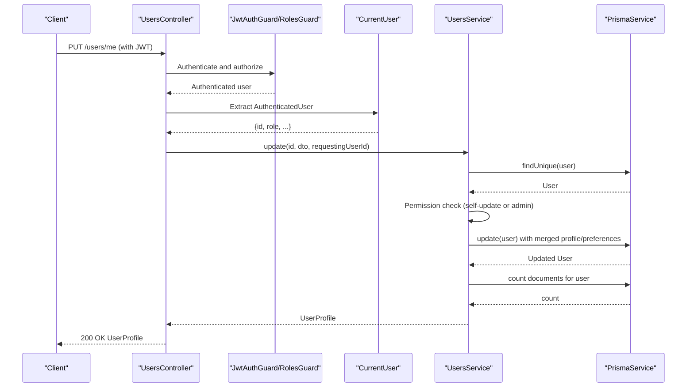
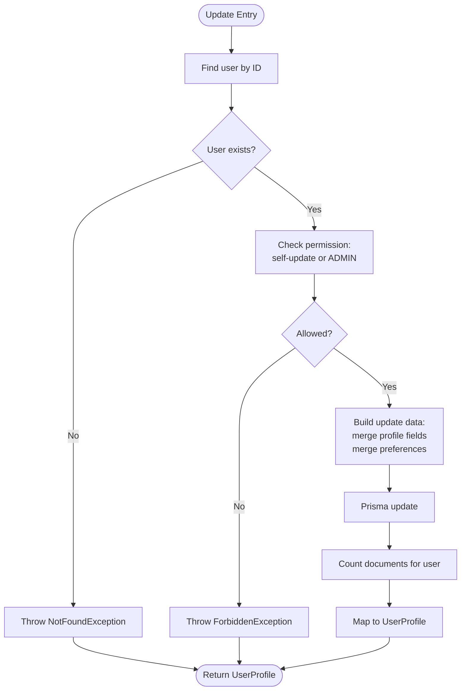
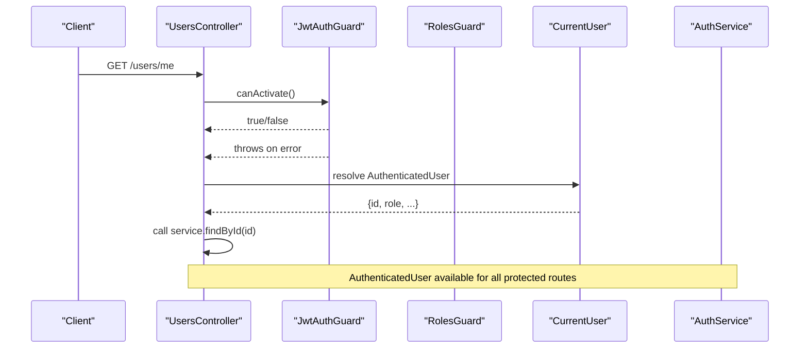
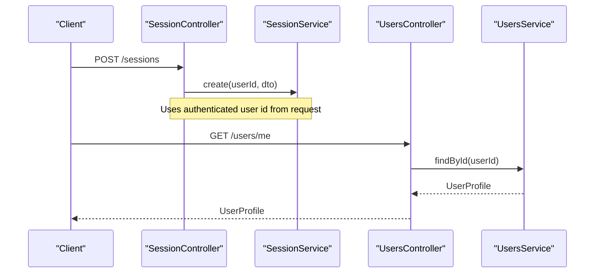
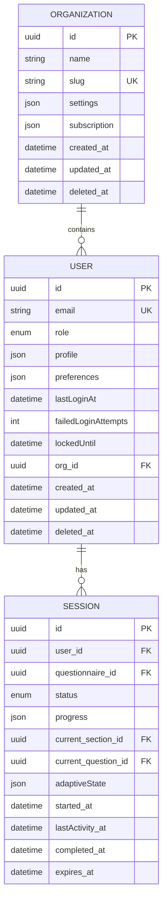
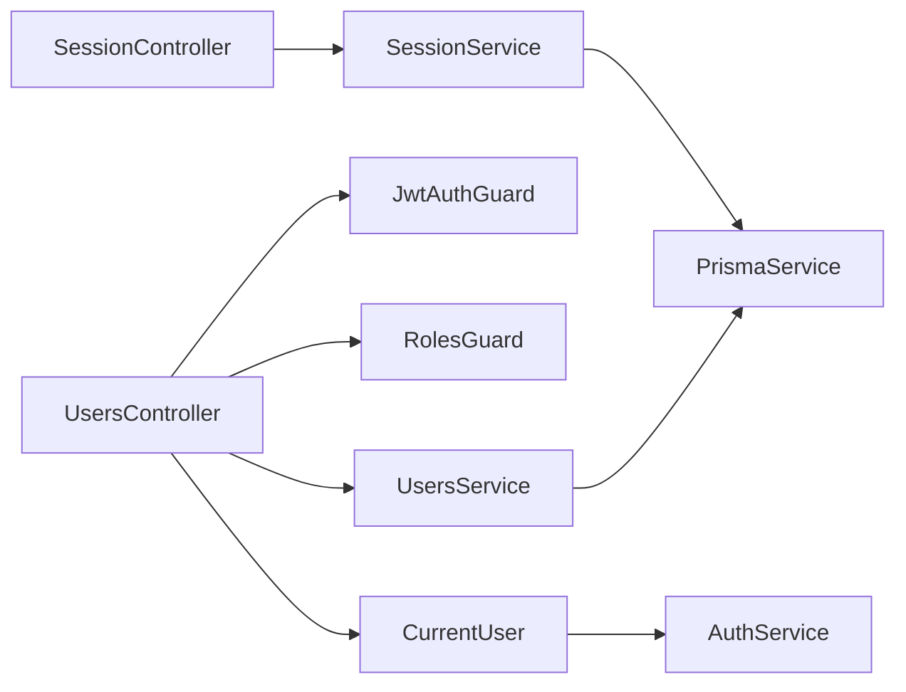
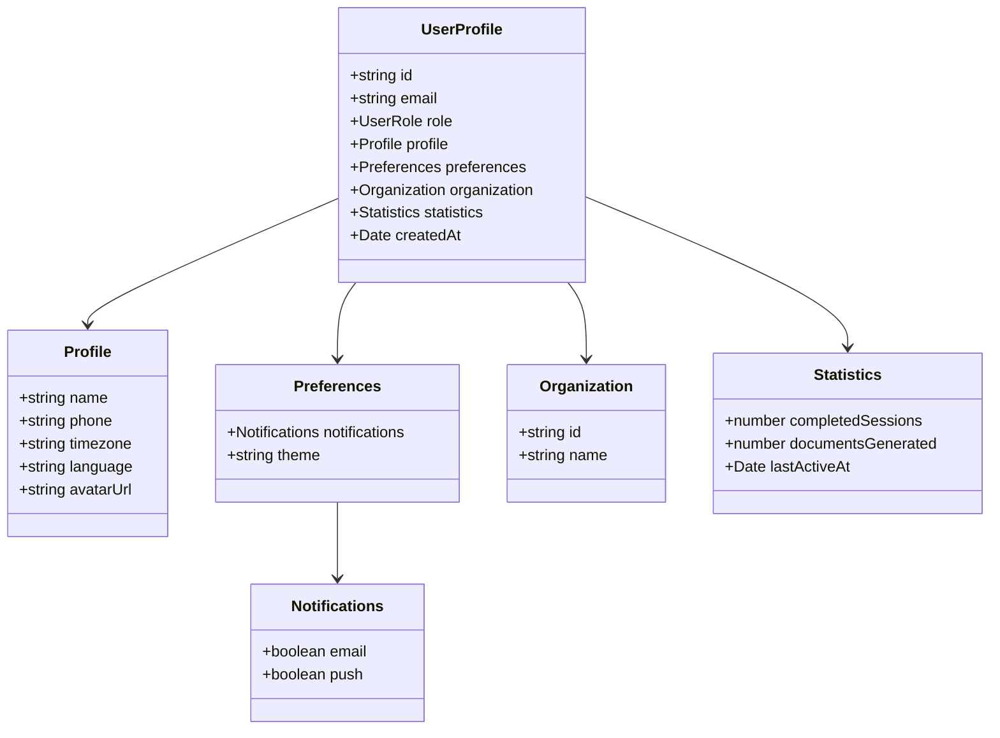
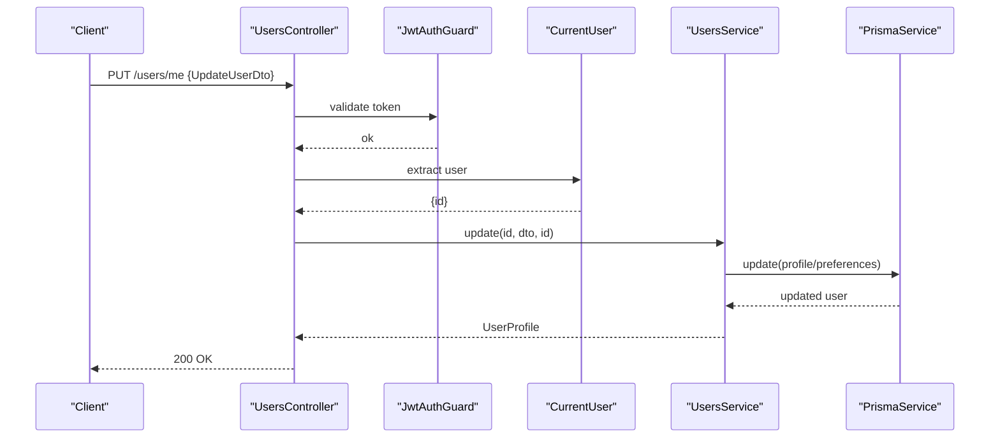
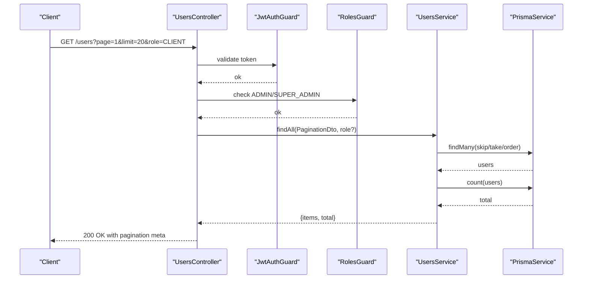

# User Management Module

<cite>
**Referenced Files in This Document**
- [users.service.ts](file://apps/api/src/modules/users/users.service.ts)
- [users.controller.ts](file://apps/api/src/modules/users/users.controller.ts)
- [update-user.dto.ts](file://apps/api/src/modules/users/dto/update-user.dto.ts)
- [users.module.ts](file://apps/api/src/modules/users/users.module.ts)
- [auth.service.ts](file://apps/api/src/modules/auth/auth.service.ts)
- [user.decorator.ts](file://apps/api/src/modules/auth/decorators/user.decorator.ts)
- [jwt-auth.guard.ts](file://apps/api/src/modules/auth/guards/jwt-auth.guard.ts)
- [roles.guard.ts](file://apps/api/src/modules/auth/guards/roles.guard.ts)
- [roles.decorator.ts](file://apps/api/src/modules/auth/decorators/roles.decorator.ts)
- [session.service.ts](file://apps/api/src/modules/session/session.service.ts)
- [session.controller.ts](file://apps/api/src/modules/session/session.controller.ts)
- [prisma.service.ts](file://libs/database/src/prisma.service.ts)
- [schema.prisma](file://prisma/schema.prisma)
- [pagination.dto.ts](file://libs/shared/src/dto/pagination.dto.ts)
- [response.dto.ts](file://libs/shared/src/dto/response.dto.ts)
- [users.service.spec.ts](file://apps/api/src/modules/users/users.service.spec.ts)
</cite>

## Update Summary
**Changes Made**
- Enhanced authentication integration with comprehensive JWT-based user context management
- Strengthened role-based access control with ADMIN and SUPER_ADMIN role enforcement
- Expanded user profile management with comprehensive profile and preferences handling
- Improved security controls with validated user context extraction and permission enforcement
- Enhanced session module integration for user-centric workflows
- Added comprehensive CRUD operations with full testing coverage
- Implemented advanced user statistics aggregation and document tracking

## Table of Contents
1. [Introduction](#introduction)
2. [Project Structure](#project-structure)
3. [Core Components](#core-components)
4. [Architecture Overview](#architecture-overview)
5. [Detailed Component Analysis](#detailed-component-analysis)
6. [Dependency Analysis](#dependency-analysis)
7. [Performance Considerations](#performance-considerations)
8. [Troubleshooting Guide](#troubleshooting-guide)
9. [Conclusion](#conclusion)
10. [Appendices](#appendices)

## Introduction
This document describes the User Management Module, focusing on comprehensive user CRUD operations, profile management, and user data handling across the system. The module has been enhanced with comprehensive authentication integration, role-based access control, and robust user profile management capabilities. It explains the user service implementation for user creation, updates, retrieval, and listing, along with validation and security controls. The module now provides enhanced integration with the authentication module for user context management and maintains strong relationships with session management for user-related workflows.

## Project Structure
The User Management Module is organized as a NestJS module with a controller, service, DTOs, and a module definition. It integrates seamlessly with the authentication module for user context and with the session module for user-related workflows. Data persistence is handled via Prisma with comprehensive user data modeling.

**Diagram sources**
- [users.controller.ts](file://apps/api/src/modules/users/users.controller.ts#L22-L77)
- [users.service.ts](file://apps/api/src/modules/users/users.service.ts#L37-L199)
- [update-user.dto.ts](file://apps/api/src/modules/users/dto/update-user.dto.ts#L4-L35)
- [users.module.ts](file://apps/api/src/modules/users/users.module.ts#L1-L11)
- [auth.service.ts](file://apps/api/src/modules/auth/auth.service.ts#L166-L190)
- [jwt-auth.guard.ts](file://apps/api/src/modules/auth/guards/jwt-auth.guard.ts#L6-L37)
- [roles.guard.ts](file://apps/api/src/modules/auth/guards/roles.guard.ts#L7-L38)
- [roles.decorator.ts](file://apps/api/src/modules/auth/decorators/roles.decorator.ts#L4-L6)
- [user.decorator.ts](file://apps/api/src/modules/auth/decorators/user.decorator.ts#L4-L15)
- [session.service.ts](file://apps/api/src/modules/session/session.service.ts#L87-L94)
- [prisma.service.ts](file://libs/database/src/prisma.service.ts#L4-L40)
- [schema.prisma](file://prisma/schema.prisma#L99-L131)

**Section sources**
- [users.controller.ts](file://apps/api/src/modules/users/users.controller.ts#L22-L77)
- [users.service.ts](file://apps/api/src/modules/users/users.service.ts#L37-L199)
- [users.module.ts](file://apps/api/src/modules/users/users.module.ts#L1-L11)
- [prisma.schema](file://prisma/schema.prisma#L99-L131)

## Core Components
- **UsersController**: Exposes endpoints for retrieving and updating the current user's profile, and for listing users (admin-only). Now includes comprehensive authentication guards and role-based access control.
- **UsersService**: Implements user retrieval, updates, and listing with enhanced permission checks, data aggregation, and comprehensive profile management.
- **UpdateUserDto**: Defines validation rules for partial user updates including profile fields (name, phone, timezone) and preferences (notifications, theme).
- **UsersModule**: Declares and exports the UsersService for use across the application.
- **Enhanced Authentication Integration**: Uses JWT guard for token validation, user decorators for context extraction, and role-based guards for access control.
- **Comprehensive Persistence**: Relies on PrismaService with User model supporting JSON fields for flexible profile and preferences storage.

Key responsibilities:
- Retrieve user profile with organization, session counts, and document counts using validated user context.
- Update user profile fields and preferences with granular control and security enforcement.
- Enforce permissions: self-service updates for authenticated users and admin-only listing.
- Aggregate derived statistics (completed sessions, documents generated) with enhanced error handling.
- Support comprehensive user profile management with JSON-based storage for flexible customization.

**Section sources**
- [users.controller.ts](file://apps/api/src/modules/users/users.controller.ts#L29-L76)
- [users.service.ts](file://apps/api/src/modules/users/users.service.ts#L41-L164)
- [update-user.dto.ts](file://apps/api/src/modules/users/dto/update-user.dto.ts#L4-L35)
- [users.module.ts](file://apps/api/src/modules/users/users.module.ts#L5-L10)
- [prisma.service.ts](file://libs/database/src/prisma.service.ts#L4-L40)
- [schema.prisma](file://prisma/schema.prisma#L99-L131)

## Architecture Overview
The User Management Module follows a layered architecture with enhanced security controls:
- Controller handles HTTP requests and delegates to the service with comprehensive authentication validation.
- Service encapsulates business logic, performs validations, enforces role-based access, and interacts with the database.
- Authentication guards and decorators ensure proper user context extraction and role-based authorization.
- Session module consumes user context for session-related operations with validated user identity.

**Diagram sources**
- [users.controller.ts](file://apps/api/src/modules/users/users.controller.ts#L36-L44)
- [users.service.ts](file://apps/api/src/modules/users/users.service.ts#L75-L127)
- [jwt-auth.guard.ts](file://apps/api/src/modules/auth/guards/jwt-auth.guard.ts#L12-L36)
- [roles.guard.ts](file://apps/api/src/modules/auth/guards/roles.guard.ts#L11-L36)
- [user.decorator.ts](file://apps/api/src/modules/auth/decorators/user.decorator.ts#L4-L15)
- [prisma.service.ts](file://libs/database/src/prisma.service.ts#L4-L40)

## Detailed Component Analysis

### UsersService
**Enhanced Responsibilities**:
- **findById**: Loads a user by ID with comprehensive organization inclusion, completed sessions aggregation, documents count calculation, and normalized UserProfile mapping.
- **update**: Validates existence, enforces enhanced permission rules (self-update or ADMIN role), merges partial profile updates, and updates preferences atomically with comprehensive error handling.
- **findAll**: Lists users with optional role filter, paginated, enriched with derived statistics, and secured with role-based access control.

**Enhanced Security and Validation**:
- **Permission enforcement**: Non-ADMIN users can only update their own profile with explicit validation.
- **Validation**: DTO-driven validation ensures safe, controlled updates with comprehensive field constraints.
- **Error handling**: Comprehensive exception handling for not found, forbidden, and validation errors.

**Enhanced Data aggregation**:
- Completed sessions count via optimized session aggregation.
- Documents generated count via scoped document counting for user sessions.
- Last active timestamp integration from authentication context.

**Diagram sources**
- [users.service.ts](file://apps/api/src/modules/users/users.service.ts#L75-L127)

**Section sources**
- [users.service.ts](file://apps/api/src/modules/users/users.service.ts#L41-L199)

### UsersController
**Enhanced Endpoints**:
- **GET /users/me**: Returns the authenticated user's profile with comprehensive validation.
- **PUT /users/me**: Updates the authenticated user's profile using UpdateUserDto with enhanced security.
- **GET /users**: Lists all users (ADMIN-only), supports role filtering and pagination with comprehensive error handling.
- **GET /users/:id**: Retrieves a user by ID (ADMIN-only) with validation and error handling.

**Enhanced Authorization**:
- **JwtAuthGuard**: Protects all user endpoints with comprehensive token validation.
- **RolesGuard and @Roles**: Restrict access to admin-only endpoints with ADMIN and SUPER_ADMIN roles.
- **CurrentUser decorator**: Extracts the authenticated user from the request for controller methods.

**Enhanced Pagination**:
- Uses PaginationDto to compute skip/limit and derive pagination metadata with comprehensive validation.

**Section sources**
- [users.controller.ts](file://apps/api/src/modules/users/users.controller.ts#L29-L76)
- [pagination.dto.ts](file://libs/shared/src/dto/pagination.dto.ts#L5-L24)

### UpdateUserDto
**Enhanced Validation rules**:
- **name**: Optional string, max length constraint of 100 characters for profile name.
- **phone**: Optional string, max length constraint of 20 characters for contact information.
- **timezone**: Optional string, max length constraint of 50 characters for time zone settings.
- **preferences**: Optional object containing nested notification settings and theme preferences.

These constraints ensure safe, controlled updates to profile and preferences with comprehensive validation rules.

**Section sources**
- [update-user.dto.ts](file://apps/api/src/modules/users/dto/update-user.dto.ts#L4-L35)

### Enhanced Authentication Integration
**Comprehensive Security Implementation**:
- **JwtAuthGuard**: Ensures requests carry a valid JWT with comprehensive error handling for token expiration and invalid tokens.
- **RolesGuard and @Roles**: Restrict access to admin-only endpoints with ADMIN and SUPER_ADMIN role enforcement.
- **CurrentUser decorator**: Extracts the authenticated user from the request with comprehensive type safety.
- **AuthService.validateUser**: Resolves user context from JWT payload with active user validation and profile extraction.

**Diagram sources**
- [jwt-auth.guard.ts](file://apps/api/src/modules/auth/guards/jwt-auth.guard.ts#L12-L36)
- [roles.guard.ts](file://apps/api/src/modules/auth/guards/roles.guard.ts#L11-L36)
- [roles.decorator.ts](file://apps/api/src/modules/auth/decorators/roles.decorator.ts#L4-L6)
- [user.decorator.ts](file://apps/api/src/modules/auth/decorators/user.decorator.ts#L4-L15)
- [auth.service.ts](file://apps/api/src/modules/auth/auth.service.ts#L166-L190)

**Section sources**
- [jwt-auth.guard.ts](file://apps/api/src/modules/auth/guards/jwt-auth.guard.ts#L6-L37)
- [roles.guard.ts](file://apps/api/src/modules/auth/guards/roles.guard.ts#L7-L38)
- [roles.decorator.ts](file://apps/api/src/modules/auth/decorators/roles.decorator.ts#L4-L6)
- [user.decorator.ts](file://apps/api/src/modules/auth/decorators/user.decorator.ts#L4-L15)
- [auth.service.ts](file://apps/api/src/modules/auth/auth.service.ts#L166-L190)

### Enhanced Session Module Integration
**Improved User Context Integration**:
- **SessionService depends on UsersService** indirectly via validated user context (e.g., creating sessions with userId).
- **SessionController uses CurrentUser** to pass the authenticated user's id to session operations with comprehensive validation.
- **User profiles influence session behavior** through preferences and profile data with enhanced context management.

**Diagram sources**
- [session.controller.ts](file://apps/api/src/modules/session/session.controller.ts#L36-L44)
- [session.service.ts](file://apps/api/src/modules/session/session.service.ts#L96-L136)
- [users.controller.ts](file://apps/api/src/modules/users/users.controller.ts#L29-L34)

**Section sources**
- [session.controller.ts](file://apps/api/src/modules/session/session.controller.ts#L36-L44)
- [session.service.ts](file://apps/api/src/modules/session/session.service.ts#L96-L136)
- [users.controller.ts](file://apps/api/src/modules/users/users.controller.ts#L29-L34)

### Enhanced Data Model and Persistence
**Comprehensive User Data Model**:
- **User model** stores profile and preferences as JSON fields with comprehensive validation, enabling flexible customization.
- **Statistics** are computed on-the-fly via optimized joins and counts with performance considerations.
- **Soft delete pattern** supported via deletedAt with comprehensive cascade handling.
- **Role-based access control** integrated with user roles (CLIENT, ADMIN, SUPER_ADMIN).

**Enhanced Relationships**:
- User-Organization relationship with optional organization assignment.
- User-Session relationship with comprehensive session tracking.
- User-AuditLog relationship for comprehensive audit trail.

**Diagram sources**
- [schema.prisma](file://prisma/schema.prisma#L99-L131)
- [schema.prisma](file://prisma/schema.prisma#L82-L97)
- [schema.prisma](file://prisma/schema.prisma#L270-L300)

**Section sources**
- [schema.prisma](file://prisma/schema.prisma#L99-L131)
- [prisma.service.ts](file://libs/database/src/prisma.service.ts#L4-L40)

## Dependency Analysis
**Enhanced Dependencies**:
- **UsersController** depends on UsersService and comprehensive authentication guards with role-based access control.
- **UsersService** depends on PrismaService and uses UpdateUserDto for validation with enhanced error handling.
- **Authentication guards and decorators** provide runtime user context extraction and role checks with comprehensive validation.
- **Session module** depends on user context for session operations with validated user identity.

**Diagram sources**
- [users.controller.ts](file://apps/api/src/modules/users/users.controller.ts#L26-L27)
- [users.service.ts](file://apps/api/src/modules/users/users.service.ts#L39)
- [jwt-auth.guard.ts](file://apps/api/src/modules/auth/guards/jwt-auth.guard.ts#L6-L37)
- [roles.guard.ts](file://apps/api/src/modules/auth/guards/roles.guard.ts#L7-L38)
- [user.decorator.ts](file://apps/api/src/modules/auth/decorators/user.decorator.ts#L4-L15)
- [auth.service.ts](file://apps/api/src/modules/auth/auth.service.ts#L166-L190)
- [session.controller.ts](file://apps/api/src/modules/session/session.controller.ts#L34-L35)
- [session.service.ts](file://apps/api/src/modules/session/session.service.ts#L87-L94)

**Section sources**
- [users.controller.ts](file://apps/api/src/modules/users/users.controller.ts#L26-L27)
- [users.service.ts](file://apps/api/src/modules/users/users.service.ts#L39)
- [jwt-auth.guard.ts](file://apps/api/src/modules/auth/guards/jwt-auth.guard.ts#L6-L37)
- [roles.guard.ts](file://apps/api/src/modules/auth/guards/roles.guard.ts#L7-L38)
- [user.decorator.ts](file://apps/api/src/modules/auth/decorators/user.decorator.ts#L4-L15)
- [auth.service.ts](file://apps/api/src/modules/auth/auth.service.ts#L166-L190)
- [session.controller.ts](file://apps/api/src/modules/session/session.controller.ts#L34-L35)
- [session.service.ts](file://apps/api/src/modules/session/session.service.ts#L87-L94)

## Performance Considerations
**Enhanced Performance Optimizations**:
- **Aggregation queries**: Completed sessions and documents counts are computed per request with optimized database queries. Consider caching frequently accessed user stats for high-traffic scenarios.
- **Pagination**: findAll uses skip/take with count; ensure appropriate indexing on role and createdAt for efficient sorting and filtering.
- **DTO validation**: Keep validation rules minimal and precise to avoid unnecessary overhead during updates with comprehensive validation.
- **Database logging**: PrismaService logs slow queries in development; monitor and optimize slow queries in production.
- **JWT token validation**: Efficient token validation with proper error handling reduces authentication overhead.

## Troubleshooting Guide
**Enhanced Troubleshooting Procedures**:
- **Authentication failures**: Ensure a valid JWT is provided and not expired; JwtAuthGuard throws explicit errors for expired or invalid tokens with comprehensive error messages.
- **Authorization failures**: Access to admin endpoints requires ADMIN or SUPER_ADMIN roles enforced by RolesGuard with detailed role information.
- **User not found**: findById and update throw NotFoundException when the user does not exist or is soft deleted with comprehensive error handling.
- **Permission denied**: update enforces self-service updates; non-admin users cannot modify others' profiles with explicit error messages.
- **Validation errors**: UpdateUserDto enforces field constraints with comprehensive validation rules; adjust payloads to meet validation requirements.
- **Role-based access issues**: Ensure proper role assignment and token generation with comprehensive role validation.

**Section sources**
- [jwt-auth.guard.ts](file://apps/api/src/modules/auth/guards/jwt-auth.guard.ts#L25-L36)
- [roles.guard.ts](file://apps/api/src/modules/auth/guards/roles.guard.ts#L24-L36)
- [users.service.ts](file://apps/api/src/modules/users/users.service.ts#L58-L88)
- [update-user.dto.ts](file://apps/api/src/modules/users/dto/update-user.dto.ts#L4-L35)

## Conclusion
The User Management Module provides robust user CRUD operations with enhanced security controls, comprehensive profile and preference updates, and seamless integration with authentication and session modules. The module now features strengthened authentication integration with JWT-based user context management, comprehensive role-based access control, and enhanced user profile management capabilities. Its design leverages DTO validation, guard-based authorization, and Prisma for reliable data handling. The module's layered architecture and exported service provide excellent extensibility for future enhancements.

## Appendices

### Enhanced User Profile Data Model
**Comprehensive UserProfile Interface**:
UserProfile aggregates user identity, profile, preferences, organization, statistics, and timestamps with comprehensive type safety.

**Diagram sources**
- [users.service.ts](file://apps/api/src/modules/users/users.service.ts#L7-L35)

**Section sources**
- [users.service.ts](file://apps/api/src/modules/users/users.service.ts#L7-L35)

### Enhanced Example Workflows

#### Enhanced Update Current User Profile
**Comprehensive Workflow**:
- **Request**: PUT /users/me with JWT and UpdateUserDto payload.
- **Guards**: JwtAuthGuard validates token; CurrentUser supplies user context.
- **Service**: Permission check and merge of profile/preferences; persist via Prisma with comprehensive validation.
- **Response**: Updated UserProfile with enhanced error handling.

**Diagram sources**
- [users.controller.ts](file://apps/api/src/modules/users/users.controller.ts#L36-L44)
- [users.service.ts](file://apps/api/src/modules/users/users.service.ts#L75-L127)
- [jwt-auth.guard.ts](file://apps/api/src/modules/auth/guards/jwt-auth.guard.ts#L12-L36)
- [user.decorator.ts](file://apps/api/src/modules/auth/decorators/user.decorator.ts#L4-L15)

#### Enhanced List Users (Admin)
**Comprehensive Admin Workflow**:
- **Request**: GET /users with pagination and optional role filter.
- **Guards**: JwtAuthGuard and RolesGuard (ADMIN/SUPER_ADMIN) with comprehensive validation.
- **Service**: findAll with pagination and role filter; enrich with statistics and comprehensive error handling.
- **Response**: Paginated list of UserProfile items with enhanced metadata.

**Diagram sources**
- [users.controller.ts](file://apps/api/src/modules/users/users.controller.ts#L46-L66)
- [users.service.ts](file://apps/api/src/modules/users/users.service.ts#L129-L164)
- [pagination.dto.ts](file://libs/shared/src/dto/pagination.dto.ts#L5-L24)
- [roles.guard.ts](file://apps/api/src/modules/auth/guards/roles.guard.ts#L11-L36)

### Enhanced Security and Privacy Considerations
**Comprehensive Security Measures**:
- **Role-based access**: Admin-only endpoints prevent unauthorized access to user listings and retrieval by ID with comprehensive role validation.
- **Self-service updates**: Users can only modify their own profiles; administrative overrides are enforced with explicit permission checks.
- **Data validation**: UpdateUserDto constrains input sizes and types to reduce risk with comprehensive validation rules.
- **JWT lifecycle**: Authentication module manages token issuance, refresh, and logout with comprehensive security measures; ensure secure storage and transmission of tokens.
- **Data retention**: deletedAt supports soft deletion with comprehensive audit trail; ensure audit logs capture sensitive changes.
- **Context validation**: Enhanced user context extraction ensures proper authentication and authorization for all operations.

**Section sources**
- [users.controller.ts](file://apps/api/src/modules/users/users.controller.ts#L46-L76)
- [users.service.ts](file://apps/api/src/modules/users/users.service.ts#L85-L88)
- [update-user.dto.ts](file://apps/api/src/modules/users/dto/update-user.dto.ts#L4-L35)
- [auth.service.ts](file://apps/api/src/modules/auth/auth.service.ts#L160-L164)

### Enhanced Extending User Functionality
**Future Enhancement Opportunities**:
- **Add new profile fields**: Extend the User model in Prisma schema and update UsersService mapping with comprehensive validation.
- **Preferences expansion**: Add new preference categories in UpdateUserDto and UsersService update logic with enhanced validation.
- **External user systems**: Integrate via adapter pattern by adding a new provider that synchronizes with external identity providers while keeping internal profile and preferences consistent.
- **Advanced role management**: Implement hierarchical role-based access control with comprehensive permission matrices.
- **Audit trail enhancement**: Expand audit logging for user profile changes with comprehensive tracking and reporting capabilities.
- **Multi-factor authentication**: Integrate MFA support with comprehensive security controls and user management.

### Enhanced Testing Coverage
**Comprehensive Unit Testing**:
- **UsersService**: Full coverage of findById, update, and findAll operations with comprehensive error scenarios.
- **Authentication integration**: Tests verify JWT validation, role-based access control, and user context extraction.
- **Permission enforcement**: Validates self-service updates and admin-only operations.
- **Data validation**: Tests ensure DTO constraints are properly enforced.
- **Performance scenarios**: Tests cover edge cases and error conditions.

**Section sources**
- [users.service.spec.ts](file://apps/api/src/modules/users/users.service.spec.ts#L1-L247)