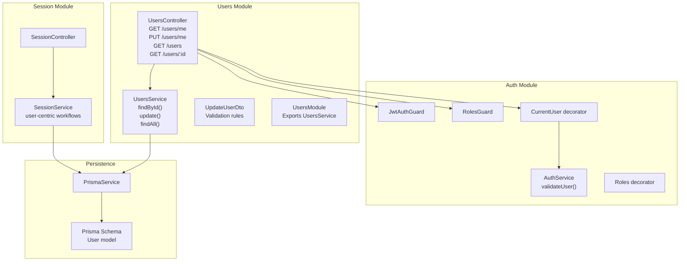
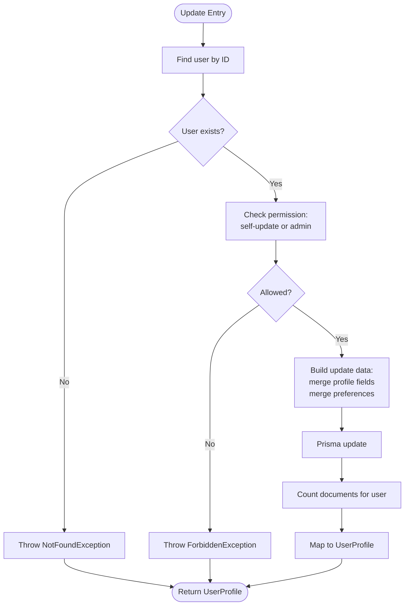

# User Management Module

<cite>
**Referenced Files in This Document**
- [users.service.ts](file://apps/api/src/modules/users/users.service.ts)
- [users.controller.ts](file://apps/api/src/modules/users/users.controller.ts)
- [update-user.dto.ts](file://apps/api/src/modules/users/dto/update-user.dto.ts)
- [users.module.ts](file://apps/api/src/modules/users/users.module.ts)
- [auth.service.ts](file://apps/api/src/modules/auth/auth.service.ts)
- [user.decorator.ts](file://apps/api/src/modules/auth/decorators/user.decorator.ts)
- [jwt-auth.guard.ts](file://apps/api/src/modules/auth/guards/jwt-auth.guard.ts)
- [roles.guard.ts](file://apps/api/src/modules/auth/guards/roles.guard.ts)
- [roles.decorator.ts](file://apps/api/src/modules/auth/decorators/roles.decorator.ts)
- [session.service.ts](file://apps/api/src/modules/session/session.service.ts)
- [session.controller.ts](file://apps/api/src/modules/session/session.controller.ts)
- [prisma.service.ts](file://libs/database/src/prisma.service.ts)
- [schema.prisma](file://prisma/schema.prisma)
- [pagination.dto.ts](file://libs/shared/src/dto/pagination.dto.ts)
- [response.dto.ts](file://libs/shared/src/dto/response.dto.ts)
</cite>

## Table of Contents
1. [Introduction](#introduction)
2. [Project Structure](#project-structure)
3. [Core Components](#core-components)
4. [Architecture Overview](#architecture-overview)
5. [Detailed Component Analysis](#detailed-component-analysis)
6. [Dependency Analysis](#dependency-analysis)
7. [Performance Considerations](#performance-considerations)
8. [Troubleshooting Guide](#troubleshooting-guide)
9. [Conclusion](#conclusion)
10. [Appendices](#appendices)

## Introduction
This document describes the User Management Module, focusing on user CRUD operations, profile management, and user data handling across the system. It explains the user service implementation for user creation, updates, retrieval, and listing, along with validation and security controls. It also covers user preferences and profile customization, integration with the authentication module for user context, and relationships with session management. Guidance is included for extending functionality and integrating with external user systems.

## Project Structure
The User Management Module is organized as a NestJS module with a controller, service, DTOs, and a module definition. It integrates with the authentication module for user context and with the session module for user-related workflows. Data persistence is handled via Prisma.

**Diagram sources**
- [users.controller.ts](file://apps/api/src/modules/users/users.controller.ts#L22-L77)
- [users.service.ts](file://apps/api/src/modules/users/users.service.ts#L37-L199)
- [update-user.dto.ts](file://apps/api/src/modules/users/dto/update-user.dto.ts#L4-L35)
- [users.module.ts](file://apps/api/src/modules/users/users.module.ts#L1-L11)
- [auth.service.ts](file://apps/api/src/modules/auth/auth.service.ts#L166-L190)
- [jwt-auth.guard.ts](file://apps/api/src/modules/auth/guards/jwt-auth.guard.ts#L6-L37)
- [roles.guard.ts](file://apps/api/src/modules/auth/guards/roles.guard.ts#L7-L38)
- [roles.decorator.ts](file://apps/api/src/modules/auth/decorators/roles.decorator.ts#L4-L6)
- [user.decorator.ts](file://apps/api/src/modules/auth/decorators/user.decorator.ts#L4-L15)
- [session.service.ts](file://apps/api/src/modules/session/session.service.ts#L87-L94)
- [prisma.service.ts](file://libs/database/src/prisma.service.ts#L4-L40)
- [schema.prisma](file://prisma/schema.prisma#L99-L131)

**Section sources**
- [users.controller.ts](file://apps/api/src/modules/users/users.controller.ts#L22-L77)
- [users.service.ts](file://apps/api/src/modules/users/users.service.ts#L37-L199)
- [users.module.ts](file://apps/api/src/modules/users/users.module.ts#L1-L11)
- [prisma.schema](file://prisma/schema.prisma#L99-L131)

## Core Components
- UsersController: Exposes endpoints for retrieving and updating the current user’s profile, and for listing users (admin-only).
- UsersService: Implements user retrieval, updates, and listing with permission checks and data aggregation.
- UpdateUserDto: Defines validation rules for partial user updates (profile and preferences).
- UsersModule: Declares and exports the UsersService for use across the application.
- Authentication integration: Uses JWT guard and user decorators to enforce context and roles.
- Persistence: Relies on PrismaService and the User model schema.

Key responsibilities:
- Retrieve user profile with organization, session counts, and document counts.
- Update user profile fields and preferences with granular control.
- Enforce permissions: self-service updates and admin-only listing.
- Aggregate derived statistics (completed sessions, documents generated).

**Section sources**
- [users.controller.ts](file://apps/api/src/modules/users/users.controller.ts#L29-L76)
- [users.service.ts](file://apps/api/src/modules/users/users.service.ts#L41-L164)
- [update-user.dto.ts](file://apps/api/src/modules/users/dto/update-user.dto.ts#L4-L35)
- [users.module.ts](file://apps/api/src/modules/users/users.module.ts#L5-L10)
- [prisma.service.ts](file://libs/database/src/prisma.service.ts#L4-L40)
- [schema.prisma](file://prisma/schema.prisma#L99-L131)

## Architecture Overview
The User Management Module follows a layered architecture:
- Controller handles HTTP requests and delegates to the service.
- Service encapsulates business logic, performs validations, and interacts with the database.
- Authentication guards and decorators ensure proper user context and role-based access.
- Session module consumes user context for session-related operations.

**Diagram sources**
- [users.controller.ts](file://apps/api/src/modules/users/users.controller.ts#L36-L44)
- [users.service.ts](file://apps/api/src/modules/users/users.service.ts#L75-L127)
- [jwt-auth.guard.ts](file://apps/api/src/modules/auth/guards/jwt-auth.guard.ts#L12-L36)
- [roles.guard.ts](file://apps/api/src/modules/auth/guards/roles.guard.ts#L11-L36)
- [user.decorator.ts](file://apps/api/src/modules/auth/decorators/user.decorator.ts#L4-L15)
- [prisma.service.ts](file://libs/database/src/prisma.service.ts#L4-L40)

## Detailed Component Analysis

### UsersService
Responsibilities:
- findById: Loads a user by ID, includes organization and completed sessions, counts generated documents, and maps to a normalized UserProfile.
- update: Validates existence, enforces permission rules (self-update or admin), merges partial profile updates, and updates preferences atomically.
- findAll: Lists users with optional role filter, paginated, and enriches each with derived statistics.

Security and validation:
- Permission enforcement: Non-admin users can only update their own profile.
- Validation: DTO-driven validation ensures safe, controlled updates.

Data aggregation:
- Completed sessions count via session aggregation.
- Documents generated count via document count scoped to user sessions.

**Diagram sources**
- [users.service.ts](file://apps/api/src/modules/users/users.service.ts#L75-L127)

**Section sources**
- [users.service.ts](file://apps/api/src/modules/users/users.service.ts#L41-L199)

### UsersController
Endpoints:
- GET /users/me: Returns the authenticated user’s profile.
- PUT /users/me: Updates the authenticated user’s profile using UpdateUserDto.
- GET /users: Lists all users (admin-only), supports role filtering and pagination.
- GET /users/:id: Retrieves a user by ID (admin-only).

Authorization:
- JwtAuthGuard protects all user endpoints.
- RolesGuard and @Roles restrict listing and retrieval to admins.

Pagination:
- Uses PaginationDto to compute skip/limit and derive pagination metadata.

**Section sources**
- [users.controller.ts](file://apps/api/src/modules/users/users.controller.ts#L29-L76)
- [pagination.dto.ts](file://libs/shared/src/dto/pagination.dto.ts#L5-L24)

### UpdateUserDto
Validation rules:
- name: Optional string, max length constraint.
- phone: Optional string, max length constraint.
- timezone: Optional string, max length constraint.
- preferences: Optional object containing nested notification settings and theme.

These constraints ensure safe, controlled updates to profile and preferences.

**Section sources**
- [update-user.dto.ts](file://apps/api/src/modules/users/dto/update-user.dto.ts#L4-L35)

### Authentication Integration
- JwtAuthGuard: Ensures requests carry a valid JWT; handles token expiration and invalid token scenarios.
- RolesGuard and @Roles: Restrict access to admin-only endpoints.
- CurrentUser decorator: Extracts the authenticated user from the request for controller methods.
- AuthService.validateUser: Resolves user context from JWT payload, ensuring the user is active and not deleted.

**Diagram sources**
- [jwt-auth.guard.ts](file://apps/api/src/modules/auth/guards/jwt-auth.guard.ts#L12-L36)
- [roles.guard.ts](file://apps/api/src/modules/auth/guards/roles.guard.ts#L11-L36)
- [roles.decorator.ts](file://apps/api/src/modules/auth/decorators/roles.decorator.ts#L4-L6)
- [user.decorator.ts](file://apps/api/src/modules/auth/decorators/user.decorator.ts#L4-L15)
- [auth.service.ts](file://apps/api/src/modules/auth/auth.service.ts#L166-L190)

**Section sources**
- [jwt-auth.guard.ts](file://apps/api/src/modules/auth/guards/jwt-auth.guard.ts#L6-L37)
- [roles.guard.ts](file://apps/api/src/modules/auth/guards/roles.guard.ts#L7-L38)
- [roles.decorator.ts](file://apps/api/src/modules/auth/decorators/roles.decorator.ts#L4-L6)
- [user.decorator.ts](file://apps/api/src/modules/auth/decorators/user.decorator.ts#L4-L15)
- [auth.service.ts](file://apps/api/src/modules/auth/auth.service.ts#L166-L190)

### Session Module Integration
- SessionService depends on UsersService indirectly via user context (e.g., creating sessions with userId).
- SessionController uses CurrentUser to pass the authenticated user’s id to session operations.
- User profiles influence session behavior through preferences and profile data.

**Diagram sources**
- [session.controller.ts](file://apps/api/src/modules/session/session.controller.ts#L36-L44)
- [session.service.ts](file://apps/api/src/modules/session/session.service.ts#L96-L136)
- [users.controller.ts](file://apps/api/src/modules/users/users.controller.ts#L29-L34)

**Section sources**
- [session.controller.ts](file://apps/api/src/modules/session/session.controller.ts#L36-L44)
- [session.service.ts](file://apps/api/src/modules/session/session.service.ts#L96-L136)
- [users.controller.ts](file://apps/api/src/modules/users/users.controller.ts#L29-L34)

### Data Model and Persistence
- User model stores profile and preferences as JSON fields, enabling flexible customization.
- Statistics are computed on-the-fly via joins and counts.
- Soft delete pattern supported via deletedAt.

**Diagram sources**
- [schema.prisma](file://prisma/schema.prisma#L99-L131)
- [schema.prisma](file://prisma/schema.prisma#L82-L97)
- [schema.prisma](file://prisma/schema.prisma#L270-L300)

**Section sources**
- [schema.prisma](file://prisma/schema.prisma#L99-L131)
- [prisma.service.ts](file://libs/database/src/prisma.service.ts#L4-L40)

## Dependency Analysis
- UsersController depends on UsersService and authentication guards.
- UsersService depends on PrismaService and uses UpdateUserDto for validation.
- Authentication guards and decorators provide runtime user context and role checks.
- Session module depends on user context for session operations.

**Diagram sources**
- [users.controller.ts](file://apps/api/src/modules/users/users.controller.ts#L26-L27)
- [users.service.ts](file://apps/api/src/modules/users/users.service.ts#L39)
- [jwt-auth.guard.ts](file://apps/api/src/modules/auth/guards/jwt-auth.guard.ts#L6-L37)
- [roles.guard.ts](file://apps/api/src/modules/auth/guards/roles.guard.ts#L7-L38)
- [user.decorator.ts](file://apps/api/src/modules/auth/decorators/user.decorator.ts#L4-L15)
- [auth.service.ts](file://apps/api/src/modules/auth/auth.service.ts#L166-L190)
- [session.controller.ts](file://apps/api/src/modules/session/session.controller.ts#L34-L35)
- [session.service.ts](file://apps/api/src/modules/session/session.service.ts#L87-L94)

**Section sources**
- [users.controller.ts](file://apps/api/src/modules/users/users.controller.ts#L26-L27)
- [users.service.ts](file://apps/api/src/modules/users/users.service.ts#L39)
- [jwt-auth.guard.ts](file://apps/api/src/modules/auth/guards/jwt-auth.guard.ts#L6-L37)
- [roles.guard.ts](file://apps/api/src/modules/auth/guards/roles.guard.ts#L7-L38)
- [user.decorator.ts](file://apps/api/src/modules/auth/decorators/user.decorator.ts#L4-L15)
- [auth.service.ts](file://apps/api/src/modules/auth/auth.service.ts#L166-L190)
- [session.controller.ts](file://apps/api/src/modules/session/session.controller.ts#L34-L35)
- [session.service.ts](file://apps/api/src/modules/session/session.service.ts#L87-L94)

## Performance Considerations
- Aggregation queries: Completed sessions and documents counts are computed per request. Consider caching frequently accessed user stats for high-traffic scenarios.
- Pagination: findAll uses skip/take with count; ensure appropriate indexing on role and createdAt for efficient sorting and filtering.
- DTO validation: Keep validation rules minimal and precise to avoid unnecessary overhead during updates.
- Database logging: PrismaService logs slow queries in development; monitor and optimize slow queries in production.

[No sources needed since this section provides general guidance]

## Troubleshooting Guide
Common issues and resolutions:
- Authentication failures: Ensure a valid JWT is provided and not expired; JwtAuthGuard throws explicit errors for expired or invalid tokens.
- Authorization failures: Access to admin endpoints requires ADMIN or SUPER_ADMIN roles enforced by RolesGuard.
- User not found: findById and update throw NotFoundException when the user does not exist or is soft deleted.
- Permission denied: update enforces self-service updates; non-admin users cannot modify others’ profiles.
- Validation errors: UpdateUserDto enforces field constraints; adjust payloads to meet validation rules.

**Section sources**
- [jwt-auth.guard.ts](file://apps/api/src/modules/auth/guards/jwt-auth.guard.ts#L25-L36)
- [roles.guard.ts](file://apps/api/src/modules/auth/guards/roles.guard.ts#L24-L36)
- [users.service.ts](file://apps/api/src/modules/users/users.service.ts#L58-L88)
- [update-user.dto.ts](file://apps/api/src/modules/users/dto/update-user.dto.ts#L4-L35)

## Conclusion
The User Management Module provides robust user CRUD operations with strong security controls, flexible profile and preference updates, and seamless integration with authentication and session modules. Its design leverages DTO validation, guard-based authorization, and Prisma for reliable data handling. Extensibility is straightforward through the module’s layered architecture and exported service.

[No sources needed since this section summarizes without analyzing specific files]

## Appendices

### User Profile Data Model
UserProfile aggregates user identity, profile, preferences, organization, statistics, and timestamps.

**Diagram sources**
- [users.service.ts](file://apps/api/src/modules/users/users.service.ts#L7-L35)

**Section sources**
- [users.service.ts](file://apps/api/src/modules/users/users.service.ts#L7-L35)

### Example Workflows

#### Update Current User Profile
- Request: PUT /users/me with JWT and UpdateUserDto payload.
- Guards: JwtAuthGuard validates token; CurrentUser supplies user context.
- Service: Permission check and merge of profile/preferences; persist via Prisma.
- Response: Updated UserProfile.

**Diagram sources**
- [users.controller.ts](file://apps/api/src/modules/users/users.controller.ts#L36-L44)
- [users.service.ts](file://apps/api/src/modules/users/users.service.ts#L75-L127)
- [jwt-auth.guard.ts](file://apps/api/src/modules/auth/guards/jwt-auth.guard.ts#L12-L36)
- [user.decorator.ts](file://apps/api/src/modules/auth/decorators/user.decorator.ts#L4-L15)

#### List Users (Admin)
- Request: GET /users with pagination and optional role filter.
- Guards: JwtAuthGuard and RolesGuard (ADMIN/SUPER_ADMIN).
- Service: findAll with pagination and role filter; enrich with statistics.
- Response: Paginated list of UserProfile items.

**Diagram sources**
- [users.controller.ts](file://apps/api/src/modules/users/users.controller.ts#L46-L66)
- [users.service.ts](file://apps/api/src/modules/users/users.service.ts#L129-L164)
- [pagination.dto.ts](file://libs/shared/src/dto/pagination.dto.ts#L5-L24)
- [roles.guard.ts](file://apps/api/src/modules/auth/guards/roles.guard.ts#L11-L36)

### Security and Privacy Considerations
- Role-based access: Admin-only endpoints prevent unauthorized access to user listings and retrieval by ID.
- Self-service updates: Users can only modify their own profiles; administrative overrides are enforced.
- Data validation: UpdateUserDto constrains input sizes and types to reduce risk.
- JWT lifecycle: Authentication module manages token issuance, refresh, and logout; ensure secure storage and transmission of tokens.
- Data retention: deletedAt supports soft deletion; ensure audit logs capture sensitive changes.

**Section sources**
- [users.controller.ts](file://apps/api/src/modules/users/users.controller.ts#L46-L76)
- [users.service.ts](file://apps/api/src/modules/users/users.service.ts#L85-L88)
- [update-user.dto.ts](file://apps/api/src/modules/users/dto/update-user.dto.ts#L4-L35)
- [auth.service.ts](file://apps/api/src/modules/auth/auth.service.ts#L160-L164)

### Extending User Functionality
- Add new profile fields: Extend the User model in Prisma schema and update UsersService mapping.
- Preferences expansion: Add new preference categories in UpdateUserDto and UsersService update logic.
- External user systems: Integrate via adapter pattern by adding a new provider that synchronizes with external identity providers while keeping internal profile and preferences consistent.

[No sources needed since this section provides general guidance]