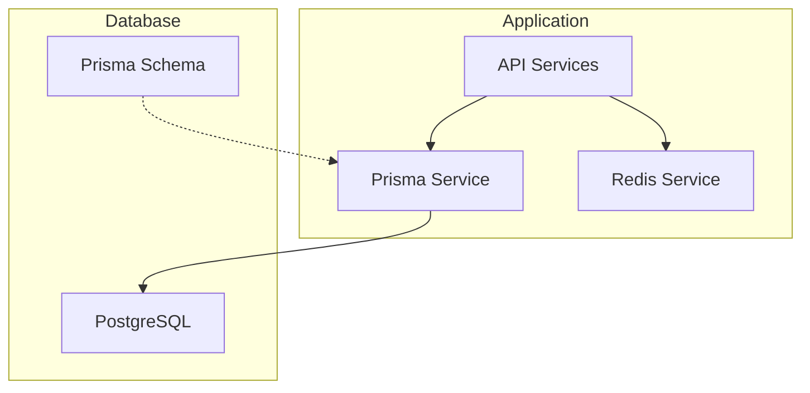
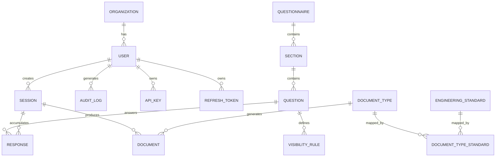
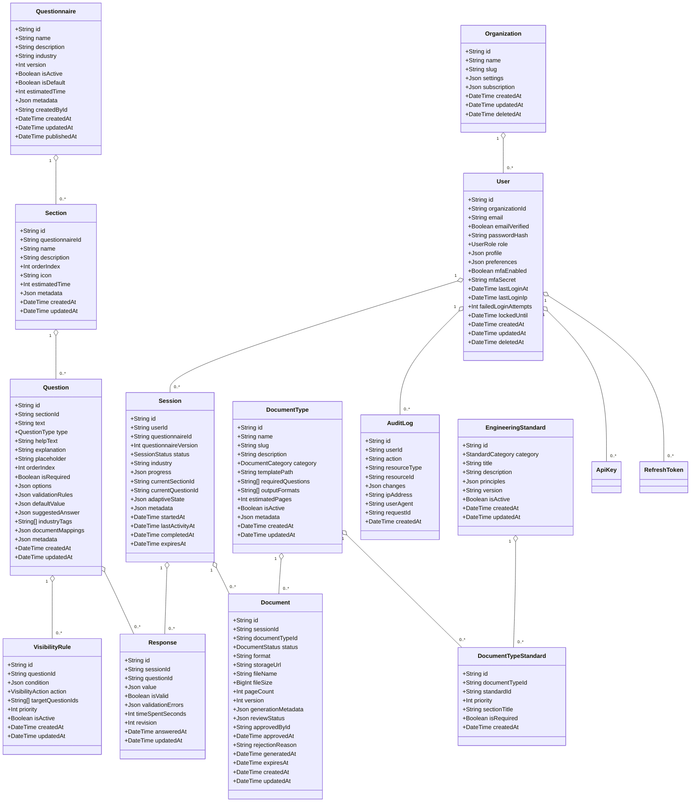
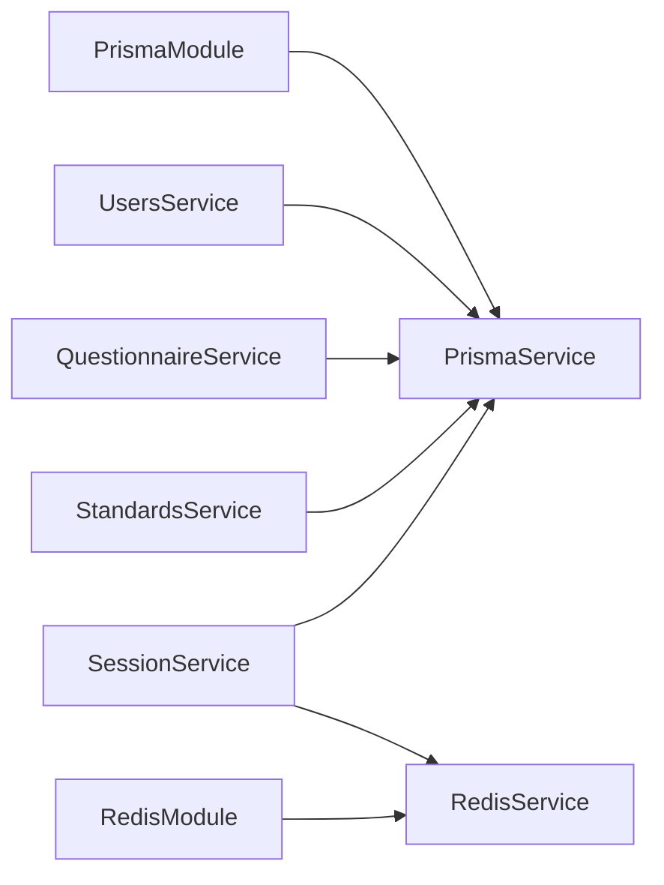
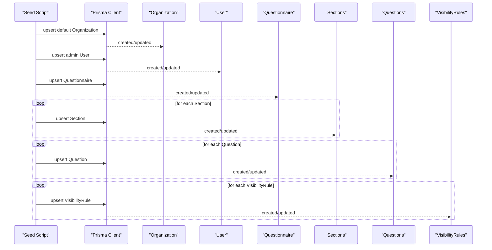

# Data Models and Database Schema

<cite>
**Referenced Files in This Document**
- [schema.prisma](file://prisma/schema.prisma)
- [seed.ts](file://prisma/seed.ts)
- [standards.seed.ts](file://prisma/seeds/standards.seed.ts)
- [prisma.service.ts](file://libs/database/src/prisma.service.ts)
- [prisma.module.ts](file://libs/database/src/prisma.module.ts)
- [redis.service.ts](file://libs/redis/src/redis.service.ts)
- [redis.module.ts](file://libs/redis/src/redis.module.ts)
- [05-data-models-db-architecture.md](file://docs/cto/05-data-models-db-architecture.md)
- [users.service.ts](file://apps/api/src/modules/users/users.service.ts)
- [session.service.ts](file://apps/api/src/modules/session/session.service.ts)
- [questionnaire.service.ts](file://apps/api/src/modules/questionnaire/questionnaire.service.ts)
- [standards.service.ts](file://apps/api/src/modules/standards/standards.service.ts)
- [init.sql](file://docker/postgres/init.sql)
- [package.json](file://package.json)
</cite>

## Table of Contents
1. [Introduction](#introduction)
2. [Project Structure](#project-structure)
3. [Core Components](#core-components)
4. [Architecture Overview](#architecture-overview)
5. [Detailed Component Analysis](#detailed-component-analysis)
6. [Dependency Analysis](#dependency-analysis)
7. [Performance Considerations](#performance-considerations)
8. [Troubleshooting Guide](#troubleshooting-guide)
9. [Conclusion](#conclusion)
10. [Appendices](#appendices)

## Introduction
This document provides comprehensive data model documentation for the Quiz-to-build database schema. It details all entities, their relationships, fields, data types, constraints, indexes, and referential integrity enforced by the Prisma schema. It also covers validation rules, business constraints, performance characteristics, caching strategies, and practical usage patterns derived from the application services. Finally, it outlines migration procedures, seeding strategies, and operational considerations for data lifecycle and retention.

## Project Structure
The data model is defined centrally in the Prisma schema and supported by:
- Prisma client generation and runtime service
- Redis caching layer
- Seed scripts for initial data and standards
- Documentation that complements the schema with ER diagrams, indexes, and operational guidance

**Diagram sources**
- [prisma.service.ts](file://libs/database/src/prisma.service.ts#L1-L62)
- [redis.service.ts](file://libs/redis/src/redis.service.ts#L1-L96)
- [schema.prisma](file://prisma/schema.prisma#L1-L447)

**Section sources**
- [prisma.service.ts](file://libs/database/src/prisma.service.ts#L1-L62)
- [redis.service.ts](file://libs/redis/src/redis.service.ts#L1-L96)
- [schema.prisma](file://prisma/schema.prisma#L1-L447)

## Core Components
This section enumerates the core entities and their primary attributes, constraints, and relationships as defined in the Prisma schema.

- Organization
  - Fields: id (PK), name, slug (unique), settings (JSON), subscription (JSON), timestamps, deletedAt
  - Relationships: 1:N users
  - Indexes: slug, createdAt
  - Constraints: slug unique; soft delete via deletedAt

- User
  - Fields: id (PK), org_id (FK), email (unique), emailVerified, passwordHash, role (enum), profile/preferences (JSON), MFA fields, login tracking, timestamps, deletedAt
  - Relationships: N:1 organization; 1:N sessions, auditLogs, apiKeys, refreshTokens; creator/approver roles for questionnaires/documents
  - Indexes: email, org_id, role, createdAt
  - Constraints: email unique; role default CLIENT; soft delete via deletedAt

- RefreshToken
  - Fields: id (PK), user_id (FK), token (unique), expiresAt, timestamps, revokedAt
  - Relationships: N:1 user
  - Indexes: token, user_id, expiresAt
  - Constraints: token unique; cascade delete on user

- ApiKey
  - Fields: id (PK), user_id (FK), name, keyPrefix, keyHash, scopes[], rateLimit, lastUsedAt, expiresAt, timestamps, revokedAt
  - Relationships: N:1 user
  - Indexes: user_id, keyPrefix
  - Constraints: cascade delete on user

- Questionnaire
  - Fields: id (PK), name, description, industry, version (default 1), is_active (default true), is_default (default false), estimatedTime, metadata (JSON), created_by (FK), timestamps, publishedAt
  - Relationships: N:1 createdBy (User); 1:N sections; 1:N sessions
  - Indexes: industry, is_active
  - Constraints: soft delete via created_by relation; defaults apply

- Section
  - Fields: id (PK), questionnaire_id (FK), name, description, order_index, icon, estimatedTime, metadata (JSON), timestamps
  - Relationships: N:1 questionnaire; 1:N questions; 1:N sessions (currentSection)
  - Indexes: questionnaire_id, (questionnaire_id, order_index)
  - Constraints: cascade delete on questionnaire

- Question
  - Fields: id (PK), section_id (FK), text, type (enum), helpText/explanation, placeholder, order_index, isRequired (default false), options/validationRules/defaultValue/suggestedAnswer (JSON), industryTags[], documentMappings (JSON), metadata (JSON), timestamps
  - Relationships: N:1 section; 1:N visibilityRules; 1:N responses; 1:N sessions (currentQuestion)
  - Indexes: section_id, (section_id, order_index), type
  - Constraints: cascade delete on section

- VisibilityRule
  - Fields: id (PK), question_id (FK), condition (JSON), action (enum), target_question_ids[], priority (default 0), is_active (default true), timestamps
  - Relationships: N:1 question
  - Indexes: question_id
  - Constraints: cascade delete on question

- Session
  - Fields: id (PK), user_id (FK), questionnaire_id (FK), questionnaire_version, status (enum), industry, progress (JSON), current_section_id/current_question_id (FKs), adaptive_state (JSON), metadata (JSON), timestamps (startedAt, lastActivityAt, completedAt, expiresAt)
  - Relationships: N:1 user; N:1 questionnaire; optional FK to Section/Question; 1:N responses; 1:N documents
  - Indexes: user_id, questionnaire_id, status, startedAt, (user_id, status)
  - Constraints: cascade delete on user; restrict on questionnaire; optional FKs for current pointers

- Response
  - Fields: id (PK), session_id (FK), question_id (FK), value (JSON), isValid (default true), validationErrors (JSON), timeSpentSeconds, revision (default 1), answeredAt, updatedAt
  - Relationships: N:1 session; N:1 question
  - Indexes: (unique) (session_id, question_id), session_id, question_id, answeredAt
  - Constraints: cascade delete on session; unique composite key

- DocumentType
  - Fields: id (PK), name, slug (unique), description, category (enum), templatePath, requiredQuestions[], outputFormats[] (default ["PDF","DOCX"]), estimatedPages, isActive (default true), metadata (JSON), timestamps
  - Relationships: 1:N documents; 1:N documentTypeStandards
  - Indexes: category, isActive
  - Constraints: slug unique

- Document
  - Fields: id (PK), session_id (FK), document_type_id (FK), status (enum), format (default "PDF"), storageUrl/file_name/file_size/page_count, version (default 1), generationMetadata (JSON), reviewStatus (JSON), approved_by (FK), approvedAt/rejectionReason, generatedAt, expiresAt, timestamps
  - Relationships: N:1 session; N:1 documentType; optional FK to User (approvedBy)
  - Indexes: session_id, document_type_id, status, generatedAt
  - Constraints: cascade delete on session

- AuditLog
  - Fields: id (PK), user_id (FK), action, resourceType/resourceId, changes (JSON), ipAddress, userAgent, requestId, timestamps
  - Relationships: optional FK to user
  - Indexes: user_id, action, (resourceType, resourceId), createdAt

- EngineeringStandard
  - Fields: id (PK), category (unique enum), title, description (text), principles (JSON array), version (default "2026"), isActive (default true), timestamps
  - Relationships: 1:N documentTypeStandards
  - Indexes: category, isActive

- DocumentTypeStandard
  - Fields: id (PK), document_type_id (FK), standard_id (FK), priority (default 0), sectionTitle, isRequired (default true), timestamps
  - Relationships: N:1 documentType; N:1 engineeringStandard
  - Indexes: document_type_id, standard_id
  - Constraints: unique (document_type_id, standard_id)

**Section sources**
- [schema.prisma](file://prisma/schema.prisma#L82-L446)

## Architecture Overview
The system follows a layered architecture:
- API services consume Prisma for database operations and optionally Redis for caching.
- Prisma generates strongly typed client code and manages schema migrations.
- Redis caches hot data and supports rate limiting and session metadata.
- PostgreSQL stores transactional data with JSONB for flexible attributes and robust indexing.

**Diagram sources**
- [schema.prisma](file://prisma/schema.prisma#L82-L446)

## Detailed Component Analysis

### Entities and Relationships
- Primary Keys: All entities use UUID primary keys with default generation.
- Foreign Keys: Defined with explicit fields/references and cascading behavior where appropriate.
- Soft Deletes: Implemented via optional deletion timestamps on Organization, User, and Questionnaire.
- JSONB Fields: Extensive use of JSON/JSONB for flexible metadata, options, and structured values.

**Diagram sources**
- [schema.prisma](file://prisma/schema.prisma#L82-L446)

**Section sources**
- [schema.prisma](file://prisma/schema.prisma#L82-L446)

### Data Validation Rules and Business Constraints
- Required fields: isRequired on Question; email uniqueness on User; token uniqueness on RefreshToken and ApiKey; unique slug on Organization and DocumentType; unique category on EngineeringStandard; unique (session_id, question_id) on Response.
- Enumerations: UserRole, QuestionType, SessionStatus, VisibilityAction, DocumentCategory, DocumentStatus, StandardCategory enforce domain constraints.
- JSON schemas: Options, VisibilityRule conditions, Response values, and progress structures are defined in the documentation to guide clients and validation logic.
- Adaptive logic: VisibilityRule conditionals drive dynamic visibility and requirement changes during sessions.

**Section sources**
- [schema.prisma](file://prisma/schema.prisma#L17-L76)
- [05-data-models-db-architecture.md](file://docs/cto/05-data-models-db-architecture.md#L487-L551)
- [session.service.ts](file://apps/api/src/modules/session/session.service.ts#L622-L659)

### Indexes and Performance Considerations
- Core indexes:
  - Organizations: slug, createdAt
  - Users: email, org_id, role, createdAt
  - Questionnaires: industry, is_active
  - Sections: questionnaire_id, (questionnaire_id, order_index)
  - Questions: section_id, (section_id, order_index), type
  - VisibilityRules: question_id
  - Sessions: user_id, questionnaire_id, status, startedAt, (user_id, status)
  - Responses: (session_id, question_id), session_id, question_id, answeredAt
  - DocumentTypes: category, is_active
  - Documents: session_id, document_type_id, status, generatedAt
  - AuditLogs: user_id, action, (resource_type, resource_id), created_at
- Additional guidance:
  - Composite indexes for frequent filters (e.g., user+status on sessions)
  - Partial indexes for active records
  - JSONB GIN indexes for searchable arrays and nested fields
  - Full-text search indexes on question text and help text
  - Connection pooling and read replicas for reporting

**Section sources**
- [schema.prisma](file://prisma/schema.prisma#L94-L96)
- [schema.prisma](file://prisma/schema.prisma#L126-L130)
- [schema.prisma](file://prisma/schema.prisma#L192-L195)
- [schema.prisma](file://prisma/schema.prisma#L213-L215)
- [schema.prisma](file://prisma/schema.prisma#L243-L246)
- [schema.prisma](file://prisma/schema.prisma#L262-L263)
- [schema.prisma](file://prisma/schema.prisma#L294-L299)
- [schema.prisma](file://prisma/schema.prisma#L317-L321)
- [schema.prisma](file://prisma/schema.prisma#L346-L348)
- [schema.prisma](file://prisma/schema.prisma#L376-L380)
- [schema.prisma](file://prisma/schema.prisma#L401-L405)
- [05-data-models-db-architecture.md](file://docs/cto/05-data-models-db-architecture.md#L555-L585)

### Sample Data Examples
- Default Organization and Admin User are created during seeding.
- A default Questionnaire with multiple Sections and Questions is seeded, including visibility rules.
- Engineering Standards and DocumentType mappings are seeded for CTO documents.

**Section sources**
- [seed.ts](file://prisma/seed.ts#L9-L35)
- [seed.ts](file://prisma/seed.ts#L37-L145)
- [seed.ts](file://prisma/seed.ts#L420-L439)
- [seed.ts](file://prisma/seed.ts#L441-L479)
- [standards.seed.ts](file://prisma/seeds/standards.seed.ts#L274-L349)

### Common Query Patterns
- Retrieve user profile with organization and counts of completed sessions and generated documents.
- List questionnaires with section counts and pagination.
- Create a new session, initialize progress, and track current section/question.
- Submit responses, validate values, and update session progress.
- Generate standards section for a given document type by joining standards and mappings.

**Section sources**
- [users.service.ts](file://apps/api/src/modules/users/users.service.ts#L41-L73)
- [users.service.ts](file://apps/api/src/modules/users/users.service.ts#L129-L164)
- [questionnaire.service.ts](file://apps/api/src/modules/questionnaire/questionnaire.service.ts#L67-L98)
- [questionnaire.service.ts](file://apps/api/src/modules/questionnaire/questionnaire.service.ts#L100-L123)
- [session.service.ts](file://apps/api/src/modules/session/session.service.ts#L96-L136)
- [session.service.ts](file://apps/api/src/modules/session/session.service.ts#L270-L359)
- [standards.service.ts](file://apps/api/src/modules/standards/standards.service.ts#L72-L103)
- [standards.service.ts](file://apps/api/src/modules/standards/standards.service.ts#L105-L151)

### Data Lifecycle, Retention, and Archival
- Retention policies:
  - Sessions and Responses: keep for 2–7 years depending on status and archival cadence
  - Documents: keep for 2 years with indefinite archive potential
  - Audit logs: 1–7 years depending on archival strategy
- Archival process:
  - Move completed sessions older than 2 years to archive tables
  - Delete archived records per policy
- Backup and recovery:
  - Full/incremental WAL archiving with point-in-time recovery
  - Cross-region replication for disaster recovery

**Section sources**
- [05-data-models-db-architecture.md](file://docs/cto/05-data-models-db-architecture.md#L672-L696)
- [05-data-models-db-architecture.md](file://docs/cto/05-data-models-db-architecture.md#L624-L640)

### Caching Strategies and Performance Optimization
- Redis caching:
  - Questionnaire structure and metadata cached with TTL
  - User sessions and rate limits stored with expiration
  - Visibility rule evaluation results cached in application memory
- Database optimization:
  - Use EXPLAIN ANALYZE for new queries
  - Paginate results and batch writes
  - Use read replicas for reporting
  - PgBouncer connection pooling

**Section sources**
- [redis.service.ts](file://libs/redis/src/redis.service.ts#L1-L96)
- [05-data-models-db-architecture.md](file://docs/cto/05-data-models-db-architecture.md#L652-L669)

### Prisma Migration Procedures and Version Management
- Commands:
  - Generate Prisma client: db:generate
  - Local migrations: db:migrate
  - Production migrations: db:migrate:prod
  - Seed data: db:seed
  - Reset migrations: db:reset
- Migration framework:
  - Timestamped filenames with reversible scripts
  - Testing in staging before production rollout
- Initialization:
  - PostgreSQL extensions enabled at container startup

**Section sources**
- [package.json](file://package.json#L10-L34)
- [05-data-models-db-architecture.md](file://docs/cto/05-data-models-db-architecture.md#L589-L621)
- [init.sql](file://docker/postgres/init.sql#L4-L8)

## Dependency Analysis
- Prisma Service
  - Provides database connectivity and lifecycle hooks
  - Emits slow query logs in development
  - Supports test-only database cleanup
- Redis Service
  - Centralized Redis client with convenience helpers
  - Exposes key-value and hash operations with TTL controls
- Modules
  - PrismaModule and RedisModule export singleton services for global injection
- Application Services
  - Users, Questionnaire, Session, and Standards services encapsulate business logic and coordinate with Prisma and Redis

**Diagram sources**
- [prisma.module.ts](file://libs/database/src/prisma.module.ts#L1-L10)
- [prisma.service.ts](file://libs/database/src/prisma.service.ts#L1-L62)
- [redis.module.ts](file://libs/redis/src/redis.module.ts#L1-L10)
- [redis.service.ts](file://libs/redis/src/redis.service.ts#L1-L96)
- [users.service.ts](file://apps/api/src/modules/users/users.service.ts#L1-L200)
- [questionnaire.service.ts](file://apps/api/src/modules/questionnaire/questionnaire.service.ts#L1-L253)
- [session.service.ts](file://apps/api/src/modules/session/session.service.ts#L1-L684)
- [standards.service.ts](file://apps/api/src/modules/standards/standards.service.ts#L1-L197)

**Section sources**
- [prisma.module.ts](file://libs/database/src/prisma.module.ts#L1-L10)
- [redis.module.ts](file://libs/redis/src/redis.module.ts#L1-L10)
- [users.service.ts](file://apps/api/src/modules/users/users.service.ts#L1-L200)
- [questionnaire.service.ts](file://apps/api/src/modules/questionnaire/questionnaire.service.ts#L1-L253)
- [session.service.ts](file://apps/api/src/modules/session/session.service.ts#L1-L684)
- [standards.service.ts](file://apps/api/src/modules/standards/standards.service.ts#L1-L197)

## Performance Considerations
- Query optimization guidelines:
  - Use EXPLAIN ANALYZE for new queries
  - Limit result sets with pagination
  - Use connection pooling (PgBouncer)
  - Batch inserts for responses
  - Use read replicas for reporting queries
- Indexing strategy:
  - Composite indexes for common filters
  - Partial indexes for active records
  - JSONB GIN indexes for array and nested queries
  - Full-text search on question text and help text
- Caching strategy:
  - Questionnaire structure: Redis TTL 1 hour
  - User session: Redis TTL 24 hours
  - Question visibility: in-memory cache with invalidation on rule change
  - Document metadata: Redis TTL 30 minutes

**Section sources**
- [05-data-models-db-architecture.md](file://docs/cto/05-data-models-db-architecture.md#L643-L669)
- [05-data-models-db-architecture.md](file://docs/cto/05-data-models-db-architecture.md#L555-L585)

## Troubleshooting Guide
- Slow queries:
  - Prisma logs slow queries in development when duration exceeds threshold
- Database connectivity:
  - Verify Prisma client initialization and connection lifecycle hooks
- Redis connectivity:
  - Monitor connection events and error logs; ensure credentials and host/port are configured
- Data inconsistencies:
  - Review unique constraints (e.g., Response composite key) and foreign key cascades
  - Confirm indexes exist for high-traffic queries

**Section sources**
- [prisma.service.ts](file://libs/database/src/prisma.service.ts#L20-L40)
- [redis.service.ts](file://libs/redis/src/redis.service.ts#L10-L28)

## Conclusion
The Quiz-to-build data model is designed around flexibility and scalability, leveraging PostgreSQL’s JSONB capabilities and Prisma’s strong typing. Robust indexing, caching, and operational policies ensure performance and reliability. The documented relationships, constraints, and patterns enable consistent development and maintenance across modules.

## Appendices

### Appendix A: Entity Relationship Diagram (ERD)

**Diagram sources**
- [schema.prisma](file://prisma/schema.prisma#L82-L446)

### Appendix B: Sample Data Flow (Seeding)

**Diagram sources**
- [seed.ts](file://prisma/seed.ts#L6-L484)