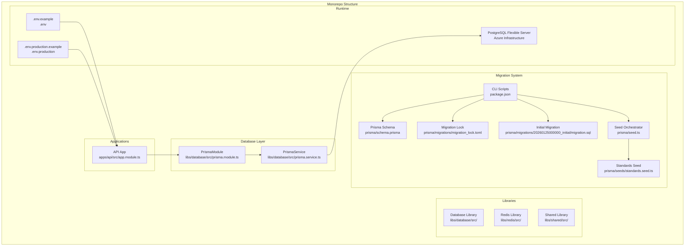
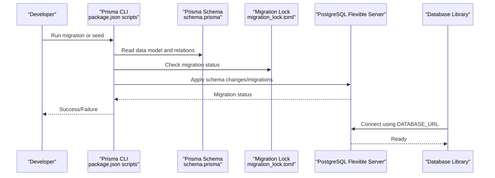
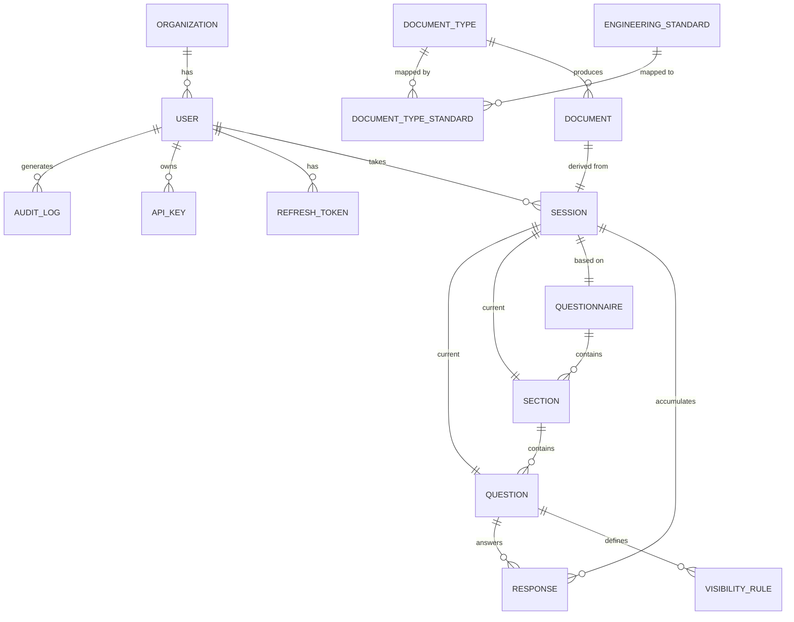
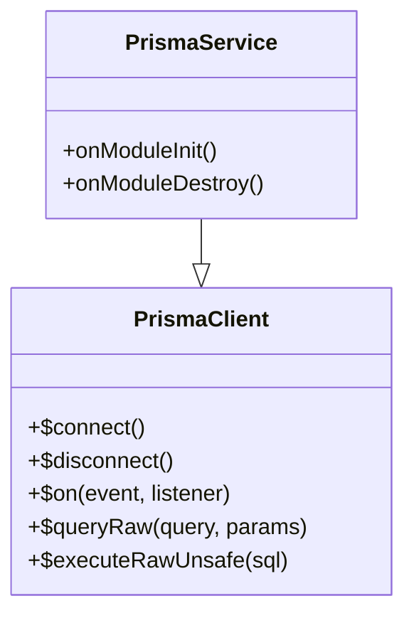
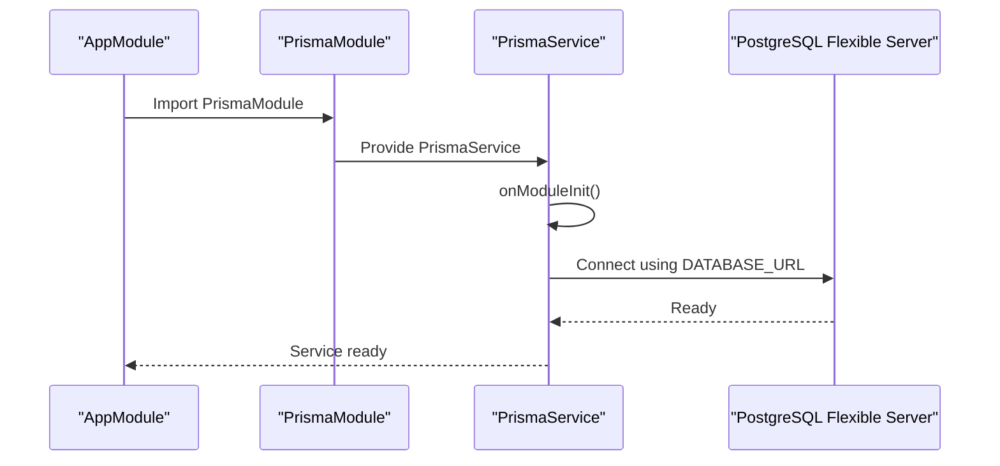
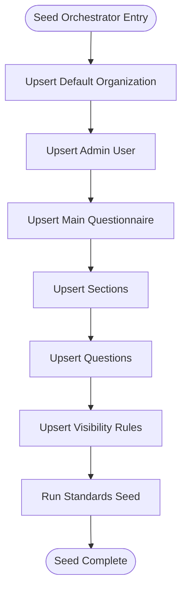
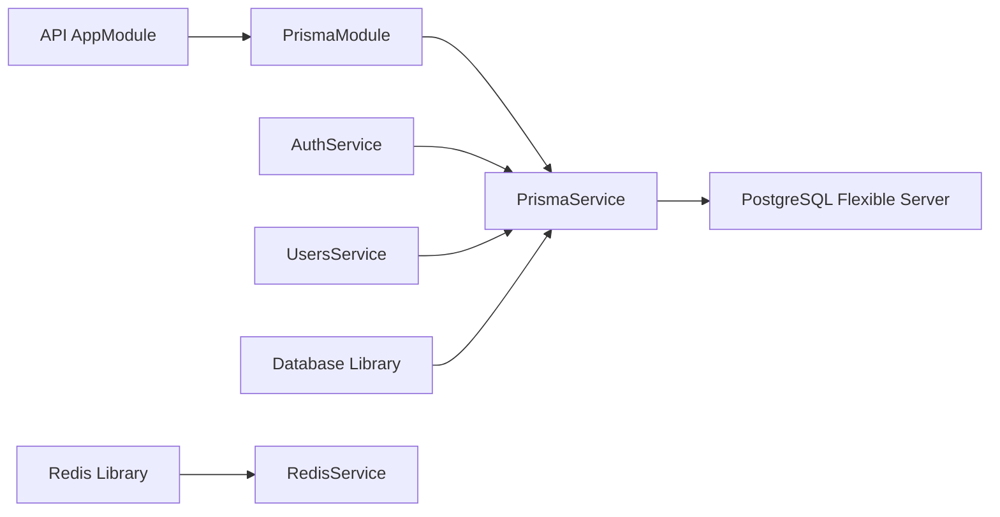

# Database Management

<cite>
**Referenced Files in This Document**
- [prisma.service.ts](file://libs/database/src/prisma.service.ts)
- [prisma.module.ts](file://libs/database/src/prisma.module.ts)
- [schema.prisma](file://prisma/schema.prisma)
- [migration_lock.toml](file://prisma/migrations/migration_lock.toml)
- [migration.sql](file://prisma/migrations/20260125000000_initial/migration.sql)
- [seed.ts](file://prisma/seed.ts)
- [standards.seed.ts](file://prisma/seeds/standards.seed.ts)
- [package.json](file://package.json)
- [docker-compose.yml](file://docker-compose.yml)
- [init.sql](file://docker/postgres/init.sql)
- [.env.example](file://.env.example)
- [.env.production.example](file://.env.production.example)
- [app.module.ts](file://apps/api/src/app.module.ts)
- [auth.service.ts](file://apps/api/src/modules/auth/auth.service.ts)
- [users.service.ts](file://apps/api/src/modules/users/users.service.ts)
- [libs/database/package.json](file://libs/database/package.json)
- [infrastructure/terraform/modules/database/main.tf](file://infrastructure/terraform/modules/database/main.tf)
- [infrastructure/terraform/modules/cache/main.tf](file://infrastructure/terraform/modules/cache/main.tf)
- [redis.service.ts](file://libs/redis/src/redis.service.ts)
- [redis.module.ts](file://libs/redis/src/redis.module.ts)
</cite>

## Update Summary
**Changes Made**
- Updated database architecture to reflect simplified logging and monitoring system
- Removed comprehensive logging for database connections and slow query detection mechanisms
- Simplified PrismaService lifecycle management without development-only monitoring features
- Updated database cleaning utilities section to reflect current implementation
- Revised performance considerations to remove slow query detection recommendations

## Table of Contents
1. [Introduction](#introduction)
2. [Project Structure](#project-structure)
3. [Core Components](#core-components)
4. [Architecture Overview](#architecture-overview)
5. [Detailed Component Analysis](#detailed-component-analysis)
6. [Dependency Analysis](#dependency-analysis)
7. [Performance Considerations](#performance-considerations)
8. [Backup and Recovery](#backup-and-recovery)
9. [Export/Import Workflows](#exportimport-workflows)
10. [Schema Versioning](#schema-versioning)
11. [Migration System](#migration-system)
12. [Troubleshooting Guide](#troubleshooting-guide)
13. [Relationship Between Prisma Schema Changes and Application Code](#relationship-between-prisma-schema-changes-and-application-code)
14. [Conclusion](#conclusion)

## Introduction
This document provides comprehensive database management guidance for the Quiz-to-build system built with NestJS and Prisma ORM. The system has implemented a streamlined database architecture with simplified logging and monitoring capabilities. It covers schema definition, migration procedures, database operations, seeding strategies, Prisma CLI usage, connection management via a service abstraction, performance optimization, backup/recovery, export/import workflows, schema versioning, migration management, troubleshooting, and the relationship between schema changes and application code updates.

**Updated** The logging and monitoring system has been simplified to reduce complexity while maintaining essential database connectivity and basic operational logging.

## Project Structure
The database layer is encapsulated in a dedicated library that exposes a Prisma service and module. The API application consumes this library to access the database. Migration and seeding are orchestrated via Prisma CLI scripts defined in the monorepo's root package.json. The system uses a monorepo structure with clear separation between applications, libraries, and infrastructure components. PostgreSQL flexible server is provisioned through Terraform for production environments with comprehensive migration management.

**Diagram sources**
- [app.module.ts](file://apps/api/src/app.module.ts#L1-L67)
- [prisma.module.ts](file://libs/database/src/prisma.module.ts#L1-L10)
- [prisma.service.ts](file://libs/database/src/prisma.service.ts#L1-L62)
- [schema.prisma](file://prisma/schema.prisma#L1-L446)
- [migration_lock.toml](file://prisma/migrations/migration_lock.toml#L1-L7)
- [migration.sql](file://prisma/migrations/20260125000000_initial/migration.sql#L1-L487)
- [seed.ts](file://prisma/seed.ts#L1-L495)
- [standards.seed.ts](file://prisma/seeds/standards.seed.ts#L1-L361)
- [package.json](file://package.json#L1-L64)
- [infrastructure/terraform/modules/database/main.tf](file://infrastructure/terraform/modules/database/main.tf#L1-L62)

**Section sources**
- [app.module.ts](file://apps/api/src/app.module.ts#L1-L67)
- [prisma.module.ts](file://libs/database/src/prisma.module.ts#L1-L10)
- [prisma.service.ts](file://libs/database/src/prisma.service.ts#L1-L62)
- [schema.prisma](file://prisma/schema.prisma#L1-L446)
- [migration_lock.toml](file://prisma/migrations/migration_lock.toml#L1-L7)
- [migration.sql](file://prisma/migrations/20260125000000_initial/migration.sql#L1-L487)
- [seed.ts](file://prisma/seed.ts#L1-L495)
- [standards.seed.ts](file://prisma/seeds/standards.seed.ts#L1-L361)
- [package.json](file://package.json#L1-L64)
- [infrastructure/terraform/modules/database/main.tf](file://infrastructure/terraform/modules/database/main.tf#L1-L62)

## Core Components
- **Prisma Schema**: Defines comprehensive data models including organizations, users, questionnaires, sessions, documents, and engineering standards with strategic indexing and 14 core tables.
- **Migration System**: Complete migration framework with enum types, migration lock mechanism, and schema versioning.
- **PrismaService**: Extends PrismaClient with simplified lifecycle hooks and basic logging capabilities.
- **PrismaModule**: Provides globally available PrismaService singleton for dependency injection.
- **Database Library**: Self-contained library exposing PrismaService and PrismaModule for reuse across applications.
- **Seeding Strategy**: Comprehensive seed orchestrator creating organizations, users, questionnaires, sections, questions, visibility rules, and standards catalog.
- **Environment Configuration**: Separate development and production environment configurations with proper security settings.
- **PostgreSQL Infrastructure**: Azure Database for PostgreSQL flexible server with automated backups and performance tuning.
- **Redis Library**: Maintained for legacy compatibility but not actively used for caching in current architecture.

**Updated** The PrismaService now has simplified logging capabilities without development-only slow query detection and database cleaning utilities.

**Section sources**
- [schema.prisma](file://prisma/schema.prisma#L1-L446)
- [migration_lock.toml](file://prisma/migrations/migration_lock.toml#L1-L7)
- [migration.sql](file://prisma/migrations/20260125000000_initial/migration.sql#L1-L487)
- [prisma.service.ts](file://libs/database/src/prisma.service.ts#L1-L62)
- [prisma.module.ts](file://libs/database/src/prisma.module.ts#L1-L10)
- [seed.ts](file://prisma/seed.ts#L1-L495)
- [standards.seed.ts](file://prisma/seeds/standards.seed.ts#L1-L361)
- [package.json](file://package.json#L10-L33)
- [libs/database/package.json](file://libs/database/package.json#L1-L20)
- [redis.service.ts](file://libs/redis/src/redis.service.ts#L1-L96)

## Architecture Overview
The API application imports PrismaModule, which injects PrismaService. PrismaService connects to PostgreSQL using DATABASE_URL from environment variables. The system uses a monorepo structure with clear separation between database library, application code, and infrastructure. During development, docker-compose provisions Postgres container with health checks and initialization scripts. In production, Azure Database for PostgreSQL flexible server provides managed PostgreSQL with automated backups and performance optimization. The migration system ensures schema consistency across environments.

**Diagram sources**
- [package.json](file://package.json#L24-L29)
- [schema.prisma](file://prisma/schema.prisma#L1-L11)
- [migration_lock.toml](file://prisma/migrations/migration_lock.toml#L1-L7)
- [docker-compose.yml](file://docker-compose.yml#L4-L23)
- [libs/database/package.json](file://libs/database/package.json#L12-L18)

**Section sources**
- [app.module.ts](file://apps/api/src/app.module.ts#L44-L45)
- [prisma.module.ts](file://libs/database/src/prisma.module.ts#L1-L10)
- [prisma.service.ts](file://libs/database/src/prisma.service.ts#L20-L40)
- [schema.prisma](file://prisma/schema.prisma#L8-L11)
- [migration_lock.toml](file://prisma/migrations/migration_lock.toml#L1-L7)
- [docker-compose.yml](file://docker-compose.yml#L4-L23)
- [.env.example](file://.env.example#L6-L7)
- [.env.production.example](file://.env.production.example#L14-L15)

## Detailed Component Analysis

### Prisma Schema and Data Model
The schema defines comprehensive data models with strategic indexing and relationships:

**Enumerations**: UserRole, QuestionType, SessionStatus, VisibilityAction, DocumentCategory, DocumentStatus, StandardCategory
**Core Entities**: Organization, User, RefreshToken, ApiKey, Questionnaire, Section, Question, VisibilityRule, Session, Response, DocumentType, Document, AuditLog, EngineeringStandard, DocumentTypeStandard
**Index Strategy**: Strategic indexes on frequently queried columns (email, organizationId, role, status, createdAt, composite indexes for foreign keys)
**Relations**: Enforce referential integrity with cascade deletes where appropriate

**Diagram sources**
- [schema.prisma](file://prisma/schema.prisma#L82-L446)

**Section sources**
- [schema.prisma](file://prisma/schema.prisma#L17-L76)
- [schema.prisma](file://prisma/schema.prisma#L82-L446)

### Prisma Service Abstraction
PrismaService extends PrismaClient with streamlined lifecycle management:

**Lifecycle Hooks**: Connect/disconnect on module init/destroy with basic logging
**Simplified Logging**: Standardized logging with different levels for queries, info, warnings, and errors
**Error Formatting**: Colorless error format for better readability

**Updated** The service no longer includes development-only slow query detection mechanisms or database cleaning utilities for testing environments.

**Diagram sources**
- [prisma.service.ts](file://libs/database/src/prisma.service.ts#L1-L62)

**Section sources**
- [prisma.service.ts](file://libs/database/src/prisma.service.ts#L1-L62)

### Database Connection Management
Connection management follows best practices for both development and production environments:

**Environment Configuration**: DATABASE_URL loaded from .env or .env.production with proper SSL settings
**Docker Integration**: Development uses docker-compose with health checks and initialization scripts
**Production Deployment**: Points to Azure Database for PostgreSQL flexible server with sslmode=require
**Connection Pooling**: Managed by PrismaClient with automatic connection handling
**Network Isolation**: Uses dedicated questionnaire-network for container communication

**Diagram sources**
- [app.module.ts](file://apps/api/src/app.module.ts#L44-L45)
- [prisma.module.ts](file://libs/database/src/prisma.module.ts#L1-L10)
- [prisma.service.ts](file://libs/database/src/prisma.service.ts#L20-L40)
- [docker-compose.yml](file://docker-compose.yml#L54-L58)
- [.env.example](file://.env.example#L6-L7)
- [.env.production.example](file://.env.production.example#L14-L15)

**Section sources**
- [app.module.ts](file://apps/api/src/app.module.ts#L44-L45)
- [prisma.module.ts](file://libs/database/src/prisma.module.ts#L1-L10)
- [prisma.service.ts](file://libs/database/src/prisma.service.ts#L20-L40)
- [docker-compose.yml](file://docker-compose.yml#L54-L58)
- [.env.example](file://.env.example#L6-L7)
- [.env.production.example](file://.env.production.example#L14-L15)

### Seeding Strategy
The seeding strategy creates comprehensive reference data and standards catalog:

**Main Seed Orchestration**: Creates default organization, admin user, main questionnaire with sections and questions
**Visibility Logic**: Implements conditional logic with visibility rules for dynamic question display
**Standards Catalog**: Comprehensive engineering standards with 7 categories and detailed principles
**Document Mapping**: Links standards to specific document types for automated compliance checking

**Diagram sources**
- [seed.ts](file://prisma/seed.ts#L6-L485)
- [standards.seed.ts](file://prisma/seeds/standards.seed.ts#L274-L349)

**Section sources**
- [seed.ts](file://prisma/seed.ts#L6-L495)
- [standards.seed.ts](file://prisma/seeds/standards.seed.ts#L1-L361)

### Prisma CLI Commands
Comprehensive CLI workflow for database management:

**Development Commands**:
- `db:generate`: Generate Prisma Client with TypeScript bindings
- `db:migrate`: Create and apply migrations locally
- `db:studio`: Open Prisma Studio for database visualization
- `db:reset`: Reset migrations in development

**Production Commands**:
- `db:migrate:prod`: Deploy migrations in production environment
- `db:seed`: Seed the database with reference data

**Docker Management**:
- `docker:up`: Start complete development stack
- `docker:down`: Stop all containers
- `docker:logs`: Monitor container logs

**Section sources**
- [package.json](file://package.json#L24-L29)
- [package.json](file://package.json#L48-L50)

### Database Library Integration
The database library provides a clean abstraction layer:

**Library Structure**: Self-contained with proper TypeScript configuration and exports
**Package Configuration**: Includes Prisma client as dependency with proper versioning
**Export Strategy**: Exports PrismaService and PrismaModule for easy consumption
**Build Process**: TypeScript compilation with linting and build scripts

**Section sources**
- [libs/database/package.json](file://libs/database/package.json#L1-L20)
- [prisma.module.ts](file://libs/database/src/prisma.module.ts#L1-L10)
- [prisma.service.ts](file://libs/database/src/prisma.service.ts#L1-L62)

### PostgreSQL Infrastructure Management
**Azure Database for PostgreSQL Flexible Server**: Provisioned through Terraform with automated backups and performance tuning
**Storage Configuration**: Configurable storage with backup retention policies
**High Availability**: Zone redundancy options for production environments
**Performance Tuning**: Server parameters configured for optimal performance (timezone, logging)
**Security**: TLS 1.2 enforcement and secure administrative access

**Section sources**
- [infrastructure/terraform/modules/database/main.tf](file://infrastructure/terraform/modules/database/main.tf#L1-L62)

### Redis Library (Legacy)
**Redis Service**: Maintained for backward compatibility but not actively used for caching
**Connection Management**: Standard Redis client with connection pooling and error handling
**Operations**: Full Redis operation support including hash maps, expiration, and key management
**Test Utilities**: Flush database capability for test environments

**Section sources**
- [redis.service.ts](file://libs/redis/src/redis.service.ts#L1-L96)
- [redis.module.ts](file://libs/redis/src/redis.module.ts#L1-L10)

## Dependency Analysis
The system maintains clear dependency relationships:

**Application Dependencies**: API app depends on PrismaModule for database access
**Service Dependencies**: Services depend on PrismaService for database operations
**Library Dependencies**: Database library is self-contained with Prisma client dependency
**External Dependencies**: Prisma client version 5.8.0 with compatible TypeScript

**Diagram sources**
- [app.module.ts](file://apps/api/src/app.module.ts#L44-L45)
- [prisma.module.ts](file://libs/database/src/prisma.module.ts#L1-L10)
- [prisma.service.ts](file://libs/database/src/prisma.service.ts#L1-L62)
- [auth.service.ts](file://apps/api/src/modules/auth/auth.service.ts#L12-L17)
- [users.service.ts](file://apps/api/src/modules/users/users.service.ts#L2-L4)
- [redis.service.ts](file://libs/redis/src/redis.service.ts#L1-L96)

**Section sources**
- [app.module.ts](file://apps/api/src/app.module.ts#L44-L45)
- [prisma.module.ts](file://libs/database/src/prisma.module.ts#L1-L10)
- [prisma.service.ts](file://libs/database/src/prisma.service.ts#L1-L62)
- [auth.service.ts](file://apps/api/src/modules/auth/auth.service.ts#L12-L17)
- [users.service.ts](file://apps/api/src/modules/users/users.service.ts#L2-L4)

## Performance Considerations
Performance optimization is built into the schema and service layer:

**Strategic Indexing**: Indexes on frequently filtered/sorted columns (email, organizationId, role, status, createdAt)
**Composite Indexes**: Foreign key relationships and ordering optimization
**Query Optimization**: Services use findUnique/findMany with includes and counts
**Connection Management**: Proper connect/disconnect lifecycle prevents connection leaks
**PostgreSQL Optimization**: Connection pooling, query planning, and index utilization
**Azure Performance**: Automatic scaling, storage optimization, and query performance insights

**Recommendations**:
- Add composite indexes for frequent join/filter combinations
- Use select projections to minimize data transfer
- Monitor Prisma query logs for performance insights
- Implement pagination for large datasets
- Utilize PostgreSQL-specific optimizations (materialized views, partitioning)

**Updated** Slow query detection mechanisms have been removed from the service layer as part of the simplified logging system.

**Section sources**
- [schema.prisma](file://prisma/schema.prisma#L94-L96)
- [schema.prisma](file://prisma/schema.prisma#L126-L130)
- [schema.prisma](file://prisma/schema.prisma#L143-L146)
- [schema.prisma](file://prisma/schema.prisma#L213-L215)
- [schema.prisma](file://prisma/schema.prisma#L243-L246)
- [schema.prisma](file://prisma/schema.prisma#L294-L299)
- [schema.prisma](file://prisma/schema.prisma#L317-L321)
- [schema.prisma](file://prisma/schema.prisma#L346-L348)
- [schema.prisma](file://prisma/schema.prisma#L376-L380)
- [schema.prisma](file://prisma/schema.prisma#L425-L427)
- [schema.prisma](file://prisma/schema.prisma#L442-L445)

## Backup and Recovery
**Development Environment**: Use docker-compose volumes for persistent data storage
**Production Environment**: Azure Database for PostgreSQL flexible server provides automated backups with configurable retention
**Security Configuration**: Production requires sslmode=require in DATABASE_URL
**Disaster Recovery**: Test restore procedures against staging environment using Azure's point-in-time recovery
**Backup Strategy**: Automated daily backups with point-in-time recovery capabilities
**Recovery Procedures**: Restore to specific timestamp within backup retention period

## Export/Import Workflows
**Development**: Export/import using Prisma seed scripts or SQL dumps from docker volumes
**Production**: Use Azure Database for PostgreSQL export/import utilities or psql logical backups
**Version Control**: Keep seed data alongside schema changes for reproducibility
**Data Migration**: Use Prisma Data Proxy for secure data transfers between environments

## Schema Versioning
**Migration Strategy**: Controlled schema evolution using Prisma migrations with comprehensive versioning
**Development Flow**: Create and apply migrations locally with enum type support
**Production Deployment**: Use db:migrate:prod for production deployments with migration lock verification
**Seed Separation**: Treat seed data separately from schema migrations

**Section sources**
- [package.json](file://package.json#L24-L29)
- [seed.ts](file://prisma/seed.ts#L481-L482)

## Migration System
The system implements a comprehensive migration framework with the following components:

**Initial Migration**: Complete schema creation with 14 core tables and enum types
**Migration Lock Mechanism**: Prevents concurrent migration attempts with provider verification
**Enum Type Management**: Enum types defined consistently in both Prisma schema and SQL migration
**Schema Evolution**: Controlled versioning with timestamp-based migration naming (YYYYMMDDHHMMSS format)

**Core Tables**:
- organizations, users, refresh_tokens, api_keys
- questionnaires, sections, questions, visibility_rules
- sessions, responses
- document_types, documents
- audit_logs
- engineering_standards, document_type_standards

**Enum Types**:
- UserRole: CLIENT, DEVELOPER, ADMIN, SUPER_ADMIN
- QuestionType: TEXT, TEXTAREA, NUMBER, EMAIL, URL, DATE, SINGLE_CHOICE, MULTIPLE_CHOICE, SCALE, FILE_UPLOAD, MATRIX
- SessionStatus: IN_PROGRESS, COMPLETED, ABANDONED, EXPIRED
- VisibilityAction: SHOW, HIDE, REQUIRE, UNREQUIRE
- DocumentCategory: CTO, CFO, BA
- DocumentStatus: PENDING, GENERATING, GENERATED, PENDING_REVIEW, APPROVED, REJECTED, FAILED
- StandardCategory: MODERN_ARCHITECTURE, AI_ASSISTED_DEV, CODING_STANDARDS, TESTING_QA, SECURITY_DEVSECOPS, WORKFLOW_OPS, DOCS_KNOWLEDGE

**Migration Workflow**:
1. Create migration: `npx prisma migrate dev`
2. Apply to production: `npx prisma migrate deploy`
3. Verify migration lock: Check migration_lock.toml for provider consistency
4. Reset migrations (development): `npx prisma migrate reset`

**Section sources**
- [schema.prisma](file://prisma/schema.prisma#L17-L76)
- [migration_lock.toml](file://prisma/migrations/migration_lock.toml#L1-L7)
- [migration.sql](file://prisma/migrations/20260125000000_initial/migration.sql#L1-L487)

## Troubleshooting Guide
**Common Issues**:
- **Connection Failures**: Verify DATABASE_URL matches environment, confirm container health
- **Migration Errors**: Reset migrations in development, re-run after resolving conflicts
- **Seed Failures**: Ensure prerequisites (extensions) are initialized, check seed logs
- **PostgreSQL Connection Issues**: Verify Azure Database connectivity, check firewall rules
- **Migration Lock Conflicts**: Ensure migration_lock.toml matches current provider configuration

**Environment Specific Issues**:
- **Development**: Docker container health checks, volume mounting issues, local migration conflicts
- **Production**: SSL configuration, Azure service connectivity, secret management, network security groups, migration lock verification

**PostgreSQL-Specific Issues**:
- **Connection Timeouts**: Check connection pool limits and query timeouts
- **Index Performance**: Analyze query execution plans and add missing indexes
- **Storage Issues**: Monitor disk space and configure auto-extension
- **Backup Failures**: Verify backup retention and storage account permissions

**Migration-Specific Issues**:
- **Enum Type Mismatch**: Ensure enum types are consistent between Prisma schema and SQL migration
- **Foreign Key Constraints**: Verify referential integrity during migration
- **Index Creation**: Monitor long-running index creation operations
- **Data Migration**: Handle data transformation during schema changes

**Updated** Slow query detection and development-only monitoring features have been removed, so troubleshooting should focus on standard connection and migration issues.

**Section sources**
- [prisma.service.ts](file://libs/database/src/prisma.service.ts#L25-L33)
- [docker-compose.yml](file://docker-compose.yml#L17-L21)
- [init.sql](file://docker/postgres/init.sql#L4-L8)
- [package.json](file://package.json#L29-L29)
- [migration_lock.toml](file://prisma/migrations/migration_lock.toml#L1-L7)

## Relationship Between Prisma Schema Changes and Application Code
**Schema Evolution**: After modifying schema.prisma, regenerate Prisma Client and re-run migrations
**Code Alignment**: Update application code to reflect new fields, relations, and enums
**DTO Updates**: Ensure DTOs and service methods align with schema changes
**Data Migration**: Re-seed data if new reference data or defaults are introduced
**Enum Synchronization**: Maintain consistency between Prisma schema enums and SQL migration enums

**Section sources**
- [schema.prisma](file://prisma/schema.prisma#L4-L6)
- [package.json](file://package.json#L24-L29)
- [seed.ts](file://prisma/seed.ts#L481-L482)

## Conclusion
The Quiz-to-build system demonstrates enterprise-grade database management through its comprehensive migration system, monorepo structure, and streamlined operational practices. The implementation of 14 core tables with enum types, migration lock mechanisms, and enhanced schema versioning provides improved scalability, performance, and managed database operations. The database architecture modernization to PostgreSQL flexible server provides improved scalability, performance, and managed database operations. The database library abstraction provides clean separation of concerns, while the seeding strategy ensures consistent data initialization across environments. With proper environment configuration, Azure Database for PostgreSQL infrastructure, comprehensive migration management, and performance optimizations, the system achieves reliable development and production operations. The simplified logging and monitoring system reduces complexity while maintaining essential database connectivity and operational logging. The comprehensive CLI workflow, migration procedures, and troubleshooting guidance ensure smooth database management throughout the development lifecycle.