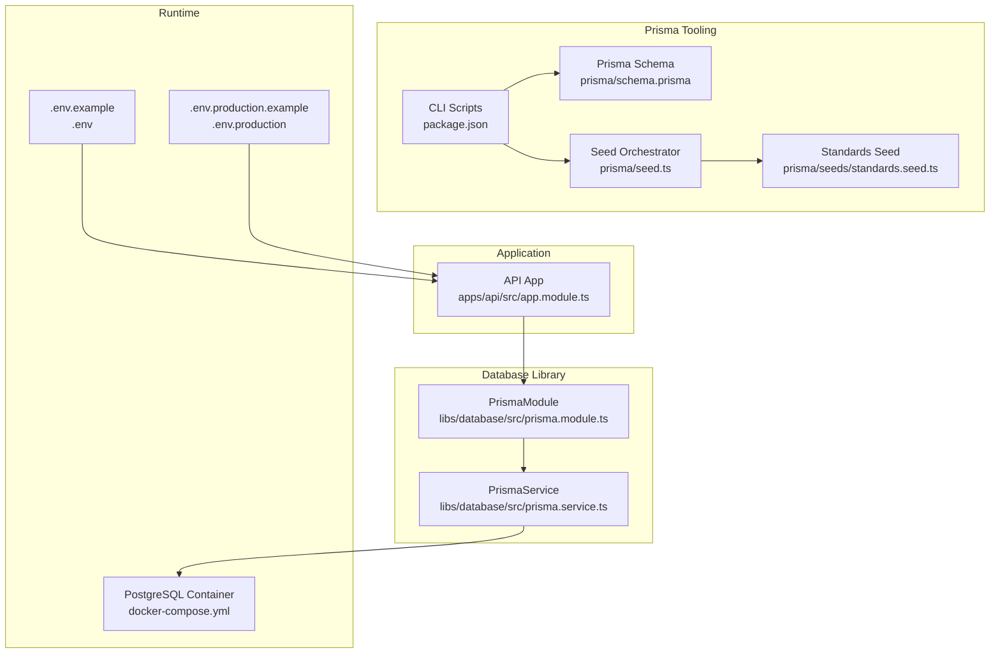
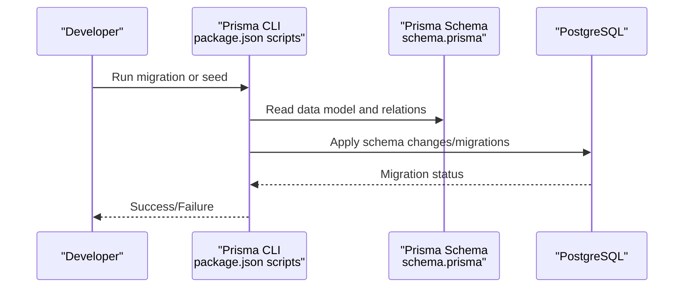
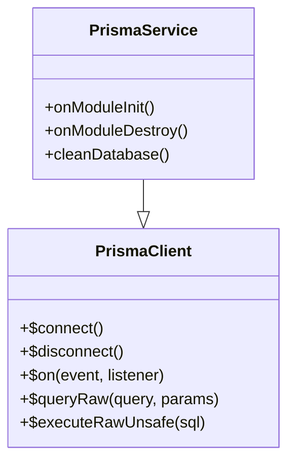
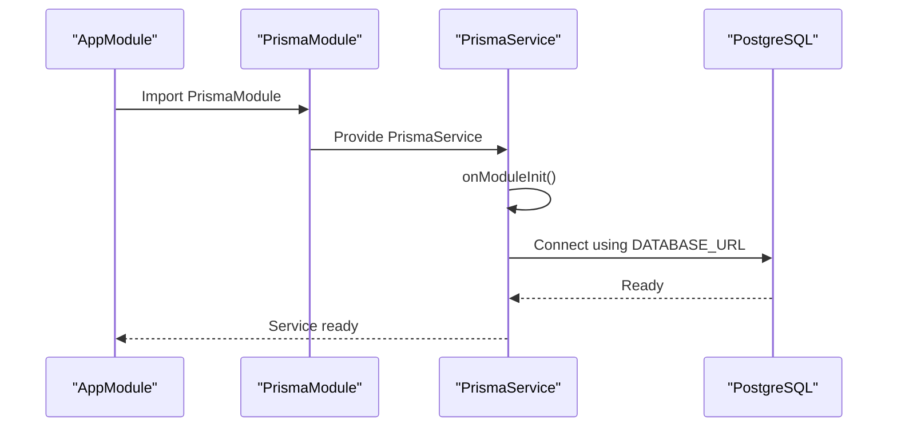
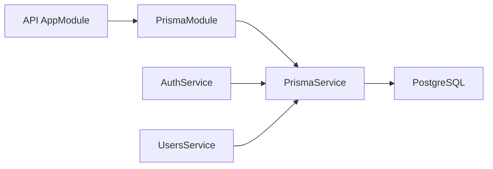

# Database Management

<cite>
**Referenced Files in This Document**
- [schema.prisma](file://prisma/schema.prisma)
- [prisma.service.ts](file://libs/database/src/prisma.service.ts)
- [prisma.module.ts](file://libs/database/src/prisma.module.ts)
- [index.ts](file://libs/database/src/index.ts)
- [seed.ts](file://prisma/seed.ts)
- [standards.seed.ts](file://prisma/seeds/standards.seed.ts)
- [package.json](file://package.json)
- [docker-compose.yml](file://docker-compose.yml)
- [init.sql](file://docker/postgres/init.sql)
- [.env.example](file://.env.example)
- [.env.production.example](file://.env.production.example)
- [app.module.ts](file://apps/api/src/app.module.ts)
- [auth.service.ts](file://apps/api/src/modules/auth/auth.service.ts)
- [users.service.ts](file://apps/api/src/modules/users/users.service.ts)
</cite>

## Table of Contents
1. [Introduction](#introduction)
2. [Project Structure](#project-structure)
3. [Core Components](#core-components)
4. [Architecture Overview](#architecture-overview)
5. [Detailed Component Analysis](#detailed-component-analysis)
6. [Dependency Analysis](#dependency-analysis)
7. [Performance Considerations](#performance-considerations)
8. [Backup and Recovery](#backup-and-recovery)
9. [Export/Import Workflows](#exportimport-workflows)
10. [Schema Versioning](#schema-versioning)
11. [Troubleshooting Guide](#troubleshooting-guide)
12. [Relationship Between Prisma Schema Changes and Application Code](#relationship-between-prisma-schema-changes-and-application-code)
13. [Conclusion](#conclusion)

## Introduction
This document provides comprehensive database management guidance for the Quiz-to-build system built with NestJS and Prisma ORM. It covers schema definition, migration procedures, database operations, seeding strategies, Prisma CLI usage, connection management via a service abstraction, performance optimization, backup/recovery, export/import workflows, schema versioning, troubleshooting, and the relationship between schema changes and application code updates.

## Project Structure
The database layer is encapsulated in a dedicated library that exposes a Prisma service and module. The API application consumes this library to access the database. Migration and seeding are orchestrated via Prisma CLI scripts defined in the monorepo’s root package.json.

**Diagram sources**
- [app.module.ts](file://apps/api/src/app.module.ts#L1-L67)
- [prisma.module.ts](file://libs/database/src/prisma.module.ts#L1-L10)
- [prisma.service.ts](file://libs/database/src/prisma.service.ts#L1-L62)
- [schema.prisma](file://prisma/schema.prisma#L1-L447)
- [seed.ts](file://prisma/seed.ts#L1-L495)
- [standards.seed.ts](file://prisma/seeds/standards.seed.ts#L1-L361)
- [docker-compose.yml](file://docker-compose.yml#L1-L77)
- [.env.example](file://.env.example#L1-L33)
- [.env.production.example](file://.env.production.example#L1-L66)

**Section sources**
- [app.module.ts](file://apps/api/src/app.module.ts#L1-L67)
- [prisma.module.ts](file://libs/database/src/prisma.module.ts#L1-L10)
- [prisma.service.ts](file://libs/database/src/prisma.service.ts#L1-L62)
- [schema.prisma](file://prisma/schema.prisma#L1-L447)
- [seed.ts](file://prisma/seed.ts#L1-L495)
- [standards.seed.ts](file://prisma/seeds/standards.seed.ts#L1-L361)
- [package.json](file://package.json#L1-L65)
- [docker-compose.yml](file://docker-compose.yml#L1-L77)
- [.env.example](file://.env.example#L1-L33)
- [.env.production.example](file://.env.production.example#L1-L66)

## Core Components
- Prisma schema defines the data model, enums, relations, and indexes.
- PrismaService extends PrismaClient with lifecycle hooks, logging, slow query detection, and a cleanDatabase utility for tests.
- PrismaModule provides a globally available PrismaService singleton.
- Seed orchestrator creates organizations, users, questionnaires, sections, questions, visibility rules, and triggers standards seeding.
- Standards seed populates engineering standards and document-type-to-standard mappings.
- CLI scripts manage client generation, migrations, seeding, and local development.

**Section sources**
- [schema.prisma](file://prisma/schema.prisma#L1-L447)
- [prisma.service.ts](file://libs/database/src/prisma.service.ts#L1-L62)
- [prisma.module.ts](file://libs/database/src/prisma.module.ts#L1-L10)
- [seed.ts](file://prisma/seed.ts#L1-L495)
- [standards.seed.ts](file://prisma/seeds/standards.seed.ts#L1-L361)
- [package.json](file://package.json#L10-L33)

## Architecture Overview
The API application imports PrismaModule, which injects PrismaService. PrismaService connects to PostgreSQL using DATABASE_URL from environment variables. During development, docker-compose provisions a Postgres container and initializes extensions and privileges. In production, DATABASE_URL points to Azure Database for PostgreSQL.

**Diagram sources**
- [package.json](file://package.json#L24-L29)
- [schema.prisma](file://prisma/schema.prisma#L1-L11)
- [docker-compose.yml](file://docker-compose.yml#L4-L23)

**Section sources**
- [app.module.ts](file://apps/api/src/app.module.ts#L44-L45)
- [prisma.module.ts](file://libs/database/src/prisma.module.ts#L1-L10)
- [prisma.service.ts](file://libs/database/src/prisma.service.ts#L20-L40)
- [schema.prisma](file://prisma/schema.prisma#L8-L11)
- [docker-compose.yml](file://docker-compose.yml#L4-L23)
- [.env.example](file://.env.example#L6-L7)
- [.env.production.example](file://.env.production.example#L14-L15)

## Detailed Component Analysis

### Prisma Schema and Data Model
The schema defines:
- Enumerations for roles, question types, session status, visibility actions, document categories/statuses, and standard categories.
- Core entities: Organization, User, RefreshToken, ApiKey, Questionnaire, Section, Question, VisibilityRule, Session, Response, DocumentType, Document, AuditLog, EngineeringStandard, and DocumentTypeStandard.
- Indexes are strategically placed on frequently queried columns (e.g., email, organizationId, role, status, createdAt).
- Relations enforce referential integrity and cascade deletes where appropriate.

**Diagram sources**
- [schema.prisma](file://prisma/schema.prisma#L82-L446)

**Section sources**
- [schema.prisma](file://prisma/schema.prisma#L17-L76)
- [schema.prisma](file://prisma/schema.prisma#L82-L446)

### Prisma Service Abstraction
PrismaService:
- Extends PrismaClient and implements lifecycle hooks to connect/disconnect on module init/destroy.
- Logs slow queries in development based on duration thresholds.
- Provides cleanDatabase for test environments to truncate tables safely.

**Diagram sources**
- [prisma.service.ts](file://libs/database/src/prisma.service.ts#L1-L62)

**Section sources**
- [prisma.service.ts](file://libs/database/src/prisma.service.ts#L1-L62)

### Database Connection Management
- DATABASE_URL is loaded from environment variables (.env or .env.production).
- docker-compose sets DATABASE_URL for development and starts a Postgres container with health checks.
- PrismaModule exports PrismaService globally so any module can inject it.

**Diagram sources**
- [app.module.ts](file://apps/api/src/app.module.ts#L44-L45)
- [prisma.module.ts](file://libs/database/src/prisma.module.ts#L1-L10)
- [prisma.service.ts](file://libs/database/src/prisma.service.ts#L20-L40)
- [docker-compose.yml](file://docker-compose.yml#L54-L58)
- [.env.example](file://.env.example#L6-L7)
- [.env.production.example](file://.env.production.example#L14-L15)

**Section sources**
- [app.module.ts](file://apps/api/src/app.module.ts#L44-L45)
- [prisma.module.ts](file://libs/database/src/prisma.module.ts#L1-L10)
- [prisma.service.ts](file://libs/database/src/prisma.service.ts#L20-L40)
- [docker-compose.yml](file://docker-compose.yml#L54-L58)
- [.env.example](file://.env.example#L6-L7)
- [.env.production.example](file://.env.production.example#L14-L15)

### Seeding Strategy
The seed orchestrator performs:
- Upsert default organization and admin user.
- Create the main questionnaire with sections and questions.
- Insert visibility rules for conditional logic.
- Trigger standards seeding to populate engineering standards and document-type-to-standard mappings.

**Diagram sources**
- [seed.ts](file://prisma/seed.ts#L6-L485)
- [standards.seed.ts](file://prisma/seeds/standards.seed.ts#L274-L349)

**Section sources**
- [seed.ts](file://prisma/seed.ts#L6-L485)
- [standards.seed.ts](file://prisma/seeds/standards.seed.ts#L1-L361)

### Prisma CLI Commands
Common commands used in this project:
- Generate Prisma Client: db:generate
- Create and apply migrations locally: db:migrate
- Deploy migrations in production: db:migrate:prod
- Seed the database: db:seed
- Open Prisma Studio: db:studio
- Reset migrations (development): db:reset
- Local Docker stack: docker:up, docker:down, docker:logs

These are defined in the root package.json scripts and configured to use ts-node for the seed entry point.

**Section sources**
- [package.json](file://package.json#L24-L29)
- [package.json](file://package.json#L48-L50)

## Dependency Analysis
- The API app depends on PrismaModule to access PrismaService.
- Services (e.g., AuthService, UsersService) depend on PrismaService for database operations.
- The database library is self-contained and exposes PrismaService and PrismaModule.

**Diagram sources**
- [app.module.ts](file://apps/api/src/app.module.ts#L44-L45)
- [prisma.module.ts](file://libs/database/src/prisma.module.ts#L1-L10)
- [prisma.service.ts](file://libs/database/src/prisma.service.ts#L1-L62)
- [auth.service.ts](file://apps/api/src/modules/auth/auth.service.ts#L12-L17)
- [users.service.ts](file://apps/api/src/modules/users/users.service.ts#L2-L4)

**Section sources**
- [app.module.ts](file://apps/api/src/app.module.ts#L44-L45)
- [prisma.module.ts](file://libs/database/src/prisma.module.ts#L1-L10)
- [prisma.service.ts](file://libs/database/src/prisma.service.ts#L1-L62)
- [auth.service.ts](file://apps/api/src/modules/auth/auth.service.ts#L12-L17)
- [users.service.ts](file://apps/api/src/modules/users/users.service.ts#L2-L4)

## Performance Considerations
- Indexes: The schema includes strategic indexes on frequently filtered/sorted columns (e.g., email, organizationId, role, status, createdAt, composite indexes for foreign keys and ordering).
- Queries: Services commonly use findUnique/findMany with includes and counts; ensure projections minimize data transfer.
- Logging: PrismaService logs slow queries in development to surface performance issues early.
- Connection lifecycle: Proper connect/disconnect in service lifecycle avoids connection leaks.

Recommendations:
- Add composite indexes for frequent join/filter combinations (e.g., userId + status on sessions).
- Use select projections to avoid loading unnecessary JSON fields.
- Monitor Prisma query logs and slow query warnings.
- Consider pagination for large lists (already used in UsersService).

**Section sources**
- [schema.prisma](file://prisma/schema.prisma#L94-L96)
- [schema.prisma](file://prisma/schema.prisma#L126-L130)
- [schema.prisma](file://prisma/schema.prisma#L143-L146)
- [schema.prisma](file://prisma/schema.prisma#L213-L215)
- [schema.prisma](file://prisma/schema.prisma#L243-L246)
- [schema.prisma](file://prisma/schema.prisma#L294-L299)
- [schema.prisma](file://prisma/schema.prisma#L317-L321)
- [schema.prisma](file://prisma/schema.prisma#L346-L348)
- [schema.prisma](file://prisma/schema.prisma#L376-L380)
- [schema.prisma](file://prisma/schema.prisma#L425-L427)
- [schema.prisma](file://prisma/schema.prisma#L442-L445)
- [prisma.service.ts](file://libs/database/src/prisma.service.ts#L25-L33)
- [users.service.ts](file://apps/api/src/modules/users/users.service.ts#L129-L164)

## Backup and Recovery
- Local development: Use docker-compose volumes for persistent data. Back up the postgres_data volume regularly.
- Production: Use managed PostgreSQL backups (e.g., Azure Database for PostgreSQL automated/point-in-time recovery). Ensure DATABASE_URL includes sslmode=require for production.
- Disaster recovery: Test restore procedures against a staging environment before applying to production.

[No sources needed since this section provides general guidance]

## Export/Import Workflows
- Use Prisma Data Proxy or psql logical backups for non-development environments.
- For development, export/import can leverage Prisma seed scripts or SQL dumps from docker volumes.
- Keep seed data versioned alongside schema changes to ensure reproducibility.

[No sources needed since this section provides general guidance]

## Schema Versioning
- Use Prisma migrations for controlled schema evolution. In development, create and apply migrations locally; in production, deploy migrations using the production migration command.
- Treat seed data as separate from schema migrations; seed scripts should be idempotent and upsert data.

**Section sources**
- [package.json](file://package.json#L24-L29)
- [seed.ts](file://prisma/seed.ts#L481-L482)

## Troubleshooting Guide
Common issues and resolutions:
- Connection failures
  - Verify DATABASE_URL matches environment (development vs. production).
  - Confirm Postgres container health and network connectivity.
  - Ensure required extensions are enabled in the database.
- Slow queries
  - Review PrismaService slow query logs in development.
  - Add missing indexes based on query patterns.
- Migration errors
  - Reset migrations in development if stuck (use the reset script).
  - Re-run migrations after resolving schema conflicts.
- Seed failures
  - Ensure prerequisites (e.g., extensions) are initialized.
  - Check seed script logs for upsert errors.

**Section sources**
- [prisma.service.ts](file://libs/database/src/prisma.service.ts#L25-L33)
- [docker-compose.yml](file://docker-compose.yml#L17-L21)
- [init.sql](file://docker/postgres/init.sql#L4-L8)
- [package.json](file://package.json#L29-L29)

## Relationship Between Prisma Schema Changes and Application Code
- After modifying schema.prisma, regenerate the Prisma Client and re-run migrations.
- Update application code to align with new fields, relations, and enums.
- Ensure DTOs and service methods reflect schema changes.
- Re-seed data if new reference data or defaults are introduced.

**Section sources**
- [schema.prisma](file://prisma/schema.prisma#L4-L6)
- [package.json](file://package.json#L24-L29)
- [seed.ts](file://prisma/seed.ts#L481-L482)

## Conclusion
The Quiz-to-build system employs a clean separation of concerns around database access via a dedicated Prisma service/module, robust seeding for initial reference data, and a pragmatic migration and CLI workflow. By leveraging schema indexes, careful query design, and environment-specific configurations, the system achieves reliable development and production operations. Adhering to the migration and seeding practices outlined here ensures consistent schema evolution and dependable data initialization across environments.