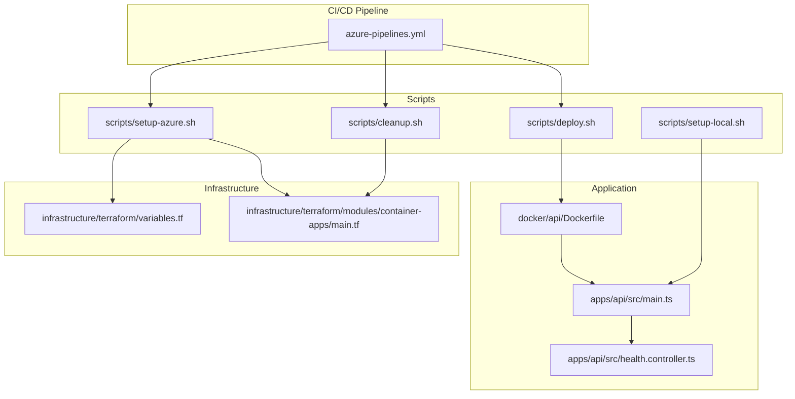
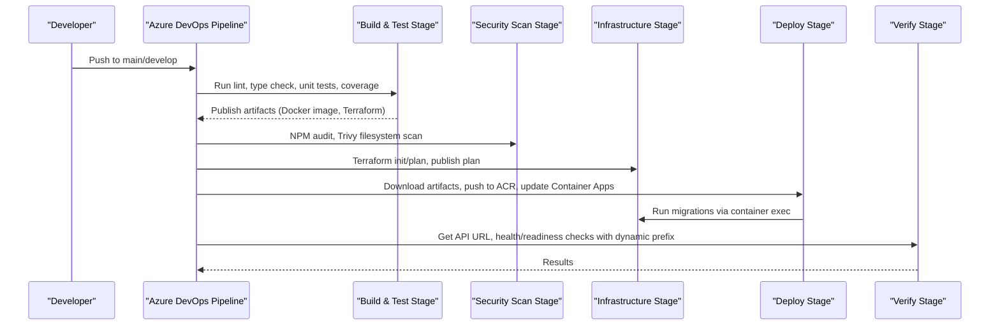
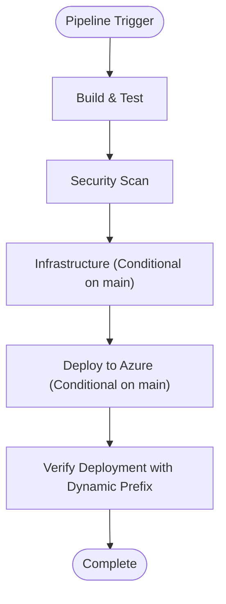
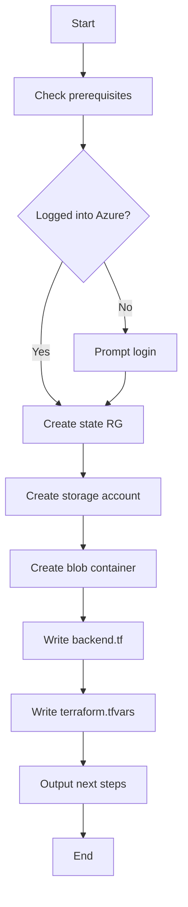
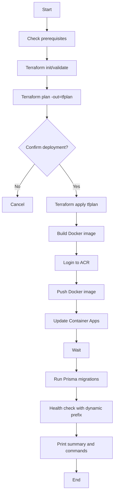
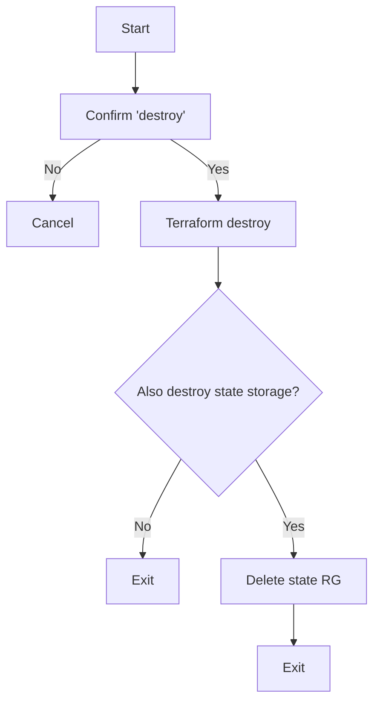
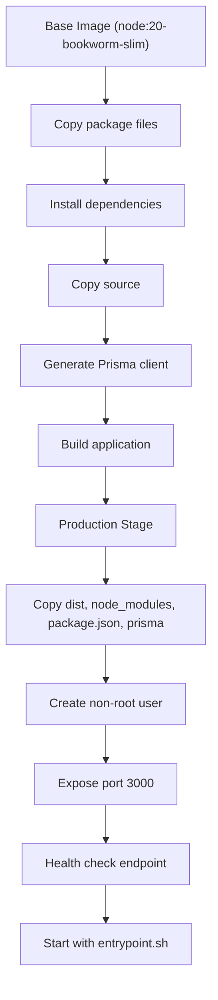
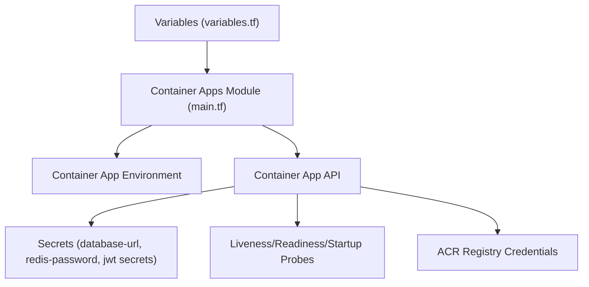
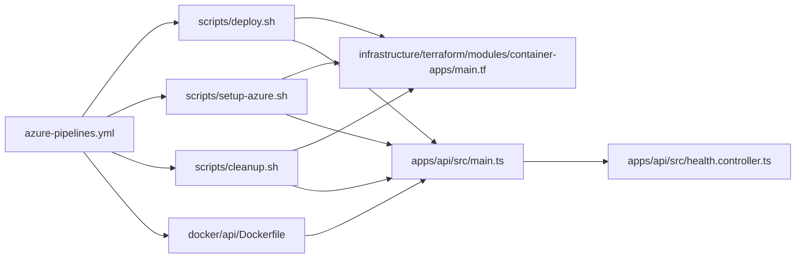

# CI/CD Pipeline

<cite>
**Referenced Files in This Document**
- [azure-pipelines.yml](file://azure-pipelines.yml)
- [deploy.sh](file://scripts/deploy.sh)
- [setup-azure.sh](file://scripts/setup-azure.sh)
- [cleanup.sh](file://scripts/cleanup.sh)
- [Dockerfile](file://docker/api/Dockerfile)
- [main.ts](file://apps/api/src/main.ts)
- [health.controller.ts](file://apps/api/src/health.controller.ts)
- [package.json](file://package.json)
- [variables.tf](file://infrastructure/terraform/variables.tf)
- [main.tf](file://infrastructure/terraform/modules/container-apps/main.tf)
- [setup-local.sh](file://scripts/setup-local.sh)
- [dev-start.sh](file://scripts/dev-start.sh)
- [setup-custom-domain.sh](file://scripts/setup-custom-domain.sh)
</cite>

## Update Summary
**Changes Made**
- Updated health endpoint URL structure documentation to reflect API prefix application to all endpoints
- Modified CI/CD pipeline verification steps to use dynamic API prefix instead of hardcoded `/api/v1/`
- Updated deployment scripts documentation to reflect health endpoint URL changes
- Enhanced troubleshooting guidance for health endpoint access patterns
- Updated environment variable documentation for API prefix configuration

## Table of Contents
1. [Introduction](#introduction)
2. [Project Structure](#project-structure)
3. [Core Components](#core-components)
4. [Architecture Overview](#architecture-overview)
5. [Detailed Component Analysis](#detailed-component-analysis)
6. [Dependency Analysis](#dependency-analysis)
7. [Performance Considerations](#performance-considerations)
8. [Troubleshooting Guide](#troubleshooting-guide)
9. [Conclusion](#conclusion)
10. [Appendices](#appendices)

## Introduction
This document describes the comprehensive Azure DevOps CI/CD pipeline for the Quiz-to-build system. The pipeline implements a complete DevOps workflow covering build and test automation, security scanning, infrastructure provisioning with Terraform, automated deployment to Azure Container Apps, and comprehensive verification processes. It includes detailed documentation of the Azure DevOps YAML pipeline configuration, automated deployment scripts for environment initialization, production deployment, and resource cleanup, along with guidance for triggers, branch policies, approvals, environment management, testing automation, code quality, security scanning, customization, manual deployment, rollback strategies, monitoring, failure handling, performance optimization, secrets management, environment variables, and notifications.

**Updated** The health endpoint URL structure has been updated to reflect the application of API prefix to all endpoints, including health checks. The main.ts bootstrap configuration now applies the API prefix globally, affecting all endpoint URLs.

## Project Structure
The CI/CD implementation spans the Azure DevOps YAML pipeline, Bash deployment scripts, Docker configuration, NestJS API application, and Terraform infrastructure modules. The system follows a staged approach with build, security, infrastructure provisioning, deployment, and verification phases.



**Diagram sources**
- [azure-pipelines.yml](file://azure-pipelines.yml#L1-L781)
- [deploy.sh](file://scripts/deploy.sh#L1-L294)
- [setup-azure.sh](file://scripts/setup-azure.sh#L1-L283)
- [cleanup.sh](file://scripts/cleanup.sh#L1-L103)
- [setup-local.sh](file://scripts/setup-local.sh#L1-L349)
- [Dockerfile](file://docker/api/Dockerfile#L1-L159)
- [main.ts](file://apps/api/src/main.ts#L1-L110)
- [health.controller.ts](file://apps/api/src/health.controller.ts#L1-L42)
- [variables.tf](file://infrastructure/terraform/variables.tf#L1-L129)
- [main.tf](file://infrastructure/terraform/modules/container-apps/main.tf#L1-L216)

**Section sources**
- [azure-pipelines.yml](file://azure-pipelines.yml#L1-L781)
- [package.json](file://package.json#L1-L129)

## Core Components
- **Azure DevOps Pipeline**: Orchestrates comprehensive CI/CD workflow with five distinct stages - Build & Test, Security Scan, Infrastructure, Deploy, and Verify
- **Automated Deployment Scripts**: Initialize Azure resources, deploy infrastructure and application images, and clean up resources with comprehensive error handling
- **Docker Configuration**: Multi-stage Dockerfile with production and development targets, health checks, and non-root user security
- **Terraform Infrastructure**: Modular infrastructure provisioning for Azure Container Apps, networking, databases, Redis, and container registries
- **Application Bootstrap**: NestJS application with security middleware, CORS configuration, Swagger documentation, and health endpoints with dynamic API prefix

**Updated** The application bootstrap now applies the API prefix globally to all endpoints, including health checks, making the health endpoint URL structure dynamic based on the API_PREFIX environment variable.

**Section sources**
- [azure-pipelines.yml](file://azure-pipelines.yml#L4-L781)
- [deploy.sh](file://scripts/deploy.sh#L1-L294)
- [setup-azure.sh](file://scripts/setup-azure.sh#L1-L283)
- [cleanup.sh](file://scripts/cleanup.sh#L1-L103)
- [Dockerfile](file://docker/api/Dockerfile#L1-L159)
- [main.tf](file://infrastructure/terraform/modules/container-apps/main.tf#L1-L216)
- [main.ts](file://apps/api/src/main.ts#L1-L110)

## Architecture Overview
The pipeline follows a five-stage flow: comprehensive build and testing, security scanning, infrastructure provisioning, deployment to Azure Container Apps, and thorough verification. Each stage produces artifacts consumed by subsequent stages, ensuring reliable and repeatable deployments.



**Diagram sources**
- [azure-pipelines.yml](file://azure-pipelines.yml#L4-L781)

## Detailed Component Analysis

### Azure DevOps Pipeline Configuration
The pipeline implements a comprehensive five-stage CI/CD workflow:

**Triggers and PRs**: Builds run on main and develop branches with Markdown/docs path exclusions. Pull requests target main and develop branches for review and testing.

**Variables**: Comprehensive Azure configuration including subscription, resource group, Container Apps name, ACR name, Node version, image naming, Terraform version, and working directory configuration.

**Pool**: Ubuntu latest VM image for consistent Linux-based builds.

**Stage 1: Build & Test**
- Node.js setup with caching for npm packages
- Dependency installation with npm ci for deterministic builds
- ESLint for code quality and TypeScript type checking
- Unit tests with coverage reporting via Turbo
- Docker image build with multi-stage production target
- Artifact publishing for Docker images and Terraform files

**Stage 2: Security Scan**
- NPM audit with high severity threshold
- Trivy filesystem scan for container vulnerabilities
- Both tasks configured to continue on error for non-blocking security checks

**Stage 3: Infrastructure (Terraform)**
- Conditional execution on main branch only
- Separate jobs for planning and applying infrastructure changes
- Terraform state management with Azure backend configuration
- Plan artifact publication for manual approval workflow

**Stage 4: Deploy**
- Conditional execution on main branch with successful Build/Infrastructure
- Azure Container Registry authentication and image tagging
- Container Apps deployment with image updates
- Database migrations via container exec commands

**Stage 5: Verify**
- API URL extraction from Container Apps configuration
- **Updated** Health endpoint verification using dynamic API prefix instead of hardcoded `/api/v1/`
- Readiness endpoint validation
- Comprehensive deployment information output



**Diagram sources**
- [azure-pipelines.yml](file://azure-pipelines.yml#L4-L781)

**Section sources**
- [azure-pipelines.yml](file://azure-pipelines.yml#L4-L781)

### Automated Deployment Scripts

#### setup-azure.sh
The setup script automates Azure infrastructure preparation with comprehensive validation and configuration:

**Prerequisite Validation**: Checks for Azure CLI, Terraform, and Docker installations with detailed error messages and installation guidance.

**Azure Authentication**: Verifies Azure CLI login status and initiates interactive login if needed, capturing subscription information.

**State Storage Creation**: Creates dedicated resource group, storage account, and blob container for Terraform state management with security best practices.

**Configuration Generation**: Generates backend.tf with dynamic values and terraform.tfvars with project configuration including tags and environment variables.

**Output and Next Steps**: Provides clear summary of created resources and next steps for deployment execution.



**Diagram sources**
- [setup-azure.sh](file://scripts/setup-azure.sh#L1-L283)

**Section sources**
- [setup-azure.sh](file://scripts/setup-azure.sh#L1-L283)

#### deploy.sh
The deployment script provides comprehensive automation for infrastructure provisioning and application deployment:

**Prerequisite Validation**: Ensures Azure CLI authentication and terraform.tfvars existence before proceeding.

**Terraform Lifecycle**: Full Terraform workflow including initialization, validation, planning with tfplan, manual confirmation, and application of infrastructure changes.

**Container Registry Operations**: Builds Docker image with production target, authenticates to ACR, and pushes images with latest tag.

**Container Apps Deployment**: Updates Container Apps with new image, waits for deployment completion, and executes database migrations via container exec.

**Health Verification**: **Updated** Health check loop with dynamic API prefix URL construction instead of hardcoded `/api/v1/` path.

**Summary and Commands**: Provides complete deployment summary with application URLs, Azure resource information, and useful operational commands.



**Diagram sources**
- [deploy.sh](file://scripts/deploy.sh#L1-L294)

**Section sources**
- [deploy.sh](file://scripts/deploy.sh#L1-L294)

#### cleanup.sh
The cleanup script provides safe resource destruction with confirmation and optional state storage cleanup:

**Destructive Action Confirmation**: Requires explicit "destroy" confirmation to prevent accidental resource deletion.

**Infrastructure Destruction**: Executes Terraform destroy with auto-approval for complete resource cleanup.

**State Storage Options**: Offers optional destruction of Terraform state storage resource group with user confirmation.

**Progress Indication**: Provides clear progress indication and completion confirmation throughout the cleanup process.



**Diagram sources**
- [cleanup.sh](file://scripts/cleanup.sh#L1-L103)

**Section sources**
- [cleanup.sh](file://scripts/cleanup.sh#L1-L103)

### Docker Image Build and Probes
The Docker configuration implements a sophisticated multi-stage build process optimized for production deployment:

**Multi-Stage Build Process**: Builder stage uses Debian slim for Prisma compatibility, followed by production stage with Alpine Linux for minimal footprint.

**Security Hardening**: Non-root user creation (nestjs:nodejs) with proper file ownership and group assignments for secure container execution.

**Health Check Implementation**: Comprehensive health checks using wget for HTTP endpoint verification with configurable intervals, timeouts, and retry thresholds.

**Entrypoint Configuration**: Production stage uses entrypoint script for enhanced startup behavior and development stage uses direct npm start:dev command.

**Optimization Features**: Careful dependency management, selective file copying, and optimized layer structure for reduced image size and improved security.



**Diagram sources**
- [Dockerfile](file://docker/api/Dockerfile#L1-L159)
- [health.controller.ts](file://apps/api/src/health.controller.ts#L1-L42)

**Section sources**
- [Dockerfile](file://docker/api/Dockerfile#L1-L159)
- [health.controller.ts](file://apps/api/src/health.controller.ts#L1-L42)

### Infrastructure Provisioning with Terraform
The Terraform implementation provides modular infrastructure provisioning for Azure Container Apps:

**Variable Configuration**: Comprehensive variables for project naming, environment settings, location selection, and resource sizing including networking, database, Redis, container specifications, and ACR SKU.

**Container Apps Module**: Deploys complete Container Apps environment with API service, system-assigned identity, and comprehensive environment variable configuration.

**Probes Configuration**: Detailed liveness, readiness, and startup probes with configurable thresholds, intervals, and timeouts for optimal container health management.

**Secret Management**: Secure secret configuration for database connections, Redis credentials, JWT tokens, and ACR authentication using Azure Key Vault-backed managed identities.

**Registry Integration**: Automatic container registry configuration with ACR credentials and image pull secrets for seamless deployment workflow.



**Diagram sources**
- [variables.tf](file://infrastructure/terraform/variables.tf#L1-L129)
- [main.tf](file://infrastructure/terraform/modules/container-apps/main.tf#L1-L216)

**Section sources**
- [variables.tf](file://infrastructure/terraform/variables.tf#L1-L129)
- [main.tf](file://infrastructure/terraform/modules/container-apps/main.tf#L1-L216)

### Application Bootstrapping and Health Endpoints
The NestJS application implements comprehensive security and configuration management:

**Security Middleware**: Helmet integration for HTTP header security, CORS configuration with flexible origin settings, and global security headers.

**Global Configuration**: Centralized configuration through ConfigService with environment-aware settings for ports, API prefixes, and logging levels.

**Validation and Interceptors**: Global ValidationPipe with transformation capabilities, TransformInterceptor for response formatting, and LoggingInterceptor for request/response logging.

**Documentation**: Swagger documentation generation with comprehensive API documentation for development environments, including authentication schemes and endpoint categorization.

**Graceful Shutdown**: Proper shutdown hook configuration for graceful application termination and resource cleanup.

**Updated** The application now applies the API prefix globally to all endpoints, including health checks. The health controller endpoints are now accessible at `/api/v1/health`, `/api/v1/health/ready`, and `/api/v1/health/live` based on the API_PREFIX environment variable configuration.

```mermaid
classDiagram
class MainBootstrap {
+configureSecurity()
+configureCORS()
+setGlobalPrefix() : Applies API prefix to all endpoints
+registerValidationPipe()
+registerGlobalFilters()
+registerGlobalInterceptors()
+setupSwagger()
+enableShutdownHooks()
}
class HealthController {
+check() HealthResponse : Accessible at /api/v1/health
+ready() { ready : boolean } : Accessible at /api/v1/health/ready
+live() { alive : boolean } : Accessible at /api/v1/health/live
}
MainBootstrap --> HealthController : "applies API prefix to all endpoints"
```

**Diagram sources**
- [main.ts](file://apps/api/src/main.ts#L1-L110)
- [health.controller.ts](file://apps/api/src/health.controller.ts#L1-L42)

**Section sources**
- [main.ts](file://apps/api/src/main.ts#L1-L110)
- [health.controller.ts](file://apps/api/src/health.controller.ts#L1-L42)

## Dependency Analysis
The CI/CD system establishes clear dependencies between pipeline stages, scripts, and infrastructure components:

**Pipeline Dependencies**: Azure DevOps pipeline orchestrates script execution, artifact consumption, and stage coordination with conditional execution based on branch and success criteria.

**Script Dependencies**: Deployment scripts depend on Terraform modules, Azure CLI authentication, and Docker image availability for successful infrastructure provisioning and application deployment.

**Infrastructure Dependencies**: Container Apps consume secrets and environment variables configured in Terraform modules, with proper dependency chains for database connectivity, Redis integration, and registry authentication.

**Application Dependencies**: NestJS application relies on Docker image produced by build stage, with health endpoints consumed by Container Apps probes and pipeline verification.

**Updated** All health endpoint references now depend on the dynamic API prefix configuration rather than hardcoded paths.



**Diagram sources**
- [azure-pipelines.yml](file://azure-pipelines.yml#L1-L781)
- [deploy.sh](file://scripts/deploy.sh#L1-L294)
- [setup-azure.sh](file://scripts/setup-azure.sh#L1-L283)
- [cleanup.sh](file://scripts/cleanup.sh#L1-L103)
- [main.tf](file://infrastructure/terraform/modules/container-apps/main.tf#L1-L216)
- [Dockerfile](file://docker/api/Dockerfile#L1-L159)
- [main.ts](file://apps/api/src/main.ts#L1-L110)
- [health.controller.ts](file://apps/api/src/health.controller.ts#L1-L42)

**Section sources**
- [azure-pipelines.yml](file://azure-pipelines.yml#L1-L781)
- [deploy.sh](file://scripts/deploy.sh#L1-L294)
- [setup-azure.sh](file://scripts/setup-azure.sh#L1-L283)
- [cleanup.sh](file://scripts/cleanup.sh#L1-L103)
- [main.tf](file://infrastructure/terraform/modules/container-apps/main.tf#L1-L216)
- [Dockerfile](file://docker/api/Dockerfile#L1-L159)
- [main.ts](file://apps/api/src/main.ts#L1-L110)
- [health.controller.ts](file://apps/api/src/health.controller.ts#L1-L42)

## Performance Considerations
The CI/CD pipeline implements several performance optimization strategies:

**Parallel Execution**: Pipeline stages are designed to minimize unnecessary waits, with security and infrastructure stages dependent on successful completion of earlier stages.

**Artifact Optimization**: Docker images and Terraform files are published and reused across stages, reducing redundant processing and improving overall pipeline efficiency.

**Caching Strategy**: npm cache utilization during build phase significantly reduces dependency installation time and improves build reliability.

**Image Optimization**: Multi-stage Docker build process reduces production image size, improving cold start performance and deployment speed.

**Health Probes**: Container Apps probes ensure quick detection of unhealthy instances, enabling rapid recovery and improved system reliability.

**Resource Sizing**: Configurable container CPU, memory, and replica settings allow optimization for different environments and workload patterns.

**Updated** Health endpoint performance is now optimized through the global API prefix configuration, ensuring consistent endpoint access patterns across all environments.

## Troubleshooting Guide
Comprehensive troubleshooting guidance for pipeline and deployment issues:

**Pipeline Failures**:
- **Build/Test Stage**: Review test results and coverage artifacts; ensure lint/type checks pass; verify npm cache configuration and dependency installation
- **Security Stage**: NPM audit and Trivy scans configured to continue on error; review logs for high/Critical severity findings; check Trivy installation and filesystem permissions
- **Infrastructure Stage**: Verify Terraform plan artifact exists and apply stage can download it; check backend configuration and Azure service connection; validate Terraform state storage accessibility
- **Deploy Stage**: Confirm ACR login succeeds, image push completes, and Container Apps update command executes; verify migrations via container exec; check resource group and Container Apps name
- **Verify Stage**: **Updated** Inspect health and readiness checks using dynamic API prefix; adjust wait loops if needed; verify API URL extraction and DNS resolution

**Script Failures**:
- **setup-azure.sh**: Ensure prerequisites are installed and Azure CLI is logged in; verify backend.tf and terraform.tfvars generation; check storage account creation permissions
- **deploy.sh**: Confirm terraform.tfvars exists and contains required variables; review plan confirmation prompt; check ACR credentials and Container Apps resource group permissions
- **cleanup.sh**: Use caution with destructive actions; confirm state storage deletion if desired; verify Terraform state integrity before cleanup

**Infrastructure Issues**:
- **Terraform State**: Verify backend configuration points to correct storage account and container; check state file encryption and access permissions
- **Container Apps**: Validate environment variables match application expectations; check secret management and Key Vault integration; verify network connectivity and firewall rules
- **Database Connectivity**: Confirm database URL format and connectivity; verify SSL/TLS configuration; check database user permissions and network security groups

**Application Issues**:
- **Health Endpoints**: **Updated** Verify health controller implementation and endpoint accessibility with dynamic API prefix; check Container Apps probe configuration; validate application startup sequence
- **Docker Images**: Ensure multi-stage build completes successfully; verify image tags and registry authentication; check container resource limits and health checks
- **Environment Variables**: Validate variable names and values; check for typos in environment variable names; verify production vs development configuration differences

**API Prefix Issues**:
- **Dynamic Prefix**: Ensure API_PREFIX environment variable is correctly configured in Container Apps; verify prefix format matches expected pattern
- **Endpoint Access**: Check that all health endpoints are accessible at `/api/v1/health`, `/api/v1/health/ready`, and `/api/v1/health/live`
- **Verification Scripts**: Update any custom scripts that reference hardcoded health endpoint paths to use dynamic prefix configuration

**Section sources**
- [azure-pipelines.yml](file://azure-pipelines.yml#L140-L781)
- [deploy.sh](file://scripts/deploy.sh#L1-L294)
- [setup-azure.sh](file://scripts/setup-azure.sh#L1-L283)
- [cleanup.sh](file://scripts/cleanup.sh#L1-L103)
- [main.tf](file://infrastructure/terraform/modules/container-apps/main.tf#L35-L216)

## Conclusion
The comprehensive CI/CD pipeline automates the complete lifecycle of the Quiz-to-build system, from code changes to production deployment. The Azure DevOps pipeline coordinates build, test, security, infrastructure provisioning, deployment, and verification stages with robust error handling and artifact management. The automated deployment scripts streamline environment initialization, infrastructure provisioning, application deployment, and resource cleanup. The combination of multi-stage Docker builds, Terraform-managed infrastructure, comprehensive health checks, and security scanning ensures reliable, secure, and repeatable deployments.

**Updated** The recent change to apply API prefix to all endpoints, including health checks, enhances the consistency and predictability of endpoint access patterns across all environments. This change affects all health endpoint references in the CI/CD pipeline and deployment scripts, requiring updates to ensure proper verification and monitoring.

The documented troubleshooting procedures, customization options, and operational guidance provide teams with the tools needed to maintain a resilient and efficient CI/CD pipeline with consistent health endpoint access patterns.

## Appendices

### Pipeline Triggers, Branch Policies, and Approval Workflows
**Trigger Configuration**: Build runs automatically on main and develop branches while excluding documentation changes to optimize pipeline execution. Markdown and docs paths are explicitly excluded from triggering builds.

**Pull Request Management**: PRs target main and develop branches, enabling collaborative code review and testing before merging into protected branches.

**Branch Protection**: Repository-level branch protection policies enforce required reviews, status checks, and successful pipeline completion for main branch commits.

**Approval Workflows**: Manual approval can be added to the Terraform apply job/environment to gate production changes, providing controlled deployment to production environments.

**Section sources**
- [azure-pipelines.yml](file://azure-pipelines.yml#L4-L19)

### Environment Management (Development, Staging, Production)
**Environment Configuration**: The pipeline targets development by default with configurable environment variables for different deployment targets. Modify environment variables and Terraform variables to support staging and production environments.

**Resource Naming**: Container Apps, ACR, and resource groups follow consistent naming conventions suitable for each environment tier with environment-specific suffixes.

**Secrets Management**: Secrets are managed via Azure Key Vault-backed managed identities with environment-specific vault URIs and permissions. Ensure appropriate vault access policies for each environment.

**Configuration Management**: Environment-specific configuration values should be provided via environment-specific .env files and mapped to environment variables in Container Apps.

**API Prefix Configuration**: **Updated** The API_PREFIX environment variable controls the global API prefix applied to all endpoints, including health checks. Configure this variable appropriately for each environment to ensure consistent endpoint access patterns.

**Section sources**
- [azure-pipelines.yml](file://azure-pipelines.yml#L20-L35)
- [variables.tf](file://infrastructure/terraform/variables.tf#L1-L129)
- [main.tf](file://infrastructure/terraform/modules/container-apps/main.tf#L1-L216)
- [main.ts](file://apps/api/src/main.ts#L17-L17)

### Testing Automation, Code Quality, and Security Scanning
**Testing Framework**: Unit tests with coverage reporting via Turbo build system with comprehensive test result publishing and coverage metrics.

**Code Quality**: ESLint with TypeScript configuration and Prettier formatting enforcement through lint-staged hooks and pre-commit automation.

**Security Scanning**: NPM audit with high severity threshold and Trivy filesystem scan configured to continue on error for non-blocking security assessments.

**Test Coverage**: Comprehensive coverage reporting with Cobertura format for integration with Azure DevOps test result visualization and coverage dashboards.

**Section sources**
- [package.json](file://package.json#L10-L34)
- [azure-pipelines.yml](file://azure-pipelines.yml#L149-L159)

### Pipeline Customization, Manual Deployment, and Rollback Strategies
**Pipeline Customization**: Modify variables for Azure resources, Terraform versions, and build parameters. Adjust stage conditions for different branching strategies and add approvals for production deployments.

**Manual Deployment**: Use setup-azure.sh to prepare Terraform state and configuration, then deploy.sh to execute infrastructure provisioning and application deployment with comprehensive verification.

**Rollback Procedures**: Utilize Azure Container Apps revision history to switch to previous stable revisions. Re-run Terraform apply with previously captured plans for infrastructure rollbacks when needed.

**Monitoring Integration**: Enable Application Insights via environment variables in Container Apps for comprehensive runtime monitoring and diagnostics.

**Health Endpoint Customization**: **Updated** When customizing the pipeline for different environments, ensure the API_PREFIX environment variable is properly configured so that health endpoint verification uses the correct URL pattern.

**Section sources**
- [azure-pipelines.yml](file://azure-pipelines.yml#L20-L781)
- [deploy.sh](file://scripts/deploy.sh#L1-L294)
- [setup-azure.sh](file://scripts/setup-azure.sh#L1-L283)

### Monitoring, Failure Handling, and Notifications
**Monitoring Configuration**: Enable Application Insights through environment variables in Container Apps for comprehensive application performance monitoring and diagnostic data collection.

**Failure Handling**: Pipeline tasks are configured to continue on error for optional security scans while maintaining strict enforcement for critical build and deployment steps. Health checks in pipeline and Container Apps probes ensure rapid failure detection.

**Notification Configuration**: Configure Azure DevOps pipeline notifications for build failures, deployment approvals, and environment-specific alerts to keep stakeholders informed of pipeline status.

**Log Collection**: Comprehensive logging through Azure Container Apps logs, Application Insights telemetry, and pipeline execution logs for troubleshooting and audit purposes.

**Health Endpoint Monitoring**: **Updated** Monitor health endpoints using the dynamic API prefix pattern to ensure consistent monitoring across all environments and deployment targets.

**Section sources**
- [main.tf](file://infrastructure/terraform/modules/container-apps/main.tf#L102-L104)
- [azure-pipelines.yml](file://azure-pipelines.yml#L346-L781)

### Secrets Management and Environment Variable Handling
**Secret Storage**: Secrets are managed via Azure Key Vault-backed managed identities with secure secret names referenced in Terraform modules for Container Apps environment variables.

**Environment Variables**: Comprehensive environment variable configuration including application settings, database connections, Redis configuration, JWT tokens, rate limiting, logging levels, and CORS settings.

**Production Security**: Production-specific values should be provided via .env.production files and mapped to environment variables with proper security controls and access restrictions.

**Rotation Strategy**: Implement regular secret rotation procedures with proper key vault access control and application restart procedures to maintain security while minimizing downtime.

**API Prefix Security**: **Updated** The API_PREFIX environment variable should be properly secured and validated to prevent injection attacks. Ensure that the prefix format is validated and sanitized before being applied to all endpoints.

**Section sources**
- [main.tf](file://infrastructure/terraform/modules/container-apps/main.tf#L35-L216)

### Health Endpoint URL Structure Reference
**Current Implementation**: All endpoints, including health checks, are now served under the API prefix configured via the API_PREFIX environment variable.

**Endpoint Patterns**:
- Health check: `{API_URL}/{API_PREFIX}/health`
- Readiness check: `{API_URL}/{API_PREFIX}/health/ready`
- Liveness check: `{API_URL}/{API_PREFIX}/health/live`

**Default Configuration**: The default API_PREFIX is 'api/v1', resulting in endpoints:
- Health check: `{API_URL}/api/v1/health`
- Readiness check: `{API_URL}/api/v1/health/ready`
- Liveness check: `{API_URL}/api/v1/health/live`

**Environment Variations**: Different environments may use different API_PREFIX values, such as 'v1', 'api/v2', or custom prefixes.

**Section sources**
- [main.ts](file://apps/api/src/main.ts#L17-L17)
- [health.controller.ts](file://apps/api/src/health.controller.ts#L13-L13)
- [setup-local.sh](file://scripts/setup-local.sh#L139-L139)
- [setup-local.sh](file://scripts/setup-local.sh#L165-L165)
- [deploy.sh](file://scripts/deploy.sh#L117-L117)
- [deploy.sh](file://scripts/deploy.sh#L263-L263)
- [dev-start.sh](file://scripts/dev-start.sh#L10-L10)
- [dev-start.sh](file://scripts/dev-start.sh#L23-L23)
- [setup-custom-domain.sh](file://scripts/setup-custom-domain.sh#L190-L190)
- [setup-custom-domain.sh](file://scripts/setup-custom-domain.sh#L206-L206)