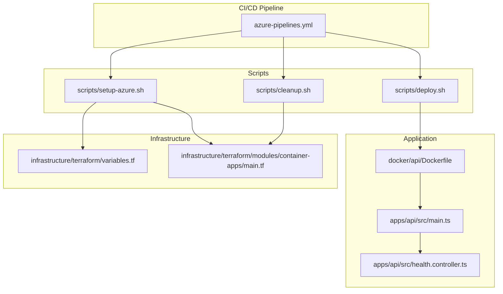
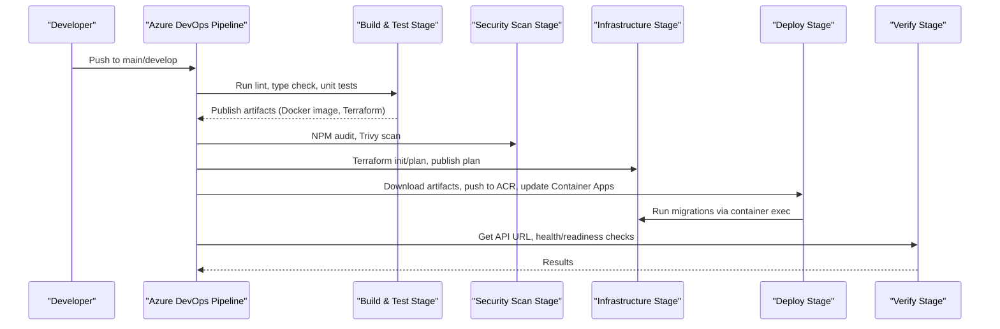
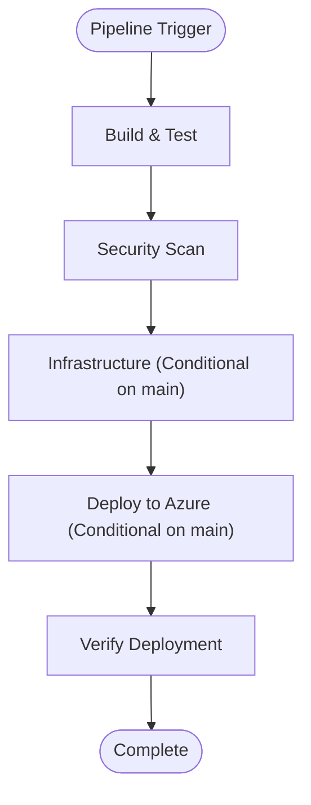
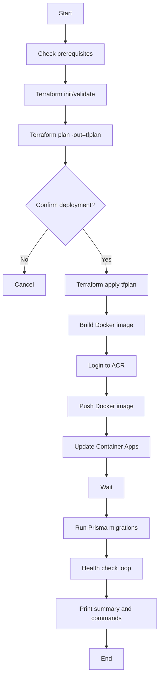
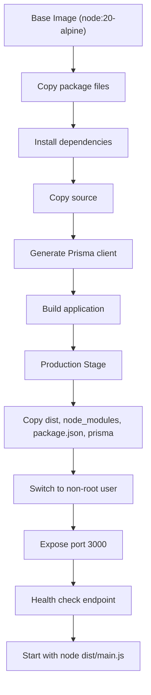
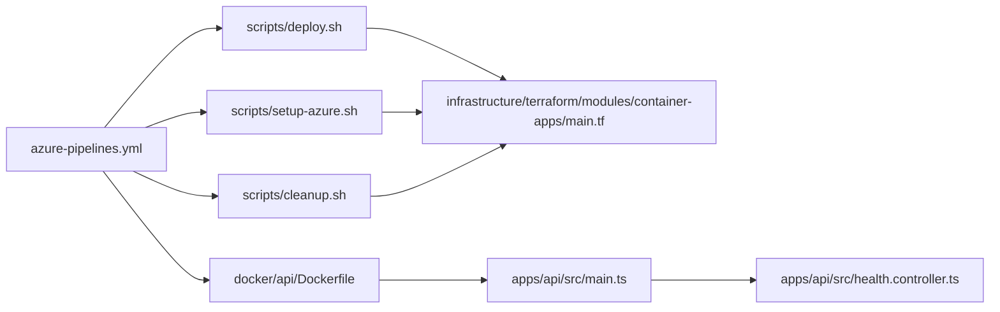

# CI/CD Pipeline

<cite>
**Referenced Files in This Document**
- [azure-pipelines.yml](file://azure-pipelines.yml)
- [deploy.sh](file://scripts/deploy.sh)
- [setup-azure.sh](file://scripts/setup-azure.sh)
- [cleanup.sh](file://scripts/cleanup.sh)
- [Dockerfile](file://docker/api/Dockerfile)
- [main.ts](file://apps/api/src/main.ts)
- [health.controller.ts](file://apps/api/src/health.controller.ts)
- [jest-e2e.json](file://apps/api/test/jest-e2e.json)
- [.eslintrc.js](file://.eslintrc.js)
- [.prettierrc](file://.prettierrc)
- [package.json](file://package.json)
- [turbo.json](file://turbo.json)
- [variables.tf](file://infrastructure/terraform/variables.tf)
- [main.tf](file://infrastructure/terraform/modules/container-apps/main.tf)
</cite>

## Table of Contents
1. [Introduction](#introduction)
2. [Project Structure](#project-structure)
3. [Core Components](#core-components)
4. [Architecture Overview](#architecture-overview)
5. [Detailed Component Analysis](#detailed-component-analysis)
6. [Dependency Analysis](#dependency-analysis)
7. [Performance Considerations](#performance-considerations)
8. [Troubleshooting Guide](#troubleshooting-guide)
9. [Conclusion](#conclusion)
10. [Appendices](#appendices)

## Introduction
This document describes the Azure DevOps CI/CD pipeline for the Quiz-to-build system. It covers the pipeline configuration, build and test stages, artifact management, security scanning, infrastructure provisioning with Terraform, and deployment to Azure Container Apps. It also documents the automated deployment scripts for environment initialization, production deployment, and resource cleanup. Guidance is included for triggers, branch policies, approvals, environment management, testing automation, code quality, security scanning, customization, manual deployment, rollback strategies, monitoring, failure handling, performance optimization, secrets management, environment variables, and notifications.

## Project Structure
The CI/CD implementation spans the Azure DevOps YAML pipeline, Bash deployment scripts, Docker configuration, NestJS API application, and Terraform infrastructure modules.



**Diagram sources**
- [azure-pipelines.yml](file://azure-pipelines.yml#L1-L391)
- [deploy.sh](file://scripts/deploy.sh#L1-L152)
- [setup-azure.sh](file://scripts/setup-azure.sh#L1-L142)
- [cleanup.sh](file://scripts/cleanup.sh#L1-L52)
- [Dockerfile](file://docker/api/Dockerfile#L1-L72)
- [main.ts](file://apps/api/src/main.ts#L1-L93)
- [health.controller.ts](file://apps/api/src/health.controller.ts#L1-L42)
- [variables.tf](file://infrastructure/terraform/variables.tf#L1-L129)
- [main.tf](file://infrastructure/terraform/modules/container-apps/main.tf#L1-L192)

**Section sources**
- [azure-pipelines.yml](file://azure-pipelines.yml#L1-L391)
- [package.json](file://package.json#L1-L65)

## Core Components
- Azure DevOps pipeline orchestrates build, linting, type checking, unit tests, Docker image creation, artifact publishing, security scanning, Terraform infrastructure provisioning, and deployment to Azure Container Apps.
- Automated deployment scripts initialize Azure resources, deploy infrastructure and application images, and clean up resources.
- Dockerfile defines multi-stage builds for production and development, including health checks.
- Terraform modules define Azure Container Apps environment, API service, secrets, probes, and registry configuration.
- Application bootstrapping sets global prefix, CORS, Swagger documentation, and health endpoints.

**Section sources**
- [azure-pipelines.yml](file://azure-pipelines.yml#L4-L391)
- [deploy.sh](file://scripts/deploy.sh#L1-L152)
- [setup-azure.sh](file://scripts/setup-azure.sh#L1-L142)
- [cleanup.sh](file://scripts/cleanup.sh#L1-L52)
- [Dockerfile](file://docker/api/Dockerfile#L1-L72)
- [main.tf](file://infrastructure/terraform/modules/container-apps/main.tf#L1-L192)
- [main.ts](file://apps/api/src/main.ts#L1-L93)

## Architecture Overview
The pipeline follows a staged flow: build and test, security scanning, infrastructure provisioning, deployment, and verification. Artifacts are published and consumed across stages. Deployment updates the Container Apps image and runs database migrations.



**Diagram sources**
- [azure-pipelines.yml](file://azure-pipelines.yml#L4-L391)

## Detailed Component Analysis

### Azure DevOps Pipeline Configuration
- Triggers and PRs: Builds run on main and develop; Markdown/docs paths excluded. Pull requests target main and develop.
- Variables: Azure subscription, resource group, Container Apps name, ACR name, Node version, image name/tag, Terraform version, working directory.
- Pool: Ubuntu latest.
- Stages:
  - Build & Test: Node setup, cache npm, install deps, lint, type check, unit tests with coverage, publish test results and coverage, build app, build Docker image, save/load/publish Docker image artifact, publish Terraform files.
  - Security Scan: NPM audit and Trivy filesystem scan (continue on error).
  - Infrastructure: Conditional on main branch; downloads Terraform files, installs Terraform, initializes backend, plans, publishes plan; apply stage downloads plan, installs Terraform, initializes backend, applies plan.
  - Deploy: Conditional on main branch and successful Build/Infrastructure; downloads Docker image, loads image, logs into ACR, tags/pushes image, updates Container Apps, runs Prisma migrations.
  - Verify: Gets API URL, performs health and readiness checks, prints deployment info.



**Diagram sources**
- [azure-pipelines.yml](file://azure-pipelines.yml#L4-L391)

**Section sources**
- [azure-pipelines.yml](file://azure-pipelines.yml#L4-L391)

### Automated Deployment Scripts

#### setup-azure.sh
- Validates prerequisites (Azure CLI, Terraform, Docker).
- Ensures Azure login.
- Creates Terraform state resource group, storage account, and blob container.
- Writes backend.tf and terraform.tfvars for state management and environment variables.
- Outputs next steps to run the deployment script.


**Diagram sources**
- [setup-azure.sh](file://scripts/setup-azure.sh#L1-L142)

**Section sources**
- [setup-azure.sh](file://scripts/setup-azure.sh#L1-L142)

#### deploy.sh
- Checks prerequisites (login and terraform.tfvars).
- Initializes and validates Terraform, plans with out, prompts for confirmation, applies plan.
- Builds Docker image, logs into ACR, pushes image.
- Updates Container Apps with new image, waits, runs Prisma migrations, performs health checks, prints summary and useful commands.



**Diagram sources**
- [deploy.sh](file://scripts/deploy.sh#L1-L152)

**Section sources**
- [deploy.sh](file://scripts/deploy.sh#L1-L152)

#### cleanup.sh
- Confirms destructive action, destroys Terraform-managed resources, optionally deletes state storage resource group.


**Diagram sources**
- [cleanup.sh](file://scripts/cleanup.sh#L1-L52)

**Section sources**
- [cleanup.sh](file://scripts/cleanup.sh#L1-L52)

### Docker Image Build and Probes
- Multi-stage Dockerfile builds the application, generates Prisma client, and runs a production image with non-root user, exposed port, and health checks.
- Health endpoints are defined in the application and used by Container Apps probes and pipeline verification.



**Diagram sources**
- [Dockerfile](file://docker/api/Dockerfile#L1-L72)
- [health.controller.ts](file://apps/api/src/health.controller.ts#L1-L42)

**Section sources**
- [Dockerfile](file://docker/api/Dockerfile#L1-L72)
- [health.controller.ts](file://apps/api/src/health.controller.ts#L1-L42)

### Infrastructure Provisioning with Terraform
- Variables define project, environment, location, tags, networking, database, Redis, container CPU/memory, replicas, and ACR SKU.
- Container Apps module provisions environment, API service, secrets, registry credentials, and health/readiness/startup probes.
- Environment variables are injected via secret names resolved by Azure Key Vault-backed managed identities.


**Diagram sources**
- [variables.tf](file://infrastructure/terraform/variables.tf#L1-L129)
- [main.tf](file://infrastructure/terraform/modules/container-apps/main.tf#L1-L192)

**Section sources**
- [variables.tf](file://infrastructure/terraform/variables.tf#L1-L129)
- [main.tf](file://infrastructure/terraform/modules/container-apps/main.tf#L1-L192)

### Application Bootstrapping and Health Endpoints
- Bootstrap configures security middleware, CORS, global prefix, validation pipe, global filters/interceptors, and Swagger documentation in non-production environments.
- Health endpoints expose status, readiness, and liveness checks used by Container Apps and pipeline verification.

```mermaid
classDiagram
class MainBootstrap {
+configureSecurity()
+configureCORS()
+setGlobalPrefix()
+registerValidationPipe()
+registerGlobalFilters()
+registerGlobalInterceptors()
+setupSwagger()
+enableShutdownHooks()
}
class HealthController {
+check() HealthResponse
+ready() { ready : boolean }
+live() { alive : boolean }
}
MainBootstrap --> HealthController : "exposes /health endpoints"
```

**Diagram sources**
- [main.ts](file://apps/api/src/main.ts#L1-L93)
- [health.controller.ts](file://apps/api/src/health.controller.ts#L1-L42)

**Section sources**
- [main.ts](file://apps/api/src/main.ts#L1-L93)
- [health.controller.ts](file://apps/api/src/health.controller.ts#L1-L42)

## Dependency Analysis
- Pipeline depends on scripts for infrastructure provisioning and deployment.
- Scripts depend on Terraform modules and Azure CLI.
- Application depends on Docker image produced by the pipeline/build stage.
- Container Apps consumes secrets and environment variables configured in Terraform.



**Diagram sources**
- [azure-pipelines.yml](file://azure-pipelines.yml#L1-L391)
- [deploy.sh](file://scripts/deploy.sh#L1-L152)
- [setup-azure.sh](file://scripts/setup-azure.sh#L1-L142)
- [cleanup.sh](file://scripts/cleanup.sh#L1-L52)
- [main.tf](file://infrastructure/terraform/modules/container-apps/main.tf#L1-L192)
- [Dockerfile](file://docker/api/Dockerfile#L1-L72)
- [main.ts](file://apps/api/src/main.ts#L1-L93)
- [health.controller.ts](file://apps/api/src/health.controller.ts#L1-L42)

**Section sources**
- [azure-pipelines.yml](file://azure-pipelines.yml#L1-L391)
- [deploy.sh](file://scripts/deploy.sh#L1-L152)
- [setup-azure.sh](file://scripts/setup-azure.sh#L1-L142)
- [cleanup.sh](file://scripts/cleanup.sh#L1-L52)
- [main.tf](file://infrastructure/terraform/modules/container-apps/main.tf#L1-L192)
- [Dockerfile](file://docker/api/Dockerfile#L1-L72)
- [main.ts](file://apps/api/src/main.ts#L1-L93)
- [health.controller.ts](file://apps/api/src/health.controller.ts#L1-L42)

## Performance Considerations
- Parallelization: The pipeline stages are designed to minimize unnecessary waits; security and infrastructure stages depend on successful completion of earlier stages.
- Caching: npm cache is used during build to reduce installation time.
- Artifact reuse: Docker image and Terraform files are published and reused across stages.
- Image optimization: Multi-stage Docker build reduces production image size and improves cold start performance.
- Health probes: Container Apps probes ensure quick detection of unhealthy instances.

[No sources needed since this section provides general guidance]

## Troubleshooting Guide
- Pipeline failures:
  - Build/Test: Review test results and coverage artifacts; ensure lint/type checks pass.
  - Security: NPM audit and Trivy are configured to continue on error; review logs for high/Critical severity findings.
  - Infrastructure: Verify Terraform plan artifact exists and apply stage can download it; check backend configuration.
  - Deploy: Confirm ACR login succeeds, image push completes, and Container Apps update command executes; verify migrations via exec.
  - Verify: Inspect health and readiness checks; adjust wait loops if needed.
- Script failures:
  - setup-azure.sh: Ensure prerequisites are installed and Azure CLI is logged in; verify backend.tf and terraform.tfvars are generated.
  - deploy.sh: Confirm terraform.tfvars exists; review plan confirmation prompt; check ACR credentials and Container Apps name/resource group.
  - cleanup.sh: Use caution with destructive actions; confirm state storage deletion if desired.
- Secrets and environment variables:
  - Ensure secrets are populated in Azure Key Vault-backed managed identities; verify secret names match those referenced in Terraform module.
  - Validate environment variables in Container Apps template align with application expectations.

**Section sources**
- [azure-pipelines.yml](file://azure-pipelines.yml#L140-L391)
- [deploy.sh](file://scripts/deploy.sh#L1-L152)
- [setup-azure.sh](file://scripts/setup-azure.sh#L1-L142)
- [cleanup.sh](file://scripts/cleanup.sh#L1-L52)
- [main.tf](file://infrastructure/terraform/modules/container-apps/main.tf#L35-L192)

## Conclusion
The CI/CD pipeline automates building, testing, securing, provisioning, deploying, and verifying the Quiz-to-build system on Azure. The scripts streamline environment initialization, production deployment, and cleanup. The combination of Docker multi-stage builds, Terraform-managed infrastructure, and robust health checks ensures reliable deployments. Adhering to the documented customization, manual deployment, rollback, monitoring, failure handling, and performance practices will maintain a resilient and efficient pipeline.

[No sources needed since this section summarizes without analyzing specific files]

## Appendices

### Pipeline Triggers, Branch Policies, and Approval Workflows
- Triggers: Build runs on main and develop; docs and Markdown paths excluded.
- Pull Requests: PRs target main and develop.
- Branch policies: Enforced at the repository level for main (e.g., required reviewers, status checks).
- Approvals: Manual approval can be added to the Terraform apply job/environment to gate production changes.

**Section sources**
- [azure-pipelines.yml](file://azure-pipelines.yml#L4-L19)

### Environment Management (Development, Staging, Production)
- Environment variable: The pipeline targets development by default; modify the environment variable and Terraform variables to support staging and production.
- Resource naming: Container Apps, ACR, and resource groups follow naming conventions suitable for each environment.
- Secrets: Managed via Azure Key Vault-backed managed identities; ensure appropriate vault URIs and permissions per environment.

**Section sources**
- [azure-pipelines.yml](file://azure-pipelines.yml#L20-L35)
- [variables.tf](file://infrastructure/terraform/variables.tf#L1-L129)
- [main.tf](file://infrastructure/terraform/modules/container-apps/main.tf#L1-L192)

### Testing Automation, Code Quality, and Security Scanning
- Testing: Unit tests with coverage via Turbo; E2E configuration available.
- Code quality: ESLint with TypeScript and Prettier configurations; pre-commit hooks via Husky and lint-staged.
- Security scanning: NPM audit and Trivy filesystem scan configured to continue on error.

**Section sources**
- [package.json](file://package.json#L10-L34)
- [turbo.json](file://turbo.json#L1-L46)
- [.eslintrc.js](file://.eslintrc.js#L1-L96)
- [.prettierrc](file://.prettierrc#L1-L11)
- [jest-e2e.json](file://apps/api/test/jest-e2e.json#L1-L15)
- [azure-pipelines.yml](file://azure-pipelines.yml#L149-L159)

### Pipeline Customization, Manual Deployment, and Rollback Strategies
- Customize pipeline:
  - Modify variables for Azure resources and Terraform versions.
  - Adjust stages and conditions for branching strategies.
  - Add approvals or gates for production.
- Manual deployment:
  - Use setup-azure.sh to prepare state and terraform.tfvars.
  - Use deploy.sh to plan and apply infrastructure and deploy application.
- Rollback:
  - Use Azure Container Apps revision history to switch to a previous revision.
  - Re-run Terraform apply with a previously captured plan if applicable.

**Section sources**
- [azure-pipelines.yml](file://azure-pipelines.yml#L20-L391)
- [deploy.sh](file://scripts/deploy.sh#L1-L152)
- [setup-azure.sh](file://scripts/setup-azure.sh#L1-L142)

### Monitoring, Failure Handling, and Notifications
- Monitoring:
  - Enable Application Insights via environment variable in Container Apps.
  - Use Azure Monitor and Container Apps logs for runtime insights.
- Failure handling:
  - Pipeline tasks set to continue on error for optional security scans; enforce strictness as needed.
  - Health checks in pipeline and Container Apps probes ensure quick failure detection.
- Notifications:
  - Configure Azure DevOps pipeline notifications for build failures and approvals.

**Section sources**
- [main.tf](file://infrastructure/terraform/modules/container-apps/main.tf#L102-L104)
- [azure-pipelines.yml](file://azure-pipelines.yml#L346-L391)

### Secrets Management and Environment Variable Handling
- Secrets:
  - Managed via Azure Key Vault-backed managed identities; referenced by secret names in Terraform module.
- Environment variables:
  - Set in Container Apps template; include application, database, Redis, JWT, rate limiting, logging, and CORS settings.
  - Production-specific values should be provided via .env.production and mapped to environment variables.

**Section sources**
- [main.tf](file://infrastructure/terraform/modules/container-apps/main.tf#L35-L104)
- [.env.production.example](file://.env.production.example#L1-L66)