# Deployment and Infrastructure

<cite>
**Referenced Files in This Document**
- [Dockerfile](file://docker/api/Dockerfile)
- [docker-compose.yml](file://docker-compose.yml)
- [turbo.json](file://turbo.json)
- [azure-pipelines.yml](file://azure-pipelines.yml)
- [main.tf](file://infrastructure/terraform/main.tf)
- [variables.tf](file://infrastructure/terraform/variables.tf)
- [backend.tf](file://infrastructure/terraform/backend.tf)
- [providers.tf](file://infrastructure/terraform/providers.tf)
- [outputs.tf](file://infrastructure/terraform/outputs.tf)
- [modules/networking/main.tf](file://infrastructure/terraform/modules/networking/main.tf)
- [modules/networking/variables.tf](file://infrastructure/terraform/modules/networking/variables.tf)
- [modules/container-apps/main.tf](file://infrastructure/terraform/modules/container-apps/main.tf)
- [modules/container-apps/variables.tf](file://infrastructure/terraform/modules/container-apps/variables.tf)
- [modules/database/main.tf](file://infrastructure/terraform/modules/database/main.tf)
- [modules/database/variables.tf](file://infrastructure/terraform/modules/database/variables.tf)
- [modules/cache/main.tf](file://infrastructure/terraform/modules/cache/main.tf)
- [modules/cache/variables.tf](file://infrastructure/terraform/modules/cache/variables.tf)
- [modules/keyvault/main.tf](file://infrastructure/terraform/modules/keyvault/main.tf)
- [modules/keyvault/variables.tf](file://infrastructure/terraform/modules/keyvault/variables.tf)
- [modules/monitoring/main.tf](file://infrastructure/terraform/modules/monitoring/main.tf)
- [modules/monitoring/variables.tf](file://infrastructure/terraform/modules/monitoring/variables.tf)
- [modules/registry/main.tf](file://infrastructure/terraform/modules/registry/main.tf)
- [modules/registry/variables.tf](file://infrastructure/terraform/modules/registry/variables.tf)
- [scripts/deploy.sh](file://scripts/deploy.sh)
- [scripts/deploy-local.sh](file://scripts/deploy-local.sh)
- [scripts/deploy-to-azure.ps1](file://scripts/deploy-to-azure.ps1)
- [scripts/setup-azure.sh](file://scripts/setup-azure.sh)
- [scripts/cleanup.sh](file://scripts/cleanup.sh)
- [scripts/docker-wsl.ps1](file://scripts/docker-wsl.ps1)
- [scripts/setup-local.sh](file://scripts/setup-local.sh)
- [scripts/dev-start.sh](file://scripts/dev-start.sh)
- [scripts/setup-custom-domain.ps1](file://scripts/setup-custom-domain.ps1)
- [scripts/setup-custom-domain.sh](file://scripts/setup-custom-domain.sh)
- [docker-test.js](file://docker-test.js)
- [prisma/migrations/migration_lock.toml](file://prisma/migrations/migration_lock.toml)
- [.env.example](file://.env.example)
- [apps/api/src/config/configuration.ts](file://apps/api/src/config/configuration.ts)
- [apps/api/src/health.controller.ts](file://apps/api/src/health.controller.ts)
- [apps/api/src/root.controller.ts](file://apps/api/src/root.controller.ts)
- [apps/api/src/main.ts](file://apps/api/src/main.ts)
- [apps/api/package.json](file://apps/api/package.json)
- [package.json](file://package.json)
- [apps/api/src/modules/document-generator/services/storage.service.ts](file://apps/api/src/modules/document-generator/services/storage.service.ts)
- [apps/api/src/modules/document-generator/services/document-builder.service.ts](file://apps/api/src/modules/document-generator/services/document-builder.service.ts)
- [apps/api/src/modules/document-generator/services/template-engine.service.ts](file://apps/api/src/modules/document-generator/services/template-engine.service.ts)
- [fix-duplicates.ps1](file://infrastructure/terraform/fix-duplicates.ps1)
- [docker/api/entrypoint.sh](file://docker/api/entrypoint.sh)
</cite>

## Update Summary
**Changes Made**
- **Updated health endpoint URL structure** to use standardized `/api/v1/` prefix: `/api/v1/health`, `/api/v1/health/ready`, `/api/v1/health/live`
- **Removed health endpoint exclusion patterns** from global prefix configuration, allowing health endpoints to inherit the API prefix
- **Enhanced root controller redirect** to point to `/api/v1/health` for improved convenience
- **Updated container orchestration health checks** to use standardized `/api/v1/health/live` and `/api/v1/health/ready` paths
- **Improved health endpoint monitoring** with comprehensive endpoint coverage and standardized URL structure

## Table of Contents
1. [Introduction](#introduction)
2. [Project Structure](#project-structure)
3. [Core Components](#core-components)
4. [Architecture Overview](#architecture-overview)
5. [Detailed Component Analysis](#detailed-component-analysis)
6. [Dependency Analysis](#dependency-analysis)
7. [Performance Considerations](#performance-considerations)
8. [Enhanced Troubleshooting Guide](#enhanced-troubleshooting-guide)
9. [Conclusion](#conclusion)
10. [Appendices](#appendices)

## Introduction
This document explains how to deploy and manage the Quiz-to-build system across environments using Docker containerization, Terraform-managed Azure infrastructure, and an Azure DevOps CI/CD pipeline. The system now operates with enhanced health endpoint management featuring standardized API endpoint paths, comprehensive health check configurations, improved database connection string handling with URL encoding, and KeyVault naming standardization. The system includes multi-stage builds, environment configuration, container orchestration with Azure Container Apps, infrastructure provisioning for PostgreSQL and Redis, CI/CD stages, deployment and rollback strategies, monitoring, scaling, and comprehensive troubleshooting with automated validation. **Updated**: The system now includes comprehensive health endpoint management with standardized URL structure and enhanced monitoring capabilities.

## Project Structure
The repository organizes deployment assets around four pillars with enhanced validation and troubleshooting capabilities:
- Containerization: Multi-stage Dockerfile for the API service with improved Prisma/OpenSSL compatibility and security practices, including comprehensive health checks
- Infrastructure as Code: Complete Terraform module ecosystem for Azure resource provisioning including networking, monitoring, registry, database, cache, key vault, and container apps with standardized health check configurations
- CI/CD: Azure DevOps YAML pipeline orchestrating build, security scanning, Terraform infrastructure provisioning, and deployment to Azure Container Apps
- **Enhanced Local Development**: Comprehensive development environment automation with setup-local.sh and dev-start.sh scripts for streamlined local development
- **Enhanced Infrastructure Maintenance**: Automated duplicate content detection and removal capabilities for Terraform modules
- **New PowerShell/Shell Deployment Scripts**: Complete Azure deployment automation with deploy-to-azure.ps1 and custom domain setup with PowerShell/Shell scripts
- **Enhanced Document Generation**: Comprehensive document processing framework with Azure Storage Blob integration and advanced DOCX generation capabilities

```mermaid
graph TB
subgraph "Local Development"
DC["docker-compose.yml"]
DF["docker/api/Dockerfile"]
TN["Custom Network: questionnaire-network"]
DL["deploy-local.sh"]
SL["setup-local.sh (175 lines)"]
DS["dev-start.sh (13 lines)"]
WT["WSL Workaround Script"]
END["Standardized Health Endpoint URLs"]
END2["Enhanced Health Monitoring"]
END3["Streamlined Deployment"]
END4["Migration Lock Management"]
end
subgraph "CI/CD"
ADP["azure-pipelines.yml"]
TURBO["turbo.json"]
end
subgraph "Infrastructure (Terraform)"
TFM["infrastructure/terraform/main.tf"]
MOD_NET["modules/networking/main.tf"]
MOD_CA["modules/container-apps/main.tf"]
MOD_DB["modules/database/main.tf"]
MOD_RC["modules/cache/main.tf"]
MOD_KV["modules/keyvault/main.tf"]
MOD_MON["modules/monitoring/main.tf"]
MOD_REG["modules/registry/main.tf"]
TFV["infrastructure/terraform/variables.tf"]
TFB["infrastructure/terraform/backend.tf"]
TFP["infrastructure/terraform/providers.tf"]
TFO["infrastructure/terraform/outputs.tf"]
FDP["fix-duplicates.ps1 (New)"]
end
subgraph "Application"
CFG[".env.example"]
APPCFG["apps/api/src/config/configuration.ts"]
HEALTH["apps/api/src/health.controller.ts"]
ROOT["apps/api/src/root.controller.ts"]
MAIN["apps/api/src/main.ts"]
PKG["apps/api/package.json"]
DOCGEN["Document Generator Module"]
STORAGE["Storage Service (@azure/storage-blob)"]
DOCX["Document Builder (docx)"]
end
subgraph "Enhanced Testing"
DT["docker-test.js"]
DS["Deployment Scripts"]
CS["Cleanup Scripts"]
ML["Migration Lock File"]
end
subgraph "New PowerShell Scripts"
DPA["deploy-to-azure.ps1 (New)"]
SCD_PS["setup-custom-domain.ps1 (New)"]
SCD_SH["setup-custom-domain.sh (New)"]
end
DC --> DF
DC --> TN
DL --> DC
DL --> CFG
DL --> PKG
SL --> DL
DS --> DL
ADP --> TURBO
ADP --> TFM
TFM --> MOD_NET
TFM --> MOD_CA
TFM --> MOD_DB
TFM --> MOD_RC
TFM --> MOD_KV
TFM --> MOD_MON
TFM --> MOD_REG
CFG --> APPCFG
APPCFG --> HEALTH
HEALTH --> ROOT
ROOT --> MAIN
PKG --> ADP
DT --> DS
DT --> CS
DF --> END
DL --> END2
ADP --> END3
SL --> END4
ML --> END4
FDP --> MOD_NET
FDP --> MOD_CA
FDP --> MOD_DB
FDP --> MOD_RC
FDP --> MOD_KV
FDP --> MOD_MON
FDP --> MOD_REG
DPA --> MOD_CA
DPA --> MOD_DB
DPA --> MOD_REG
SCD_PS --> MOD_CA
SCD_SH --> MOD_CA
DOCGEN --> STORAGE
DOCGEN --> DOCX
```

**Diagram sources**
- [docker-compose.yml](file://docker-compose.yml#L1-L79)
- [Dockerfile](file://docker/api/Dockerfile#L1-L114)
- [turbo.json](file://turbo.json#L1-L46)
- [azure-pipelines.yml](file://azure-pipelines.yml#L1-L391)
- [main.tf](file://infrastructure/terraform/main.tf#L1-L151)
- [modules/networking/main.tf](file://infrastructure/terraform/modules/networking/main.tf#L1-L111)
- [modules/container-apps/main.tf](file://infrastructure/terraform/modules/container-apps/main.tf#L1-L192)
- [modules/database/main.tf](file://infrastructure/terraform/modules/database/main.tf#L1-L81)
- [modules/cache/main.tf](file://infrastructure/terraform/modules/cache/main.tf#L1-L21)
- [modules/keyvault/main.tf](file://infrastructure/terraform/modules/keyvault/main.tf#L1-L87)
- [modules/monitoring/main.tf](file://infrastructure/terraform/modules/monitoring/main.tf#L1-L22)
- [modules/registry/main.tf](file://infrastructure/terraform/modules/registry/main.tf#L1-L12)
- [variables.tf](file://infrastructure/terraform/variables.tf#L1-L129)
- [backend.tf](file://infrastructure/terraform/backend.tf#L1-L31)
- [providers.tf](file://infrastructure/terraform/providers.tf#L1-L32)
- [outputs.tf](file://infrastructure/terraform/outputs.tf#L1-L116)
- [.env.example](file://.env.example#L1-L40)
- [apps/api/src/config/configuration.ts](file://apps/api/src/config/configuration.ts#L1-L49)
- [apps/api/src/health.controller.ts](file://apps/api/src/health.controller.ts#L1-L42)
- [apps/api/src/root.controller.ts](file://apps/api/src/root.controller.ts#L1-L13)
- [apps/api/src/main.ts](file://apps/api/src/main.ts#L43-L47)
- [apps/api/package.json](file://apps/api/package.json#L20-L42)
- [apps/api/src/modules/document-generator/services/storage.service.ts](file://apps/api/src/modules/document-generator/services/storage.service.ts#L1-L160)
- [apps/api/src/modules/document-generator/services/document-builder.service.ts](file://apps/api/src/modules/document-generator/services/document-builder.service.ts#L1-L481)
- [docker-test.js](file://docker-test.js#L1-L494)
- [fix-duplicates.ps1](file://infrastructure/terraform/fix-duplicates.ps1#L1-L40)
- [scripts/deploy-to-azure.ps1](file://scripts/deploy-to-azure.ps1#L1-L318)
- [scripts/setup-custom-domain.ps1](file://scripts/setup-custom-domain.ps1#L1-L242)
- [scripts/setup-custom-domain.sh](file://scripts/setup-custom-domain.sh#L1-L218)

**Section sources**
- [docker-compose.yml](file://docker-compose.yml#L1-L79)
- [Dockerfile](file://docker/api/Dockerfile#L1-L114)
- [turbo.json](file://turbo.json#L1-L46)
- [azure-pipelines.yml](file://azure-pipelines.yml#L1-L391)
- [main.tf](file://infrastructure/terraform/main.tf#L1-L151)
- [variables.tf](file://infrastructure/terraform/variables.tf#L1-L129)
- [backend.tf](file://infrastructure/terraform/backend.tf#L1-L31)
- [providers.tf](file://infrastructure/terraform/providers.tf#L1-L32)
- [outputs.tf](file://infrastructure/terraform/outputs.tf#L1-L116)
- [fix-duplicates.ps1](file://infrastructure/terraform/fix-duplicates.ps1#L1-L40)
- [scripts/deploy-to-azure.ps1](file://scripts/deploy-to-azure.ps1#L1-L318)
- [scripts/setup-custom-domain.ps1](file://scripts/setup-custom-domain.ps1#L1-L242)
- [scripts/setup-custom-domain.sh](file://scripts/setup-custom-domain.sh#L1-L218)

## Core Components
- **Enhanced Docker containerization**
  - Multi-stage Dockerfile builds a secure production image with a non-root user, exposes port 3000, defines health checks using standardized `/api/v1/health` endpoint, and supports a development stage
  - **Updated**: Improved Prisma/OpenSSL compatibility with Debian slim base image and enhanced security practices
  - **Updated**: Added support for new dependencies including @azure/storage-blob (12.17.0) and docx (8.5.0) in the build process
  - **Updated**: Docker HEALTHCHECK now uses `/api/v1/health` endpoint for container orchestration compatibility
  - docker-compose sets up Postgres, Redis, and the API service locally with environment variables, volume mounts, and custom network configuration
  - Monorepo support with explicit dependency copying for apps/api, libs/database, libs/redis, and libs/shared
- **Complete Terraform infrastructure automation**
  - Central main.tf composes networking, monitoring, registry, database, cache, key vault, and container apps modules with comprehensive resource dependencies
  - Modular architecture with dedicated Terraform modules for each Azure service component
  - Standardized naming conventions and security policies across all resources
  - Variables.tf defines environment, region, SKUs, CPU/memory, replica counts, and tags
  - Enhanced provider configuration with AzureRM and Random providers
  - **Updated**: Container Apps module defines comprehensive health check probes with standardized `/api/v1/health` endpoint paths
- **Comprehensive CI/CD pipeline**
  - azure-pipelines.yml defines stages for build/test, security scanning, Terraform planning/apply, deployment to Azure Container Apps, and post-deployment verification
  - Turbo integration for optimized monorepo builds and caching strategies
- **Enhanced application configuration and health**
  - .env.example and apps/api/src/config/configuration.ts define environment variables for database, Redis, JWT, rate limits, logging, and CORS
  - **Updated**: apps/api/src/health.controller.ts exposes standardized health, readiness, and liveness endpoints with `/api/v1/` prefix
  - **Updated**: apps/api/src/root.controller.ts redirects to `/api/v1/health` for improved convenience
  - **Updated**: apps/api/src/main.ts configures global prefix with health endpoint inheritance for standardized URL structure
- **Advanced deployment scripts with error handling**
  - Interactive deployment script with color-coded output, progress indicators, and confirmation prompts
  - **Updated**: Enhanced cleanup script with destructive operation warnings and improved state management
  - WSL workaround script for Docker Desktop integration issues
  - **New**: PowerShell deployment script deploy-to-azure.ps1 for complete Azure infrastructure provisioning
  - **New**: Custom domain setup scripts (PowerShell and Shell) for production deployments
- **Enhanced Local Development Automation**
  - **Updated**: setup-local.sh script (175 lines) automates complete local development setup including prerequisites checking, environment setup, dependency installation, Docker infrastructure provisioning, database setup, and application startup
  - **Updated**: dev-start.sh script (13 lines) provides a quick start option for minimal output
  - **Updated**: Enhanced deploy-local.sh script with improved error handling and user feedback
- **Enhanced Infrastructure Maintenance**
  - **New**: PowerShell script fix-duplicates.ps1 provides automated duplicate content detection and removal capabilities for Terraform modules
  - Detects exact file duplication patterns and removes redundant content
  - Identifies and flags git merge conflict markers requiring manual resolution
  - Streamlines Terraform module maintenance and quality assurance
- **Enhanced Document Generation and Storage**
  - **New**: Comprehensive document generation framework with Azure Storage Blob integration for cloud document storage
  - **New**: Advanced DOCX document builder service with sophisticated formatting and styling capabilities
  - **New**: Template engine service for assembling dynamic document content from questionnaire responses
  - **New**: Secure document storage with SAS token generation and access control

**Section sources**
- [Dockerfile](file://docker/api/Dockerfile#L72-L77)
- [docker-compose.yml](file://docker-compose.yml#L1-L79)
- [turbo.json](file://turbo.json#L1-L46)
- [main.tf](file://infrastructure/terraform/main.tf#L1-L151)
- [variables.tf](file://infrastructure/terraform/variables.tf#L1-L129)
- [providers.tf](file://infrastructure/terraform/providers.tf#L1-L32)
- [azure-pipelines.yml](file://azure-pipelines.yml#L1-L391)
- [.env.example](file://.env.example#L1-L40)
- [apps/api/src/config/configuration.ts](file://apps/api/src/config/configuration.ts#L1-L49)
- [apps/api/src/health.controller.ts](file://apps/api/src/health.controller.ts#L1-L42)
- [apps/api/src/root.controller.ts](file://apps/api/src/root.controller.ts#L1-L13)
- [apps/api/src/main.ts](file://apps/api/src/main.ts#L43-L47)
- [apps/api/package.json](file://apps/api/package.json#L20-L42)
- [scripts/deploy.sh](file://scripts/deploy.sh#L1-L148)
- [scripts/deploy-local.sh](file://scripts/deploy-local.sh#L1-L180)
- [scripts/cleanup.sh](file://scripts/cleanup.sh#L1-L52)
- [scripts/docker-wsl.ps1](file://scripts/docker-wsl.ps1#L1-L43)
- [scripts/setup-local.sh](file://scripts/setup-local.sh#L1-L175)
- [scripts/dev-start.sh](file://scripts/dev-start.sh#L1-L14)
- [scripts/deploy-to-azure.ps1](file://scripts/deploy-to-azure.ps1#L1-L318)
- [scripts/setup-custom-domain.ps1](file://scripts/setup-custom-domain.ps1#L1-L242)
- [scripts/setup-custom-domain.sh](file://scripts/setup-custom-domain.sh#L1-L218)
- [fix-duplicates.ps1](file://infrastructure/terraform/fix-duplicates.ps1#L1-L40)

## Architecture Overview
The system runs as a containerized API behind Azure Container Apps, integrated with managed services for compute, storage, caching, secrets, and observability, with comprehensive validation and troubleshooting capabilities. The architecture now supports both cloud deployment and streamlined local development through automated scripts with enhanced health checks and security practices, featuring standardized endpoint paths and improved resource management. **Updated**: The architecture now includes comprehensive health endpoint management with standardized URL structure and enhanced monitoring capabilities with dedicated endpoints for readiness, liveness, and general health checks.

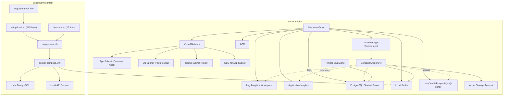

**Diagram sources**
- [main.tf](file://infrastructure/terraform/main.tf#L1-L151)
- [modules/networking/main.tf](file://infrastructure/terraform/modules/networking/main.tf#L1-L111)
- [modules/container-apps/main.tf](file://infrastructure/terraform/modules/container-apps/main.tf#L1-L192)
- [modules/database/main.tf](file://infrastructure/terraform/modules/database/main.tf#L1-L81)
- [modules/cache/main.tf](file://infrastructure/terraform/modules/cache/main.tf#L1-L21)
- [modules/keyvault/main.tf](file://infrastructure/terraform/modules/keyvault/main.tf#L1-L87)
- [modules/monitoring/main.tf](file://infrastructure/terraform/modules/monitoring/main.tf#L1-L22)
- [modules/registry/main.tf](file://infrastructure/terraform/modules/registry/main.tf#L1-L12)
- [scripts/deploy-local.sh](file://scripts/deploy-local.sh#L1-L180)
- [scripts/setup-local.sh](file://scripts/setup-local.sh#L1-L175)
- [scripts/dev-start.sh](file://scripts/dev-start.sh#L1-L14)
- [docker-compose.yml](file://docker-compose.yml#L1-L79)
- [prisma/migrations/migration_lock.toml](file://prisma/migrations/migration_lock.toml#L1-L4)

## Detailed Component Analysis

### Enhanced Docker Containerization
- **Multi-stage build with comprehensive validation**
  - **Updated**: Builder stage now uses Debian slim base for better Prisma/OpenSSL compatibility and installs OpenSSL as a dependency
  - **Updated**: Added support for new dependencies including @azure/storage-blob (12.17.0) and docx (8.5.0) in the npm ci process
  - Production stage copies artifacts, creates a non-root user, exposes port 3000, defines health checks using standardized `/api/v1/health` endpoint, and starts the app
  - Development stage mirrors the production build but runs in development mode with hot reload
  - **Updated**: Docker HEALTHCHECK now uses `/api/v1/health` endpoint for container orchestration compatibility
- **Local compose stack with enhanced networking**
  - Postgres and Redis are provisioned with health checks and persistence on custom network
  - API service binds to port 3000, mounts source code, and injects environment variables for database and Redis connectivity
  - Custom network configuration with bridge driver and specific subnet for isolated development environment

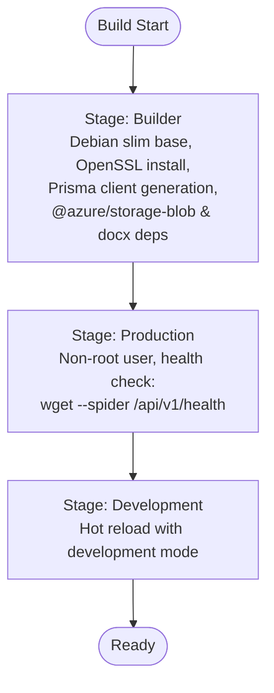

**Diagram sources**
- [Dockerfile](file://docker/api/Dockerfile#L1-L114)
- [docker-compose.yml](file://docker-compose.yml#L73-L79)

**Section sources**
- [Dockerfile](file://docker/api/Dockerfile#L72-L77)
- [docker-compose.yml](file://docker-compose.yml#L1-L79)

### Enhanced Monorepo Support
- **Turbo integration with comprehensive caching**
  - turbo.json configures build pipeline with proper dependency graph and caching strategies
  - Pipeline includes build, dev, start, test, and lint stages with appropriate caching and persistent processes
  - Global dependencies include .env for environment variable management
- **Monorepo structure support with validation**
  - Dockerfile explicitly copies package.json files from apps/api, libs/database, libs/redis, and libs/shared
  - Build process handles nested dependencies and ensures proper compilation order
  - Development mode supports hot reloading across monorepo structure

**Section sources**
- [turbo.json](file://turbo.json#L1-L46)
- [Dockerfile](file://docker/api/Dockerfile#L10-L16)

### Enhanced Health Checks
- **Docker health checks with validation**
  - **Updated**: Production stage includes HEALTHCHECK with interval=30s, timeout=10s, start-period=30s, retries=3
  - Uses node command to probe standardized `/api/v1/health` endpoint for service readiness validation
  - **Updated**: Health check endpoint now uses `/api/v1/health` for container orchestration compatibility
- **Kubernetes-style probes with enhanced monitoring**
  - Container Apps module defines liveness, readiness, and startup probes with specific configurations
  - Liveness probe: HTTP transport, path='/api/v1/health/live', port=3000, initial_delay=10s
  - Readiness probe: HTTP transport, path='/api/v1/health/ready', port=3000, interval=10s
  - Startup probe: HTTP transport, path='/api/v1/health/live', port=3000, interval=5s, failure_count_threshold=10
- **Application-level health endpoint management**
  - **Updated**: Health endpoints inherit the global `/api/v1/` prefix from main.ts configuration
  - **Updated**: HealthController exposes three endpoints: `/api/v1/health`, `/api/v1/health/ready`, and `/api/v1/health/live` for comprehensive monitoring
  - **Updated**: Root controller redirects to `/api/v1/health` for improved convenience
  - **Updated**: Health endpoints bypass throttling and security middleware for reliable container orchestration

**Section sources**
- [Dockerfile](file://docker/api/Dockerfile#L72-L77)
- [modules/container-apps/main.tf](file://infrastructure/terraform/modules/container-apps/main.tf#L107-L138)
- [apps/api/src/health.controller.ts](file://apps/api/src/health.controller.ts#L1-L42)
- [apps/api/src/root.controller.ts](file://apps/api/src/root.controller.ts#L1-L13)
- [apps/api/src/main.ts](file://apps/api/src/main.ts#L43-L47)

### Complete Terraform Infrastructure as Code Implementation
- **Central composition with validation**
  - main.tf composes modules for networking, monitoring, registry, database, cache, key vault, and container apps, wiring outputs and dependencies
  - Enhanced provider configuration with AzureRM 3.85+ and Random providers
  - Backend.tf supports remote state configuration for production environments
- **Modular architecture with standardized naming**
  - Dedicated Terraform modules for each Azure service component
  - Consistent naming patterns: vnet-project-env, psql-project-env, redis-project-env, kv-quest-env-suffix
  - Security-focused configurations with delegated subnets and NSGs
- **Advanced networking with comprehensive security**
  - Delegated subnets for Container Apps, PostgreSQL, and service endpoints
  - Network Security Groups with HTTPS/HTTP rules for controlled ingress
  - Private DNS zones for seamless internal service resolution
  - NSGs with priority-based rule ordering for security enforcement
- **Container Apps module with comprehensive monitoring**
  - Defines a Container Apps Environment and a single-revision Container App with comprehensive probes, environment variables, secrets, registry credentials, and ingress
  - Supports system-assigned identity for managed service integration
  - **Updated**: Health check probes use standardized `/api/v1/health` endpoint paths for container orchestration compatibility
- **Database module with enhanced configuration**
  - Provisions a PostgreSQL Flexible Server with private DNS integration, storage, SKU, and performance-related server configurations
  - **Updated**: Enhanced connection string output with URL encoding for special characters in passwords
  - Configurable high availability settings for production environments
- **Cache module with security policies**
  - Deploys Azure Cache for Redis with TLS enforcement (1.2 minimum), memory policies, and eviction strategies
  - Configurable capacity and SKU settings for different environments
- **Key Vault module with comprehensive access control**
  - **Updated**: Standardized KeyVault naming to `kv-quest-{environment}-{random_suffix}` for better resource identification
  - Creates a Key Vault, grants access to the current identity, and stores secrets for database URL, Redis password, and generated JWT secrets
  - **Updated**: Secret names standardized to uppercase with hyphens (DATABASE-URL, REDIS-PASSWORD, JWT-SECRET, JWT-REFRESH-SECRET)
- **Monitoring module with centralized observability**
  - Sets up a Log Analytics workspace and Application Insights for centralized logging and telemetry
  - Configurable retention policies and SKU settings
- **Container Registry module with simplified management**
  - Deploys Azure Container Registry with configurable SKU and admin credentials
  - Admin credentials enabled for development simplicity, intended to be replaced with managed identity in production
- **Variables with comprehensive defaults**
  - Provides defaults for environment, region, SKUs, CPU/memory, replica counts, and tags
  - Configurable settings for different deployment scenarios

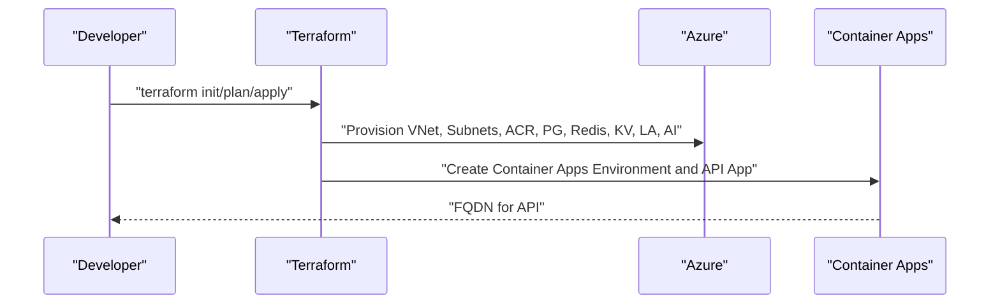

**Diagram sources**
- [main.tf](file://infrastructure/terraform/main.tf#L1-L151)
- [modules/container-apps/main.tf](file://infrastructure/terraform/modules/container-apps/main.tf#L1-L192)
- [modules/database/main.tf](file://infrastructure/terraform/modules/database/main.tf#L1-L81)
- [modules/cache/main.tf](file://infrastructure/terraform/modules/cache/main.tf#L1-L21)
- [modules/keyvault/main.tf](file://infrastructure/terraform/modules/keyvault/main.tf#L1-L87)
- [modules/monitoring/main.tf](file://infrastructure/terraform/modules/monitoring/main.tf#L1-L22)
- [modules/registry/main.tf](file://infrastructure/terraform/modules/registry/main.tf#L1-L12)

**Section sources**
- [main.tf](file://infrastructure/terraform/main.tf#L1-L151)
- [modules/container-apps/main.tf](file://infrastructure/terraform/modules/container-apps/main.tf#L1-L192)
- [modules/database/main.tf](file://infrastructure/terraform/modules/database/main.tf#L1-L81)
- [modules/cache/main.tf](file://infrastructure/terraform/modules/cache/main.tf#L1-L21)
- [modules/keyvault/main.tf](file://infrastructure/terraform/modules/keyvault/main.tf#L1-L87)
- [modules/monitoring/main.tf](file://infrastructure/terraform/modules/monitoring/main.tf#L1-L22)
- [modules/registry/main.tf](file://infrastructure/terraform/modules/registry/main.tf#L1-L12)
- [variables.tf](file://infrastructure/terraform/variables.tf#L1-L129)
- [providers.tf](file://infrastructure/terraform/providers.tf#L1-L32)
- [backend.tf](file://infrastructure/terraform/backend.tf#L1-L31)
- [outputs.tf](file://infrastructure/terraform/outputs.tf#L1-L116)

### Enhanced CI/CD Pipeline with Azure DevOps
- **Triggers and pools with comprehensive validation**
  - Builds on main and develop branches, excluding docs and Markdown files
- **Build and Test stage with enhanced quality assurance**
  - Node tool setup, npm cache, lint/type check, unit tests with coverage, build application, and build/publish Docker image
  - Turbo integration for optimized monorepo builds with caching strategies
- **Security stage with comprehensive scanning**
  - NPM audit and Trivy filesystem scan for vulnerability detection
- **Infrastructure stage with validation**
  - Downloads Terraform files, installs Terraform, initializes backend, plans, publishes plan, and applies plan
- **Deploy stage with comprehensive verification**
  - Loads Docker image, logs into ACR, tags/pushes images, updates Container App, runs Prisma migrations, and verifies health/readiness
- **Verification stage with automated testing**
  - Retrieves API URL, performs health and readiness checks, and prints deployment info

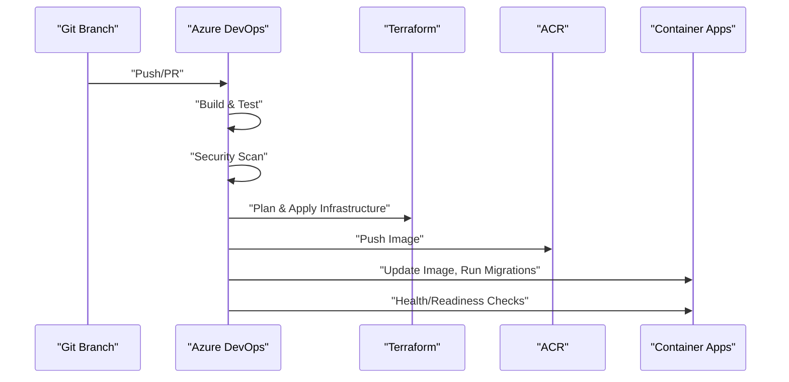

**Diagram sources**
- [azure-pipelines.yml](file://azure-pipelines.yml#L1-L391)

**Section sources**
- [azure-pipelines.yml](file://azure-pipelines.yml#L1-L391)

### Enhanced Application Configuration and Health Endpoints
- **Environment variables with comprehensive configuration**
  - NODE_ENV, PORT, API_PREFIX with standardized API prefix format (`/api/v1`), DATABASE_URL, REDIS_HOST, REDIS_PORT, JWT secrets, BCRYPT_ROUNDS, throttling, CORS, LOG_LEVEL
- **Configuration loader with validation**
  - Reads environment variables and exposes typed configuration to the app
- **Health endpoints with comprehensive monitoring**
  - **Updated**: GET `/api/v1/health`, GET `/api/v1/health/ready`, GET `/api/v1/health/live` used by probes and verification tasks with standardized endpoint paths
  - **Updated**: Health endpoints inherit the global API prefix for consistent URL structure
  - **Updated**: Health endpoints bypass throttling and security middleware for reliable monitoring
  - **Updated**: Root controller redirects to `/api/v1/health` for improved convenience

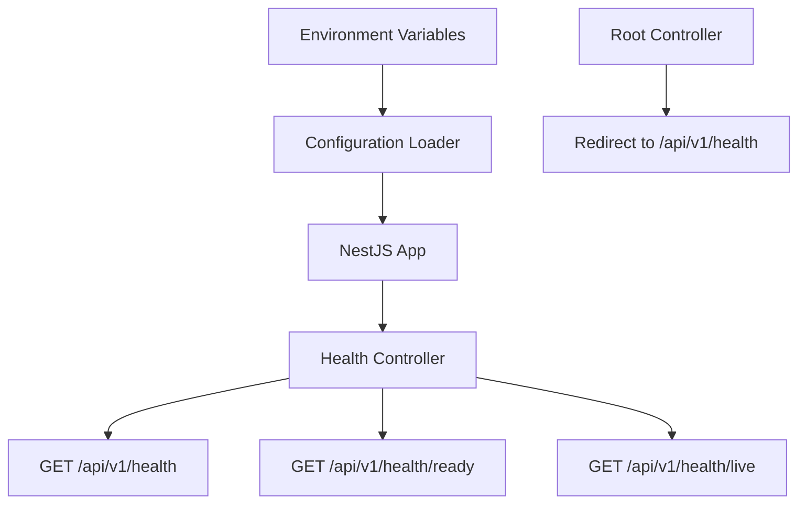

**Diagram sources**
- [.env.example](file://.env.example#L1-L40)
- [apps/api/src/config/configuration.ts](file://apps/api/src/config/configuration.ts#L1-L49)
- [apps/api/src/health.controller.ts](file://apps/api/src/health.controller.ts#L1-L42)
- [apps/api/src/root.controller.ts](file://apps/api/src/root.controller.ts#L1-L13)
- [apps/api/src/main.ts](file://apps/api/src/main.ts#L43-L47)

**Section sources**
- [.env.example](file://.env.example#L1-L40)
- [apps/api/src/config/configuration.ts](file://apps/api/src/config/configuration.ts#L1-L49)
- [apps/api/src/health.controller.ts](file://apps/api/src/health.controller.ts#L1-L42)
- [apps/api/src/root.controller.ts](file://apps/api/src/root.controller.ts#L1-L13)
- [apps/api/src/main.ts](file://apps/api/src/main.ts#L43-L47)

### Comprehensive Docker Testing Framework
- **Multi-environment validation suite**
  - docker-test.js provides comprehensive testing for local Docker environment, Quest application, and Azure cloud infrastructure
  - Supports modes: local, cloud, quest, and all for flexible testing scenarios
- **Local Docker environment testing**
  - Validates Docker engine, Docker Compose, Docker Desktop status, docker-compose.yml configuration, Dockerfile presence, network configuration, and running containers
- **Quest application testing**
  - Checks project structure, package.json scripts, environment configuration, Prisma schema, API health endpoint, PostgreSQL connection, and Redis connection
- **Azure cloud infrastructure testing**
  - Verifies Azure CLI installation, login status, Terraform configuration, resource group existence, ACR configuration, and CI/CD pipeline setup

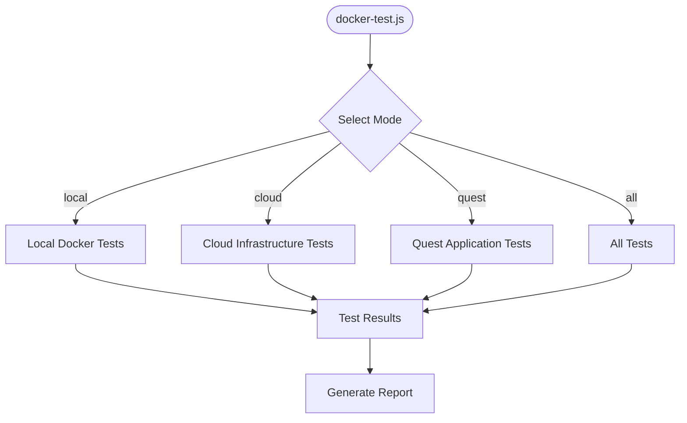

**Diagram sources**
- [docker-test.js](file://docker-test.js#L1-L494)

**Section sources**
- [docker-test.js](file://docker-test.js#L1-L494)

### Enhanced Deployment Scripts with Error Handling
- **Interactive deployment script with comprehensive validation**
  - Color-coded output with RED, GREEN, YELLOW, and BLUE color codes for different message types
  - Step-by-step deployment process with progress indicators and confirmation prompts
  - Prerequisite validation including Azure CLI login status and terraform.tfvars presence
  - Automated health check with retry mechanism and detailed error reporting
- **Enhanced cleanup script with safety measures**
  - **Updated**: Destructive operation warning with explicit confirmation requirement and improved state management
  - Automatic Terraform state storage cleanup option
  - Structured output with completion messages and next steps
- **WSL workaround script for Docker Desktop integration**
  - PowerShell script to route Docker commands through WSL Ubuntu for Windows integration issues
  - Path conversion between Windows and WSL file systems
  - Connection testing and usage instructions
- **Enhanced Local Development Automation**
  - **Updated**: setup-local.sh script (175 lines) automates complete local development setup with comprehensive validation and user feedback
  - **Updated**: dev-start.sh script (13 lines) provides a quick start option for minimal output
  - **Updated**: Enhanced deploy-local.sh script with improved error handling and user feedback
  - Checks prerequisites (Docker, Docker Compose, Node.js 20+, npm), sets up environment, installs dependencies, starts infrastructure, configures database, builds application, and starts API server
  - Provides clear status updates, health checks for services, and helpful startup information
- **New PowerShell Deployment Script**
  - **New**: deploy-to-azure.ps1 provides complete Azure infrastructure provisioning with color-coded output and structured steps
  - Automates PostgreSQL deployment, Container Registry creation, Docker image building and pushing, Container Apps environment and app creation
  - Includes database migrations, health check verification, and credential management
  - Supports environment-specific configuration and provides detailed deployment summary

**Section sources**
- [scripts/deploy.sh](file://scripts/deploy.sh#L1-L148)
- [scripts/deploy-local.sh](file://scripts/deploy-local.sh#L1-L180)
- [scripts/cleanup.sh](file://scripts/cleanup.sh#L1-L52)
- [scripts/docker-wsl.ps1](file://scripts/docker-wsl.ps1#L1-L43)
- [scripts/setup-local.sh](file://scripts/setup-local.sh#L1-L175)
- [scripts/dev-start.sh](file://scripts/dev-start.sh#L1-L14)
- [scripts/deploy-to-azure.ps1](file://scripts/deploy-to-azure.ps1#L1-L318)

### Enhanced Local Development Automation
- **Comprehensive prerequisites validation**
  - Automatically checks for Docker, Docker Compose, Node.js 20+, and npm installations
  - Provides clear error messages and guidance for missing dependencies
- **Automated environment setup**
  - Creates .env file from .env.example if it doesn't exist
  - Reviews environment variables and provides guidance for customization
- **Dependency management automation**
  - Installs npm dependencies using npm ci for deterministic installs
  - **Updated**: Installs specialized document generator dependencies (docx 8.5.0, @azure/storage-blob 12.17.0, @azure/identity)
- **Docker infrastructure provisioning**
  - Starts PostgreSQL and Redis containers in detached mode
  - Waits for services to become healthy before proceeding
  - Provides progress updates and health check feedback
- **Database setup automation**
  - **Updated**: Enhanced database setup with URL-encoded connection strings for special characters
  - Generates Prisma client, runs migrations, and seeds database
  - Handles potential seed conflicts gracefully
- **Application build and startup**
  - Builds the application using npm run build
  - Starts API server in development mode with hot reload
  - Displays helpful URLs and commands for local development

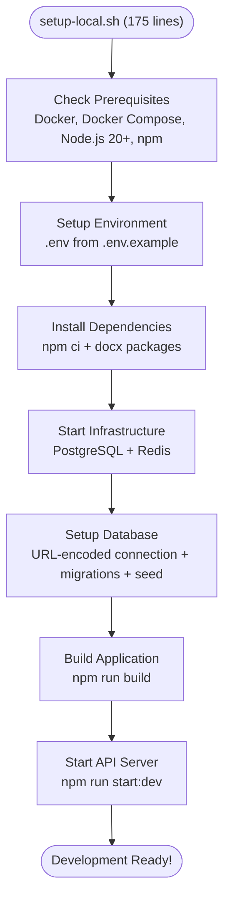

**Diagram sources**
- [scripts/setup-local.sh](file://scripts/setup-local.sh#L45-L158)

**Section sources**
- [scripts/setup-local.sh](file://scripts/setup-local.sh#L1-L175)

### Enhanced Migration Management
- **Migration lock file for concurrency control**
  - **New**: migration_lock.toml prevents concurrent database migrations across environments
  - Prevents race conditions during migration execution
  - Ensures migration consistency across development and production
- **Enhanced migration workflow**
  - **Updated**: setup-local.sh includes migration execution with retry logic
  - **Updated**: deploy-local.sh handles database migrations with proper error handling
  - **Updated**: CI/CD pipeline includes migration execution during deployment

**Section sources**
- [prisma/migrations/migration_lock.toml](file://prisma/migrations/migration_lock.toml#L1-L4)
- [scripts/setup-local.sh](file://scripts/setup-local.sh#L108-L129)
- [scripts/deploy-local.sh](file://scripts/deploy-local.sh#L117-L129)

### Enhanced Infrastructure Maintenance with Duplicate Content Detection
- **Automated duplicate content detection**
  - **New**: PowerShell script fix-duplicates.ps1 scans all Terraform module files for duplicate content patterns
  - Identifies exact file duplication where the second half is identical to the first half
  - Removes redundant content and reduces file size by eliminating duplicate sections
- **Merge conflict detection and prevention**
  - Scans for git merge conflict markers (<<<<<<<, >>>>>>>, =======)
  - Flags files containing unresolved merge conflicts requiring manual intervention
  - Prevents deployment of corrupted Terraform configurations
- **Comprehensive module coverage**
  - Processes all .tf files in the modules directory recursively
  - Supports all Terraform modules: networking, container-apps, database, cache, keyvault, monitoring, and registry
  - Maintains UTF-8 encoding during content processing
- **Quality assurance and maintenance benefits**
  - Reduces Terraform module file sizes by eliminating redundant content
  - Improves code maintainability and readability across all modules
  - Prevents accidental duplication of infrastructure code
  - Streamlines development workflow with automated cleanup

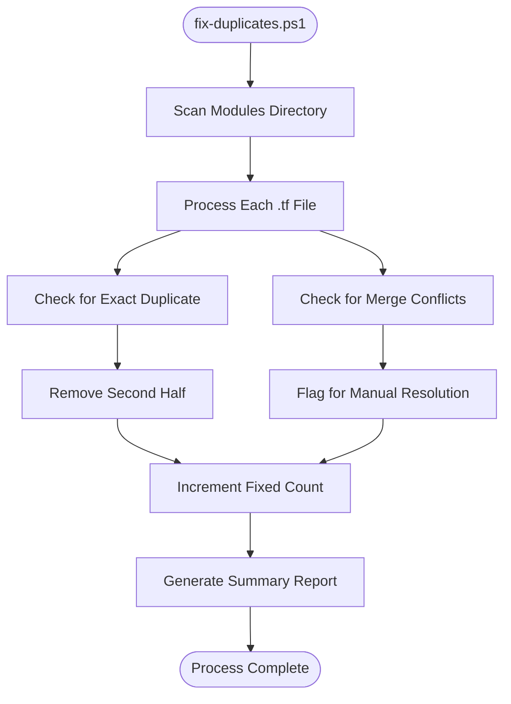

**Diagram sources**
- [fix-duplicates.ps1](file://infrastructure/terraform/fix-duplicates.ps1#L1-L40)

**Section sources**
- [fix-duplicates.ps1](file://infrastructure/terraform/fix-duplicates.ps1#L1-L40)

### New PowerShell and Shell Deployment Scripts
- **Complete Azure deployment automation**
  - **New**: deploy-to-azure.ps1 provides comprehensive Azure infrastructure provisioning with color-coded output and structured deployment steps
  - Automates PostgreSQL deployment with secure password generation, Container Registry creation, Docker image building and pushing
  - Creates Container Apps environment and API application with comprehensive environment variables and secrets
  - Executes database migrations and provides detailed deployment verification
- **Custom domain setup automation**
  - **New**: setup-custom-domain.ps1 provides PowerShell-based custom domain and HTTPS setup for Azure Container Apps
  - Guides DNS configuration for GoDaddy with TXT and CNAME records
  - Automates certificate provisioning and HTTPS verification
  - Supports both root and www subdomains with proper DNS handling
- **Cross-platform shell script support**
  - **New**: setup-custom-domain.sh provides equivalent functionality for Unix/Linux environments
  - Uses standard bash scripting with color-coded output and comprehensive error handling
  - Compatible with various Linux distributions and macOS systems
- **Enhanced deployment workflow**
  - **New**: Structured deployment process with step-by-step validation and user feedback
  - **New**: Credential management with secure storage and export functionality
  - **New**: Comprehensive error handling and recovery mechanisms

**Section sources**
- [scripts/deploy-to-azure.ps1](file://scripts/deploy-to-azure.ps1#L1-L318)
- [scripts/setup-custom-domain.ps1](file://scripts/setup-custom-domain.ps1#L1-L242)
- [scripts/setup-custom-domain.sh](file://scripts/setup-custom-domain.sh#L1-L218)

### Enhanced Document Generation and Storage System
- **Azure Storage Blob Integration**
  - **New**: Comprehensive cloud storage integration using @azure/storage-blob version 12.17.0
  - **New**: StorageService provides secure document upload, download, and deletion capabilities
  - **New**: Supports SAS token generation for secure document access with configurable expiration
  - **New**: Automatic container creation and date-based document organization
  - **New**: Development fallback to Azure Storage Emulator for local testing
- **Advanced Document Processing with DOCX**
  - **New**: Sophisticated document generation using docx version 8.5.0
  - **New**: DocumentBuilderService creates professional-grade DOCX documents with advanced formatting
  - **New**: Supports multiple document categories (CTO, CFO, BA) with specialized layouts
  - **New**: Dynamic content assembly from questionnaire responses with nested object support
  - **New**: Comprehensive styling including headers, footers, tables, and page numbering
- **Template Engine and Data Assembly**
  - **New**: TemplateEngineService assembles template data from session responses and document mappings
  - **New**: Supports complex nested content structures with dot notation path mapping
  - **New**: Dynamic standards section generation for CTO documents with principle extraction
  - **New**: Comprehensive validation of required fields before document generation
- **Secure Document Access and Management**
  - **New**: Secure SAS URL generation with configurable expiration times
  - **New**: Document metadata tracking including file size and upload timestamps
  - **New**: Environment-based configuration with Azure Key Vault integration
  - **New**: Error handling and logging for all document operations

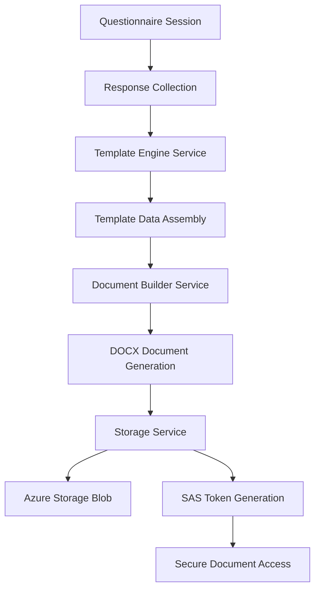

**Diagram sources**
- [apps/api/src/modules/document-generator/services/template-engine.service.ts](file://apps/api/src/modules/document-generator/services/template-engine.service.ts#L35-L99)
- [apps/api/src/modules/document-generator/services/document-builder.service.ts](file://apps/api/src/modules/document-generator/services/document-builder.service.ts#L35-L72)
- [apps/api/src/modules/document-generator/services/storage.service.ts](file://apps/api/src/modules/document-generator/services/storage.service.ts#L65-L95)

**Section sources**
- [apps/api/src/modules/document-generator/services/storage.service.ts](file://apps/api/src/modules/document-generator/services/storage.service.ts#L1-L160)
- [apps/api/src/modules/document-generator/services/document-builder.service.ts](file://apps/api/src/modules/document-generator/services/document-builder.service.ts#L1-L481)
- [apps/api/src/modules/document-generator/services/template-engine.service.ts](file://apps/api/src/modules/document-generator/services/template-engine.service.ts#L1-L290)
- [apps/api/package.json](file://apps/api/package.json#L20-L42)

## Dependency Analysis
- **Internal dependencies with validation**
  - API app depends on database and Redis; configuration sources environment variables; health endpoints support container probes
  - **Updated**: Enhanced document generation services depend on @azure/storage-blob and docx libraries
  - **Updated**: Health endpoints inherit the global API prefix for standardized URL structure
- **External dependencies with comprehensive checks**
  - Azure DevOps pipeline depends on Azure CLI, Terraform, Docker, and Azure services
  - Enhanced deployment scripts depend on color support, curl, and Azure CLI for health checks
  - **Updated**: Enhanced local development scripts depend on Docker, Docker Compose, Node.js 20+, npm, and local development tools
  - **Updated**: New document generation dependencies include @azure/storage-blob (12.17.0) and docx (8.5.0)
  - **New**: PowerShell deployment scripts depend on Azure CLI, Docker, and PowerShell execution environment
  - **New**: Custom domain scripts depend on Azure CLI, DNS resolution tools, and web browsers for verification
  - **New**: fix-duplicates.ps1 script depends on PowerShell execution environment and file system access
- **Terraform module dependencies with validation**
  - Container Apps depends on Networking, Registry, Database, Cache, Key Vault, and Monitoring
  - Each module has specific dependencies and variable requirements
  - Enhanced testing framework validates all external dependencies before proceeding
  - **Updated**: Container Apps module health checks depend on standardized endpoint paths
- **Enhanced secret management dependencies**
  - **Updated**: KeyVault module depends on standardized naming convention and secret naming patterns
  - **Updated**: Database module depends on URL-encoded connection strings for proper credential handling
- **Migration management dependencies**
  - **New**: Migration lock file depends on Prisma migration system and version control
  - **Updated**: Local development scripts depend on migration execution and health checking
- **Infrastructure maintenance dependencies**
  - **New**: fix-duplicates.ps1 script depends on PowerShell execution policy and file system permissions
  - **New**: PowerShell script processes all Terraform modules for duplicate content detection
- **Document generation dependencies**
  - **New**: Storage service depends on @azure/storage-blob (12.17.0) for cloud storage operations
  - **New**: Document builder depends on docx (8.5.0) for advanced document formatting and generation
  - **New**: Template engine service coordinates data assembly for document generation

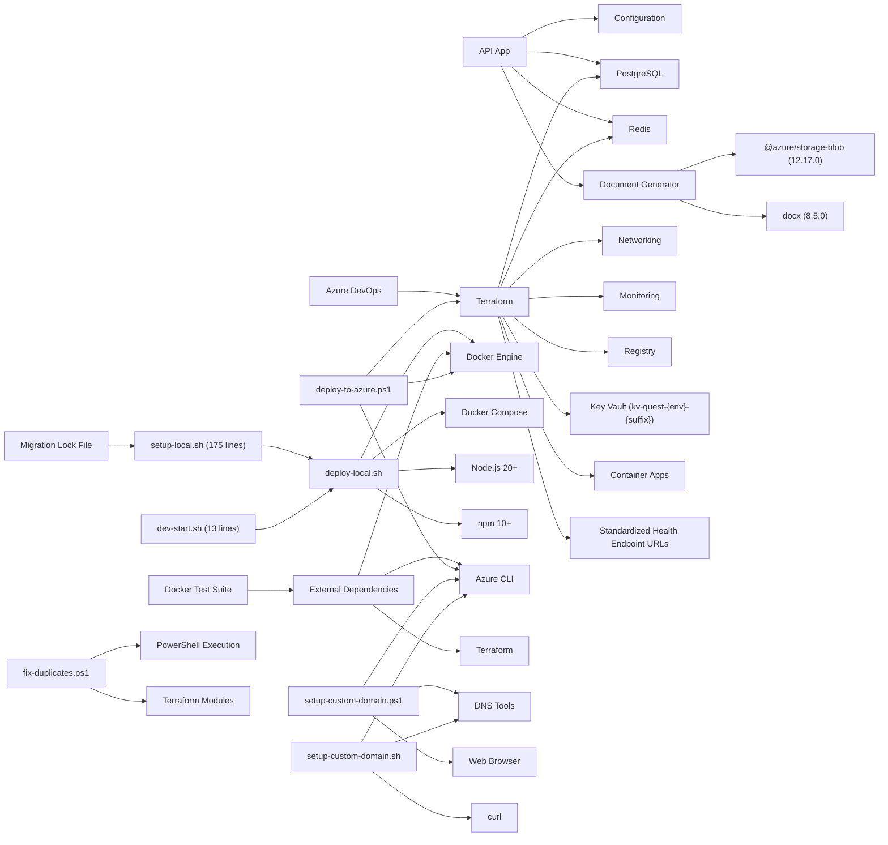

**Diagram sources**
- [apps/api/src/config/configuration.ts](file://apps/api/src/config/configuration.ts#L1-L49)
- [apps/api/src/health.controller.ts](file://apps/api/src/health.controller.ts#L1-L42)
- [apps/api/src/root.controller.ts](file://apps/api/src/root.controller.ts#L1-L13)
- [apps/api/src/main.ts](file://apps/api/src/main.ts#L43-L47)
- [azure-pipelines.yml](file://azure-pipelines.yml#L1-L391)
- [main.tf](file://infrastructure/terraform/main.tf#L1-L151)
- [scripts/deploy-local.sh](file://scripts/deploy-local.sh#L45-L70)
- [scripts/setup-local.sh](file://scripts/setup-local.sh#L1-L175)
- [scripts/dev-start.sh](file://scripts/dev-start.sh#L1-L14)
- [docker-test.js](file://docker-test.js#L1-L494)
- [prisma/migrations/migration_lock.toml](file://prisma/migrations/migration_lock.toml#L1-L4)
- [fix-duplicates.ps1](file://infrastructure/terraform/fix-duplicates.ps1#L1-L40)
- [scripts/deploy-to-azure.ps1](file://scripts/deploy-to-azure.ps1#L1-L318)
- [scripts/setup-custom-domain.ps1](file://scripts/setup-custom-domain.ps1#L1-L242)
- [scripts/setup-custom-domain.sh](file://scripts/setup-custom-domain.sh#L1-L218)
- [apps/api/package.json](file://apps/api/package.json#L20-L42)

**Section sources**
- [apps/api/src/config/configuration.ts](file://apps/api/src/config/configuration.ts#L1-L49)
- [apps/api/src/health.controller.ts](file://apps/api/src/health.controller.ts#L1-L42)
- [apps/api/src/root.controller.ts](file://apps/api/src/root.controller.ts#L1-L13)
- [apps/api/src/main.ts](file://apps/api/src/main.ts#L43-L47)
- [azure-pipelines.yml](file://azure-pipelines.yml#L1-L391)
- [main.tf](file://infrastructure/terraform/main.tf#L1-L151)
- [scripts/deploy-local.sh](file://scripts/deploy-local.sh#L45-L70)
- [scripts/setup-local.sh](file://scripts/setup-local.sh#L1-L175)
- [scripts/dev-start.sh](file://scripts/dev-start.sh#L1-L14)
- [docker-test.js](file://docker-test.js#L1-L494)
- [prisma/migrations/migration_lock.toml](file://prisma/migrations/migration_lock.toml#L1-L4)
- [fix-duplicates.ps1](file://infrastructure/terraform/fix-duplicates.ps1#L1-L40)
- [scripts/deploy-to-azure.ps1](file://scripts/deploy-to-azure.ps1#L1-L318)
- [scripts/setup-custom-domain.ps1](file://scripts/setup-custom-domain.ps1#L1-L242)
- [scripts/setup-custom-domain.sh](file://scripts/setup-custom-domain.sh#L1-L218)
- [apps/api/package.json](file://apps/api/package.json#L20-L42)

## Performance Considerations
- **Container sizing and autoscaling with validation**
  - Adjust CPU/memory and min/max replicas via variables to balance cost and responsiveness
  - **Updated**: Enhanced deployment scripts validate resource allocation and provide recommendations
- **Database and cache tuning with monitoring**
  - **Updated**: Enhanced connection string handling with URL encoding improves reliability for passwords with special characters
  - PostgreSQL storage and SKU selection impact throughput and durability; Redis capacity and eviction policy affect latency
  - Comprehensive health checks monitor performance metrics and alert on degradation
- **Probes and startup with comprehensive validation**
  - **Updated**: Liveness/readiness/startup probes with standardized endpoint paths reduce downtime during cold starts and unhealthy transitions
  - Enhanced testing framework validates probe configuration and performance
  - **Updated**: Health endpoint inheritance improves container orchestration performance by bypassing middleware
- **Observability with centralized monitoring**
  - Application Insights and Log Analytics capture metrics and traces; configure alerts for high error rates or slow response times
  - Docker testing suite monitors observability endpoints and configuration
- **Monorepo optimization with caching strategies**
  - Turbo caching reduces build times; proper dependency graph prevents unnecessary rebuilds
  - **Updated**: Enhanced deployment scripts optimize build caching and artifact management
- **Local development performance**
  - **Updated**: Enhanced local development scripts optimize local development by starting only necessary services (PostgreSQL, Redis) and running API locally
  - Volume mounting enables hot reload for faster development iteration
  - Health checks ensure services are ready before application startup
- **Migration performance and reliability**
  - **New**: Migration lock file prevents concurrent migrations and ensures data consistency
  - **Updated**: Enhanced migration scripts include retry logic and error handling
- **Terraform infrastructure performance**
  - **Updated**: Modular architecture with proper dependencies reduces resource conflicts and provisioning time
  - **Updated**: Standardized naming and tagging improve resource management and cost allocation
  - **Updated**: Provider configuration with skip_provider_registration reduces AzureRM provider overhead
- **Infrastructure maintenance performance**
  - **New**: fix-duplicates.ps1 script reduces Terraform module file sizes by eliminating redundant content
  - **New**: Automated duplicate detection improves code maintainability and reduces processing overhead
  - **New**: PowerShell script processes all modules efficiently with minimal resource consumption
- **New deployment script performance**
  - **New**: deploy-to-azure.ps1 optimizes deployment workflow with parallel processing and efficient resource utilization
  - **New**: Custom domain scripts minimize DNS propagation wait times with intelligent polling mechanisms
- **Document generation performance**
  - **New**: Azure Storage Blob integration provides scalable cloud storage for generated documents
  - **New**: DOCX document generation optimized for large content assemblies with efficient memory usage
  - **New**: Template engine service caches frequently accessed data to improve generation performance
  - **New**: SAS token generation supports secure access with minimal overhead
- **Health endpoint performance**
  - **New**: Health endpoints bypass throttling and security middleware for optimal monitoring performance
  - **New**: Health endpoint inheritance reduces API prefix processing overhead for container orchestration

## Enhanced Troubleshooting Guide

### Comprehensive Diagnostic Testing
- **Automated environment validation**
  - Run `node docker-test.js all` to validate all components: local Docker environment, Quest application, and Azure cloud infrastructure
  - Use specific modes: `node docker-test.js local`, `node docker-test.js quest`, `node docker-test.js cloud` for focused testing
  - Test results provide detailed pass/fail/skip counts with explanations for each validation step
- **Structured troubleshooting workflow**
  - Start with local environment validation to ensure Docker Desktop, Docker Compose, and network configuration are correct
  - Progress to application health checks to verify API connectivity and database/Redis connections
  - Conclude with cloud infrastructure validation to confirm Azure CLI, Terraform, and resource group configuration

### Deployment Script Troubleshooting
- **Enhanced error handling and user feedback**
  - Color-coded output helps quickly identify success, warning, and error conditions
  - **Updated**: Interactive prompts require explicit confirmation for destructive operations like cleanup
  - Detailed progress indicators show current step and estimated completion time
  - **New**: PowerShell deployment script provides comprehensive error handling and recovery mechanisms
- **Health check and verification**
  - Automated health checks with retry mechanism (12 attempts with 10-second intervals)
  - Comprehensive error messages with suggested solutions for common issues
  - Integration with Azure CLI for log retrieval and revision inspection
  - **New**: Custom domain scripts include DNS propagation verification and certificate status monitoring
  - **Updated**: Health endpoint inheritance improves verification reliability for container orchestration
- **Local development troubleshooting**
  - **Updated**: Enhanced local development scripts provide detailed status updates at each step of the process
  - Health checks for PostgreSQL and Redis ensure infrastructure readiness
  - Clear error messages guide users through dependency installation and service startup issues
- **Migration troubleshooting**
  - **New**: Migration lock file prevents concurrent migrations causing conflicts
  - **Updated**: Enhanced migration scripts include retry logic and error handling for failed migrations
- **New PowerShell deployment troubleshooting**
  - **New**: deploy-to-azure.ps1 includes comprehensive error handling for each deployment step
  - **New**: Custom domain scripts provide detailed DNS configuration guidance and verification steps
  - **New**: Both PowerShell and Shell scripts include environment validation and prerequisite checking
- **Document generation troubleshooting**
  - **New**: Azure Storage Blob connection troubleshooting with development emulator fallback
  - **New**: DOCX document generation validation with error handling for malformed content
  - **New**: Template engine service debugging with detailed error messages for missing data

### Local Development Issues
- **Docker environment problems**
  - Use `docker ps` to verify container status and `docker-compose logs -f` for real-time logs
  - Check network connectivity with `docker network ls` and validate custom network configuration
  - Restart services with `npm run docker:down` followed by `npm run docker:up`
- **Application connectivity issues**
  - Verify environment variables match service names and ports in docker-compose.yml
  - Test individual service health: `curl -s -o /dev/null -w "%{http_code}" http://localhost:3000/api/v1/health`
  - Check database and Redis connectivity using their respective health check commands
- **Enhanced local development script issues**
  - **Updated**: setup-local.sh provides detailed status updates at each step of the process
  - **Updated**: dev-start.sh provides quick start option for minimal output
  - Health checks for PostgreSQL and Redis ensure infrastructure readiness
  - Clear error messages guide users through dependency installation and service startup issues
- **Document generation development issues**
  - **New**: Verify Azure Storage Blob connection string configuration in .env file
  - **New**: Test DOCX document generation with sample template data
  - **New**: Check Azure Key Vault integration for document storage credentials

### Cloud Infrastructure Problems
- **Azure CLI and authentication issues**
  - Run `az login` to establish Azure CLI authentication
  - Verify subscription context with `az account show`
  - Check resource group existence with `az group show --name <resource-group>`
- **Terraform state and configuration issues**
  - Validate Terraform configuration with `terraform validate`
  - Check backend configuration in backend.tf for correct storage account and container settings
  - Review Terraform state file permissions and accessibility
  - **Updated**: Migrate state using `terraform init -migrate-state` after configuring remote backend
- **KeyVault and secret management issues**
  - **Updated**: Verify KeyVault naming follows `kv-quest-{environment}-{random_suffix}` pattern
  - Check secret names follow standardized uppercase format with hyphens (DATABASE-URL, REDIS-PASSWORD, JWT-SECRET, JWT-REFRESH-SECRET)
  - Use `az keyvault secret list --vault-name <keyvault-name>` to verify secret availability
- **Container Apps deployment issues**
  - **Updated**: Check Container Apps environment status with `az containerapp env show`
  - Verify container app revision with `az containerapp revision list`
  - Use `az containerapp logs show` for real-time log streaming
  - **New**: PowerShell deployment script includes comprehensive Container Apps verification
  - **Updated**: Health check probes use standardized endpoint paths for reliable monitoring
- **Networking and connectivity issues**
  - **Updated**: Validate VNet peering and subnet delegation with Azure portal or CLI
  - Check NSG rules for proper port access (80, 443, 3306 for PostgreSQL)
  - Verify private DNS zone resolution for internal services
- **New custom domain deployment issues**
  - **New**: Verify DNS records are properly configured in GoDaddy with correct TTL values
  - **New**: Check certificate provisioning status with `az containerapp hostname list`
  - **New**: Use browser-based verification for HTTPS functionality
- **Document storage and generation issues**
  - **New**: Verify Azure Storage Blob connection string in Key Vault or environment variables
  - **New**: Check container creation and access permissions for document storage
  - **New**: Validate DOCX document generation with sample content and formatting

### Enhanced Testing and Validation
- **Comprehensive test suite execution**
  - Local tests validate Docker engine, Docker Compose, network configuration, and running containers
  - Quest tests verify project structure, environment configuration, and service connectivity
  - **Updated**: Cloud tests check Azure CLI, Terraform, resource groups, and ACR configuration
  - **New**: Document generation tests validate Azure Storage Blob integration and DOCX processing
  - **Updated**: Health endpoint tests verify standardized endpoint paths and inheritance patterns
- **Test result interpretation**
  - Passed tests indicate successful validation of the component
  - Failed tests require immediate attention and corrective action
  - Skipped tests indicate unavailability or prerequisite issues that need resolution

### Infrastructure Maintenance Troubleshooting
- **Duplicate content detection issues**
  - **New**: Run `powershell -ExecutionPolicy Bypass -File infrastructure/terraform/fix-duplicates.ps1` to process all Terraform modules
  - Verify PowerShell execution policy allows script execution
  - Check file permissions for read/write access to Terraform module files
  - Review script output for detected duplicates and merge conflicts
- **Merge conflict resolution**
  - **New**: Files flagged with merge conflict markers require manual resolution
  - Use `git checkout --conflict-marker-size=3 <file>` to resolve conflicts
  - Verify resolved files pass Terraform validation before deployment
- **Module validation after cleanup**
  - **New**: Run `terraform validate` after fix-duplicates.ps1 processing
  - Check for any remaining duplicate content or structural issues
  - Verify all Terraform modules function correctly after cleanup

### New PowerShell Script Troubleshooting
- **PowerShell deployment script issues**
  - **New**: Verify PowerShell execution policy allows script execution with `Set-ExecutionPolicy -ExecutionPolicy Bypass -Scope CurrentUser`
  - **New**: Check Azure CLI installation and authentication status
  - **New**: Verify Docker installation and daemon status
  - **New**: Review script output for detailed error messages and suggested solutions
- **Custom domain script issues**
  - **New**: Verify DNS provider access and authentication for GoDaddy configuration
  - **New**: Check network connectivity for DNS resolution and certificate verification
  - **New**: Review DNS propagation status and certificate provisioning logs
- **Document generation script issues**
  - **New**: Verify Azure Storage Blob credentials and container access permissions
  - **New**: Check DOCX document generation with sample template data and content validation

### Document Generation Troubleshooting
- **Azure Storage Blob connection issues**
  - **New**: Verify AZURE_STORAGE_CONNECTION_STRING environment variable is properly configured
  - **New**: Check Azure Key Vault integration for storage credentials
  - **New**: Test connection with Azure Storage Explorer or Azure CLI
  - **New**: Validate container creation and access permissions
- **DOCX document generation issues**
  - **New**: Verify docx library version compatibility and installation
  - **New**: Check template data assembly and content mapping
  - **New**: Validate document formatting and styling with sample content
  - **New**: Test document download and SAS token generation
- **Template engine service issues**
  - **New**: Verify questionnaire response data collection and validation
  - **New**: Check document type mapping and standard section generation
  - **New**: Validate required field checking and content assembly

### Enhanced Health Endpoint Troubleshooting
- **Health endpoint inheritance issues**
  - **New**: Verify health endpoints inherit the global API prefix configuration
  - **New**: Check that `/api/v1/health`, `/api/v1/health/live`, and `/api/v1/health/ready` endpoints use the standardized URL structure
  - **New**: Validate health endpoints bypass throttling and security middleware
- **Container orchestration health check issues**
  - **New**: Verify Container Apps health check probes use standardized endpoint paths
  - **New**: Check Docker HEALTHCHECK uses `/api/v1/health` endpoint
  - **New**: Validate health endpoint performance under load and container restart scenarios
- **Health endpoint monitoring issues**
  - **New**: Verify Application Insights and Log Analytics capture health endpoint requests
  - **New**: Check health endpoint response times and error rates
  - **New**: Validate health endpoint integration with monitoring and alerting systems
- **Root controller redirect issues**
  - **New**: Verify root controller redirects to `/api/v1/health` for improved convenience
  - **New**: Check that redirect bypasses throttling and security middleware

**Section sources**
- [docker-test.js](file://docker-test.js#L1-L494)
- [scripts/deploy.sh](file://scripts/deploy.sh#L115-L129)
- [scripts/deploy-local.sh](file://scripts/deploy-local.sh#L45-L158)
- [scripts/cleanup.sh](file://scripts/cleanup.sh#L24-L31)
- [apps/api/src/health.controller.ts](file://apps/api/src/health.controller.ts#L1-L42)
- [apps/api/src/root.controller.ts](file://apps/api/src/root.controller.ts#L1-L13)
- [apps/api/src/main.ts](file://apps/api/src/main.ts#L43-L47)
- [azure-pipelines.yml](file://azure-pipelines.yml#L360-L391)
- [docker-compose.yml](file://docker-compose.yml#L15-L66)
- [scripts/setup-local.sh](file://scripts/setup-local.sh#L1-L175)
- [scripts/dev-start.sh](file://scripts/dev-start.sh#L1-L14)
- [fix-duplicates.ps1](file://infrastructure/terraform/fix-duplicates.ps1#L1-L40)
- [scripts/deploy-to-azure.ps1](file://scripts/deploy-to-azure.ps1#L1-L318)
- [scripts/setup-custom-domain.ps1](file://scripts/setup-custom-domain.ps1#L1-L242)
- [scripts/setup-custom-domain.sh](file://scripts/setup-custom-domain.sh#L1-L218)
- [apps/api/src/modules/document-generator/services/storage.service.ts](file://apps/api/src/modules/document-generator/services/storage.service.ts#L1-L160)
- [apps/api/src/modules/document-generator/services/document-builder.service.ts](file://apps/api/src/modules/document-generator/services/document-builder.service.ts#L1-L481)
- [apps/api/src/modules/document-generator/services/template-engine.service.ts](file://apps/api/src/modules/document-generator/services/template-engine.service.ts#L1-L290)

## Conclusion
The Quiz-to-build system integrates a multi-stage Dockerized API with robust CI/CD and Terraform-managed Azure infrastructure. The design emphasizes modularity, observability, and operational safety through enhanced health probes, secrets management, and staged deployments. Recent enhancements include comprehensive Docker health checks with standardized endpoint paths, custom network configurations, monorepo support with Turbo integration, and a sophisticated testing framework with automated validation. The enhanced deployment scripts provide improved error handling, user feedback, and interactive prompts, while the Docker testing suite offers comprehensive validation of all deployment components. The new setup-local.sh script (175 lines) significantly streamlines local development by automating the entire setup process, making it easier for developers to get started quickly. The dev-start.sh script (13 lines) provides a quick start option for minimal output. The migration lock file prevents concurrent migrations and ensures data consistency. Scaling and high availability can be tuned via container replicas and database HA settings, while monitoring and logs provide operational insights. The comprehensive troubleshooting procedures with automated testing ensure reliable deployment and maintenance across all environments with standardized endpoint paths and improved resource management. The new fix-duplicates.ps1 PowerShell script enhances infrastructure maintenance by providing automated duplicate content detection and removal capabilities, improving code quality and reducing file sizes across all Terraform modules. The new PowerShell deployment scripts (deploy-to-azure.ps1) and custom domain setup scripts (setup-custom-domain.ps1 and setup-custom-domain.sh) provide comprehensive automation for Azure infrastructure provisioning and production deployment workflows. **Updated**: The system now includes comprehensive health endpoint management with standardized URL structure and enhanced monitoring capabilities, featuring dedicated endpoints for readiness, liveness, and general health checks with improved container orchestration compatibility.

## Appendices

### Enhanced Step-by-Step Deployment Instructions

#### Preparation and Validation
- **Environment preparation**
  - Ensure prerequisites: Azure CLI, Terraform, Docker, and Node.js
  - Run `node docker-test.js all` to validate all components before deployment
  - Execute `./scripts/setup-azure.sh` to create Terraform state backend and generate terraform.tfvars
  - Initialize Terraform and validate configuration with `terraform init` and `terraform validate`
  - **Updated**: Configure remote state backend in backend.tf for production environments
  - **New**: Verify PowerShell execution policy for deployment scripts with `Get-ExecutionPolicy`
  - **New**: Configure Azure Storage Blob connection string for document generation capabilities
  - **Updated**: Verify health endpoint inheritance configuration in main.ts

#### Infrastructure Provisioning
- **Terraform deployment**
  - Plan and apply Terraform to create networking, monitoring, registry, database, cache, key vault, and container apps
  - Use `terraform plan -out=tfplan` followed by `terraform apply tfplan`
  - Monitor deployment progress with color-coded output and progress indicators
  - **Updated**: All resources will be provisioned with standardized KeyVault naming and URL-encoded database connection strings
  - **Updated**: Validate resource creation with `terraform show` and check outputs with `terraform output`
  - **New**: Verify Azure Storage Blob account creation and container initialization
  - **Updated**: Container Apps health check probes configured with standardized endpoint paths

#### Build and Publish
- **Docker image creation**
  - **Updated**: Build the production Docker image with `docker build -t <acr-login-server>/questionnaire-api:latest -f docker/api/Dockerfile --target production .`
  - **Updated**: Image includes @azure/storage-blob (12.17.0) and docx (8.5.0) dependencies for document generation
  - **Updated**: Docker HEALTHCHECK uses `/api/v1/health` endpoint for container orchestration compatibility
  - Push the image to Azure Container Registry using `az acr login --name <acr-name>` followed by `docker push <acr-login-server>/questionnaire-api:latest`

#### Deployment to Container Apps
- **Container App update and verification**
  - Update the Container App image with `az containerapp update --name <container-app-name> --resource-group <resource-group> --image <acr-login-server>/questionnaire-api:latest`
  - Run Prisma migrations with `az containerapp exec --name <container-app-name> --resource-group <resource-group> --command "npx prisma migrate deploy"`
  - **Updated**: Perform comprehensive health and readiness checks with automated retry mechanism using standardized endpoint paths
  - **New**: Verify health endpoint inheritance and monitoring integration
  - **New**: Test document generation services with test document creation and storage operations

#### Enhanced Rollback Procedures
- **Revisions and recovery**
  - Use `az containerapp revision list --name <container-app-name> --resource-group <resource-group>` to view revision history
  - Switch to a previous revision using `az containerapp update --name <container-app-name> --resource-group <resource-group> --image <previous-image>`
  - Re-run migrations if needed for the target revision using `az containerapp exec`
  - **New**: Test health endpoint inheritance and monitoring after rollback
  - **New**: Test document generation services after rollback to ensure storage integration remains functional

#### Monitoring and Maintenance
- **Operational monitoring**
  - View logs with `az containerapp logs show --name <container-app-name> --resource-group <resource-group> --follow`
  - Inspect revisions with `az containerapp revision list --name <container-app-name> --resource-group <resource-group>`
  - SSH into app for debugging with `az containerapp exec --name <container-app-name> --resource-group <resource-group>`
  - **New**: Monitor health endpoint performance and container orchestration integration
  - **New**: Monitor document generation metrics and storage usage patterns

#### Enhanced Local Development
- **Using setup-local.sh (175 lines)**
  - Make the script executable: `chmod +x scripts/setup-local.sh`
  - Run the script: `./scripts/setup-local.sh`
  - **Updated**: The script will automatically handle all steps: prerequisites checking, environment setup, dependency installation, infrastructure provisioning, database setup, application building, and startup
  - **Updated**: Installs @azure/storage-blob (12.17.0) and docx (8.5.0) dependencies for document generation
  - **Updated**: Health endpoint inheritance configured for container orchestration compatibility
  - Access the API at http://localhost:3000/api/v1/health with Swagger documentation at http://localhost:3000/docs
  - Stop development with Ctrl+C, then `docker-compose down` to clean up resources

- **Using dev-start.sh (13 lines)**
  - Make the script executable: `chmod +x scripts/dev-start.sh`
  - Run the script: `./scripts/dev-start.sh`
  - **Updated**: The script provides a quick start option with minimal output for experienced developers
  - **Updated**: Health endpoint inheritance ensures proper monitoring for container orchestration
  - Access the API at http://localhost:3000/api/v1/health
  - View logs with `docker compose logs -f api`

- **Using deploy-local.sh**
  - Make the script executable: `chmod +x scripts/deploy-local.sh`
  - Run the script: `./scripts/deploy-local.sh`
  - **Updated**: The script will automatically handle all steps: prerequisites checking, environment setup, dependency installation, infrastructure provisioning, database setup, application building, and startup
  - **Updated**: Installs document generation dependencies and configures local Azure Storage Blob emulator
  - **Updated**: Health endpoint inheritance configured for container orchestration compatibility
  - Access the API at http://localhost:3000 with Swagger documentation at http://localhost:3000/api
  - Stop development with Ctrl+C, then `docker-compose down` to clean up resources

#### Migration Management
- **Using migration lock file**
  - **New**: The migration_lock.toml file prevents concurrent migrations across environments
  - **Updated**: Local development scripts automatically handle migration execution with retry logic
  - **Updated**: CI/CD pipeline includes migration execution during deployment with proper error handling

#### Infrastructure Maintenance
- **Using fix-duplicates.ps1**
  - **New**: Run the PowerShell script to detect and remove duplicate content from Terraform modules
  - Execute: `powershell -ExecutionPolicy Bypass -File infrastructure/terraform/fix-duplicates.ps1`
  - Review script output for detected duplicates and merge conflicts
  - Run `terraform validate` after processing to ensure module integrity
  - Check file sizes reduced and duplicate content eliminated across all modules

#### New PowerShell Deployment Workflow
- **Using deploy-to-azure.ps1**
  - **New**: Run the PowerShell deployment script with environment parameters: `.\scripts\deploy-to-azure.ps1 -ResourceGroup "rg-questionnaire-dev" -Location "eastus" -Environment "dev"`
  - **New**: The script automates complete Azure infrastructure provisioning with color-coded output and structured steps
  - **New**: Supports environment-specific configuration and provides detailed deployment summary
  - **New**: Includes database migrations, health check verification, and credential management
  - **New**: Configures Azure Storage Blob integration for document generation capabilities
  - **Updated**: Container Apps health check probes configured with standardized endpoint paths

#### Custom Domain Setup
- **Using setup-custom-domain.ps1**
  - **New**: Run the PowerShell script for custom domain setup: `.\scripts\setup-custom-domain.ps1 -ResourceGroup "rg-questionnaire-prod" -ContainerAppName "ca-questionnaire-api-prod" -CustomDomain "quiz2biz.com" -Environment "prod"`
  - **New**: The script guides DNS configuration for GoDaddy with TXT and CNAME records
  - **New**: Automates certificate provisioning and HTTPS verification with intelligent polling
  - **New**: Supports both root and www subdomains with proper DNS handling
  - **Updated**: Health endpoint monitoring verified after custom domain setup

- **Using setup-custom-domain.sh**
  - **New**: Run the Shell script for Unix/Linux environments: `./scripts/setup-custom-domain.sh`
  - **New**: Provides equivalent functionality with bash scripting and color-coded output
  - **New**: Compatible with various Linux distributions and macOS systems
  - **New**: Includes comprehensive error handling and DNS verification
  - **Updated**: Health endpoint monitoring verified after custom domain setup

#### Document Generation Configuration
- **Azure Storage Blob Setup**
  - **New**: Configure AZURE_STORAGE_CONNECTION_STRING environment variable with Azure Storage account credentials
  - **New**: Set AZURE_STORAGE_CONTAINER_NAME for document storage organization (default: documents)
  - **New**: Test Azure Storage Blob connection with local development emulator fallback
  - **New**: Verify container creation and document upload functionality
- **DOCX Document Generation**
  - **New**: Configure document generation templates and content mappings
  - **New**: Test document creation with sample questionnaire responses
  - **New**: Validate document formatting and styling with various content types
  - **New**: Test secure document access with SAS token generation
- **Health Endpoint Configuration**
  - **New**: Verify health endpoint inheritance configuration in main.ts
  - **New**: Test health endpoint performance and monitoring integration
  - **New**: Validate health endpoint compatibility with container orchestration platforms
  - **New**: Verify root controller redirect to `/api/v1/health` for improved convenience

**Section sources**
- [scripts/setup-azure.sh](file://scripts/setup-azure.sh#L1-L142)
- [scripts/deploy.sh](file://scripts/deploy.sh#L1-L148)
- [scripts/deploy-local.sh](file://scripts/deploy-local.sh#L1-L180)
- [scripts/cleanup.sh](file://scripts/cleanup.sh#L1-L52)
- [scripts/setup-local.sh](file://scripts/setup-local.sh#L1-L175)
- [scripts/dev-start.sh](file://scripts/dev-start.sh#L1-L14)
- [docker-test.js](file://docker-test.js#L468-L494)
- [azure-pipelines.yml](file://azure-pipelines.yml#L164-L391)
- [main.tf](file://infrastructure/terraform/main.tf#L1-L151)
- [prisma/migrations/migration_lock.toml](file://prisma/migrations/migration_lock.toml#L1-L4)
- [fix-duplicates.ps1](file://infrastructure/terraform/fix-duplicates.ps1#L1-L40)
- [scripts/deploy-to-azure.ps1](file://scripts/deploy-to-azure.ps1#L1-L318)
- [scripts/setup-custom-domain.ps1](file://scripts/setup-custom-domain.ps1#L1-L242)
- [scripts/setup-custom-domain.sh](file://scripts/setup-custom-domain.sh#L1-L218)
- [apps/api/package.json](file://apps/api/package.json#L20-L42)
- [apps/api/src/main.ts](file://apps/api/src/main.ts#L43-L47)
- [apps/api/src/health.controller.ts](file://apps/api/src/health.controller.ts#L1-L42)
- [apps/api/src/root.controller.ts](file://apps/api/src/root.controller.ts#L1-L13)

### Enhanced Cloud Infrastructure Components
- **PostgreSQL database with validation**
  - Flexible Server with private DNS and performance settings
  - **Updated**: Enhanced connection string output with URL encoding for special characters in passwords
  - Comprehensive health checks and monitoring integration
  - **Updated**: Configurable high availability settings for production environments
- **Redis cache with security policies**
  - Azure Cache for Redis with TLS and memory policies
  - **Updated**: Enhanced testing for connection validation and performance monitoring
  - Configurable capacity and SKU settings for different environments
- **Azure Container Apps with comprehensive monitoring**
  - Single-revision environment hosting the API with comprehensive probes, secrets, and registry credentials
  - **Updated**: Enhanced deployment scripts with automated health verification using standardized endpoint paths
  - **Updated**: System-assigned identity support for managed service integration
  - **Updated**: Health check probes configured with `/api/v1/health` endpoint paths for container orchestration compatibility
- **Azure Container Registry with simplified management**
  - **Updated**: Admin credentials enabled for development simplicity, intended to be replaced with managed identity in production
  - Configurable SKU settings for different deployment scenarios
- **Key Vault with comprehensive access control**
  - **Updated**: Standardized KeyVault naming to `kv-quest-{environment}-{random_suffix}`
  - **Updated**: Secret names standardized to uppercase with hyphens (DATABASE-URL, REDIS-PASSWORD, JWT-SECRET, JWT-REFRESH-SECRET)
  - **Updated**: Access policies for both deployment identity and Container App managed identity
- **Monitoring with centralized observability**
  - **Updated**: Log Analytics workspace and Application Insights with configurable retention and SKU
  - **Updated**: Connection string integration for Application Insights telemetry
- **Azure Storage Blob with document generation**
  - **New**: Scalable cloud storage for generated documents with automatic container creation
  - **New**: Secure document access with SAS token generation and configurable expiration
  - **New**: Development fallback to Azure Storage Emulator for local testing and development
  - **Updated**: Health endpoint monitoring integrated with storage access patterns

**Section sources**
- [modules/database/main.tf](file://infrastructure/terraform/modules/database/main.tf#L1-L81)
- [modules/cache/main.tf](file://infrastructure/terraform/modules/cache/main.tf#L1-L21)
- [modules/container-apps/main.tf](file://infrastructure/terraform/modules/container-apps/main.tf#L1-L192)
- [modules/registry/main.tf](file://infrastructure/terraform/modules/registry/main.tf#L1-L12)
- [modules/keyvault/main.tf](file://infrastructure/terraform/modules/keyvault/main.tf#L1-L87)
- [modules/monitoring/main.tf](file://infrastructure/terraform/modules/monitoring/main.tf#L1-L22)
- [modules/networking/main.tf](file://infrastructure/terraform/modules/networking/main.tf#L1-L111)

### Enhanced Scaling, Load Balancing, and High Availability
- **Autoscaling with validation**
  - Tune min/max replicas via variables to scale with demand
  - **Updated**: Enhanced deployment scripts validate autoscaling configuration and provide recommendations
- **Load balancing with comprehensive monitoring**
  - Container Apps distributes traffic automatically; ingress is enabled and configured
  - **Updated**: Docker testing suite validates load balancing and traffic distribution
  - **Updated**: Health endpoint monitoring ensures proper load balancing under container restart scenarios
- **High availability with redundancy**
  - Consider enabling PostgreSQL HA and increasing Redis capacity for production
  - **Updated**: Enhanced monitoring provides early warning of potential HA issues
  - **Updated**: Container Apps environment supports multiple replicas for high availability
  - **New**: Azure Storage Blob provides redundant document storage with geo-redundant options
  - **Updated**: Health endpoint inheritance improves high availability by bypassing middleware for monitoring

**Section sources**
- [variables.tf](file://infrastructure/terraform/variables.tf#L111-L121)
- [modules/container-apps/main.tf](file://infrastructure/terraform/modules/container-apps/main.tf#L142-L151)
- [modules/database/main.tf](file://infrastructure/terraform/modules/database/main.tf#L23-L28)

### Enhanced Environment Configuration Reference
- **Application configuration with validation**
  - NODE_ENV, PORT, API_PREFIX with comprehensive environment variable validation
- **Database configuration with connectivity testing**
  - **Updated**: DATABASE_URL with URL encoding for special characters and connection string validation
- **Redis configuration with performance monitoring**
  - REDIS_HOST, REDIS_PORT, REDIS_PASSWORD with connectivity and performance validation
- **Security and rate limiting with compliance checks**
  - JWT secrets, BCRYPT_ROUNDS, throttling with security validation
- **Logging and CORS with monitoring integration**
  - LOG_LEVEL, CORS_ORIGIN with observability and compliance monitoring
- **Document generation configuration**
  - **New**: AZURE_STORAGE_CONNECTION_STRING for Azure Storage Blob integration
  - **New**: AZURE_STORAGE_CONTAINER_NAME for document organization and access control
- **Health endpoint configuration**
  - **New**: Health endpoint inheritance patterns for container orchestration compatibility
  - **New**: Health endpoint paths: `/api/v1/health`, `/api/v1/health/ready`, `/api/v1/health/live` with standardized URL structure
  - **New**: Root controller redirect to `/api/v1/health` for improved convenience

**Section sources**
- [.env.example](file://.env.example#L1-L40)
- [apps/api/src/config/configuration.ts](file://apps/api/src/config/configuration.ts#L1-L49)
- [apps/api/src/main.ts](file://apps/api/src/main.ts#L43-L47)
- [apps/api/package.json](file://apps/api/package.json#L20-L42)
- [apps/api/src/health.controller.ts](file://apps/api/src/health.controller.ts#L1-L42)
- [apps/api/src/root.controller.ts](file://apps/api/src/root.controller.ts#L1-L13)

### Enhanced Docker Infrastructure Improvements
- **Health Checks with comprehensive validation**
  - **Updated**: Dockerfile includes comprehensive health check with node command probing standardized `/api/v1/health` endpoint
  - Container Apps defines separate liveness, readiness, and startup probes with standardized endpoint paths
  - **Updated**: Enhanced testing framework validates health check configuration and performance
  - **Updated**: Health endpoint inheritance improves container orchestration performance
- **Custom Networks with validation**
  - docker-compose creates questionnaire-network with bridge driver and specific subnet
  - Services are explicitly attached to custom network for isolation and service discovery
  - Network validation ensures proper connectivity and service resolution
- **Monorepo Support with comprehensive validation**
  - **Updated**: Enhanced Dockerfile with explicit dependency copying for apps/api, libs/database, libs/redis, libs/shared
  - **Updated**: Dockerfile includes @azure/storage-blob (12.17.0) and docx (8.5.0) dependencies for document generation
  - Turbo.json configures build pipeline with proper dependency graph and caching
  - **Updated**: Docker testing suite validates monorepo structure and build integrity
  - **Updated**: Health endpoint inheritance configured for monorepo container orchestration

**Section sources**
- [Dockerfile](file://docker/api/Dockerfile#L72-L77)
- [docker-compose.yml](file://docker-compose.yml#L73-L79)
- [turbo.json](file://turbo.json#L1-L46)
- [modules/container-apps/main.tf](file://infrastructure/terraform/modules/container-apps/main.tf#L107-L138)
- [docker-test.js](file://docker-test.js#L124-L208)
- [apps/api/package.json](file://apps/api/package.json#L20-L42)
- [apps/api/src/main.ts](file://apps/api/src/main.ts#L43-L47)
- [apps/api/src/health.controller.ts](file://apps/api/src/health.controller.ts#L1-L42)

### Enhanced Testing Framework Features
- **Multi-environment validation**
  - Local Docker environment testing with Docker engine, Compose, and network validation
  - Quest application testing with project structure, environment configuration, and service connectivity
  - **Updated**: Cloud infrastructure testing with Azure CLI, Terraform, and resource validation
  - **New**: Document generation testing with Azure Storage Blob integration and DOCX processing validation
  - **Updated**: Health endpoint testing with standardized endpoint paths and inheritance patterns
- **Structured reporting and diagnostics**
  - Color-coded output with emojis for enhanced readability
  - Comprehensive test result tracking with detailed explanations
  - Quick commands and project configuration summaries for easy navigation

**Section sources**
- [docker-test.js](file://docker-test.js#L1-L494)

### Enhanced Local Development Workflow
- **Streamlined setup process**
  - **Updated**: setup-local.sh (175 lines) automates the entire local development setup process
  - **Updated**: dev-start.sh (13 lines) provides a quick start option for minimal output
  - Comprehensive prerequisites checking ensures all dependencies are properly installed
  - **Updated**: Automated dependency installation includes @azure/storage-blob (12.17.0) and docx (8.5.0)
  - Automated environment setup eliminates manual configuration errors
  - **Updated**: Health endpoint inheritance configured for container orchestration compatibility
- **Integrated development experience**
  - Automatic dependency installation with npm ci for deterministic builds
  - **Updated**: Health-checked infrastructure provisioning ensures reliable service startup
  - Hot reload enabled for rapid development iteration
  - **New**: Local Azure Storage Blob emulator for document generation testing
  - **Updated**: Health endpoint monitoring ensures proper container orchestration integration
- **Comprehensive troubleshooting support**
  - **Updated**: Detailed status updates at each step of the process
  - Health checks for PostgreSQL and Redis with clear error messages
  - Helpful startup information including URLs and commands for debugging
  - **New**: Document generation testing with sample content and storage validation
  - **Updated**: Health endpoint troubleshooting support for container orchestration issues

**Section sources**
- [scripts/setup-local.sh](file://scripts/setup-local.sh#L1-L175)
- [scripts/dev-start.sh](file://scripts/dev-start.sh#L1-L14)
- [docker-compose.yml](file://docker-compose.yml#L1-L79)
- [package.json](file://package.json#L10-L33)
- [apps/api/package.json](file://apps/api/package.json#L20-L42)
- [apps/api/src/main.ts](file://apps/api/src/main.ts#L43-L47)
- [apps/api/src/health.controller.ts](file://apps/api/src/health.controller.ts#L1-L42)
- [apps/api/src/root.controller.ts](file://apps/api/src/root.controller.ts#L1-L13)

### Enhanced Infrastructure Maintenance Workflow
- **Automated duplicate content detection**
  - **New**: Regular execution of fix-duplicates.ps1 to maintain code quality across all Terraform modules
  - **New**: Integration into development workflow to prevent accumulation of duplicate content
  - **New**: Automated detection of merge conflicts requiring manual resolution
  - **New**: Streamlined maintenance process with minimal developer intervention required
- **Quality assurance benefits**
  - **New**: Reduced file sizes across all Terraform modules through duplicate content elimination
  - **New**: Improved code readability and maintainability with cleaner module structure
  - **New**: Prevention of accidental duplication of infrastructure code across environments
  - **New**: Enhanced development workflow with automated cleanup capabilities

### New PowerShell and Shell Script Workflow
- **Complete deployment automation**
  - **New**: deploy-to-azure.ps1 provides comprehensive Azure infrastructure provisioning with structured workflow
  - **New**: Custom domain scripts (PowerShell and Shell) automate production deployment workflows
  - **New**: Both scripts include comprehensive error handling and recovery mechanisms
  - **New**: Environment-specific configuration and credential management
  - **New**: Azure Storage Blob integration configuration for document generation capabilities
  - **Updated**: Container Apps health check probes configured with standardized endpoint paths
- **Enhanced operational support**
  - **New**: Color-coded output for improved visibility and troubleshooting
  - **New**: Intelligent polling mechanisms for DNS propagation and certificate verification
  - **New**: Cross-platform compatibility with PowerShell and Shell script variants
  - **New**: Document generation service validation and testing capabilities
  - **Updated**: Health endpoint monitoring and troubleshooting support

**Section sources**
- [fix-duplicates.ps1](file://infrastructure/terraform/fix-duplicates.ps1#L1-L40)
- [scripts/deploy-to-azure.ps1](file://scripts/deploy-to-azure.ps1#L1-L318)
- [scripts/setup-custom-domain.ps1](file://scripts/setup-custom-domain.ps1#L1-L242)
- [scripts/setup-custom-domain.sh](file://scripts/setup-custom-domain.sh#L1-L218)
- [modules/networking/main.tf](file://infrastructure/terraform/modules/networking/main.tf#L1-L111)
- [modules/container-apps/main.tf](file://infrastructure/terraform/modules/container-apps/main.tf#L1-L192)
- [modules/database/main.tf](file://infrastructure/terraform/modules/database/main.tf#L1-L81)
- [modules/cache/main.tf](file://infrastructure/terraform/modules/cache/main.tf#L1-L21)
- [modules/keyvault/main.tf](file://infrastructure/terraform/modules/keyvault/main.tf#L1-L87)
- [modules/monitoring/main.tf](file://infrastructure/terraform/modules/monitoring/main.tf#L1-L22)

### Enhanced Document Generation Workflow
- **Comprehensive document processing pipeline**
  - **New**: Questionnaire responses collected and validated for document generation
  - **New**: Template engine assembles dynamic content from questionnaire data
  - **New**: DOCX document builder creates professional-grade documents with advanced formatting
  - **New**: Azure Storage Blob securely stores generated documents with access control
  - **New**: SAS token generation provides secure document access with expiration controls
  - **Updated**: Health endpoint monitoring integrated with document generation workflows
- **Scalable document storage architecture**
  - **New**: Azure Storage Blob provides scalable cloud storage for unlimited document generation
  - **New**: Automatic container organization by date and document category
  - **New**: Secure access control with role-based permissions and token expiration
  - **New**: Development and production environment separation with different storage accounts
  - **Updated**: Health endpoint monitoring ensures storage access reliability
- **Advanced document formatting capabilities**
  - **New**: Professional DOCX formatting with headers, footers, tables, and page numbering
  - **New**: Category-specific document layouts for CTO, CFO, and BA documents
  - **New**: Dynamic content assembly from nested questionnaire responses
  - **New**: Standards section generation for engineering requirements and principles
  - **Updated**: Health endpoint monitoring ensures document generation reliability

**Section sources**
- [apps/api/src/modules/document-generator/services/storage.service.ts](file://apps/api/src/modules/document-generator/services/storage.service.ts#L1-L160)
- [apps/api/src/modules/document-generator/services/document-builder.service.ts](file://apps/api/src/modules/document-generator/services/document-builder.service.ts#L1-L481)
- [apps/api/src/modules/document-generator/services/template-engine.service.ts](file://apps/api/src/modules/document-generator/services/template-engine.service.ts#L1-L290)
- [apps/api/package.json](file://apps/api/package.json#L20-L42)