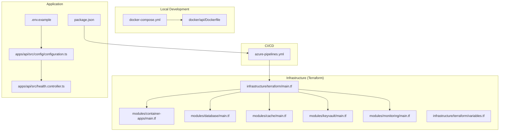
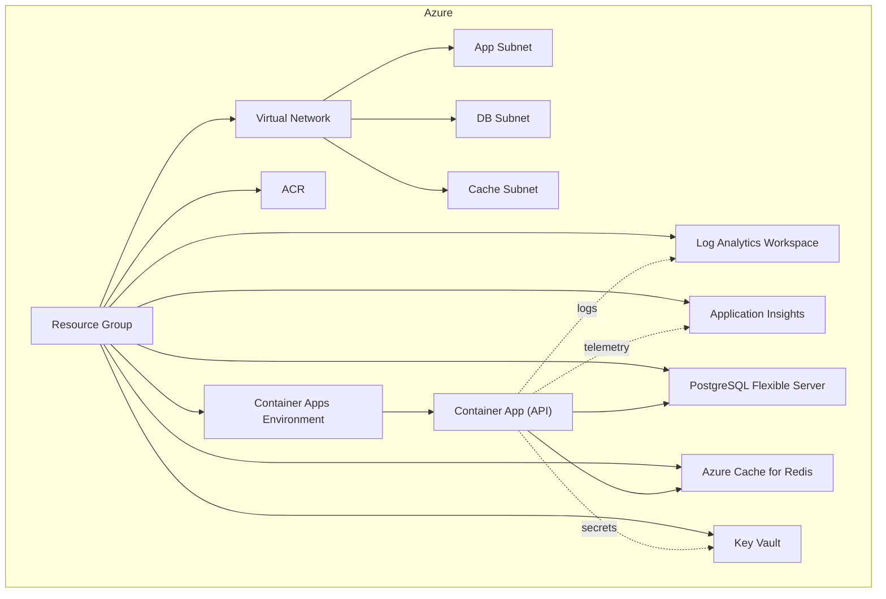
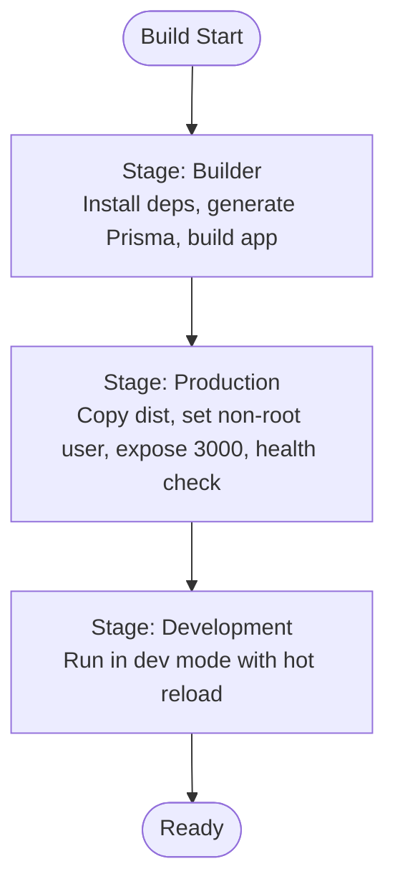
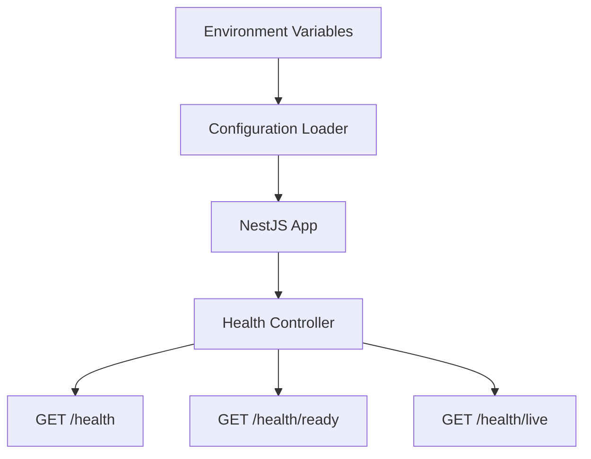
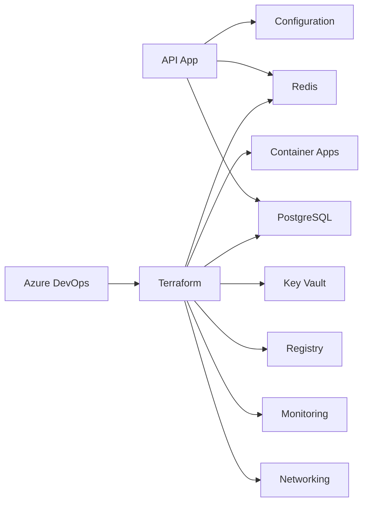

# Deployment and Infrastructure

<cite>
**Referenced Files in This Document**
- [Dockerfile](file://docker/api/Dockerfile)
- [docker-compose.yml](file://docker-compose.yml)
- [azure-pipelines.yml](file://azure-pipelines.yml)
- [main.tf](file://infrastructure/terraform/main.tf)
- [variables.tf](file://infrastructure/terraform/variables.tf)
- [modules/container-apps/main.tf](file://infrastructure/terraform/modules/container-apps/main.tf)
- [modules/database/main.tf](file://infrastructure/terraform/modules/database/main.tf)
- [modules/cache/main.tf](file://infrastructure/terraform/modules/cache/main.tf)
- [modules/keyvault/main.tf](file://infrastructure/terraform/modules/keyvault/main.tf)
- [modules/monitoring/main.tf](file://infrastructure/terraform/modules/monitoring/main.tf)
- [scripts/deploy.sh](file://scripts/deploy.sh)
- [scripts/setup-azure.sh](file://scripts/setup-azure.sh)
- [.env.example](file://.env.example)
- [apps/api/src/config/configuration.ts](file://apps/api/src/config/configuration.ts)
- [apps/api/src/health.controller.ts](file://apps/api/src/health.controller.ts)
- [package.json](file://package.json)
</cite>

## Table of Contents
1. [Introduction](#introduction)
2. [Project Structure](#project-structure)
3. [Core Components](#core-components)
4. [Architecture Overview](#architecture-overview)
5. [Detailed Component Analysis](#detailed-component-analysis)
6. [Dependency Analysis](#dependency-analysis)
7. [Performance Considerations](#performance-considerations)
8. [Troubleshooting Guide](#troubleshooting-guide)
9. [Conclusion](#conclusion)
10. [Appendices](#appendices)

## Introduction
This document explains how to deploy and manage the Quiz-to-build system across environments using Docker containerization, Terraform-managed Azure infrastructure, and an Azure DevOps CI/CD pipeline. It covers multi-stage builds, environment configuration, container orchestration with Azure Container Apps, infrastructure provisioning for PostgreSQL and Redis, CI/CD stages, deployment and rollback strategies, monitoring, scaling, and troubleshooting.

## Project Structure
The repository organizes deployment assets around three pillars:
- Containerization: Multi-stage Dockerfile for the API service and a local docker-compose stack for development.
- Infrastructure as Code: Terraform modules for networking, monitoring, registry, database, cache, key vault, and container apps.
- CI/CD: Azure DevOps YAML pipeline orchestrating build, security scanning, Terraform infrastructure, and deployment to Azure Container Apps.

**Diagram sources**
- [docker-compose.yml](file://docker-compose.yml#L1-L77)
- [Dockerfile](file://docker/api/Dockerfile#L1-L72)
- [azure-pipelines.yml](file://azure-pipelines.yml#L1-L391)
- [main.tf](file://infrastructure/terraform/main.tf#L1-L151)
- [modules/container-apps/main.tf](file://infrastructure/terraform/modules/container-apps/main.tf#L1-L192)
- [modules/database/main.tf](file://infrastructure/terraform/modules/database/main.tf#L1-L62)
- [modules/cache/main.tf](file://infrastructure/terraform/modules/cache/main.tf#L1-L21)
- [modules/keyvault/main.tf](file://infrastructure/terraform/modules/keyvault/main.tf#L1-L88)
- [modules/monitoring/main.tf](file://infrastructure/terraform/modules/monitoring/main.tf#L1-L22)
- [.env.example](file://.env.example#L1-L33)
- [apps/api/src/config/configuration.ts](file://apps/api/src/config/configuration.ts#L1-L49)
- [apps/api/src/health.controller.ts](file://apps/api/src/health.controller.ts#L1-L42)
- [package.json](file://package.json#L1-L65)

**Section sources**
- [docker-compose.yml](file://docker-compose.yml#L1-L77)
- [Dockerfile](file://docker/api/Dockerfile#L1-L72)
- [azure-pipelines.yml](file://azure-pipelines.yml#L1-L391)
- [main.tf](file://infrastructure/terraform/main.tf#L1-L151)
- [variables.tf](file://infrastructure/terraform/variables.tf#L1-L129)
- [modules/container-apps/main.tf](file://infrastructure/terraform/modules/container-apps/main.tf#L1-L192)
- [modules/database/main.tf](file://infrastructure/terraform/modules/database/main.tf#L1-L62)
- [modules/cache/main.tf](file://infrastructure/terraform/modules/cache/main.tf#L1-L21)
- [modules/keyvault/main.tf](file://infrastructure/terraform/modules/keyvault/main.tf#L1-L88)
- [modules/monitoring/main.tf](file://infrastructure/terraform/modules/monitoring/main.tf#L1-L22)
- [.env.example](file://.env.example#L1-L33)
- [apps/api/src/config/configuration.ts](file://apps/api/src/config/configuration.ts#L1-L49)
- [apps/api/src/health.controller.ts](file://apps/api/src/health.controller.ts#L1-L42)
- [package.json](file://package.json#L1-L65)

## Core Components
- Docker containerization
  - Multi-stage Dockerfile builds a secure production image with a non-root user, exposes port 3000, defines health checks, and supports a development stage.
  - docker-compose sets up Postgres, Redis, and the API service locally with environment variables and volume mounts.
- Terraform infrastructure
  - Central main.tf composes networking, monitoring, registry, database, cache, key vault, and container apps modules.
  - Variables.tf defines environment, region, SKUs, CPU/memory, replica counts, and tags.
- CI/CD pipeline
  - azure-pipelines.yml defines stages for build/test, security scanning, Terraform planning/apply, deployment to Azure Container Apps, and post-deployment verification.
- Application configuration and health
  - .env.example and apps/api/src/config/configuration.ts define environment variables for database, Redis, JWT, rate limits, logging, and CORS.
  - apps/api/src/health.controller.ts exposes health, readiness, and liveness endpoints used by Kubernetes-style probes and CI/CD verification.

**Section sources**
- [Dockerfile](file://docker/api/Dockerfile#L1-L72)
- [docker-compose.yml](file://docker-compose.yml#L1-L77)
- [main.tf](file://infrastructure/terraform/main.tf#L1-L151)
- [variables.tf](file://infrastructure/terraform/variables.tf#L1-L129)
- [azure-pipelines.yml](file://azure-pipelines.yml#L1-L391)
- [.env.example](file://.env.example#L1-L33)
- [apps/api/src/config/configuration.ts](file://apps/api/src/config/configuration.ts#L1-L49)
- [apps/api/src/health.controller.ts](file://apps/api/src/health.controller.ts#L1-L42)

## Architecture Overview
The system runs as a containerized API behind Azure Container Apps, integrated with managed services for compute, storage, caching, secrets, and observability.

**Diagram sources**
- [main.tf](file://infrastructure/terraform/main.tf#L1-L151)
- [modules/container-apps/main.tf](file://infrastructure/terraform/modules/container-apps/main.tf#L1-L192)
- [modules/database/main.tf](file://infrastructure/terraform/modules/database/main.tf#L1-L62)
- [modules/cache/main.tf](file://infrastructure/terraform/modules/cache/main.tf#L1-L21)
- [modules/keyvault/main.tf](file://infrastructure/terraform/modules/keyvault/main.tf#L1-L88)
- [modules/monitoring/main.tf](file://infrastructure/terraform/modules/monitoring/main.tf#L1-L22)

## Detailed Component Analysis

### Docker Containerization
- Multi-stage build
  - Builder stage installs dependencies, generates Prisma client, and builds the NestJS app.
  - Production stage copies artifacts, creates a non-root user, exposes port 3000, defines health checks, and starts the app.
  - Development stage mirrors the production build but runs in development mode.
- Local compose stack
  - Postgres and Redis are provisioned with health checks and persistence.
  - API service binds to port 3000, mounts source code, and injects environment variables for database and Redis connectivity.

**Diagram sources**
- [Dockerfile](file://docker/api/Dockerfile#L1-L72)

**Section sources**
- [Dockerfile](file://docker/api/Dockerfile#L1-L72)
- [docker-compose.yml](file://docker-compose.yml#L1-L77)

### Terraform Infrastructure as Code
- Central composition
  - main.tf composes modules for networking, monitoring, registry, database, cache, key vault, and container apps, wiring outputs and dependencies.
- Container Apps module
  - Defines a Container Apps Environment and a single-revision Container App with probes, environment variables, secrets, registry credentials, and ingress.
- Database module
  - Provisions a PostgreSQL Flexible Server in the database subnet with private DNS integration, storage, SKU, and performance-related server configurations.
- Cache module
  - Deploys Azure Cache for Redis with TLS enforcement, minimum TLS, and memory policies.
- Key Vault module
  - Creates a Key Vault, grants access to the current identity, and stores secrets for database URL, Redis password, and generated JWT secrets.
- Monitoring module
  - Sets up a Log Analytics workspace and Application Insights for centralized logging and telemetry.
- Variables
  - Provides defaults for environment, region, SKUs, CPU/memory, replica counts, and tags.

**Diagram sources**
- [main.tf](file://infrastructure/terraform/main.tf#L1-L151)
- [modules/container-apps/main.tf](file://infrastructure/terraform/modules/container-apps/main.tf#L1-L192)
- [modules/database/main.tf](file://infrastructure/terraform/modules/database/main.tf#L1-L62)
- [modules/cache/main.tf](file://infrastructure/terraform/modules/cache/main.tf#L1-L21)
- [modules/keyvault/main.tf](file://infrastructure/terraform/modules/keyvault/main.tf#L1-L88)
- [modules/monitoring/main.tf](file://infrastructure/terraform/modules/monitoring/main.tf#L1-L22)

**Section sources**
- [main.tf](file://infrastructure/terraform/main.tf#L1-L151)
- [modules/container-apps/main.tf](file://infrastructure/terraform/modules/container-apps/main.tf#L1-L192)
- [modules/database/main.tf](file://infrastructure/terraform/modules/database/main.tf#L1-L62)
- [modules/cache/main.tf](file://infrastructure/terraform/modules/cache/main.tf#L1-L21)
- [modules/keyvault/main.tf](file://infrastructure/terraform/modules/keyvault/main.tf#L1-L88)
- [modules/monitoring/main.tf](file://infrastructure/terraform/modules/monitoring/main.tf#L1-L22)
- [variables.tf](file://infrastructure/terraform/variables.tf#L1-L129)

### CI/CD Pipeline with Azure DevOps
- Triggers and pools
  - Builds on main and develop branches, excluding docs and Markdown files.
- Build and Test stage
  - Node tool setup, npm cache, lint/type check, unit tests with coverage, build application, and build/publish Docker image.
- Security stage
  - NPM audit and Trivy filesystem scan.
- Infrastructure stage
  - Downloads Terraform files, installs Terraform, initializes backend, plans, publishes plan, and applies plan.
- Deploy stage
  - Loads Docker image, logs into ACR, tags/pushes images, updates Container App, runs Prisma migrations, and verifies health/readiness.
- Verification stage
  - Retrieves API URL, performs health and readiness checks, and prints deployment info.

**Diagram sources**
- [azure-pipelines.yml](file://azure-pipelines.yml#L1-L391)

**Section sources**
- [azure-pipelines.yml](file://azure-pipelines.yml#L1-L391)

### Application Configuration and Health Endpoints
- Environment variables
  - NODE_ENV, PORT, API_PREFIX, DATABASE_URL, REDIS_HOST, REDIS_PORT, JWT secrets, BCRYPT_ROUNDS, throttling, CORS, LOG_LEVEL.
- Configuration loader
  - Reads environment variables and exposes typed configuration to the app.
- Health endpoints
  - GET /health, GET /health/ready, GET /health/live used by probes and verification tasks.

**Diagram sources**
- [.env.example](file://.env.example#L1-L33)
- [apps/api/src/config/configuration.ts](file://apps/api/src/config/configuration.ts#L1-L49)
- [apps/api/src/health.controller.ts](file://apps/api/src/health.controller.ts#L1-L42)

**Section sources**
- [.env.example](file://.env.example#L1-L33)
- [apps/api/src/config/configuration.ts](file://apps/api/src/config/configuration.ts#L1-L49)
- [apps/api/src/health.controller.ts](file://apps/api/src/health.controller.ts#L1-L42)

## Dependency Analysis
- Internal dependencies
  - API app depends on database and Redis; configuration sources environment variables; health endpoints support container probes.
- External dependencies
  - Azure DevOps pipeline depends on Azure CLI, Terraform, Docker, and Azure services.
- Terraform module dependencies
  - Container Apps depends on Networking, Registry, Database, Cache, Key Vault, and Monitoring.

**Diagram sources**
- [apps/api/src/config/configuration.ts](file://apps/api/src/config/configuration.ts#L1-L49)
- [apps/api/src/health.controller.ts](file://apps/api/src/health.controller.ts#L1-L42)
- [azure-pipelines.yml](file://azure-pipelines.yml#L1-L391)
- [main.tf](file://infrastructure/terraform/main.tf#L1-L151)

**Section sources**
- [apps/api/src/config/configuration.ts](file://apps/api/src/config/configuration.ts#L1-L49)
- [apps/api/src/health.controller.ts](file://apps/api/src/health.controller.ts#L1-L42)
- [azure-pipelines.yml](file://azure-pipelines.yml#L1-L391)
- [main.tf](file://infrastructure/terraform/main.tf#L1-L151)

## Performance Considerations
- Container sizing and autoscaling
  - Adjust CPU/memory and min/max replicas per environment via variables to balance cost and responsiveness.
- Database and cache tuning
  - PostgreSQL storage and SKU selection impact throughput and durability; Redis capacity and eviction policy affect latency.
- Probes and startup
  - Liveness/readiness/startup probes reduce downtime during cold starts and unhealthy transitions.
- Observability
  - Application Insights and Log Analytics capture metrics and traces; configure alerts for high error rates or slow response times.

[No sources needed since this section provides general guidance]

## Troubleshooting Guide
- Health/readiness failures
  - Use the verification stage or manual curl against /health and /health/ready to confirm service status.
- Container logs and revisions
  - Retrieve logs and inspect revisions to diagnose deployment issues.
- Migrations
  - If migrations fail via exec, rerun them manually inside the Container App shell.
- Local development
  - Ensure docker-compose health checks pass for Postgres and Redis; verify environment variables match service names and ports.

**Section sources**
- [scripts/deploy.sh](file://scripts/deploy.sh#L105-L133)
- [apps/api/src/health.controller.ts](file://apps/api/src/health.controller.ts#L1-L42)
- [azure-pipelines.yml](file://azure-pipelines.yml#L338-L391)

## Conclusion
The Quiz-to-build system integrates a multi-stage Dockerized API with robust CI/CD and Terraform-managed Azure infrastructure. The design emphasizes modularity, observability, and operational safety through health probes, secrets management, and staged deployments. Scaling and high availability can be tuned via container replicas and database HA settings, while monitoring and logs provide operational insights.

[No sources needed since this section summarizes without analyzing specific files]

## Appendices

### Step-by-Step Deployment Instructions

- Prepare environment
  - Ensure prerequisites: Azure CLI, Terraform, Docker.
  - Run the setup script to create Terraform state backend and generate terraform.tfvars.
  - Initialize Terraform and validate configuration.

- Provision infrastructure
  - Plan and apply Terraform to create networking, monitoring, registry, database, cache, key vault, and container apps.

- Build and publish
  - Build the production Docker image and push to ACR.

- Deploy to Container Apps
  - Update the Container App image and run Prisma migrations.
  - Perform health and readiness checks.

- Rollback procedures
  - Use Container Apps revision history to switch to a previous revision.
  - Re-run migrations if needed for the target revision.

- Monitoring
  - View logs, telemetry, and set up alerts in Log Analytics and Application Insights.

**Section sources**
- [scripts/setup-azure.sh](file://scripts/setup-azure.sh#L1-L142)
- [scripts/deploy.sh](file://scripts/deploy.sh#L1-L152)
- [azure-pipelines.yml](file://azure-pipelines.yml#L164-L391)
- [main.tf](file://infrastructure/terraform/main.tf#L1-L151)

### Cloud Infrastructure Components
- PostgreSQL database
  - Flexible Server in a dedicated subnet with private DNS and performance settings.
- Redis cache
  - Azure Cache for Redis with TLS and memory policies.
- Azure Container Apps
  - Single-revision environment hosting the API with probes, secrets, and registry credentials.

**Section sources**
- [modules/database/main.tf](file://infrastructure/terraform/modules/database/main.tf#L1-L62)
- [modules/cache/main.tf](file://infrastructure/terraform/modules/cache/main.tf#L1-L21)
- [modules/container-apps/main.tf](file://infrastructure/terraform/modules/container-apps/main.tf#L1-L192)

### Scaling, Load Balancing, and High Availability
- Autoscaling
  - Tune min/max replicas via variables to scale with demand.
- Load balancing
  - Container Apps distributes traffic automatically; ingress is enabled and configured.
- High availability
  - Consider enabling PostgreSQL HA and increasing Redis capacity for production.

**Section sources**
- [variables.tf](file://infrastructure/terraform/variables.tf#L111-L121)
- [modules/container-apps/main.tf](file://infrastructure/terraform/modules/container-apps/main.tf#L142-L151)
- [modules/database/main.tf](file://infrastructure/terraform/modules/database/main.tf#L23-L25)

### Environment Configuration Reference
- Application
  - NODE_ENV, PORT, API_PREFIX
- Database
  - DATABASE_URL
- Redis
  - REDIS_HOST, REDIS_PORT, REDIS_PASSWORD
- JWT
  - JWT_SECRET, JWT_REFRESH_SECRET, JWT_EXPIRES_IN, JWT_REFRESH_EXPIRES_IN
- Security and rate limiting
  - BCRYPT_ROUNDS, THROTTLE_TTL, THROTTLE_LIMIT, THROTTLE_LOGIN_LIMIT
- Logging
  - LOG_LEVEL
- CORS
  - CORS_ORIGIN

**Section sources**
- [.env.example](file://.env.example#L1-L33)
- [apps/api/src/config/configuration.ts](file://apps/api/src/config/configuration.ts#L1-L49)