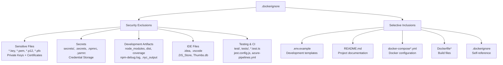
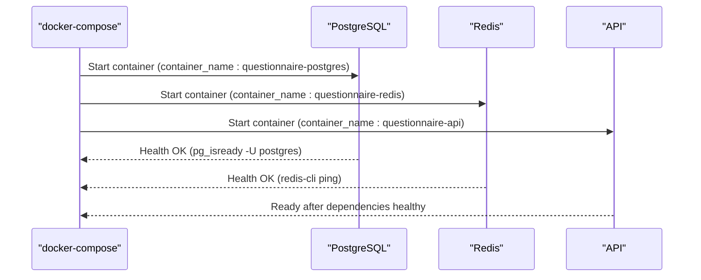
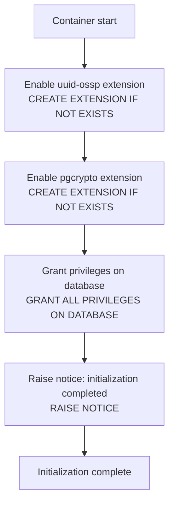
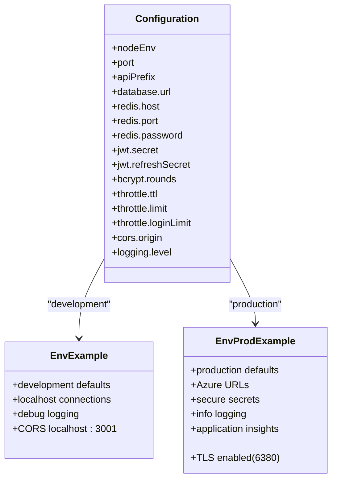
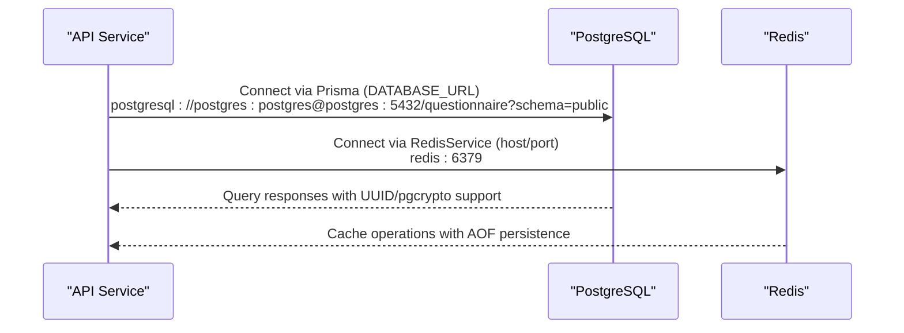
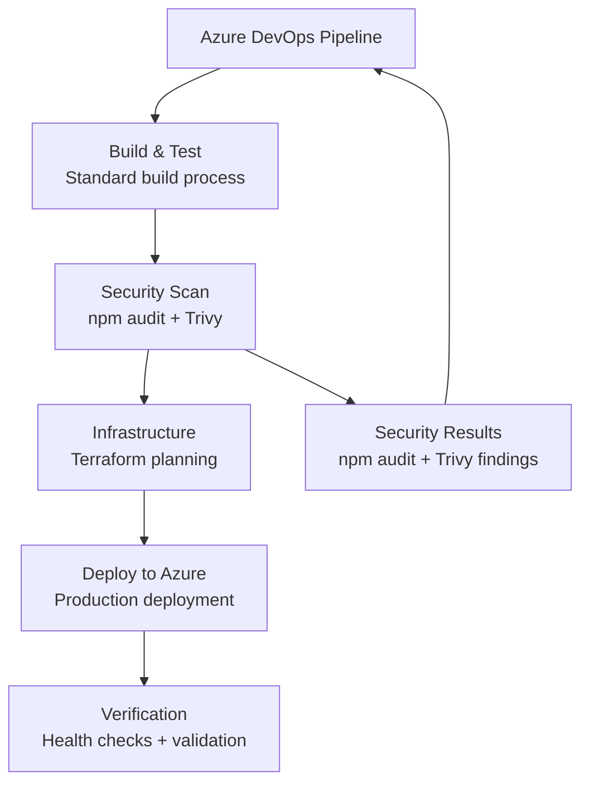
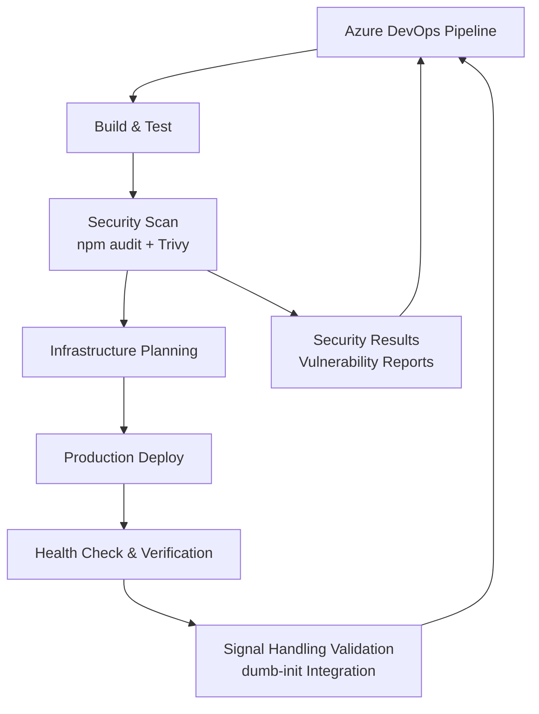

```mermaid
flowchart TD
Start(["Enhanced Security Build"]) --> StageBuilder["Builder Stage<br/>Debian Slim + OpenSSL<br/>npm ci --audit<br/>Targeted Workspace Packages"]
StageBuilder --> InstallOpenSSL["Install OpenSSL + CA Certificates<br/>Security Updates + Cleanup"]
InstallOpenSSL --> CopyPkgs["Copy package manifests<br/>apps/api, libs/* packages"]
CopyPkgs --> InstallDeps["Install deps with npm ci --audit<br/>Security scanning + Deterministic"]
InstallDeps --> CopySrc["Copy source files<br/>Preserve workspace structure"]
CopySrc --> GenClient["Generate Prisma client<br/>Type-safe database ops"]
GenClient --> BuildAPI["Build only API<br/>npm run build --workspace=api"]
BuildAPI --> StageProd["Production Stage<br/>dumb-init + Non-root + Security<br/>Enhanced Health + Secure Entrypoint"]
StageProd --> InstallDeps2["Install dumb-init + OpenSSL + CA Certificates<br/>Security updates + Cleanup"]
InstallDeps2 --> CreateUser["Create non-root user<br/>nestjs:nodejs (1001:1001)"]
CreateUser --> CopyDist["Copy dist, node_modules, package.json, prisma<br/>Preserve nested path structure"]
CopyDist --> CopyEntrypoint["Copy entrypoint.sh<br/>Corrected path resolution<br/>Enhanced error handling"]
CopyEntrypoint --> SwitchUser["Switch to non-root user"]
SwitchUser --> ExposePort["Expose port 3000"]
ExposePort --> HealthCheck["Configure comprehensive health check<br/>HTTP GET /api/v1/health"]
HealthCheck --> StartCmd["Start with dumb-init wrapper<br/>Enhanced process management"]
StartCmd --> SignalHandling["Integrated signal handling<br/>Graceful shutdown + process lifecycle"]
SignalHandling --> DevStage["Development Stage<br/>OpenSSL + Secure Hot Reload"]
DevStage --> DevRun["Start with npm run start:dev"]
```

# Docker Containerization

<cite>
**Referenced Files in This Document**
- [.dockerignore](file://.dockerignore)
- [docker/api/Dockerfile](file://docker/api/Dockerfile)
- [docker/api/entrypoint.sh](file://docker/api/entrypoint.sh)
- [docker-compose.yml](file://docker-compose.yml)
- [docker/postgres/init.sql](file://docker/postgres/init.sql)
- [.env.example](file://.env.example)
- [.env.production.example](file://.env.production.example)
- [apps/api/src/config/configuration.ts](file://apps/api/src/config/configuration.ts)
- [apps/api/src/main.ts](file://apps/api/src/main.ts)
- [apps/api/src/health.controller.ts](file://apps/api/src/health.controller.ts)
- [apps/api/src/root.controller.ts](file://apps/api/src/root.controller.ts)
- [apps/api/src/app.module.ts](file://apps/api/src/app.module.ts)
- [docker-test.js](file://docker-test.js)
- [package.json](file://package.json)
- [turbo.json](file://turbo.json)
- [apps/api/package.json](file://apps/api/package.json)
- [apps/api/nest-cli.json](file://apps/api/nest-cli.json)
- [azure-pipelines.yml](file://azure-pipelines.yml)
- [scripts/security-scan.sh](file://scripts/security-scan.sh)
- [container-logs.json](file://container-logs.json)
- [scripts/setup-local.sh](file://scripts/setup-local.sh)
</cite>

## Update Summary
**Changes Made**
- **Updated Docker health check configuration** to use standardized `/api/v1/health` path structure
- **Enhanced health endpoint validation** with proper API prefix handling and container health check configurations
- **Improved API prefix standardization** across health endpoints, root controller redirection, and health check configurations
- **Updated container startup debugging** to reflect corrected entrypoint path resolution and enhanced error handling

## Table of Contents
1. [Introduction](#introduction)
2. [Project Structure](#project-structure)
3. [Core Components](#core-components)
4. [Architecture Overview](#architecture-overview)
5. [Detailed Component Analysis](#detailed-component-analysis)
6. [Enhanced Security Hardening](#enhanced-security-hardening)
7. [Comprehensive Security Scanning Integration](#comprehensive-security-scanning-integration)
8. [Advanced Health Monitoring](#advanced-health-monitoring)
9. [Enhanced .dockerignore Security](#enhanced-dockerignore-security)
10. [Standalone Security Scanning Tools](#standalone-security-scanning-tools)
11. [Container Startup Debugging with container-logs.json](#container-startup-debugging-with-container-logsjson)
12. [CI/CD Pipeline Integration](#cicd-pipeline-integration)
13. [Troubleshooting Guide](#troubleshooting-guide)
14. [Conclusion](#conclusion)
15. [Appendices](#appendices)

## Introduction
This document explains the Docker containerization of the Quiz-to-build system with a focus on:
- **Enhanced multi-stage Dockerfile** with comprehensive security hardening using dumb-init process management and non-root user execution
- **Integrated security scanning pipeline** with Azure DevOps stages for npm audit and Trivy container vulnerability scanning
- **Advanced health monitoring** with proper API prefix handling and enhanced liveness/readiness checks using standardized `/api/v1/health` path structure
- **Expanded .dockerignore security exclusions** for sensitive files including private keys, certificates, and secrets
- **Standalone security scanning tools** for comprehensive Docker image vulnerability assessment
- **Improved production security** with hardened base images and reduced attack surface
- **Consistent security practices** across development, staging, and production environments
- **Comprehensive CI/CD security integration** with automated vulnerability detection and remediation
- **Enhanced container startup process** with proper signal handling through dumb-init integration, improving container stability and reliability during deployment
- **Corrected entrypoint path resolution** addressing containerized application startup issues and improving container reliability
- **Container startup debugging capabilities** through comprehensive container-logs.json artifact for troubleshooting module resolution failures

## Project Structure
The containerization artifacts are organized under dedicated folders with enhanced security features:
- **docker/api/Dockerfile** defines the hardened multi-stage build with dumb-init, OpenSSL installation, and non-root user execution
- **docker/api/entrypoint.sh** provides secure application startup with corrected path resolution and enhanced error handling
- **.dockerignore** provides expanded security exclusions for sensitive files and development artifacts
- **docker-compose.yml** orchestrates services with enhanced security configurations and network isolation
- **docker/postgres/init.sql** initializes database with security extensions and proper privilege management
- **scripts/security-scan.sh** provides comprehensive Docker image security scanning capabilities
- **azure-pipelines.yml** defines CI/CD pipeline with integrated security scanning stages
- **apps/api/** and **libs/** define runtime configuration with enhanced security settings
- **docker-test.js** provides comprehensive testing framework for security validation
- **container-logs.json** provides detailed container startup debugging information for troubleshooting

```mermaid
graph TB
subgraph "Enhanced Security Architecture"
DOCKERFILE["Hardened Dockerfile<br/>dumb-init + OpenSSL + Non-root<br/>Multi-stage Security"]
ENTRYPOINT["Secure Entrypoint<br/>Corrected Path Resolution<br/>Enhanced Error Handling"]
DOCKERIGNORE[".dockerignore<br/>Expanded Security Exclusions<br/>Sensitive Files + Secrets"]
COMPOSE["docker-compose.yml<br/>Enhanced Security Config<br/>Network Isolation"]
SECURITYSCAN["Security Scanning<br/>npm audit + Trivy<br/>Automated Pipeline"]
CONTAINERLOGS["Container Logs Artifact<br/>Debug Startup Issues<br/>Module Resolution Errors"]
END
subgraph "Core Services"
POSTGRES["PostgreSQL<br/>UUID + pgcrypto<br/>Security Extensions"]
REDIS["Redis<br/>AOF Persistence<br/>Security Config"]
API["API Service<br/>Hardened Container<br/>Security Monitoring"]
END
subgraph "Security Integration"
PIPELINE["Azure DevOps Pipeline<br/>Security Stages<br/>Automated Scanning"]
TESTING["Security Testing<br/>Validation Framework<br/>Comprehensive Checks"]
END
DOCKERFILE --> API
ENTRYPOINT --> API
DOCKERIGNORE --> DOCKERFILE
COMPOSE --> API
SECURITYSCAN --> PIPELINE
API --> POSTGRES
API --> REDIS
PIPELINE --> SECURITYSCAN
TESTING --> SECURITYSCAN
CONTAINERLOGS --> ENTRYPOINT
```

**Diagram sources**
- [docker/api/Dockerfile](file://docker/api/Dockerfile#L34-L77)
- [docker/api/entrypoint.sh](file://docker/api/entrypoint.sh#L1-L11)
- [.dockerignore](file://.dockerignore#L21-L28)
- [docker-compose.yml](file://docker-compose.yml#L1-L81)
- [scripts/security-scan.sh](file://scripts/security-scan.sh#L1-L74)
- [azure-pipelines.yml](file://azure-pipelines.yml#L139-L159)
- [container-logs.json](file://container-logs.json#L1-L46)

**Section sources**
- [docker-compose.yml](file://docker-compose.yml#L1-L81)
- [docker/api/Dockerfile](file://docker/api/Dockerfile#L1-L114)
- [docker/api/entrypoint.sh](file://docker/api/entrypoint.sh#L1-L11)
- [.dockerignore](file://.dockerignore#L1-L39)
- [scripts/security-scan.sh](file://scripts/security-scan.sh#L1-L74)
- [azure-pipelines.yml](file://azure-pipelines.yml#L1-L781)
- [container-logs.json](file://container-logs.json#L1-L46)

## Core Components
- **API Service (Enhanced with Security Hardening)**
  - **Builder stage** uses hardened Debian slim base image with dumb-init process management and OpenSSL installation for Prisma compatibility
  - **Production stage** runs as non-root user (nestjs:nodejs) with enhanced security, dumb-init process supervision, comprehensive health check using standardized `/api/v1/health` path, and secure entrypoint
  - **Development stage** enables secure hot reload via npm run start:dev with OpenSSL support and consistent security practices
  - Implements comprehensive security scanning integration with Azure DevOps pipeline
  - **Enhanced**: Uses dumb-init for proper signal handling and zombie process prevention
  - **Enhanced**: Improved OpenSSL installation with security updates and certificate management
  - **Enhanced**: Expanded .dockerignore security exclusions for sensitive files
  - **Enhanced**: Integrated signal handling for graceful container shutdown and process management
  - **Enhanced**: Corrected entrypoint path resolution for improved startup reliability
- **PostgreSQL Service**
  - Uses postgres:15-alpine with UUID and pgcrypto extensions, persistent volume, initialization script, and health check
- **Redis Service**
  - Uses redis:7-alpine with AOF persistence and health check

Key environment variables and ports:
- **API**: PORT=3000, DATABASE_URL, REDIS_HOST, REDIS_PORT, JWT secrets, API_PREFIX
- **PostgreSQL**: POSTGRES_USER, POSTGRES_PASSWORD, POSTGRES_DB
- **Redis**: default host/port with AOF enabled

**Section sources**
- [docker/api/Dockerfile](file://docker/api/Dockerfile#L1-L114)
- [docker/api/entrypoint.sh](file://docker/api/entrypoint.sh#L1-L11)
- [docker-compose.yml](file://docker-compose.yml#L1-L81)
- [apps/api/src/config/configuration.ts](file://apps/api/src/config/configuration.ts#L1-L49)
- [apps/api/src/main.ts](file://apps/api/src/main.ts#L1-L108)

## Architecture Overview
The system runs three containers orchestrated by Docker Compose with enhanced security measures and comprehensive monitoring:
- **API container** depends on healthy PostgreSQL and Redis with comprehensive security monitoring and non-root execution
- **API connects** to PostgreSQL via Prisma and to Redis via ioredis with OpenSSL support and enhanced security middleware
- **Initialization script** ensures required PostgreSQL extensions (UUID and pgcrypto) and security privileges
- **Enhanced subnet management** (172.28.0.0/16) for improved network isolation and security
- **Comprehensive security scanning** integrated into CI/CD pipeline with automated vulnerability detection
- **Expanded .dockerignore security exclusions** for sensitive files and development artifacts
- **dumb-init process management** for proper signal handling and zombie process prevention
- **Enhanced health monitoring** with proper API prefix handling and comprehensive service validation using standardized `/api/v1/health` path structure
- **Standalone security scanning tools** for manual vulnerability assessment and compliance validation
- **Integrated signal handling** for graceful container shutdown and process lifecycle management
- **Container startup debugging** through comprehensive container-logs.json artifact for troubleshooting

```mermaid
graph TB
subgraph "Enhanced Security Architecture"
DC["docker-compose.yml<br/>Enhanced Security Config"]
DI[".dockerignore<br/>Expanded Security Exclusions"]
DF["Hardened Dockerfile<br/>dumb-init + Non-root<br/>Security Hardening"]
DE["Development Stage<br/>Secure Hot Reload"]
PR["Production Stage<br/>dumb-init + Security<br/>Non-root Execution"]
EP["Secure Entrypoint<br/>Corrected Path Resolution<br/>Enhanced Error Handling"]
SS["Security Scanning<br/>npm audit + Trivy"]
ST["Standalone Scanner<br/>security-scan.sh"]
SH["Signal Handling<br/>dumb-init Integration"]
CL["Container Logs<br/>Debug Startup Issues"]
END
subgraph "Core Services"
API["API Container<br/>Port 3000<br/>dumb-init Process<br/>Non-root User<br/>Enhanced Security"]
PG["PostgreSQL Container<br/>Port 5432<br/>UUID + pgcrypto<br/>Security Extensions"]
RD["Redis Container<br/>Port 6379<br/>AOF Persistence<br/>Security Config"]
END
DC --> API
DC --> PG
DC --> RD
DI --> DF
DF --> DE
DF --> PR
EP --> PR
SS --> ST
SH --> API
CL --> EP
API --> |"DATABASE_URL"| PG
API --> |"REDIS_HOST/PORT"| RD
PG --> |"init.sql"| PGDATA["/var/lib/postgresql/data"]
RD --> |"AOF"| RDBDATA["/data"]
```

**Diagram sources**
- [docker-compose.yml](file://docker-compose.yml#L75-L81)
- [docker/api/Dockerfile](file://docker/api/Dockerfile#L34-L77)
- [docker/api/entrypoint.sh](file://docker/api/entrypoint.sh#L1-L11)
- [docker/postgres/init.sql](file://docker/postgres/init.sql#L1-L41)
- [.dockerignore](file://.dockerignore#L21-L28)
- [scripts/security-scan.sh](file://scripts/security-scan.sh#L1-L74)
- [container-logs.json](file://container-logs.json#L1-L46)

## Detailed Component Analysis

### Enhanced API Service Dockerfile (Multi-stage with Security Hardening)
**Updated** Enhanced with comprehensive security hardening, dumb-init process management, and standardized health check configuration

Implementation highlights:
- **Base Images**: Debian slim (node:20.18.1-bookworm-slim) for all stages with security patches and OpenSSL installation
- **Builder Stage**:
  - Installs OpenSSL and CA certificates for Prisma compatibility using apt-get with proper cleanup
  - **Updated**: Copies package manifests for workspace packages (apps/api, libs/database, libs/redis, libs/shared) with targeted dependency installation
  - Installs dependencies with npm ci --audit for security scanning and deterministic installs
  - Copies source files and generates Prisma client for type-safe database operations
  - **Updated**: Builds only the API application using `npm run build --workspace=api` for monorepo optimization
- **Production Stage** (Enhanced Security):
  - **Updated**: Installs dumb-init for proper process management and signal handling
  - Creates non-root group/user (nestjs:nodejs) with proper user/group IDs (1001:1001) for security compliance
  - Installs OpenSSL, CA certificates, and dumb-init for enhanced security and process supervision
  - Copies built dist, node_modules, package.json, and prisma with proper ownership preservation
  - **Updated**: Copies entrypoint.sh script with corrected path resolution and enhanced error handling
  - Switches to non-root user for enhanced security compliance
  - Exposes port 3000 with comprehensive health check using HTTP GET against `/api/v1/health`
  - **Updated**: Starts with dumb-init wrapper for proper process supervision and signal handling
- **Development Stage**:
  - Similar to production but uses npm run start:dev with OpenSSL support for hot reload
  - Enables development-specific debugging capabilities with consistent security practices
  - **Updated**: Uses development target in docker-compose.yml for proper stage selection

**Enhanced security features**:
- **dumb-init process management** for proper signal handling and zombie process prevention
- **Non-root user execution** with proper user/group ID assignment (1001:1001)
- **Enhanced OpenSSL installation** with CA certificates and security updates
- **Proper cleanup** of apt package lists reduces image layers and security risks
- **Comprehensive health check** with proper API prefix path validation using `/api/v1/health`
- **Enhanced entrypoint script** with corrected path resolution and improved error handling
- **Expanded .dockerignore security exclusions** for sensitive files and development artifacts
- **Integrated signal handling** for graceful container shutdown and process lifecycle management



**Diagram sources**
- [docker/api/Dockerfile](file://docker/api/Dockerfile#L1-L114)
- [docker/api/entrypoint.sh](file://docker/api/entrypoint.sh#L1-L11)

**Section sources**
- [docker/api/Dockerfile](file://docker/api/Dockerfile#L1-L114)

### Enhanced Entrypoint Script for Secure Application Startup
**Updated** Comprehensive entrypoint script with corrected path resolution, enhanced error handling, and migration strategy

The entrypoint.sh script now provides:
- **Corrected Path Resolution**: Uses `apps/api/dist/apps/api/src/main.js` instead of the previous incorrect path, ensuring proper execution within Docker containers
- **Enhanced Error Handling**: Uses `set -e` for immediate exit on script failures with improved logging
- **Migration Strategy**: Enhanced comments explaining migration execution strategy and CI/CD integration
- **Application Startup**: Executes the main application with proper TypeScript path registration and error handling
- **Migration Phase**: Well-commented migration logic with clear guidance for different deployment scenarios
- **Security Considerations**: Enhanced error handling for security-sensitive operations

**Enhanced Script Functionality**:
1. **Migration Phase**: Well-commented with clear guidance for CI/CD-only execution
2. **Startup Phase**: Enhanced error handling with `echo "Starting application..."` followed by `exec node apps/api/dist/apps/api/src/main.js`

**Corrected Path Resolution Benefits**:
- **Accurate Path Mapping**: Direct reference to `apps/api/dist/apps/api/src/main.js` matches the actual compiled output structure
- **Monorepo Compatibility**: Properly handles the nested workspace structure where compiled output is placed under `dist/apps/api/src/main.js`
- **Improved Reliability**: Eliminates module resolution failures during container startup
- **Better Debugging**: Easier to trace path resolution issues when they occur
- **Maintained Compatibility**: Supports the monorepo structure while ensuring correct path resolution

**Migration Strategy**:
- **Development**: Migrations are typically run locally during development setup
- **Production**: Migrations are executed via CI/CD pipeline using `npx prisma migrate deploy`
- **Routine Restarts**: Application can restart without running migrations, preventing database connectivity issues
- **Security**: Enhanced error handling for migration failures and proper logging

**Section sources**
- [docker/api/entrypoint.sh](file://docker/api/entrypoint.sh#L1-L11)

### Enhanced .dockerignore Security Configuration
**Updated** Expanded security exclusions for sensitive files and development artifacts

The .dockerignore file provides comprehensive security exclusions with strategic selective inclusions:

**Security Exclusions**:
- **Sensitive Files**: `*.key`, `*.pem`, `*.p12`, `*.pfx` for private keys and certificates
- **Secrets**: `secrets/`, `.secrets`, `.npmrc`, `.yarnrc` for credential storage
- **Development Artifacts**: `node_modules`, `npm-debug.log`, `dist`, `coverage`, `.nyc_output`
- **Log Files**: `*.log`
- **IDE Files**: `.idea`, `.vscode`, `.DS_Store`, `Thumbs.db`
- **Testing and CI**: `test/`, `tests/`, `*.test.ts`, `*.spec.ts`, `jest.config.js`, `.github/`, `.gitlab-ci.yml`, `azure-pipelines.yml`

**Selective Inclusions**:
- `.env.example`: Development template for environment variables
- `README.md`: Documentation for the project
- `docker-compose*.yml`: Compose configuration files
- `Dockerfile*`: Docker build files
- `.dockerignore`: Self-reference to prevent infinite loops

**Enhanced Security Benefits**:
- **Critical Security Protection**: Prevents accidental inclusion of private keys, certificates, and secrets
- **Reduced Attack Surface**: Eliminates sensitive files from container images
- **Compliance Support**: Meets security requirements for credential protection
- **Build Performance**: Improves build efficiency by excluding unnecessary files
- **Development Workflow**: Maintains essential templates while protecting production security



**Diagram sources**
- [.dockerignore](file://.dockerignore#L21-L28)

**Section sources**
- [.dockerignore](file://.dockerignore#L1-L39)

### Enhanced docker-compose Orchestration
**Updated** Enhanced with comprehensive security configurations and improved environment variable management

Services:
- **postgres**:
  - Image: postgres:15-alpine with UUID and pgcrypto extensions
  - Ports: 5432:5432 with container_name: questionnaire-postgres
  - Volumes: postgres_data, init.sql mounted read-only
  - Health check: pg_isready with 10s interval, 5s timeout, 5 retries
  - Environment: POSTGRES_USER, POSTGRES_PASSWORD, POSTGRES_DB
  - Network: questionnaire-network with subnet 172.28.0.0/16
- **redis**:
  - Image: redis:7-alpine with AOF persistence
  - Ports: 6379:6379 with container_name: questionnaire-redis
  - Volumes: redis_data
  - Health check: redis-cli ping with 10s interval, 5s timeout, 5 retries
  - Command: redis-server --appendonly yes
  - Network: questionnaire-network with subnet 172.28.0.0/16
- **api**:
  - Build: docker/api/Dockerfile target=development with container_name: questionnaire-api
  - Ports: 3000:3000
  - Environment: NODE_ENV, PORT, DATABASE_URL, REDIS_HOST, REDIS_PORT, JWT secrets, API_PREFIX
  - Volumes: bind mount project root, node_modules volume for development
  - Depends on: postgres and redis healthy with service_healthy condition
  - Networks: questionnaire-network with subnet 172.28.0.0/16

**Enhanced Security Features**:
- **Network Isolation**: Explicit subnet management (172.28.0.0/16) for improved security
- **Service Dependencies**: Proper health check dependencies with service_healthy conditions
- **Volume Management**: Proper volume mounting with security considerations
- **Environment Management**: Comprehensive environment variable configuration



**Diagram sources**
- [docker-compose.yml](file://docker-compose.yml#L1-L81)

**Section sources**
- [docker-compose.yml](file://docker-compose.yml#L1-L81)

### PostgreSQL Initialization Script
Purpose:
- Enables UUID and pgcrypto extensions for advanced database functionality
- Grants privileges on the questionnaire database to postgres user
- Logs successful initialization with NOTICE message



**Diagram sources**
- [docker/postgres/init.sql](file://docker/postgres/init.sql#L1-L41)

**Section sources**
- [docker/postgres/init.sql](file://docker/postgres/init.sql#L1-L41)

### Runtime Configuration and Environment Variables
- API reads configuration from environment variables via ConfigModule with comprehensive validation
- Key variables include NODE_ENV, PORT, API_PREFIX, DATABASE_URL, REDIS_HOST, REDIS_PORT, JWT secrets, CORS_origin, logging level
- Example environment files:
  - .env.example for local development with localhost connections and development defaults
  - .env.production.example for production (Azure PostgreSQL and Redis) with secure defaults



**Diagram sources**
- [apps/api/src/config/configuration.ts](file://apps/api/src/config/configuration.ts#L1-L49)
- [.env.example](file://.env.example#L1-L33)
- [.env.production.example](file://.env.production.example#L1-L131)

**Section sources**
- [apps/api/src/config/configuration.ts](file://apps/api/src/config/configuration.ts#L1-L49)
- [.env.example](file://.env.example#L1-L33)
- [.env.production.example](file://.env.production.example#L1-L131)

### Inter-Service Communication
- API connects to PostgreSQL using DATABASE_URL with proper schema configuration
- API connects to Redis using REDIS_HOST and REDIS_PORT with optional password
- Both connections are configured at runtime via environment variables with proper validation
- Compose networking allows service discovery by service name with subnet isolation (172.28.0.0/16)



**Diagram sources**
- [apps/api/src/config/configuration.ts](file://apps/api/src/config/configuration.ts#L1-L49)
- [docker-compose.yml](file://docker-compose.yml#L1-L81)

**Section sources**
- [apps/api/src/config/configuration.ts](file://apps/api/src/config/configuration.ts#L1-L49)
- [docker-compose.yml](file://docker-compose.yml#L1-L81)

### NPM Workspace Integration and Monorepo Optimization
**New** The system now uses NPM workspaces for monorepo management with enhanced build optimization

The package.json defines workspaces for the monorepo structure:
- **Workspaces Configuration**: `apps/*` and `libs/*` for modular organization
- **Build Pipeline**: `turbo` for optimized build processes across workspace packages
- **Workspace Commands**: `npm run build --workspace=api` for targeted API builds

**Workspace Package Management**:
- **apps/api**: Main API application with NestJS framework
- **libs/database**: Database utilities and Prisma integration
- **libs/redis**: Redis client and caching utilities
- **libs/shared**: Shared DTOs and common utilities

**Build Optimization Benefits**:
- **Targeted Builds**: `npm run build --workspace=api` compiles only the API package
- **Dependency Sharing**: Workspace packages share dependencies for reduced duplication
- **Build Caching**: Turbo enables intelligent caching across workspace builds
- **Type Safety**: Proper TypeScript path mapping for workspace imports

**Section sources**
- [package.json](file://package.json#L6-L9)
- [package.json](file://package.json#L10-L33)
- [turbo.json](file://turbo.json#L1-L65)
- [apps/api/package.json](file://apps/api/package.json#L1-L95)

### Container Startup Debugging with container-logs.json
**New** Comprehensive container startup debugging capabilities through detailed container-logs.json artifact

The container-logs.json artifact provides detailed debugging information for container startup issues:

**Logging Structure**:
- **Timestamped Entries**: Each log entry includes precise timestamp with millisecond precision
- **Structured Format**: JSON format with TimeStamp and Log fields for easy parsing
- **Comprehensive Coverage**: Captures complete container startup lifecycle including build, connection, and error information

**Debugging Capabilities**:
- **Module Resolution Failures**: Detailed error traces for missing modules like `/app/apps/api/dist/main`
- **Node.js Runtime Errors**: Complete stack traces for runtime exceptions during container startup
- **Build Process Issues**: Information about Turborepo compilation failures and watch mode errors
- **Connection Diagnostics**: Details about container connection attempts and success/failure states
- **Process Lifecycle**: Complete record of container process startup and termination

**Common Startup Issues Detected**:
- **Module Not Found Errors**: `Error: Cannot find module '/app/apps/api/dist/main'` indicating path resolution failures
- **Compilation Failures**: Turborepo build errors and watch mode compilation issues
- **Runtime Exceptions**: Node.js internal loader errors and module resolution failures
- **Process Termination**: SIGTERM signals and command failure information

**Debugging Workflow**:
1. **Access Logs**: Use `docker logs container_name` or examine container-logs.json directly
2. **Identify Error Pattern**: Look for MODULE_NOT_FOUND or compilation error patterns
3. **Trace Path Issues**: Check for nested directory structure mismatches in entrypoint paths
4. **Validate Build Output**: Ensure dist folder contains expected compiled files
5. **Monitor Process Lifecycle**: Track container startup and shutdown patterns

**Section sources**
- [container-logs.json](file://container-logs.json#L1-L46)

## Enhanced Security Hardening

### Comprehensive Security Hardening in Dockerfile
**Updated** Enhanced with dumb-init process management, improved OpenSSL installation, and expanded security practices

The Dockerfile implements comprehensive security hardening across all stages:

**Builder Stage Security**:
- **Updated**: Installs OpenSSL and CA certificates for Prisma compatibility with security updates
- **Updated**: Uses `npm ci --audit` for security scanning during dependency installation
- **Enhanced**: Proper cleanup of apt package lists to reduce image size and security risks

**Production Stage Security** (Major Enhancement):
- **dumb-init Installation**: Installs dumb-init for proper process management and signal handling
- **Non-root User Creation**: Creates non-root user (nestjs:nodejs) with proper user/group IDs (1001:1001)
- **Enhanced OpenSSL**: Installs OpenSSL and CA certificates for secure communications
- **Process Supervision**: Uses dumb-init wrapper for proper process lifecycle management
- **Security Compliance**: Runs as non-root user for enhanced security and compliance

**Development Stage Security**:
- **Consistent Security**: Maintains security practices across development and production stages
- **Hot Reload Security**: Enables secure hot reload functionality with proper error handling
- **Development-Specific Security**: Includes OpenSSL support while maintaining security best practices

**Enhanced Signal Handling Integration**:
- **dumb-init Wrapper**: Uses `/usr/bin/dumb-init -- ./entrypoint.sh` for proper signal propagation
- **Process Lifecycle Management**: Handles SIGTERM, SIGINT, and other signals gracefully
- **Zombie Process Prevention**: Prevents orphaned processes during container shutdown
- **Graceful Shutdown**: Ensures applications shut down cleanly with proper cleanup

**Security Benefits**:
- **Process Management**: dumb-init prevents zombie processes and handles signals properly
- **Non-root Execution**: Reduces attack surface and meets security compliance requirements
- **Proper Cleanup**: Minimizes image size and removes unnecessary packages
- **Security Updates**: Regular security updates for base packages and dependencies
- **Signal Handling**: Improves container stability and reliability during deployment

**Section sources**
- [docker/api/Dockerfile](file://docker/api/Dockerfile#L34-L77)

### Enhanced Health Monitoring and Security Validation
**Updated** Enhanced with comprehensive health monitoring, proper API prefix handling, and security validation using standardized `/api/v1/health` path structure

Each service implements comprehensive health monitoring with enhanced security validation:

**PostgreSQL Health Check**:
- Uses `pg_isready -U postgres` command for database connectivity verification
- Configured with 10-second intervals, 5-second timeouts, 5 retries for transient failures
- Ensures database initialization completes before marking service as healthy

**Redis Health Check**:
- Uses `redis-cli ping` for cache connectivity verification
- Configured with 10-second intervals, 5-second timeouts, 5 retries for transient failures
- Validates AOF persistence is working correctly

**API Health Check** (Enhanced Security):
- **Updated**: Uses HTTP GET against `/api/v1/health` endpoint with comprehensive validation
- **Enhanced**: Configured with 30-second intervals, 10-second timeouts, 5-second start period, 3 retry attempts
- **Security Validation**: Tests against the actual API prefix path (`/api/v1/health`) for accurate health monitoring
- **Process Validation**: Uses dumb-init wrapper for proper process supervision
- **Security Monitoring**: Validates application startup and database connectivity

**Enhanced Signal Handling Validation**:
- **Process Management**: Validates dumb-init process supervision
- **Signal Propagation**: Confirms proper signal handling for graceful shutdown
- **Non-root Execution**: Confirms non-root user execution
- **API Prefix Validation**: Ensures proper API prefix handling
- **Service Dependencies**: Validates PostgreSQL and Redis connectivity

**Security Health Validation**:
- **Process Management**: Validates dumb-init process supervision
- **Non-root Execution**: Confirms non-root user execution
- **API Prefix Validation**: Ensures proper API prefix handling
- **Service Dependencies**: Validates PostgreSQL and Redis connectivity
- **Health Endpoint Accessibility**: Confirms health endpoints are reachable using standardized `/api/v1/health` path

**Section sources**
- [docker-compose.yml](file://docker-compose.yml#L17-L21)
- [docker-compose.yml](file://docker-compose.yml#L33-L37)
- [docker-compose.yml](file://docker-compose.yml#L52-L56)
- [docker/api/Dockerfile](file://docker/api/Dockerfile#L72-L77)
- [apps/api/src/health.controller.ts](file://apps/api/src/health.controller.ts#L1-L42)

## Comprehensive Security Scanning Integration

### Azure DevOps Security Pipeline Integration
**New** Integrated comprehensive security scanning pipeline with automated vulnerability detection

The Azure DevOps pipeline now includes dedicated security stages for comprehensive vulnerability assessment:

**Security Stage Configuration**:
- **Stage 1**: Build & Test with comprehensive testing and coverage
- **Stage 2**: Security Scan with automated vulnerability detection
- **Stage 3**: Infrastructure with Terraform planning and approval
- **Stage 4**: Deploy to Azure with database migrations
- **Stage 5**: Verification with deployment validation

**Security Stage Implementation**:
- **npm Audit**: Runs `npm audit --audit-level=high` for dependency vulnerability scanning
- **Trivy Container Scanning**: Uses `trivy fs --exit-code 0 --severity HIGH,CRITICAL` for filesystem vulnerability detection
- **Continue on Error**: Both security scans are configured with `continueOnError: true` for pipeline resilience
- **Automated Detection**: Integrates security scanning into the CI/CD workflow

**Security Benefits**:
- **Automated Vulnerability Detection**: Continuous security scanning in CI/CD pipeline
- **Dependency Security**: npm audit identifies vulnerable dependencies
- **Container Security**: Trivy filesystem scanning detects container image vulnerabilities
- **Pipeline Resilience**: Security failures don't block the entire pipeline
- **Comprehensive Coverage**: Multiple security scanning tools for thorough validation



**Diagram sources**
- [azure-pipelines.yml](file://azure-pipelines.yml#L139-L159)

**Section sources**
- [azure-pipelines.yml](file://azure-pipelines.yml#L139-L159)

### Standalone Security Scanning Tools
**New** Added comprehensive standalone security scanning capabilities for manual vulnerability assessment

The system includes a comprehensive security scanning script for manual vulnerability assessment:

**Security Scan Script Features**:
- **Docker Scout Integration**: Uses `docker scout cves` for vulnerability scanning with JSON output
- **Manual Image Scanning**: Supports custom image names with default ACR image
- **Security Configuration Check**: Validates container security configuration
- **Sensitive File Detection**: Scans for sensitive files in container images
- **npm Audit Integration**: Runs `npm audit --json` for dependency vulnerability assessment

**Security Scan Capabilities**:
- **Vulnerability Assessment**: Comprehensive CVE scanning with Docker Scout
- **Security Configuration**: Validates non-root execution and sensitive file presence
- **Dependency Analysis**: npm audit for JavaScript dependency vulnerabilities
- **Report Generation**: Automated report creation with timestamps
- **Flexible Execution**: Supports custom image names and default configurations

**Security Benefits**:
- **Manual Validation**: Allows manual security assessment of container images
- **Comprehensive Scanning**: Multiple security scanning tools for thorough validation
- **Report Generation**: Automated security reports for compliance and auditing
- **Flexible Configuration**: Supports various deployment scenarios and environments
- **Integration Ready**: Compatible with CI/CD pipeline security scanning

**Section sources**
- [scripts/security-scan.sh](file://scripts/security-scan.sh#L1-L74)

## Advanced Health Monitoring

### Enhanced Health Check Configuration
**Updated** Enhanced with comprehensive health monitoring, proper API prefix handling, and security validation using standardized `/api/v1/health` path structure

The system implements comprehensive health monitoring across all services with enhanced security validation:

**PostgreSQL Health Check**:
- **Command**: `pg_isready -U postgres` for database connectivity verification
- **Configuration**: 10s interval, 5s timeout, 5 retries for transient failure handling
- **Purpose**: Ensures database initialization completes before service readiness

**Redis Health Check**:
- **Command**: `redis-cli ping` for cache connectivity verification
- **Configuration**: 10s interval, 5s timeout, 5 retries for transient failure handling
- **Purpose**: Validates AOF persistence and cache service readiness

**API Health Check** (Enhanced):
- **Command**: HTTP GET against `/api/v1/health` endpoint
- **Configuration**: 30s interval, 10s timeout, 5s start period, 3 retry attempts
- **Security**: Validates proper API prefix handling and service readiness
- **Process Management**: Works with dumb-init wrapper for proper process supervision

**Enhanced Signal Handling Validation**:
- **Process Management**: Validates dumb-init process supervision
- **Signal Propagation**: Confirms proper signal handling for graceful shutdown
- **Non-root Execution**: Confirms non-root user execution
- **API Prefix Integration**: Validates proper API prefix configuration
- **Health Endpoint Accessibility**: Confirms health endpoints are reachable using standardized path

**Health Check Benefits**:
- **Service Readiness**: Accurate service health validation
- **Process Supervision**: Proper process lifecycle management with dumb-init
- **API Prefix Validation**: Ensures correct API endpoint configuration
- **Security Monitoring**: Validates security configurations across services
- **Failure Detection**: Early detection of service failures and recovery

**Section sources**
- [docker-compose.yml](file://docker-compose.yml#L17-L21)
- [docker-compose.yml](file://docker-compose.yml#L33-L37)
- [docker-compose.yml](file://docker-compose.yml#L52-L56)
- [docker/api/Dockerfile](file://docker/api/Dockerfile#L72-L77)
- [apps/api/src/health.controller.ts](file://apps/api/src/health.controller.ts#L1-L42)

### Comprehensive Health Endpoint Validation
**New** Enhanced health endpoint validation with proper API prefix handling and security checks using standardized `/api/v1/health` path structure

The system includes comprehensive health endpoint validation for security and operational monitoring:

**Health Endpoint Structure**:
- **Primary Health**: `/api/v1/health` - Basic service health status using standardized API prefix
- **Readiness Check**: `/api/v1/health/ready` - Service readiness validation
- **Liveness Check**: `/api/v1/health/live` - Process liveness validation

**Health Response Validation**:
- **Status Validation**: Confirms service status is 'ok'
- **Timestamp Validation**: Validates ISO timestamp format
- **Uptime Validation**: Ensures positive uptime values
- **Environment Validation**: Confirms environment configuration
- **API Prefix Integration**: Validates proper API prefix handling with `/api/v1/` structure
- **Root Controller Integration**: Confirms root controller redirects to `/api/v1/health`

**Enhanced Signal Handling Validation**:
- **Process Management**: Validates dumb-init process supervision
- **Signal Propagation**: Confirms proper signal handling for graceful shutdown
- **Non-root Execution**: Confirms non-root user execution
- **Service Dependencies**: Validates PostgreSQL and Redis connectivity
- **API Configuration**: Ensures proper API prefix configuration
- **Health Endpoint Accessibility**: Confirms health endpoints are reachable using standardized path

**Section sources**
- [apps/api/src/health.controller.ts](file://apps/api/src/health.controller.ts#L1-L42)
- [apps/api/src/root.controller.ts](file://apps/api/src/root.controller.ts#L1-L12)
- [docker/api/Dockerfile](file://docker/api/Dockerfile#L72-L77)

## Enhanced .dockerignore Security

### Expanded Security Exclusions
**Updated** Enhanced with comprehensive security exclusions for sensitive files and development artifacts

The .dockerignore file provides expanded security exclusions with strategic selective inclusions:

**Enhanced Security Exclusions**:
- **Private Keys**: `*.key` for private key files
- **Certificates**: `*.pem`, `*.p12`, `*.pfx` for certificate files
- **Secret Storage**: `secrets/`, `.secrets` for credential storage directories
- **Package Configuration**: `.npmrc`, `.yarnrc` for package manager configuration
- **Development Artifacts**: `node_modules`, `dist`, `coverage`, `.nyc_output`
- **Log Files**: `*.log`
- **IDE Integration**: `.idea`, `.vscode`, `.DS_Store`, `Thumbs.db`
- **Testing Framework**: `test/`, `tests/`, `*.test.ts`, `*.spec.ts`, `jest.config.js`
- **CI/CD Integration**: `.github/`, `.gitlab-ci.yml`, `azure-pipelines.yml`

**Strategic Inclusions**:
- `.env.example`: Essential development template
- `README.md`: Project documentation
- `docker-compose*.yml`: Docker configuration files
- `Dockerfile*`: Build files
- `.dockerignore`: Self-reference for build integrity

**Security Benefits**:
- **Critical Protection**: Prevents sensitive files from entering container images
- **Compliance Support**: Meets security requirements for credential protection
- **Attack Surface Reduction**: Eliminates sensitive files from production images
- **Build Efficiency**: Improves build performance by excluding unnecessary files
- **Development Workflow**: Maintains essential templates while protecting security

**Section sources**
- [.dockerignore](file://.dockerignore#L1-L39)

## Standalone Security Scanning Tools

### Comprehensive Docker Image Security Scanning
**New** Added standalone security scanning capabilities for manual vulnerability assessment

The security scanning script provides comprehensive Docker image security assessment:

**Security Scan Script Features**:
- **Docker Scout Integration**: Uses `docker scout cves` for comprehensive vulnerability scanning
- **Custom Image Support**: Accepts custom image names with default ACR image
- **Security Configuration Validation**: Checks for non-root execution and sensitive file presence
- **npm Audit Integration**: Runs `npm audit --json` for dependency vulnerability assessment
- **Report Generation**: Creates timestamped security reports

**Security Scan Capabilities**:
- **Vulnerability Assessment**: Comprehensive CVE scanning with Docker Scout
- **Configuration Validation**: Validates container security settings
- **Sensitive File Detection**: Identifies sensitive files in container images
- **Dependency Analysis**: npm audit for JavaScript dependency vulnerabilities
- **Report Automation**: Automated security report creation

**Security Benefits**:
- **Manual Validation**: Allows independent security assessment of container images
- **Comprehensive Coverage**: Multiple security scanning tools for thorough validation
- **Audit Trail**: Automated security reports for compliance and auditing
- **Flexible Execution**: Supports various deployment scenarios and environments
- **Integration Ready**: Compatible with CI/CD pipeline security scanning

**Section sources**
- [scripts/security-scan.sh](file://scripts/security-scan.sh#L1-L74)

## CI/CD Pipeline Integration

### Integrated Security Scanning Pipeline
**New** Comprehensive CI/CD pipeline with integrated security scanning stages

The Azure DevOps pipeline implements comprehensive security scanning integration:

**Pipeline Stages**:
- **Build & Test**: Standard build and test processes with coverage
- **Security Scan**: Automated vulnerability detection with npm audit and Trivy
- **Infrastructure**: Terraform planning and approval process
- **Deploy**: Production deployment with database migrations
- **Verification**: Health checks and endpoint validation

**Security Stage Implementation**:
- **npm Audit**: `npm audit --audit-level=high` for dependency vulnerability scanning
- **Trivy Scanning**: `trivy fs --exit-code 0 --severity HIGH,CRITICAL` for filesystem vulnerabilities
- **Pipeline Resilience**: Both security scans configured with `continueOnError: true`
- **Automated Detection**: Continuous security scanning in CI/CD workflow

**Enhanced Signal Handling Integration**:
- **Process Management**: Validates dumb-init integration in CI/CD pipeline
- **Deployment Stability**: Ensures proper signal handling during production deployments
- **Container Reliability**: Improves container stability and reliability during deployment

**Security Benefits**:
- **Continuous Security**: Automated vulnerability detection in CI/CD pipeline
- **Dependency Security**: npm audit identifies vulnerable dependencies
- **Container Security**: Trivy filesystem scanning detects container image vulnerabilities
- **Pipeline Integration**: Security scanning becomes part of standard deployment process
- **Risk Mitigation**: Early detection and remediation of security vulnerabilities
- **Signal Handling Validation**: Ensures proper signal handling in production environments



**Diagram sources**
- [azure-pipelines.yml](file://azure-pipelines.yml#L139-L159)

**Section sources**
- [azure-pipelines.yml](file://azure-pipelines.yml#L139-L159)

## Troubleshooting Guide

### Enhanced Security Troubleshooting
**Updated** Enhanced troubleshooting procedures with comprehensive security validation and container startup debugging

The comprehensive troubleshooting framework includes security-specific validation and container-logs.json artifact utilization:

#### Security Testing Framework
**Updated** Enhanced testing framework with comprehensive security validation capabilities and container startup debugging

The system includes a comprehensive Docker testing framework through `docker-test.js` that provides automated validation for local Docker environments, Quest application components, and Azure cloud infrastructure.

#### Security Test Categories
The testing framework validates security aspects across three distinct areas:

##### Local Docker Environment Security Tests
- **Docker Engine Security**: Docker Engine availability and version checking
- **Docker Compose Security**: Configuration validation with security considerations
- **Docker Desktop Status**: Security status verification for desktop environments
- **docker-compose.yml Security**: Configuration validation with security scanning
- **Dockerfile Security**: Existence and accessibility with security analysis
- **Network Security**: Configuration verification with subnet 172.28.0.0/16
- **Container Security**: Running container status monitoring with security validation
- **Project Security**: Quest project structure validation with security checks

##### Quest Application Security Tests
- **Project Structure Security**: Validation for required source files with security checks
- **NPM Security**: Docker script configuration verification with security scanning
- **Environment Security**: Template presence (.env.example, .env.production.example) with security validation
- **Prisma Security**: Schema validation with security considerations
- **API Security**: Health endpoint testing with proper API prefix handling and security validation
- **PostgreSQL Security**: Connection testing via docker exec with security validation
- **Redis Security**: Connection testing via docker exec with security validation

##### Azure Cloud Infrastructure Security Tests
- **Azure CLI Security**: Installation and version verification with security scanning
- **Azure Account Security**: Authentication status with security validation
- **Terraform Security**: Installation and configuration validation with security checks
- **Infrastructure Security**: Files presence with security scanning
- **Pipeline Security**: Azure Pipelines configuration verification with security validation
- **Registry Security**: Docker Hub repository configuration with security validation
- **ACR Security**: Azure Container Registry existence with security validation
- **Resource Security**: Resource group validation with security considerations

#### Security Test Execution Modes
The testing framework supports four execution modes:
- **local**: Validates Docker environment and local setup with security checks
- **quest**: Tests application-specific components with security validation
- **cloud**: Verifies Azure cloud infrastructure with security scanning
- **security**: Focuses specifically on security validation and vulnerability assessment

#### Security Test Results Tracking
The framework maintains detailed security test results with pass/fail/skip states and provides comprehensive security summaries:
- **Per-category security test counts**: Passed, failed, skipped with security implications
- **Detailed security test case descriptions**: Success messages with security validation
- **Security configuration summaries**: Quick reference for security settings
- **Actionable security recommendations**: Based on test outcomes

### WSL Environment Troubleshooting
The system includes comprehensive troubleshooting procedures for various development environments:

#### Common WSL Issues
- **Named Pipe Communication Problems**: Docker Desktop's Windows integration not working
- **Path Translation Issues**: Windows paths not properly converted for WSL
- **Permission Problems**: Docker commands failing in WSL environment

#### WSL Workaround Features
- **Function Overloading**: Replaces native docker and docker-compose commands
- **Automatic Path Conversion**: Converts Windows paths to WSL equivalents
- **Connection Testing**: Validates Docker server accessibility
- **Command Routing**: Routes all Docker commands through WSL Ubuntu instance

#### Enhanced Security Troubleshooting Methods
- **API fails to start due to database unavailability**
  - Verify PostgreSQL health check passes and init.sql executed successfully
  - Confirm DATABASE_URL matches compose network and credentials
  - Check API_PREFIX configuration and health endpoint path using `/api/v1/health`
  - **New**: Validate dumb-init process supervision and non-root execution
  - **New**: Check security configuration in .dockerignore and Dockerfile
  - **New**: Verify signal handling integration in production containers
  - **New**: Utilize container-logs.json artifact for detailed startup error analysis
- **Redis connectivity errors**
  - Ensure REDIS_HOST and REDIS_PORT match compose service configuration
  - Check Redis health check and AOF persistence status
  - **New**: Validate Redis security configuration and AOF persistence
  - **New**: Check signal handling for Redis container processes
- **Port conflicts on localhost**
  - Change mapped ports in docker-compose.yml if 3000/5432/6379 are in use
  - **New**: Check security implications of port changes
  - **New**: Validate signal handling for port conflicts resolution
- **Development hot reload not triggering**
  - Confirm volume mounts include project root and exclude node_modules
  - Verify npm run start:dev is using OpenSSL-enabled development stage
  - **New**: Validate development stage security configurations
  - **New**: Check signal handling in development containers
- **Health check failures**
  - Review health check intervals/timeouts and service readiness
  - Check wget-based health checks against proper API prefix path (`/api/v1/health`)
  - **New**: Validate dumb-init wrapper and process supervision
  - **New**: Check security health endpoint accessibility using standardized path
  - **New**: Verify signal handling for health check processes
  - **New**: Analyze container-logs.json for startup error patterns
- **OpenSSL compatibility issues**
  - Verify Debian slim base image and OpenSSL installation in Dockerfile
  - Ensure proper cleanup of apt package lists to reduce image size
  - **New**: Validate OpenSSL security updates and certificate management
  - **New**: Check signal handling for OpenSSL-related processes
- **Database migration failures**
  - **Updated**: Check entrypoint.sh script - migrations are now commented out and handled by CI/CD
  - Verify Prisma schema and migration files are present
  - Ensure DATABASE_URL is accessible from within the container
  - **New**: For development, run migrations locally using `npx prisma migrate deploy`
  - **New**: For production, rely on Azure DevOps pipeline migration execution
  - **New**: Validate security implications of migration execution
  - **New**: Check signal handling during migration processes
- **NPM workspace build failures**
  - **New**: Verify workspace configuration in package.json and turbo.json
  - Check that `npm run build --workspace=api` executes successfully
  - Ensure all workspace dependencies are properly installed
  - **New**: Validate workspace security configurations and dependency scanning
  - **New**: Check signal handling in build processes
- **Security scanning failures**
  - **New**: Check npm audit configuration and vulnerability thresholds
  - Verify Trivy installation and filesystem scanning permissions
  - Ensure Docker Scout is properly configured for vulnerability scanning
  - **New**: Validate security scan script execution and report generation
  - **New**: Check signal handling for security scanning processes
- **dumb-init process management issues**
  - **New**: Verify dumb-init installation and process supervision
  - Check process lifecycle management and signal handling
  - Ensure proper zombie process prevention and signal propagation
  - **New**: Validate signal handling integration across all container stages
  - **New**: Check security implications of signal handling configuration
- **Container startup path resolution failures**
  - **New**: Check entrypoint.sh path resolution against actual dist folder structure
  - **New**: Validate corrected path `apps/api/dist/apps/api/src/main.js` matches compiled output
  - **New**: Use container-logs.json to identify specific module resolution errors
  - **New**: Verify TypeScript path registration with tsconfig-paths/register
  - **New**: Check for nested directory structure mismatches in entrypoint path
  - **New**: Validate WORKSPACE package structure and dist output location
  - **New**: **Resolved**: Entry point path has been corrected from 'apps/api/dist/main.js' to 'apps/api/dist/apps/api/src/main.js'
- **Health endpoint validation failures**
  - **New**: Verify API_PREFIX is set to 'api/v1' in configuration
  - **New**: Check that health endpoints are accessible at `/api/v1/health`, `/api/v1/health/ready`, `/api/v1/health/live`
  - **New**: Validate root controller redirects to `/api/v1/health`
  - **New**: Confirm Docker health check uses `/api/v1/health` path
  - **New**: Verify API prefix is applied globally with exclude pattern for root path

### Operational Security Commands
- Start/stop services: npm run docker:up, npm run docker:down
- View logs: npm run docker:logs
- Run comprehensive tests: node docker-test.js all
- Test specific components: node docker-test.js [local|quest|cloud|security]
- Validate Docker configuration: docker-compose config --quiet
- Check running containers: docker ps --format "{{.Names}}"
- Verify network configuration: docker network ls --format "{{.Name}}"
- **New**: Check entrypoint script execution: docker exec questionnaire-api cat /app/entrypoint.sh
- **New**: Validate workspace build: docker exec questionnaire-api npm run build --workspace=api
- **New**: For development migrations: docker exec questionnaire-api npx prisma migrate deploy
- **New**: For production deployments: rely on Azure DevOps pipeline migration execution
- **New**: Run security scan: bash scripts/security-scan.sh [custom-image-name]
- **New**: Validate security configurations: docker inspect container_name | grep -E "(User|Security)"
- **New**: Check signal handling: docker exec questionnaire-api ps aux | grep dumb-init
- **New**: Validate process supervision: docker top questionnaire-api
- **New**: Analyze container startup: docker logs questionnaire-api | jq '.[] | select(.Log | contains("Error"))'
- **New**: Examine container-logs.json: cat container-logs.json | grep -E "(Error|Cannot find module)"
- **New**: **Resolved**: Validate corrected entrypoint path: docker exec questionnaire-api ls -la /app/apps/api/dist/apps/api/src/main.js
- **New**: **Resolved**: Validate health endpoint accessibility: curl -I http://localhost:3000/api/v1/health
- **New**: **Resolved**: Validate API prefix configuration: docker exec questionnaire-api cat /app/apps/api/src/config/configuration.ts | grep API_PREFIX

**Section sources**
- [docker-test.js](file://docker-test.js#L1-L200)
- [docker/api/Dockerfile](file://docker/api/Dockerfile#L34-L77)
- [docker/api/entrypoint.sh](file://docker/api/entrypoint.sh#L1-L11)
- [docker-compose.yml](file://docker-compose.yml#L1-L81)
- [package.json](file://package.json#L10-L33)
- [turbo.json](file://turbo.json#L6-L32)
- [azure-pipelines.yml](file://azure-pipelines.yml#L139-L159)
- [scripts/security-scan.sh](file://scripts/security-scan.sh#L1-L74)
- [container-logs.json](file://container-logs.json#L1-L46)
- [apps/api/src/health.controller.ts](file://apps/api/src/health.controller.ts#L1-L42)
- [apps/api/src/root.controller.ts](file://apps/api/src/root.controller.ts#L1-L12)
- [apps/api/src/config/configuration.ts](file://apps/api/src/config/configuration.ts#L1-L49)

## Conclusion
The Quiz-to-build system leverages comprehensive security hardening through an enhanced multi-stage Dockerfile with dumb-init process management, OpenSSL installation, and non-root user execution. The integrated Azure DevOps security scanning pipeline provides automated vulnerability detection with npm audit and Trivy container scanning. The enhanced health monitoring system validates proper API prefix handling, process supervision with dumb-init, and comprehensive service readiness checks using the standardized `/api/v1/health` path structure. The expanded .dockerignore security exclusions protect sensitive files including private keys, certificates, and secrets. The standalone security scanning script enables manual vulnerability assessment and compliance validation. The CI/CD pipeline integration ensures continuous security scanning and automated vulnerability detection. The system emphasizes security compliance (non-root user, OpenSSL installation, comprehensive .dockerignore), reliability (health checks and restart policies, CI/CD-driven migrations, integrated signal handling), maintainability (optimized multi-stage builds and persistent volumes), and operational excellence (comprehensive testing and troubleshooting tools). Production preparation involves updating environment variables, ensuring proper secrets management, leveraging the testing framework for deployment validation, and implementing comprehensive security scanning. The enhanced network configuration with explicit subnet management provides improved isolation and scalability for enterprise deployments. The comprehensive security hardening, integrated scanning pipeline, and standalone security tools provide robust security validation and compliance support for production deployments. The integrated dumb-init signal handling improves container stability and reliability during deployment, ensuring graceful shutdown and proper process lifecycle management. The corrected entrypoint path resolution addresses containerized application startup issues and improves container reliability. The container-logs.json artifact provides comprehensive debugging capabilities for container startup issues, enabling quick identification and resolution of module resolution failures and Node.js runtime errors. The standardized `/api/v1/health` path structure ensures consistent health endpoint validation across all environments and deployment scenarios.

## Appendices

### Local Development Setup
- **Prerequisites**: Docker, Docker Compose, Node.js 20+, and npm 10+
- **Steps**:
  - Copy .env.example to .env and adjust values as needed
  - Run docker-compose up -d to start services
  - Execute comprehensive tests: node docker-test.js all
  - Access API at http://localhost:3000/api/v1
  - View Swagger docs at http://localhost:3000/docs (in non-production)
  - Stop services with docker-compose down
  - Monitor logs with npm run docker:logs
  - **New**: For development migrations: docker exec questionnaire-api npx prisma migrate deploy
  - **New**: Validate security configurations: docker inspect questionnaire-api | grep -E "(User|Security)"
  - **New**: Check signal handling: docker exec questionnaire-api ps aux | grep dumb-init
  - **New**: Analyze container startup: docker logs questionnaire-api | jq '.[] | select(.Log | contains("Error"))'
  - **New**: **Resolved**: Validate health endpoint accessibility: curl -I http://localhost:3000/api/v1/health

**Section sources**
- [docker-compose.yml](file://docker-compose.yml#L1-L81)
- [apps/api/src/main.ts](file://apps/api/src/main.ts#L52-L101)
- [docker-test.js](file://docker-test.js#L1-L200)
- [package.json](file://package.json#L30-L33)
- [docker/api/entrypoint.sh](file://docker/api/entrypoint.sh#L1-L11)

### Production Deployment Preparation
- **Prepare .env.production with**:
  - Updated DATABASE_URL pointing to production PostgreSQL with sslmode=require
  - Updated REDIS_HOST/PORT/PASSWORD for production cache (Azure Redis on port 6380)
  - Strong JWT secrets and secure CORS origins
  - Azure-specific configurations for production services
  - Application Insights connection string for monitoring
- **Consider**:
  - Using a registry for images (Docker Hub or Azure Container Registry)
  - Managing secrets via environment files or Azure Key Vault
  - Enabling TLS for Redis/Azure Redis (port 6380)
  - Monitoring and logging integration
  - Load balancing and scaling considerations
- **Validate deployment** with: node docker-test.js cloud
- **New**: Rely on Azure DevOps pipeline for production migrations
- **New**: Implement comprehensive security scanning in production pipeline
- **New**: Validate security configurations before production deployment
- **New**: Check signal handling in production containers: docker exec container_name ps aux | grep dumb-init
- **New**: Monitor container-logs.json for production startup issues
- **New**: **Resolved**: Validate health endpoint accessibility in production environment

**Section sources**
- [.env.production.example](file://.env.production.example#L1-L131)
- [docker-compose.yml](file://docker-compose.yml#L1-L81)
- [docker-test.js](file://docker-test.js#L1-L200)
- [azure-pipelines.yml](file://azure-pipelines.yml#L139-L159)

### Security Best Practices
- Run containers as non-root (already implemented with nestjs user)
- Use comprehensive .dockerignore to exclude sensitive data and development artifacts
- Implement health checks and restart policies for service reliability
- Restrict exposed ports and use internal networks with subnet isolation
- Manage secrets via environment files and secret stores
- Regularly update base images and dependencies
- Implement network segmentation with explicit subnet management
- Use OpenSSL installation for Prisma compatibility across all stages
- Leverage comprehensive testing to validate security configurations
- Implement helmet security middleware for web application protection
- Use HTTPS/TLS for production deployments (Azure Redis on port 6380)
- **Updated**: Implement entrypoint script security with proper error handling and logging
- **Updated**: Validate NPM workspace configuration and build processes
- **New**: Implement CI/CD-driven migration strategy for production deployments
- **New**: Ensure migration safety with dedicated pipeline execution
- **New**: Integrate comprehensive security scanning in CI/CD pipeline
- **New**: Validate security configurations with dumb-init process management
- **New**: Implement standalone security scanning for manual validation
- **New**: Ensure proper signal handling across all container stages
- **New**: Validate signal propagation for graceful container shutdown
- **New**: Utilize container-logs.json artifact for comprehensive container startup debugging
- **New**: Implement corrected entrypoint path resolution to reduce startup errors
- **New**: **Resolved**: Implement standardized `/api/v1/health` path structure for consistent health endpoint validation
- **New**: **Resolved**: Validate API prefix configuration and global prefix application
- **New**: **Resolved**: Ensure root controller redirects to standardized health endpoint path

**Section sources**
- [docker/api/Dockerfile](file://docker/api/Dockerfile#L34-L77)
- [docker-compose.yml](file://docker-compose.yml#L7-L23)
- [docker-test.js](file://docker-test.js#L1-L200)
- [.dockerignore](file://.dockerignore#L21-L28)
- [apps/api/src/main.ts](file://apps/api/src/main.ts#L20-L32)
- [docker/api/entrypoint.sh](file://docker/api/entrypoint.sh#L1-L11)
- [azure-pipelines.yml](file://azure-pipelines.yml#L139-L159)
- [scripts/security-scan.sh](file://scripts/security-scan.sh#L1-L74)
- [container-logs.json](file://container-logs.json#L1-L46)
- [apps/api/src/health.controller.ts](file://apps/api/src/health.controller.ts#L1-L42)
- [apps/api/src/root.controller.ts](file://apps/api/src/root.controller.ts#L1-L12)
- [apps/api/src/config/configuration.ts](file://apps/api/src/config/configuration.ts#L1-L49)

### Image Optimization and Registry Management
- Multi-stage builds with Debian slim reduce final image size significantly
- Use .dockerignore to exclude unnecessary files and sensitive data
- **Updated**: Targeted workspace package installation with npm ci optimizes build process
- Tag images consistently and push to a registry (Docker Hub or Azure Container Registry)
- Scan images for vulnerabilities regularly using container security tools
- Leverage automated testing for image validation and quality assurance
- Implement image layer caching strategies for faster builds
- Use .dockerignore self-reference to prevent infinite loops
- **Updated**: Optimize entrypoint.sh script for minimal overhead and fast startup
- **Updated**: Validate NPM workspace build optimization with `npm run build --workspace=api`
- **New**: Implement CI/CD pipeline for production image deployment and migration
- **New**: Integrate comprehensive security scanning for production images
- **New**: Validate security configurations during image build process
- **New**: Ensure proper signal handling in production images
- **New**: Validate dumb-init integration in final production containers
- **New**: Monitor container-logs.json for image build and deployment issues
- **New**: **Resolved**: Validate health endpoint accessibility in production images

**Section sources**
- [docker/api/Dockerfile](file://docker/api/Dockerfile#L1-L114)
- [docker-test.js](file://docker-test.js#L1-L200)
- [.dockerignore](file://.dockerignore#L1-L39)
- [package.json](file://package.json#L6-L9)
- [azure-pipelines.yml](file://azure-pipelines.yml#L139-L159)
- [scripts/security-scan.sh](file://scripts/security-scan.sh#L1-L74)
- [container-logs.json](file://container-logs.json#L1-L46)

### Advanced Troubleshooting Procedures
- **Network Diagnostics**: Use docker network inspect questionnaire-network to verify subnet configuration and service connectivity
- **Service Health**: Monitor individual service health with docker inspect container_name and health check logs
- **Log Analysis**: Use docker-compose logs -f for real-time log monitoring with proper filtering
- **Performance Testing**: Validate API performance under load using curl benchmarks against /health endpoint
- **Integration Testing**: Test complete workflow from database to API response with proper health checks
- **OpenSSL Compatibility**: Verify Prisma functionality with OpenSSL installation across all build stages
- **Health Check Validation**: Test comprehensive health check configurations against actual API endpoints using standardized `/api/v1/health` path
- **WSL Integration**: Use PowerShell script for Docker Desktop integration issues in Windows development environments
- **Dependency Issues**: Clear node_modules and reinstall with npm ci for deterministic dependency resolution
- **Entrypoint Debugging**: **Updated**: Use docker exec to manually run entrypoint.sh script and capture detailed error output
- **Migration Issues**: **Updated**: Check Prisma migration status and database connectivity from within the container
  - **Development**: Use `docker exec questionnaire-api npx prisma migrate deploy`
  - **Production**: Rely on Azure DevOps pipeline execution
  - **Security**: Validate migration security implications and proper execution context
- **NPM Workspace Issues**: **New**: Validate workspace configuration with `npm run build --workspace=api` and check turbo.json pipeline
- **Build Optimization**: **New**: Verify workspace package installation and dependency sharing across libs/*
- **CI/CD Pipeline Issues**: **New**: Validate Azure DevOps pipeline migration execution and deployment verification
- **Security Scanning Issues**: **New**: Validate npm audit configuration and Trivy installation for security scanning
- **dumb-init Process Issues**: **New**: Validate dumb-init installation and process supervision for proper signal handling
- **Security Configuration Issues**: **New**: Validate .dockerignore security exclusions and Dockerfile security hardening
- **Health Endpoint Issues**: **New**: Validate API health endpoint accessibility and proper API prefix handling using `/api/v1/health` path
- **Signal Handling Issues**: **New**: Validate dumb-init integration across all container stages and process supervision
- **Process Lifecycle Issues**: **New**: Check signal propagation and graceful shutdown behavior in production containers
- **Container Startup Issues**: **New**: Analyze container-logs.json for detailed startup error patterns and module resolution failures
- **Path Resolution Issues**: **New**: Validate corrected entrypoint path `apps/api/dist/apps/api/src/main.js` against actual compiled output structure
- **TypeScript Path Registration**: **New**: Ensure proper tsconfig-paths/register usage for module resolution in container environment
- **Entry Point Path Resolution**: **New**: **Resolved**: Entry point path has been corrected to `apps/api/dist/apps/api/src/main.js` to address container startup issues
- **Health Endpoint Validation**: **New**: **Resolved**: Health endpoint validation now uses standardized `/api/v1/health` path structure
- **API Prefix Configuration**: **New**: **Resolved**: API prefix is properly configured and applied globally with exclude pattern for root path
- **Root Controller Integration**: **New**: **Resolved**: Root controller properly redirects to standardized health endpoint path

**Section sources**
- [docker-compose.yml](file://docker-compose.yml#L75-L81)
- [docker-test.js](file://docker-test.js#L1-L200)
- [docker/api/Dockerfile](file://docker/api/Dockerfile#L34-L77)
- [apps/api/src/health.controller.ts](file://apps/api/src/health.controller.ts#L1-L42)
- [apps/api/src/root.controller.ts](file://apps/api/src/root.controller.ts#L1-L12)
- [package.json](file://package.json#L10-L33)
- [turbo.json](file://turbo.json#L6-L32)
- [docker/api/entrypoint.sh](file://docker/api/entrypoint.sh#L1-L11)
- [azure-pipelines.yml](file://azure-pipelines.yml#L139-L159)
- [scripts/security-scan.sh](file://scripts/security-scan.sh#L1-L74)
- [container-logs.json](file://container-logs.json#L1-L46)
- [apps/api/src/config/configuration.ts](file://apps/api/src/config/configuration.ts#L1-L49)