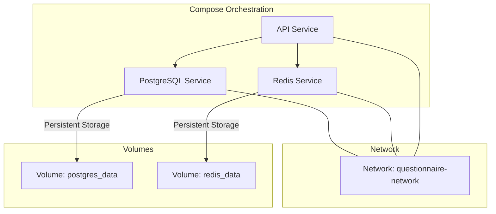
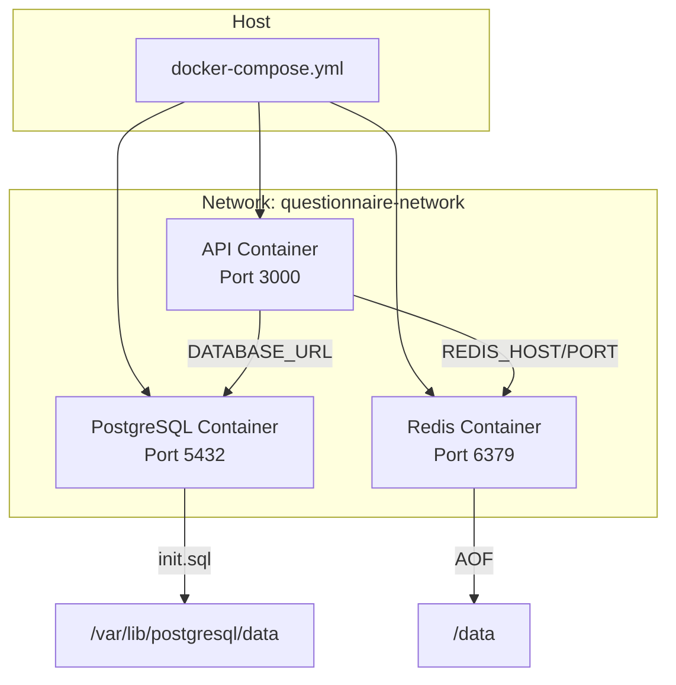
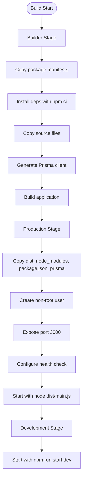
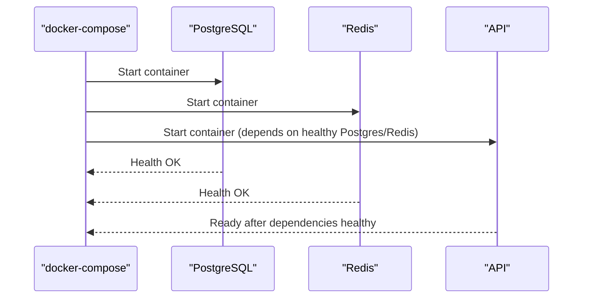
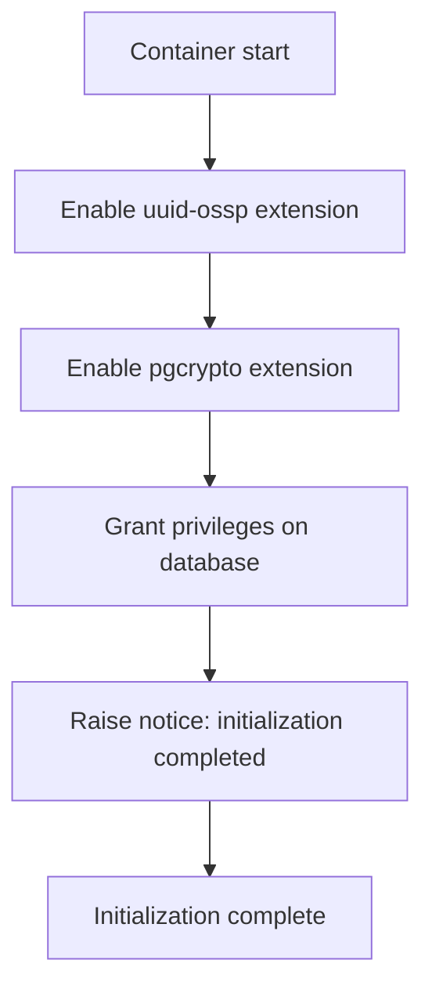
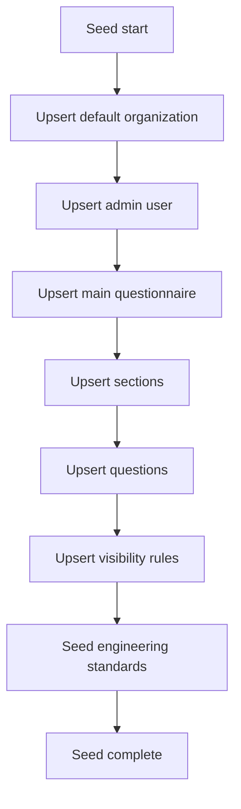
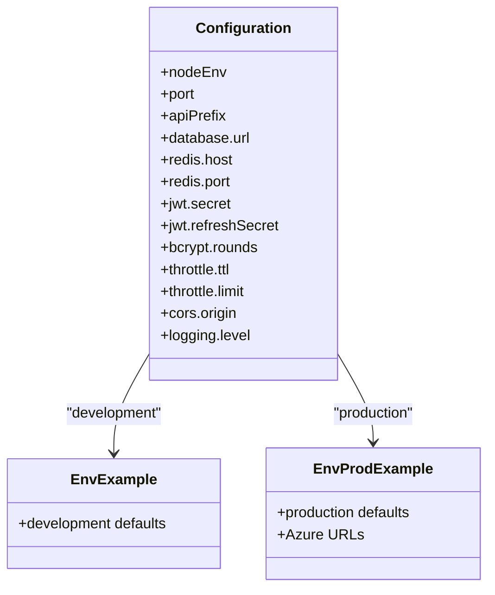
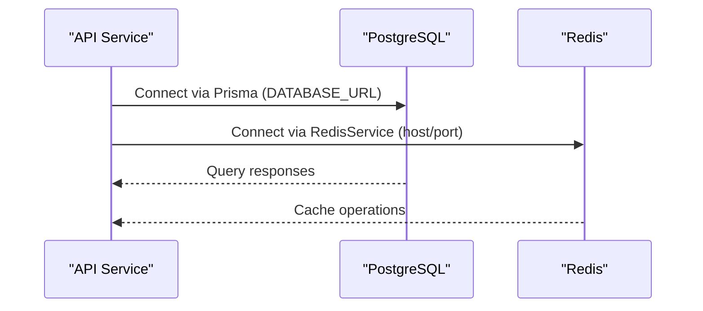
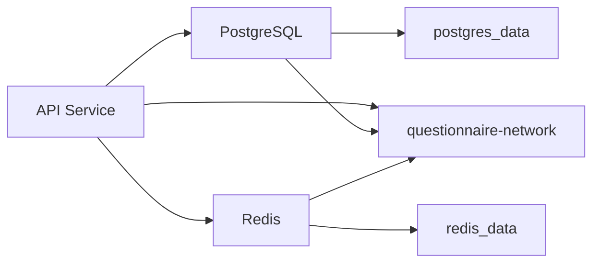

# Docker Containerization

<cite>
**Referenced Files in This Document**
- [Dockerfile](file://docker/api/Dockerfile)
- [docker-compose.yml](file://docker-compose.yml)
- [init.sql](file://docker/postgres/init.sql)
- [package.json](file://package.json)
- [schema.prisma](file://prisma/schema.prisma)
- [seed.ts](file://prisma/seed.ts)
- [standards.seed.ts](file://prisma/seeds/standards.seed.ts)
- [prisma.service.ts](file://libs/database/src/prisma.service.ts)
- [redis.service.ts](file://libs/redis/src/redis.service.ts)
- [.env.example](file://.env.example)
- [.env.production.example](file://.env.production.example)
- [configuration.ts](file://apps/api/src/config/configuration.ts)
- [main.ts](file://apps/api/src/main.ts)
- [app.module.ts](file://apps/api/src/app.module.ts)
</cite>

## Table of Contents
1. [Introduction](#introduction)
2. [Project Structure](#project-structure)
3. [Core Components](#core-components)
4. [Architecture Overview](#architecture-overview)
5. [Detailed Component Analysis](#detailed-component-analysis)
6. [Dependency Analysis](#dependency-analysis)
7. [Performance Considerations](#performance-considerations)
8. [Troubleshooting Guide](#troubleshooting-guide)
9. [Conclusion](#conclusion)
10. [Appendices](#appendices)

## Introduction
This document explains the Docker containerization of the Quiz-to-build system with a focus on:
- Multi-stage Dockerfile for the API service, including base image selection, dependency installation, and optimization techniques
- docker-compose orchestration for local development, including service definitions, network configuration, volume mounts, and environment variable management
- PostgreSQL initialization script for database setup and seeding
- Container networking, port mappings, and inter-service communication
- Health checks, restart policies, and resource considerations
- Step-by-step instructions for local development and production preparation
- Security best practices, image optimization, and registry management guidance

## Project Structure
The containerization artifacts are organized under dedicated folders:
- docker/api/Dockerfile defines the multi-stage build for the API service
- docker-compose.yml orchestrates PostgreSQL, Redis, and the API service
- docker/postgres/init.sql initializes database extensions and grants privileges
- prisma/* seeds the database with initial data and standards
- apps/api/* and libs/* define runtime configuration and environment variables

**Diagram sources**
- [docker-compose.yml](file://docker-compose.yml#L1-L77)

**Section sources**
- [docker-compose.yml](file://docker-compose.yml#L1-L77)
- [Dockerfile](file://docker/api/Dockerfile#L1-L72)

## Core Components
- API Service (multi-stage Dockerfile)
  - Builder stage installs dependencies, generates Prisma client, and builds the application
  - Production stage runs as a non-root user, exposes port 3000, includes a health check, and starts the server
  - Development stage enables hot reload via npm run start:dev
- PostgreSQL Service
  - Uses postgres:15-alpine, persistent volume, initialization script, and health check
- Redis Service
  - Uses redis:7-alpine with AOF persistence and health check

Key environment variables and ports:
- API: PORT=3000, DATABASE_URL, REDIS_HOST, REDIS_PORT, JWT secrets
- PostgreSQL: POSTGRES_USER, POSTGRES_PASSWORD, POSTGRES_DB
- Redis: default host/port with AOF enabled

**Section sources**
- [Dockerfile](file://docker/api/Dockerfile#L1-L72)
- [docker-compose.yml](file://docker-compose.yml#L1-L77)
- [configuration.ts](file://apps/api/src/config/configuration.ts#L1-L49)
- [main.ts](file://apps/api/src/main.ts#L1-L93)

## Architecture Overview
The system runs three containers orchestrated by Docker Compose:
- API container depends on healthy PostgreSQL and Redis
- API connects to PostgreSQL via Prisma and to Redis via ioredis
- Initialization script ensures required PostgreSQL extensions and privileges

**Diagram sources**
- [docker-compose.yml](file://docker-compose.yml#L1-L77)
- [Dockerfile](file://docker/api/Dockerfile#L1-L72)
- [init.sql](file://docker/postgres/init.sql#L1-L21)

## Detailed Component Analysis

### API Service Dockerfile (Multi-stage)
Implementation highlights:
- Base images: node:20-alpine for all stages
- Builder stage:
  - Copies package manifests for workspace packages
  - Installs dependencies with npm ci
  - Copies source and generates Prisma client
  - Builds the application
- Production stage:
  - Creates non-root group/user for security
  - Copies built dist, node_modules, package.json, and prisma
  - Switches to non-root user
  - Exposes port 3000
  - Defines health check using wget against /health
  - Starts with node dist/apps/api/src/main.js
- Development stage:
  - Similar to production but uses npm run start:dev

Optimization techniques:
- Multi-stage build reduces final image size
- npm ci for deterministic installs
- Minimal base image (alpine)
- Non-root user execution

**Diagram sources**
- [Dockerfile](file://docker/api/Dockerfile#L1-L72)

**Section sources**
- [Dockerfile](file://docker/api/Dockerfile#L1-L72)

### docker-compose Orchestration
Services:
- postgres:
  - Image: postgres:15-alpine
  - Ports: 5432:5432
  - Volumes: postgres_data, init.sql mounted read-only
  - Health check: pg_isready
  - Environment: POSTGRES_USER, POSTGRES_PASSWORD, POSTGRES_DB
  - Network: questionnaire-network
- redis:
  - Image: redis:7-alpine
  - Ports: 6379:6379
  - Volumes: redis_data
  - Health check: redis-cli ping
  - Command: redis-server --appendonly yes
  - Network: questionnaire-network
- api:
  - Build: docker/api/Dockerfile target=development
  - Ports: 3000:3000
  - Environment: NODE_ENV, PORT, DATABASE_URL, REDIS_HOST, REDIS_PORT, JWT secrets
  - Volumes: bind mount project root, node_modules volume
  - Depends on: postgres and redis healthy
  - Networks: questionnaire-network

**Diagram sources**
- [docker-compose.yml](file://docker-compose.yml#L1-L77)

**Section sources**
- [docker-compose.yml](file://docker-compose.yml#L1-L77)

### PostgreSQL Initialization Script
Purpose:
- Enables UUID and pgcrypto extensions
- Grants privileges on the questionnaire database to postgres
- Logs successful initialization

**Diagram sources**
- [init.sql](file://docker/postgres/init.sql#L1-L21)

**Section sources**
- [init.sql](file://docker/postgres/init.sql#L1-L21)

### Database Seeding and Standards
Prisma schema defines the data model and datasource URL from environment variables. The seed script:
- Creates default organization and admin user
- Seeds a main questionnaire with sections, questions, visibility rules
- Seeds engineering standards and document-type-to-standard mappings

**Diagram sources**
- [seed.ts](file://prisma/seed.ts#L1-L495)
- [standards.seed.ts](file://prisma/seeds/standards.seed.ts#L1-L361)
- [schema.prisma](file://prisma/schema.prisma#L1-L447)

**Section sources**
- [seed.ts](file://prisma/seed.ts#L1-L495)
- [standards.seed.ts](file://prisma/seeds/standards.seed.ts#L1-L361)
- [schema.prisma](file://prisma/schema.prisma#L1-L447)

### Runtime Configuration and Environment Variables
- API reads configuration from environment variables via ConfigModule
- Key variables include NODE_ENV, PORT, DATABASE_URL, REDIS_HOST, REDIS_PORT, JWT secrets, CORS_ORIGIN, logging level
- Example environment files:
  - .env.example for local development
  - .env.production.example for production (Azure PostgreSQL and Redis)

**Diagram sources**
- [configuration.ts](file://apps/api/src/config/configuration.ts#L1-L49)
- [.env.example](file://.env.example#L1-L33)
- [.env.production.example](file://.env.production.example#L1-L66)

**Section sources**
- [configuration.ts](file://apps/api/src/config/configuration.ts#L1-L49)
- [.env.example](file://.env.example#L1-L33)
- [.env.production.example](file://.env.production.example#L1-L66)

### Inter-Service Communication
- API connects to PostgreSQL using DATABASE_URL
- API connects to Redis using REDIS_HOST and REDIS_PORT
- Both connections are configured at runtime via environment variables
- Compose networking allows service discovery by service name

**Diagram sources**
- [prisma.service.ts](file://libs/database/src/prisma.service.ts#L1-L62)
- [redis.service.ts](file://libs/redis/src/redis.service.ts#L1-L96)
- [docker-compose.yml](file://docker-compose.yml#L1-L77)

**Section sources**
- [prisma.service.ts](file://libs/database/src/prisma.service.ts#L1-L62)
- [redis.service.ts](file://libs/redis/src/redis.service.ts#L1-L96)
- [docker-compose.yml](file://docker-compose.yml#L1-L77)

## Dependency Analysis
- API depends on:
  - PostgreSQL for relational data (Prisma)
  - Redis for caching and session-like operations
- Compose manages:
  - Network isolation and service discovery
  - Volume persistence for databases
  - Health checks to gate startup order

**Diagram sources**
- [docker-compose.yml](file://docker-compose.yml#L1-L77)
- [prisma.service.ts](file://libs/database/src/prisma.service.ts#L1-L62)
- [redis.service.ts](file://libs/redis/src/redis.service.ts#L1-L96)

**Section sources**
- [docker-compose.yml](file://docker-compose.yml#L1-L77)
- [prisma.service.ts](file://libs/database/src/prisma.service.ts#L1-L62)
- [redis.service.ts](file://libs/redis/src/redis.service.ts#L1-L96)

## Performance Considerations
- Multi-stage build minimizes final image size and attack surface
- Alpine base reduces footprint
- Non-root user improves security posture
- Health checks enable safe startup sequencing
- Persistent volumes avoid data loss and speed rebuilds
- Prisma client generation occurs once per build to avoid runtime overhead

[No sources needed since this section provides general guidance]

## Troubleshooting Guide
Common issues and resolutions:
- API fails to start due to database unavailability
  - Verify PostgreSQL health check passes and init.sql executed
  - Confirm DATABASE_URL matches compose network and credentials
- Redis connectivity errors
  - Ensure REDIS_HOST and REDIS_PORT match compose service configuration
  - Check Redis health check and AOF persistence
- Port conflicts on localhost
  - Change mapped ports in docker-compose.yml if 3000/5432/6379 are in use
- Development hot reload not triggering
  - Confirm volume mounts include project root and exclude node_modules
- Health check failures
  - Review health check intervals/timeouts and service readiness

Operational commands:
- Start/stop services: npm run docker:up, npm run docker:down
- View logs: npm run docker:logs

**Section sources**
- [docker-compose.yml](file://docker-compose.yml#L1-L77)
- [package.json](file://package.json#L10-L34)

## Conclusion
The Quiz-to-build system leverages a multi-stage Dockerfile for the API, robust docker-compose orchestration for local development, and a PostgreSQL initialization script with Prisma-based seeding. The setup emphasizes security (non-root user), reliability (health checks and restart policies), and maintainability (multi-stage builds and persistent volumes). Production preparation involves updating environment variables and ensuring proper secrets management.

[No sources needed since this section summarizes without analyzing specific files]

## Appendices

### Local Development Setup
- Prerequisites: Docker and Docker Compose installed
- Steps:
  - Copy .env.example to .env and adjust values as needed
  - Run docker-compose up -d to start services
  - Access API at http://localhost:3000/api/v1
  - View Swagger docs at http://localhost:3000/docs (in non-production)
  - Stop services with docker-compose down

**Section sources**
- [docker-compose.yml](file://docker-compose.yml#L1-L77)
- [package.json](file://package.json#L10-L34)
- [main.ts](file://apps/api/src/main.ts#L51-L78)

### Production Deployment Preparation
- Prepare .env.production with:
  - Updated DATABASE_URL pointing to production PostgreSQL
  - Updated REDIS_HOST/PORT/PASSWORD for production cache
  - Strong JWT secrets and secure CORS origins
- Consider:
  - Using a registry for images
  - Managing secrets via environment files or secret managers
  - Enabling TLS for Redis/Azure Redis (port 6380)
  - Monitoring and logging integration

**Section sources**
- [.env.production.example](file://.env.production.example#L1-L66)
- [docker-compose.yml](file://docker-compose.yml#L1-L77)

### Security Best Practices
- Run containers as non-root (already implemented)
- Use health checks and restart policies
- Restrict exposed ports and use internal networks
- Manage secrets via environment files and secret stores
- Regularly update base images and dependencies

**Section sources**
- [Dockerfile](file://docker/api/Dockerfile#L29-L47)
- [docker-compose.yml](file://docker-compose.yml#L7-L21)

### Image Optimization and Registry Management
- Multi-stage builds reduce final image size
- Use .dockerignore to exclude unnecessary files
- Tag images consistently and push to a registry
- Scan images for vulnerabilities regularly

[No sources needed since this section provides general guidance]