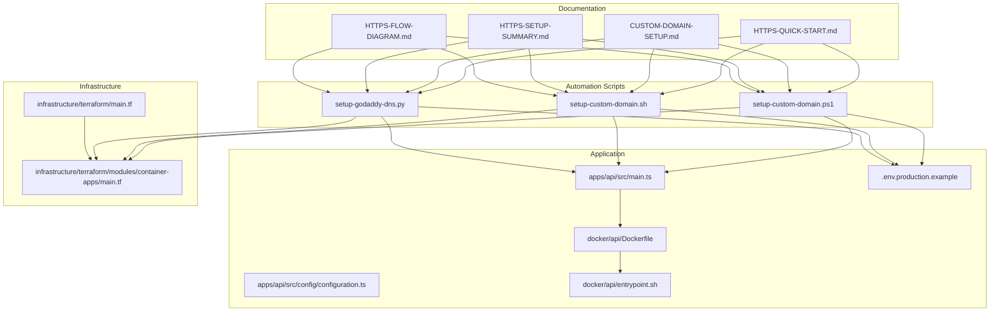
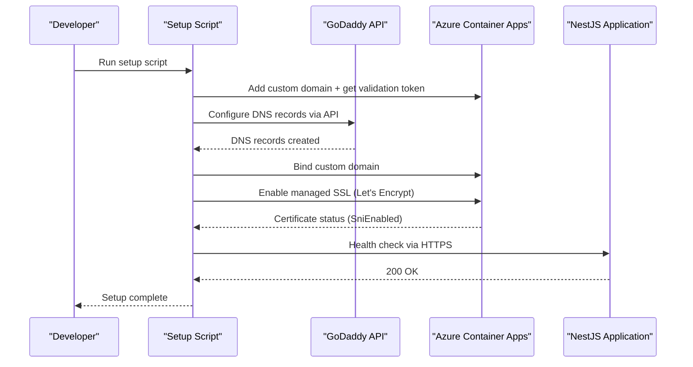
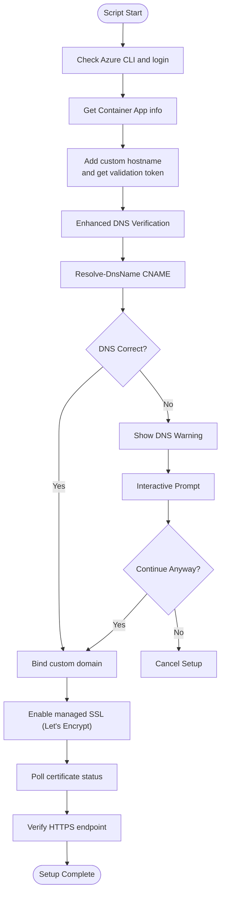
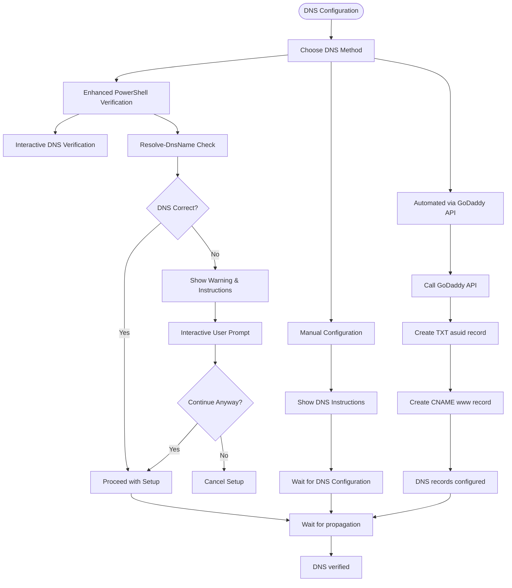
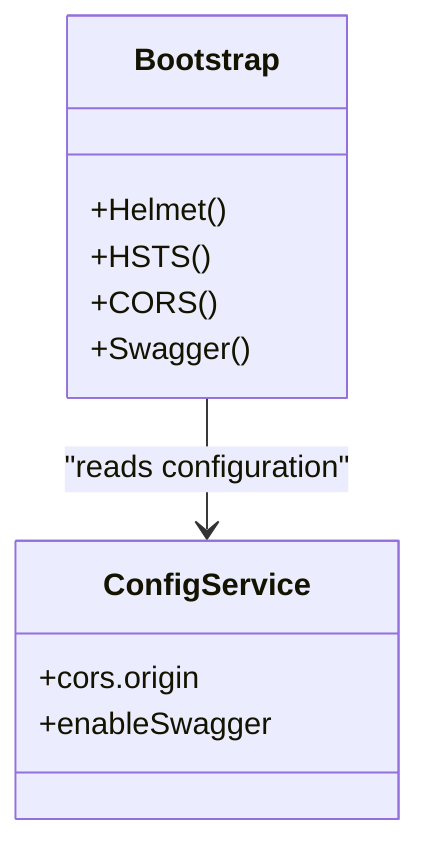
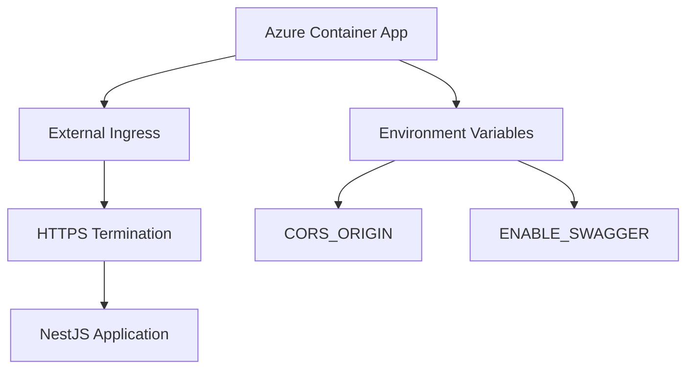
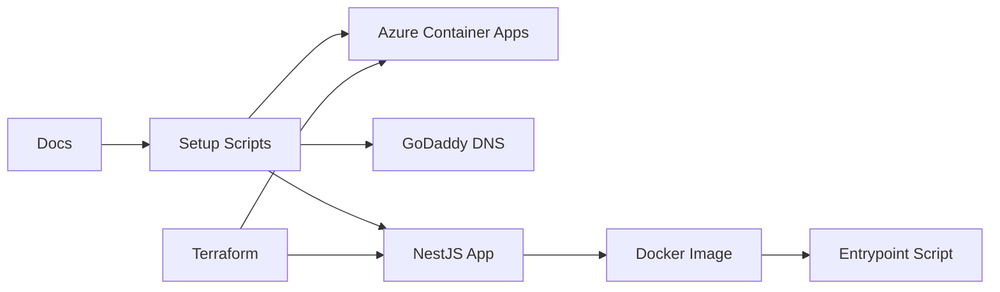

# HTTPS and Custom Domain Setup

<cite>
**Referenced Files in This Document**
- [CUSTOM-DOMAIN-SETUP.md](file://docs/CUSTOM-DOMAIN-SETUP.md)
- [HTTPS-SETUP-SUMMARY.md](file://docs/HTTPS-SETUP-SUMMARY.md)
- [HTTPS-QUICK-START.md](file://docs/HTTPS-QUICK-START.md)
- [HTTPS-FLOW-DIAGRAM.md](file://docs/HTTPS-FLOW-DIAGRAM.md)
- [setup-godaddy-dns.py](file://scripts/setup-godaddy-dns.py)
- [setup-custom-domain.ps1](file://scripts/setup-custom-domain.ps1)
- [setup-custom-domain.sh](file://scripts/setup-custom-domain.sh)
- [main.ts](file://apps/api/src/main.ts)
- [configuration.ts](file://apps/api/src/config/configuration.ts)
- [.env.production.example](file://.env.production.example)
- [Dockerfile](file://docker/api/Dockerfile)
- [entrypoint.sh](file://docker/api/entrypoint.sh)
- [main.tf](file://infrastructure/terraform/main.tf)
- [container-apps main.tf](file://infrastructure/terraform/modules/container-apps/main.tf)
</cite>

## Update Summary
**Changes Made**
- Enhanced PowerShell script with improved DNS verification and interactive prompts
- Added comprehensive error handling and user feedback mechanisms
- Updated troubleshooting section with enhanced script capabilities
- Improved user experience through better step-by-step guidance and validation

## Table of Contents
1. [Introduction](#introduction)
2. [Project Structure](#project-structure)
3. [Core Components](#core-components)
4. [Architecture Overview](#architecture-overview)
5. [Detailed Component Analysis](#detailed-component-analysis)
6. [Dependency Analysis](#dependency-analysis)
7. [Performance Considerations](#performance-considerations)
8. [Troubleshooting Guide](#troubleshooting-guide)
9. [Conclusion](#conclusion)

## Introduction
This document explains how the project enables HTTPS and custom domain configuration for the quiz2biz.com domain using Azure Container Apps and managed SSL certificates. It covers the automated setup scripts, DNS configuration automation with GoDaddy, application security enhancements, and operational procedures for monitoring and maintenance.

## Project Structure
The HTTPS and custom domain setup spans documentation, automation scripts, application configuration, and infrastructure provisioning:

- Documentation: Guides and flow diagrams for quick setup, manual steps, and troubleshooting
- Automation: PowerShell and Bash scripts to orchestrate domain addition, DNS verification, SSL binding, and health checks
- **Enhanced**: PowerShell script with improved DNS verification, interactive prompts, and comprehensive error handling
- **New**: Python script for automated GoDaddy DNS record configuration
- Application: NestJS bootstrap with security headers, CORS, and Swagger configuration
- Infrastructure: Terraform modules defining Azure Container Apps environment and ingress configuration

**Diagram sources**
- [HTTPS-QUICK-START.md](file://docs/HTTPS-QUICK-START.md#L1-L206)
- [CUSTOM-DOMAIN-SETUP.md](file://docs/CUSTOM-DOMAIN-SETUP.md#L1-L375)
- [HTTPS-SETUP-SUMMARY.md](file://docs/HTTPS-SETUP-SUMMARY.md#L1-L318)
- [HTTPS-FLOW-DIAGRAM.md](file://docs/HTTPS-FLOW-DIAGRAM.md#L1-L292)
- [setup-godaddy-dns.py](file://scripts/setup-godaddy-dns.py#L1-L99)
- [setup-custom-domain.ps1](file://scripts/setup-custom-domain.ps1#L1-L196)
- [setup-custom-domain.sh](file://scripts/setup-custom-domain.sh#L1-L218)
- [main.ts](file://apps/api/src/main.ts#L1-L108)
- [configuration.ts](file://apps/api/src/config/configuration.ts#L1-L49)
- [.env.production.example](file://.env.production.example#L1-L72)
- [Dockerfile](file://docker/api/Dockerfile#L1-L100)
- [entrypoint.sh](file://docker/api/entrypoint.sh#L1-L9)
- [main.tf](file://infrastructure/terraform/main.tf#L1-L151)
- [container-apps main.tf](file://infrastructure/terraform/modules/container-apps/main.tf#L1-L192)

**Section sources**
- [HTTPS-QUICK-START.md](file://docs/HTTPS-QUICK-START.md#L1-L206)
- [CUSTOM-DOMAIN-SETUP.md](file://docs/CUSTOM-DOMAIN-SETUP.md#L1-L375)
- [HTTPS-SETUP-SUMMARY.md](file://docs/HTTPS-SETUP-SUMMARY.md#L1-L318)
- [HTTPS-FLOW-DIAGRAM.md](file://docs/HTTPS-FLOW-DIAGRAM.md#L1-L292)

## Core Components
- **Enhanced** Automated setup scripts:
  - PowerShell script with improved DNS verification, interactive prompts, and comprehensive error handling
  - Bash script mirrors the PowerShell logic for Linux/macOS environments
  - **New**: Python script automates GoDaddy DNS record configuration via API
- Application security:
  - Helmet.js security middleware enabled in production
  - HSTS header enforced in production to force HTTPS
  - CORS configured via environment variables
  - Swagger toggled via environment variable for production safety
- Infrastructure:
  - Azure Container Apps ingress configured for external HTTP/HTTPS traffic
  - Container environment variables include CORS_ORIGIN and ENABLE_SWAGGER

**Section sources**
- [setup-godaddy-dns.py](file://scripts/setup-godaddy-dns.py#L1-L99)
- [setup-custom-domain.ps1](file://scripts/setup-custom-domain.ps1#L1-L196)
- [setup-custom-domain.sh](file://scripts/setup-custom-domain.sh#L1-L218)
- [main.ts](file://apps/api/src/main.ts#L20-L93)
- [configuration.ts](file://apps/api/src/config/configuration.ts#L39-L48)
- [.env.production.example](file://.env.production.example#L54-L66)
- [container-apps main.tf](file://infrastructure/terraform/modules/container-apps/main.tf#L142-L151)

## Architecture Overview
The HTTPS pipeline integrates DNS, Azure Container Apps, and the NestJS application:

**Diagram sources**
- [setup-godaddy-dns.py](file://scripts/setup-godaddy-dns.py#L39-L63)
- [setup-custom-domain.ps1](file://scripts/setup-custom-domain.ps1#L74-L184)
- [setup-custom-domain.sh](file://scripts/setup-custom-domain.sh#L68-L165)
- [main.ts](file://apps/api/src/main.ts#L26-L42)

## Detailed Component Analysis

### Enhanced Automated Setup Scripts
The PowerShell script has been significantly enhanced with improved DNS verification, interactive prompts, and comprehensive error handling:

- **Improved DNS Verification**: Uses Resolve-DnsName for real-time DNS validation with detailed error reporting
- **Interactive Prompts**: Provides Read-Host prompts for user confirmation when DNS mismatches are detected
- **Comprehensive Error Handling**: Implements try-catch blocks with specific error messages and recovery guidance
- **Step-by-Step Progression**: Clear color-coded status indicators and progress tracking
- **Prerequisite Validation**: Verifies Container App health before proceeding with setup

**Updated** Enhanced PowerShell script with improved DNS verification, interactive prompts, and comprehensive error handling

**Diagram sources**
- [setup-custom-domain.ps1](file://scripts/setup-custom-domain.ps1#L52-L95)
- [setup-custom-domain.ps1](file://scripts/setup-custom-domain.ps1#L111-L126)
- [setup-custom-domain.ps1](file://scripts/setup-custom-domain.ps1#L145-L161)
- [setup-custom-domain.ps1](file://scripts/setup-custom-domain.ps1#L172-L181)

**Section sources**
- [setup-godaddy-dns.py](file://scripts/setup-godaddy-dns.py#L1-L99)
- [setup-custom-domain.ps1](file://scripts/setup-custom-domain.ps1#L1-L196)
- [setup-custom-domain.sh](file://scripts/setup-custom-domain.sh#L1-L218)

### DNS Configuration and Propagation
DNS configuration ensures domain ownership verification and traffic routing:
- **Manual Option**: TXT record for domain verification (asuid)
- **Enhanced**: PowerShell script provides interactive DNS verification with Resolve-DnsName
- **Automated Option**: Python script configures TXT and CNAME records via GoDaddy API
- CNAME or A record for domain mapping to Azure Container Apps
- Root domain limitations handled via A record or provider-specific forwarding

**Updated** Enhanced PowerShell script now includes interactive DNS verification with Resolve-DnsName and user prompts for corrections

**Diagram sources**
- [setup-custom-domain.ps1](file://scripts/setup-custom-domain.ps1#L52-L95)
- [setup-godaddy-dns.py](file://scripts/setup-godaddy-dns.py#L39-L63)
- [CUSTOM-DOMAIN-SETUP.md](file://docs/CUSTOM-DOMAIN-SETUP.md#L78-L130)
- [HTTPS-QUICK-START.md](file://docs/HTTPS-QUICK-START.md#L27-L58)

**Section sources**
- [setup-godaddy-dns.py](file://scripts/setup-godaddy-dns.py#L1-L99)
- [setup-custom-domain.ps1](file://scripts/setup-custom-domain.ps1#L52-L95)
- [CUSTOM-DOMAIN-SETUP.md](file://docs/CUSTOM-DOMAIN-SETUP.md#L70-L130)
- [HTTPS-QUICK-START.md](file://docs/HTTPS-QUICK-START.md#L22-L58)

### Application Security Enhancements
The NestJS application enforces HTTPS and hardens security:
- Helmet.js enabled with production-specific policies
- HSTS header applied in production to enforce HTTPS
- CORS configured via environment variables for allowed origins
- Swagger documentation toggled off in production for security

**Diagram sources**
- [main.ts](file://apps/api/src/main.ts#L20-L93)
- [configuration.ts](file://apps/api/src/config/configuration.ts#L39-L48)
- [.env.production.example](file://.env.production.example#L54-L66)

**Section sources**
- [main.ts](file://apps/api/src/main.ts#L20-L93)
- [configuration.ts](file://apps/api/src/config/configuration.ts#L39-L48)
- [.env.production.example](file://.env.production.example#L54-L66)

### Infrastructure and Container Apps
Azure Container Apps ingress exposes the application externally and supports HTTPS:
- External ingress enabled with auto transport
- Health probes configured for liveness/readiness/startup
- Environment variables set for production runtime

**Diagram sources**
- [container-apps main.tf](file://infrastructure/terraform/modules/container-apps/main.tf#L142-L151)
- [container-apps main.tf](file://infrastructure/terraform/modules/container-apps/main.tf#L35-L104)
- [main.tf](file://infrastructure/terraform/main.tf#L106-L150)

**Section sources**
- [container-apps main.tf](file://infrastructure/terraform/modules/container-apps/main.tf#L142-L151)
- [container-apps main.tf](file://infrastructure/terraform/modules/container-apps/main.tf#L35-L104)
- [main.tf](file://infrastructure/terraform/main.tf#L106-L150)

## Dependency Analysis
The HTTPS setup depends on coordinated actions across documentation, scripts, application, and infrastructure:

**Diagram sources**
- [HTTPS-QUICK-START.md](file://docs/HTTPS-QUICK-START.md#L1-L206)
- [setup-godaddy-dns.py](file://scripts/setup-godaddy-dns.py#L1-L99)
- [setup-custom-domain.ps1](file://scripts/setup-custom-domain.ps1#L1-L196)
- [setup-custom-domain.sh](file://scripts/setup-custom-domain.sh#L1-L218)
- [main.ts](file://apps/api/src/main.ts#L1-L108)
- [Dockerfile](file://docker/api/Dockerfile#L1-L100)
- [entrypoint.sh](file://docker/api/entrypoint.sh#L1-L9)
- [main.tf](file://infrastructure/terraform/main.tf#L1-L151)
- [container-apps main.tf](file://infrastructure/terraform/modules/container-apps/main.tf#L1-L192)

**Section sources**
- [HTTPS-QUICK-START.md](file://docs/HTTPS-QUICK-START.md#L1-L206)
- [setup-godaddy-dns.py](file://scripts/setup-godaddy-dns.py#L1-L99)
- [setup-custom-domain.ps1](file://scripts/setup-custom-domain.ps1#L1-L196)
- [setup-custom-domain.sh](file://scripts/setup-custom-domain.sh#L1-L218)
- [main.ts](file://apps/api/src/main.ts#L1-L108)
- [Dockerfile](file://docker/api/Dockerfile#L1-L100)
- [entrypoint.sh](file://docker/api/entrypoint.sh#L1-L9)
- [main.tf](file://infrastructure/terraform/main.tf#L1-L151)
- [container-apps main.tf](file://infrastructure/terraform/modules/container-apps/main.tf#L1-L192)

## Performance Considerations
- DNS propagation typically completes within 5–15 minutes; allow up to 48 hours in rare cases
- **Enhanced PowerShell script**: Improved DNS verification reduces setup time by providing immediate feedback
- **Automated DNS via GoDaddy API**: May take 1-2 minutes for API calls to complete
- SSL certificate provisioning takes approximately 5–10 minutes after successful domain binding
- Azure Container Apps ingress transport is set to auto, enabling efficient HTTP/2 and TLS handling
- Container health probes reduce downtime during deployments by ensuring readiness before traffic routing

## Troubleshooting Guide
Common issues and resolutions:
- **Enhanced PowerShell script**: Interactive prompts help resolve DNS mismatches before they cause failures
- DNS not propagating:
  - Flush local DNS cache and verify from alternate DNS servers
  - Use online DNS checker tools to confirm propagation
  - **New**: PowerShell script provides immediate DNS verification with Resolve-DnsName
  - **New**: Interactive prompts allow users to continue despite minor DNS issues
  - **New**: Comprehensive error messages guide users to specific solutions
- Domain verification failing:
  - Confirm TXT record name is exactly asuid (without domain suffix)
  - Re-fetch and compare validation token from Azure
  - **New**: PowerShell script validates CNAME records in real-time with detailed error reporting
  - **New**: Users can choose to continue even with DNS warnings if they understand the risks
- SSL certificate stuck:
  - Remove and re-add hostname binding, then re-run setup
- Site inaccessible after setup:
  - Review Container App logs and consider restarting the revision
- Mixed content warnings:
  - Ensure API base URLs and resources use HTTPS
  - Update CORS origins to HTTPS-only domains
- **New**: Enhanced script error handling:
  - Specific error messages for different failure scenarios
  - Recovery suggestions for common issues
  - Step-by-step guidance for troubleshooting
- **New**: Interactive user experience:
  - Confirmation prompts prevent accidental continuation with incorrect DNS
  - Clear status indicators show progress and completion
  - Color-coded feedback improves user experience

**Section sources**
- [CUSTOM-DOMAIN-SETUP.md](file://docs/CUSTOM-DOMAIN-SETUP.md#L208-L261)
- [HTTPS-QUICK-START.md](file://docs/HTTPS-QUICK-START.md#L139-L178)
- [setup-godaddy-dns.py](file://scripts/setup-godaddy-dns.py#L52-L62)
- [setup-custom-domain.ps1](file://scripts/setup-custom-domain.ps1#L52-L95)

## Conclusion
The project provides a complete, automated solution for enabling HTTPS and custom domains with Azure Container Apps and managed SSL certificates. The setup scripts streamline DNS configuration, domain binding, and certificate provisioning, while the NestJS application enforces HTTPS and security best practices. **Enhanced**: The PowerShell script now offers improved user experience through interactive prompts, comprehensive error handling, and real-time DNS verification, making the setup process more reliable and user-friendly. **New**: The addition of the GoDaddy DNS automation script provides developers with an alternative to manual DNS configuration, reducing setup time and minimizing human error. Terraform infrastructure ensures consistent deployment with proper ingress and environment configuration.