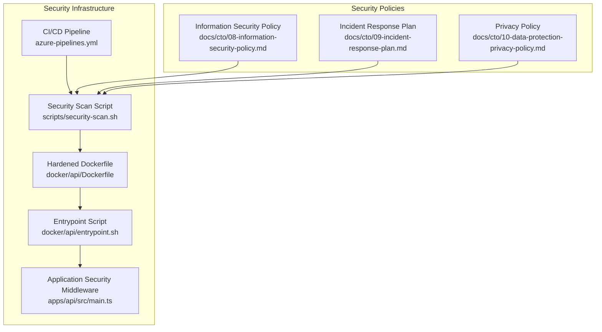
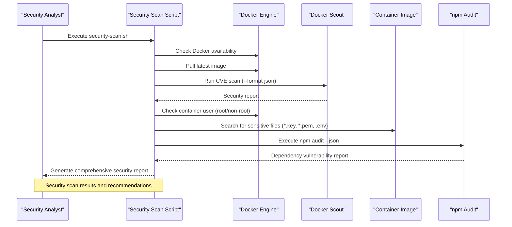
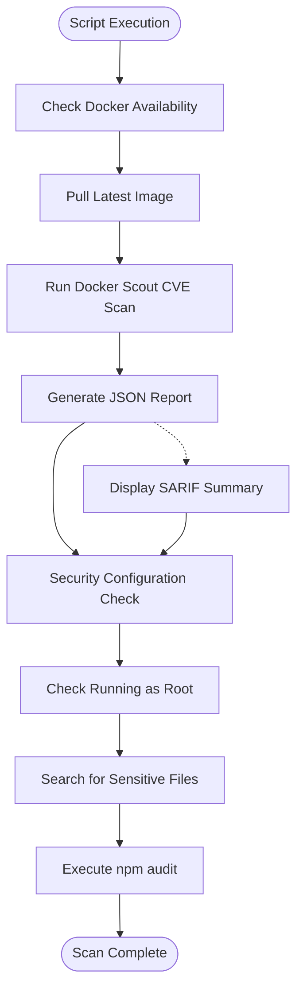
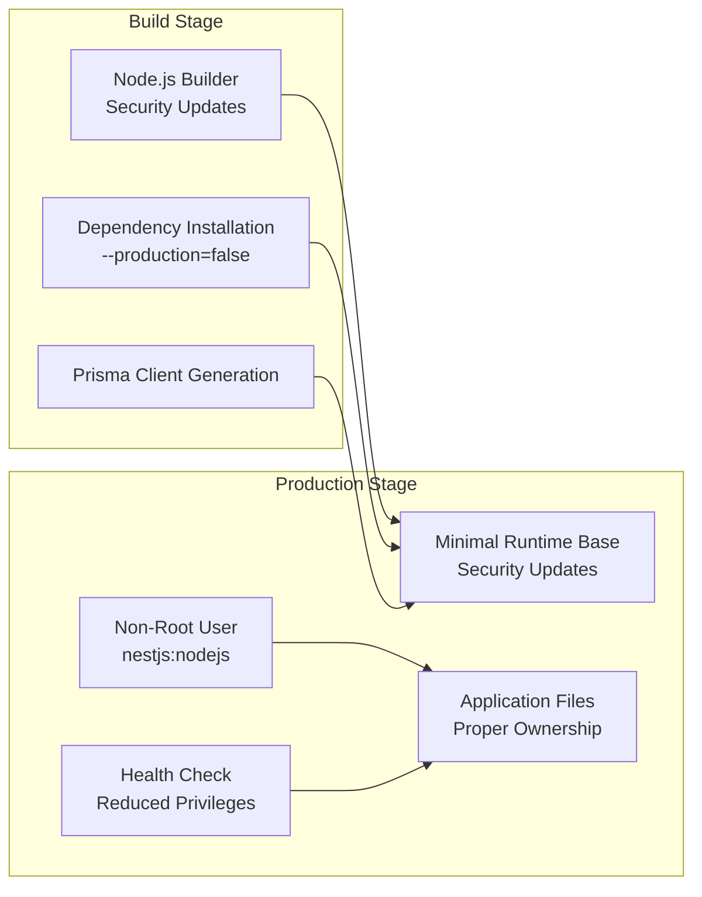
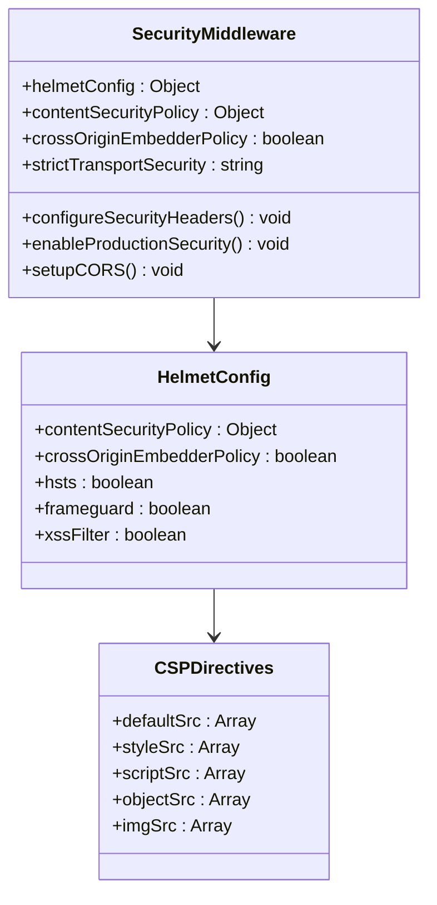
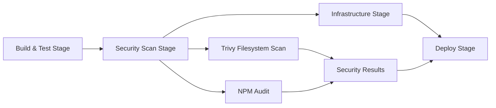
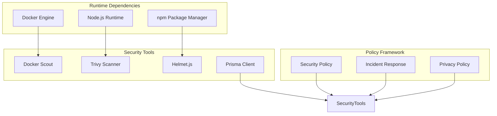

# Security Scan Script

<cite>
**Referenced Files in This Document**
- [security-scan.sh](file://scripts/security-scan.sh)
- [Dockerfile](file://docker/api/Dockerfile)
- [entrypoint.sh](file://docker/api/entrypoint.sh)
- [main.ts](file://apps/api/src/main.ts)
- [azure-pipelines.yml](file://azure-pipelines.yml)
- [docker-compose.yml](file://docker-compose.yml)
- [08-information-security-policy.md](file://docs/cto/08-information-security-policy.md)
- [09-incident-response-plan.md](file://docs/cto/09-incident-response-plan.md)
- [10-data-protection-privacy-policy.md](file://docs/cto/10-data-protection-privacy-policy.md)
- [package.json](file://package.json)
- [api/package.json](file://apps/api/package.json)
</cite>

## Table of Contents
1. [Introduction](#introduction)
2. [Project Structure](#project-structure)
3. [Core Components](#core-components)
4. [Architecture Overview](#architecture-overview)
5. [Detailed Component Analysis](#detailed-component-analysis)
6. [Dependency Analysis](#dependency-analysis)
7. [Performance Considerations](#performance-considerations)
8. [Troubleshooting Guide](#troubleshooting-guide)
9. [Conclusion](#conclusion)

## Introduction
This document provides comprehensive documentation for the Security Scan Script used to evaluate the security posture of Docker images in the Adaptive Client Questionnaire System. The script automates vulnerability scanning, configuration checks, and dependency audits to ensure containerized applications meet organizational security requirements. It integrates with CI/CD pipelines and supports both automated and manual execution scenarios.

## Project Structure
The security scanning functionality spans multiple layers:
- Standalone security script for manual and CI/CD execution
- Docker image hardening and non-root user enforcement
- Application-level security middleware and configuration
- CI/CD pipeline integration with automated security stages
- Supporting security policies and incident response documentation

**Diagram sources**
- [security-scan.sh](file://scripts/security-scan.sh#L1-L74)
- [Dockerfile](file://docker/api/Dockerfile#L1-L114)
- [entrypoint.sh](file://docker/api/entrypoint.sh#L1-L11)
- [main.ts](file://apps/api/src/main.ts#L1-L32)
- [azure-pipelines.yml](file://azure-pipelines.yml#L139-L160)
- [08-information-security-policy.md](file://docs/cto/08-information-security-policy.md#L695-L704)

**Section sources**
- [security-scan.sh](file://scripts/security-scan.sh#L1-L74)
- [Dockerfile](file://docker/api/Dockerfile#L1-L114)
- [main.ts](file://apps/api/src/main.ts#L1-L32)
- [azure-pipelines.yml](file://azure-pipelines.yml#L139-L160)

## Core Components
The security scanning system comprises several key components that work together to provide comprehensive security evaluation:

### Security Scan Script
The primary automation tool that performs:
- Docker image vulnerability scanning using Docker Scout
- Container configuration security checks
- Sensitive file detection within images
- npm audit execution for dependency vulnerabilities

### Docker Image Hardening
Production Dockerfile implements multiple security controls:
- Non-root user execution (nestjs:nodejs)
- Minimal base image with security updates
- Health checks with reduced privileges
- Proper file ownership and permissions
- Security-focused runtime dependencies

### Application Security Middleware
NestJS application includes:
- Helmet.js for HTTP header security
- Content Security Policy configuration
- Cross-Origin Embedder Policy enforcement
- HSTS (HTTP Strict Transport Security) in production
- CORS configuration management

### CI/CD Security Integration
Azure DevOps pipeline includes dedicated security stages:
- NPM audit with severity thresholds
- Trivy filesystem scanning
- Automated dependency vulnerability detection
- Security scanning in build pipeline

**Section sources**
- [security-scan.sh](file://scripts/security-scan.sh#L1-L74)
- [Dockerfile](file://docker/api/Dockerfile#L34-L77)
- [main.ts](file://apps/api/src/main.ts#L20-L32)
- [azure-pipelines.yml](file://azure-pipelines.yml#L139-L160)

## Architecture Overview
The security scanning architecture follows a multi-layered approach combining automated tools, manual verification, and policy enforcement:

**Diagram sources**
- [security-scan.sh](file://scripts/security-scan.sh#L17-L73)

The architecture ensures comprehensive coverage of:
- Image-level vulnerabilities through Docker Scout
- Configuration security through container inspection
- Dependency vulnerabilities via npm audit
- Sensitive data exposure detection

## Detailed Component Analysis

### Security Scan Script Implementation
The script provides automated security evaluation with the following capabilities:

#### Vulnerability Scanning Workflow

**Diagram sources**
- [security-scan.sh](file://scripts/security-scan.sh#L23-L67)

#### Security Configuration Checks
The script performs critical security validations:
- **Root User Detection**: Identifies containers running with elevated privileges
- **Sensitive File Discovery**: Searches for cryptographic keys, certificates, and environment files
- **Dependency Vulnerability Assessment**: Executes npm audit for known vulnerabilities

#### Docker Scout Integration
The script leverages Docker Scout for advanced vulnerability analysis:
- CVE scanning with JSON output format
- SARIF format for summary display
- Automated report generation with timestamps
- Graceful handling when Scout is unavailable

**Section sources**
- [security-scan.sh](file://scripts/security-scan.sh#L1-L74)

### Docker Image Hardening
Production Dockerfile implements comprehensive security measures:

#### Multi-Stage Build Security

**Diagram sources**
- [Dockerfile](file://docker/api/Dockerfile#L34-L77)

#### Security Controls Implemented
- **Non-Root Execution**: Creates dedicated `nestjs` user with UID 1001
- **Minimal Attack Surface**: Uses slim base images with essential packages only
- **Health Monitoring**: Implements health checks with reduced privileges
- **Proper Permissions**: Ensures correct file ownership and executable permissions
- **Security Updates**: Regular base image updates and package upgrades

**Section sources**
- [Dockerfile](file://docker/api/Dockerfile#L48-L77)

### Application Security Middleware
NestJS application includes robust security middleware configuration:

#### HTTP Header Security

**Diagram sources**
- [main.ts](file://apps/api/src/main.ts#L20-L32)

#### Security Features
- **Helmet.js Integration**: Comprehensive HTTP header security
- **Content Security Policy**: Prevents XSS and data injection attacks
- **Cross-Origin Embedder Policy**: Prevents credential leakage
- **HSTS Enforcement**: Forces HTTPS connections in production
- **CORS Configuration**: Flexible cross-origin resource sharing

**Section sources**
- [main.ts](file://apps/api/src/main.ts#L20-L32)

### CI/CD Security Integration
Azure DevOps pipeline incorporates security scanning at multiple stages:

#### Security Stage Configuration

**Diagram sources**
- [azure-pipelines.yml](file://azure-pipelines.yml#L139-L160)

#### Security Testing Requirements
The pipeline enforces security testing according to organizational policies:
- **NPM Audit**: Runs with high severity threshold
- **Trivy Scanning**: Filesystem scanning with critical severity filter
- **Automated Execution**: Continues on error to gather comprehensive results
- **Pipeline Integration**: Security stage depends on successful build completion

**Section sources**
- [azure-pipelines.yml](file://azure-pipelines.yml#L139-L160)

## Dependency Analysis
The security scanning system relies on several key dependencies and integrations:

**Diagram sources**
- [security-scan.sh](file://scripts/security-scan.sh#L17-L39)
- [Dockerfile](file://docker/api/Dockerfile#L13-L14)
- [main.ts](file://apps/api/src/main.ts#L5-L5)

### External Dependencies
- **Docker Scout**: Advanced vulnerability scanning with SARIF output
- **Trivy**: Filesystem scanning for container images
- **Helmet.js**: HTTP header security for web applications
- **Prisma**: Database client with security-conscious configuration

### Policy Dependencies
- **Information Security Policy**: Establishes security requirements and thresholds
- **Incident Response Plan**: Defines procedures for security incident handling
- **Privacy Policy**: Guides data protection and sensitive file handling

**Section sources**
- [security-scan.sh](file://scripts/security-scan.sh#L17-L39)
- [08-information-security-policy.md](file://docs/cto/08-information-security-policy.md#L695-L704)

## Performance Considerations
The security scanning system is designed for efficient execution while maintaining comprehensive coverage:

### Execution Efficiency
- **Parallel Processing**: Multiple security checks can run concurrently
- **Graceful Degradation**: Script continues even if optional tools are unavailable
- **Selective Scanning**: Targeted vulnerability detection reduces false positives
- **Incremental Analysis**: Focus on high-priority security issues first

### Resource Optimization
- **Minimal Dependencies**: Only essential security tools are required
- **Efficient Image Scanning**: Docker Scout provides optimized vulnerability analysis
- **Targeted File Search**: Limited scope for sensitive file detection
- **Configurable Severity**: Adjustable thresholds for different environments

## Troubleshooting Guide

### Common Issues and Solutions

#### Docker Availability Problems
**Issue**: Docker engine not found or accessible
**Solution**: Ensure Docker is installed and in PATH, verify Docker daemon is running

#### Docker Scout Unavailable
**Issue**: Docker Scout not installed or accessible
**Solution**: Install Docker Scout using the provided installation command, verify version compatibility

#### Permission Denied Errors
**Issue**: Insufficient permissions for Docker operations
**Solution**: Add user to docker group, verify Docker socket permissions, check SELinux/AppArmor settings

#### Image Pull Failures
**Issue**: Unable to pull container images from registry
**Solution**: Verify registry credentials, check network connectivity, ensure registry is accessible

#### Security Scan Failures
**Issue**: Security scans not completing or producing errors
**Solution**: Check tool availability, verify image accessibility, ensure sufficient disk space for scans

### Debugging Commands
- Verify Docker availability: `docker --version`
- Check Docker Scout installation: `docker scout version`
- Validate image accessibility: `docker inspect <image-name>`
- Review security scan logs: Check script output and error streams

**Section sources**
- [security-scan.sh](file://scripts/security-scan.sh#L17-L21)
- [security-scan.sh](file://scripts/security-scan.sh#L37-L39)

## Conclusion
The Security Scan Script provides a comprehensive solution for evaluating the security posture of containerized applications in the Adaptive Client Questionnaire System. By integrating multiple layers of security analysis—including Docker image vulnerability scanning, configuration security checks, and dependency audits—the script ensures that containerized applications meet organizational security requirements.

The implementation demonstrates best practices in container security through non-root execution, minimal attack surface design, and comprehensive middleware protection. The integration with CI/CD pipelines ensures continuous security monitoring throughout the development lifecycle.

Key benefits of this approach include:
- Automated security validation in CI/CD pipelines
- Comprehensive vulnerability detection across multiple security domains
- Policy-driven security enforcement aligned with organizational requirements
- Scalable architecture supporting both development and production environments

The security scanning system serves as a foundation for maintaining security compliance while supporting rapid development and deployment cycles in modern containerized environments.