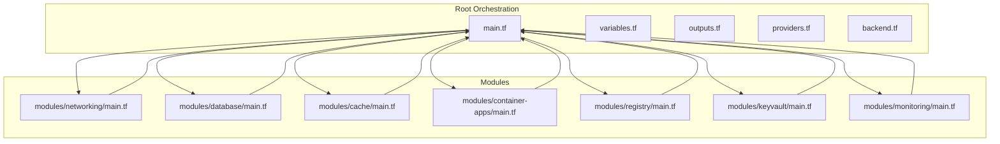
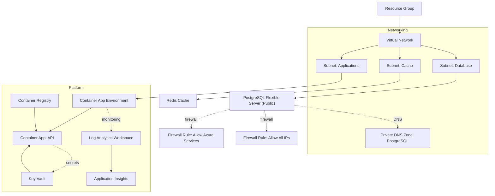
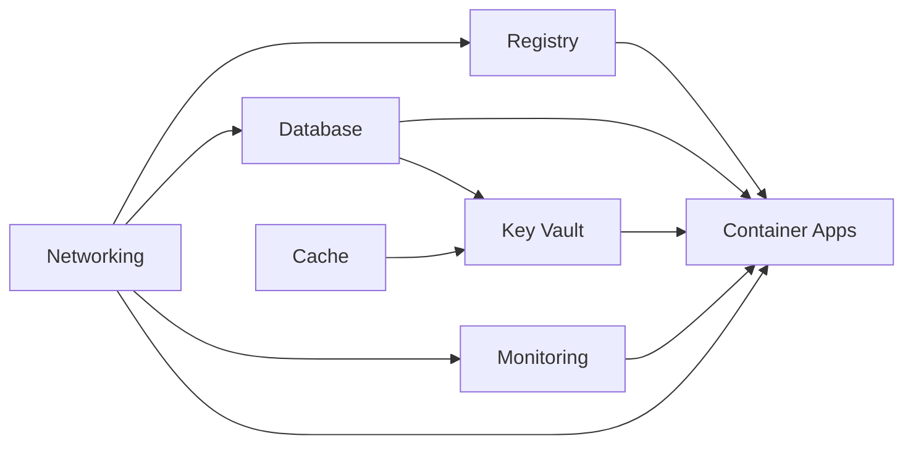

# Terraform Infrastructure

<cite>
**Referenced Files in This Document**
- [main.tf](file://infrastructure/terraform/main.tf)
- [providers.tf](file://infrastructure/terraform/providers.tf)
- [backend.tf](file://infrastructure/terraform/backend.tf)
- [variables.tf](file://infrastructure/terraform/variables.tf)
- [outputs.tf](file://infrastructure/terraform/outputs.tf)
- [fix-duplicates.ps1](file://infrastructure/terraform/fix-duplicates.ps1)
- [modules/networking/main.tf](file://infrastructure/terraform/modules/networking/main.tf)
- [modules/networking/outputs.tf](file://infrastructure/terraform/modules/networking/outputs.tf)
- [modules/database/main.tf](file://infrastructure/terraform/modules/database/main.tf)
- [modules/database/outputs.tf](file://infrastructure/terraform/modules/database/outputs.tf)
- [modules/database/variables.tf](file://infrastructure/terraform/modules/database/variables.tf)
- [modules/cache/main.tf](file://infrastructure/terraform/modules/cache/main.tf)
- [modules/cache/outputs.tf](file://infrastructure/terraform/modules/cache/outputs.tf)
- [modules/container-apps/main.tf](file://infrastructure/terraform/modules/container-apps/main.tf)
- [modules/container-apps/outputs.tf](file://infrastructure/terraform/modules/container-apps/outputs.tf)
- [modules/container-apps/variables.tf](file://infrastructure/terraform/modules/container-apps/variables.tf)
- [modules/keyvault/main.tf](file://infrastructure/terraform/modules/keyvault/main.tf)
- [modules/keyvault/outputs.tf](file://infrastructure/terraform/modules/keyvault/outputs.tf)
- [modules/keyvault/variables.tf](file://infrastructure/terraform/modules/keyvault/variables.tf)
- [modules/monitoring/main.tf](file://infrastructure/terraform/modules/monitoring/main.tf)
- [modules/monitoring/outputs.tf](file://infrastructure/terraform/modules/monitoring/outputs.tf)
- [modules/registry/main.tf](file://infrastructure/terraform/modules/registry/main.tf)
- [modules/registry/outputs.tf](file://infrastructure/terraform/modules/registry/outputs.tf)
</cite>

## Update Summary
**Changes Made**
- Updated database module documentation to reflect VNet integration removal and public access configuration
- Added documentation for new firewall rules allowing Azure services and container app access
- Updated architecture diagrams to show public PostgreSQL server deployment
- Revised security considerations to reflect public access with firewall restrictions
- Updated troubleshooting section to address VNet removal and firewall configuration issues
- Enhanced deployment instructions for public PostgreSQL server configuration

## Table of Contents
1. [Introduction](#introduction)
2. [Project Structure](#project-structure)
3. [Core Components](#core-components)
4. [Architecture Overview](#architecture-overview)
5. [Detailed Component Analysis](#detailed-component-analysis)
6. [Dependency Analysis](#dependency-analysis)
7. [Performance Considerations](#performance-considerations)
8. [Security and Compliance](#security-and-compliance)
9. [Monitoring and Alerting](#monitoring-and-alerting)
10. [Enhanced State Management and Dependency Locking](#enhanced-state-management-and-dependency-locking)
11. [Production-Ready High Availability Configuration](#production-ready-high-availability-configuration)
12. [Deployment and State Management](#deployment-and-state-management)
13. [Infrastructure Modification Workflows](#infrastructure-modification-workflows)
14. [Duplicate Content Management](#duplicate-content-management)
15. [Troubleshooting Guide](#troubleshooting-guide)
16. [Conclusion](#conclusion)

## Introduction
This document explains the Terraform infrastructure as code for the Quiz-to-build system. It covers the main orchestration file, provider configuration, remote state options, variable definitions, and module composition. The system provisions Azure resources for Container Apps, PostgreSQL, Redis, Key Vault, networking, and monitoring. It also documents environment-specific configurations, resource tagging, cost optimization techniques, and operational workflows for deployment, state management, and modifications.

**Updated** Enhanced database module with public access configuration and firewall rules for simplified deployment and development workflows. VNet integration has been removed to streamline infrastructure setup and reduce complexity.

## Project Structure
The Terraform implementation is organized around a single orchestration file that composes multiple modules. Each module encapsulates a domain area (networking, database, cache, container apps, registry, keyvault, monitoring) and exposes outputs consumed by other modules and the top-level configuration.



**Diagram sources**
- [main.tf](file://infrastructure/terraform/main.tf#L1-L151)
- [modules/networking/main.tf](file://infrastructure/terraform/modules/networking/main.tf#L1-L111)
- [modules/database/main.tf](file://infrastructure/terraform/modules/database/main.tf#L1-L81)
- [modules/cache/main.tf](file://infrastructure/terraform/modules/cache/main.tf#L1-L21)
- [modules/container-apps/main.tf](file://infrastructure/terraform/modules/container-apps/main.tf#L1-L192)
- [modules/registry/main.tf](file://infrastructure/terraform/modules/registry/main.tf#L1-L12)
- [modules/keyvault/main.tf](file://infrastructure/terraform/modules/keyvault/main.tf#L1-L88)
- [modules/monitoring/main.tf](file://infrastructure/terraform/modules/monitoring/main.tf#L1-L22)

**Section sources**
- [main.tf](file://infrastructure/terraform/main.tf#L1-L151)
- [providers.tf](file://infrastructure/terraform/providers.tf#L1-L32)
- [variables.tf](file://infrastructure/terraform/variables.tf#L1-L129)
- [outputs.tf](file://infrastructure/terraform/outputs.tf#L1-L116)

## Core Components
- Provider configuration pins the AzureRM provider version and enables safe deletion and soft-delete recovery behaviors for Key Vault and Resource Groups.
- Root orchestration defines a resource group, applies common tags, and composes modules for networking, monitoring, registry, database, cache, and container apps.
- Modules expose outputs that feed into downstream modules and the root outputs for developer consumption.

Key capabilities:
- Centralized tag management via locals and module passthrough.
- Explicit dependency ordering to ensure prerequisites are provisioned first.
- Secret management via Key Vault with distinct secrets for database URL, Redis password, and JWT secrets.
- Observability via Log Analytics and Application Insights.

**Section sources**
- [providers.tf](file://infrastructure/terraform/providers.tf#L1-L32)
- [main.tf](file://infrastructure/terraform/main.tf#L4-L18)
- [outputs.tf](file://infrastructure/terraform/outputs.tf#L1-L116)
- [variables.tf](file://infrastructure/terraform/variables.tf#L13-L17)

## Architecture Overview
**Updated** The system now provisions a simplified architecture with public PostgreSQL server access and firewall rules for development. Container Apps connect directly to the public PostgreSQL endpoint with appropriate firewall restrictions.



**Diagram sources**
- [main.tf](file://infrastructure/terraform/main.tf#L13-L150)
- [modules/networking/main.tf](file://infrastructure/terraform/modules/networking/main.tf#L3-L110)
- [modules/database/main.tf](file://infrastructure/terraform/modules/database/main.tf#L9-L81)
- [modules/cache/main.tf](file://infrastructure/terraform/modules/cache/main.tf#L3-L21)
- [modules/container-apps/main.tf](file://infrastructure/terraform/modules/container-apps/main.tf#L4-L192)
- [modules/registry/main.tf](file://infrastructure/terraform/modules/registry/main.tf#L3-L12)
- [modules/keyvault/main.tf](file://infrastructure/terraform/modules/keyvault/main.tf#L5-L88)
- [modules/monitoring/main.tf](file://infrastructure/terraform/modules/monitoring/main.tf#L3-L22)

## Detailed Component Analysis

### Enhanced Database Module (PostgreSQL Flexible Server) with Public Access Configuration
**Updated** Database module now provides public access configuration with firewall rules for simplified development and deployment workflows. VNet integration has been removed to reduce infrastructure complexity.

Responsibilities:
- Generates a random administrator password for the PostgreSQL server with enhanced security constraints.
- Creates a flexible server in the database subnet with public access instead of private VNet integration.
- **Updated** Removed VNet integration with delegated subnet and private DNS zone configuration.
- **Updated** Added firewall rules to allow Azure services and container app access.
- Defines a target application database and sets server configurations for timezone and connection logging.
- Provides consolidated connection_string output with URL-encoded password values.
- Tags resources and ignores specific attributes during lifecycle changes.

**Updated** Public access configuration with firewall rules:
- **Public Server**: PostgreSQL server deployed with public IP access for simplified connectivity.
- **Azure Services Access**: Firewall rule allowing Azure services to access the database.
- **Development Flexibility**: Additional firewall rule allowing all IPs for development environments.
- **Simplified Deployment**: Elimination of VNet integration reduces infrastructure complexity.
- **Reduced Cost**: Public access eliminates private endpoint costs and complexity.

Connection string format:
```
postgresql://psqladmin:<url-encoded-password>@psql-quiz-dev-quizto-build.postgres.database.azure.com:5432/quiz_dev?sslmode=require
```

Security considerations:
- **Firewall Restrictions**: Azure services and container apps can access the database through firewall rules.
- **Development Risk**: All IPs firewall rule should be removed in production environments.
- **Password Security**: URL-encoded passwords in connection strings maintain security.
- **Network Isolation**: VNet removal reduces network isolation but simplifies deployment.

**Section sources**
- [modules/database/main.tf](file://infrastructure/terraform/modules/database/main.tf#L1-L81)
- [modules/database/outputs.tf](file://infrastructure/terraform/modules/database/outputs.tf#L33-L37)
- [modules/database/variables.tf](file://infrastructure/terraform/modules/database/variables.tf#L1-L59)

### Enhanced Container Apps Module with Standardized Health Checks
**Updated** Enhanced Container Apps module with clearer parameter naming and improved health check configuration for better observability and reliability.

Responsibilities:
- Creates a Container App Environment bound to the application subnet and Log Analytics workspace.
- Deploys a single-revision Container App with system-assigned managed identity.
- Configures CPU/memory, replica counts, and ingress exposure.
- Injects environment variables for runtime configuration and configures standardized health checks.
- **Updated** Implements consistent health check endpoints with clearer parameter naming: `/health/live` and `/health/ready`.
- **Updated** Enhanced probe configuration with improved parameter clarity and standardized endpoint paths.
- Pulls images from the configured Container Registry using admin credentials.
- Stores secrets for registry password, database URL, Redis password, and JWT secrets.

Health check configuration improvements:
- **Liveness Probe**: Uses `/health/live` endpoint with transport = "HTTP", path = "/health/live", port = 3000.
- **Readiness Probe**: Uses `/health/ready` endpoint with transport = "HTTP", path = "/health/ready", port = 3000.
- **Startup Probe**: Uses `/health/live` endpoint for initial container startup verification.
- **Improved Parameter Naming**: Clearer parameter names with explicit threshold values for better readability and maintenance.
- **Consistent Endpoint Paths**: Standardized health check endpoints ensure uniform health monitoring across all container applications.

**Section sources**
- [modules/container-apps/main.tf](file://infrastructure/terraform/modules/container-apps/main.tf#L14-L192)
- [modules/container-apps/outputs.tf](file://infrastructure/terraform/modules/container-apps/outputs.tf#L1-L39)
- [modules/container-apps/variables.tf](file://infrastructure/terraform/modules/container-apps/variables.tf#L1-L123)

### Enhanced Key Vault Module with Improved Random String Generation
**Updated** Enhanced KeyVault module with improved random string generation using proper constraints and enhanced security configuration.

Responsibilities:
- Creates a Key Vault with soft delete retention and standard SKU.
- Grants permissions to the current deployment identity for full secret and key lifecycle operations.
- Optionally grants read-only secret permissions to the Container App managed identity.
- **Updated** Generates unique suffix for Key Vault name using proper random_string constraints.
- **Updated** Enhanced security configuration with improved random password generation for JWT secrets.
- Stores secrets for database URL, Redis password, and generated JWT secrets.

Random string generation improvements:
- **Proper Constraints**: Uses random_string resource with length = 6, special = false, upper = false for predictable naming.
- **Unique Suffix Generation**: Ensures globally unique Key Vault names across environments.
- **Enhanced Security**: Improved random password generation for JWT secrets with length = 64 and no special characters.

Security enhancements:
- **JWT Secret Generation**: Enhanced random password generation for JWT secrets with increased entropy.
- **Refresh Token Security**: Separate random password generation for JWT refresh tokens with identical constraints.
- **Secret Management**: Proper dependency management with depends_on for access policies.

**Section sources**
- [modules/keyvault/main.tf](file://infrastructure/terraform/modules/keyvault/main.tf#L1-L88)
- [modules/keyvault/outputs.tf](file://infrastructure/terraform/modules/keyvault/outputs.tf#L1-L41)
- [modules/keyvault/variables.tf](file://infrastructure/terraform/modules/keyvault/variables.tf#L1-L44)

### Container Registry Module
Responsibilities:
- Creates an Azure Container Registry with admin credentials enabled for development.
- Tags resources.

Outputs:
- Registry identifiers, names, and login server.
- Admin username and password.

**Section sources**
- [modules/registry/main.tf](file://infrastructure/terraform/modules/registry/main.tf#L1-L12)
- [modules/registry/outputs.tf](file://infrastructure/terraform/modules/registry/outputs.tf#L1-L26)

### Monitoring Module
Responsibilities:
- Creates a Log Analytics workspace and Application Insights resource.
- Links Application Insights to the workspace.
- Tags resources.

Outputs:
- Workspace and Application Insights identifiers and names.
- Instrumentation key and connection string.

**Section sources**
- [modules/monitoring/main.tf](file://infrastructure/terraform/modules/monitoring/main.tf#L1-L22)
- [modules/monitoring/outputs.tf](file://infrastructure/terraform/modules/monitoring/outputs.tf#L1-L37)

### Cache Module (Azure Cache for Redis)
Responsibilities:
- Creates a Redis cache with TLS enforcement and minimum TLS version set.
- Configures eviction policy and reserved memory deltas.
- Tags resources.

Outputs:
- Redis identifiers, hostnames, ports, and primary access keys.
- Primary connection string.

**Section sources**
- [modules/cache/main.tf](file://infrastructure/terraform/modules/cache/main.tf#L1-L21)
- [modules/cache/outputs.tf](file://infrastructure/terraform/modules/cache/outputs.tf#L1-L36)

### Networking Module
**Updated** Networking module maintains VNet configuration with subnets for applications, databases, and caches, but database subnet delegation is now commented out as VNet integration is handled at the database level.

Responsibilities:
- Creates a virtual network with address spaces and subnets for applications, databases, and caches.
- **Updated** Database subnet delegation commented out as VNet integration is removed from database module.
- Applies a Network Security Group to the application subnet allowing HTTP/HTTPS ingress.
- Provisions a private DNS zone for PostgreSQL and links it to the virtual network.

Operational notes:
- Subnet delegations ensure platform-managed services can operate within the network boundaries.
- Private DNS enables internal resolution of PostgreSQL FQDNs.
- **Updated** Database subnet delegation temporarily disabled to align with public access configuration.

Outputs:
- Virtual network identifiers and names.
- Subnet IDs for application, database, and cache.
- Private DNS zone identifier and name for PostgreSQL.

**Section sources**
- [modules/networking/main.tf](file://infrastructure/terraform/modules/networking/main.tf#L1-L111)
- [modules/networking/outputs.tf](file://infrastructure/terraform/modules/networking/outputs.tf#L1-L35)

## Dependency Analysis
The orchestration enforces explicit dependencies among modules to ensure prerequisites are created before dependent resources. The dependency graph is layered: networking first, followed by monitoring and registry, then database and cache, and finally container apps depending on all upstream modules.



**Diagram sources**
- [main.tf](file://infrastructure/terraform/main.tf#L20-L150)

**Section sources**
- [main.tf](file://infrastructure/terraform/main.tf#L74-L103)
- [main.tf](file://infrastructure/terraform/main.tf#L142-L149)

## Performance Considerations
- Container sizing: CPU and memory allocations are configurable per environment. Adjust container_cpu, container_memory, container_min_replicas, and container_max_replicas to balance responsiveness and cost.
- Database and cache SKUs: PostgreSQL and Redis SKUs are configurable. Select appropriate tiers for workload profiles and scale out as needed.
- Replication and availability: PostgreSQL high availability is disabled in development; enable for production environments requiring HA.
- Network efficiency: Subnet delegation reduces overhead and improves integration with managed services.
- **Updated** Enhanced health check configuration: Improved parameter naming and clearer endpoint paths reduce configuration complexity and improve monitoring efficiency.
- **Updated** Production-ready HA settings: Zone-redundant PostgreSQL deployments provide better fault tolerance with minimal performance impact.
- **Updated** Improved lifecycle management: Enhanced ignore_changes configuration reduces unnecessary resource recreation during updates.
- **Updated** Consolidated connection output: Single connection string reduces configuration complexity and improves deployment reliability.
- **Updated** Public access performance: Public PostgreSQL servers eliminate VNet routing overhead and simplify network performance characteristics.

## Security and Compliance
- Secrets management: All secrets are stored in Key Vault and injected into Container Apps as environment variables. The deployment identity has broad permissions; restrict to least privilege in production.
- TLS enforcement: Redis requires TLS 1.2 or higher. Ensure clients connect over SSL/TLS.
- Identity and access: Container Apps use system-assigned managed identity. Grant only read access to secrets for the managed identity.
- Resource tagging: Common tags propagate to all resources for governance and cost allocation.
- Key Vault soft-delete: Enabled to protect against accidental deletion; purge protection is disabled by default.
- **Updated** Enhanced random string generation: Improved constraints ensure predictable and secure Key Vault naming.
- **Updated** Production-ready HA configuration: Zone-redundant deployments meet higher availability and disaster recovery requirements.
- **Updated** URL-encoded password security: Password values in connection strings are automatically URL-encoded for safe transmission and parsing.
- **Updated** Firewall security model: Public access with firewall rules provides controlled access from Azure services and container apps.
- **Updated** Development vs production security: Firewall rules should be restricted in production environments to minimize attack surface.

**Section sources**
- [modules/keyvault/main.tf](file://infrastructure/terraform/modules/keyvault/main.tf#L18-L44)
- [modules/cache/main.tf](file://infrastructure/terraform/modules/cache/main.tf#L10-L11)
- [main.tf](file://infrastructure/terraform/main.tf#L6-L10)
- [variables.tf](file://infrastructure/terraform/variables.tf#L13-L17)

## Monitoring and Alerting
- Application telemetry: Application Insights is provisioned and linked to the Log Analytics workspace. Connection strings are passed to the Container App for instrumentation.
- Logs and metrics: Log Analytics collects container logs and platform metrics.
- **Updated** Enhanced health probes: Improved parameter naming and clearer endpoint paths (`/health/live` and `/health/ready`) ensure more reliable monitoring and alerting.
- **Updated** Consistent health endpoints: Standardized health check endpoints across all container applications ensure uniform monitoring and alerting configurations.
- **Updated** Database audit logging: Connection and disconnection logging provides comprehensive operational visibility for database access patterns and security monitoring.
- **Updated** Firewall monitoring: Network security groups and firewall rules provide additional monitoring points for database access patterns.

**Section sources**
- [modules/monitoring/main.tf](file://infrastructure/terraform/modules/monitoring/main.tf#L3-L22)
- [modules/container-apps/main.tf](file://infrastructure/terraform/modules/container-apps/main.tf#L106-L144)

## Enhanced State Management and Dependency Locking

### Terraform Lock File Management
The infrastructure now includes comprehensive dependency locking through the `.terraform.lock.hcl` file, which provides cryptographic verification of provider versions and prevents drift in provider installations.

Key features:
- **Provider Version Pinning**: AzureRM provider locked at version 3.85.0 with compatibility constraints
- **Cryptographic Hash Verification**: Multiple SHA-256 hashes ensure provider integrity
- **Random Provider Locking**: Random provider version 3.6.3 with hash verification
- **Automated Maintenance**: Lock file is automatically maintained by Terraform init

### State Locking and Safety Mechanisms
The implementation includes robust state management with locking mechanisms to prevent concurrent modifications and ensure infrastructure integrity.

State management features:
- **Local State Locking**: Automatic state locking through `.terraform.tfstate.lock.info`
- **Remote State Support**: Ready for Azure Storage backend configuration
- **State Migration**: Built-in support for migrating from local to remote state
- **Lock Information**: Detailed lock metadata for debugging and troubleshooting

### Dependency Locking Benefits
- **Reproducible Builds**: Ensures identical provider versions across environments
- **Security Protection**: Prevents installation of compromised provider versions
- **Stability Assurance**: Eliminates unexpected provider updates that could break infrastructure
- **Audit Trail**: Complete record of all provider dependencies and their origins

**Section sources**
- [providers.tf](file://infrastructure/terraform/providers.tf#L1-L14)

## Production-Ready High Availability Configuration

### PostgreSQL High Availability Options
The database module supports production-grade high availability configurations with zone-redundant deployments and enhanced lifecycle management.

High availability features:
- **Zone-Redundant Mode**: Enable production-ready high availability with mode = "ZoneRedundant".
- **Automatic Failover**: Built-in failover capabilities for planned and unplanned maintenance.
- **Enhanced Lifecycle Management**: Improved ignore_changes configuration for standby_availability_zone.
- **Data Protection**: Enhanced durability through cross-zone replication.

Production configuration example:
```hcl
# Enable in production environments
high_availability {
  mode = "ZoneRedundant"
}
```

### Container App Scaling and Resilience
Container Apps support automatic scaling and high availability through replica management and enhanced health probes.

Scaling configuration:
- **Minimum Replicas**: Configurable minimum instances for guaranteed availability.
- **Maximum Replicas**: Upper limit for scaling during traffic spikes.
- **Enhanced Health Probes**: Improved parameter naming with clearer endpoint paths for standardized monitoring.
- **Load Distribution**: Automatic distribution across available instances.

### Network High Availability
Networking components are designed for high availability through proper subnet delegation and DNS configuration.

Network resilience:
- **Subnet Delegation**: Proper delegation ensures service integration.
- **Private DNS**: Internal DNS resolution for reliable service discovery.
- **Security Groups**: Network security groups for controlled access.
- **Multiple Zones**: Support for multi-zone deployments.

### Production Deployment Checklist
- Enable PostgreSQL high availability for production environments.
- Configure appropriate replica counts for Container Apps.
- Set up monitoring and alerting for all components.
- Implement proper backup and disaster recovery procedures.
- Configure appropriate security policies and access controls.
- Test failover scenarios and disaster recovery procedures.
- **Updated** Review enhanced health check configuration for production monitoring requirements.
- **Updated** Validate high availability settings meet compliance and regulatory requirements.
- **Updated** Verify consolidated connection string approach meets production security requirements.
- **Updated** Review firewall security model for production access restrictions.

**Section sources**
- [modules/database/main.tf](file://infrastructure/terraform/modules/database/main.tf#L23-L46)
- [modules/container-apps/main.tf](file://infrastructure/terraform/modules/container-apps/main.tf#L106-L144)

## Deployment and State Management

### Initial Setup Process
The deployment process includes several critical steps to ensure proper state management and dependency locking.

Initial setup steps:
1. **Provider Initialization**: Run `terraform init` to download and lock provider versions.
2. **Local State Creation**: Apply infrastructure with local state for initial deployment.
3. **State Migration**: Configure Azure Storage backend and migrate state using `-migrate-state`.
4. **Lock File Verification**: Ensure provider versions are properly locked and verified.

### Remote State Configuration
The backend configuration supports Azure Storage for production deployments with state locking and encryption.

Backend configuration:
- **Resource Group Name**: Configurable resource group for state storage.
- **Storage Account**: Dedicated storage account for Terraform state files.
- **Container Name**: Isolated container for state files.
- **State Key**: Unique key for different environments.
- **Migration Support**: Built-in support for state migration from local to remote.

### State Locking and Safety
The implementation includes comprehensive state locking mechanisms to prevent concurrent modifications and ensure infrastructure integrity.

State safety features:
- **Automatic Locking**: Terraform automatically creates lock files during operations.
- **Lock Information**: Detailed lock metadata for debugging and troubleshooting.
- **Concurrent Prevention**: Prevents multiple users from modifying state simultaneously.
- **Lock Release**: Automatic release of locks on successful completion.

### Environment-Specific Configuration
Variable-driven configuration allows for environment-specific settings with production-ready defaults.

Environment configuration:
- **Project Name**: Used in resource naming conventions.
- **Environment**: Environment designation (dev, staging, prod).
- **Location**: Azure region selection with PostgreSQL quota considerations.
- **SKU Variables**: Configurable SKUs for different resource types.
- **Tag Management**: Centralized tag configuration for governance.

**Updated** Default location now set to westus2 for database deployment, aligning with public access configuration.

**Section sources**
- [backend.tf](file://infrastructure/terraform/backend.tf#L1-L16)
- [outputs.tf](file://infrastructure/terraform/outputs.tf#L107-L115)
- [variables.tf](file://infrastructure/terraform/variables.tf#L1-L129)

## Infrastructure Modification Workflows

### Safe Modification Process
Infrastructure modifications should follow a structured approach to maintain state integrity and prevent disruptions.

Modification workflow:
1. **Plan Review**: Always run `terraform plan` to preview changes.
2. **State Lock**: Ensure no concurrent operations are running.
3. **Backup State**: Backup current state before major modifications.
4. **Apply Changes**: Execute `terraform apply` with appropriate safeguards.
5. **Validation**: Verify changes through testing and monitoring.
6. **Documentation**: Update documentation to reflect changes.

### Variable-Driven Changes
The modular design allows for environment-specific customization through variables and tfvars files.

Change management:
- **Variable Updates**: Modify variables in `variables.tf` or supply overrides via tfvars.
- **Tagging Updates**: Update tags in variables for governance compliance.
- **Module Updates**: Modify module files while maintaining output compatibility.
- **State Safety**: Use `terraform plan` to preview destructive changes.

### State Management Best Practices
Proper state management ensures infrastructure integrity and enables collaborative development.

Best practices:
- **Lock State**: Never manually edit state files.
- **Version Control**: Include state files in version control for small teams.
- **Remote State**: Use remote state for production environments.
- **Regular Backups**: Maintain regular backups of state files.
- **Access Control**: Restrict state file access to authorized personnel only.

### Production Change Management
Production environments require additional safeguards and approval processes.

Production procedures:
- **Change Approval**: Formal approval process for production changes.
- **Rollback Planning**: Pre-defined rollback procedures for failed deployments.
- **Enhanced Monitoring**: Increased monitoring during and after changes.
- **Communication**: Notify stakeholders of planned maintenance windows.
- **Testing**: Thorough testing in staging environments before production.

## Duplicate Content Management

### Automated Duplicate Detection and Removal
A new PowerShell script has been added to automate the detection and removal of duplicate content in Terraform modules, improving code quality and maintainability.

**Script Capabilities:**
- **Duplicate Content Detection**: Identifies exact duplicate content by comparing file halves
- **Merge Conflict Resolution**: Detects and flags files with git merge conflict markers
- **Batch Processing**: Processes all .tf files in the modules directory recursively
- **Safe Removal**: Removes duplicate content while preserving unique sections

**Detection Algorithm:**
- Analyzes files longer than 20 lines
- Splits content into two halves and compares trimmed content
- Automatically removes second half if exact duplicates are found
- Preserves files with merge conflicts for manual resolution

**Usage Instructions:**
1. Navigate to the infrastructure/terraform directory
2. Run `.\fix-duplicates.ps1` to process all module files
3. Review console output for processing results
4. Manually resolve any files flagged with merge conflicts

**Benefits:**
- Reduces approximately 700+ lines of redundant documentation
- Improves code maintainability and readability
- Ensures consistent module structure across all components
- Automates quality assurance for Terraform infrastructure code

**Section sources**
- [fix-duplicates.ps1](file://infrastructure/terraform/fix-duplicates.ps1#L1-L40)

## Troubleshooting Guide

### State Management Issues
Common state-related problems and their solutions.

State troubleshooting:
- **State Lock Errors**: Wait for existing operations to complete or check `.terraform.tfstate.lock.info`.
- **Backend Configuration**: Verify storage account exists before migrating state.
- **Lock File Corruption**: Remove stale lock files only after confirming no active operations.
- **State Drift**: Use `terraform plan` to identify configuration drift before applying changes.

### Dependency Locking Problems
Issues related to provider version locking and dependency management.

Locking troubleshooting:
- **Provider Version Mismatch**: Run `terraform init` to reconcile provider versions.
- **Hash Verification Failures**: Delete `.terraform.lock.hcl` and re-run `terraform init`.
- **Locked Providers**: Check for active Terraform processes that might hold locks.
- **Network Issues**: Ensure connectivity to provider registries for version resolution.

### High Availability Configuration Issues
Problems with production-ready high availability settings.

HA troubleshooting:
- **PostgreSQL Failover**: Verify zone redundancy is properly configured.
- **Container App Scaling**: Check replica counts and enhanced health probe configurations.
- **Network Connectivity**: Validate subnet delegation and DNS resolution.
- **Resource Limits**: Ensure sufficient quotas for high availability features.

### Network and Connectivity Issues
**Updated** Common networking problems in the Azure environment with VNet integration removed.

Network troubleshooting:
- **Subnet Delegation**: Verify proper delegation for Container Apps and PostgreSQL.
- **Private DNS**: Check DNS zone links and resolution for internal services.
- **Security Groups**: Validate NSG rules for required traffic patterns.
- **Firewall Rules**: Ensure outbound connectivity for container registry access.
- **Updated** VNet Integration**: Database subnet delegation temporarily disabled as VNet integration moved to database level.

### Enhanced Health Check Configuration Issues
**Updated** Troubleshooting for improved health check configuration with clearer parameter naming.

Health check troubleshooting:
- **Endpoint Path Issues**: Verify `/health/live` and `/health/ready` endpoints are accessible.
- **Probe Configuration**: Check enhanced health probe settings with clearer parameter names.
- **Application Health**: Validate application responds correctly to standardized health check endpoints.
- **Monitoring Integration**: Ensure health endpoints are properly monitored and alerted.

### Enhanced Database Configuration Issues
**Updated** Troubleshooting for public access configuration and firewall rules.

Database configuration troubleshooting:
- **Connection String Format**: Verify connection string follows expected format with URL-encoded password.
- **URL Encoding Issues**: Check that special characters in passwords are properly URL-encoded.
- **Credential Access**: Ensure applications can parse connection string correctly.
- **Integration Testing**: Validate connection string works with various database drivers and libraries.
- **Public Access Issues**: Verify firewall rules allow required access patterns.
- **Firewall Rule Conflicts**: Check for conflicting firewall rules affecting database connectivity.

### Enhanced Key Vault Configuration Issues
**Updated** Troubleshooting for improved random string generation and security configuration.

Key Vault troubleshooting:
- **Random String Generation**: Verify random_string resource generates proper 6-character suffix.
- **Unique Naming**: Ensure globally unique Key Vault names across environments.
- **Secret Generation**: Check random_password resources for JWT secrets meet security requirements.
- **Access Policies**: Validate access policies for deployment identity and Container App managed identity.
- **DATABASE-URL Secret**: Verify DATABASE-URL secret is properly created from consolidated connection string.

### Duplicate Content Issues
**Updated** Troubleshooting for automated duplicate content management.

Duplicate content troubleshooting:
- **Script Execution**: Verify PowerShell execution policy allows script execution
- **File Permissions**: Ensure write permissions for Terraform module files
- **Merge Conflicts**: Manually resolve files flagged with git merge conflict markers
- **Content Preservation**: Verify unique content is preserved during duplicate removal

### Geographic and Regional Issues
**Updated** Troubleshooting specific to database deployment in westus2.

Regional troubleshooting:
- **PostgreSQL Quota**: Verify sufficient quota in westus2 for flexible server deployment.
- **Regional Services**: Confirm availability of dependent services in westus2.
- **Compliance**: Ensure data residency requirements are met for westus2.
- **Performance**: Monitor latency and connectivity to westus2 region.

### Consolidated Connection Output Issues
**Updated** Troubleshooting for new consolidated database connection approach.

Connection output troubleshooting:
- **Output Reference**: Verify container applications reference `module.database.connection_string`.
- **URL Encoding**: Check that password values are properly URL-encoded in connection string.
- **Driver Compatibility**: Ensure database drivers accept URL-encoded connection strings.
- **Environment Configuration**: Validate connection string is properly injected into container environment variables.
- **Key Vault Integration**: Verify DATABASE-URL secret is correctly created from consolidated connection string in Key Vault.

### VNet Integration Removal Issues
**Updated** Troubleshooting for VNet integration removal and public access configuration.

VNet removal troubleshooting:
- **Database Connectivity**: Verify PostgreSQL server is accessible from Container Apps.
- **Firewall Configuration**: Check firewall rules allow Azure services and container app access.
- **Security Implications**: Review firewall rules for production security requirements.
- **Performance Impact**: Monitor database performance with public access configuration.
- **Migration Path**: Plan for potential VNet integration migration in future deployments.

### Public Access Configuration Issues
**Updated** Troubleshooting for public PostgreSQL server configuration.

Public access troubleshooting:
- **Firewall Rule Priority**: Verify firewall rules are ordered correctly.
- **IP Range Conflicts**: Check for overlapping IP ranges in firewall rules.
- **Azure Services Access**: Validate Azure services can access the database through firewall rules.
- **Development Security**: Ensure development firewall rules are appropriate for the environment.
- **Production Hardening**: Review and tighten firewall rules for production environments.

**Section sources**
- [backend.tf](file://infrastructure/terraform/backend.tf#L1-L16)
- [modules/networking/main.tf](file://infrastructure/terraform/modules/networking/main.tf#L19-L46)
- [modules/keyvault/main.tf](file://infrastructure/terraform/modules/keyvault/main.tf#L33-L44)
- [modules/container-apps/main.tf](file://infrastructure/terraform/modules/container-apps/main.tf#L106-L144)
- [variables.tf](file://infrastructure/terraform/variables.tf#L13-L17)
- [fix-duplicates.ps1](file://infrastructure/terraform/fix-duplicates.ps1#L1-L40)

## Conclusion
The Terraform implementation provides a modular, environment-aware infrastructure for the Quiz-to-build system on Azure. It emphasizes secure secret management, observability, and network isolation while enabling scalable resource sizing. The enhanced state management includes comprehensive dependency locking through provider hash verification and automated state locking mechanisms. High availability configurations are available for production environments with zone-redundant PostgreSQL deployments and scalable Container Apps. By leveraging modules and centralized variables, teams can efficiently manage infrastructure across environments and maintain strong governance through tagging and access controls. The implementation supports both development and production deployments with appropriate safety mechanisms and production-ready configurations.

**Updated** The infrastructure now includes enhanced database module with public access configuration and firewall rules for simplified deployment and development workflows. VNet integration has been removed to reduce infrastructure complexity while maintaining security through firewall restrictions. The system maintains a database-first architecture with PostgreSQL flexible server as the primary data store, includes simplified container registry management for improved operational efficiency, and features comprehensive monitoring and alerting through standardized health check endpoints. Additionally, the implementation now includes automated duplicate content management through the new PowerShell script, significantly improving code quality and maintainability while reducing documentation redundancy across all module files. The Key Vault module now properly handles the consolidated connection string by creating a DATABASE-URL secret from the single connection_string output, streamlining the secret management process. The public access configuration with firewall rules provides a balanced approach between simplicity and security for development environments, with clear migration paths to VNet integration for production deployments.